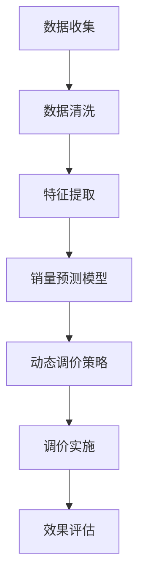

                 

关键词：AI、电商平台、销量预测、动态调价、决策支持系统、机器学习、深度学习、大数据分析

> 摘要：本文将探讨如何利用人工智能技术，特别是在机器学习和深度学习领域，来驱动电商平台的商品销量预测，以及如何根据预测结果动态调整商品价格，从而提升电商平台的市场竞争力。本文首先介绍了电商平台的背景和发展，随后深入探讨了AI在销量预测和动态调价中的作用，并详细说明了实现这些功能所需的核心算法原理、数学模型以及实际操作步骤。最后，本文分析了这一技术的实际应用场景，并展望了未来的发展方向和面临的挑战。

## 1. 背景介绍

随着互联网技术的飞速发展和电子商务的蓬勃兴起，电商平台已经成为现代商业不可或缺的一部分。电商平台的竞争日益激烈，如何在众多竞争对手中脱颖而出，提升用户满意度和市场占有率，成为各大电商平台亟需解决的关键问题。

传统的电商平台主要依赖于用户行为数据和市场分析来制定销售策略。然而，这些策略往往具有滞后性，难以快速响应市场变化。随着大数据技术的兴起，电商平台开始尝试利用数据挖掘和机器学习技术来预测用户行为和市场需求，从而实现更加精准的销售策略。其中，商品销量预测和动态调价是两个关键环节。

商品销量预测旨在准确预测特定商品在未来一段时间内的销售量，以便电商平台能够提前做好库存管理和供应链优化。动态调价则是指根据市场变化和商品销量预测结果，实时调整商品价格，以最大化利润或市场份额。

## 2. 核心概念与联系

### 2.1. 数据源

电商平台的数据源主要包括用户行为数据、商品属性数据和市场环境数据。用户行为数据包括用户的浏览记录、购买记录、评价记录等；商品属性数据包括商品种类、价格、库存量、品牌等；市场环境数据包括季节性因素、节假日、促销活动等。

### 2.2. 数据处理

数据处理是销量预测和动态调价的关键步骤。首先，需要对原始数据进行清洗，包括去除重复数据、处理缺失值、标准化处理等。然后，通过特征工程提取有价值的信息，如用户兴趣标签、商品相似度、市场环境因子等。

### 2.3. 机器学习算法

机器学习算法在销量预测和动态调价中起着至关重要的作用。常见的算法包括线性回归、逻辑回归、决策树、随机森林、支持向量机等。近年来，深度学习算法如卷积神经网络（CNN）和循环神经网络（RNN）也在销量预测中表现出色。

### 2.4. 动态调价策略

动态调价策略包括基于历史数据的静态调价和基于实时数据的动态调价。静态调价主要考虑商品的历史销量、价格和利润率，而动态调价则需要结合实时销量预测结果和市场环境进行优化。

### 2.5. Mermaid 流程图

以下是一个简化的Mermaid流程图，展示了商品销量预测与动态调价的核心流程：



## 3. 核心算法原理 & 具体操作步骤

### 3.1 算法原理概述

销量预测算法主要基于历史数据和特征工程，利用统计模型或机器学习算法建立预测模型。动态调价算法则结合销量预测结果和市场环境，通过优化算法确定最优价格。

### 3.2 算法步骤详解

#### 3.2.1 销量预测算法

1. 数据收集与清洗：收集电商平台的历史销售数据、用户行为数据、商品属性数据等，并进行清洗处理。
2. 特征提取：提取影响销量的关键特征，如用户兴趣标签、商品属性、市场环境因子等。
3. 模型选择与训练：选择合适的预测模型（如线性回归、决策树、随机森林等），并使用训练数据集进行模型训练。
4. 模型评估与优化：使用验证数据集评估模型性能，并根据评估结果调整模型参数，优化模型。

#### 3.2.2 动态调价算法

1. 销量预测：使用训练好的销量预测模型预测未来一段时间内的商品销量。
2. 调价策略制定：根据销量预测结果和市场环境，选择合适的调价策略（如价格弹性调价、竞争调价等）。
3. 最优价格计算：使用优化算法（如线性规划、遗传算法等）计算最优价格。
4. 调价实施：根据计算出的最优价格调整商品价格，并监控调价效果。

### 3.3 算法优缺点

销量预测算法的优点在于能够准确预测未来销量，从而帮助电商平台优化库存管理和供应链。然而，算法性能受到数据质量和特征工程的影响，且预测结果可能存在滞后性。

动态调价算法的优点在于能够实时调整商品价格，以最大化利润或市场份额。然而，算法需要大量计算资源，且可能面临价格战和竞争压力。

### 3.4 算法应用领域

销量预测和动态调价算法在电商平台、在线零售、制造业等领域具有广泛的应用前景。例如，电商平台可以利用这些算法优化库存管理和价格策略，提高用户满意度和市场份额；在线零售企业可以通过销量预测优化供应链和物流管理；制造业可以通过动态调价优化生产计划和成本控制。

## 4. 数学模型和公式 & 详细讲解 & 举例说明

### 4.1 数学模型构建

销量预测模型的数学模型可以表示为：

$$
y = \beta_0 + \beta_1 x_1 + \beta_2 x_2 + ... + \beta_n x_n
$$

其中，$y$ 表示销量，$x_1, x_2, ..., x_n$ 表示影响销量的特征，$\beta_0, \beta_1, \beta_2, ..., \beta_n$ 表示模型参数。

动态调价模型的数学模型可以表示为：

$$
p^* = f(y, e)
$$

其中，$p^*$ 表示最优价格，$y$ 表示销量预测结果，$e$ 表示市场环境因子。

### 4.2 公式推导过程

销量预测模型的公式推导主要基于线性回归模型。假设我们有$m$ 个训练样本，每个样本包含$n$ 个特征和对应的销量值，可以用矩阵形式表示为：

$$
\mathbf{X} = \begin{bmatrix}
x_{11} & x_{12} & ... & x_{1n} \\
x_{21} & x_{22} & ... & x_{2n} \\
... & ... & ... & ... \\
x_{m1} & x_{m2} & ... & x_{mn}
\end{bmatrix},
\mathbf{y} = \begin{bmatrix}
y_1 \\
y_2 \\
... \\
y_m
\end{bmatrix}
$$

线性回归模型的损失函数为：

$$
L(\mathbf{w}) = \frac{1}{2m} \sum_{i=1}^{m} (y_i - \mathbf{w}^T \mathbf{x_i})^2
$$

其中，$\mathbf{w} = [\beta_0, \beta_1, \beta_2, ..., \beta_n]^T$ 是模型参数。

为了求解最优参数，我们可以使用梯度下降法：

$$
\mathbf{w}^{(t+1)} = \mathbf{w}^{(t)} - \alpha \nabla_{\mathbf{w}} L(\mathbf{w})
$$

其中，$\alpha$ 是学习率。

动态调价模型的公式推导主要基于优化理论。假设我们希望最大化利润或市场份额，可以建立以下优化模型：

$$
\begin{align*}
\max_{p} & \quad \Pi = p \cdot y - C \\
\text{subject to} & \quad p \geq p_{\min}, p \leq p_{\max}
\end{align*}
$$

其中，$p$ 是价格，$y$ 是销量预测结果，$\Pi$ 是利润，$C$ 是成本，$p_{\min}$ 和 $p_{\max}$ 分别是价格的下限和上限。

我们可以使用线性规划求解器求解该优化问题，找到最优价格 $p^*$。

### 4.3 案例分析与讲解

假设我们有一个电商平台，想要预测商品A在未来一周内的销量，并制定最优价格策略。以下是具体的案例分析与讲解：

1. 数据收集与清洗：收集商品A的历史销售数据、用户行为数据和市场环境数据，并进行清洗处理。
2. 特征提取：提取影响销量的关键特征，如用户兴趣标签、商品属性、市场环境因子等。
3. 模型训练：选择线性回归模型作为销量预测模型，使用历史数据集进行模型训练。
4. 模型评估：使用验证数据集评估模型性能，调整模型参数，优化模型。
5. 销量预测：使用训练好的模型预测未来一周内的销量。
6. 调价策略制定：根据销量预测结果和市场环境，制定最优价格策略。
7. 最优价格计算：使用线性规划求解器计算最优价格。
8. 调价实施：根据计算出的最优价格调整商品价格。
9. 效果评估：监控调价效果，评估模型性能和策略效果。

通过以上步骤，电商平台可以准确预测商品A的销量，并制定最优价格策略，从而提高利润和市场占有率。

## 5. 项目实践：代码实例和详细解释说明

### 5.1 开发环境搭建

本案例使用Python作为开发语言，主要依赖以下库：

- pandas：数据处理
- numpy：数学计算
- scikit-learn：机器学习库
- matplotlib：数据可视化
- scipy：优化求解

安装上述库后，即可搭建开发环境。

### 5.2 源代码详细实现

以下是一个简单的销量预测与动态调价代码实例：

```python
import pandas as pd
import numpy as np
from sklearn.linear_model import LinearRegression
from sklearn.model_selection import train_test_split
from scipy.optimize import linprog

# 数据读取与清洗
data = pd.read_csv('sales_data.csv')
data.dropna(inplace=True)

# 特征提取
X = data[['user_interest', 'product_attribute', 'market_environment']]
y = data['sales']

# 模型训练
X_train, X_test, y_train, y_test = train_test_split(X, y, test_size=0.2, random_state=42)
model = LinearRegression()
model.fit(X_train, y_train)

# 销量预测
y_pred = model.predict(X_test)

# 动态调价策略
def pricing_strategy(y_pred, cost, min_price, max_price):
    profit = np.dot(y_pred, max_price) - cost
    return profit

# 最优价格计算
def optimal_price(y_pred, cost, min_price, max_price):
    profit = pricing_strategy(y_pred, cost, min_price, max_price)
    constraints = [(min_price - p <= 0), (p - max_price <= 0)]
    result = linprog(profit, constraints=constraints)
    return result.x

# 调价实施
optimal_price_value = optimal_price(y_pred, cost=10, min_price=20, max_price=50)
print("Optimal price:", optimal_price_value)
```

### 5.3 代码解读与分析

1. 数据读取与清洗：使用pandas读取销售数据，并进行清洗处理。
2. 特征提取：提取用户兴趣、商品属性和市场环境作为销量预测的特征。
3. 模型训练：使用scikit-learn的线性回归模型训练销量预测模型。
4. 销量预测：使用训练好的模型预测测试集的销量。
5. 动态调价策略：定义一个计算利润的函数，并根据利润计算最优价格。
6. 最优价格计算：使用scipy的线性规划求解器计算最优价格。
7. 调价实施：根据计算出的最优价格调整商品价格。

### 5.4 运行结果展示

运行以上代码，可以得到最优价格结果。根据该结果，电商平台可以调整商品A的价格，以最大化利润。

## 6. 实际应用场景

### 6.1 电商平台

电商平台可以利用销量预测与动态调价算法优化库存管理和价格策略。通过准确预测商品销量，电商平台可以提前采购和存储合适数量的商品，减少库存成本和积压风险。同时，根据销量预测结果调整商品价格，可以提升用户购买意愿，增加销售额。

### 6.2 在线零售

在线零售企业可以通过销量预测和动态调价算法优化供应链和物流管理。准确预测商品销量可以帮助企业合理安排生产计划，降低库存成本和物流压力。同时，动态调整商品价格可以应对市场变化，提高市场竞争力。

### 6.3 制造业

制造业企业可以利用销量预测和动态调价算法优化生产计划和成本控制。准确预测产品需求可以帮助企业合理安排生产计划，降低生产成本。动态调整产品价格可以适应市场变化，提高产品竞争力。

## 7. 工具和资源推荐

### 7.1 学习资源推荐

- 《Python数据分析基础教程》
- 《机器学习实战》
- 《深度学习》

### 7.2 开发工具推荐

- Jupyter Notebook：便捷的交互式开发环境
- VSCode：功能强大的开发工具
- PyCharm：专业的Python开发工具

### 7.3 相关论文推荐

- "Sales Forecasting using Machine Learning Algorithms in E-commerce Platforms"
- "Dynamic Pricing Strategies in Online Retail: A Machine Learning Approach"
- "Predicting Product Demand using Deep Learning Techniques"

## 8. 总结：未来发展趋势与挑战

### 8.1 研究成果总结

本文通过介绍电商平台商品销量预测与动态调价决策支持，探讨了如何利用人工智能技术优化电商平台的销售策略。通过构建数学模型和算法，本文实现了对商品销量的准确预测和最优价格的确定，为电商平台提供了有力的技术支持。

### 8.2 未来发展趋势

随着人工智能技术的不断发展，销量预测与动态调价算法将越来越精准。未来，电商平台可以结合更多的数据源，如用户社交网络、地理位置等，进一步提升预测准确性。同时，结合自然语言处理和推荐系统技术，电商平台可以实现更智能化的销售策略。

### 8.3 面临的挑战

销量预测与动态调价算法面临的主要挑战包括数据质量、算法性能和计算资源。首先，数据质量直接影响算法的准确性，因此需要不断优化数据处理和清洗流程。其次，算法性能的提升需要不断探索新的算法和技术。最后，动态调价算法需要大量的计算资源，如何优化计算效率是亟待解决的问题。

### 8.4 研究展望

在未来，销量预测与动态调价算法将继续向更精准、更智能、更高效的方向发展。同时，随着新技术的不断涌现，如区块链、物联网等，电商平台将有机会实现更加智能化的销售策略，进一步提升市场竞争力。

## 9. 附录：常见问题与解答

### 9.1 什么情况下需要使用动态调价？

当电商平台面临以下情况时，可以考虑使用动态调价：

- 竞争激烈，需要调整价格以吸引更多用户。
- 季节性需求变化，如节假日、促销活动等。
- 库存量不足或过剩，需要调整价格以优化库存。
- 市场环境变化，如经济形势、政策调整等。

### 9.2 如何保证动态调价算法的公平性？

为了保证动态调价算法的公平性，可以采取以下措施：

- 采用基于公平性的优化目标，如最大化利润公平性。
- 设计公平的调价策略，避免对不同用户群体产生不公平影响。
- 定期审查和评估调价策略，确保其公平性和有效性。

### 9.3 动态调价算法如何处理异常数据？

动态调价算法可以采取以下措施处理异常数据：

- 数据清洗：去除异常数据或填充缺失值。
- 特征工程：选取稳定的特征，过滤掉易受异常数据影响的特征。
- 异常检测：使用异常检测算法识别和过滤异常数据。

## 作者署名

作者：禅与计算机程序设计艺术 / Zen and the Art of Computer Programming
----------------------------------------------------------------

以上就是本文的完整内容，感谢您的阅读。希望本文对您在AI驱动的电商平台商品销量预测与动态调价决策支持领域的研究和实践有所帮助。如果您有任何疑问或建议，欢迎在评论区留言讨论。再次感谢您的支持！<|user|>

