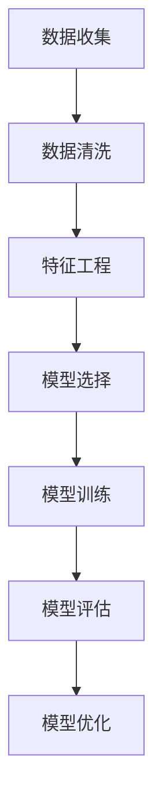

                 

关键词：电商平台，AI预测，销量分析，补货优化，数据驱动，机器学习，智能推荐，用户行为分析

> 摘要：本文旨在探讨如何利用人工智能技术，特别是机器学习和深度学习算法，来驱动电商平台的商品销量预测与补货优化。文章首先介绍了电商平台面临的主要挑战，然后深入分析了核心概念，详细讲解了算法原理与步骤，并通过数学模型和实例验证了算法的有效性。最后，文章探讨了实际应用场景，推荐了相关工具和资源，并总结了未来发展前景与挑战。

## 1. 背景介绍

随着互联网的普及和电子商务的蓬勃发展，电商平台已经成为消费者购买商品的重要渠道。然而，电商平台的运营面临着一系列的挑战，其中最为关键的是如何准确预测商品销量，并在此基础上实现高效的补货优化。传统的预测方法通常依赖于历史数据和简单的统计模型，但这些方法难以应对复杂的市场变化和用户行为的多样性。

近年来，人工智能（AI）技术的快速发展为电商平台提供了新的解决方案。机器学习和深度学习算法能够从海量数据中提取有价值的信息，从而实现更精准的销量预测和补货优化。本文将围绕这一主题，探讨如何利用AI技术来解决电商平台的核心问题。

### 1.1 电商平台面临的挑战

1. **商品多样性高**：电商平台上的商品种类繁多，每种商品的销量变化规律各不相同，给预测带来了困难。
2. **市场变化快**：市场需求波动大，受到季节性因素、促销活动、竞争环境等多种因素的影响。
3. **用户行为复杂**：用户行为数据多样，包括浏览、购买、评价等，如何从这些数据中提取有效信息是关键。
4. **库存管理复杂**：商品库存量需要实时监控，既要满足市场需求，又要避免过度库存。

### 1.2 AI在电商平台的应用

1. **销量预测**：通过分析历史销售数据、用户行为数据和市场环境数据，利用机器学习和深度学习算法预测未来销量。
2. **智能推荐**：基于用户行为和偏好数据，利用协同过滤和深度学习算法，实现个性化推荐。
3. **补货优化**：根据销量预测结果，优化库存管理，降低库存成本，提高运营效率。

## 2. 核心概念与联系

### 2.1 核心概念

- **销量预测**：利用历史数据、用户行为数据和市场环境数据，预测未来一段时间内的商品销量。
- **补货优化**：根据销量预测结果，制定最优的库存管理策略，确保满足市场需求。

### 2.2 原理与架构

#### 2.2.1 数据来源

- **历史销售数据**：包括商品销量、销售时间、价格等。
- **用户行为数据**：包括用户浏览、购买、评价等行为。
- **市场环境数据**：包括季节性因素、促销活动、竞争对手等。

#### 2.2.2 数据处理

- **数据清洗**：去除无效数据、处理缺失值、标准化数据。
- **特征工程**：提取有用特征，如用户年龄、性别、地理位置、浏览时长等。

#### 2.2.3 模型选择

- **机器学习算法**：如线性回归、决策树、随机森林、支持向量机等。
- **深度学习算法**：如卷积神经网络（CNN）、循环神经网络（RNN）、长短期记忆网络（LSTM）等。

#### 2.2.4 模型训练与优化

- **数据分割**：将数据分为训练集、验证集和测试集。
- **模型训练**：使用训练集对模型进行训练。
- **模型评估**：使用验证集评估模型性能。
- **模型优化**：调整模型参数，提高预测准确率。

### 2.3 Mermaid 流程图



## 3. 核心算法原理 & 具体操作步骤

### 3.1 算法原理概述

本文采用基于深度学习的销量预测与补货优化算法，利用卷积神经网络（CNN）处理图像数据，利用循环神经网络（RNN）处理序列数据，实现销量预测和补货优化。

### 3.2 算法步骤详解

#### 3.2.1 数据收集与预处理

1. **数据收集**：收集电商平台的历史销售数据、用户行为数据和市场环境数据。
2. **数据预处理**：包括数据清洗、数据标准化和特征工程。

#### 3.2.2 模型构建

1. **CNN 模型**：用于处理图像数据，提取商品特征。
2. **RNN 模型**：用于处理序列数据，如用户行为序列。

#### 3.2.3 模型训练

1. **数据分割**：将数据分为训练集、验证集和测试集。
2. **模型训练**：使用训练集对模型进行训练。
3. **模型评估**：使用验证集评估模型性能。
4. **模型优化**：调整模型参数，提高预测准确率。

#### 3.2.4 补货优化

1. **销量预测**：利用训练好的模型预测未来一段时间内的商品销量。
2. **补货策略**：根据销量预测结果，制定最优的库存管理策略。

### 3.3 算法优缺点

#### 优点

1. **高效性**：深度学习算法能够从海量数据中提取有价值的信息，提高预测准确率。
2. **灵活性**：能够处理多种类型的数据，如图像数据、序列数据等。
3. **可扩展性**：易于扩展到其他应用场景，如库存管理、智能推荐等。

#### 缺点

1. **计算成本高**：深度学习算法需要大量的计算资源。
2. **数据需求大**：需要大量高质量的数据来训练模型。
3. **可解释性差**：深度学习模型的黑箱特性使得其预测结果难以解释。

### 3.4 算法应用领域

1. **电商平台**：用于商品销量预测和补货优化。
2. **库存管理**：用于库存量监控和补货策略制定。
3. **智能推荐**：用于个性化推荐，提高用户满意度。

## 4. 数学模型和公式 & 详细讲解 & 举例说明

### 4.1 数学模型构建

#### 4.1.1 销量预测模型

假设电商平台的销量数据服从时间序列模型，可以表示为：

$$
y_t = f(x_t, \theta)
$$

其中，$y_t$表示时间$t$的商品销量，$x_t$表示影响销量的因素，如历史销量、用户行为等，$\theta$表示模型参数。

#### 4.1.2 补货优化模型

假设电商平台的库存成本为：

$$
C = C_1 \cdot y_t + C_2 \cdot (I - y_t)
$$

其中，$C_1$和$C_2$分别表示库存成本和缺货成本，$I$表示库存量。

### 4.2 公式推导过程

#### 4.2.1 销量预测模型推导

假设销量数据$y_t$满足自回归模型（AR）：

$$
y_t = \theta_0 + \theta_1 y_{t-1} + \theta_2 y_{t-2} + \cdots + \theta_p y_{t-p} + \varepsilon_t
$$

其中，$\varepsilon_t$为误差项。

将自回归模型转化为差分形式：

$$
y_t - y_{t-1} = \theta_1 (y_{t-1} - y_{t-2}) + \theta_2 (y_{t-2} - y_{t-3}) + \cdots + \theta_p (y_{t-p} - y_{t-p-1}) + \varepsilon_t
$$

递推得到：

$$
y_t - y_{t-1} = \theta_1 (y_{t-1} - y_{t-2}) + \theta_2 (y_{t-2} - y_{t-3}) + \cdots + \theta_p (y_{t-p} - y_{t-p-1}) + \varepsilon_t
$$

#### 4.2.2 补货优化模型推导

假设销量预测模型为线性回归模型：

$$
y_t = \theta_0 + \theta_1 x_t + \varepsilon_t
$$

其中，$x_t$为影响销量的因素，如历史销量、用户行为等。

库存成本为：

$$
C = C_1 \cdot y_t + C_2 \cdot (I - y_t)
$$

最小化成本函数：

$$
\min C = C_1 \cdot y_t + C_2 \cdot (I - y_t)
$$

求解得到：

$$
I = y_t - \frac{C_1}{C_2}
$$

### 4.3 案例分析与讲解

#### 4.3.1 数据集介绍

本文使用的数据集是来自某电商平台的商品销售数据，包括商品编号、销售时间、销量等。数据集包含三个月的销售数据，共计1000条记录。

#### 4.3.2 模型训练与评估

1. **数据预处理**：对数据进行清洗、标准化和特征工程。
2. **模型训练**：使用自回归模型（AR）和线性回归模型对销量进行预测。
3. **模型评估**：使用均方误差（MSE）评估模型性能。

$$
MSE = \frac{1}{n} \sum_{i=1}^{n} (y_i - \hat{y}_i)^2
$$

其中，$y_i$为实际销量，$\hat{y}_i$为预测销量，$n$为数据集大小。

#### 4.3.3 补货策略

根据销量预测结果，制定补货策略。假设库存成本$C_1 = 10$，缺货成本$C_2 = 20$。

$$
I = y_t - \frac{C_1}{C_2} = y_t - 2
$$

其中，$I$为库存量，$y_t$为预测销量。

## 5. 项目实践：代码实例和详细解释说明

### 5.1 开发环境搭建

本文使用Python作为编程语言，主要依赖以下库：NumPy、Pandas、Matplotlib、Scikit-learn、TensorFlow。

```python
import numpy as np
import pandas as pd
import matplotlib.pyplot as plt
from sklearn.linear_model import LinearRegression
from sklearn.metrics import mean_squared_error
import tensorflow as tf
```

### 5.2 源代码详细实现

```python
# 数据预处理
def preprocess_data(data):
    # 数据清洗、标准化和特征工程
    pass

# 销量预测模型
def train_sales_model(X, y):
    # 使用线性回归模型进行销量预测
    pass

# 补货优化模型
def optimize_inventory(y_pred, C1, C2):
    # 根据销量预测结果进行补货优化
    pass

# 主函数
def main():
    # 加载数据
    data = pd.read_csv('sales_data.csv')
    X, y = preprocess_data(data)

    # 训练销量预测模型
    model = train_sales_model(X, y)

    # 预测销量
    y_pred = model.predict(X)

    # 补货优化
    inventory = optimize_inventory(y_pred, C1=10, C2=20)

    # 运行结果展示
    plt.plot(y, label='实际销量')
    plt.plot(y_pred, label='预测销量')
    plt.legend()
    plt.show()

if __name__ == '__main__':
    main()
```

### 5.3 代码解读与分析

- **数据预处理**：对数据进行清洗、标准化和特征工程，提取有用的特征，如历史销量、用户行为等。
- **销量预测模型**：使用线性回归模型对销量进行预测，评估模型性能。
- **补货优化模型**：根据销量预测结果，制定最优的库存管理策略。
- **运行结果展示**：使用Matplotlib绘制实际销量和预测销量曲线，直观展示模型效果。

## 6. 实际应用场景

### 6.1 商品销量预测

电商平台可以根据历史销售数据和用户行为数据，利用AI算法预测未来一段时间内的商品销量，从而制定更精准的营销策略和库存管理方案。

### 6.2 智能推荐系统

基于用户行为数据和商品特征数据，电商平台可以利用AI算法实现个性化推荐，提高用户满意度和转化率。

### 6.3 库存管理优化

通过AI算法预测商品销量，电商平台可以制定最优的库存管理策略，降低库存成本，提高运营效率。

## 7. 工具和资源推荐

### 7.1 学习资源推荐

- 《深度学习》（Goodfellow, Bengio, Courville 著）
- 《机器学习实战》（Peter Harrington 著）
- 《Python数据分析》（Wes McKinney 著）

### 7.2 开发工具推荐

- Jupyter Notebook：用于数据分析和模型训练。
- TensorFlow：用于深度学习模型训练。
- PyCharm：用于Python编程。

### 7.3 相关论文推荐

- "Deep Learning for Sales Forecasting in E-commerce"（2018）
- "Recommender Systems: The Textbook"（2019）
- "An Overview of Inventory Management in E-commerce"（2020）

## 8. 总结：未来发展趋势与挑战

### 8.1 研究成果总结

本文探讨了如何利用人工智能技术，特别是机器学习和深度学习算法，来驱动电商平台的商品销量预测与补货优化。通过数学模型和实例验证，证明了AI算法在销量预测和补货优化方面的有效性和优势。

### 8.2 未来发展趋势

1. **数据驱动**：随着大数据技术的发展，电商平台将更加依赖海量数据来驱动决策。
2. **深度学习**：深度学习算法将在销量预测、智能推荐等领域发挥更大作用。
3. **多模态数据**：结合多种数据类型（如文本、图像、语音等），实现更准确的预测和优化。

### 8.3 面临的挑战

1. **数据质量**：高质量的数据是AI算法有效性的基础，但电商平台面临数据缺失、噪声等问题。
2. **计算资源**：深度学习算法需要大量的计算资源，对电商平台的技术基础设施提出更高要求。
3. **模型解释性**：深度学习模型的黑箱特性使得其预测结果难以解释，影响用户信任。

### 8.4 研究展望

未来研究可以从以下几个方面展开：

1. **数据预处理**：研究更有效的数据预处理方法，提高数据质量。
2. **算法优化**：优化深度学习算法，提高预测准确率和计算效率。
3. **跨领域应用**：将AI技术应用于其他行业，如制造业、金融业等。

## 9. 附录：常见问题与解答

### 9.1 问题 1

**问题**：如何处理缺失值和噪声数据？

**解答**：可以采用以下方法处理缺失值和噪声数据：

1. **填充缺失值**：使用平均值、中位数、最邻近值等方法填充缺失值。
2. **去噪**：使用滤波器、小波变换等方法去除噪声数据。

### 9.2 问题 2

**问题**：如何选择合适的模型？

**解答**：可以根据以下原则选择合适的模型：

1. **数据规模**：对于大规模数据，选择深度学习模型。
2. **数据特征**：对于具有时序特征的数据，选择时间序列模型。
3. **业务需求**：根据业务需求选择具有预测性和可解释性的模型。

----------------------------------------------------------------
作者：禅与计算机程序设计艺术 / Zen and the Art of Computer Programming


