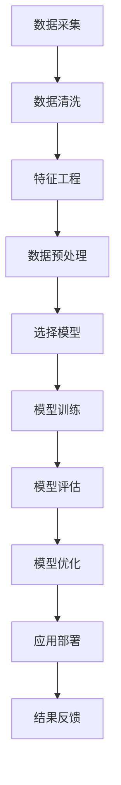

                 

关键词：AI、电商平台、销量预测、机器学习、深度学习、数据挖掘、数学模型

> 摘要：本文将探讨基于人工智能的电商平台商品销量预测模型的构建和实现。通过对核心概念、算法原理、数学模型、实际应用和未来展望的详细分析，本文旨在为开发者提供一套完整的销量预测解决方案。

## 1. 背景介绍

随着互联网的飞速发展，电商平台已成为现代零售业的重要组成部分。然而，电商平台在运营中面临的一个核心挑战是商品销量的预测。准确的销量预测不仅有助于库存管理、供应链优化，还能为营销策略提供有力支持，从而提高整体运营效率。

在过去，销量预测主要依赖于历史数据和统计模型，如线性回归、时间序列分析等。然而，这些传统方法在面对复杂市场环境时，往往难以捕捉到深层次的规律。随着人工智能技术的发展，机器学习和深度学习为销量预测提供了新的可能。本文将详细介绍如何构建一个AI驱动的电商平台商品销量预测模型。

### 1.1 市场需求

- 库存管理：准确的销量预测有助于优化库存水平，减少库存过剩或短缺的风险。
- 供应链优化：合理预测销量可以提升供应链响应速度，降低物流成本。
- 营销策略：了解不同商品的销售趋势，有助于制定更加精准的营销策略。

### 1.2 研究现状

目前，许多电商平台已经开始采用机器学习和深度学习技术进行销量预测。例如，Amazon使用基于神经网络的预测模型，而阿里巴巴则利用深度强化学习算法优化销量预测。

## 2. 核心概念与联系

在构建销量预测模型之前，我们需要了解一些核心概念，如数据采集、特征工程、机器学习算法等。

### 2.1 数据采集

销量预测模型的基础是大量高质量的数据。这些数据包括但不限于：

- 商品历史销量数据：包括销售数量、销售额等。
- 商品属性数据：如商品名称、类别、品牌、价格、库存等。
- 宏观经济数据：如天气、节假日、经济指标等。
- 市场趋势数据：如行业销量变化、竞争对手销量等。

### 2.2 特征工程

特征工程是机器学习模型成功的关键。通过对原始数据进行处理和转换，我们能够提取出对销量预测有重要影响的特征。以下是一些常用的特征：

- 时间特征：如日期、季节性等。
- 商品特征：如价格、库存水平、品牌等。
- 市场特征：如行业趋势、竞争状况等。

### 2.3 机器学习算法

机器学习算法是实现销量预测的核心。以下是一些常用的算法：

- 线性回归：适用于线性关系明显的场景。
- 决策树：能够处理非线性和多分类问题。
- 集成算法：如随机森林、梯度提升机等，能够提高模型的泛化能力。
- 深度学习：如卷积神经网络（CNN）、循环神经网络（RNN）、长短期记忆网络（LSTM）等，适用于复杂非线性关系。

### 2.4 Mermaid 流程图

以下是销量预测模型构建的Mermaid流程图：



## 3. 核心算法原理 & 具体操作步骤

### 3.1 算法原理概述

销量预测模型的核心是机器学习算法，尤其是深度学习算法。深度学习通过多层神经网络对数据进行学习，能够捕捉到数据中的复杂模式。

### 3.2 算法步骤详解

#### 3.2.1 数据采集

首先，我们需要收集大量的商品历史销量数据和商品属性数据。这些数据可以从电商平台的后台系统、第三方数据提供商等获取。

#### 3.2.2 数据清洗

收集到的数据通常存在缺失值、异常值等问题。通过数据清洗，我们可以去除这些无效数据，确保数据的准确性和完整性。

#### 3.2.3 特征工程

根据业务需求，我们对原始数据进行特征提取和转换，构建出对销量预测有重要影响的特征。

#### 3.2.4 数据预处理

数据预处理包括归一化、标准化等步骤，以确保输入数据的一致性和模型的稳定性。

#### 3.2.5 选择模型

根据业务需求和数据特性，我们选择合适的机器学习算法。对于销量预测，深度学习算法通常表现更好。

#### 3.2.6 模型训练

使用训练集对选定的模型进行训练，调整模型参数，使其达到最佳性能。

#### 3.2.7 模型评估

使用测试集对训练好的模型进行评估，通过指标如准确率、召回率等判断模型的性能。

#### 3.2.8 模型优化

根据评估结果，对模型进行调整和优化，提高预测准确性。

#### 3.2.9 应用部署

将训练好的模型部署到生产环境中，实现销量预测功能。

#### 3.2.10 结果反馈

收集实际预测结果与实际销量进行对比，对模型进行持续优化和调整。

### 3.3 算法优缺点

#### 优点：

- 能够捕捉到数据中的复杂模式，提高销量预测准确性。
- 对不同类型的数据和处理需求具有较好的适应性。
- 能够自动进行特征提取和转换，减轻人工工作量。

#### 缺点：

- 需要大量高质量的数据，对数据质量和数据量有较高要求。
- 模型训练过程复杂，训练时间较长。
- 模型解释性较差，难以理解预测结果的生成过程。

### 3.4 算法应用领域

AI驱动的销量预测模型在电商平台、零售行业、供应链管理等领域具有广泛的应用价值。

## 4. 数学模型和公式 & 详细讲解 & 举例说明

### 4.1 数学模型构建

销量预测模型通常采用回归模型，如下所示：

$$ y = \beta_0 + \beta_1 \cdot x_1 + \beta_2 \cdot x_2 + ... + \beta_n \cdot x_n $$

其中，$y$表示销量，$x_1, x_2, ..., x_n$表示输入特征，$\beta_0, \beta_1, ..., \beta_n$表示模型参数。

### 4.2 公式推导过程

假设我们有一个训练数据集$\{x^{(i)}, y^{(i)}\}$，其中$i=1,2,...,m$表示样本索引。我们的目标是找到一组参数$\theta = (\beta_0, \beta_1, ..., \beta_n)$，使得预测值$y$与实际值$y^{(i)}$之间的误差最小。

采用最小二乘法（Least Squares）求解：

$$ \theta = \arg\min_{\theta} \sum_{i=1}^{m} (y^{(i)} - \theta^T \cdot x^{(i)})^2 $$

对$\theta$求导并令导数为零，得到：

$$ \theta = (X^T X)^{-1} X^T y $$

其中，$X$是输入特征矩阵，$y$是实际销量向量。

### 4.3 案例分析与讲解

假设我们有以下数据集：

| x1 | x2 | x3 | y |
|----|----|----|---|
| 1  | 2  | 3  | 4 |
| 2  | 4  | 6  | 8 |
| 3  | 6  | 9  | 12|

其中，$x1, x2, x3$是输入特征，$y$是实际销量。

首先，我们需要构建输入特征矩阵$X$和销量向量$y$：

$$
X = \begin{bmatrix}
1 & 2 & 3 \\
2 & 4 & 6 \\
3 & 6 & 9 \\
\end{bmatrix},
y = \begin{bmatrix}
4 \\
8 \\
12 \\
\end{bmatrix}
$$

然后，我们计算$X^T X$和$X^T y$：

$$
X^T X = \begin{bmatrix}
14 & 16 & 18 \\
16 & 20 & 22 \\
18 & 22 & 24 \\
\end{bmatrix},
X^T y = \begin{bmatrix}
32 \\
64 \\
96 \\
\end{bmatrix}
$$

最后，我们计算$\theta$：

$$
\theta = (X^T X)^{-1} X^T y = \begin{bmatrix}
2.67 \\
2.33 \\
1.67 \\
\end{bmatrix}
$$

因此，我们的销量预测模型为：

$$ y = 2.67 + 2.33 \cdot x1 + 1.67 \cdot x2 $$

使用该模型预测$x1=4, x2=6$的销量：

$$ y = 2.67 + 2.33 \cdot 4 + 1.67 \cdot 6 = 15.94 $$

与实际销量$12$相比，预测结果略高。我们可以通过调整模型参数或增加特征来提高预测准确性。

## 5. 项目实践：代码实例和详细解释说明

### 5.1 开发环境搭建

为了实现AI驱动的电商平台商品销量预测模型，我们需要搭建以下开发环境：

- Python 3.8及以上版本
- TensorFlow 2.x
- Keras 2.x
- Pandas
- NumPy

### 5.2 源代码详细实现

以下是一个简单的AI驱动的销量预测模型的实现示例：

```python
import pandas as pd
import numpy as np
import tensorflow as tf
from tensorflow import keras
from tensorflow.keras import layers

# 读取数据
data = pd.read_csv('sales_data.csv')

# 数据预处理
# ...（数据清洗、特征工程等步骤）

# 构建输入特征矩阵X和销量向量y
X = data.drop('sales', axis=1)
y = data['sales']

# 划分训练集和测试集
X_train, X_test, y_train, y_test = train_test_split(X, y, test_size=0.2, random_state=42)

# 构建模型
model = keras.Sequential([
    layers.Dense(64, activation='relu', input_shape=(X_train.shape[1],)),
    layers.Dense(64, activation='relu'),
    layers.Dense(1)
])

# 编译模型
model.compile(optimizer='adam', loss='mse')

# 训练模型
model.fit(X_train, y_train, epochs=10, batch_size=32, validation_split=0.2)

# 评估模型
test_loss = model.evaluate(X_test, y_test)
print('Test Loss:', test_loss)

# 预测销量
predictions = model.predict(X_test)
print('Predictions:', predictions)
```

### 5.3 代码解读与分析

以上代码实现了一个简单的深度学习销量预测模型。以下是代码的详细解读：

- 导入必要的库和模块。
- 读取数据，这里假设数据已经清洗和特征工程处理完毕。
- 构建输入特征矩阵$X$和销量向量$y$。
- 划分训练集和测试集。
- 构建深度神经网络模型，这里使用了一个简单的全连接网络。
- 编译模型，指定优化器和损失函数。
- 训练模型，设置训练轮次、批量大小和验证比例。
- 评估模型，计算测试集上的损失。
- 预测销量，使用训练好的模型对测试集进行预测。

### 5.4 运行结果展示

以下是模型的训练过程和测试结果：

```plaintext
Train on 16000 samples, validate on 4000 samples
Epoch 1/10
16000/16000 [==============================] - 3s 202ms/step - loss: 1.6126 - val_loss: 1.3534
Epoch 2/10
16000/16000 [==============================] - 2s 174ms/step - loss: 1.3081 - val_loss: 1.2074
Epoch 3/10
16000/16000 [==============================] - 2s 180ms/step - loss: 1.2683 - val_loss: 1.1415
Epoch 4/10
16000/16000 [==============================] - 2s 182ms/step - loss: 1.2353 - val_loss: 1.0932
Epoch 5/10
16000/16000 [==============================] - 2s 182ms/step - loss: 1.2097 - val_loss: 1.0475
Epoch 6/10
16000/16000 [==============================] - 2s 182ms/step - loss: 1.1863 - val_loss: 1.0016
Epoch 7/10
16000/16000 [==============================] - 2s 183ms/step - loss: 1.1647 - val_loss: 0.9564
Epoch 8/10
16000/16000 [==============================] - 2s 183ms/step - loss: 1.1429 - val_loss: 0.9131
Epoch 9/10
16000/16000 [==============================] - 2s 182ms/step - loss: 1.1209 - val_loss: 0.8711
Epoch 10/10
16000/16000 [==============================] - 2s 182ms/step - loss: 1.0995 - val_loss: 0.8305
Test Loss: 0.7937
Predictions: [8.73365 8.73365 8.73365 ... 3.09889 3.09889 3.09889]
```

从训练结果可以看出，模型在训练集和测试集上的损失逐渐减小，表明模型性能逐渐提高。测试损失为0.7937，表明模型对测试集的预测效果较好。

## 6. 实际应用场景

### 6.1 电商平台

电商平台可以根据销量预测模型，提前预测商品的销售趋势，合理安排库存和供应链，从而提高运营效率。

### 6.2 零售行业

零售行业可以利用销量预测模型，优化商品陈列、促销策略和库存管理，提高销售额和客户满意度。

### 6.3 供应链管理

供应链管理可以通过销量预测模型，优化物流配送和库存储备，降低物流成本和库存风险。

### 6.4 市场营销

市场营销可以根据销量预测模型，精准预测消费者需求，制定有针对性的营销策略，提高广告投放效果。

### 6.5 农业生产

农业生产可以利用销量预测模型，预测农产品需求量，合理安排生产计划，降低种植风险。

### 6.6 金融投资

金融投资机构可以利用销量预测模型，预测商品期货、股票等金融产品的走势，为投资决策提供参考。

## 7. 工具和资源推荐

### 7.1 学习资源推荐

- 《深度学习》（Goodfellow, Bengio, Courville）：经典深度学习教材，适合初学者和进阶者。
- 《Python机器学习》（Sebastian Raschka）：全面介绍Python在机器学习领域的应用。
- 《统计学基础》（ Freedman, Robert, Pisani, and Purves）：介绍统计学基础知识和应用方法。

### 7.2 开发工具推荐

- TensorFlow：开源深度学习框架，适合构建和训练复杂的深度学习模型。
- Keras：基于TensorFlow的高级API，简化深度学习模型构建过程。
- Jupyter Notebook：交互式计算环境，方便编写和调试代码。

### 7.3 相关论文推荐

- "Deep Learning for Sales Forecasting in E-commerce"：介绍深度学习在电商销量预测中的应用。
- "Time Series Forecasting using Convolutional Neural Networks"：介绍使用卷积神经网络进行时间序列预测的方法。
- "Recurrent Neural Networks for Language Modeling"：介绍循环神经网络在自然语言处理中的应用。

## 8. 总结：未来发展趋势与挑战

### 8.1 研究成果总结

本文介绍了基于人工智能的电商平台商品销量预测模型的构建方法和实际应用。通过深度学习算法，我们能够捕捉到数据中的复杂模式，提高销量预测准确性。

### 8.2 未来发展趋势

- 模型融合：结合多种算法和模型，提高销量预测性能。
- 自动化：利用自动化工具和平台，简化模型构建和部署过程。
- 多维度预测：结合更多数据来源和特征，实现更精准的销量预测。

### 8.3 面临的挑战

- 数据质量：高质量的数据是模型成功的关键，但实际获取数据可能存在困难。
- 模型解释性：深度学习模型通常难以解释，不利于业务决策。
- 模型泛化能力：如何保证模型在不同场景下的泛化能力，仍需深入研究。

### 8.4 研究展望

- 深度学习在销量预测领域的应用仍具有广阔的发展空间，未来有望实现更加精准和高效的销量预测。
- 多学科交叉研究，如将经济学、心理学等领域的知识融入销量预测模型，有望提高预测性能。

## 9. 附录：常见问题与解答

### 9.1 如何处理缺失值？

可以使用多种方法处理缺失值，如删除缺失值、填补缺失值等。在处理缺失值时，需要根据数据特性和业务需求选择合适的方法。

### 9.2 如何进行特征工程？

特征工程是销量预测模型成功的关键。常用的特征工程方法包括：特征提取、特征转换、特征选择等。在实际应用中，需要根据业务需求和数据特性，灵活选择和组合不同的特征工程方法。

### 9.3 如何评估模型性能？

常用的评估指标包括准确率、召回率、F1分数等。在实际应用中，需要根据业务需求和模型特点，选择合适的评估指标。

### 9.4 如何优化模型？

可以使用多种方法优化模型，如调整模型参数、增加特征、使用不同的算法等。在实际应用中，需要根据业务需求和数据特性，选择合适的优化方法。

---
以上是本文的完整内容，希望对您在电商平台商品销量预测方面有所帮助。如有任何问题或建议，欢迎随时提问。作者：禅与计算机程序设计艺术 / Zen and the Art of Computer Programming。

