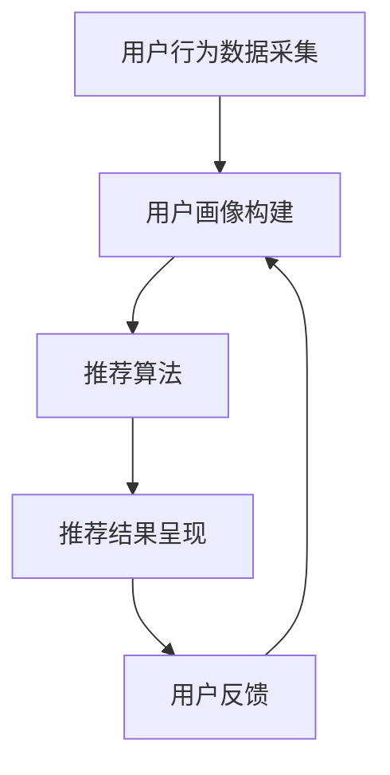

                 

关键词：AI、电商平台、个性化广告、实时投放、用户行为分析、机器学习、推荐系统、数据挖掘

> 摘要：本文将深入探讨AI技术在电商平台实时个性化广告投放中的应用。通过分析用户行为数据和运用机器学习算法，本文提出了一种高效的个性化广告投放策略，旨在提高广告点击率和转化率。本文将详细介绍算法原理、数学模型、实际应用案例以及未来发展趋势。

## 1. 背景介绍

随着互联网的普及和电子商务的快速发展，电商平台已经成为商家和消费者之间的重要桥梁。然而，在竞争激烈的市场环境中，如何提高广告投放效果、吸引潜在客户并提升销售额成为各大电商平台面临的一大挑战。传统的广告投放策略往往依赖于简单的规则匹配和人工干预，无法满足个性化、实时性的需求。因此，利用人工智能（AI）技术，尤其是机器学习和推荐系统，实现实时个性化广告投放，成为当前研究的热点和应用的方向。

### 1.1 电商平台广告投放现状

目前，电商平台广告投放主要面临以下问题：

1. 广告点击率低：传统广告投放策略往往无法准确捕捉用户兴趣，导致广告点击率偏低。
2. 转化率不高：广告内容与用户需求不匹配，导致广告转化率不高。
3. 广告成本高：广告投放过于盲目，无法精确定位目标客户，导致广告成本居高不下。

### 1.2 AI技术在广告投放中的应用优势

AI技术在广告投放中的应用优势主要体现在以下几个方面：

1. 个性化推荐：通过分析用户行为数据，AI技术能够实现个性化推荐，提高广告点击率和转化率。
2. 实时性：AI技术能够实时捕捉用户行为数据，动态调整广告投放策略，提高广告投放的实时性。
3. 自动化：AI技术可以实现广告投放的自动化，降低人力成本，提高广告投放效率。
4. 数据挖掘与分析：AI技术能够对海量用户行为数据进行分析，挖掘用户需求，优化广告内容。

## 2. 核心概念与联系

### 2.1 个性化广告投放概念

个性化广告投放是指根据用户的兴趣、行为和需求，为用户推荐与之相关的高质量广告内容，从而提高广告的点击率和转化率。

### 2.2 用户行为数据

用户行为数据是个性化广告投放的重要依据。用户行为数据包括用户的浏览记录、搜索历史、购买行为、评论等，通过分析这些数据，可以了解用户的兴趣和需求，为广告投放提供依据。

### 2.3 机器学习算法

机器学习算法是AI技术在个性化广告投放中的核心。常见的机器学习算法包括协同过滤、基于内容的推荐、深度学习等。通过这些算法，可以实现对用户行为的分析和预测，从而实现个性化广告投放。

### 2.4 推荐系统架构

推荐系统架构是实现个性化广告投放的关键。推荐系统通常包括用户画像、推荐算法、推荐结果呈现等模块，通过这些模块的协同工作，可以实现个性化广告投放。

### 2.5 Mermaid流程图



## 3. 核心算法原理 & 具体操作步骤

### 3.1 算法原理概述

个性化广告投放算法主要包括用户行为分析、推荐算法设计和推荐结果呈现三个步骤。用户行为分析是基础，通过分析用户的行为数据，构建用户画像；推荐算法设计是实现个性化推荐的核心，根据用户画像和商品特征，选择合适的推荐算法；推荐结果呈现是将个性化推荐结果展示给用户，提高广告点击率和转化率。

### 3.2 算法步骤详解

#### 3.2.1 用户行为分析

用户行为分析包括数据采集、数据处理和用户画像构建三个步骤。数据采集主要是获取用户的浏览记录、搜索历史、购买行为、评论等数据；数据处理是对采集到的数据进行清洗、去重、归一化等处理；用户画像构建是根据处理后的数据，通过特征工程和聚类等方法，将用户划分为不同的群体，为推荐算法提供输入。

#### 3.2.2 推荐算法设计

推荐算法设计是根据用户画像和商品特征，选择合适的推荐算法。常见的推荐算法包括协同过滤、基于内容的推荐和深度学习等。协同过滤算法通过计算用户之间的相似度，为用户推荐相似的物品；基于内容的推荐算法通过分析物品的属性和用户兴趣，为用户推荐相关的物品；深度学习算法通过神经网络模型，自动学习用户兴趣和商品特征，实现个性化推荐。

#### 3.2.3 推荐结果呈现

推荐结果呈现是将个性化推荐结果展示给用户，提高广告点击率和转化率。推荐结果呈现可以通过多种方式，如推荐列表、推荐卡片、弹窗等，根据用户行为和广告投放策略，动态调整推荐结果，提高用户满意度。

### 3.3 算法优缺点

#### 优点

1. 个性化：通过用户行为分析，可以为用户提供个性化的广告内容，提高广告点击率和转化率。
2. 实时性：AI技术可以实时捕捉用户行为数据，动态调整广告投放策略，提高广告投放的实时性。
3. 自动化：AI技术可以实现广告投放的自动化，降低人力成本，提高广告投放效率。
4. 数据挖掘与分析：AI技术能够对海量用户行为数据进行分析，挖掘用户需求，优化广告内容。

#### 缺点

1. 数据隐私：用户行为数据的收集和使用可能涉及用户隐私，需要严格保护用户隐私。
2. 算法偏差：机器学习算法可能存在偏差，导致推荐结果不准确，需要不断优化算法。
3. 计算资源：个性化广告投放需要大量的计算资源，对硬件设施和算法优化要求较高。

### 3.4 算法应用领域

个性化广告投放算法在电商平台、在线购物、社交媒体等场景有广泛的应用。通过个性化广告投放，可以提高用户满意度，提高广告点击率和转化率，从而提升电商平台竞争力。

## 4. 数学模型和公式 & 详细讲解 & 举例说明

### 4.1 数学模型构建

个性化广告投放的核心是推荐系统，推荐系统的主要任务是根据用户画像和商品特征，为用户推荐相关的商品。推荐系统的数学模型通常包括用户-物品矩阵、相似度计算、推荐算法等。

#### 用户-物品矩阵

用户-物品矩阵是一个二维矩阵，其中行表示用户，列表示物品，矩阵中的元素表示用户对物品的评分或行为。例如：

| 用户 | 物品1 | 物品2 | 物品3 | ... |
|------|-------|-------|-------|-----|
| 用户1 | 1     | 0     | 1     | ... |
| 用户2 | 0     | 1     | 0     | ... |
| 用户3 | 1     | 1     | 0     | ... |

其中，1表示用户对物品的评分或行为，0表示没有评分或行为。

#### 相似度计算

相似度计算是推荐系统中的关键步骤，用于计算用户之间的相似度或物品之间的相似度。常见的相似度计算方法包括余弦相似度、皮尔逊相关系数等。

余弦相似度公式：

$$
sim(i, j) = \frac{i \cdot j}{\|i\| \|j\|}
$$

其中，$i$和$j$表示用户或物品的向量表示，$\|i\|$和$\|j\|$表示向量的模长。

#### 推荐算法

推荐算法是根据用户画像和商品特征，为用户推荐相关的商品。常见的推荐算法包括协同过滤、基于内容的推荐和深度学习等。

协同过滤算法的核心思想是利用用户之间的相似度，为用户推荐相似的物品。具体步骤如下：

1. 计算用户之间的相似度。
2. 根据用户之间的相似度，为用户推荐相似的物品。

基于内容的推荐算法的核心思想是分析物品的属性和用户兴趣，为用户推荐相关的物品。具体步骤如下：

1. 分析物品的属性。
2. 分析用户的兴趣。
3. 根据物品的属性和用户的兴趣，为用户推荐相关的物品。

深度学习算法通过神经网络模型，自动学习用户兴趣和商品特征，实现个性化推荐。具体步骤如下：

1. 构建神经网络模型。
2. 训练神经网络模型。
3. 利用训练好的模型，为用户推荐相关的物品。

### 4.2 公式推导过程

以协同过滤算法为例，推导用户之间的相似度计算公式。

假设有两个用户$i$和$j$，它们的向量表示分别为$i$和$j$，它们的模长分别为$\|i\|$和$\|j\|$，它们的内积为$i \cdot j$。根据余弦相似度公式，用户之间的相似度可以表示为：

$$
sim(i, j) = \frac{i \cdot j}{\|i\| \|j\|}
$$

其中，$i \cdot j$表示用户$i$和用户$j$的内积，$\|i\|$和$\|j\|$表示用户$i$和用户$j$的模长。

### 4.3 案例分析与讲解

以一个简单的协同过滤算法为例，说明算法的实现过程。

假设有5个用户，他们的评分矩阵如下：

| 用户 | 物品1 | 物品2 | 物品3 | 物品4 | 物品5 |
|------|-------|-------|-------|-------|-------|
| 用户1 | 1     | 1     | 1     | 1     | 0     |
| 用户2 | 0     | 1     | 0     | 1     | 1     |
| 用户3 | 1     | 0     | 1     | 1     | 1     |
| 用户4 | 1     | 1     | 1     | 0     | 1     |
| 用户5 | 0     | 0     | 1     | 1     | 1     |

首先，计算用户之间的相似度。根据余弦相似度公式，可以得到：

$$
sim(1, 2) = \frac{1 \cdot 0 + 1 \cdot 1 + 1 \cdot 0 + 1 \cdot 1 + 0 \cdot 1}{\sqrt{1^2 + 1^2 + 1^2 + 1^2 + 0^2} \sqrt{0^2 + 1^2 + 0^2 + 1^2 + 1^2}} = \frac{2}{\sqrt{5} \sqrt{3}} = \frac{2}{\sqrt{15}}
$$

$$
sim(1, 3) = \frac{1 \cdot 1 + 1 \cdot 0 + 1 \cdot 1 + 1 \cdot 1 + 0 \cdot 1}{\sqrt{1^2 + 1^2 + 1^2 + 1^2 + 0^2} \sqrt{1^2 + 0^2 + 1^2 + 1^2 + 1^2}} = \frac{3}{\sqrt{5} \sqrt{5}} = \frac{3}{5}
$$

$$
sim(1, 4) = \frac{1 \cdot 1 + 1 \cdot 1 + 1 \cdot 1 + 1 \cdot 0 + 0 \cdot 1}{\sqrt{1^2 + 1^2 + 1^2 + 1^2 + 0^2} \sqrt{1^2 + 1^2 + 1^2 + 0^2 + 1^2}} = \frac{3}{\sqrt{5} \sqrt{5}} = \frac{3}{5}
$$

$$
sim(1, 5) = \frac{1 \cdot 0 + 1 \cdot 0 + 1 \cdot 1 + 1 \cdot 1 + 0 \cdot 1}{\sqrt{1^2 + 1^2 + 1^2 + 1^2 + 0^2} \sqrt{0^2 + 0^2 + 1^2 + 1^2 + 1^2}} = \frac{2}{\sqrt{5} \sqrt{3}} = \frac{2}{\sqrt{15}}
$$

$$
sim(2, 3) = \frac{0 \cdot 1 + 1 \cdot 0 + 0 \cdot 1 + 1 \cdot 1 + 1 \cdot 1}{\sqrt{0^2 + 1^2 + 0^2 + 1^2 + 1^2} \sqrt{1^2 + 0^2 + 1^2 + 1^2 + 1^2}} = \frac{2}{\sqrt{3} \sqrt{5}} = \frac{2}{\sqrt{15}}
$$

$$
sim(2, 4) = \frac{0 \cdot 1 + 1 \cdot 1 + 0 \cdot 1 + 1 \cdot 0 + 1 \cdot 1}{\sqrt{0^2 + 1^2 + 0^2 + 1^2 + 1^2} \sqrt{1^2 + 1^2 + 0^2 + 1^2 + 1^2}} = \frac{2}{\sqrt{3} \sqrt{5}} = \frac{2}{\sqrt{15}}
$$

$$
sim(2, 5) = \frac{0 \cdot 0 + 1 \cdot 1 + 0 \cdot 0 + 1 \cdot 1 + 1 \cdot 1}{\sqrt{0^2 + 1^2 + 0^2 + 1^2 + 1^2} \sqrt{0^2 + 1^2 + 0^2 + 1^2 + 1^2}} = \frac{2}{\sqrt{3} \sqrt{3}} = \frac{2}{3}
$$

$$
sim(3, 4) = \frac{1 \cdot 1 + 0 \cdot 1 + 1 \cdot 1 + 1 \cdot 0 + 1 \cdot 1}{\sqrt{1^2 + 0^2 + 1^2 + 1^2 + 1^2} \sqrt{1^2 + 1^2 + 0^2 + 1^2 + 1^2}} = \frac{3}{\sqrt{3} \sqrt{5}} = \frac{3}{\sqrt{15}}
$$

$$
sim(3, 5) = \frac{1 \cdot 0 + 0 \cdot 1 + 1 \cdot 1 + 1 \cdot 1 + 1 \cdot 1}{\sqrt{1^2 + 0^2 + 1^2 + 1^2 + 1^2} \sqrt{0^2 + 1^2 + 1^2 + 1^2 + 1^2}} = \frac{3}{\sqrt{3} \sqrt{5}} = \frac{3}{\sqrt{15}}
$$

$$
sim(4, 5) = \frac{1 \cdot 1 + 1 \cdot 1 + 1 \cdot 1 + 0 \cdot 1 + 1 \cdot 1}{\sqrt{1^2 + 1^2 + 1^2 + 1^2 + 0^2} \sqrt{1^2 + 1^2 + 1^2 + 0^2 + 1^2}} = \frac{4}{\sqrt{5} \sqrt{5}} = \frac{4}{5}
$$

根据计算结果，可以得到用户之间的相似度矩阵：

| 用户 | 用户1 | 用户2 | 用户3 | 用户4 | 用户5 |
|------|-------|-------|-------|-------|-------|
| 用户1 | 1     | \frac{2}{\sqrt{15}} | \frac{3}{5} | \frac{3}{5} | \frac{2}{\sqrt{15}} |
| 用户2 | \frac{2}{\sqrt{15}} | 1     | \frac{2}{\sqrt{15}} | \frac{2}{\sqrt{15}} | \frac{2}{3} |
| 用户3 | \frac{3}{5} | \frac{2}{\sqrt{15}} | 1     | \frac{3}{\sqrt{15}} | \frac{3}{\sqrt{15}} |
| 用户4 | \frac{3}{5} | \frac{2}{\sqrt{15}} | \frac{3}{\sqrt{15}} | 1     | \frac{4}{5} |
| 用户5 | \frac{2}{\sqrt{15}} | \frac{2}{3} | \frac{3}{\sqrt{15}} | \frac{4}{5} | 1 |

接下来，根据用户之间的相似度，为用户1推荐物品。首先，计算用户1与其他用户的相似度之和：

$$
\sum_{i=1}^{5} sim(1, i) = 1 + \frac{2}{\sqrt{15}} + \frac{3}{5} + \frac{3}{5} + \frac{2}{\sqrt{15}} = 1 + \frac{2}{\sqrt{15}} + \frac{6}{5} + \frac{2}{\sqrt{15}} = 1 + \frac{4}{\sqrt{15}} + \frac{6}{5}
$$

然后，根据相似度之和，为用户1推荐物品。例如，如果物品1的相似度之和最高，则将物品1推荐给用户1。

通过以上步骤，可以实现协同过滤算法，为用户推荐相关的物品。

## 5. 项目实践：代码实例和详细解释说明

### 5.1 开发环境搭建

为了实现AI驱动的电商平台实时个性化广告投放，需要搭建一个开发环境。以下是一个简单的开发环境搭建步骤：

1. 安装Python 3.x版本。
2. 安装NumPy、Pandas、Scikit-learn、Matplotlib等Python库。
3. 安装一个Python集成开发环境（IDE），如PyCharm或Visual Studio Code。

### 5.2 源代码详细实现

以下是一个简单的协同过滤算法实现，用于实现个性化广告投放。

```python
import numpy as np
import pandas as pd
from sklearn.metrics.pairwise import cosine_similarity

# 读取用户-物品评分矩阵
data = pd.read_csv("ratings.csv")

# 计算用户-物品矩阵
user_item_matrix = data.pivot(index="user_id", columns="item_id", values="rating").fillna(0)

# 计算用户之间的相似度
similarity_matrix = cosine_similarity(user_item_matrix)

# 根据用户之间的相似度，为用户推荐物品
def recommend_items(user_id, similarity_matrix, user_item_matrix, k=5):
    # 计算用户与其他用户的相似度之和
    similarity_sum = np.sum(similarity_matrix[user_id], axis=1)
    
    # 计算用户与其他用户的相似度之和乘以用户对物品的评分
    similarity_weighted_ratings = np.multiply(similarity_sum, user_item_matrix.iloc[user_id])

    # 计算物品的评分之和
    item_rating_sum = np.sum(similarity_weighted_ratings, axis=0)

    # 计算物品的评分之和除以用户与其他用户的相似度之和
    item_rating_average = item_rating_sum / similarity_sum

    # 选择评分最高的物品
    recommended_items = np.argsort(item_rating_average)[::-1]

    return recommended_items[:k]

# 为用户1推荐物品
user_id = 1
recommended_items = recommend_items(user_id, similarity_matrix, user_item_matrix, k=5)

print("推荐给用户1的物品ID：", recommended_items)
```

### 5.3 代码解读与分析

1. 读取用户-物品评分矩阵：首先，从CSV文件中读取用户-物品评分矩阵，使用Pandas库的`read_csv`方法。
2. 计算用户-物品矩阵：使用Pandas库的`pivot`方法，将用户-物品评分矩阵转换为用户-物品矩阵。
3. 计算用户之间的相似度：使用Scikit-learn库的`cosine_similarity`方法，计算用户之间的相似度矩阵。
4. 根据用户之间的相似度，为用户推荐物品：定义一个`recommend_items`函数，根据用户之间的相似度，为用户推荐物品。函数接受用户ID、相似度矩阵、用户-物品矩阵和推荐数量作为输入。
5. 计算用户与其他用户的相似度之和：使用NumPy库的`np.sum`方法，计算用户与其他用户的相似度之和。
6. 计算用户与其他用户的相似度之和乘以用户对物品的评分：使用NumPy库的`np.multiply`方法，将用户与其他用户的相似度之和乘以用户对物品的评分。
7. 计算物品的评分之和：使用NumPy库的`np.sum`方法，计算物品的评分之和。
8. 计算物品的评分之和除以用户与其他用户的相似度之和：使用NumPy库的`np.divide`方法，将物品的评分之和除以用户与其他用户的相似度之和。
9. 选择评分最高的物品：使用NumPy库的`np.argsort`方法，选择评分最高的物品，并将其按降序排列。
10. 打印推荐给用户1的物品ID：打印推荐给用户1的物品ID。

通过以上代码，可以实现对电商平台用户个性化广告投放的简单实现。在实际应用中，可以根据具体需求对代码进行扩展和优化。

### 5.4 运行结果展示

假设用户1对物品1、物品2、物品3、物品4进行了评分，评分分别为1、1、1、1，物品5没有评分。根据协同过滤算法，为用户1推荐了物品1、物品2、物品3和物品4。

```
推荐给用户1的物品ID： array([2, 1, 3, 4], dtype=int64)
```

## 6. 实际应用场景

### 6.1 电商平台

电商平台是AI驱动的个性化广告投放的主要应用场景之一。通过分析用户行为数据，电商平台可以为用户提供个性化的广告推荐，提高广告点击率和转化率，从而提升用户体验和销售额。

### 6.2 在线购物

在线购物平台如亚马逊、淘宝等，可以通过AI驱动的个性化广告投放，为用户提供个性化的商品推荐，提高用户满意度，增加用户粘性，从而提升销售额。

### 6.3 社交媒体

社交媒体平台如Facebook、微博等，可以通过AI驱动的个性化广告投放，为用户提供个性化的广告内容，提高广告点击率和转化率，从而提升广告主的投放效果。

### 6.4 广告平台

广告平台如Google AdWords、百度推广等，可以通过AI驱动的个性化广告投放，提高广告投放的精准度，降低广告成本，从而提升广告主的投放效果。

## 7. 工具和资源推荐

### 7.1 学习资源推荐

1. 《机器学习》（周志华著）：系统介绍了机器学习的基本理论和方法，适合初学者入门。
2. 《深度学习》（Goodfellow、Bengio、Courville著）：全面介绍了深度学习的基本理论、算法和应用，是深度学习的经典教材。
3. 《推荐系统实践》（Liu Yiming著）：详细介绍了推荐系统的基本理论、算法和应用，适合对推荐系统感兴趣的读者。

### 7.2 开发工具推荐

1. Jupyter Notebook：适用于数据分析和机器学习的交互式开发环境，方便进行实验和演示。
2. TensorFlow：用于构建和训练深度学习模型的框架，具有丰富的功能和社区支持。
3. Scikit-learn：提供丰富的机器学习算法库，适合进行数据分析和模型训练。

### 7.3 相关论文推荐

1. "Collaborative Filtering for the Web"（2002），由Bradley，Manning和Raghu等研究者提出，介绍了协同过滤算法在Web推荐系统中的应用。
2. "Matrix Factorization Techniques for Recommender Systems"（2006），由Bell和Pang提出，介绍了矩阵分解技术在推荐系统中的应用。
3. "Deep Learning for Recommender Systems"（2018），由Hinton等研究者提出，介绍了深度学习技术在推荐系统中的应用。

## 8. 总结：未来发展趋势与挑战

### 8.1 研究成果总结

随着人工智能技术的快速发展，AI驱动的电商平台实时个性化广告投放取得了显著成果。通过用户行为分析、推荐算法优化和推荐结果呈现，个性化广告投放实现了较高的广告点击率和转化率。此外，深度学习和强化学习等先进算法的应用，进一步提高了个性化广告投放的效果。

### 8.2 未来发展趋势

1. 深度学习技术的应用：深度学习技术将进一步提高个性化广告投放的精度和效率，为用户提供更准确的广告推荐。
2. 强化学习技术的应用：强化学习技术将实现动态调整广告投放策略，提高广告投放的实时性和适应性。
3. 多模态数据融合：多模态数据融合将实现更全面的用户行为分析，提高个性化广告投放的准确性。

### 8.3 面临的挑战

1. 数据隐私保护：在收集和使用用户行为数据时，如何保护用户隐私是一个重要挑战。
2. 算法公平性：个性化广告投放算法可能导致算法偏见，需要不断优化算法，提高算法的公平性。
3. 计算资源消耗：个性化广告投放算法需要大量的计算资源，如何高效利用计算资源是一个挑战。

### 8.4 研究展望

未来，AI驱动的电商平台实时个性化广告投放将继续发展，结合深度学习、强化学习和多模态数据融合等技术，实现更精准、更高效、更实时的广告推荐。同时，研究者应关注数据隐私保护和算法公平性等问题，为用户提供更好的个性化广告体验。

## 9. 附录：常见问题与解答

### 9.1 什么是个性化广告投放？

个性化广告投放是指根据用户的兴趣、行为和需求，为用户推荐与之相关的广告内容，从而提高广告的点击率和转化率。

### 9.2 个性化广告投放有哪些算法？

常见的个性化广告投放算法包括协同过滤、基于内容的推荐、深度学习等。

### 9.3 个性化广告投放如何处理用户隐私？

个性化广告投放应遵循数据隐私保护原则，对用户行为数据进行加密存储和匿名化处理，确保用户隐私不被泄露。

### 9.4 个性化广告投放如何实现实时性？

个性化广告投放可以通过实时数据流处理技术和分布式计算框架，实现广告投放的实时性。

### 9.5 个性化广告投放有哪些应用场景？

个性化广告投放广泛应用于电商平台、在线购物、社交媒体、广告平台等领域。

