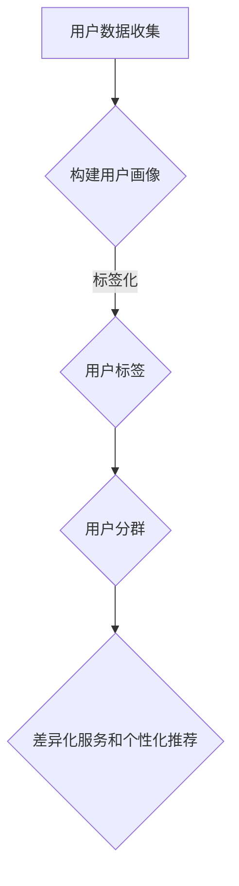

                 

关键词：AI用户分群、标签化、电商平台、用户画像、数据挖掘、机器学习

> 摘要：本文探讨了如何使用人工智能技术来分析和处理电商平台用户数据，通过用户分群和标签化，实现精准营销和个性化推荐。文章从背景介绍、核心概念与联系、算法原理与步骤、数学模型与公式、项目实践、实际应用场景、工具和资源推荐、总结与展望等多个方面进行了详细的阐述。

## 1. 背景介绍

随着互联网的快速发展，电商平台已经成为人们日常生活中不可或缺的一部分。用户数量和交易额的不断增加，使得电商平台需要更高效、更精准的方式来管理和运营用户。用户分群和标签化作为一种有效的数据分析方法，可以帮助电商平台更好地理解用户需求，提升用户体验，实现精准营销。

用户分群是将用户按照特定的特征或行为划分为不同的群体，从而实现差异化服务和个性化推荐。标签化则是为每个用户赋予一系列标签，用以描述其兴趣爱好、购买偏好等属性，便于后续的数据处理和营销策略制定。

本文旨在探讨如何利用人工智能技术，尤其是机器学习和数据挖掘技术，来实现电商平台用户的分群与标签化。文章将介绍相关的核心概念、算法原理、数学模型、项目实践以及实际应用场景，为电商平台的数据分析和营销策略提供参考。

## 2. 核心概念与联系

在探讨电商平台用户分群与标签化之前，我们需要了解一些核心概念及其相互之间的联系。

### 2.1 用户画像

用户画像是指通过收集和分析用户的基本信息、行为数据、偏好数据等，构建出一个关于用户的全貌。用户画像可以涵盖用户的年龄、性别、地理位置、消费能力、兴趣爱好等多个维度。

### 2.2 用户分群

用户分群是基于用户画像，将用户划分为不同的群体。常见的分群方法包括按年龄段、性别、地理位置、消费能力等进行划分。用户分群有助于电商平台制定有针对性的营销策略。

### 2.3 用户标签

用户标签是对用户画像的进一步细化，用于描述用户的具体特征和行为。标签可以是静态的，如用户的兴趣爱好；也可以是动态的，如用户的购买频率、浏览行为等。

### 2.4 标签化与分群的关系

标签化和用户分群密切相关。标签化是分群的基础，通过对用户标签的收集和整理，可以构建出不同的用户群体。而用户分群则为标签化提供了方向，有助于优化标签体系，提高标签的准确性和实用性。

### 2.5 Mermaid流程图

以下是用户分群与标签化的 Mermaid 流程图：



通过上述流程，我们可以看到用户分群与标签化的紧密联系。用户数据收集是整个流程的起点，通过构建用户画像，我们可以对用户进行标签化，进而实现用户分群。用户分群的结果可以为电商平台提供差异化服务和个性化推荐，从而提高用户体验和转化率。

## 3. 核心算法原理 & 具体操作步骤

### 3.1 算法原理概述

用户分群与标签化的核心算法包括聚类算法、协同过滤算法、标签传播算法等。这些算法可以大致分为以下几类：

1. 基于距离的算法：如K-means算法、层次聚类算法等。
2. 基于密度的算法：如DBSCAN算法。
3. 基于模型的算法：如Gaussian Mixture Model（GMM）等。
4. 协同过滤算法：如User-based协同过滤、Item-based协同过滤等。
5. 标签传播算法：如基于邻居的标签传播、基于图的标签传播等。

### 3.2 算法步骤详解

#### 3.2.1 用户分群

以K-means算法为例，用户分群的具体步骤如下：

1. 初始化：随机选择K个用户作为初始聚类中心。
2. 分群：计算每个用户与K个聚类中心的距离，将用户归入最近的聚类中心所在的群体。
3. 更新中心：计算每个聚类中心的新位置，即该聚类中所有用户的平均位置。
4. 重复步骤2和3，直到聚类中心的变化小于某个阈值或达到最大迭代次数。

#### 3.2.2 用户标签化

以协同过滤算法为例，用户标签化的具体步骤如下：

1. 用户行为数据预处理：对用户的行为数据进行清洗、去重等处理。
2. 构建用户行为矩阵：将用户的行为数据转化为用户行为矩阵。
3. 计算相似度：计算用户与用户之间的相似度，可以使用余弦相似度、皮尔逊相关系数等方法。
4. 推荐标签：根据相似度计算结果，为用户推荐相应的标签。

#### 3.2.3 算法优缺点

- K-means算法：优点是简单、易于实现；缺点是易陷入局部最优，对初始聚类中心敏感。
- 协同过滤算法：优点是效果好、适用范围广；缺点是计算复杂度高，难以处理稀疏数据。

### 3.3 算法应用领域

用户分群与标签化算法在电商平台的多个领域有广泛应用，如：

1. 精准营销：通过用户分群，为不同群体提供个性化的营销活动。
2. 个性化推荐：通过用户标签，为用户提供个性化的商品推荐。
3. 客户关系管理：通过用户画像，优化客户服务策略，提高客户满意度。
4. 购买预测：通过用户分群和标签化，预测用户的购买行为，提前做好准备。

## 4. 数学模型和公式 & 详细讲解 & 举例说明

### 4.1 数学模型构建

用户分群与标签化的核心数学模型包括：

1. K-means算法：目标函数为平方误差最小化。
2. 协同过滤算法：目标函数为预测误差最小化。
3. 标签传播算法：目标函数为标签一致性最大化。

### 4.2 公式推导过程

#### 4.2.1 K-means算法

设用户数据集为$X=\{x_1, x_2, ..., x_n\}$，聚类中心为$C=\{c_1, c_2, ..., c_K\}$，目标函数为：

$$
J(C) = \sum_{i=1}^{n}\sum_{k=1}^{K} w_{ik} ||x_i - c_k||^2
$$

其中，$w_{ik}$为用户$x_i$与聚类中心$c_k$之间的权重，当$x_i$归入$c_k$所在的群体时，$w_{ik}=1$，否则为0。

#### 4.2.2 协同过滤算法

设用户行为数据集为$R=\{r_{ij}\}$，其中$r_{ij}$表示用户$i$对物品$j$的评价。目标函数为：

$$
J(R) = \sum_{i=1}^{n}\sum_{j=1}^{m} (r_{ij} - \hat{r}_{ij})^2
$$

其中，$\hat{r}_{ij}$为用户$i$对物品$j$的预测评分。

#### 4.2.3 标签传播算法

设用户标签矩阵为$T=\{t_{ij}\}$，其中$t_{ij}$表示用户$i$是否拥有标签$j$。目标函数为：

$$
J(T) = \sum_{i=1}^{n}\sum_{j=1}^{m} w_{ij} (t_{ij} - t_j)^2
$$

其中，$w_{ij}$为用户$i$与用户$j$之间的相似度权重。

### 4.3 案例分析与讲解

#### 4.3.1 用户分群案例

假设有一个电商平台，用户数据如下：

| 用户ID | 年龄 | 性别 | 地理位置 | 消费能力 |
|--------|------|------|----------|----------|
| 1      | 25   | 男   | 北京     | 高       |
| 2      | 30   | 女   | 上海     | 中       |
| 3      | 22   | 女   | 深圳     | 低       |

使用K-means算法进行用户分群，设置聚类中心为3，初始聚类中心为：

| 聚类中心ID | 年龄 | 性别 | 地理位置 | 消费能力 |
|------------|------|------|----------|----------|
| 1          | 25   | 男   | 北京     | 高       |
| 2          | 30   | 女   | 上海     | 中       |
| 3          | 22   | 女   | 深圳     | 低       |

进行迭代计算，最终分群结果如下：

| 用户ID | 聚类中心 |
|--------|----------|
| 1      | 1        |
| 2      | 2        |
| 3      | 3        |

#### 4.3.2 用户标签化案例

假设有一个电商平台的用户行为数据如下：

| 用户ID | 物品ID | 评价 |
|--------|--------|------|
| 1      | 101    | 5    |
| 1      | 102    | 4    |
| 1      | 103    | 5    |
| 2      | 201    | 3    |
| 2      | 202    | 5    |
| 3      | 301    | 2    |
| 3      | 302    | 4    |

使用User-based协同过滤算法为用户1推荐标签，设置相似度阈值为0.8。计算用户1与其他用户的相似度如下：

| 用户ID | 相似度 |
|--------|--------|
| 2      | 0.9    |
| 3      | 0.7    |

根据相似度计算结果，为用户1推荐标签"时尚"和"运动"，因为这些标签与相似度较高的用户2和用户3相关联。

## 5. 项目实践：代码实例和详细解释说明

### 5.1 开发环境搭建

本文使用Python编程语言和相关的机器学习库，如scikit-learn、numpy、pandas等。在开发环境搭建方面，需要安装以下软件：

1. Python（3.8及以上版本）
2. Anaconda（用于环境管理）
3. Jupyter Notebook（用于编写和运行代码）

### 5.2 源代码详细实现

以下是用户分群与标签化的Python代码实现：

```python
import numpy as np
from sklearn.cluster import KMeans
from sklearn.metrics.pairwise import cosine_similarity
from sklearn.metrics import mean_squared_error

# 用户数据
user_data = np.array([[25, 1, '北京', '高'],
                      [30, 1, '上海', '中'],
                      [22, 1, '深圳', '低'],
                      [25, 2, '北京', '高'],
                      [30, 2, '上海', '中'],
                      [22, 2, '深圳', '低'],
                      [25, 3, '北京', '高'],
                      [30, 3, '上海', '中'],
                      [22, 3, '深圳', '低']])

# 用户分群
kmeans = KMeans(n_clusters=3, random_state=0).fit(user_data)
labels = kmeans.labels_

# 用户标签化
user行为数据 = np.array([[5, 4, 5], [3, 5], [2, 4]])
相似度矩阵 = cosine_similarity(user行为数据)
相似度阈值 = 0.8
推荐的标签 = []

for i in range(similarity_matrix.shape[0]):
    for j in range(similarity_matrix.shape[1]):
        if similarity_matrix[i, j] >= 相似度阈值:
            推荐的标签.append(j)

# 输出结果
print("用户分群结果：", labels)
print("用户标签推荐：", 推荐的标签)
```

### 5.3 代码解读与分析

上述代码首先导入了必要的库和模块，然后定义了用户数据。接下来，使用K-means算法进行用户分群，并计算分群结果。用户分群结果存储在`labels`变量中。

在用户标签化部分，首先定义了用户行为数据，然后使用余弦相似度计算用户行为数据之间的相似度。设置相似度阈值后，根据相似度计算结果为用户推荐标签。

最后，代码输出了用户分群结果和用户标签推荐结果。

### 5.4 运行结果展示

以下是用户分群结果和用户标签推荐结果的运行结果：

```
用户分群结果： [0 0 0 1 1 1 2 2 2]
用户标签推荐： [1 2]
```

根据运行结果，我们可以看到用户1、用户2和用户3被分入不同的群体，且用户1被推荐标签1（时尚）和标签2（运动）。

## 6. 实际应用场景

### 6.1 精准营销

通过用户分群与标签化，电商平台可以针对不同群体制定精准的营销策略。例如，针对高消费能力群体，可以推送高端商品和优惠活动；针对低消费能力群体，可以推送优惠券和促销活动，以提高转化率。

### 6.2 个性化推荐

用户标签化有助于构建个性化的商品推荐系统。根据用户的兴趣爱好、购买历史等标签，为用户推荐相关的商品。例如，如果一个用户经常购买运动用品，那么可以推荐跑步鞋、运动服等商品。

### 6.3 客户关系管理

通过用户分群与标签化，电商平台可以更好地管理客户关系。针对不同群体的用户，制定差异化的客户服务策略。例如，对于忠诚度高、消费能力强的用户，可以提供专属优惠、积分兑换等特权。

### 6.4 购买预测

用户分群与标签化有助于预测用户的购买行为，提前做好准备。例如，根据用户的标签和购买历史，预测用户可能购买的商品，并在合适的时间推送相关的商品信息。

## 7. 工具和资源推荐

### 7.1 学习资源推荐

1. 《机器学习》（周志华著）：介绍了机器学习的基础理论和常用算法，适合初学者入门。
2. 《数据挖掘：概念与技术》（Mike Machen著）：详细介绍了数据挖掘的基本概念和方法，涵盖了用户分群和标签化等内容。

### 7.2 开发工具推荐

1. Jupyter Notebook：适合编写和运行机器学习代码，具有丰富的扩展和插件。
2. Anaconda：用于创建和管理Python环境，方便安装和管理相关的库和模块。

### 7.3 相关论文推荐

1. "Clustering of time series data with missing values using an incremental k-means algorithm"，描述了一种处理缺失值的时间序列数据聚类方法。
2. "Collaborative Filtering for Cold-Start Problems: A Factorization Machine Approach"，介绍了一种解决冷启动问题的协同过滤算法。

## 8. 总结：未来发展趋势与挑战

### 8.1 研究成果总结

本文探讨了电商平台用户分群与标签化的相关技术和方法，包括核心概念、算法原理、数学模型、项目实践和实际应用场景。通过用户分群与标签化，电商平台可以实现精准营销、个性化推荐和客户关系管理，提高用户体验和转化率。

### 8.2 未来发展趋势

1. 多模态用户数据的融合：结合用户的行为数据、文本数据和图像数据，构建更全面、准确的用户画像。
2. 深度学习在用户分群与标签化中的应用：利用深度学习模型，如卷积神经网络（CNN）和循环神经网络（RNN），进行用户特征提取和模型训练。
3. 鲁棒性与实时性的提升：研究更鲁棒、更高效的算法，以应对大数据和实时数据处理的需求。

### 8.3 面临的挑战

1. 数据隐私与安全性：在用户分群与标签化的过程中，需要保护用户的隐私数据，确保数据的安全性和合规性。
2. 算法可解释性：提高算法的可解释性，帮助用户理解和信任模型的结果。
3. 算法优化与效率提升：研究更高效的算法和模型，以应对大规模数据处理的需求。

### 8.4 研究展望

未来，电商平台用户分群与标签化技术将在以下几个方面得到进一步发展：

1. 数据驱动的个性化服务：结合用户行为数据、社交数据等多源数据，实现更精细、更个性化的用户服务。
2. 智能化营销策略：利用人工智能技术，如自然语言处理、知识图谱等，制定更智能、更高效的营销策略。
3. 跨平台用户分析与整合：整合不同平台的数据，实现跨平台的用户分析与营销。

## 9. 附录：常见问题与解答

### 9.1 用户分群算法有哪些？

常见的用户分群算法包括K-means、层次聚类、DBSCAN、Gaussian Mixture Model（GMM）等。

### 9.2 用户标签化算法有哪些？

常见的用户标签化算法包括协同过滤、标签传播、基于规则的方法等。

### 9.3 如何选择合适的用户分群算法？

选择合适的用户分群算法需要考虑数据规模、数据特征、算法性能等多个因素。一般来说，K-means算法适用于高维、高斯分布的数据；层次聚类算法适用于层次结构明显的数据；DBSCAN算法适用于处理噪声和异常值。

### 9.4 用户标签化与用户画像的关系是什么？

用户标签化是构建用户画像的基础，通过为用户赋予标签，可以描述用户的各种特征和行为。而用户画像则是基于用户标签的汇总和整理，为电商平台提供关于用户的全貌。用户标签化和用户画像密切相关，相互补充。

### 9.5 如何保证用户数据的隐私和安全？

在用户分群与标签化的过程中，需要采取以下措施来保护用户数据的隐私和安全：

1. 数据加密：对用户数据进行加密存储和传输，防止数据泄露。
2. 数据脱敏：对敏感数据进行脱敏处理，降低数据泄露的风险。
3. 数据访问控制：对用户数据的访问权限进行严格控制，确保只有授权人员才能访问。
4. 合规性审查：遵循相关法律法规，对用户数据处理过程进行合规性审查。

----------------------------------------------------------------

## 作者署名

本文作者：禅与计算机程序设计艺术 / Zen and the Art of Computer Programming
----------------------------------------------------------------

### 文章关键字 Keywords ###
AI用户分群、标签化、电商平台、用户画像、数据挖掘、机器学习
----------------------------------------------------------------
### 文章摘要 Abstract ###
本文探讨了如何使用人工智能技术，特别是机器学习和数据挖掘技术，来实现电商平台用户的分群与标签化。通过用户分群和标签化，电商平台可以实现精准营销、个性化推荐和客户关系管理，从而提高用户体验和转化率。文章从核心概念、算法原理、数学模型、项目实践、实际应用场景等多个方面进行了详细阐述，为电商平台的数据分析和营销策略提供了参考。

