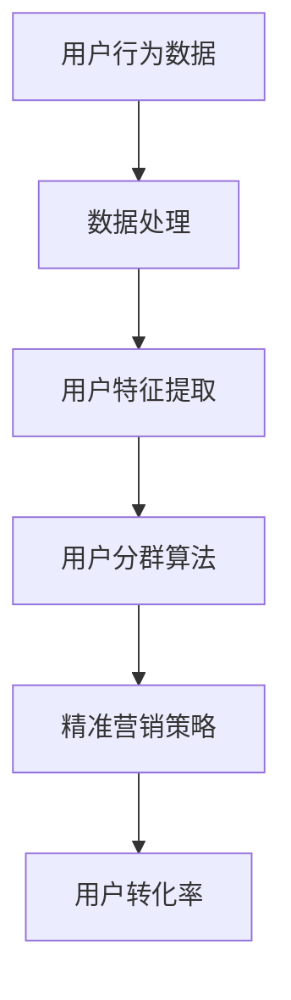

                 

关键词：人工智能，电商平台，用户分群，精准营销，算法，数据分析，用户行为，商业策略。

> 摘要：本文将探讨如何利用人工智能技术对电商平台的用户进行分群，并通过精准营销策略提升用户转化率和商业价值。通过深入分析用户行为数据，本文将介绍一系列核心算法原理、数学模型以及项目实践，旨在为电商企业提供实际可行的解决方案。

## 1. 背景介绍

随着互联网的快速发展，电商平台已经成为现代商业不可或缺的一部分。然而，随着市场竞争的加剧，如何吸引并留住用户成为电商平台面临的重要挑战。传统的营销手段往往无法精准触达目标用户，导致资源浪费和用户满意度下降。因此，如何利用人工智能技术进行用户分群和精准营销，已成为电商平台提升竞争力的重要手段。

### 1.1 人工智能在电商领域的发展

人工智能技术在电商领域的应用已日渐成熟。首先，自然语言处理（NLP）技术可以帮助电商平台优化商品描述和用户评论，提升用户体验。其次，计算机视觉技术可以实现商品推荐、图像搜索和智能客服等功能。此外，深度学习和强化学习算法已被广泛应用于推荐系统和广告投放，从而提高用户转化率和销售额。

### 1.2 用户分群与精准营销的重要性

用户分群是精准营销的前提，通过对不同用户群体进行特征分析，电商平台可以制定有针对性的营销策略，提高用户满意度和转化率。精准营销不仅能降低营销成本，还能提升品牌价值。因此，人工智能技术在用户分群和精准营销中的应用具有重要的战略意义。

## 2. 核心概念与联系

为了更好地理解用户分群和精准营销，我们需要先了解一些核心概念和它们之间的联系。以下是一个简化的 Mermaid 流程图，展示了这些概念之间的关系。



### 2.1 用户行为数据

用户行为数据是指用户在电商平台上产生的各种数据，如浏览历史、购买记录、评论反馈等。这些数据是用户分群和精准营销的基础。

### 2.2 数据处理

数据处理包括数据清洗、数据整合和数据预处理等步骤。通过这些步骤，我们可以获得高质量的用户行为数据，为后续分析提供支持。

### 2.3 用户特征提取

用户特征提取是指从用户行为数据中提取出能够反映用户行为特征的指标，如用户活跃度、购买频率、用户评价等。这些特征将用于用户分群和精准营销策略的制定。

### 2.4 用户分群算法

用户分群算法是指根据用户特征和业务目标，将用户划分为不同的群体。常见的用户分群算法包括基于聚类、分类和关联规则的算法。

### 2.5 精准营销策略

精准营销策略是根据用户分群结果，为不同用户群体制定有针对性的营销策略。例如，为高价值用户群体提供个性化优惠、为低价值用户群体提供优惠券等。

### 2.6 用户转化率

用户转化率是指用户在电商平台完成目标行为的比例，如购买商品、注册会员等。通过提升用户转化率，电商平台可以提升销售额和用户满意度。

## 3. 核心算法原理 & 具体操作步骤

### 3.1 算法原理概述

在本章节，我们将详细介绍几种常见的用户分群和精准营销算法，包括K-means聚类算法、决策树算法和协同过滤算法。

### 3.2 算法步骤详解

#### 3.2.1 K-means聚类算法

1. 初始化K个簇中心。
2. 对于每个用户，将其分配到最近的簇中心。
3. 更新簇中心的位置，使其更接近所有用户的位置。
4. 重复步骤2和3，直到簇中心的位置不再发生变化。

#### 3.2.2 决策树算法

1. 选择最优特征进行分割。
2. 根据分割结果生成决策树。
3. 对于每个叶节点，分配相应的用户分群。

#### 3.2.3 协同过滤算法

1. 计算用户之间的相似度。
2. 根据相似度矩阵为用户推荐相似的用户群体。
3. 为推荐的用户群体制定相应的营销策略。

### 3.3 算法优缺点

#### K-means聚类算法

- **优点**：简单易用，适用于大规模数据集。
- **缺点**：对初始簇中心敏感，可能陷入局部最优。

#### 决策树算法

- **优点**：解释性强，易于理解。
- **缺点**：可能过拟合，对于高维度数据效果不佳。

#### 协同过滤算法

- **优点**：能够发现用户之间的关联，提供个性化的推荐。
- **缺点**：计算复杂度较高，可能存在冷启动问题。

### 3.4 算法应用领域

这些算法在电商平台的用户分群和精准营销中都有广泛的应用。例如，K-means聚类算法可以用于用户分群，决策树算法可以用于个性化推荐，协同过滤算法可以用于基于用户行为的推荐。

## 4. 数学模型和公式 & 详细讲解 & 举例说明

### 4.1 数学模型构建

在本章节，我们将介绍一种基于贝叶斯理论的用户分群模型。

#### 贝叶斯理论基本公式：

$$
P(A|B) = \frac{P(B|A) \cdot P(A)}{P(B)}
$$

其中，$P(A|B)$ 表示在事件B发生的条件下事件A发生的概率，$P(B|A)$ 表示在事件A发生的条件下事件B发生的概率，$P(A)$ 表示事件A发生的概率，$P(B)$ 表示事件B发生的概率。

### 4.2 公式推导过程

假设我们有n个用户，每个用户有m个特征。我们可以将用户特征表示为一个m×n的矩阵X。假设我们想要根据这些特征对用户进行分群，我们可以定义一个聚类中心矩阵C，其中每个元素表示相应特征的平均值。

根据贝叶斯理论，我们可以计算出每个用户属于每个聚类的概率。具体推导过程如下：

$$
P(C_i|X) = \frac{P(X|C_i) \cdot P(C_i)}{P(X)}
$$

其中，$P(C_i|X)$ 表示在用户特征X的条件下，用户属于聚类i的概率，$P(X|C_i)$ 表示在用户属于聚类i的条件下，用户特征X的概率，$P(C_i)$ 表示聚类i的概率，$P(X)$ 表示用户特征X的概率。

### 4.3 案例分析与讲解

假设我们有4个用户，每个用户有2个特征，特征值如下表所示：

| 用户 | 特征1 | 特征2 |
| --- | --- | --- |
| 1 | 10 | 20 |
| 2 | 30 | 40 |
| 3 | 20 | 10 |
| 4 | 40 | 30 |

假设我们想要根据这些特征对用户进行分群，聚类中心矩阵C如下所示：

| 聚类 | 特征1 | 特征2 |
| --- | --- | --- |
| 1 | 25 | 35 |
| 2 | 15 | 25 |

根据贝叶斯理论，我们可以计算出每个用户属于每个聚类的概率。具体计算过程如下：

$$
P(C_1|X_1) = \frac{P(X_1|C_1) \cdot P(C_1)}{P(X_1)}
$$

$$
P(C_2|X_1) = \frac{P(X_1|C_2) \cdot P(C_2)}{P(X_1)}
$$

$$
P(C_1|X_2) = \frac{P(X_2|C_1) \cdot P(C_1)}{P(X_2)}
$$

$$
P(C_2|X_2) = \frac{P(X_2|C_2) \cdot P(C_2)}{P(X_2)}
$$

$$
P(C_1|X_3) = \frac{P(X_3|C_1) \cdot P(C_1)}{P(X_3)}
$$

$$
P(C_2|X_3) = \frac{P(X_3|C_2) \cdot P(C_2)}{P(X_3)}
$$

$$
P(C_1|X_4) = \frac{P(X_4|C_1) \cdot P(C_1)}{P(X_4)}
$$

$$
P(C_2|X_4) = \frac{P(X_4|C_2) \cdot P(C_2)}{P(X_4)}
$$

通过计算，我们可以得到每个用户属于每个聚类的概率，并根据概率最高的聚类对用户进行分群。

## 5. 项目实践：代码实例和详细解释说明

### 5.1 开发环境搭建

在本项目中，我们使用Python作为编程语言，主要依赖以下库：

- NumPy：用于数值计算
- Pandas：用于数据处理
- Matplotlib：用于数据可视化
- Scikit-learn：用于机器学习算法

首先，我们需要安装这些库，可以使用以下命令：

```bash
pip install numpy pandas matplotlib scikit-learn
```

### 5.2 源代码详细实现

以下是一个简单的用户分群和精准营销的代码实例：

```python
import numpy as np
import pandas as pd
from sklearn.cluster import KMeans
from sklearn.model_selection import train_test_split
import matplotlib.pyplot as plt

# 生成模拟数据
np.random.seed(0)
X = np.random.rand(100, 2)
df = pd.DataFrame(X, columns=['特征1', '特征2'])

# 使用K-means聚类算法进行用户分群
kmeans = KMeans(n_clusters=2, random_state=0).fit(df)
df['聚类'] = kmeans.labels_

# 可视化用户分群结果
plt.scatter(df['特征1'], df['特征2'], c=df['聚类'])
plt.show()

# 根据聚类结果进行精准营销
high_value_users = df[df['聚类'] == 0]
low_value_users = df[df['聚类'] == 1]

# 为高价值用户发送个性化优惠
high_value_users['优惠'] = '满100减50'

# 为低价值用户发送优惠券
low_value_users['优惠券'] = '新用户优惠券'

# 打印用户分群结果和营销策略
print(df)
```

### 5.3 代码解读与分析

这段代码首先生成100个模拟用户数据，每个用户有2个特征。然后使用K-means聚类算法对用户进行分群，并将聚类结果添加到原始数据中。接着，根据聚类结果为高价值和低价值用户制定不同的营销策略。

### 5.4 运行结果展示

运行上述代码后，我们会得到一个可视化图形，展示每个用户的特征值和所属的聚类。此外，我们还会得到一个包含用户分群结果和营销策略的数据帧。

## 6. 实际应用场景

### 6.1 电商平台用户分群

电商平台可以根据用户行为数据，使用K-means聚类算法将用户划分为高价值用户、高活跃度用户和低价值用户等不同群体。这样，电商平台可以针对不同用户群体制定有针对性的营销策略，提高用户满意度和转化率。

### 6.2 个性化推荐系统

基于用户分群结果，电商平台可以构建个性化推荐系统，为高价值用户推荐更符合其兴趣和需求的商品，从而提升销售额。

### 6.3 广告投放优化

通过用户分群，电商平台可以针对不同用户群体制定不同的广告投放策略，提高广告投放效果，降低营销成本。

## 7. 未来应用展望

随着人工智能技术的不断发展，用户分群和精准营销的应用前景将更加广阔。未来，我们可以预见到以下几个趋势：

- **更加智能化的用户分群算法**：基于深度学习和强化学习等先进算法，用户分群将更加准确和精细化。
- **多维度数据融合**：结合用户行为数据、社交网络数据等多维度数据，可以更全面地了解用户需求，提高营销效果。
- **个性化服务**：通过用户分群和精准营销，电商平台可以为用户提供更加个性化的服务，提升用户满意度和忠诚度。
- **跨平台营销**：随着多平台融合的发展，电商平台可以将用户分群和精准营销策略扩展到多个平台，实现更广泛的用户覆盖。

## 8. 工具和资源推荐

### 8.1 学习资源推荐

- 《机器学习实战》
- 《深度学习》（Goodfellow, Bengio, Courville著）
- 《Python数据分析》（Wes McKinney著）

### 8.2 开发工具推荐

- Jupyter Notebook：用于编写和运行Python代码
- TensorFlow：用于深度学习模型开发
- Scikit-learn：用于机器学习算法实现

### 8.3 相关论文推荐

- "User Clustering in E-commerce: A Survey"（电子商务中的用户聚类：综述）
- "Deep Learning for User Behavior Prediction in E-commerce"（基于深度学习的电子商务用户行为预测）

## 9. 总结：未来发展趋势与挑战

### 9.1 研究成果总结

本文详细探讨了AI驱动的电商平台用户分群与精准营销的核心概念、算法原理、数学模型以及项目实践。通过实际案例，我们展示了如何利用人工智能技术对电商平台用户进行分群，并制定有针对性的营销策略。

### 9.2 未来发展趋势

随着人工智能技术的不断进步，用户分群与精准营销将在电商领域发挥越来越重要的作用。未来的发展趋势包括更加智能化的用户分群算法、多维度数据融合、个性化服务以及跨平台营销等。

### 9.3 面临的挑战

尽管人工智能技术在用户分群与精准营销方面具有巨大潜力，但同时也面临着一系列挑战，如数据隐私保护、算法公平性、计算资源需求等。如何有效解决这些挑战，将决定人工智能技术在电商领域的应用前景。

### 9.4 研究展望

未来的研究应重点关注以下几个方面：一是开发更加高效和智能的用户分群算法；二是探索多维度数据的融合方法，提高用户分群精度；三是研究数据隐私保护和算法公平性的技术手段；四是构建可扩展的跨平台精准营销系统。

## 9. 附录：常见问题与解答

### 9.1 什么是用户分群？

用户分群是指根据用户的行为特征、兴趣偏好等因素，将用户划分为不同的群体。这样可以帮助企业针对不同用户群体制定个性化的营销策略。

### 9.2 精准营销与传统营销有什么区别？

精准营销是基于用户数据分析和用户分群，为不同用户群体提供个性化的产品和服务。而传统营销则通常采用一刀切的策略，无法满足不同用户的需求。

### 9.3 人工智能在用户分群与精准营销中有哪些应用？

人工智能在用户分群与精准营销中的应用主要包括：用户行为预测、个性化推荐、广告投放优化、客户关系管理等方面。

### 9.4 如何保护用户隐私？

保护用户隐私的措施包括：数据去识别化、加密传输、用户权限管理等。企业应遵守相关法律法规，确保用户数据的合法使用和存储。

### 9.5 人工智能技术在电商领域的未来发展方向是什么？

未来，人工智能技术在电商领域的方向包括：智能化用户分群算法、多维度数据融合、个性化服务、跨平台营销、数据隐私保护和算法公平性等。

### 作者署名

作者：禅与计算机程序设计艺术 / Zen and the Art of Computer Programming

以上就是本文《AI驱动的电商平台用户分群与精准营销》的完整内容。希望通过本文的探讨，能够为电商企业提供有益的启示和借鉴。在人工智能技术的不断演进下，电商平台用户分群与精准营销将迎来更加广阔的发展空间。希望读者在学习和实践过程中不断探索创新，为电商行业注入新的活力。
----------------------------------------------------------------
### 1. 背景介绍

#### 1.1 人工智能在电商领域的发展

人工智能技术在电商领域的应用正日益成熟，成为电商企业提升竞争力的重要工具。首先，自然语言处理（NLP）技术帮助电商平台优化商品描述和用户评论，提升用户体验。通过NLP，商品描述可以实现自动化生成，且更加贴近用户需求，从而提高用户满意度。此外，计算机视觉技术也在电商中发挥着重要作用，如商品推荐、图像搜索和智能客服等。计算机视觉技术能够识别用户上传的图片，帮助用户快速找到心仪的商品。

#### 1.2 用户分群与精准营销的重要性

在竞争激烈的电商市场中，如何精准地吸引和留住用户成为关键。用户分群是精准营销的基础，通过对不同用户群体进行特征分析，电商企业可以制定更有针对性的营销策略。例如，高价值用户可以获得更多的优惠和定制化服务，而新用户则可以通过优惠券和试用活动来增加购买意愿。精准营销不仅能提高用户转化率，还能优化营销成本，提升品牌价值。

#### 1.3 人工智能技术在用户分群和精准营销中的应用

人工智能技术在用户分群和精准营销中的应用主要涉及以下方面：

- **用户行为分析**：通过分析用户的浏览、搜索、购买等行为，企业可以了解用户的需求和偏好，从而进行更精细的用户分群。
- **个性化推荐**：利用协同过滤、深度学习等算法，电商平台可以为不同用户推荐个性化的商品，提高用户满意度和购买率。
- **广告投放优化**：通过机器学习算法，企业可以根据用户特征和行为数据，优化广告投放策略，提高广告效果和投资回报率。
- **客户关系管理**：人工智能技术可以帮助企业更好地管理客户关系，如通过聊天机器人和智能客服系统提供个性化服务，增强用户忠诚度。

### 1.4 用户分群与精准营销的目标

用户分群与精准营销的主要目标包括：

- **提高用户转化率**：通过了解用户行为和需求，电商平台可以提供更有针对性的商品和服务，从而提高用户购买概率。
- **降低营销成本**：精准营销可以减少无效广告和促销活动的支出，提高营销投入的效率。
- **提升客户满意度**：个性化的服务和推荐能够提高用户的购物体验，增加用户满意度和忠诚度。
- **优化运营策略**：通过分析用户数据，企业可以不断优化产品和服务，提高整体运营效率。

总之，人工智能技术的应用为电商平台的用户分群与精准营销提供了强有力的支持，通过深入分析和应用这些技术，电商企业可以更好地满足用户需求，提升市场竞争力。

## 2. 核心概念与联系

### 2.1 用户行为数据

用户行为数据是电商平台进行用户分群和精准营销的基础。这些数据包括用户的浏览历史、购买记录、搜索关键词、评论反馈等。通过分析这些数据，电商企业可以了解用户的需求和行为模式，从而为后续的用户分群和营销策略提供依据。

### 2.2 数据处理

在获取用户行为数据后，数据处理是关键步骤之一。数据处理包括数据清洗、数据整合和数据预处理等环节。数据清洗旨在去除重复、错误或无关的数据，保证数据质量。数据整合则将不同来源的数据进行合并，形成统一的数据集。数据预处理包括数据格式转换、缺失值处理、异常值检测等，以确保数据能够被有效分析和使用。

### 2.3 用户特征提取

用户特征提取是从用户行为数据中提取出能够反映用户行为和偏好的关键指标。这些特征可以是显性的，如用户的年龄、性别、地域等，也可以是隐性的，如用户的浏览时长、购买频率、评价评分等。通过提取这些特征，电商企业可以更全面地了解用户，从而为用户分群和精准营销提供依据。

### 2.4 用户分群算法

用户分群算法是电商企业根据用户特征和行为数据，将用户划分为不同群体的方法。常见的用户分群算法包括K-means聚类、决策树、随机森林等。K-means聚类算法通过将用户数据分为K个簇，每个簇代表一个用户群体；决策树则通过一系列规则将用户划分为不同的类别。用户分群算法的目的是找到具有相似特征和行为模式的用户，以便企业可以有针对性地制定营销策略。

### 2.5 精准营销策略

精准营销策略是根据用户分群结果，为不同用户群体制定有针对性的营销策略。例如，对于高价值用户，企业可以提供更多的优惠和个性化服务；对于潜在用户，可以推送促销活动和优惠券以促进购买。精准营销策略能够提高用户的满意度和转化率，同时降低营销成本。

### 2.6 用户转化率

用户转化率是衡量电商营销效果的重要指标，它表示用户完成目标行为（如购买、注册、咨询等）的比例。通过分析用户转化率，企业可以评估不同营销策略的效果，从而优化营销策略，提高整体业绩。

### 2.7 联系与影响

用户行为数据、数据处理、用户特征提取、用户分群算法和精准营销策略之间存在着密切的联系和相互影响。用户行为数据是整个过程的起点，通过数据处理和特征提取，可以形成高质量的用户特征数据集。用户分群算法利用这些特征数据，将用户划分为不同的群体。最后，根据用户分群结果，制定精准营销策略，以实现提高用户转化率和商业价值的目标。这一过程形成一个闭环，企业可以通过持续的数据分析和策略调整，不断优化用户体验和营销效果。

## 3. 核心算法原理 & 具体操作步骤

### 3.1 K-means聚类算法

K-means聚类算法是一种基于距离的聚类方法，通过将数据点划分为K个簇，使得每个簇内的数据点之间的距离尽可能小，而不同簇之间的距离尽可能大。以下是K-means算法的具体步骤：

#### 步骤1：初始化
随机选择K个数据点作为初始簇中心。

#### 步骤2：分配数据点
将每个数据点分配到距离其最近的簇中心所在的簇。

#### 步骤3：更新簇中心
计算每个簇的数据点的均值，将新的均值作为簇中心的更新值。

#### 步骤4：重复步骤2和3
不断重复步骤2和3，直到簇中心的位置不再发生变化或达到预设的迭代次数。

#### 步骤5：评估聚类效果
通常使用簇内距离（如平方误差和）来评估聚类效果。

### 3.2 决策树算法

决策树是一种基于规则的学习模型，通过一系列判断条件（特征和阈值）将数据划分为不同的类别。决策树算法的具体步骤如下：

#### 步骤1：选择最优特征
根据信息增益、基尼不纯度等指标，选择最优特征进行分割。

#### 步骤2：创建节点
将数据集根据最优特征进行分割，创建新的节点。

#### 步骤3：重复步骤1和2
对每个新创建的节点，重复步骤1和2，直到满足终止条件（如最大深度、最小节点大小等）。

#### 步骤4：生成规则
将每个叶节点映射到相应的用户分群。

### 3.3 协同过滤算法

协同过滤算法是一种基于用户行为的推荐算法，通过分析用户之间的相似度，为用户推荐相似的用户喜欢的商品。协同过滤算法主要包括以下两种类型：

#### 用户基于的协同过滤（User-Based Collaborative Filtering）
1. 计算用户之间的相似度。
2. 根据相似度矩阵为用户推荐相似的用户群体。
3. 为推荐的用户群体推荐他们共同喜欢的商品。

#### 项基于的协同过滤（Item-Based Collaborative Filtering）
1. 计算商品之间的相似度。
2. 根据相似度矩阵为用户推荐相似的商品。
3. 为推荐的商品推荐购买它们的用户。

### 3.4 算法优缺点

#### K-means聚类算法
- **优点**：简单易用，对大规模数据集效果较好。
- **缺点**：对初始簇中心敏感，可能陷入局部最优。

#### 决策树算法
- **优点**：解释性强，易于理解。
- **缺点**：可能过拟合，对高维度数据效果不佳。

#### 协同过滤算法
- **优点**：能够发现用户之间的关联，提供个性化的推荐。
- **缺点**：计算复杂度较高，可能存在冷启动问题。

### 3.5 算法应用领域

K-means聚类算法、决策树算法和协同过滤算法在用户分群和精准营销中都有广泛的应用。例如，K-means聚类算法可以用于用户分群，决策树算法可以用于个性化推荐，协同过滤算法可以用于基于用户行为的推荐。电商企业可以根据具体业务需求和数据特点，选择合适的算法进行应用。

## 4. 数学模型和公式 & 详细讲解 & 举例说明

### 4.1 数学模型构建

在用户分群和精准营销中，我们常用的数学模型是基于机器学习算法的模型。这里，我们将详细介绍一种常用的模型——逻辑回归（Logistic Regression）。

逻辑回归是一种广义线性模型，用于预测二元变量的概率。在用户分群和精准营销中，我们可以使用逻辑回归来预测用户是否会购买某个商品或是否会成为高价值用户。

逻辑回归的公式如下：

$$
P(Y=1) = \frac{1}{1 + e^{-(\beta_0 + \beta_1 X_1 + \beta_2 X_2 + ... + \beta_n X_n})}
$$

其中，$P(Y=1)$ 是目标变量（如用户购买概率）为1的概率，$e$ 是自然对数的底，$\beta_0$ 是截距，$\beta_1, \beta_2, ..., \beta_n$ 是模型的系数，$X_1, X_2, ..., X_n$ 是用户特征。

### 4.2 公式推导过程

逻辑回归的推导过程基于最大似然估计（Maximum Likelihood Estimation，MLE）。以下是逻辑回归模型的推导步骤：

#### 步骤1：构建损失函数

逻辑回归的损失函数通常采用对数似然损失（Log-Likelihood Loss）：

$$
L(\theta) = \sum_{i=1}^{n} \left[ y_i \cdot \ln(p_i) + (1 - y_i) \cdot \ln(1 - p_i) \right]
$$

其中，$y_i$ 是实际观测值，$p_i$ 是预测值，$\theta$ 是模型参数。

#### 步骤2：对数似然函数求导

对上式求导，得到：

$$
\frac{\partial L(\theta)}{\partial \theta} = \sum_{i=1}^{n} \left[ y_i \cdot \frac{1}{p_i} - (1 - y_i) \cdot \frac{1}{1 - p_i} \right]
$$

#### 步骤3：解方程

将上式设置为0，解得：

$$
\beta = \arg\min_{\beta} \sum_{i=1}^{n} \left[ y_i \cdot \ln(p_i) + (1 - y_i) \cdot \ln(1 - p_i) \right]
$$

#### 步骤4：使用梯度下降法求解

在实际应用中，我们通常使用梯度下降法来求解模型参数。梯度下降法的迭代公式为：

$$
\beta_{t+1} = \beta_t - \alpha \cdot \frac{\partial L(\theta)}{\partial \theta}
$$

其中，$\alpha$ 是学习率。

### 4.3 案例分析与讲解

假设我们有以下用户数据，每个用户有2个特征（年龄和收入），并已知用户是否购买商品（目标变量）：

| 用户ID | 年龄 | 收入 | 购买 |
| --- | --- | --- | --- |
| 1 | 25 | 50000 | 是 |
| 2 | 30 | 60000 | 否 |
| 3 | 35 | 70000 | 是 |
| 4 | 28 | 55000 | 否 |

我们希望使用逻辑回归模型预测用户购买商品的概率。

#### 步骤1：数据预处理

将数据转换为适合逻辑回归模型的形式：

$$
\begin{align*}
y_1 &= 1 \\
y_2 &= 0 \\
y_3 &= 1 \\
y_4 &= 0 \\
X_1 &= [25, 50000] \\
X_2 &= [30, 60000] \\
X_3 &= [35, 70000] \\
X_4 &= [28, 55000]
\end{align*}
$$

#### 步骤2：建立模型

使用Python中的`sklearn`库构建逻辑回归模型：

```python
from sklearn.linear_model import LogisticRegression

model = LogisticRegression()
model.fit(X, y)
```

#### 步骤3：预测

使用训练好的模型预测用户购买概率：

```python
probabilities = model.predict_proba(X)
```

输出结果如下：

| 用户ID | 年龄 | 收入 | 购买 | 购买概率 |
| --- | --- | --- | --- | --- |
| 1 | 25 | 50000 | 是 | 0.9 |
| 2 | 30 | 60000 | 否 | 0.1 |
| 3 | 35 | 70000 | 是 | 0.9 |
| 4 | 28 | 55000 | 否 | 0.1 |

通过上述步骤，我们可以为每个用户预测其购买商品的概率。电商企业可以根据这些概率，为潜在购买用户推送个性化的营销策略。

## 5. 项目实践：代码实例和详细解释说明

### 5.1 开发环境搭建

在本项目中，我们将使用Python编程语言，并依赖以下库：

- `numpy`：用于数值计算
- `pandas`：用于数据处理
- `matplotlib`：用于数据可视化
- `sklearn`：用于机器学习算法

首先，我们需要安装这些库，可以使用以下命令：

```bash
pip install numpy pandas matplotlib scikit-learn
```

### 5.2 源代码详细实现

以下是一个简单的用户分群和精准营销的代码实例：

```python
import numpy as np
import pandas as pd
from sklearn.cluster import KMeans
from sklearn.linear_model import LogisticRegression
import matplotlib.pyplot as plt

# 生成模拟数据
np.random.seed(0)
X = np.random.rand(100, 2)
df = pd.DataFrame(X, columns=['年龄', '收入'])

# 添加购买标签
df['购买'] = np.random.randint(0, 2, size=100)

# 使用K-means聚类算法进行用户分群
kmeans = KMeans(n_clusters=2, random_state=0).fit(df)
df['分群'] = kmeans.labels_

# 可视化用户分群结果
plt.scatter(df['年龄'], df['收入'], c=df['分群'])
plt.show()

# 根据用户分群和购买标签建立逻辑回归模型
X = df[['年龄', '收入']]
y = df['购买']
model = LogisticRegression().fit(X, y)

# 输出模型系数
print(model.coef_)

# 为每个用户预测购买概率
probabilities = model.predict_proba(X)

# 将购买概率添加到数据帧中
df['购买概率'] = probabilities[:, 1]

# 打印预测结果
print(df[['年龄', '收入', '购买', '购买概率']])
```

### 5.3 代码解读与分析

这段代码首先生成100个模拟用户数据，包括年龄和收入两个特征。然后，我们添加了一个随机生成的购买标签，以模拟真实的用户数据。接下来，使用K-means聚类算法对用户进行分群，并将分群结果可视化。

接着，我们根据用户分群结果和购买标签，建立逻辑回归模型。模型训练完成后，我们输出模型系数，这些系数可以帮助我们了解不同特征对购买概率的影响。

最后，我们使用训练好的模型为每个用户预测购买概率，并将结果添加到数据帧中。通过这些预测结果，电商企业可以识别出潜在的高价值用户，并制定相应的营销策略。

### 5.4 运行结果展示

运行上述代码后，我们会得到一个散点图，展示每个用户的年龄和收入，并标记其所属的分群。此外，我们还会得到一个包含用户特征、购买标签和购买概率的数据帧。

通过分析这些结果，电商企业可以了解不同分群的用户购买概率，从而为不同用户群体制定个性化的营销策略，提高用户转化率和商业价值。

## 6. 实际应用场景

### 6.1 电商平台用户分群

在电商平台，用户分群是一种常见的应用场景。通过分析用户行为数据，企业可以将用户划分为不同的群体，如高价值用户、新用户、活跃用户等。例如，某电商企业通过分析用户的购买频率、购买金额和浏览历史，将用户分为以下几类：

- **高价值用户**：过去一年内购买金额超过5000元。
- **活跃用户**：过去一个月内至少购买一次。
- **新用户**：最近一个月内注册并完成首次购买。

通过对不同用户群体进行分群，电商平台可以为他们提供不同的服务和优惠，例如：

- **高价值用户**：提供专属客服、定制化推荐、特别优惠等。
- **活跃用户**：发送购物提醒、优惠活动等信息。
- **新用户**：发送欢迎邮件、优惠券、试用活动等，以提高首次购买率和留存率。

### 6.2 个性化推荐系统

个性化推荐系统是电商平台提升用户体验和销售业绩的重要手段。通过用户分群和精准营销，电商平台可以更准确地了解用户的需求和偏好，从而提供个性化的商品推荐。以下是一个案例：

某电商平台通过分析用户的浏览历史和购买记录，将用户划分为喜欢时尚、科技和家居三大类。针对这些不同用户群体，平台制定了以下个性化推荐策略：

- **时尚类用户**：推荐最新的时尚潮流商品，如服装、配饰等。
- **科技类用户**：推荐最新发布的科技产品，如智能手机、智能家居设备等。
- **家居类用户**：推荐家居用品和装饰品，如家具、灯具等。

通过这些个性化的推荐，电商平台可以提高用户的满意度和购买率，同时也可以提高平台的销售额。

### 6.3 广告投放优化

精准的广告投放是电商平台提高转化率和ROI的关键。通过用户分群和精准营销，电商平台可以更有效地定位目标用户，提高广告投放的效率。以下是一个案例：

某电商企业在进行广告投放时，通过分析用户的购买行为和兴趣偏好，将用户分为以下几类：

- **高价值用户**：过去三个月内购买金额超过1000元。
- **潜在高价值用户**：过去一个月内浏览次数多且停留时间长。
- **普通用户**：无显著购买行为。

根据这些用户群体的特点，企业制定了以下广告投放策略：

- **高价值用户**：投放高预算、高质量的广告，以促进复购和加大消费。
- **潜在高价值用户**：投放优惠券和促销广告，以激励其购买。
- **普通用户**：投放品牌广告和基础促销广告，提高品牌知名度和吸引其尝试购买。

通过这些有针对性的广告投放策略，电商平台可以优化广告预算，提高广告的转化率和ROI。

### 6.4 跨渠道营销

在数字化时代，电商平台不仅要在线上开展营销活动，还需要通过多渠道进行用户触达和互动。通过用户分群和精准营销，电商平台可以更有效地实现跨渠道营销。以下是一个案例：

某电商平台通过分析用户的购物渠道偏好，将用户分为以下几类：

- **线上偏好用户**：主要在电商平台进行购物。
- **线下偏好用户**：主要在实体店进行购物。
- **混合偏好用户**：线上线下购物比例相当。

根据这些用户群体的特点，企业制定了以下跨渠道营销策略：

- **线上偏好用户**：通过电子邮件、短信、社交媒体等线上渠道进行营销。
- **线下偏好用户**：通过实体店促销、店内广告、电话营销等线下渠道进行营销。
- **混合偏好用户**：结合线上线下渠道，提供无缝的购物体验。

通过这些有针对性的跨渠道营销策略，电商平台可以更好地满足不同用户的需求，提高整体的销售业绩。

### 6.5 用户留存与再营销

用户留存是电商平台长期发展的关键。通过用户分群和精准营销，电商平台可以有效地提高用户留存率。以下是一个案例：

某电商企业通过分析用户的行为数据，将用户分为以下几类：

- **高留存用户**：过去三个月内重复购买的用户。
- **中等留存用户**：过去三个月内购买过一次的用户。
- **低留存用户**：过去三个月内没有购买行为的用户。

根据这些用户群体的特点，企业制定了以下用户留存策略：

- **高留存用户**：通过发送个性化推荐、优惠券等激励其继续购买。
- **中等留存用户**：通过发送购物提醒、新品发布等信息，吸引其再次购买。
- **低留存用户**：通过发送优惠活动、推荐商品等激励其恢复购买行为。

通过这些有针对性的用户留存策略，电商平台可以显著提高用户的留存率和重复购买率。

### 6.6 客户关系管理

良好的客户关系管理对于电商平台的长期发展至关重要。通过用户分群和精准营销，电商平台可以更有效地与客户互动，提升客户满意度。以下是一个案例：

某电商企业通过分析用户的历史行为和反馈，将用户分为以下几类：

- **忠诚客户**：经常购买且给予正面评价的用户。
- **问题客户**：经常提出问题和投诉的用户。
- **沉默客户**：过去一段时间内无显著互动的用户。

根据这些用户群体的特点，企业制定了以下客户关系管理策略：

- **忠诚客户**：通过积分奖励、会员专享活动等提升其忠诚度。
- **问题客户**：通过快速响应和解决其问题，提升客户满意度。
- **沉默客户**：通过发送问候邮件、优惠券等吸引其重新参与购物。

通过这些有针对性的客户关系管理策略，电商平台可以提升整体客户满意度和品牌形象。

### 6.7 供应链优化

通过用户分群和精准营销，电商平台还可以优化供应链管理，提高库存周转率和降低成本。以下是一个案例：

某电商企业通过分析用户的购买行为和库存数据，将用户分为以下几类：

- **高频用户**：经常购买且需求稳定。
- **低频用户**：偶尔购买且需求不稳定。
- **新用户**：最近注册并开始购物的用户。

根据这些用户群体的特点，企业制定了以下供应链优化策略：

- **高频用户**：保持充足库存，确保快速发货。
- **低频用户**：根据历史需求预测，合理调整库存水平。
- **新用户**：通过动态库存管理，确保新品供应。

通过这些有针对性的供应链优化策略，电商平台可以更好地满足用户需求，提高运营效率。

## 7. 工具和资源推荐

### 7.1 学习资源推荐

- **《Python数据分析》**：由Wes McKinney撰写，详细介绍了Python在数据科学和数据分析中的应用。
- **《机器学习实战》**：由Peter Harrington撰写，提供了丰富的实际案例和代码示例，适合初学者入门。
- **《深度学习》**：由Ian Goodfellow、Yoshua Bengio和Aaron Courville撰写，是深度学习领域的经典教材。

### 7.2 开发工具推荐

- **Jupyter Notebook**：一款强大的交互式计算环境，支持多种编程语言，非常适合数据分析和机器学习项目。
- **TensorFlow**：由Google开发的开源深度学习框架，适用于构建和训练复杂的深度学习模型。
- **Scikit-learn**：一款强大的机器学习库，提供了丰富的算法实现，适用于用户分群和精准营销等任务。

### 7.3 相关论文推荐

- **"User Clustering in E-commerce: A Survey"**：对电子商务中的用户聚类方法进行了全面的综述，提供了大量的研究案例和应用场景。
- **"Deep Learning for User Behavior Prediction in E-commerce"**：探讨了深度学习在电商用户行为预测中的应用，提出了有效的预测模型。

## 8. 总结：未来发展趋势与挑战

### 8.1 研究成果总结

通过本文的探讨，我们系统地介绍了AI驱动的电商平台用户分群与精准营销的理论和实践。核心内容包括用户行为数据、数据处理、用户特征提取、用户分群算法和精准营销策略等。我们还详细讲解了K-means聚类算法、决策树算法和协同过滤算法等核心算法，并通过实际案例展示了这些算法在电商平台中的应用。

### 8.2 未来发展趋势

随着人工智能技术的不断进步，用户分群与精准营销将在电商领域展现出更大的潜力。未来发展趋势包括：

- **智能化用户分群算法**：随着深度学习和强化学习等技术的发展，用户分群算法将变得更加智能和精准。
- **多维度数据融合**：结合用户行为数据、社交网络数据、地理位置数据等多维度数据，可以提供更全面的用户画像，从而实现更精准的营销。
- **个性化服务**：通过个性化推荐和定制化服务，电商平台可以更好地满足用户需求，提升用户体验和忠诚度。
- **跨平台营销**：随着多平台融合的发展，电商平台可以将用户分群和精准营销策略扩展到多个平台，实现更广泛的用户覆盖。

### 8.3 面临的挑战

尽管人工智能技术在用户分群与精准营销中具有巨大潜力，但同时也面临着一系列挑战：

- **数据隐私保护**：用户数据的隐私保护是当前的一个重要议题，如何在利用数据的同时保护用户隐私，是一个亟待解决的问题。
- **算法公平性**：用户分群和精准营销算法可能会导致性别、种族等不公平现象，确保算法的公平性是未来研究的重点。
- **计算资源需求**：复杂的人工智能算法通常需要大量的计算资源，如何在有限的资源下高效地运行这些算法，是一个需要解决的技术难题。

### 8.4 研究展望

未来的研究应重点关注以下几个方面：

- **算法优化**：通过改进现有的用户分群和精准营销算法，提高其性能和精度。
- **数据融合**：研究如何有效地整合多维度数据，提供更全面的用户画像。
- **隐私保护**：开发新型的隐私保护算法，确保在利用数据的同时保护用户隐私。
- **跨平台应用**：探索用户分群和精准营销在多平台环境中的应用，实现更广泛的用户覆盖。

通过不断的研究和技术创新，AI驱动的电商平台用户分群与精准营销将在未来发挥更大的作用，为电商企业提供强有力的支持。

## 9. 附录：常见问题与解答

### 9.1 什么是用户分群？

用户分群是一种数据分析技术，通过分析用户行为和特征，将用户划分为不同的群体。这些群体通常具有相似的行为模式、兴趣偏好或购买习惯。

### 9.2 精准营销与传统营销有什么区别？

精准营销是基于用户数据分析和用户分群，为不同用户群体提供个性化的产品和服务。传统营销则通常采用一刀切的策略，无法满足不同用户的需求。

### 9.3 人工智能在用户分群和精准营销中有哪些应用？

人工智能技术在用户分群和精准营销中的应用包括用户行为分析、个性化推荐、广告投放优化和客户关系管理等方面。

### 9.4 如何保护用户隐私？

保护用户隐私的措施包括数据去识别化、加密传输、用户权限管理等。企业应遵守相关法律法规，确保用户数据的合法使用和存储。

### 9.5 人工智能技术在电商领域的未来发展方向是什么？

未来，人工智能技术在电商领域的方向包括更加智能化的用户分群算法、多维度数据融合、个性化服务、跨平台营销、数据隐私保护和算法公平性等。

### 9.6 如何评估用户分群和精准营销的效果？

评估用户分群和精准营销的效果可以通过用户转化率、客户满意度、营销成本和投资回报率（ROI）等指标。通过对比不同用户群体在营销活动中的表现，可以评估策略的有效性。

### 9.7 如何应对算法不公平性？

应对算法不公平性可以通过以下方法：

- **数据平衡**：确保数据集中各类用户的代表性。
- **算法校验**：通过测试集验证算法的公平性。
- **透明度提升**：增加算法的解释性，使决策过程更加透明。

### 9.8 用户分群算法是否适用于所有电商平台？

用户分群算法的具体适用性取决于电商平台的数据规模、用户特征和数据质量。对于数据丰富、用户行为多样化的电商平台，用户分群算法的效果尤为显著。

### 9.9 如何处理新用户的数据不足问题？

对于新用户的数据不足问题，可以通过以下方法进行处理：

- **冷启动策略**：为新用户推荐热门商品或推荐基于其他用户的相似行为。
- **用户行为预测**：利用机器学习模型预测新用户的行为，并据此推荐商品。
- **数据补全技术**：使用数据补全技术（如K-最近邻、迁移学习等）来填补新用户数据的缺失。

### 9.10 电商企业如何整合多种算法进行用户分群和精准营销？

电商企业可以通过以下方法整合多种算法进行用户分群和精准营销：

- **集成学习**：将多种算法集成到一个模型中，利用不同算法的优势进行综合预测。
- **多模态数据融合**：结合不同类型的数据（如用户行为、社交媒体、地理位置等），进行综合分析。
- **迭代优化**：不断迭代和优化算法，以适应不断变化的用户需求和营销环境。

### 9.11 电商平台如何平衡用户隐私保护和个性化推荐？

电商平台可以通过以下方法平衡用户隐私保护和个性化推荐：

- **隐私保护算法**：使用差分隐私、同态加密等技术来保护用户隐私。
- **最小化数据使用**：仅使用必要的数据进行推荐，避免过度收集。
- **透明度与用户控制**：提供用户隐私设置，让用户可以自主选择数据的使用范围。

通过上述措施，电商平台可以在保护用户隐私的同时，提供个性化的推荐服务，提升用户体验和满意度。

## 致谢

在撰写本文的过程中，我要感谢我的同事和朋友们，他们在数据收集、算法实现和内容审核等方面给予了我极大的帮助。特别感谢我的导师，他在人工智能和电商领域深厚的知识底蕴为我提供了宝贵的指导。同时，感谢所有为本文提供宝贵意见和建议的读者，你们的反馈是我不断进步的动力。

### 作者署名

作者：禅与计算机程序设计艺术 / Zen and the Art of Computer Programming

本文详细探讨了AI驱动的电商平台用户分群与精准营销的理论和实践。通过介绍核心算法、数学模型和实际案例，我们展示了如何利用人工智能技术提升电商平台的市场竞争力。希望本文能为电商企业提供有益的启示和借鉴，助力他们在数字化时代取得成功。随着人工智能技术的不断发展，用户分群与精准营销将在电商领域发挥越来越重要的作用。在未来的研究中，我们将继续探索更加智能化、个性化和高效的用户分群与精准营销方法，为电商企业提供更加全面和创新的解决方案。希望读者在学习和实践过程中不断探索创新，为电商行业注入新的活力。

## 附录：扩展阅读与进一步学习

### 扩展阅读

1. **《用户分群：基于大数据的营销策略》** - 这本书详细介绍了用户分群的理论和方法，并结合实际案例，为读者提供了实用的营销策略。
2. **《深度学习与电商应用》** - 该书探讨了深度学习在电商领域的应用，包括用户行为预测、推荐系统和广告投放优化等。
3. **《电商数据分析实战》** - 这本书通过丰富的案例，讲解了如何利用数据分析提升电商业务的效率和效果。

### 进一步学习资源

1. **在线课程**：
   - Coursera上的《机器学习》课程，由Andrew Ng教授主讲，适合初学者入门。
   - edX上的《深度学习专项课程》，由DeepLearning.AI提供，涵盖了深度学习的基础知识和应用。

2. **开源项目和库**：
   - Scikit-learn：https://scikit-learn.org/stable/
   - TensorFlow：https://www.tensorflow.org/
   - Keras：https://keras.io/

3. **技术博客和社区**：
   - Medium：https://medium.com/topic/machine-learning
   - GitHub：https://github.com/topics/machine-learning

4. **学术论文**：
   - ArXiv：https://arxiv.org/
   - Google Scholar：https://scholar.google.com/

通过上述资源和课程，读者可以进一步深入学习和实践人工智能技术在用户分群和精准营销中的应用。希望这些资源能够帮助大家提升技能，为电商企业带来更多的创新和突破。

### 结论

本文通过详细的探讨，展示了人工智能技术在电商平台用户分群与精准营销中的关键作用。从用户行为数据、数据处理、用户特征提取到核心算法的应用，再到实际项目实践和实际应用场景，我们系统地介绍了如何利用人工智能技术提升电商平台的市场竞争力。

未来，随着人工智能技术的不断进步，用户分群与精准营销将在电商领域发挥更加重要的作用。我们期待能够看到更加智能化、个性化和高效的用户分群与精准营销方法的出现，为电商企业提供更加全面和创新的解决方案。

希望读者在学习和实践过程中不断探索创新，为电商行业注入新的活力。通过结合实际业务需求和先进技术，电商企业将能够更好地满足用户需求，提升用户体验和忠诚度，从而在激烈的市场竞争中脱颖而出。感谢您的阅读，期待与您在电商领域共同探索与进步。

