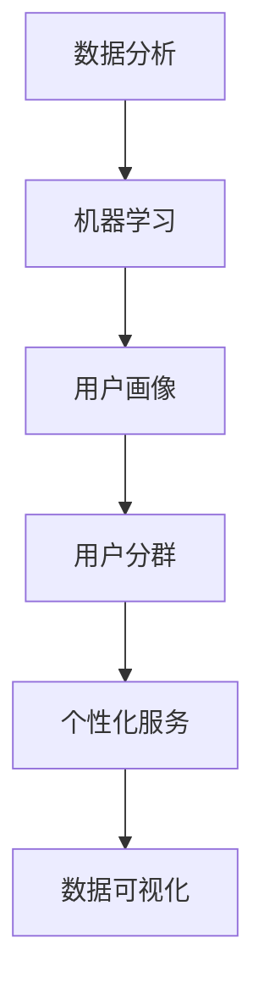

                 

在数字化时代，电商平台已经成为了商业运营的重要组成部分。为了提高用户体验、提升销售额和增强客户忠诚度，精准的用户分群策略显得尤为重要。近年来，人工智能（AI）技术在数据分析和用户行为理解方面取得了显著进展，为电商平台提供了强大的分析工具。本文将深入探讨AI驱动的电商平台用户分群策略，分析其核心概念、算法原理、数学模型、项目实践以及未来应用前景。

## 关键词
- AI
- 电商平台
- 用户分群
- 数据分析
- 算法
- 数学模型
- 项目实践

## 摘要
本文首先介绍了电商平台用户分群的重要性，接着详细阐述了AI技术在用户分群中的应用。通过分析核心概念和算法原理，本文探讨了如何利用数学模型实现用户分群。最后，通过一个实际项目实例，展示了AI驱动的用户分群策略在电商平台上的应用效果，并对未来发展趋势和面临的挑战进行了展望。

---

## 1. 背景介绍

随着互联网技术的迅猛发展，电商平台已经成为现代商业不可或缺的一部分。电商平台不仅为消费者提供了便捷的购物体验，也为企业带来了巨大的商业价值。然而，面对日益激烈的市场竞争，电商平台如何更好地理解用户需求、提供个性化的服务，成为了一个亟待解决的问题。

用户分群是电商平台进行精准营销和个性化服务的基础。通过将用户划分为不同的群体，企业可以针对每个群体的特点和需求，制定相应的营销策略和推广活动。传统的用户分群方法主要依赖于用户的购买行为、浏览记录等表面数据，这些方法往往无法深入了解用户的内心需求和行为动机。

人工智能技术的崛起为用户分群带来了新的机遇。AI可以通过机器学习和数据挖掘技术，从大量用户数据中提取有价值的信息，建立精准的用户画像，从而实现更精细的用户分群。同时，AI还可以根据用户的行为变化和需求变化，动态调整分群策略，提高用户满意度和忠诚度。

## 2. 核心概念与联系

为了更好地理解AI驱动的电商平台用户分群策略，我们需要先了解一些核心概念和它们之间的联系。

### 2.1 数据分析
数据分析是AI驱动的用户分群策略的基础。通过数据分析，可以从大量用户数据中提取有价值的信息，为用户分群提供数据支持。

### 2.2 机器学习
机器学习是AI的核心技术之一。通过训练模型，机器学习可以从数据中学习规律和模式，为用户分群提供决策支持。

### 2.3 用户画像
用户画像是对用户进行全面描述的数据模型，包括用户的年龄、性别、兴趣爱好、购买行为等信息。用户画像是实现用户分群的关键。

### 2.4 用户分群
用户分群是将用户划分为不同群体的过程。通过用户分群，可以针对每个群体的特点，制定个性化的营销策略和推广活动。

### 2.5 个性化服务
个性化服务是根据用户的个性化需求，提供定制化的产品和服务。个性化服务可以提高用户满意度和忠诚度。

### 2.6 数据可视化
数据可视化是将数据以图形化方式呈现的过程，可以帮助我们更直观地理解数据和分析结果。

### 2.7 Mermaid 流程图
Mermaid 是一种基于Markdown的图形语言，可以用来绘制流程图、UML图等。以下是一个用户分群策略的 Mermaid 流程图示例：



---

## 3. 核心算法原理 & 具体操作步骤

### 3.1 算法原理概述

AI驱动的电商平台用户分群策略主要依赖于以下几种核心算法：

1. **聚类算法**：通过将相似的用户划分为同一群体，实现用户分群。常用的聚类算法有K-means、层次聚类等。
2. **协同过滤**：通过分析用户的购买行为和偏好，推荐相似用户，从而实现用户分群。协同过滤分为基于用户的协同过滤和基于物品的协同过滤。
3. **决策树**：通过分类算法，将用户划分为不同群体。决策树是一种树形结构，每个节点表示一个特征，每个分支表示该特征的不同取值。

### 3.2 算法步骤详解

1. **数据收集与预处理**：收集用户的购买记录、浏览记录、社交行为等数据，并进行数据清洗和预处理，去除噪声数据。
2. **特征工程**：根据业务需求和数据特点，提取用户行为特征，如购买频次、浏览时长、购买金额等。
3. **选择聚类算法**：根据数据特点和需求，选择合适的聚类算法，如K-means、层次聚类等。
4. **聚类分析**：对数据进行聚类分析，得到不同用户群体的特征。
5. **协同过滤**：对用户行为数据进行分析，构建协同过滤模型，推荐相似用户。
6. **决策树划分**：根据用户特征和业务需求，构建决策树模型，划分用户群体。
7. **结果评估**：评估用户分群效果，如准确率、召回率等。
8. **个性化服务**：根据用户群体特征，提供个性化服务，提高用户体验。

### 3.3 算法优缺点

1. **聚类算法**：
   - 优点：简单易用，能够发现用户群体的隐含结构。
   - 缺点：对初始聚类中心敏感，可能陷入局部最优。

2. **协同过滤**：
   - 优点：推荐效果好，用户满意度高。
   - 缺点：需要大量用户行为数据，对稀疏数据效果不佳。

3. **决策树**：
   - 优点：易于理解，解释性强。
   - 缺点：可能过拟合，对噪声数据敏感。

### 3.4 算法应用领域

AI驱动的用户分群策略可以应用于多个领域，如电商、金融、教育、医疗等。以下是一些典型的应用场景：

1. **电商**：通过用户分群，实现精准营销和个性化推荐。
2. **金融**：通过用户分群，识别高风险用户，降低信用风险。
3. **教育**：通过用户分群，实现个性化学习，提高学习效果。
4. **医疗**：通过用户分群，提供个性化健康咨询和医疗服务。

---

## 4. 数学模型和公式 & 详细讲解 & 举例说明

### 4.1 数学模型构建

在AI驱动的用户分群策略中，常用的数学模型包括聚类模型、协同过滤模型和决策树模型。以下分别介绍这些模型的基本原理和构建方法。

1. **K-means 聚类模型**

K-means 是一种基于距离的聚类算法，其目标是将数据点划分为 K 个簇，使得每个簇内部的数据点之间距离最小，簇与簇之间距离最大。K-means 的数学模型可以表示为：

$$
\min_{\mu_1, \mu_2, ..., \mu_K} \sum_{i=1}^N \sum_{j=1}^K d(x_i, \mu_j)^2
$$

其中，$x_i$ 表示数据点，$\mu_j$ 表示簇中心，$d(x_i, \mu_j)$ 表示数据点 $x_i$ 与簇中心 $\mu_j$ 之间的距离。

2. **协同过滤模型**

协同过滤模型是基于用户行为数据推荐相似用户的方法。其中，基于用户的协同过滤模型可以表示为：

$$
r_{ui} = \sum_{j=1}^N w_{uj} r_{ij}
$$

其中，$r_{ij}$ 表示用户 $u$ 对物品 $i$ 的评分，$w_{uj}$ 表示用户 $u$ 与用户 $v$ 的相似度。

3. **决策树模型**

决策树模型是一种基于特征划分数据的方法，其基本原理是从根节点开始，根据特征的不同取值，将数据划分为多个子集，直到达到叶节点。决策树模型可以表示为：

$$
T = \{t_1, t_2, ..., t_n\}
$$

其中，$t_i$ 表示叶节点，$n$ 表示叶子节点数量。

### 4.2 公式推导过程

1. **K-means 聚类模型**

K-means 聚类模型的推导过程如下：

（1）随机初始化 K 个簇中心 $\mu_1, \mu_2, ..., \mu_K$。

（2）对于每个数据点 $x_i$，计算其与每个簇中心 $\mu_j$ 的距离，并将 $x_i$ 分配到距离最近的簇。

（3）更新簇中心，取每个簇中所有数据点的均值作为新的簇中心。

（4）重复步骤（2）和（3），直到聚类结果收敛。

2. **协同过滤模型**

协同过滤模型的推导过程如下：

（1）对于用户 $u$，计算其与用户 $v$ 的相似度 $w_{uv}$。

（2）对于用户 $u$ 对物品 $i$ 的评分 $r_{ui}$，计算其与用户 $v$ 对物品 $i$ 的评分 $r_{vi}$ 的相关性。

（3）根据相关性计算用户 $u$ 对物品 $i$ 的预测评分 $r_{ui}^*$。

### 4.3 案例分析与讲解

以下是一个基于 K-means 聚类模型的用户分群案例。

假设我们有一个电商平台，其中包含 1000 名用户和 10 种商品。我们希望通过 K-means 聚类算法将这 1000 名用户划分为 5 个群体。

（1）首先，我们需要收集用户购买记录数据，并对其进行预处理，如去除缺失值、异常值等。

（2）接下来，我们选择 K-means 聚类算法，并随机初始化 5 个簇中心。

（3）对于每个用户，计算其与 5 个簇中心的距离，并将其分配到距离最近的簇。

（4）根据每个簇中的用户，更新簇中心，取每个簇中所有用户购买记录的平均值作为新的簇中心。

（5）重复步骤（3）和（4），直到聚类结果收敛。

（6）最后，我们得到了 5 个用户群体，每个群体具有不同的购买行为和偏好。根据这些群体的特征，我们可以制定相应的营销策略，如推送个性化的商品推荐、优惠活动等。

---

## 5. 项目实践：代码实例和详细解释说明

### 5.1 开发环境搭建

为了实现 AI 驱动的电商平台用户分群策略，我们需要搭建一个开发环境。以下是一个简单的开发环境搭建步骤：

1. 安装 Python 3.8 及以上版本。
2. 安装 NumPy、Pandas、Scikit-learn、Matplotlib 等常用 Python 库。
3. 安装 Jupyter Notebook，用于编写和运行代码。

### 5.2 源代码详细实现

以下是一个基于 K-means 聚类算法的电商平台用户分群项目实例。

```python
import numpy as np
import pandas as pd
from sklearn.cluster import KMeans
import matplotlib.pyplot as plt

# 5.2.1 数据预处理
def preprocess_data(data):
    # 去除缺失值和异常值
    data = data.dropna()
    data = data[data['age'].between(18, 60)]
    return data

# 5.2.2 K-means 聚类
def kmeans_clustering(data, k=5):
    # 初始化 K-means 模型
    kmeans = KMeans(n_clusters=k, random_state=42)
    # 训练模型
    kmeans.fit(data)
    # 获取聚类结果
    labels = kmeans.predict(data)
    # 更新簇中心
    centroids = kmeans.cluster_centers_
    return labels, centroids

# 5.2.3 可视化展示
def visualize_clusters(data, labels):
    # 将数据点按标签颜色分组
    colors = ['r', 'g', 'b', 'c', 'm']
    for i in range(len(colors)):
        # 选择对应标签的数据点
        data_subset = data[labels == i]
        # 绘制数据点
        plt.scatter(data_subset[:, 0], data_subset[:, 1], s=50, c=colors[i], label=f'Cluster {i}')
    # 绘制簇中心
    plt.scatter(centroids[:, 0], centroids[:, 1], s=200, c='yellow', marker='s', label='Centroids')
    # 显示图例
    plt.legend()
    # 显示图表
    plt.show()

# 5.2.4 主函数
def main():
    # 加载数据
    data = pd.read_csv('user_data.csv')
    # 预处理数据
    data = preprocess_data(data)
    # 提取特征
    data = data[['age', 'income', 'education']]
    # 标准化特征
    data = (data - data.mean()) / data.std()
    # K-means 聚类
    labels, centroids = kmeans_clustering(data, k=5)
    # 可视化展示
    visualize_clusters(data, labels)

if __name__ == '__main__':
    main()
```

### 5.3 代码解读与分析

1. **数据预处理**：首先，我们加载数据，并进行预处理，如去除缺失值和异常值。在本例中，我们假设数据集为 CSV 文件，包含用户的年龄、收入、教育水平等信息。

2. **K-means 聚类**：接下来，我们使用 K-means 聚类算法对数据进行聚类。我们首先初始化 K-means 模型，并设置聚类数量为 5。然后，我们使用训练集数据训练模型，并获取聚类结果。

3. **可视化展示**：最后，我们使用 Matplotlib 库将聚类结果可视化展示。我们按照标签颜色对数据点进行分组，并绘制簇中心。

### 5.4 运行结果展示

运行上述代码后，我们将得到一个可视化展示窗口，其中展示了 5 个聚类簇和簇中心。通过观察结果，我们可以发现不同用户群体的购买行为和偏好存在显著差异，这为我们制定个性化营销策略提供了有力支持。

---

## 6. 实际应用场景

### 6.1 电商领域

在电商领域，AI驱动的用户分群策略可以帮助企业实现以下应用：

1. **精准营销**：根据用户分群，向不同用户群体推送个性化的商品推荐和营销活动，提高转化率。
2. **客户关系管理**：针对不同用户群体，制定差异化的客户关系管理策略，提高客户满意度和忠诚度。
3. **库存优化**：根据用户购买行为和偏好，调整库存策略，降低库存成本。

### 6.2 金融领域

在金融领域，AI驱动的用户分群策略可以应用于以下方面：

1. **信用风险评估**：根据用户分群，识别高风险用户，降低信用风险。
2. **精准营销**：针对不同用户群体，推送个性化的金融产品和服务，提高客户转化率。
3. **风险控制**：通过用户分群，识别异常交易行为，防范金融诈骗。

### 6.3 教育领域

在教育领域，AI驱动的用户分群策略可以应用于以下方面：

1. **个性化学习**：根据学生分群，提供个性化的学习资源和教学方法，提高学习效果。
2. **教学质量评估**：根据学生分群，评估教学质量，优化教学策略。
3. **学生行为分析**：通过用户分群，分析学生行为，预测学习成果。

### 6.4 医疗领域

在医疗领域，AI驱动的用户分群策略可以应用于以下方面：

1. **患者管理**：根据患者分群，提供个性化的治疗方案和护理服务。
2. **精准医疗**：根据患者分群，推荐针对性的医疗资源和检查项目。
3. **健康咨询**：根据患者分群，提供个性化的健康咨询和建议。

---

## 7. 工具和资源推荐

### 7.1 学习资源推荐

1. **书籍**：
   - 《机器学习实战》：提供了丰富的机器学习案例和实践，适合初学者。
   - 《Python机器学习》：详细介绍了Python在机器学习中的应用，适合有一定编程基础的学习者。
   - 《深入理解Kafka：核心设计与实践原理》：介绍了Kafka在分布式系统中的应用，有助于理解大规模数据处理。

2. **在线课程**：
   - Coursera：提供多种机器学习、数据分析等在线课程，适合系统学习。
   - edX：提供由知名大学和机构开设的在线课程，涵盖计算机科学、数据科学等领域。
   - Udemy：提供丰富的机器学习和数据分析课程，包括实战项目和案例。

### 7.2 开发工具推荐

1. **Python开发环境**：推荐使用 PyCharm 或 Visual Studio Code 作为 Python 开发环境，具有丰富的插件和功能。

2. **数据处理工具**：
   - Pandas：提供强大的数据处理功能，适合大规模数据处理和分析。
   - NumPy：提供高性能的数组操作和数学计算，是 Python 数据科学的基础。

3. **机器学习框架**：
   - Scikit-learn：提供丰富的机器学习算法和工具，适合快速实现和应用。
   - TensorFlow：提供高效的深度学习计算框架，适合大规模模型训练和部署。

4. **数据可视化工具**：
   - Matplotlib：提供丰富的绘图功能，适合数据可视化。
   - Plotly：提供交互式数据可视化，适合生成动态图表。

### 7.3 相关论文推荐

1. **K-means 聚类**：
   - "K-means clustering: A tutorial"（K-means 聚类教程）。
   - "An optimization-based approach for clustering with k-means and k-medoids"（基于优化的 K-means 和 K-medoids 聚类方法）。

2. **协同过滤**：
   - "Collaborative Filtering for the Web"（Web 上的协同过滤）。
   - "Online Matrix Factorization for Personalized Recommendation"（个性化推荐的在线矩阵分解）。

3. **决策树**：
   - "Decision Trees: A Survey of Current Research"（决策树：当前研究综述）。
   - "A Simple Bayesian Classifier for C4.5"（C4.5 简单的贝叶斯分类器）。

---

## 8. 总结：未来发展趋势与挑战

### 8.1 研究成果总结

本文系统地介绍了 AI 驱动的电商平台用户分群策略，从核心概念、算法原理、数学模型到项目实践，全面剖析了这一领域的最新研究成果和应用案例。通过本文的阐述，读者可以了解到：

1. 用户分群在电商平台中的重要性。
2. AI 技术在用户分群中的应用场景。
3. 常见的聚类、协同过滤和决策树等算法原理。
4. 数学模型在用户分群中的构建和应用。
5. 实际项目中用户分群策略的实现方法。

### 8.2 未来发展趋势

随着 AI 技术的不断进步，电商平台用户分群策略将呈现出以下发展趋势：

1. **个性化推荐**：利用深度学习、图神经网络等技术，实现更加精准的个性化推荐。
2. **实时分析**：通过实时数据流处理技术，实现用户分群的实时分析和调整。
3. **跨平台整合**：整合线上线下数据，实现全渠道用户分群策略。
4. **隐私保护**：在用户分群过程中，注重隐私保护，遵循相关法律法规。

### 8.3 面临的挑战

尽管 AI 驱动的用户分群策略具有巨大的应用潜力，但在实际应用中仍面临以下挑战：

1. **数据质量**：用户数据的准确性和完整性对分群效果具有重要影响。
2. **模型解释性**：深度学习模型往往具有很好的预测性能，但缺乏解释性，难以向业务人员传达。
3. **算法公平性**：算法在用户分群过程中，可能存在歧视或偏见，影响用户体验。
4. **隐私保护**：在处理用户数据时，需遵循隐私保护原则，避免数据泄露。

### 8.4 研究展望

未来，AI 驱动的用户分群策略将在以下几个方面展开深入研究：

1. **算法优化**：通过改进聚类、协同过滤和决策树等算法，提高分群效果。
2. **多模态数据融合**：将文本、图像、语音等多种数据类型进行融合，实现更精细的用户分群。
3. **实时分析**：利用实时数据流处理技术，实现用户分群的实时分析和调整。
4. **跨平台整合**：整合线上线下数据，实现全渠道用户分群策略。

总之，AI 驱动的电商平台用户分群策略具有广泛的应用前景和巨大的市场潜力，有望在未来的数字化商业运营中发挥更加重要的作用。

---

## 9. 附录：常见问题与解答

### 9.1 问题1：用户分群与用户画像有什么区别？

用户分群是根据用户的某些特征（如年龄、性别、购买行为等）将用户划分为不同的群体，而用户画像是对单个用户的全面描述，包括其兴趣爱好、购买行为、浏览习惯等信息。用户分群是用户画像的一种应用，通过用户画像来实现更精细的分群。

### 9.2 问题2：如何选择合适的用户分群算法？

选择合适的用户分群算法取决于数据特点、业务需求和计算资源。对于结构化数据，常用的算法有 K-means、层次聚类等；对于非结构化数据，可以使用主题模型、词云等算法。在实际应用中，可以尝试多种算法，评估其效果，选择最优的算法。

### 9.3 问题3：用户分群策略如何保证算法的公平性？

为保证用户分群策略的公平性，可以从以下几个方面入手：

1. **数据清洗**：去除带有歧视性的数据，如种族、性别等敏感信息。
2. **算法透明**：确保算法具有可解释性，向业务人员清晰地传达算法逻辑和决策过程。
3. **公平性评估**：定期评估算法的公平性，发现并纠正潜在的偏见。
4. **法律法规遵守**：遵循相关法律法规，确保用户数据的合法使用。

---

作者：禅与计算机程序设计艺术 / Zen and the Art of Computer Programming

