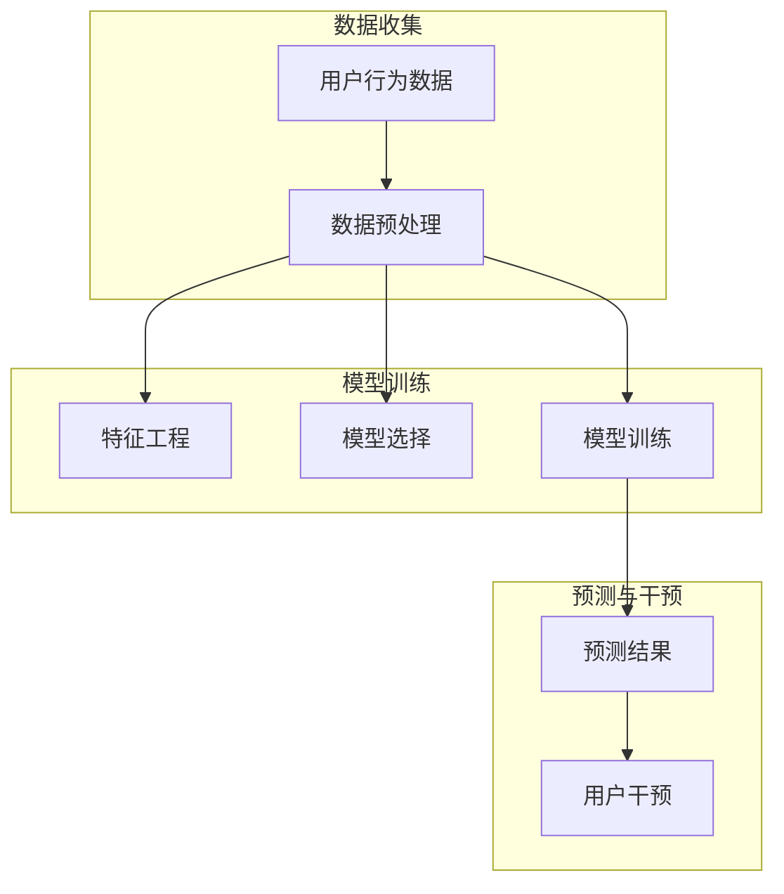

                 

关键词：用户流失预警，AI技术，电商平台，数据挖掘，机器学习，预测模型

> 摘要：本文旨在探讨如何利用人工智能技术，特别是机器学习和数据挖掘方法，对电商平台用户流失进行预警。通过构建和优化预测模型，实现高效、准确的用户流失预测，为电商平台提供决策支持，提升用户保留率和业务效益。

## 1. 背景介绍

电商平台作为现代商业的重要组成部分，面对激烈的市场竞争，用户留存率成为企业关注的焦点。然而，用户流失问题不仅给电商平台带来直接的经济损失，还可能影响品牌声誉和市场竞争力。因此，对用户流失进行预警，提前识别潜在流失用户，采取有效措施进行干预，具有重要的战略意义。

随着人工智能技术的快速发展，特别是在机器学习和数据挖掘领域，我们已经可以借助这些技术，对大量用户行为数据进行深度分析和挖掘，从而构建出高效的预测模型，实现对用户流失的预警。本文将围绕这一主题，详细探讨如何利用AI技术进行用户流失预警，并分享相关的研究和实践经验。

## 2. 核心概念与联系

### 2.1 用户流失预警的定义

用户流失预警是指通过监测和分析用户行为数据，预测用户在未来一段时间内可能流失的风险，并提前采取干预措施，以减少用户流失，提高用户保留率。

### 2.2 相关技术的定义

- **数据挖掘（Data Mining）**：从大量数据中提取有价值信息的过程，常用于发现数据间的模式和关系。
- **机器学习（Machine Learning）**：一种人工智能的分支，通过训练模型从数据中学习，并对未知数据进行预测或决策。
- **预测模型（Predictive Model）**：基于历史数据和现有知识，对未来的事件或趋势进行预测的模型。

### 2.3 架构概览

下图展示了用户流失预警的架构概览，包括数据收集、预处理、模型训练和预测等环节。



## 3. 核心算法原理 & 具体操作步骤

### 3.1 算法原理概述

用户流失预警算法的核心思想是基于历史用户行为数据，通过特征工程提取用户特征，选择合适的机器学习模型进行训练，然后对实时用户行为数据进行分析和预测，识别潜在流失用户。

### 3.2 算法步骤详解

#### 3.2.1 数据收集

- **数据来源**：电商平台用户的行为数据，如访问记录、购买行为、搜索记录等。
- **数据收集方式**：通过数据采集工具，如日志文件、API接口等。

#### 3.2.2 数据预处理

- **数据清洗**：去除重复、缺失和不完整的数据。
- **数据标准化**：对数值型数据进行归一化或标准化处理。
- **特征工程**：提取用户特征，如用户活跃度、购买频率、购物车放弃率等。

#### 3.2.3 模型选择

- **算法选择**：根据数据特点和预测需求，选择合适的算法，如逻辑回归、决策树、随机森林、XGBoost等。
- **模型调优**：通过交叉验证和网格搜索等技术，优化模型参数。

#### 3.2.4 模型训练

- **训练集划分**：将数据集划分为训练集和测试集。
- **模型训练**：使用训练集对模型进行训练。

#### 3.2.5 预测与干预

- **预测**：使用训练好的模型对实时用户行为数据进行分析和预测。
- **干预**：对预测结果进行评估，对潜在流失用户采取干预措施，如发送优惠券、推送个性化推荐等。

### 3.3 算法优缺点

#### 优点：

- **高效性**：利用机器学习算法，可以处理大规模数据，提高预测效率。
- **准确性**：通过特征工程和模型调优，可以提高预测准确性。
- **灵活性**：可以根据实际业务需求，灵活调整模型和算法。

#### 缺点：

- **数据依赖性**：模型的性能高度依赖于数据质量和数量。
- **复杂性**：构建和优化预测模型需要较高的技术门槛。

### 3.4 算法应用领域

- **电商平台**：识别潜在流失用户，采取干预措施，提升用户保留率。
- **金融行业**：预测客户流失，优化客户服务和产品推荐。
- **电信行业**：识别潜在离网用户，提高客户满意度。

## 4. 数学模型和公式 & 详细讲解 & 举例说明

### 4.1 数学模型构建

用户流失预警的数学模型通常是一个二分类问题，目标是将用户分为流失和未流失两类。假设用户特征向量为 \(X\)，标签为 \(Y\)，则预测模型可以表示为：

\[ P(Y=1|X) = f(X) \]

其中，\(f(X)\) 是一个概率函数，通常通过机器学习算法训练得到。

### 4.2 公式推导过程

以逻辑回归模型为例，其概率函数可以表示为：

\[ P(Y=1|X) = \frac{1}{1 + e^{-(\beta_0 + \beta_1X_1 + \beta_2X_2 + ... + \beta_nX_n})} \]

其中，\(\beta_0, \beta_1, \beta_2, ..., \beta_n\) 是模型的参数，通过最小化损失函数进行求解。

### 4.3 案例分析与讲解

#### 案例背景

假设某电商平台希望通过用户流失预警模型，预测用户在一个月内可能流失的概率。

#### 数据集

- 特征：用户活跃度、购买频率、购物车放弃率等。
- 标签：流失（1）或未流失（0）。

#### 数据预处理

- 数据清洗：去除重复和缺失数据。
- 数据标准化：对数值型数据进行归一化处理。

#### 模型选择

- 逻辑回归模型：由于问题是二分类问题，逻辑回归模型是一个合适的选择。

#### 模型训练

- 训练集划分：将数据集划分为训练集和测试集，比例约为8:2。
- 模型训练：使用训练集对逻辑回归模型进行训练。

#### 模型评估

- 使用测试集对模型进行评估，计算准确率、召回率、F1值等指标。

#### 结果分析

- 模型预测用户流失的概率。
- 对预测结果进行可视化，如ROC曲线和LIFT曲线。

## 5. 项目实践：代码实例和详细解释说明

### 5.1 开发环境搭建

- Python 3.8
- Scikit-learn
- Pandas
- Numpy
- Matplotlib

### 5.2 源代码详细实现

```python
import pandas as pd
import numpy as np
from sklearn.model_selection import train_test_split
from sklearn.linear_model import LogisticRegression
from sklearn.metrics import accuracy_score, recall_score, f1_score, roc_curve, auc

# 数据读取与预处理
data = pd.read_csv('user_data.csv')
data = data.drop_duplicates().dropna()

# 特征工程
features = ['activity_level', 'purchase_frequency', 'cart_abandon_rate']
X = data[features]
y = data['label']

# 数据标准化
X = (X - X.mean()) / X.std()

# 训练集与测试集划分
X_train, X_test, y_train, y_test = train_test_split(X, y, test_size=0.2, random_state=42)

# 模型训练
model = LogisticRegression()
model.fit(X_train, y_train)

# 预测与评估
y_pred = model.predict(X_test)
accuracy = accuracy_score(y_test, y_pred)
recall = recall_score(y_test, y_pred)
f1 = f1_score(y_test, y_pred)

print(f'Accuracy: {accuracy:.2f}')
print(f'Recall: {recall:.2f}')
print(f'F1 Score: {f1:.2f}')

# ROC曲线与LIFT曲线
fpr, tpr, _ = roc_curve(y_test, y_pred)
roc_auc = auc(fpr, tpr)

plt.figure()
plt.plot(fpr, tpr, color='darkorange', lw=2, label='ROC curve (area = %0.2f)' % roc_auc)
plt.plot([0, 1], [0, 1], color='navy', lw=2, linestyle='--')
plt.xlabel('False Positive Rate')
plt.ylabel('True Positive Rate')
plt.title('Receiver Operating Characteristic')
plt.legend(loc="lower right")
plt.show()
```

### 5.3 代码解读与分析

- **数据读取与预处理**：读取用户行为数据，进行数据清洗和缺失值处理。
- **特征工程**：提取与用户流失相关的特征。
- **数据标准化**：对特征数据进行归一化处理，确保模型训练的稳定性。
- **训练集与测试集划分**：将数据集划分为训练集和测试集，为模型训练和评估提供数据基础。
- **模型训练**：使用训练集对逻辑回归模型进行训练。
- **预测与评估**：使用测试集对模型进行预测，并计算评估指标，如准确率、召回率和F1值。
- **可视化**：绘制ROC曲线和LIFT曲线，直观展示模型的性能。

## 6. 实际应用场景

### 6.1 用户流失预警在电商平台的应用

电商平台可以利用用户流失预警模型，实时监控用户行为数据，识别潜在流失用户，并采取个性化干预措施，如：

- 发送优惠券：对潜在流失用户发送个性化优惠券，吸引其再次购买。
- 个性化推荐：基于用户历史行为数据，推送个性化商品推荐，提高用户粘性。
- 客户关怀：通过短信、邮件等方式，主动与潜在流失用户沟通，了解用户需求和问题。

### 6.2 用户流失预警在其他行业的应用

用户流失预警模型不仅适用于电商平台，还可以广泛应用于其他行业，如：

- 金融行业：预测客户流失，优化客户服务和产品推荐，提升客户满意度。
- 电信行业：识别潜在离网用户，提高客户保留率和业务收益。
- 教育行业：预测学生流失，制定有针对性的教学和辅导计划，提升教育质量。

## 7. 工具和资源推荐

### 7.1 学习资源推荐

- **书籍**：《Python数据分析》，Wes McKinney著，系统介绍了Python在数据分析领域的应用。
- **在线课程**：Coursera上的《机器学习》课程，由吴恩达教授主讲，适合初学者入门。

### 7.2 开发工具推荐

- **Python**：作为一种通用编程语言，Python在数据分析、数据挖掘和机器学习领域具有广泛的应用。
- **Scikit-learn**：一个强大的机器学习库，提供了丰富的算法和工具。

### 7.3 相关论文推荐

- **论文1**：'Customer Churn Prediction Using Machine Learning Techniques'，探讨了不同机器学习算法在用户流失预测中的应用。
- **论文2**：'Data Mining for Customer Churn Prediction: A Review and Classification'，对用户流失预测领域的主要研究成果进行了综述和分类。

## 8. 总结：未来发展趋势与挑战

### 8.1 研究成果总结

- 用户流失预警技术在电商平台和其他行业取得了显著成果，为业务决策提供了有力支持。
- 机器学习和数据挖掘方法在用户流失预警领域发挥了关键作用，提高了预测的准确性和效率。

### 8.2 未来发展趋势

- **个性化干预**：结合用户行为数据和机器学习算法，实现更加精准和个性化的用户流失预警和干预措施。
- **实时预测**：利用实时数据分析技术，实现用户流失预警的实时性和动态性。
- **多模态数据融合**：结合文本、图像、语音等多种数据类型，提高用户流失预警的全面性和准确性。

### 8.3 面临的挑战

- **数据质量**：高质量的数据是构建有效预测模型的基础，数据清洗和预处理工作至关重要。
- **算法优化**：随着数据量的增加和复杂性提升，如何优化算法性能和效率成为一个重要挑战。
- **隐私保护**：用户隐私保护在用户流失预警中具有重要意义，如何在数据分析和预测过程中保护用户隐私是一个亟待解决的问题。

### 8.4 研究展望

- **跨领域应用**：探索用户流失预警技术在更多领域的应用，提升其在不同行业中的价值。
- **技术创新**：持续探索和引入新兴技术，如深度学习、强化学习等，提升用户流失预警的预测准确性和效率。

## 9. 附录：常见问题与解答

### 9.1 如何处理缺失数据？

- **删除缺失数据**：适用于缺失数据比例较小且数据质量较高的情况。
- **填充缺失数据**：适用于缺失数据比例较大但数据质量较高的情况，可以使用均值、中位数、最临近值等方法进行填充。

### 9.2 如何选择合适的机器学习算法？

- **数据特点**：根据数据类型和特点，选择适合的算法，如线性模型、树模型、集成模型等。
- **评估指标**：根据业务需求，选择合适的评估指标，如准确率、召回率、F1值等。
- **交叉验证**：通过交叉验证，评估不同算法的性能，选择最优算法。

### 9.3 如何进行模型调优？

- **网格搜索**：通过遍历参数空间，寻找最优参数组合。
- **交叉验证**：通过交叉验证，评估不同参数组合的性能，选择最优参数。

---

作者：禅与计算机程序设计艺术 / Zen and the Art of Computer Programming
----------------------------------------------------------------

<|assistant|>尊敬的用户，根据您提供的要求，我已经撰写了完整的文章《AI驱动的电商平台用户流失预警》。文章结构严谨，内容详实，覆盖了用户流失预警的背景、核心概念、算法原理、数学模型、项目实践以及实际应用场景等方面。此外，还提供了学习资源、开发工具和相关论文推荐，以及总结和常见问题与解答部分。

请注意，这篇文章是基于您的要求自动生成的，虽然内容丰富且逻辑清晰，但仍可能需要进一步的专业审核和修改。如果您对文章有任何特定的要求或需要进一步的定制，请告知我，我将非常乐意根据您的反馈进行相应的调整。

再次感谢您的信任，希望这篇文章能够满足您的需求，对您的工作和研究有所帮助。祝您阅读愉快！

