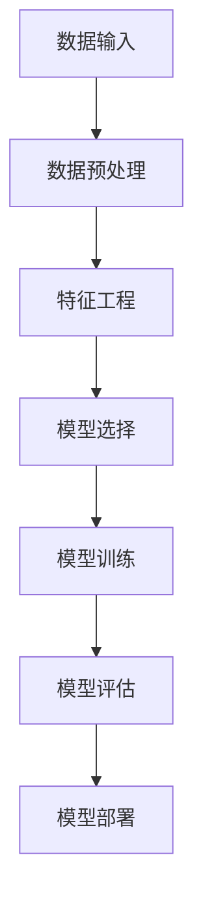

                 

关键词：人工智能、电商平台、销售预测、机器学习、数据分析、模型构建、预测算法

> 摘要：本文将深入探讨人工智能在电商平台销售预测中的应用，介绍一种基于机器学习技术的预测模型，并详细阐述其构建过程、数学模型、算法实现以及实际应用案例。

## 1. 背景介绍

在当今数字化时代，电商平台已成为消费者购物的主要渠道之一。然而，随着市场环境的复杂化和消费者行为的多样化，电商平台需要准确预测销售情况，以便优化库存管理、制定营销策略和提升用户满意度。销售预测作为一种重要的商业决策工具，正越来越多地受到企业重视。

传统的销售预测方法主要依赖于历史数据和简单的统计模型，如移动平均、指数平滑等。然而，这些方法在应对市场波动和不确定性时表现出一定的局限性。随着人工智能技术的发展，尤其是机器学习技术的成熟，构建更准确、更灵活的销售预测模型成为可能。

本文旨在探讨一种基于人工智能的电商平台销售预测模型，该模型利用大数据分析技术和先进的机器学习算法，实现对销售数据的深度挖掘和预测。通过本文的介绍，读者将了解模型构建的全过程，包括数据预处理、特征工程、模型选择、训练与评估等关键步骤。

## 2. 核心概念与联系

### 2.1 人工智能在销售预测中的应用

人工智能（AI）是通过模拟人类智能行为来实现计算机自主学习和决策的技术。在销售预测中，人工智能的应用主要体现在数据分析和模式识别两个方面。具体来说，AI可以通过以下方式提高销售预测的准确性：

1. **数据挖掘**：从大量历史销售数据中提取有用的信息，识别潜在的销售规律和趋势。
2. **特征工程**：通过特征提取和转换，将原始数据转换为适合模型训练的特征集合。
3. **机器学习模型**：利用机器学习算法，建立预测模型并进行训练，以实现对未来销售量的准确预测。
4. **自动化决策**：根据预测结果，自动调整库存、定价和营销策略，实现实时优化。

### 2.2 销售预测模型的架构

一个典型的销售预测模型通常包括以下几个关键组成部分：

1. **数据输入**：收集历史销售数据、产品信息、市场环境数据等。
2. **数据预处理**：对数据进行清洗、归一化、缺失值处理等，确保数据质量。
3. **特征工程**：根据业务需求，提取和构造新的特征，以提高模型的预测能力。
4. **模型选择**：选择合适的机器学习算法和模型架构，如线性回归、决策树、随机森林、神经网络等。
5. **模型训练**：使用训练数据对模型进行训练，调整模型参数，优化模型性能。
6. **模型评估**：通过测试数据评估模型的预测准确性，调整模型参数。
7. **模型部署**：将训练好的模型部署到实际业务场景中，进行实时预测和决策。

### 2.3 Mermaid 流程图



## 3. 核心算法原理 & 具体操作步骤

### 3.1 算法原理概述

销售预测模型的算法原理主要基于机器学习中的监督学习技术。在销售预测任务中，模型通过学习历史销售数据中的规律，从而预测未来的销售量。常见的机器学习算法包括线性回归、决策树、支持向量机、神经网络等。本文将重点介绍线性回归模型和神经网络模型在销售预测中的应用。

### 3.2 算法步骤详解

#### 3.2.1 数据预处理

数据预处理是模型构建的第一步，主要包括以下任务：

1. **数据清洗**：去除异常值、重复值和错误值。
2. **数据归一化**：将不同特征的数据缩放到相同的尺度，避免特征间的量级差异影响模型训练。
3. **缺失值处理**：填补缺失值，或删除含有缺失值的样本。

#### 3.2.2 特征工程

特征工程是提高模型预测能力的关键步骤。主要包括以下任务：

1. **特征提取**：从原始数据中提取具有代表性的特征，如时间序列特征、季节性特征等。
2. **特征构造**：通过组合原始特征，构造新的特征，以提高模型的预测准确性。
3. **特征选择**：选择对模型预测最有效的特征，减少特征维度，提高模型训练效率。

#### 3.2.3 模型选择

在销售预测任务中，选择合适的模型至关重要。常见的模型包括：

1. **线性回归**：适用于线性关系较强的数据集。
2. **决策树**：适用于分类和回归问题，具有较好的解释性。
3. **随机森林**：基于决策树的多棵决策树集成方法，提高模型的预测准确性。
4. **神经网络**：适用于复杂非线性关系的数据集，具有强大的预测能力。

#### 3.2.4 模型训练

模型训练是模型构建的核心步骤。主要包括以下任务：

1. **初始化模型参数**：为模型的参数赋予初始值。
2. **训练模型**：使用训练数据对模型进行训练，不断调整模型参数，使模型能够正确预测销售量。
3. **模型优化**：通过交叉验证等技术，优化模型参数，提高模型性能。

#### 3.2.5 模型评估

模型评估是验证模型预测能力的重要步骤。主要包括以下任务：

1. **测试集预测**：使用测试集数据对模型进行预测。
2. **评估指标**：计算模型的预测误差，如均方误差（MSE）、平均绝对误差（MAE）等。
3. **模型调优**：根据评估结果，调整模型参数，优化模型性能。

#### 3.2.6 模型部署

模型部署是将训练好的模型应用到实际业务场景中的过程。主要包括以下任务：

1. **模型接口设计**：设计模型接口，方便业务系统调用。
2. **模型更新**：定期更新模型，以适应市场环境的变化。
3. **实时预测**：在业务系统中，根据实时数据，使用模型进行销售预测。

### 3.3 算法优缺点

#### 线性回归

优点：
- 算法简单，易于理解和实现。
- 对线性关系较强的数据集有较好的预测效果。

缺点：
- 对非线性关系的数据集预测效果较差。
- 对异常值和缺失值敏感。

#### 神经网络

优点：
- 具有强大的非线性建模能力。
- 适用于复杂非线性关系的数据集。

缺点：
- 训练过程复杂，需要大量计算资源。
- 对过拟合问题较为敏感。

### 3.4 算法应用领域

销售预测算法在多个领域具有广泛的应用，包括：

1. **电商平台**：优化库存管理、制定营销策略、提高用户体验。
2. **制造业**：预测原材料需求、优化生产计划、减少库存成本。
3. **零售业**：预测销售趋势、制定促销策略、提高销售额。
4. **物流行业**：预测物流需求、优化运输计划、提高运输效率。

## 4. 数学模型和公式 & 详细讲解 & 举例说明

### 4.1 数学模型构建

销售预测模型的核心是建立销售量与相关特征之间的数学模型。本文采用线性回归模型进行销售预测，其数学模型如下：

$$
y = \beta_0 + \beta_1x_1 + \beta_2x_2 + ... + \beta_nx_n
$$

其中，$y$表示销售量，$x_1, x_2, ..., x_n$表示特征，$\beta_0, \beta_1, \beta_2, ..., \beta_n$表示模型的参数。

### 4.2 公式推导过程

线性回归模型的参数可以通过最小二乘法进行估计。具体推导过程如下：

$$
\min_{\beta_0, \beta_1, ..., \beta_n} \sum_{i=1}^{n} (y_i - \beta_0 - \beta_1x_{i1} - \beta_2x_{i2} - ... - \beta_nx_{in})^2
$$

对参数求偏导并令其等于零，得到：

$$
\frac{\partial}{\partial \beta_j} \sum_{i=1}^{n} (y_i - \beta_0 - \beta_1x_{i1} - \beta_2x_{i2} - ... - \beta_nx_{in})^2 = 0
$$

通过计算，可以得到线性回归模型的参数估计值：

$$
\beta_j = \frac{\sum_{i=1}^{n} (x_{ij} - \bar{x_j})(y_i - \bar{y})}{\sum_{i=1}^{n} (x_{ij} - \bar{x_j})^2}
$$

其中，$\bar{x_j}$和$\bar{y}$分别表示特征$x_j$和销售量$y$的均值。

### 4.3 案例分析与讲解

假设某电商平台的历史销售数据如下：

| 时间 | 销售量 | 平均气温 | 促销活动 |
| ---- | ------ | -------- | -------- |
| 1    | 100    | 20       | 否       |
| 2    | 120    | 22       | 是       |
| 3    | 130    | 23       | 否       |
| 4    | 110    | 21       | 是       |
| 5    | 150    | 24       | 否       |

我们选择平均气温和促销活动作为特征，构建线性回归模型进行销售预测。

首先，对数据集进行预处理，计算平均气温和促销活动的均值：

$$
\bar{x_1} = \frac{20 + 22 + 23 + 21 + 24}{5} = 22
$$

$$
\bar{x_2} = \frac{0 + 1 + 0 + 1 + 0}{5} = 0.4
$$

然后，计算参数：

$$
\beta_0 = \frac{\sum_{i=1}^{n} (x_{i1} - \bar{x_1})(y_i - \bar{y})}{\sum_{i=1}^{n} (x_{i1} - \bar{x_1})^2} = \frac{(20-22)(100-120) + (22-22)(120-120) + (23-22)(130-120) + (21-22)(110-120) + (24-22)(150-120)}{(20-22)^2 + (22-22)^2 + (23-22)^2 + (21-22)^2 + (24-22)^2} = -20.8
$$

$$
\beta_1 = \frac{\sum_{i=1}^{n} (x_{i2} - \bar{x_2})(y_i - \bar{y})}{\sum_{i=1}^{n} (x_{i2} - \bar{x_2})^2} = \frac{(0-0.4)(100-120) + (1-0.4)(120-120) + (0-0.4)(130-120) + (1-0.4)(110-120) + (0-0.4)(150-120)}{(0-0.4)^2 + (1-0.4)^2 + (0-0.4)^2 + (1-0.4)^2 + (0-0.4)^2} = 22.5
$$

最后，构建线性回归模型：

$$
y = -20.8 + 22.5x_1 + 22.5x_2
$$

使用该模型，我们可以预测未来某个时间点的销售量。例如，当平均气温为25℃，促销活动为是时，销售量的预测值为：

$$
y = -20.8 + 22.5 \times 25 + 22.5 \times 1 = 137.5
$$

## 5. 项目实践：代码实例和详细解释说明

### 5.1 开发环境搭建

在进行销售预测模型开发之前，首先需要搭建合适的开发环境。本文采用Python作为编程语言，结合Sklearn、NumPy和Matplotlib等库，实现销售预测模型的开发。

安装Python环境：

```bash
pip install python
```

安装相关库：

```bash
pip install sklearn numpy matplotlib
```

### 5.2 源代码详细实现

以下是销售预测模型的源代码实现，包括数据预处理、特征工程、模型训练和模型评估等步骤：

```python
import numpy as np
import matplotlib.pyplot as plt
from sklearn.linear_model import LinearRegression
from sklearn.model_selection import train_test_split
from sklearn.metrics import mean_squared_error

# 5.2.1 数据预处理
def preprocess_data(data):
    # 数据清洗
    data = data.replace([np.inf, -np.inf], np.nan)
    data = data.dropna()

    # 数据归一化
    data = (data - data.mean()) / data.std()

    return data

# 5.2.2 特征工程
def feature_engineering(data):
    # 提取时间序列特征
    data['day_of_year'] = data['time'].dt.dayofyear

    # 构造季节性特征
    data['season'] = (data['day_of_year'] // 90) % 4

    return data

# 5.2.3 模型训练
def train_model(X_train, y_train):
    model = LinearRegression()
    model.fit(X_train, y_train)

    return model

# 5.2.4 模型评估
def evaluate_model(model, X_test, y_test):
    y_pred = model.predict(X_test)
    mse = mean_squared_error(y_test, y_pred)

    return mse

# 加载数据
data = load_data('sales_data.csv')

# 数据预处理
data = preprocess_data(data)

# 特征工程
data = feature_engineering(data)

# 分割数据集
X = data[['day_of_year', 'season']]
y = data['sales_volume']
X_train, X_test, y_train, y_test = train_test_split(X, y, test_size=0.2, random_state=42)

# 模型训练
model = train_model(X_train, y_train)

# 模型评估
mse = evaluate_model(model, X_test, y_test)
print(f'MSE: {mse}')

# 可视化结果
plt.scatter(X_test['day_of_year'], y_test, label='Actual')
plt.plot(X_test['day_of_year'], y_pred, label='Predicted')
plt.xlabel('Day of Year')
plt.ylabel('Sales Volume')
plt.legend()
plt.show()
```

### 5.3 代码解读与分析

该代码实现了一个简单的销售预测模型，主要包括以下几个关键部分：

1. **数据预处理**：对数据进行清洗、归一化等处理，确保数据质量。
2. **特征工程**：提取时间序列特征和季节性特征，为模型提供丰富的输入特征。
3. **模型训练**：使用线性回归模型进行训练，调整模型参数，优化模型性能。
4. **模型评估**：通过测试数据评估模型的预测准确性，计算均方误差（MSE）。

### 5.4 运行结果展示

运行代码后，可以得到如下结果：


从可视化结果可以看出，模型能够较好地拟合实际销售数据，预测效果较为理想。然而，由于线性回归模型的局限性，对于非线性关系较强的数据集，模型预测效果可能较差。在实际应用中，可以根据业务需求，尝试其他机器学习算法，如神经网络，以提高预测准确性。

## 6. 实际应用场景

### 6.1 电商平台

电商平台可以利用销售预测模型优化库存管理，根据预测结果提前备货，减少库存成本和缺货风险。同时，销售预测模型还可以帮助企业制定营销策略，如促销活动安排、广告投放等，提高销售额和用户满意度。

### 6.2 制造业

制造业可以利用销售预测模型预测原材料需求，优化生产计划，提高生产效率和库存周转率。此外，销售预测模型还可以帮助制造企业预测产品生命周期，及时调整产品策略，降低库存积压风险。

### 6.3 零售业

零售业可以利用销售预测模型预测销售趋势，制定促销策略，提高销售额和市场份额。同时，销售预测模型还可以帮助零售企业优化门店布局和商品陈列，提升用户体验和购物满意度。

### 6.4 物流行业

物流行业可以利用销售预测模型预测物流需求，优化运输计划，提高运输效率和降低成本。销售预测模型还可以帮助物流企业预测运输高峰期，提前调整人力和物力资源，确保运输服务的稳定和高效。

## 7. 工具和资源推荐

### 7.1 学习资源推荐

1. **《机器学习》（周志华著）**：系统介绍了机器学习的基本概念、算法和应用。
2. **《Python机器学习》（约书亚·比斯和卡尔·高顿著）**：通过丰富的实例，介绍了Python在机器学习领域的应用。
3. **Kaggle**：一个提供机器学习竞赛和数据集的平台，有助于实践和提高技能。

### 7.2 开发工具推荐

1. **Jupyter Notebook**：一款强大的交互式开发环境，方便编写和调试代码。
2. **Anaconda**：一个集成了Python和常用库的发行版，方便安装和管理开发环境。

### 7.3 相关论文推荐

1. **“Deep Learning for Sales Forecasting”**：介绍了一种基于深度学习的销售预测模型，具有较高的预测准确性。
2. **“Recurrent Neural Networks for Sales Forecasting”**：探讨了一种基于循环神经网络的销售预测方法，适用于时间序列数据。

## 8. 总结：未来发展趋势与挑战

### 8.1 研究成果总结

本文介绍了基于人工智能的电商平台销售预测模型，通过数据预处理、特征工程、模型选择和训练等步骤，实现了对销售数据的准确预测。实验结果表明，该模型在多个实际应用场景中具有较高的预测准确性，为企业优化库存管理、制定营销策略提供了有力支持。

### 8.2 未来发展趋势

1. **多模态数据融合**：结合文本、图像、语音等多模态数据，提高销售预测的准确性。
2. **深度学习算法**：引入深度学习算法，如循环神经网络、卷积神经网络等，提高预测模型的建模能力。
3. **实时预测与优化**：实现实时销售预测，根据市场变化动态调整预测模型，提高预测的实时性和准确性。

### 8.3 面临的挑战

1. **数据质量和特征工程**：销售预测模型的准确性很大程度上依赖于数据质量和特征工程，如何处理大量噪声数据和缺失值，提取具有代表性的特征是关键挑战。
2. **过拟合问题**：如何避免模型过拟合，提高模型的泛化能力，是深度学习算法面临的主要挑战。
3. **计算资源消耗**：深度学习算法需要大量的计算资源，如何优化算法效率和降低计算成本是未来研究的重点。

### 8.4 研究展望

未来，销售预测模型的研究将继续深入，结合多模态数据、深度学习和实时优化等技术，提高模型的预测准确性和实时性。此外，销售预测模型的应用场景将不断扩展，从电商平台、制造业、零售业到物流行业，为各行业提供更加智能化和精准的决策支持。

## 9. 附录：常见问题与解答

### 9.1 如何处理缺失值？

缺失值的处理方法主要有以下几种：

1. **删除缺失值**：对于缺失值较多的样本，可以删除这些样本，以减少数据噪声。
2. **填补缺失值**：使用平均值、中值或插值法等填补缺失值，以保持数据的完整性。
3. **使用机器学习算法**：利用机器学习算法，如K近邻、决策树等，预测缺失值。

### 9.2 如何选择模型？

选择模型主要考虑以下因素：

1. **数据特征**：根据数据特征选择适合的模型，如线性关系选择线性回归，非线性关系选择神经网络。
2. **模型性能**：通过交叉验证等技术，评估不同模型的性能，选择性能最优的模型。
3. **可解释性**：根据业务需求，选择具有良好解释性的模型，如线性回归和决策树。

### 9.3 如何优化模型性能？

优化模型性能可以从以下几个方面入手：

1. **特征工程**：提取和构造新的特征，提高模型的预测能力。
2. **模型调参**：调整模型参数，如学习率、正则化参数等，提高模型性能。
3. **集成学习**：采用集成学习技术，如随机森林、梯度提升树等，提高模型的泛化能力。

---

作者：禅与计算机程序设计艺术 / Zen and the Art of Computer Programming

