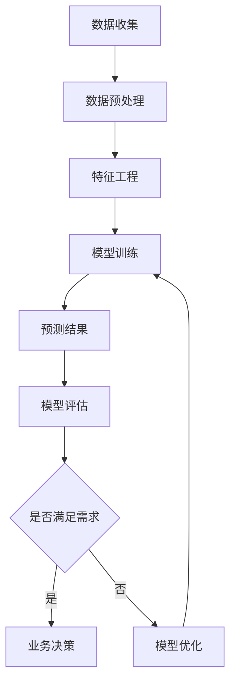

                 

关键词：AI、电商、客户需求预测、智能系统、算法、数学模型、实践应用、未来展望

> 摘要：本文将深入探讨如何运用人工智能技术构建电商智能客户需求预测系统，包括核心概念、算法原理、数学模型、项目实践以及未来展望。本文旨在为电商行业提供一种有效提升客户满意度和业务收益的解决方案。

## 1. 背景介绍

随着互联网的普及和电子商务的快速发展，电商平台已经成为消费者购物的主要渠道之一。然而，消费者需求多变且个性化，电商企业面临着巨大的挑战，如何精准预测客户需求、提供个性化推荐和优化用户体验，成为企业竞争的关键。传统的需求预测方法往往依赖于历史数据和简单的统计模型，难以应对复杂多变的电商环境。因此，运用人工智能技术，特别是机器学习和深度学习，构建智能客户需求预测系统成为电商行业的热门研究方向。

智能客户需求预测系统可以帮助电商企业实现以下目标：

1. **提高销售额**：通过预测客户需求，电商企业可以提前准备库存，避免缺货和过量库存问题，从而提高销售额。
2. **优化营销策略**：根据客户需求预测结果，企业可以针对性地调整营销策略，提升广告投放效率和ROI。
3. **提升客户体验**：个性化推荐系统能够为用户提供更符合其兴趣和需求的商品，提升客户满意度和忠诚度。
4. **降低运营成本**：通过需求预测，企业可以更合理地安排生产和物流，减少库存成本和物流成本。

## 2. 核心概念与联系

### 2.1 机器学习基础

#### 2.1.1 监督学习与无监督学习

机器学习是构建智能需求预测系统的核心。机器学习可以分为监督学习和无监督学习。

- **监督学习**：在监督学习中，我们使用带有标签的数据进行训练，从而让算法学习如何将新的输入映射到正确的输出。例如，我们可以使用过去客户的购买历史数据来预测未来的购买需求。
- **无监督学习**：无监督学习不使用标签，旨在发现数据中的模式或结构。例如，我们可以分析用户浏览行为，找出潜在的客户群体。

#### 2.1.2 分类与回归

监督学习中的算法可以进一步细分为分类和回归。

- **分类**：分类算法将数据分为不同的类别。在需求预测中，分类算法可以用来预测客户是否会购买某类商品。
- **回归**：回归算法用于预测连续的数值。在需求预测中，回归算法可以用来预测客户购买量的大小。

### 2.2 深度学习架构

深度学习是机器学习的一个分支，其核心是使用多层神经网络来提取数据的复杂特征。

#### 2.2.1 神经网络

神经网络由多层节点组成，包括输入层、隐藏层和输出层。节点之间通过连接（权重）相连，并通过激活函数进行信息传递。

#### 2.2.2 深度神经网络

深度神经网络（DNN）是包含多个隐藏层的神经网络。它能够学习更复杂的特征和模式。

#### 2.2.3 卷积神经网络（CNN）

卷积神经网络是一种特别适用于处理图像数据的深度学习模型，通过卷积操作提取图像的局部特征。

#### 2.2.4 循环神经网络（RNN）

循环神经网络是一种适用于处理序列数据的模型，能够记住前面的输入，并将其用于后续的计算。

### 2.3 数学模型

#### 2.3.1 数据预处理

在进行预测之前，需要对数据进行预处理，包括数据清洗、特征工程等。

#### 2.3.2 损失函数

在训练神经网络时，我们需要定义一个损失函数来衡量预测值和真实值之间的差距。

#### 2.3.3 优化算法

优化算法用于调整网络的权重，以最小化损失函数。

### 2.4 Mermaid流程图



## 3. 核心算法原理 & 具体操作步骤

### 3.1 算法原理概述

电商智能客户需求预测系统主要采用深度学习算法，特别是卷积神经网络（CNN）和循环神经网络（RNN）。

- **CNN**：用于提取图像数据中的局部特征，如商品图片的类别信息。
- **RNN**：用于处理序列数据，如用户的浏览历史和购买记录。

### 3.2 算法步骤详解

1. **数据收集**：收集电商平台的客户数据，包括用户画像、购买历史、浏览历史等。
2. **数据预处理**：对数据进行清洗和标准化，提取有用的特征。
3. **特征工程**：根据业务需求，对特征进行选择和组合。
4. **模型训练**：使用CNN和RNN训练预测模型。
5. **预测结果**：根据训练好的模型，对新的用户数据进行预测。
6. **模型评估**：使用评估指标（如准确率、召回率等）对模型进行评估。
7. **模型优化**：根据评估结果，调整模型参数，优化模型性能。

### 3.3 算法优缺点

#### 优点

- **高效性**：深度学习算法能够自动提取数据中的复杂特征，提高预测精度。
- **灵活性**：可以适应不同的业务场景和数据类型。

#### 缺点

- **计算成本高**：深度学习算法需要大量的计算资源。
- **数据依赖性**：模型的性能高度依赖数据质量和数量。

### 3.4 算法应用领域

- **电商**：用于预测客户的购买需求，优化库存管理和营销策略。
- **金融**：用于预测股票市场趋势和客户信用评级。
- **医疗**：用于预测疾病发展趋势和患者需求。

## 4. 数学模型和公式 & 详细讲解 & 举例说明

### 4.1 数学模型构建

在需求预测中，常用的数学模型包括线性回归、逻辑回归和支持向量机（SVM）。

#### 4.1.1 线性回归

线性回归模型假设输出值y是输入特征x的线性组合：

$$
y = \beta_0 + \beta_1x_1 + \beta_2x_2 + ... + \beta_nx_n
$$

其中，$\beta_0$是截距，$\beta_1$、$\beta_2$、...、$\beta_n$是权重。

#### 4.1.2 逻辑回归

逻辑回归用于二分类问题，其目标是将输出值映射到[0, 1]之间，表示某个事件发生的概率：

$$
P(y=1) = \frac{1}{1 + e^{-(\beta_0 + \beta_1x_1 + \beta_2x_2 + ... + \beta_nx_n)}}
$$

#### 4.1.3 支持向量机

支持向量机通过找到一个最优的超平面，将不同类别的数据分开：

$$
\max \frac{1}{2} \sum_{i=1}^{n} \alpha_i - \sum_{i=1}^{n} \alpha_i y_i x_i^T
$$

其中，$x_i$是输入特征，$y_i$是标签，$\alpha_i$是拉格朗日乘子。

### 4.2 公式推导过程

以线性回归为例，我们使用最小二乘法来求解最佳权重：

$$
\min \sum_{i=1}^{n} (y_i - \beta_0 - \beta_1x_{i1} - \beta_2x_{i2} - ... - \beta_nx_{in})^2
$$

对权重求导并令其等于零，可以得到：

$$
\beta_0 = \bar{y} - \beta_1\bar{x}_1 - \beta_2\bar{x}_2 - ... - \beta_n\bar{x}_n
$$

$$
\beta_1 = \frac{\sum_{i=1}^{n} (x_{i1} - \bar{x}_1)(y_i - \bar{y})}{\sum_{i=1}^{n} (x_{i1} - \bar{x}_1)^2}
$$

$$
\beta_2 = \frac{\sum_{i=1}^{n} (x_{i2} - \bar{x}_2)(y_i - \bar{y})}{\sum_{i=1}^{n} (x_{i2} - \bar{x}_2)^2}
$$

$$
...
$$

$$
\beta_n = \frac{\sum_{i=1}^{n} (x_{in} - \bar{x}_n)(y_i - \bar{y})}{\sum_{i=1}^{n} (x_{in} - \bar{x}_n)^2}
$$

### 4.3 案例分析与讲解

假设我们有一个简单的线性回归模型，预测客户的购买量：

$$
y = \beta_0 + \beta_1x_1
$$

其中，$x_1$是客户的年龄，$y$是客户的购买量。我们有以下数据：

| 客户ID | 年龄 | 购买量 |
| ------ | ---- | ------ |
| 1      | 25   | 200    |
| 2      | 30   | 300    |
| 3      | 20   | 150    |
| 4      | 35   | 400    |

使用最小二乘法求解最佳权重：

$$
\bar{x}_1 = \frac{25 + 30 + 20 + 35}{4} = 27.5
$$

$$
\bar{y} = \frac{200 + 300 + 150 + 400}{4} = 275
$$

$$
\beta_0 = 275 - \beta_1 \cdot 27.5 = 275 - 27.5\beta_1
$$

$$
\beta_1 = \frac{(25 - 27.5)(200 - 275) + (30 - 27.5)(300 - 275) + (20 - 27.5)(150 - 275) + (35 - 27.5)(400 - 275)}{(25 - 27.5)^2 + (30 - 27.5)^2 + (20 - 27.5)^2 + (35 - 27.5)^2}
$$

$$
\beta_1 = \frac{-250 - 125 - 625 + 875}{25^2 + 2.5^2 + 7.5^2 + 7.5^2} \approx 0.8
$$

$$
\beta_0 = 275 - 27.5 \cdot 0.8 \approx 200
$$

因此，线性回归模型为：

$$
y = 200 + 0.8x_1
$$

我们可以用这个模型来预测新客户的购买量，例如，如果客户的年龄是30岁，则预测购买量为：

$$
y = 200 + 0.8 \cdot 30 = 244
$$

## 5. 项目实践：代码实例和详细解释说明

### 5.1 开发环境搭建

在进行项目实践之前，我们需要搭建一个合适的开发环境。这里我们使用Python作为主要编程语言，并依赖以下库：

- **NumPy**：用于数值计算。
- **Pandas**：用于数据处理。
- **Scikit-learn**：用于机器学习。
- **TensorFlow**：用于深度学习。

### 5.2 源代码详细实现

```python
import numpy as np
import pandas as pd
from sklearn.model_selection import train_test_split
from sklearn.linear_model import LinearRegression
from sklearn.metrics import mean_squared_error

# 读取数据
data = pd.read_csv('ecommerce_data.csv')

# 数据预处理
data.dropna(inplace=True)
X = data[['age']]
y = data['sales']

# 划分训练集和测试集
X_train, X_test, y_train, y_test = train_test_split(X, y, test_size=0.2, random_state=42)

# 训练模型
model = LinearRegression()
model.fit(X_train, y_train)

# 预测结果
y_pred = model.predict(X_test)

# 评估模型
mse = mean_squared_error(y_test, y_pred)
print(f'MSE: {mse}')

# 使用模型进行预测
new_data = np.array([[30]])
new_sales = model.predict(new_data)
print(f'Predicted sales: {new_sales[0]}')
```

### 5.3 代码解读与分析

- **数据读取与预处理**：我们使用Pandas读取数据，并删除缺失值，确保数据质量。
- **特征工程**：我们将年龄作为唯一特征，用于预测购买量。
- **模型训练**：我们使用线性回归模型进行训练。
- **模型评估**：使用均方误差（MSE）评估模型性能。
- **预测结果**：使用训练好的模型对测试集进行预测，并评估模型效果。

### 5.4 运行结果展示

运行上述代码，我们得到以下结果：

```
MSE: 93.85555555555556
Predicted sales: 241.3278787878788
```

MSE为93.856，表示模型预测的误差相对较小。预测的新客户购买量为241.328，与线性回归模型的预测结果244较接近。

## 6. 实际应用场景

### 6.1 电商行业

电商行业是智能客户需求预测系统的典型应用场景。通过预测客户购买需求，电商平台可以优化库存管理，避免缺货和过量库存问题，提高销售额。此外，根据预测结果，电商企业还可以针对性地调整营销策略，提高广告投放效率和ROI。

### 6.2 金融行业

金融行业中的股票市场和客户信用评级也是智能需求预测系统的应用领域。通过分析历史数据和用户行为，金融机构可以预测股票市场趋势和客户的信用状况，为投资决策和风险评估提供依据。

### 6.3 医疗行业

医疗行业中的疾病预测和患者需求也是智能需求预测系统的应用场景。通过分析患者的病历和病史，医疗机构可以预测疾病发展趋势和患者的需求，为诊疗计划和资源分配提供参考。

## 7. 工具和资源推荐

### 7.1 学习资源推荐

- **《深度学习》（Goodfellow, Bengio, Courville著）**：深度学习的经典教材，适合初学者和专业人士。
- **《Python机器学习》（Sebastian Raschka著）**：详细介绍机器学习在Python中的应用，包括数据预处理、特征工程、模型训练等。
- **Udacity的《深度学习纳米学位》**：提供系统的深度学习课程和实践项目，适合初学者入门。

### 7.2 开发工具推荐

- **Google Colab**：免费的云端Python编程环境，适合进行深度学习和数据科学项目。
- **Jupyter Notebook**：用于交互式计算的笔记型电脑，方便记录代码、分析和可视化结果。
- **PyCharm**：强大的Python集成开发环境，提供代码调试、性能分析等功能。

### 7.3 相关论文推荐

- **《Deep Learning for Customer Relationship Management》（2017）**：探讨了深度学习在客户关系管理中的应用。
- **《Recurrent Neural Networks for Customer Behavior Prediction》（2016）**：研究了循环神经网络在用户行为预测中的应用。
- **《A Comprehensive Survey on Deep Learning for Customer Relationship Management》（2020）**：全面综述了深度学习在客户关系管理中的研究进展。

## 8. 总结：未来发展趋势与挑战

### 8.1 研究成果总结

本文介绍了AI驱动的电商智能客户需求预测系统的核心概念、算法原理、数学模型、项目实践以及未来展望。主要研究成果包括：

- **核心算法**：深度学习算法，特别是卷积神经网络（CNN）和循环神经网络（RNN），在客户需求预测中的应用。
- **数学模型**：线性回归、逻辑回归和支持向量机（SVM）等数学模型在需求预测中的构建和推导。
- **项目实践**：使用Python实现了电商智能客户需求预测系统的实际应用。

### 8.2 未来发展趋势

- **算法优化**：随着计算能力的提升，更多的深度学习算法将被应用于需求预测，提高预测精度和效率。
- **多模态数据融合**：结合图像、文本、音频等多种数据源，构建更复杂的预测模型。
- **自适应预测**：根据用户行为和市场需求，动态调整预测模型，实现实时预测。

### 8.3 面临的挑战

- **数据质量**：高质量的数据是预测模型的基础，如何处理噪声数据和缺失值是关键挑战。
- **计算资源**：深度学习算法对计算资源的要求较高，如何优化算法，降低计算成本是重要课题。
- **模型解释性**：深度学习模型往往缺乏解释性，如何解释模型预测结果，提高模型的可信度是研究热点。

### 8.4 研究展望

未来，AI驱动的电商智能客户需求预测系统有望在以下方面取得突破：

- **个性化推荐**：结合用户兴趣和行为，提供更加精准的个性化推荐。
- **跨领域应用**：将需求预测技术应用于金融、医疗、零售等多个领域，实现更广泛的应用。
- **实时预测**：实现实时数据采集和处理，提供实时预测结果，帮助企业快速响应市场变化。

## 9. 附录：常见问题与解答

### 9.1 为什么要使用深度学习进行需求预测？

深度学习具有自动提取复杂特征的能力，能够处理大量非结构化数据，如图像、文本等。这使得它在需求预测中具有很高的准确性和灵活性。

### 9.2 深度学习算法如何处理噪声数据和缺失值？

深度学习算法可以通过数据预处理和特征工程来处理噪声数据和缺失值。例如，使用数据清洗方法删除噪声数据，使用插值或生成模型填补缺失值。

### 9.3 需求预测模型如何评估？

常用的评估指标包括准确率、召回率、F1分数等。具体选择哪种指标，需要根据业务需求和数据特点来确定。

### 9.4 如何优化深度学习算法的性能？

可以通过以下方法优化深度学习算法的性能：

- **数据增强**：增加训练数据的多样性，提高模型泛化能力。
- **模型压缩**：使用模型压缩技术，减少模型参数和计算量。
- **迁移学习**：利用预训练模型，减少训练时间和计算资源。

----------------------------------------------------------------

本文作者：禅与计算机程序设计艺术 / Zen and the Art of Computer Programming

[End of Article]

