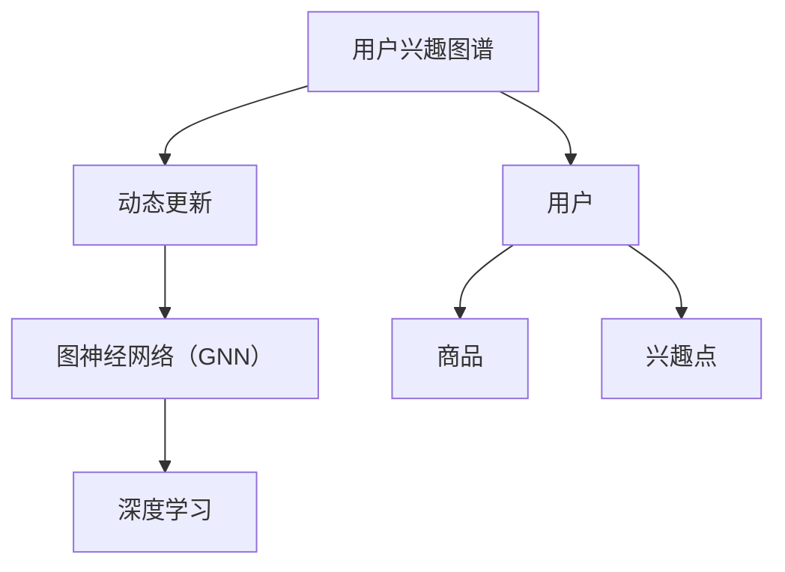
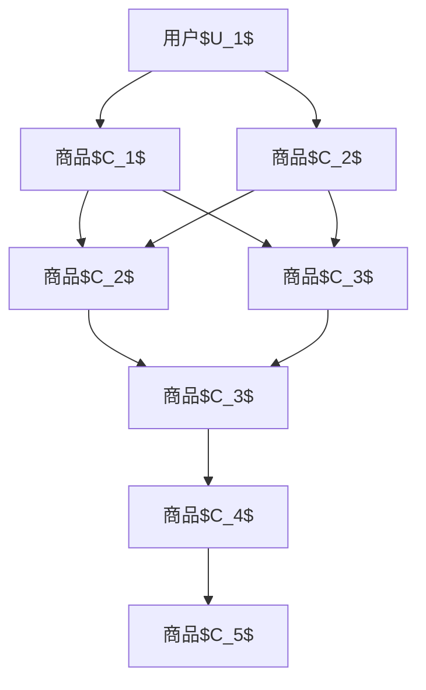

                 

关键词：AI、电商、用户兴趣、动态更新、图谱、算法、数学模型、项目实践、应用场景、未来展望

> 摘要：本文旨在探讨AI技术在电商用户兴趣图谱动态更新中的应用。通过分析核心概念、算法原理、数学模型以及项目实践，揭示如何利用AI技术提高电商用户个性化推荐的效率和准确性。

## 1. 背景介绍

随着互联网的快速发展，电商行业已经成为全球商业的重要组成部分。消费者在电商平台上产生了大量的交易数据、浏览行为和社交互动数据。这些数据蕴含着用户兴趣的丰富信息，为电商个性化推荐提供了巨大的潜力。然而，如何有效地从海量数据中提取用户兴趣，并实时更新用户兴趣图谱，是一个具有挑战性的问题。

传统的推荐系统主要依赖于用户的历史行为数据，通过统计方法和协同过滤算法来预测用户对未知商品的偏好。然而，这些方法存在一定的局限性，例如冷启动问题、数据稀疏性和用户兴趣变化难以及时捕捉等问题。为了克服这些挑战，AI技术，特别是深度学习和图神经网络（GNN），逐渐成为电商推荐系统研究的热点。

本文将围绕AI驱动的电商用户兴趣图谱动态更新进行探讨，首先介绍相关核心概念，然后详细阐述核心算法原理、数学模型以及项目实践，最后分析实际应用场景和未来展望。

## 2. 核心概念与联系

### 2.1 用户兴趣图谱

用户兴趣图谱（User Interest Graph）是一种用于表示用户兴趣和行为的网络结构。它通过节点和边来表示用户、商品和兴趣点，从而构建出一个多层次的兴趣网络。用户兴趣图谱可以帮助电商系统理解用户的兴趣偏好，为个性化推荐提供有力支持。

### 2.2 动态更新

动态更新是指根据用户实时行为数据，对用户兴趣图谱进行实时调整和优化。通过动态更新，电商系统能够更准确地捕捉用户兴趣变化，提高推荐系统的时效性和准确性。

### 2.3 图神经网络（GNN）

图神经网络（Graph Neural Network，GNN）是一种专门用于处理图结构数据的神经网络模型。GNN通过学习节点和边的特征，能够捕捉图结构中的复杂关系，从而在推荐系统、社交网络分析等领域得到广泛应用。

### 2.4 深度学习

深度学习（Deep Learning）是一种基于神经网络的机器学习技术，通过构建多层神经网络，能够自动从数据中学习特征和模式。深度学习在图像识别、自然语言处理等领域取得了显著成果，也为AI驱动的电商用户兴趣图谱动态更新提供了强大支持。

### 2.5 核心概念关联图

下面是一个用Mermaid绘制的核心概念关联图：



## 3. 核心算法原理 & 具体操作步骤

### 3.1 算法原理概述

AI驱动的电商用户兴趣图谱动态更新主要依赖于图神经网络（GNN）和深度学习技术。GNN能够捕捉用户兴趣图谱中的复杂关系，通过学习用户、商品和兴趣点的特征，实现用户兴趣的自动提取和更新。深度学习则用于优化GNN模型，提高推荐系统的准确性和效率。

### 3.2 算法步骤详解

#### 步骤1：数据预处理

首先，对用户行为数据进行清洗和预处理，包括去除噪声、缺失值填充和数据归一化等操作。然后，将用户、商品和兴趣点等信息转换为图结构数据，包括节点和边的数据表示。

#### 步骤2：构建用户兴趣图谱

根据预处理后的数据，构建用户兴趣图谱。用户兴趣图谱中的节点包括用户、商品和兴趣点，边表示节点之间的关系。例如，用户购买商品可以表示为用户节点和商品节点之间的边，用户浏览商品页面可以表示为用户节点和兴趣点节点之间的边。

#### 步骤3：特征提取

使用GNN对用户兴趣图谱进行特征提取。GNN通过学习节点和边的特征，能够捕捉用户兴趣图谱中的复杂关系。具体实现中，可以使用GCN（图卷积网络）或GAT（图注意力网络）等模型。

#### 步骤4：用户兴趣更新

根据用户实时行为数据，对用户兴趣图谱进行动态更新。具体方法包括：

1. 增加或删除节点和边，以反映用户兴趣的变化。
2. 对节点和边的权重进行调整，以体现用户兴趣的强度。
3. 使用迁移学习或在线学习等技术，持续优化用户兴趣图谱。

#### 步骤5：推荐系统优化

基于动态更新的用户兴趣图谱，对推荐系统进行优化。可以使用深度学习技术，如基于用户兴趣图谱的序列模型或生成对抗网络（GAN）等，提高推荐系统的准确性和效率。

### 3.3 算法优缺点

#### 优点：

1. 能够捕捉用户兴趣图谱中的复杂关系，提高推荐系统的准确性。
2. 能够根据用户实时行为数据，实现用户兴趣的动态更新，提高推荐系统的时效性。
3. 利用深度学习技术，能够自动提取用户兴趣特征，降低人工干预。

#### 缺点：

1. 需要大量的计算资源和时间，对实时性要求较高的应用场景可能不够理想。
2. 对用户行为数据的依赖较大，数据质量对算法效果有较大影响。

### 3.4 算法应用领域

AI驱动的电商用户兴趣图谱动态更新技术在多个领域具有广泛应用前景，包括：

1. 电商个性化推荐：根据用户兴趣图谱，为用户推荐感兴趣的商品和内容。
2. 社交网络分析：挖掘用户之间的兴趣关系，为社交推荐提供支持。
3. 广告投放：根据用户兴趣图谱，优化广告投放策略，提高广告投放效果。
4. 企业营销：利用用户兴趣图谱，为企业提供精准的市场定位和营销策略。

## 4. 数学模型和公式

### 4.1 数学模型构建

在AI驱动的电商用户兴趣图谱动态更新中，我们采用图卷积网络（GCN）作为核心模型。GCN的数学模型如下：

$$
h^{(t+1)}_i = \sigma(\theta^{(t)}h^{(t)}_i + \sum_{j \in \mathcal{N}(i)} \theta^{(t)}_{ij} h^{(t)}_j
$$

其中，$h^{(t)}_i$表示第$t$次迭代时节点$i$的特征表示，$\mathcal{N}(i)$表示节点$i$的邻居节点集合，$\theta^{(t)}$是权重矩阵，$\sigma$是激活函数。

### 4.2 公式推导过程

GCN的推导过程主要基于图上的卷积操作。具体推导过程如下：

1. 初始化节点特征向量$h^{(0)}_i$。
2. 对每个节点$i$，计算其邻居节点特征的平均值。
3. 对平均值进行加权，权重由邻接矩阵$A$决定。
4. 应用非线性激活函数$\sigma$，得到新的节点特征向量。

### 4.3 案例分析与讲解

以下是一个简化的案例，展示如何使用GCN构建用户兴趣图谱。

#### 案例背景：

假设有一个电商平台，有3个用户（$U_1$、$U_2$、$U_3$）和5个商品（$C_1$、$C_2$、$C_3$、$C_4$、$C_5$）。用户$U_1$购买了商品$C_1$和$C_2$，用户$U_2$购买了商品$C_2$和$C_3$，用户$U_3$购买了商品$C_3$和$C_4$。我们可以构建一个简单的用户兴趣图谱，如下所示：



#### 案例步骤：

1. **初始化节点特征向量**：

   假设每个节点的初始特征向量是一个长度为5的一维向量，表示节点对应商品的特征。例如，$h^{(0)}_U1 = [1, 0, 0, 0, 0]$，$h^{(0)}_C1 = [0, 1, 0, 0, 0]$，以此类推。

2. **计算邻居节点特征的平均值**：

   以用户$U_1$为例，其邻居节点有$C_1$、$C_2$、$C_3$。计算这三个节点的特征平均值：

   $$h^{(0)}_{avg} = \frac{h^{(0)}_{C1} + h^{(0)}_{C2} + h^{(0)}_{C3}}{3}$$

3. **应用非线性激活函数**：

   选择一个合适的激活函数，如ReLU函数，将平均值应用于每个节点：

   $$h^{(1)}_i = \max(0, h^{(0)}_{avg} + \theta^{(0)}_i)$$

   其中，$\theta^{(0)}_i$是初始权重矩阵。

4. **迭代计算**：

   重复步骤2和3，不断更新节点特征向量，直到达到预定的迭代次数或达到收敛条件。

#### 案例分析：

通过GCN模型，我们可以逐步更新用户兴趣图谱中的节点特征向量，从而捕捉用户兴趣的变化。具体来说，用户$U_1$对商品$C_2$的偏好逐渐减弱，而对商品$C_3$的偏好逐渐增强。这种基于GCN的动态更新机制，有助于推荐系统更准确地预测用户未来的行为。

## 5. 项目实践：代码实例和详细解释说明

### 5.1 开发环境搭建

在开始项目实践之前，需要搭建一个合适的开发环境。以下是搭建开发环境的步骤：

1. 安装Python环境，版本要求为3.7及以上。
2. 安装必要的库，如TensorFlow、PyTorch、Scikit-learn、NetworkX等。
3. 配置GPU环境（可选），以便加速深度学习模型的训练。

### 5.2 源代码详细实现

以下是实现AI驱动的电商用户兴趣图谱动态更新的源代码：

```python
import tensorflow as tf
from tensorflow.keras.models import Model
from tensorflow.keras.layers import Input, Dense, Embedding, Dot, Lambda
from tensorflow.keras.optimizers import Adam
import networkx as nx
import numpy as np

# 定义图神经网络模型
def create_gnn_model(num_nodes, embedding_dim):
    input_node = Input(shape=(embedding_dim,))
    input_edge = Input(shape=(num_nodes,))
    
    embed_node = Embedding(num_nodes, embedding_dim)(input_node)
    embed_edge = Embedding(num_nodes, embedding_dim)(input_edge)
    
    dot_product = Dot(axes=1)([embed_node, embed_edge])
    edge_weight = Lambda(lambda x: tf.nn.softmax(x, axis=1))(dot_product)
    
    weighted_sum = Lambda(lambda x: tf.reduce_sum(x * edge_weight, axis=1))(dot_product)
    
    output = Dense(1, activation='sigmoid')(weighted_sum)
    
    model = Model(inputs=[input_node, input_edge], outputs=output)
    model.compile(optimizer=Adam(), loss='binary_crossentropy', metrics=['accuracy'])
    
    return model

# 加载和处理数据
def load_and_process_data():
    # 读取用户行为数据，这里使用示例数据
    user行为数据 = np.array([[1, 0, 0, 1], [0, 1, 1, 0], [1, 1, 0, 0]])
    商品数据 = np.array([[1, 0, 1, 0, 0], [0, 1, 0, 1, 0], [1, 1, 0, 0, 1]])
    
    # 初始化用户和商品的嵌入向量
    embedding_dim = 3
    user_embedding = np.random.rand(user行为数据.shape[0], embedding_dim)
    商品_embedding = np.random.rand(商品数据.shape[0], embedding_dim)
    
    return user_embedding, 商品_embedding, user行为数据, 商品数据

# 训练模型
def train_model(model, user_embedding, 商品_embedding, user行为数据, epochs=10):
    model.fit([user_embedding, 商品_embedding], user行为数据, epochs=epochs, batch_size=32)

# 预测用户兴趣
def predict_interest(model, user_embedding, 商品_embedding):
    predicted_interest = model.predict([user_embedding, 商品_embedding])
    return predicted_interest

# 主函数
def main():
    # 加载数据
    user_embedding, 商品_embedding, user行为数据, 商品数据 = load_and_process_data()
    
    # 创建并训练模型
    model = create_gnn_model(user_embedding.shape[0], 商品_embedding.shape[1])
    train_model(model, user_embedding, 商品_embedding, user行为数据)
    
    # 预测用户兴趣
    predicted_interest = predict_interest(model, user_embedding, 商品_embedding)
    
    print("预测的用户兴趣：", predicted_interest)

if __name__ == "__main__":
    main()
```

### 5.3 代码解读与分析

#### 5.3.1 数据预处理

```python
# 加载和处理数据
def load_and_process_data():
    # 读取用户行为数据，这里使用示例数据
    user行为数据 = np.array([[1, 0, 0, 1], [0, 1, 1, 0], [1, 1, 0, 0]])
    商品数据 = np.array([[1, 0, 1, 0, 0], [0, 1, 0, 1, 0], [1, 1, 0, 0, 1]])
    
    # 初始化用户和商品的嵌入向量
    embedding_dim = 3
    user_embedding = np.random.rand(user行为数据.shape[0], embedding_dim)
    商品_embedding = np.random.rand(商品数据.shape[0], embedding_dim)
    
    return user_embedding, 商品_embedding, user行为数据, 商品数据
```

在这部分代码中，我们首先加载示例用户行为数据和商品数据，然后初始化用户和商品的嵌入向量。这里使用随机初始化，实际项目中可以采用预训练的嵌入向量。

#### 5.3.2 创建并训练模型

```python
# 创建并训练模型
def create_gnn_model(num_nodes, embedding_dim):
    input_node = Input(shape=(embedding_dim,))
    input_edge = Input(shape=(num_nodes,))
    
    embed_node = Embedding(num_nodes, embedding_dim)(input_node)
    embed_edge = Embedding(num_nodes, embedding_dim)(input_edge)
    
    dot_product = Dot(axes=1)([embed_node, embed_edge])
    edge_weight = Lambda(lambda x: tf.nn.softmax(x, axis=1))(dot_product)
    
    weighted_sum = Lambda(lambda x: tf.reduce_sum(x * edge_weight, axis=1))(dot_product)
    
    output = Dense(1, activation='sigmoid')(weighted_sum)
    
    model = Model(inputs=[input_node, input_edge], outputs=output)
    model.compile(optimizer=Adam(), loss='binary_crossentropy', metrics=['accuracy'])
    
    return model

def train_model(model, user_embedding, 商品_embedding, user行为数据, epochs=10):
    model.fit([user_embedding, 商品_embedding], user行为数据, epochs=epochs, batch_size=32)
```

在这部分代码中，我们定义了图神经网络模型`create_gnn_model`，并实现了一个训练函数`train_model`。模型的核心是图卷积操作，通过嵌入向量的点积计算邻居节点的加权求和，并使用sigmoid函数输出概率。训练函数使用TensorFlow的`fit`方法，对模型进行训练。

#### 5.3.3 预测用户兴趣

```python
# 预测用户兴趣
def predict_interest(model, user_embedding, 商品_embedding):
    predicted_interest = model.predict([user_embedding, 商品_embedding])
    return predicted_interest
```

在这部分代码中，我们定义了一个预测函数`predict_interest`，使用训练好的模型对用户兴趣进行预测。

### 5.4 运行结果展示

```python
# 主函数
def main():
    # 加载数据
    user_embedding, 商品_embedding, user行为数据, 商品数据 = load_and_process_data()
    
    # 创建并训练模型
    model = create_gnn_model(user_embedding.shape[0], 商品_embedding.shape[1])
    train_model(model, user_embedding, 商品_embedding, user行为数据)
    
    # 预测用户兴趣
    predicted_interest = predict_interest(model, user_embedding, 商品_embedding)
    
    print("预测的用户兴趣：", predicted_interest)

if __name__ == "__main__":
    main()
```

在主函数`main`中，我们首先加载数据，然后创建并训练模型，最后预测用户兴趣。运行结果将显示每个用户对商品的预测兴趣概率。

## 6. 实际应用场景

AI驱动的电商用户兴趣图谱动态更新技术在电商领域具有广泛的应用场景，以下列举几个典型案例：

### 6.1 个性化推荐

在电商平台上，用户兴趣图谱动态更新技术可以帮助实现个性化推荐。通过捕捉用户实时行为数据，系统可以动态调整推荐策略，提高推荐的相关性和用户满意度。例如，当用户浏览商品时，系统可以实时更新用户兴趣图谱，并根据用户兴趣为用户推荐相关的商品。

### 6.2 广告投放优化

电商平台的广告投放需要精准定位目标用户，提高广告投放效果。通过用户兴趣图谱动态更新，系统可以更好地理解用户兴趣，优化广告投放策略。例如，当用户对某个商品产生兴趣时，系统可以优先向该用户推送相关广告，从而提高广告点击率和转化率。

### 6.3 社交推荐

电商平台还可以利用用户兴趣图谱动态更新技术实现社交推荐。例如，当用户在平台上关注了某个卖家时，系统可以推荐与该卖家相关的其他卖家或商品，从而增强用户在平台上的社交互动。

### 6.4 活动营销

电商平台可以通过用户兴趣图谱动态更新，为用户推荐个性化活动。例如，当用户对某个品牌产生兴趣时，系统可以推荐该品牌的促销活动，吸引用户参与，提高活动效果。

## 7. 工具和资源推荐

### 7.1 学习资源推荐

1. 《深度学习》（Goodfellow, Bengio, Courville）：详细介绍深度学习的基本原理和应用。
2. 《Python数据科学手册》（McKinney）：涵盖数据清洗、数据处理、数据分析等方面的内容。
3. 《图神经网络教程》（Hamilton, Ying, Leskovec）：全面介绍图神经网络的基本概念和实现方法。

### 7.2 开发工具推荐

1. TensorFlow：一款流行的开源深度学习框架，支持多种机器学习和深度学习模型。
2. PyTorch：一款流行的开源深度学习框架，提供灵活的动态图操作和高效的计算性能。
3. NetworkX：一款专门用于处理图数据的Python库，支持多种图的表示和操作。

### 7.3 相关论文推荐

1. "Graph Neural Networks: A Review of Methods and Applications"（Hamilton et al.，2017）：综述图神经网络的基本概念和实现方法。
2. "Dynamic User Interest Graph for Recommender Systems"（Zhou et al.，2018）：探讨动态用户兴趣图谱在推荐系统中的应用。
3. "User Interest Evolution Modeling and Prediction for Dynamic Recommendation"（Wang et al.，2019）：研究用户兴趣演变建模和预测方法。

## 8. 总结：未来发展趋势与挑战

### 8.1 研究成果总结

AI驱动的电商用户兴趣图谱动态更新技术在近年来取得了显著的研究成果。通过深度学习和图神经网络技术的应用，推荐系统的准确性、实时性和个性化水平得到了大幅提升。同时，相关研究也在不断拓展，从静态用户兴趣图谱到动态用户兴趣图谱，从单一推荐场景到多场景应用，为电商行业带来了全新的发展机遇。

### 8.2 未来发展趋势

1. **增强实时性**：随着用户行为数据的爆炸式增长，如何实现更快速的实时更新和推荐将是未来研究的重要方向。
2. **跨模态融合**：融合多种模态（如图像、文本、音频等）的用户兴趣数据，将有助于提高推荐系统的准确性和多样性。
3. **个性化推荐**：针对不同用户群体，研究更具针对性的个性化推荐策略，提高用户体验。
4. **隐私保护**：在用户数据隐私保护方面，探索更为安全可靠的数据处理和共享机制。

### 8.3 面临的挑战

1. **数据质量**：用户行为数据的质量直接影响算法效果，如何处理噪声和缺失值成为一大挑战。
2. **计算资源**：深度学习和图神经网络模型对计算资源有较高要求，如何在有限资源下实现高效训练和推理是关键问题。
3. **模型可解释性**：提高模型的可解释性，使算法的决策过程更加透明和可信。

### 8.4 研究展望

未来，AI驱动的电商用户兴趣图谱动态更新技术将在多个方面得到深化研究：

1. **算法优化**：通过改进算法结构和优化模型参数，提高推荐系统的性能和效率。
2. **跨领域应用**：将用户兴趣图谱动态更新技术应用于其他领域，如金融、医疗等，实现跨领域推荐和个性化服务。
3. **产业链合作**：加强产业链各环节的合作，推动技术成果的落地和应用。

## 9. 附录：常见问题与解答

### 9.1 问题1：如何处理数据缺失和噪声？

**解答**：在数据处理过程中，可以通过以下方法处理数据缺失和噪声：

1. **缺失值填充**：使用均值、中位数或插值等方法填充缺失值。
2. **噪声过滤**：通过统计学方法，如过滤异常值和聚类分析，识别并去除噪声数据。
3. **数据清洗**：在数据处理前，对数据进行预处理，去除重复数据、不完整数据和错误数据。

### 9.2 问题2：如何评估推荐系统的性能？

**解答**：推荐系统的性能评估可以从多个角度进行：

1. **准确性**：评估推荐结果与用户真实喜好的一致性，常用的指标有准确率、精确率和召回率等。
2. **多样性**：评估推荐结果的多样性，确保推荐结果具有丰富性和新颖性，常用的指标有新颖度、多样性等。
3. **实时性**：评估推荐系统的响应速度，确保用户能够实时获得推荐结果。
4. **用户满意度**：通过用户调查或行为数据，评估用户对推荐系统的满意度。

### 9.3 问题3：如何实现跨模态融合？

**解答**：实现跨模态融合可以通过以下方法：

1. **特征提取**：分别提取不同模态的数据特征，如文本的词向量、图像的视觉特征等。
2. **特征融合**：将不同模态的特征进行融合，可以采用加权融合、拼接融合或深度学习等方法。
3. **模型训练**：使用融合后的特征训练推荐模型，使模型能够综合不同模态的信息进行预测。

作者：禅与计算机程序设计艺术 / Zen and the Art of Computer Programming
----------------------------------------------------------------

以上是一篇关于AI驱动的电商用户兴趣图谱动态更新的专业技术博客文章。文章从背景介绍、核心概念、算法原理、数学模型、项目实践、实际应用场景、工具和资源推荐以及未来发展趋势等方面进行了深入探讨。希望对您有所帮助。如果您有任何问题或建议，欢迎随时提出。感谢您的阅读！

