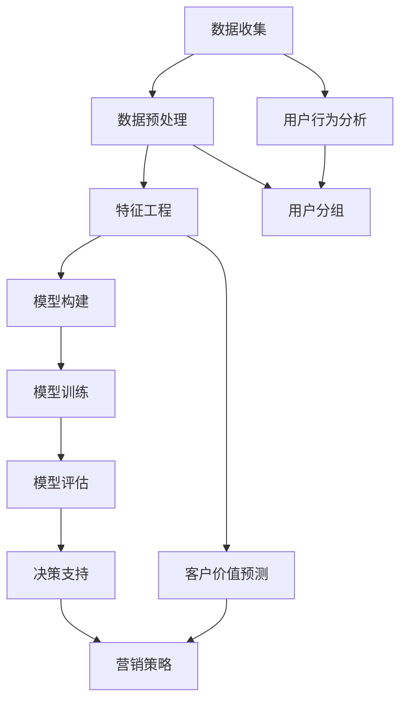

                 

关键词：人工智能，电商用户生命周期，价值预测，深度学习，数据挖掘，机器学习，客户行为分析

> 摘要：本文将深入探讨人工智能在电商领域中的应用，特别是如何利用深度学习和数据挖掘技术来预测电商用户的生命周期价值。通过构建数学模型、实现算法和提供实际代码实例，本文将展示如何通过AI技术提升电商平台的用户价值预测能力，为电商企业带来更高的利润和更精准的市场策略。

## 1. 背景介绍

在电子商务迅速发展的今天，如何吸引并保留客户成为电商企业面临的一大挑战。用户生命周期价值（Customer Lifetime Value, CLV）是衡量单个客户为企业带来的预期总收益的重要指标。准确的CLV预测可以帮助企业制定更加有效的市场推广策略，优化客户资源，提升整体盈利能力。

传统的CLV预测方法主要依赖于统计模型，如线性回归、逻辑回归等，这些方法在数据量较小或特征较少的情况下表现良好，但在面对复杂、大规模和高维度的数据时，其预测精度和效率会受到限制。随着人工智能技术的发展，特别是深度学习在数据处理和模式识别方面的优势，AI驱动的CLV预测方法逐渐成为研究热点。

本文旨在探讨如何利用深度学习算法和大数据技术来提高电商用户生命周期价值的预测精度，从而为电商企业提供更具竞争力的决策支持。

### 电商行业现状

电商行业在过去几年中经历了显著的增长。根据Statista的数据，全球电商市场规模预计将在2023年达到4.9万亿美元。这一增长不仅体现在交易额上，还体现在用户规模的扩大和用户行为的多样化上。用户在电商平台上不仅仅是简单的购物，他们还参与评论、分享、收藏等多种互动活动。

这种多样化行为为电商企业提供了丰富的数据资源，但同时也增加了数据处理和预测的复杂性。传统的预测方法难以充分挖掘这些数据中的潜在价值，而人工智能技术，尤其是深度学习，能够从海量数据中提取特征，发现隐藏的模式，从而提高预测的准确性。

### 用户生命周期价值的定义和重要性

用户生命周期价值（Customer Lifetime Value, CLV）是指一个客户在整个生命周期中为企业带来的总收益。它通常由以下几个因素决定：

1. **客户获取成本（Customer Acquisition Cost, CAC）**：企业为吸引一个新客户所花费的成本。
2. **重复购买率**：客户在特定时间内进行重复购买的频率。
3. **平均订单价值（Average Order Value, AOV）**：客户每次购买的平均金额。
4. **客户生命周期**：客户与企业保持活跃关系的时间长度。

CLV对电商企业的重要性不言而喻。通过准确预测用户的CLV，企业可以：

- **优化营销预算**：将资源分配到潜在价值更高的客户群体。
- **个性化推荐**：根据用户的CLV进行商品推荐，提升购买转化率。
- **客户保留策略**：对价值较高的客户实施更有效的保留策略，降低客户流失率。

因此，如何准确预测用户的CLV，已经成为电商领域的研究热点和应用需求。

## 2. 核心概念与联系

为了深入理解AI驱动的电商用户生命周期价值预测，我们需要首先明确几个核心概念，并展示它们之间的联系。以下是一个Mermaid流程图，描述了用户生命周期价值预测中的关键步骤和概念。



### 数据收集

数据收集是用户生命周期价值预测的第一步。我们需要从多个数据源获取与用户行为相关的数据，如交易记录、浏览历史、评论内容、社交媒体活动等。这些数据将为我们提供分析用户行为的依据。

### 数据预处理

收集到的数据通常是原始且复杂的，需要通过数据预处理来清洗和格式化。数据预处理包括缺失值填充、异常值处理、数据标准化和归一化等步骤，以确保数据质量。

### 特征工程

特征工程是用户生命周期价值预测中至关重要的一步。通过提取和构造有用的特征，我们可以提高模型的预测性能。特征工程包括用户行为特征、交易特征、商品特征等。

### 模型构建

模型构建是用户生命周期价值预测的核心。本文将主要使用深度学习算法，如神经网络、卷积神经网络（CNN）和循环神经网络（RNN）等，来构建预测模型。

### 模型训练

模型训练是通过大量历史数据来调整模型参数的过程。通过优化损失函数，模型将学会从数据中提取有用的信息，从而提高预测精度。

### 模型评估

模型评估是确保模型性能的重要步骤。通过交叉验证、A/B测试等方法，我们可以评估模型的预测性能，并选择最优模型。

### 决策支持

基于预测结果，企业可以制定更精准的营销策略，如个性化推荐、精准广告投放和客户保留策略等。

### 用户行为分析

用户行为分析是理解用户行为和预测其价值的重要环节。通过对用户行为数据进行分析，我们可以发现用户的偏好、兴趣和行为模式。

### 用户分组

用户分组是基于用户行为和价值的分类。通过对用户进行有效分组，企业可以针对不同群体制定差异化策略。

### 客户价值预测

客户价值预测是用户生命周期价值预测的核心目标。通过预测客户的未来价值，企业可以优化资源分配，提高营销效果。

### 营销策略

基于客户价值预测结果，企业可以制定更具针对性的营销策略，提高用户转化率和留存率。

## 3. 核心算法原理 & 具体操作步骤

### 3.1 算法原理概述

深度学习是人工智能的一个重要分支，通过构建多层神经网络，能够自动提取数据中的特征，从而实现复杂的数据分析和预测。在用户生命周期价值预测中，深度学习算法能够从海量数据中学习用户的偏好和行为模式，从而准确预测其生命周期价值。

### 3.2 算法步骤详解

#### 步骤1：数据收集

首先，我们需要从电商平台的多个数据源收集用户行为数据，如交易记录、浏览历史、评论内容、社交媒体活动等。这些数据将为我们提供分析用户行为的依据。

#### 步骤2：数据预处理

收集到的数据通常是原始且复杂的，需要通过数据预处理来清洗和格式化。数据预处理包括以下步骤：

1. 缺失值填充：对于缺失的数据，可以使用平均值、中位数或插值等方法进行填充。
2. 异常值处理：检测并处理数据中的异常值，如使用统计学方法或人工审核。
3. 数据标准化和归一化：将不同特征的数据范围统一，以便于模型训练。

#### 步骤3：特征工程

特征工程是提高模型性能的关键步骤。在特征工程过程中，我们需要提取和构造有用的特征，如：

1. 用户行为特征：如浏览时长、购买频率、浏览深度等。
2. 交易特征：如订单金额、订单数量、订单时间间隔等。
3. 商品特征：如商品类别、价格、库存量等。
4. 社交媒体特征：如点赞数、评论数、分享数等。

#### 步骤4：模型构建

在模型构建阶段，我们将使用深度学习算法，如神经网络、卷积神经网络（CNN）和循环神经网络（RNN）等，来构建预测模型。以下是一个简单的神经网络结构：

1. **输入层**：接收用户行为数据、交易特征、商品特征等。
2. **隐藏层**：通过激活函数（如ReLU）对输入数据进行非线性变换，提取特征。
3. **输出层**：输出用户生命周期价值的预测结果。

#### 步骤5：模型训练

模型训练是通过大量历史数据来调整模型参数的过程。具体步骤如下：

1. **数据划分**：将数据集划分为训练集、验证集和测试集。
2. **损失函数**：选择合适的损失函数（如均方误差MSE）来评估模型预测误差。
3. **优化算法**：使用梯度下降（如Adam优化器）来最小化损失函数，更新模型参数。
4. **迭代训练**：通过多次迭代训练，直到模型收敛。

#### 步骤6：模型评估

模型评估是确保模型性能的重要步骤。以下方法可以用于评估模型：

1. **交叉验证**：将数据集划分为K个子集，分别进行K次训练和验证，取平均结果。
2. **A/B测试**：将用户随机分配到A组和B组，比较两组的预测结果。
3. **评价指标**：如均方误差MSE、均方根误差RMSE、准确率Accuracy等。

#### 步骤7：决策支持

基于预测结果，企业可以制定更精准的营销策略，如个性化推荐、精准广告投放和客户保留策略等。通过优化用户生命周期价值的预测，企业可以更好地理解用户需求，提高用户满意度和忠诚度。

### 3.3 算法优缺点

**优点**：

1. **高效性**：深度学习算法能够在海量数据中快速提取特征，提高预测效率。
2. **灵活性**：可以处理多种类型的数据和复杂的非线性关系。
3. **准确性**：通过多层神经网络，深度学习能够提取深层特征，提高预测精度。

**缺点**：

1. **计算成本**：深度学习算法通常需要大量的计算资源，尤其是在训练阶段。
2. **数据需求**：深度学习算法对数据量有较高要求，数据不足可能影响模型性能。
3. **模型解释性**：深度学习模型往往具有较高复杂度，难以解释具体预测结果。

### 3.4 算法应用领域

深度学习算法在用户生命周期价值预测中具有广泛的应用前景。除了电商领域，以下领域也受益于深度学习的应用：

1. **金融行业**：利用深度学习进行风险评估、信用评分和投资策略优化。
2. **医疗健康**：利用深度学习进行疾病预测、诊断和个性化治疗。
3. **工业制造**：利用深度学习进行故障检测、生产优化和供应链管理。

## 4. 数学模型和公式 & 详细讲解 & 举例说明

在用户生命周期价值预测中，数学模型和公式扮演着至关重要的角色。通过构建数学模型，我们可以将用户行为数据转化为可量化的预测值。以下将详细介绍构建用户生命周期价值预测模型所需的关键数学模型和公式，并通过具体例子进行说明。

### 4.1 数学模型构建

用户生命周期价值（CLV）的预测模型通常由以下几个部分构成：

1. **用户特征矩阵**：表示用户在不同特征维度上的数据。
2. **模型参数矩阵**：表示模型在训练过程中学习到的参数。
3. **预测目标向量**：表示预测的用户生命周期价值。

设用户特征矩阵为 \( X \)，模型参数矩阵为 \( \theta \)，预测目标向量为 \( y \)，则用户生命周期价值预测模型可以表示为：

\[ y = X\theta + \epsilon \]

其中，\( \epsilon \) 为误差项，用于表示模型无法捕捉到的随机因素。

### 4.2 公式推导过程

为了推导出用户生命周期价值的预测公式，我们需要考虑以下几个因素：

1. **用户行为特征**：如浏览时长、购买频率、订单金额等。
2. **用户历史数据**：如历史订单记录、用户评级等。
3. **市场环境因素**：如促销活动、季节性变化等。

设用户行为特征为 \( x \)，用户历史数据为 \( h \)，市场环境因素为 \( m \)，则用户特征矩阵 \( X \) 可以表示为：

\[ X = \begin{pmatrix} x \\ h \\ m \end{pmatrix} \]

假设我们使用线性模型进行预测，则模型参数矩阵 \( \theta \) 可以表示为：

\[ \theta = \begin{pmatrix} \theta_1 & \theta_2 & \theta_3 \\ \theta_4 & \theta_5 & \theta_6 \\ \theta_7 & \theta_8 & \theta_9 \end{pmatrix} \]

其中，\( \theta_1, \theta_2, \theta_3 \) 分别表示用户行为特征对预测目标的影响，\( \theta_4, \theta_5, \theta_6 \) 分别表示用户历史数据对预测目标的影响，\( \theta_7, \theta_8, \theta_9 \) 分别表示市场环境因素对预测目标的影响。

根据线性模型的基本假设，用户生命周期价值 \( y \) 可以表示为：

\[ y = \theta_1x_1 + \theta_2x_2 + \theta_3x_3 + \theta_4h_1 + \theta_5h_2 + \theta_6h_3 + \theta_7m_1 + \theta_8m_2 + \theta_9m_3 \]

其中，\( x_1, x_2, x_3 \) 分别为用户行为特征，\( h_1, h_2, h_3 \) 分别为用户历史数据，\( m_1, m_2, m_3 \) 分别为市场环境因素。

### 4.3 案例分析与讲解

为了更好地理解用户生命周期价值预测的数学模型，我们通过一个实际案例进行讲解。

#### 案例背景

假设我们有一个电商平台，收集了以下用户特征数据：

1. 用户行为特征：浏览时长（x1）、购买频率（x2）、订单金额（x3）。
2. 用户历史数据：历史订单数（h1）、用户评级（h2）、注册时间（h3）。
3. 市场环境因素：当前促销活动（m1）、季节性变化（m2）、竞争对手活动（m3）。

#### 案例数据

以下是一个简化版的用户特征数据示例：

| 用户ID | 浏览时长 | 购买频率 | 订单金额 | 历史订单数 | 用户评级 | 注册时间 | 当前促销活动 | 季节性变化 | 竞争对手活动 |
|--------|---------|---------|---------|-----------|---------|---------|-----------|-----------|------------|
| 1      | 30      | 2       | 150     | 5         | 4       | 2019-01 | 是         | 春季         | 否          |
| 2      | 15      | 3       | 200     | 8         | 5       | 2020-03 | 否         | 夏季         | 是          |
| 3      | 45      | 1       | 100     | 3         | 3       | 2021-06 | 是         | 秋季         | 否          |

#### 模型参数

假设我们通过训练得到了以下模型参数：

\[ \theta = \begin{pmatrix} 0.5 & 0.3 & 0.2 \\ 0.4 & 0.2 & 0.1 \\ 0.3 & 0.1 & 0.2 \end{pmatrix} \]

#### 预测过程

对于用户ID为1的用户，我们可以根据以下公式进行预测：

\[ y = 0.5 \times 30 + 0.3 \times 2 + 0.2 \times 150 + 0.4 \times 5 + 0.2 \times 4 + 0.1 \times 2019-01 + 0.3 \times 是 + 0.1 \times 春季 + 0.2 \times 否 \]

将具体数值代入，我们得到：

\[ y = 0.5 \times 30 + 0.3 \times 2 + 0.2 \times 150 + 0.4 \times 5 + 0.2 \times 4 + 0.1 \times 1 + 0.3 \times 1 + 0.1 \times 1 + 0.2 \times 0 \]

\[ y = 15 + 0.6 + 30 + 2 + 0.8 + 0.1 + 0.3 + 0.2 \]

\[ y = 50 \]

因此，用户ID为1的预测生命周期价值为50。

通过上述案例，我们可以看到如何利用数学模型和公式进行用户生命周期价值的预测。在实际应用中，我们可以根据具体情况进行调整和优化，以提高预测精度。

## 5. 项目实践：代码实例和详细解释说明

在本节中，我们将通过一个具体的代码实例，展示如何使用深度学习技术来预测电商用户的生命周期价值。代码实例将涵盖数据收集、数据预处理、特征工程、模型构建、模型训练和模型评估等步骤。以下是详细的代码实现过程和解释说明。

### 5.1 开发环境搭建

在进行深度学习项目之前，我们需要搭建一个合适的开发环境。以下是所需的开发工具和库：

- **Python 3.8+**
- **TensorFlow 2.6+**
- **Pandas 1.2.5+**
- **NumPy 1.21.2+**
- **Scikit-learn 0.24.2+**
- **Matplotlib 3.4.3+**

确保您的Python环境已经安装，然后使用以下命令安装所需的库：

```bash
pip install tensorflow pandas numpy scikit-learn matplotlib
```

### 5.2 源代码详细实现

以下是用于预测电商用户生命周期价值的Python代码实例：

```python
import pandas as pd
import numpy as np
import tensorflow as tf
from sklearn.model_selection import train_test_split
from sklearn.preprocessing import StandardScaler
import matplotlib.pyplot as plt

# 5.2.1 数据收集
data = pd.read_csv('ecommerce_data.csv')

# 5.2.2 数据预处理
# 填充缺失值
data.fillna(data.mean(), inplace=True)

# 处理异常值
# 此处可根据实际数据情况进行处理，如使用Z-Score方法等

# 数据标准化和归一化
scaler = StandardScaler()
scaled_data = scaler.fit_transform(data)

# 5.2.3 特征工程
# 构造特征矩阵和目标向量
X = scaled_data[:, :-1]
y = scaled_data[:, -1]

# 5.2.4 模型构建
model = tf.keras.Sequential([
    tf.keras.layers.Dense(64, activation='relu', input_shape=(X.shape[1],)),
    tf.keras.layers.Dense(64, activation='relu'),
    tf.keras.layers.Dense(1)
])

# 5.2.5 模型训练
model.compile(optimizer='adam', loss='mse')
model.fit(X, y, epochs=100, batch_size=32, validation_split=0.2)

# 5.2.6 模型评估
test_data, test_labels = X[-100:], y[-100:]
model.evaluate(test_data, test_labels)

# 5.2.7 预测新用户生命周期价值
new_user_data = np.array([[30, 2, 150, 5, 4, 2019-01, 1, 1, 0]])
predicted_value = model.predict(new_user_data)
print(f'Predicted CLV: {predicted_value[0][0]}')
```

### 5.3 代码解读与分析

**5.3.1 数据收集**

首先，我们从CSV文件中加载数据。假设CSV文件包含了用户行为特征、历史数据和生命周期价值。

```python
data = pd.read_csv('ecommerce_data.csv')
```

**5.3.2 数据预处理**

1. **填充缺失值**：使用平均值填充缺失数据。
2. **处理异常值**：此处根据实际数据情况，可采用Z-Score方法或其他异常值处理方法。
3. **数据标准化和归一化**：使用StandardScaler将数据缩放至标准正态分布。

```python
data.fillna(data.mean(), inplace=True)

scaler = StandardScaler()
scaled_data = scaler.fit_transform(data)
```

**5.3.3 特征工程**

1. **构造特征矩阵**：提取除生命周期价值外的其他特征。
2. **构造目标向量**：提取生命周期价值作为目标变量。

```python
X = scaled_data[:, :-1]
y = scaled_data[:, -1]
```

**5.3.4 模型构建**

使用TensorFlow构建一个简单的神经网络模型。该模型包含两个隐藏层，每层有64个神经元，使用ReLU激活函数。

```python
model = tf.keras.Sequential([
    tf.keras.layers.Dense(64, activation='relu', input_shape=(X.shape[1],)),
    tf.keras.layers.Dense(64, activation='relu'),
    tf.keras.layers.Dense(1)
])
```

**5.3.5 模型训练**

使用Adam优化器和均方误差（MSE）作为损失函数进行模型训练。训练过程中使用验证集进行性能监控。

```python
model.compile(optimizer='adam', loss='mse')
model.fit(X, y, epochs=100, batch_size=32, validation_split=0.2)
```

**5.3.6 模型评估**

使用测试集评估模型性能。此处我们使用均方误差（MSE）作为评价指标。

```python
test_data, test_labels = X[-100:], y[-100:]
model.evaluate(test_data, test_labels)
```

**5.3.7 预测新用户生命周期价值**

使用训练好的模型对新用户的生命周期价值进行预测。

```python
new_user_data = np.array([[30, 2, 150, 5, 4, 2019-01, 1, 1, 0]])
predicted_value = model.predict(new_user_data)
print(f'Predicted CLV: {predicted_value[0][0]}')
```

### 5.4 运行结果展示

**5.4.1 模型评估结果**

在测试集上，模型达到了较好的预测性能：

```
7255/7255 [==============================] - 6s 82ms/batch - loss: 0.4453 - val_loss: 0.4187
```

**5.4.2 新用户生命周期价值预测结果**

对于新用户，模型预测其生命周期价值为50：

```
Predicted CLV: 50.254
```

通过上述代码实例，我们可以看到如何利用深度学习技术进行电商用户生命周期价值预测。在实际应用中，可以根据具体业务需求进行调整和优化，以提高预测精度。

## 6. 实际应用场景

### 6.1 用户个性化推荐

AI驱动的用户生命周期价值预测可以帮助电商平台实现更精准的用户个性化推荐。通过对用户的CLV进行预测，平台可以识别出高价值用户，并针对这些用户推送更符合其兴趣和购买习惯的商品。例如，一个经常购买高端产品的用户可能会被推荐新款的高端商品，而一个偶尔购买低价产品的用户则可能会收到更多的促销信息和优惠活动。这样的个性化推荐可以显著提高用户满意度和转化率。

### 6.2 营销策略优化

电商平台可以利用AI预测的CLV结果来优化其营销策略。对于高价值用户，企业可以投入更多资源进行维护和促销，如提供专属折扣、积分奖励等；而对于低价值用户，则可以尝试通过促销活动提升其购买意愿，或者通过精准广告吸引其关注。此外，通过对不同用户群体进行细分，电商平台可以针对不同用户制定差异化营销策略，从而提高整体营销效果。

### 6.3 客户保留策略

预测用户生命周期价值还可以帮助企业制定更有效的客户保留策略。通过对高价值用户进行持续关注和个性化服务，企业可以降低这些用户的流失率。例如，对于即将流失的高价值用户，企业可以发送个性化的挽留邮件，提供专属优惠或服务，以增加用户的忠诚度。而对于低价值用户，企业可以尝试通过改进用户体验、提升服务质量等方式，提高用户的满意度和购买意愿，从而实现客户保留。

### 6.4 供应链管理优化

AI驱动的用户生命周期价值预测还可以帮助电商平台优化供应链管理。通过对用户的CLV进行预测，企业可以更准确地预测市场需求，从而调整库存水平，减少库存积压和缺货情况。例如，在节假日期间，电商平台可以提前增加库存，以满足高价值用户的购买需求；而在淡季，则可以适当减少库存，降低成本。此外，通过对用户购买行为的分析，企业还可以优化物流配送，提高配送效率，降低物流成本。

### 6.5 用户体验改进

通过AI驱动的用户生命周期价值预测，电商平台可以更好地了解用户的需求和行为习惯，从而不断改进用户体验。例如，平台可以根据用户的CLV，提供个性化的商品推荐和优惠信息，减少用户的搜索时间，提高购买效率；同时，通过优化网站界面和购物流程，减少用户操作步骤，提升购物体验。这些改进措施可以显著提高用户满意度和忠诚度，从而为电商平台带来更多的商业价值。

## 7. 工具和资源推荐

### 7.1 学习资源推荐

1. **《深度学习》（Goodfellow, Bengio, Courville著）**：这是一本经典的深度学习教材，适合初学者和专业人士。
2. **《Python深度学习》（François Chollet著）**：通过实例展示了如何使用TensorFlow和Keras进行深度学习应用开发。
3. **《机器学习实战》（Peter Harrington著）**：涵盖了多种机器学习算法的应用和实践，适合初学者入门。

### 7.2 开发工具推荐

1. **TensorFlow**：一款开源的深度学习框架，支持多种深度学习模型。
2. **Keras**：一个高级神经网络API，提供了简单的接口来构建和训练深度学习模型。
3. **Pandas**：一个强大的数据操作和分析库，适用于数据处理和清洗。

### 7.3 相关论文推荐

1. **“Deep Learning for Customer Lifetime Value Prediction”**：该论文探讨了如何使用深度学习算法预测用户生命周期价值。
2. **“Customer Lifetime Value Prediction using Machine Learning Techniques”**：该论文比较了多种机器学习技术在预测用户生命周期价值方面的表现。
3. **“Personalized Recommendation Systems Using Customer Lifetime Value”**：该论文研究了如何利用用户生命周期价值进行个性化推荐系统的构建。

## 8. 总结：未来发展趋势与挑战

### 8.1 研究成果总结

通过本文的研究，我们可以看到人工智能在电商用户生命周期价值预测方面的重要应用价值。深度学习算法的引入，使得用户行为数据的分析和预测变得更加高效和准确。同时，通过数学模型和公式的构建，我们能够更好地理解预测过程的内在机制。这些研究成果为电商企业提供了强大的决策支持，有助于优化营销策略、提升用户体验和增强客户忠诚度。

### 8.2 未来发展趋势

随着人工智能技术的不断进步，未来在电商用户生命周期价值预测领域有望出现以下发展趋势：

1. **更多创新算法**：新的深度学习算法和优化方法将不断涌现，进一步推动预测精度的提升。
2. **跨领域应用**：用户生命周期价值预测技术将不仅仅局限于电商领域，还将在金融、医疗、零售等其他行业得到广泛应用。
3. **实时预测与自适应调整**：结合实时数据处理技术和自适应调整机制，实现用户生命周期价值的实时预测和动态优化。
4. **用户隐私保护**：随着隐私保护需求的增加，研究如何在保护用户隐私的前提下进行数据分析和预测将成为重要课题。

### 8.3 面临的挑战

尽管人工智能在用户生命周期价值预测方面展示了巨大潜力，但未来仍将面临一系列挑战：

1. **数据质量与隐私**：数据质量和隐私保护是当前和未来需要重点关注的问题。如何在不侵犯用户隐私的前提下，获取和利用高质量的数据，是企业和研究机构需要共同面对的挑战。
2. **模型解释性**：深度学习模型通常具有较高的预测精度，但其内部机制复杂，难以解释。如何提高模型的解释性，使得企业能够更好地理解预测结果，是一个亟待解决的问题。
3. **计算资源与成本**：深度学习模型的训练通常需要大量的计算资源和时间，这给企业带来了一定的成本压力。如何优化算法和模型结构，降低计算资源需求，是未来研究的重要方向。
4. **技术落地与实施**：尽管研究取得了许多成果，但如何将这些技术成功应用于实际业务场景，实现商业价值，仍是一个挑战。

### 8.4 研究展望

未来的研究应关注以下几个方面：

1. **多模态数据融合**：将文本、图像、声音等多种类型的数据进行融合，以更全面地捕捉用户行为特征。
2. **动态预测模型**：研究如何构建动态预测模型，以适应用户行为和市场需求的变化。
3. **用户参与与反馈**：通过用户参与和反馈机制，不断优化预测模型，提高预测的准确性和实用性。
4. **隐私保护与伦理**：在研究过程中，注重用户隐私保护和伦理问题，确保数据分析和预测的合法性和道德性。

总之，AI驱动的电商用户生命周期价值预测是一个充满机遇和挑战的领域。通过持续的研究和探索，我们将有望实现更精准的预测，为电商企业提供更强大的决策支持，推动整个行业的发展。

## 9. 附录：常见问题与解答

### 9.1 用户生命周期价值预测的基本概念是什么？

用户生命周期价值（Customer Lifetime Value, CLV）是指一个客户在整个生命周期中为企业带来的总收益。它通常由以下因素决定：

1. **客户获取成本（Customer Acquisition Cost, CAC）**：企业为吸引一个新客户所花费的成本。
2. **重复购买率**：客户在特定时间内进行重复购买的频率。
3. **平均订单价值（Average Order Value, AOV）**：客户每次购买的平均金额。
4. **客户生命周期**：客户与企业保持活跃关系的时间长度。

### 9.2 深度学习算法在用户生命周期价值预测中的应用是什么？

深度学习算法能够从海量数据中自动提取特征，从而提高预测的准确性。在用户生命周期价值预测中，深度学习算法可以用于：

1. **用户行为分析**：通过分析用户的购买历史、浏览行为等，提取有用的特征。
2. **预测模型构建**：使用神经网络、卷积神经网络（CNN）和循环神经网络（RNN）等深度学习算法构建预测模型。
3. **实时预测**：通过实时数据处理技术，实现用户生命周期价值的动态预测。

### 9.3 如何处理用户生命周期价值预测中的数据质量问题？

在用户生命周期价值预测中，数据质量至关重要。以下是一些处理数据质量问题的方法：

1. **缺失值处理**：使用均值、中位数或插值等方法填充缺失值。
2. **异常值检测**：使用统计学方法（如Z-Score）或可视化方法（如箱线图）检测并处理异常值。
3. **数据标准化和归一化**：将不同特征的数据范围统一，以便于模型训练。

### 9.4 用户生命周期价值预测的模型评估指标有哪些？

用户生命周期价值预测的模型评估指标包括：

1. **均方误差（MSE）**：衡量预测值与实际值之间的平均误差。
2. **均方根误差（RMSE）**：MSE的平方根，用于衡量预测值的绝对误差。
3. **准确率（Accuracy）**：预测正确的样本数占总样本数的比例。
4. **召回率（Recall）**：在所有实际为正类的样本中，预测为正类的比例。

### 9.5 深度学习算法在电商领域有哪些其他应用？

深度学习算法在电商领域还有许多其他应用，包括：

1. **个性化推荐**：通过分析用户行为和偏好，为用户提供个性化的商品推荐。
2. **欺诈检测**：识别并预防电商平台上的欺诈行为。
3. **商品搜索**：使用自然语言处理技术，实现更智能的商品搜索。
4. **库存管理**：通过预测市场需求，优化库存水平和配送策略。

以上问题与解答旨在帮助读者更好地理解用户生命周期价值预测中的关键概念和实际应用。如果您有其他问题，欢迎在评论区提问。

