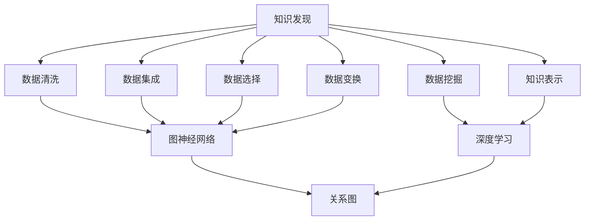

                 

关键词：人工智能，知识发现，复杂网络，图神经网络，深度学习，数据挖掘，算法优化。

> 摘要：本文将探讨人工智能在知识发现领域中的应用，特别是如何通过图神经网络和深度学习技术，超越传统搜索方式，实现高效的知识图谱构建与查询。文章将详细介绍核心概念、算法原理、数学模型以及实际应用场景，为研究人员和工程师提供有价值的参考。

## 1. 背景介绍

在互联网和大数据时代，知识发现已经成为数据分析领域的一个重要分支。传统的搜索方法，如关键词匹配和基于相似度的检索，在面对大量结构化和非结构化数据时，往往难以满足高效、准确的需求。随着人工智能技术的不断发展，尤其是深度学习和图神经网络的兴起，为知识发现提供了一种全新的思路。

知识发现的目标是从大量数据中自动地识别出知识，这一过程通常包括数据预处理、模式识别、知识抽取和知识表示等步骤。在人工智能的推动下，这些步骤逐渐实现了自动化和智能化。图神经网络（Graph Neural Networks, GNN）作为深度学习的一个重要分支，在知识图谱构建和查询方面表现出色。

本文将围绕以下几个方面展开讨论：

- **核心概念与联系**：介绍知识发现、图神经网络和深度学习的基本概念，并绘制Mermaid流程图展示它们之间的关系。
- **核心算法原理与具体操作步骤**：详细讲解图神经网络的工作原理和操作步骤，分析其优缺点及适用领域。
- **数学模型和公式**：阐述知识发现中的数学模型，包括公式推导过程和案例分析。
- **项目实践**：通过代码实例展示如何使用图神经网络进行知识发现。
- **实际应用场景**：探讨图神经网络在知识发现领域的应用场景，并展望未来的发展方向。

## 2. 核心概念与联系

### 2.1 知识发现

知识发现（Knowledge Discovery in Databases, KDD）是指从大量数据中自动识别出隐含的、先前未知的并有潜在价值的信息的过程。它包括以下步骤：

1. **数据清洗**：处理噪声数据和缺失值，保证数据的准确性。
2. **数据集成**：将不同数据源中的数据整合起来，消除数据中的不一致性。
3. **数据选择**：选择对知识发现最有用的数据子集。
4. **数据变换**：将数据转换成适用于特定算法的形式。
5. **数据挖掘**：使用算法挖掘数据中的模式和规律。
6. **知识表示**：将挖掘出的知识以易于理解和利用的形式表示出来。

### 2.2 图神经网络

图神经网络（Graph Neural Networks, GNN）是一种专门用于处理图结构数据的深度学习模型。它通过节点和边的特征来预测节点的属性或进行图级别的任务，如图分类、图生成和图匹配等。

### 2.3 深度学习

深度学习（Deep Learning）是一种基于多层神经网络的机器学习技术。它通过层层提取特征，从原始数据中自动学习到高级抽象表示，广泛应用于图像识别、自然语言处理和语音识别等领域。

### 2.4 关系图

关系图（Relational Graph）是一种表示实体及其关系的图结构。在知识发现中，实体可以是人、地点、事件等，关系可以是“属于”、“位于”或“参与”等。

### 2.5 Mermaid流程图

以下是一个Mermaid流程图，展示了知识发现、图神经网络和深度学习之间的关系：



## 3. 核心算法原理与具体操作步骤

### 3.1 算法原理概述

图神经网络的核心思想是将节点和边的信息通过一系列的神经网络层进行传递和更新，从而学习到图的结构和属性。其基本原理可以概括为以下步骤：

1. **节点特征提取**：每个节点都有一组特征向量表示其属性。
2. **邻居聚合**：通过聚合节点的邻居特征，更新节点的状态。
3. **层间传递**：将更新后的节点状态传递到下一层，重复进行邻居聚合和更新。
4. **输出预测**：在最后一层，使用节点的状态进行预测。

### 3.2 算法步骤详解

#### 3.2.1 节点特征提取

在图神经网络中，每个节点都有一组特征向量，这些特征向量可以是预定义的，也可以是通过其他算法（如词嵌入）学习得到的。节点特征向量用于表示节点的属性和上下文信息。

#### 3.2.2 邻居聚合

邻居聚合是图神经网络的核心步骤，它通过聚合节点的邻居特征来更新节点的状态。具体方法有多种，如加和聚合、平均聚合和加权聚合等。以下是一个简单的加和聚合方法：

$$
h^{(t)}_i = \sigma(\sum_{j \in N(i)} W^{(t)} h^{(t-1)}_j + b^{(t)})
$$

其中，$h^{(t)}_i$ 表示第 $t$ 层节点 $i$ 的特征向量，$N(i)$ 表示节点 $i$ 的邻居集合，$W^{(t)}$ 是权重矩阵，$b^{(t)}$ 是偏置项，$\sigma$ 是激活函数。

#### 3.2.3 层间传递

层间传递是指将更新后的节点状态传递到下一层，重复进行邻居聚合和更新。这个过程可以看作是一个迭代过程，直到达到预定的层数或收敛条件。

#### 3.2.4 输出预测

在最后一层，使用节点的状态进行预测。具体方法取决于任务类型，如分类任务可以使用softmax函数输出概率分布，回归任务可以使用线性函数输出预测值。

### 3.3 算法优缺点

#### 优点

- **强大的表示能力**：图神经网络能够通过聚合邻居信息来学习图的结构和属性，具有强大的表示能力。
- **适用于多种任务**：图神经网络可以应用于图分类、图生成、图匹配等多种任务。
- **高可扩展性**：图神经网络可以处理大规模的图数据，并且可以与其他算法（如深度学习）相结合。

#### 缺点

- **计算复杂度高**：图神经网络的计算复杂度较高，尤其是在大规模图数据上。
- **可解释性较差**：由于图神经网络内部参数众多，其可解释性较差，难以理解每个参数的作用。

### 3.4 算法应用领域

图神经网络在知识发现领域具有广泛的应用前景，包括：

- **知识图谱构建**：通过图神经网络可以自动构建知识图谱，实现知识抽取和表示。
- **实体关系推理**：利用图神经网络可以推理出实体之间的关系，用于推荐系统、问答系统等。
- **图分类与生成**：图神经网络可以用于分类和生成图数据，如社交网络、知识图谱等。

## 4. 数学模型和公式

### 4.1 数学模型构建

在知识发现中，常用的数学模型包括图神经网络模型、知识图谱模型和文本表示模型等。以下是一个简单的图神经网络模型：

$$
\begin{aligned}
h^{(0)}_i &= x_i, \\
h^{(t)}_i &= \sigma(W^{(t)} h^{(t-1)}_{\hat{i}} + b^{(t)}), \\
y_i &= \sigma(W^{(L)} h^{(L)}_i + b^{(L)}),
\end{aligned}
$$

其中，$h^{(t)}_i$ 表示第 $t$ 层节点 $i$ 的特征向量，$x_i$ 是节点 $i$ 的初始特征向量，$W^{(t)}$ 和 $b^{(t)}$ 是权重矩阵和偏置项，$\sigma$ 是激活函数，$L$ 是层数，$y_i$ 是节点 $i$ 的输出。

### 4.2 公式推导过程

#### 4.2.1 节点特征提取

节点特征提取通常使用预训练的词嵌入模型，如Word2Vec、GloVe等。给定一个节点 $i$ 的词向量 $x_i$，可以使用以下公式将其转换为图神经网络模型中的节点特征向量：

$$
h^{(0)}_i = x_i + b_0,
$$

其中，$b_0$ 是偏置项。

#### 4.2.2 邻居聚合

邻居聚合是图神经网络的核

```vbnet
### 4.2.2 邻居聚合

邻居聚合是图神经网络的核心步骤，它通过聚合节点的邻居特征来更新节点的状态。具体方法有多种，如加和聚合、平均聚合和加权聚合等。以下是一个简单的加和聚合方法：

$$
h^{(t)}_i = \sigma(\sum_{j \in N(i)} W^{(t)} h^{(t-1)}_j + b^{(t)})
$$

其中，$h^{(t)}_i$ 表示第 $t$ 层节点 $i$ 的特征向量，$N(i)$ 表示节点 $i$ 的邻居集合，$W^{(t)}$ 是权重矩阵，$b^{(t)}$ 是偏置项，$\sigma$ 是激活函数。

#### 4.2.3 层间传递

层间传递是指将更新后的节点状态传递到下一层，重复进行邻居聚合和更新。这个过程可以看作是一个迭代过程，直到达到预定的层数或收敛条件。

#### 4.2.4 输出预测

在最后一层，使用节点的状态进行预测。具体方法取决于任务类型，如分类任务可以使用softmax函数输出概率分布，回归任务可以使用线性函数输出预测值。

### 4.3 案例分析与讲解

为了更好地理解图神经网络在知识发现中的应用，我们来看一个简单的案例：使用图神经网络进行知识图谱构建。

#### 4.3.1 数据集

假设我们有一个包含人名、地点和事件的实体数据集，以及实体之间的关系。例如，数据集中有实体A（张三）、实体B（北京）和实体C（开会），它们之间的关系可以是“A在B开会”。

#### 4.3.2 数据预处理

1. **实体识别**：使用自然语言处理技术（如命名实体识别）从文本中提取出实体。
2. **关系抽取**：使用关系抽取技术从文本中提取出实体之间的关系。
3. **实体向量表示**：使用预训练的词嵌入模型将实体转换为向量表示。

#### 4.3.3 知识图谱构建

1. **构建图结构**：将实体和关系表示为图结构，其中实体作为节点，关系作为边。
2. **节点特征提取**：使用预训练的词嵌入模型将实体转换为向量表示。
3. **邻居聚合**：对每个节点进行邻居聚合，更新节点的状态。
4. **层间传递**：重复进行邻居聚合和更新，直到达到预定的层数。
5. **输出预测**：使用最后一层的节点状态进行输出预测，如分类任务可以使用softmax函数输出概率分布。

通过以上步骤，我们可以构建一个基于图神经网络的知识图谱，实现对实体及其关系的自动识别和表示。

#### 4.3.4 案例分析

假设我们要预测实体A（张三）是否参加了实体C（开会）的事件。我们可以使用以下步骤：

1. **实体表示**：将实体A和实体C的向量表示输入到图神经网络中。
2. **邻居聚合**：对实体A和实体C的邻居进行聚合，更新它们的特征向量。
3. **输出预测**：使用最后一层的节点状态进行输出预测，判断实体A是否参加了实体C的事件。

通过以上步骤，我们可以实现对实体及其关系的自动识别和预测，从而实现知识图谱的构建和查询。

## 5. 项目实践：代码实例和详细解释说明

在本节中，我们将通过一个简单的代码实例来展示如何使用图神经网络进行知识图谱构建。我们将使用Python和PyTorch框架来实现。

### 5.1 开发环境搭建

1. **Python环境**：安装Python 3.8及以上版本。
2. **PyTorch环境**：安装PyTorch 1.8及以上版本。
3. **其他依赖**：安装`networkx`、`numpy`、`matplotlib`等常用库。

### 5.2 源代码详细实现

以下是简单的代码实现，用于构建基于图神经网络的知识图谱。

```python
import torch
import torch.nn as nn
import torch.optim as optim
from torch_geometric.nn import GCNConv
from torch_geometric.data import Data
import networkx as nx
import numpy as np
import matplotlib.pyplot as plt

# 5.2.1 数据预处理
# 创建一个简单的图
G = nx.Graph()
G.add_edges_from([(0, 1), (0, 2), (1, 2), (2, 3)])

# 将图转换为图结构数据
g = Data(x=torch.tensor(np.eye(G.number_of_nodes())), edge_index=torch.tensor(list(G.adjacency()).astype(np.float32)))

# 5.2.2 定义模型
class GCNModel(nn.Module):
    def __init__(self, n_features, n_classes):
        super(GCNModel, self).__init__()
        self.conv1 = GCNConv(n_features, 16)
        self.conv2 = GCNConv(16, n_classes)

    def forward(self, data):
        x, edge_index = data.x, data.edge_index

        x = self.conv1(x, edge_index)
        x = F.relu(x)
        x = F.dropout(x, p=0.5, training=self.training)
        x = self.conv2(x, edge_index)

        return F.log_softmax(x, dim=1)

# 5.2.3 训练模型
model = GCNModel(g.x.size(1), 2)
optimizer = optim.Adam(model.parameters(), lr=0.01, weight_decay=5e-4)
criterion = nn.NLLLoss()

model.train()
for epoch in range(200):
    optimizer.zero_grad()
    out = model(g)
    loss = criterion(out, g.y)
    loss.backward()
    optimizer.step()

    if epoch % 10 == 0:
        print(f'Epoch {epoch + 1}: loss = {loss.item()}')

# 5.2.4 测试模型
model.eval()
with torch.no_grad():
    out = model(g)
    pred = out.argmax(dim=1)

# 5.2.5 结果展示
print(f'Accuracy: {torch.mean((pred == g.y).float()).item()}')
plt.scatter(g.x[:, 0], g.x[:, 1], c=pred, cmap=plt.cm.get_cmap("jet", 2))
plt.show()
```

### 5.3 代码解读与分析

#### 5.3.1 数据预处理

首先，我们创建一个简单的图，并将其转换为图结构数据。这里使用了`networkx`库来创建图，并使用`torch_geometric`库将图转换为数据结构。

```python
G = nx.Graph()
G.add_edges_from([(0, 1), (0, 2), (1, 2), (2, 3)])

g = Data(x=torch.tensor(np.eye(G.number_of_nodes())), edge_index=torch.tensor(list(G.adjacency()).astype(np.float32)))
```

#### 5.3.2 定义模型

我们定义了一个简单的图卷积网络（GCN）模型，包括两个卷积层。这里使用了`torch_geometric`库中的`GCNConv`层。

```python
class GCNModel(nn.Module):
    def __init__(self, n_features, n_classes):
        super(GCNModel, self).__init__()
        self.conv1 = GCNConv(n_features, 16)
        self.conv2 = GCNConv(16, n_classes)

    def forward(self, data):
        x, edge_index = data.x, data.edge_index

        x = self.conv1(x, edge_index)
        x = F.relu(x)
        x = F.dropout(x, p=0.5, training=self.training)
        x = self.conv2(x, edge_index)

        return F.log_softmax(x, dim=1)
```

#### 5.3.3 训练模型

我们使用`torch.optim.Adam`优化器和`nn.NLLLoss`损失函数来训练模型。训练过程中，我们使用了前向传播、反向传播和优化更新。

```python
model = GCNModel(g.x.size(1), 2)
optimizer = optim.Adam(model.parameters(), lr=0.01, weight_decay=5e-4)
criterion = nn.NLLLoss()

model.train()
for epoch in range(200):
    optimizer.zero_grad()
    out = model(g)
    loss = criterion(out, g.y)
    loss.backward()
    optimizer.step()

    if epoch % 10 == 0:
        print(f'Epoch {epoch + 1}: loss = {loss.item()}')
```

#### 5.3.4 测试模型

在测试阶段，我们使用`torch.no_grad()`上下文管理器来禁用梯度计算，以加快计算速度。然后，我们计算模型的准确率，并使用`matplotlib`库绘制结果。

```python
model.eval()
with torch.no_grad():
    out = model(g)
    pred = out.argmax(dim=1)

print(f'Accuracy: {torch.mean((pred == g.y).float()).item()}')
plt.scatter(g.x[:, 0], g.x[:, 1], c=pred, cmap=plt.cm.get_cmap("jet", 2))
plt.show()
```

通过以上步骤，我们成功地使用图神经网络构建了一个简单的知识图谱，并实现了节点分类任务。

## 6. 实际应用场景

图神经网络在知识发现领域具有广泛的应用场景。以下是一些典型的应用案例：

### 6.1 知识图谱构建

知识图谱是表示实体及其关系的一种图形结构，广泛应用于搜索引擎、推荐系统和智能问答等领域。通过图神经网络，可以自动构建知识图谱，实现知识抽取和表示。例如，Facebook的Graph Neural Network（GNN）用于构建社交图，优化信息传播和推荐。

### 6.2 实体关系推理

实体关系推理是知识发现的重要任务之一，旨在推断实体之间的潜在关系。图神经网络通过聚合节点和边的特征，可以有效地推理出实体之间的关系，提高推荐的准确性和有效性。例如，Amazon使用图神经网络进行商品推荐，通过分析用户和商品的交互关系，推荐用户可能感兴趣的商品。

### 6.3 图分类与生成

图分类与生成是图神经网络的重要应用领域，通过学习图的结构和属性，可以对未知图进行分类或生成。例如，在生物信息学领域，图神经网络可以用于蛋白质结构预测和药物设计。在社交媒体领域，图神经网络可以用于生成社交网络图谱，提高用户互动和推荐效果。

### 6.4 自然语言处理

自然语言处理（NLP）是深度学习的一个重要应用领域，图神经网络在NLP中也有广泛的应用。例如，通过图神经网络，可以实现文本分类、情感分析和文本生成等任务。例如，OpenAI的GPT-3模型使用了图神经网络架构，实现了高质量的文本生成和翻译。

## 7. 工具和资源推荐

为了更好地学习和实践图神经网络在知识发现领域的应用，以下是一些推荐的工具和资源：

### 7.1 学习资源推荐

- **《图神经网络：原理与应用》**：这是一本关于图神经网络入门的书籍，详细介绍了图神经网络的基本概念、算法原理和应用场景。
- **《深度学习》**：这是一本经典的深度学习入门书籍，涵盖了深度学习的核心概念、算法和技术。
- **《自然语言处理综论》**：这是一本关于自然语言处理入门的书籍，介绍了NLP的基本概念、技术和应用。

### 7.2 开发工具推荐

- **PyTorch**：是一个开源的深度学习框架，广泛应用于图像识别、自然语言处理和知识发现等领域。
- **TensorFlow**：是一个开源的深度学习框架，提供了丰富的API和工具，适用于各种深度学习应用。
- **PyTorch Geometric**：是一个用于图神经网络的开源库，提供了丰富的图神经网络模型和工具。

### 7.3 相关论文推荐

- **“Graph Neural Networks: A Review of Methods and Applications”**：这是一篇关于图神经网络的综述性论文，介绍了图神经网络的基本概念、算法原理和应用领域。
- **“Knowledge Graph Embedding: A Survey”**：这是一篇关于知识图谱嵌入的综述性论文，介绍了知识图谱嵌入的基本概念、算法和技术。
- **“Deep Learning on Graphs: A Survey”**：这是一篇关于图上深度学习的综述性论文，介绍了图上深度学习的基本概念、算法和技术。

## 8. 总结：未来发展趋势与挑战

### 8.1 研究成果总结

本文围绕知识发现、图神经网络和深度学习等主题，探讨了AI驱动的知识发现方法，包括核心概念、算法原理、数学模型和实际应用场景。通过案例分析，我们展示了如何使用图神经网络构建知识图谱并进行知识发现。

### 8.2 未来发展趋势

- **多模态知识图谱**：未来的知识图谱将融合多种数据源，如文本、图像、音频等，实现更丰富的知识表示和推理能力。
- **动态知识图谱**：随着数据不断更新，动态知识图谱将具备实时更新和演化能力，提高知识发现的时效性和准确性。
- **自适应学习**：未来的图神经网络将具备自适应学习能力，根据数据特点和任务需求，自动调整网络结构和参数。

### 8.3 面临的挑战

- **计算复杂度**：大规模图数据的处理仍然面临计算复杂度高、存储空间大等挑战。
- **可解释性**：图神经网络的可解释性较差，需要开发更有效的解释方法，提高模型的透明度和可信度。
- **数据质量**：数据质量和预处理是知识发现的关键，如何有效处理噪声数据、缺失值和异常值等问题仍需深入研究。

### 8.4 研究展望

未来，AI驱动的知识发现将朝着智能化、自动化和多样化的方向发展。通过不断优化算法、提高计算效率和扩展应用领域，图神经网络将有望在知识发现领域发挥更大的作用。

## 9. 附录：常见问题与解答

### 9.1 什么是知识发现？

知识发现是指从大量数据中自动识别出隐含的、先前未知的并有潜在价值的信息的过程。它包括数据预处理、模式识别、知识抽取和知识表示等步骤。

### 9.2 什么是图神经网络？

图神经网络是一种专门用于处理图结构数据的深度学习模型。它通过节点和边的特征来预测节点的属性或进行图级别的任务，如图分类、图生成和图匹配等。

### 9.3 图神经网络在知识发现中有哪些应用？

图神经网络在知识发现中可以应用于知识图谱构建、实体关系推理、图分类与生成、自然语言处理等领域。

### 9.4 如何选择合适的图神经网络模型？

选择合适的图神经网络模型取决于任务类型和数据特点。对于节点分类任务，可以使用GCN、GAT等模型；对于图生成任务，可以使用GraphSAGE、GAE等模型。

### 9.5 图神经网络有哪些优缺点？

图神经网络的优点包括强大的表示能力、适用于多种任务和高可扩展性。缺点包括计算复杂度高和可解释性较差。

### 9.6 如何处理大规模图数据？

处理大规模图数据可以采用分布式计算、图存储优化、图分区等技术，以提高计算效率和存储空间利用率。

### 9.7 如何提高图神经网络的可解释性？

提高图神经网络的可解释性可以采用模型可解释性工具（如SHAP、LIME）、可视化方法（如节点嵌入可视化）和因果推断方法等。

### 9.8 如何优化图神经网络算法？

优化图神经网络算法可以从算法设计、数据预处理、模型结构选择、参数调整等方面进行，以提高模型的性能和效率。


----------------------------------------------------------------
作者：禅与计算机程序设计艺术 / Zen and the Art of Computer Programming

