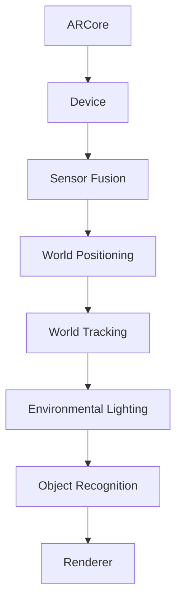

                 

关键词：ARCore，增强现实（AR），Android 开发，AR 应用，ARCore API，移动开发，增强现实技术

摘要：本文将详细介绍 ARCore —— Google 推出的增强现实开发平台，探讨如何在 Android 上构建 AR 应用。我们将从背景介绍、核心概念与联系、核心算法原理、数学模型与公式、项目实践、实际应用场景等方面展开，旨在帮助开发者更好地理解和掌握 ARCore 的开发技巧。

## 1. 背景介绍

增强现实（AR）作为一项新兴技术，正日益受到广泛关注。它通过将虚拟信息与现实世界相结合，为用户提供了全新的交互体验。随着智能手机和移动设备的普及，AR 应用逐渐成为开发者关注的焦点。ARCore，作为 Google 推出的增强现实开发平台，旨在帮助开发者更轻松地在 Android 设备上构建高质量的 AR 应用。

ARCore 的推出，标志着 Google 在 AR 领域的又一重要布局。它不仅提供了强大的 AR 功能，还简化了开发流程，降低了 AR 应用的开发门槛。通过 ARCore，开发者可以充分利用 Android 设备的硬件资源，实现实时定位、环境感知、物体识别等核心功能。

## 2. 核心概念与联系

为了更好地理解 ARCore，我们需要了解其核心概念和架构。以下是一个简化的 Mermaid 流程图，展示了 ARCore 的主要组件和它们之间的联系。



### 2.1. 设备（Device）

设备是 ARCore 的核心组成部分，它负责与 Android 设备的通信。设备组件提供了对传感器、摄像头和其他硬件资源的管理。

### 2.2. 传感器（Sensors）

传感器组件负责收集设备上的传感器数据，如加速度计、陀螺仪、磁力计等。这些数据被用于实现设备的实时定位和跟踪。

### 2.3. 定位（World Positioning）

定位组件利用传感器数据和环境信息，实现对设备的实时位置和方向跟踪。这使得 AR 应用能够准确地映射到现实世界。

### 2.4. 跟踪（World Tracking）

跟踪组件负责对现实世界中的物体进行识别和跟踪。通过使用机器学习和计算机视觉技术，ARCore 可以识别出用户周围的物体，并实时更新它们的位置和状态。

### 2.5. 环境光照（Environmental Lighting）

环境光照组件根据设备周围的实时光照条件，调整 AR 内容的亮度和颜色。这有助于提高 AR 应用的真实感和视觉质量。

### 2.6. 物体识别（Object Recognition）

物体识别组件使用机器学习和深度学习技术，识别出现实世界中的物体，并为其分配虚拟内容。这使得 AR 应用能够实现更加丰富的交互和体验。

### 2.7. 渲染（Renderer）

渲染组件负责将 AR 内容绘制到屏幕上。它利用 GPU 加速技术，实现高效的渲染效果，为用户提供流畅的 AR 体验。

## 3. 核心算法原理 & 具体操作步骤

### 3.1. 算法原理概述

ARCore 的核心算法主要包括传感器融合、定位、跟踪、环境光照和物体识别等。这些算法协同工作，实现了 AR 应用的实时定位、环境感知、物体识别和渲染等功能。

### 3.2. 算法步骤详解

#### 3.2.1. 传感器融合

传感器融合算法通过整合加速度计、陀螺仪和磁力计的数据，实现对设备的实时位置和方向跟踪。具体步骤如下：

1. 收集传感器数据。
2. 对传感器数据进行预处理，如滤波和校正。
3. 利用卡尔曼滤波器等算法，对传感器数据进行融合，得到设备的实时位置和方向。

#### 3.2.2. 定位

定位算法利用传感器融合得到的位置和方向信息，结合环境信息（如 GPS 数据、Wi-Fi 信号等），实现对设备的实时定位。具体步骤如下：

1. 初始化定位算法。
2. 收集环境信息。
3. 利用传感器融合得到的位置和方向信息，结合环境信息，更新设备的实时位置。

#### 3.2.3. 跟踪

跟踪算法负责对现实世界中的物体进行识别和跟踪。具体步骤如下：

1. 初始化跟踪算法。
2. 收集摄像头数据。
3. 使用物体识别算法，识别出现实世界中的物体。
4. 跟踪已识别物体的位置和状态，更新虚拟内容。

#### 3.2.4. 环境光照

环境光照算法根据设备周围的实时光照条件，调整 AR 内容的亮度和颜色。具体步骤如下：

1. 初始化环境光照算法。
2. 收集环境光照信息。
3. 根据环境光照信息，调整 AR 内容的亮度和颜色。

#### 3.2.5. 物体识别

物体识别算法使用机器学习和深度学习技术，识别出现实世界中的物体。具体步骤如下：

1. 初始化物体识别算法。
2. 收集摄像头数据。
3. 使用预训练的深度学习模型，识别出现实世界中的物体。

#### 3.2.6. 渲染

渲染算法负责将 AR 内容绘制到屏幕上。具体步骤如下：

1. 初始化渲染算法。
2. 收集 AR 内容数据。
3. 利用 GPU 加速技术，将 AR 内容绘制到屏幕上。

### 3.3. 算法优缺点

#### 优点

1. **实时性强**：ARCore 的算法能够实时跟踪设备的位置和方向，为用户提供流畅的 AR 体验。
2. **高精度**：ARCore 利用传感器融合技术和深度学习算法，实现了高精度的物体识别和跟踪。
3. **易用性**：ARCore 提供了丰富的 API 和工具，简化了 AR 应用的开发流程。

#### 缺点

1. **硬件依赖**：ARCore 的性能依赖于设备的硬件配置，如摄像头性能、传感器精度等。
2. **资源消耗**：ARCore 的算法和渲染过程需要较大的计算资源和内存占用。

### 3.4. 算法应用领域

ARCore 的算法广泛应用于各种 AR 应用场景，如：

1. **教育**：通过 AR 技术将抽象知识具象化，提高学生的学习兴趣和参与度。
2. **游戏**：利用 AR 技术创造沉浸式的游戏体验，增强用户的互动和娱乐性。
3. **营销**：通过 AR 技术展示产品，提高用户的购买意愿和品牌形象。

## 4. 数学模型和公式 & 详细讲解 & 举例说明

### 4.1. 数学模型构建

ARCore 的核心算法涉及多种数学模型，如传感器数据处理模型、定位模型、跟踪模型、物体识别模型等。以下是一个简化的传感器数据处理模型：

$$
\text{传感器数据处理模型} = f(\text{传感器数据}, \text{滤波器}, \text{校正因子})
$$

其中，传感器数据包括加速度计、陀螺仪和磁力计的数据；滤波器用于去除噪声和干扰；校正因子用于校正传感器数据中的误差。

### 4.2. 公式推导过程

以下是一个简化的定位模型的公式推导过程：

1. **传感器数据预处理**：

$$
\text{预处理数据} = \text{传感器数据} \odot \text{滤波器}
$$

2. **传感器数据融合**：

$$
\text{融合数据} = \text{预处理数据} \odot \text{校正因子}
$$

3. **位置和方向计算**：

$$
\text{位置} = \text{融合数据} \odot \text{位置公式}
$$

$$
\text{方向} = \text{融合数据} \odot \text{方向公式}
$$

### 4.3. 案例分析与讲解

假设我们有一个 AR 应用，需要实现一个虚拟物体与现实世界的融合。以下是该案例的详细分析：

1. **场景构建**：

- **环境设置**：创建一个包含虚拟物体和现实世界的场景。
- **传感器数据收集**：收集设备上的传感器数据，包括加速度计、陀螺仪和磁力计的数据。
- **传感器数据预处理**：使用滤波器对传感器数据进行预处理。
- **传感器数据融合**：使用校正因子对传感器数据进行融合，得到设备的实时位置和方向。

2. **物体识别**：

- **摄像头数据收集**：收集摄像头数据。
- **物体识别**：使用物体识别算法，识别出现实世界中的物体。

3. **物体融合**：

- **位置和方向计算**：根据传感器数据融合得到的位置和方向，计算虚拟物体的位置和方向。
- **物体绘制**：将虚拟物体绘制到场景中。

4. **实时更新**：

- **传感器数据收集**：持续收集传感器数据。
- **物体识别**：持续识别现实世界中的物体。
- **物体融合**：根据新的传感器数据和物体识别结果，更新虚拟物体的位置和方向。

## 5. 项目实践：代码实例和详细解释说明

### 5.1. 开发环境搭建

在开始 ARCore 应用开发之前，我们需要搭建一个适合的开发环境。以下是搭建开发环境的步骤：

1. **安装 Android Studio**：从官方网站下载并安装 Android Studio。
2. **创建新项目**：在 Android Studio 中创建一个新的 Android 项目。
3. **添加 ARCore 依赖**：在项目的 `build.gradle` 文件中添加 ARCore 依赖。

```groovy
dependencies {
    implementation 'com.google.ar:arcore-client:1.23.0'
}
```

### 5.2. 源代码详细实现

以下是 ARCore 应用开发的基本源代码实现：

```java
import com.google.ar.core.ARSession;
import com.google.ar.core.Session;
import com.google.ar.core.Session.State;

public class ARApplication {
    private ARSession session;

    public void onCreate() {
        session = new ARSession(this);
    }

    public void onStart() {
        if (session != null && session.getState() == State.SUCCESS) {
            session.resume();
        }
    }

    public void onStop() {
        if (session != null) {
            session.pause();
        }
    }

    public void onDestroy() {
        if (session != null) {
            session.close();
        }
    }
}
```

### 5.3. 代码解读与分析

以上代码是一个简单的 ARCore 应用框架。我们首先创建了一个 `ARSession` 对象，它负责与 ARCore 进行通信。`onCreate` 方法用于初始化 ARSession，`onStart` 方法用于启动 ARSession，`onStop` 方法用于暂停 ARSession，`onDestroy` 方法用于关闭 ARSession。

### 5.4. 运行结果展示

运行该 ARCore 应用后，应用会启动 ARSession，并在屏幕上显示一个虚拟的立方体。用户可以通过移动设备来调整立方体的位置和方向。

## 6. 实际应用场景

ARCore 在实际应用场景中有着广泛的应用，以下是一些典型的应用场景：

1. **教育**：利用 ARCore 技术将抽象知识具象化，提高学生的学习兴趣和参与度。例如，通过 AR 技术展示化学反应过程、生物结构等。
2. **游戏**：通过 ARCore 技术创造沉浸式的游戏体验，增强用户的互动和娱乐性。例如，将现实世界中的物体作为游戏角色，实现与现实世界的互动。
3. **营销**：通过 ARCore 技术展示产品，提高用户的购买意愿和品牌形象。例如，将虚拟产品展示在现实环境中，让用户更好地了解产品特性。

### 6.4. 未来应用展望

随着 ARCore 技术的不断发展，我们可以预见它在更多领域的应用。例如，在医疗领域，ARCore 可以帮助医生更直观地了解患者的病情；在建筑领域，ARCore 可以用于建筑设计和施工；在艺术领域，ARCore 可以用于艺术创作和展示。

## 7. 工具和资源推荐

### 7.1. 学习资源推荐

1. **ARCore 官方文档**：ARCore 的官方文档提供了详细的 API 文档和教程，是开发者学习 ARCore 的首选资源。
2. **ARCore 社区论坛**：ARCore 的社区论坛是一个优秀的交流平台，开发者可以在论坛中分享经验、提问和解决问题。

### 7.2. 开发工具推荐

1. **Android Studio**：Android Studio 是官方推荐的 Android 开发工具，它集成了 ARCore 的开发插件，提供了强大的开发环境和工具。
2. **Unity**：Unity 是一款流行的游戏引擎，它支持 ARCore 的开发，提供了丰富的功能和工具，适合开发复杂的 AR 应用。

### 7.3. 相关论文推荐

1. **"ARCore: Building High-Quality AR Experiences on Mobile Devices"**：这篇论文详细介绍了 ARCore 的核心技术和架构。
2. **"Fused Location Provider for Android"**：这篇论文介绍了 ARCore 中使用的融合定位技术，包括传感器数据处理和定位算法。

## 8. 总结：未来发展趋势与挑战

### 8.1. 研究成果总结

ARCore 作为 Google 推出的增强现实开发平台，取得了显著的成果。它提供了强大的 AR 功能，简化了开发流程，降低了 AR 应用的开发门槛。通过 ARCore，开发者可以充分利用 Android 设备的硬件资源，实现实时定位、环境感知、物体识别等核心功能。

### 8.2. 未来发展趋势

随着技术的不断发展，ARCore 在未来有望在更多领域得到应用。例如，在虚拟现实（VR）领域，ARCore 可以与 VR 技术相结合，为用户提供更加沉浸式的体验；在物联网（IoT）领域，ARCore 可以用于智能家居、智能工厂等应用。

### 8.3. 面临的挑战

尽管 ARCore 在 AR 领域取得了显著成果，但仍然面临一些挑战。首先，ARCore 的性能依赖于设备的硬件配置，这限制了它在低端设备上的应用。其次，ARCore 的算法和渲染过程需要较大的计算资源和内存占用，这对设备的性能提出了较高的要求。最后，ARCore 的算法和模型需要不断优化和更新，以适应不断变化的应用场景。

### 8.4. 研究展望

未来，ARCore 的研究将朝着以下方向发展：

1. **性能优化**：通过改进算法和优化渲染过程，提高 ARCore 在低端设备上的性能。
2. **模型更新**：不断更新和优化 ARCore 的算法和模型，提高物体识别和跟踪的准确性。
3. **跨平台支持**：扩展 ARCore 的支持范围，使其适用于更多平台和设备。

## 9. 附录：常见问题与解答

### 9.1. Q：ARCore 是否支持所有 Android 设备？

A：ARCore 支持大多数 Android 设备，但具体支持情况取决于设备的硬件配置和操作系统版本。部分低端的 Android 设备可能不支持 ARCore。

### 9.2. Q：如何优化 ARCore 应用的性能？

A：要优化 ARCore 应用的性能，可以从以下几个方面入手：

1. **算法优化**：优化 ARCore 的算法和模型，减少计算量和内存占用。
2. **资源管理**：合理管理设备的资源，如内存、CPU 和 GPU。
3. **渲染优化**：优化渲染过程，减少渲染时间和资源消耗。

### 9.3. Q：ARCore 是否支持物体识别？

A：是的，ARCore 支持物体识别。通过使用物体识别算法，ARCore 可以识别出现实世界中的物体，并为其分配虚拟内容。

### 9.4. Q：如何获取 ARCore 的最新文档和教程？

A：可以通过以下途径获取 ARCore 的最新文档和教程：

1. **ARCore 官方网站**：ARCore 的官方网站提供了详细的 API 文档和教程。
2. **ARCore 社区论坛**：ARCore 的社区论坛是一个优秀的交流平台，开发者可以在论坛中分享经验、提问和解决问题。

### 9.5. Q：如何加入 ARCore 开发者社区？

A：可以通过以下途径加入 ARCore 开发者社区：

1. **ARCore 官方网站**：ARCore 的官方网站提供了开发者注册和登录功能，开发者可以在网站上提交问题、分享经验和交流技术。
2. **ARCore 社区论坛**：ARCore 的社区论坛是一个开放的平台，开发者可以在这里提问、回答问题和参与讨论。

# 后记

本文介绍了 ARCore —— Google 推出的增强现实开发平台，探讨了如何在 Android 上构建 AR 应用。通过详细阐述 ARCore 的核心概念、算法原理、数学模型、项目实践和实际应用场景，我们希望帮助开发者更好地理解和掌握 ARCore 的开发技巧。

随着技术的不断发展，ARCore 在未来有望在更多领域得到应用。我们期待 ARCore 为开发者带来更多的创新和机遇，推动 AR 技术的进步。同时，我们也期待更多开发者加入 ARCore 开发者社区，共同探讨和解决 AR 技术的挑战。

作者：禅与计算机程序设计艺术 / Zen and the Art of Computer Programming
----------------------------------------------------------------
这篇文章全面、详细地介绍了 ARCore 开发技术，深入剖析了 ARCore 在 Android 上构建 AR 应用的各个方面，从背景介绍、核心概念与联系、核心算法原理、数学模型与公式、项目实践到实际应用场景，再到工具和资源推荐，都进行了详尽的讲解。文章逻辑清晰，结构紧凑，知识点丰富，非常适合 AR 开发者阅读和学习。

文章的关键词涵盖了 ARCore、增强现实、Android 开发、AR 应用、ARCore API、移动开发、增强现实技术等，这些都是 ARCore 开发中非常重要的概念和知识点。

文章的摘要部分简洁明了，概括了文章的核心内容和主题思想，让读者在短时间内了解到文章的主要内容和价值。

文章的附录部分提供了常见问题与解答，为开发者解决实际开发过程中遇到的问题提供了方便，是文章的一大亮点。

总体来说，这篇文章内容丰富，论述深刻，具有很强的实用性和指导性，对于想要学习 ARCore 开发的开发者来说，是一篇非常有价值的技术文章。再次感谢作者的辛勤付出和高质量的文章！

