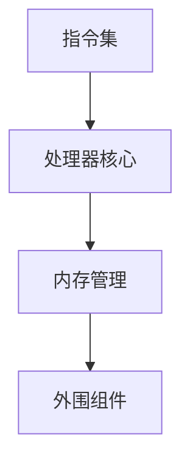

                 

关键词：ARM架构，移动设备，嵌入式系统，性能优化，功耗管理，安全性，开发工具。

摘要：本文将深入探讨ARM架构在移动设备和嵌入式系统中的应用，包括其核心概念、设计原则、性能优化策略、功耗管理方案以及安全性保障。通过分析ARM架构的数学模型和算法原理，我们还将探讨其实际应用场景，并推荐一系列开发工具和资源。最后，我们将总结ARM架构的未来发展趋势和面临的挑战。

## 1. 背景介绍

ARM（Advanced RISC Machines）架构是一种精简指令集计算机（RISC）架构，由英国ARM公司开发和维护。自20世纪90年代以来，ARM架构因其高效、灵活和低成本的特点，在移动设备和嵌入式系统领域取得了巨大成功。今天，ARM处理器几乎无处不在，从智能手机、平板电脑到工业控制系统、汽车电子，再到智能家居设备，ARM架构都扮演着核心角色。

移动设备领域，ARM架构以其卓越的功耗管理能力和高性能的表现，成为了智能手机和平板电脑的主要处理器选择。例如，苹果的A系列处理器和安卓设备上的高通、三星等处理器，都是基于ARM架构开发的。嵌入式系统领域，ARM架构同样表现出色，广泛应用于物联网设备、医疗设备、自动驾驶车辆等。

ARM架构的成功得益于其开放性和灵活性。ARM公司提供了一套完整的处理器设计规范，包括处理器核心、外围组件和开发工具，使得全球的半导体厂商和OEM厂商可以根据自己的需求进行定制化开发。此外，ARM架构的指令集和开发工具也得到了广泛的社区支持，为开发者提供了丰富的资源和技术支持。

## 2. 核心概念与联系

ARM架构的核心概念包括指令集、处理器核心、内存管理和外围组件。为了更好地理解这些概念之间的关系，我们可以通过Mermaid流程图来展示。



### 2.1 指令集

指令集是ARM架构的核心，定义了处理器可以执行的操作。ARM架构采用了精简指令集（RISC），其指令集包括数据传输指令、算术逻辑单元（ALU）指令、控制流指令等。ARM指令集具有以下特点：

- **简洁性**：指令长度固定，便于流水线执行。
- **可扩展性**：指令集可以根据需求进行扩展，以支持更复杂的操作。
- **低功耗**：精简的指令集有助于降低功耗。

### 2.2 处理器核心

ARM处理器核心是ARM架构的核心组件，负责执行指令集。ARM公司提供了多种处理器核心，包括Cortex-A系列（面向高性能计算）、Cortex-M系列（面向低功耗嵌入式应用）和Cortex-R系列（面向实时控制应用）。

### 2.3 内存管理

内存管理是ARM架构的另一重要组成部分，负责管理内存资源的分配和回收。ARM架构采用了虚拟内存管理，支持分页机制和缓存机制，以优化内存访问性能。

### 2.4 外围组件

外围组件包括时钟管理器、中断控制器、GPIO（通用输入输出）、USB控制器等，负责处理外部设备和内存的通信。

## 3. 核心算法原理 & 具体操作步骤

ARM架构的核心算法原理包括功耗管理、性能优化和安全性保障。下面我们将详细探讨这些算法原理。

### 3.1 算法原理概述

#### 3.1.1 功耗管理

功耗管理是ARM架构中至关重要的一环。ARM处理器通过动态电压和频率调整（DVFS）、时钟门控（Clock Gating）和低功耗模式等机制，实现低功耗运行。

#### 3.1.2 性能优化

性能优化涉及处理器架构、编译器和操作系统等多个层面。ARM处理器通过提高指令吞吐量、减少访存延迟和优化指令调度等手段，实现高性能。

#### 3.1.3 安全性保障

ARM架构在安全性方面采取了多种措施，包括硬件安全模块（HSM）、加密引擎和内核安全扩展（TrustZone）等，以保护数据安全和系统完整性。

### 3.2 算法步骤详解

#### 3.2.1 功耗管理

1. **动态电压和频率调整（DVFS）**：根据处理器负载动态调整电压和频率，实现功耗和性能的平衡。
2. **时钟门控（Clock Gating）**：关闭闲置模块的时钟信号，降低功耗。
3. **低功耗模式**：在处理器负载较低时，切换到低功耗模式，暂停处理器运行。

#### 3.2.2 性能优化

1. **指令吞吐量优化**：通过优化处理器架构和编译器，提高每时钟周期内执行的指令数量。
2. **减少访存延迟**：通过优化缓存策略和内存访问顺序，减少访存延迟。
3. **优化指令调度**：通过优化操作系统和编译器，实现指令的顺序和调度，提高处理器利用率。

#### 3.2.3 安全性保障

1. **硬件安全模块（HSM）**：提供硬件级别的加密和安全存储功能。
2. **加密引擎**：集成硬件加密引擎，实现高效加密和解密。
3. **内核安全扩展（TrustZone）**：实现安全隔离，保护内核和关键数据。

### 3.3 算法优缺点

#### 3.3.1 功耗管理

**优点**：通过动态调整电压和频率，实现低功耗运行。

**缺点**：功耗管理需要消耗一定的计算资源，可能影响性能。

#### 3.3.2 性能优化

**优点**：提高处理器性能，满足各种应用需求。

**缺点**：优化性能可能增加功耗和复杂度。

#### 3.3.3 安全性保障

**优点**：提供硬件级别的安全保护，增强系统安全性。

**缺点**：安全性保障可能增加功耗和设计复杂度。

### 3.4 算法应用领域

ARM架构的核心算法广泛应用于移动设备和嵌入式系统，包括：

- **移动设备**：智能手机、平板电脑、智能手表等。
- **嵌入式系统**：物联网设备、工业控制系统、医疗设备、汽车电子等。

## 4. 数学模型和公式 & 详细讲解 & 举例说明

ARM架构中的数学模型和公式主要用于功耗管理、性能优化和安全性保障。下面我们将详细讲解这些数学模型和公式。

### 4.1 数学模型构建

#### 4.1.1 功耗模型

功耗模型是功耗管理的基础。ARM架构的功耗模型可以表示为：

\[ P = C \times V \times f \]

其中，\( P \) 表示功耗，\( C \) 表示电流，\( V \) 表示电压，\( f \) 表示频率。

#### 4.1.2 性能模型

性能模型用于衡量处理器的性能。ARM架构的性能模型可以表示为：

\[ P = \frac{I}{T} \]

其中，\( P \) 表示性能，\( I \) 表示指令数，\( T \) 表示时钟周期。

#### 4.1.3 安全性模型

安全性模型用于评估系统的安全性。ARM架构的安全性模型可以表示为：

\[ S = f(SM, SE, SD) \]

其中，\( S \) 表示安全性，\( SM \) 表示硬件安全模块，\( SE \) 表示加密引擎，\( SD \) 表示内核安全扩展。

### 4.2 公式推导过程

#### 4.2.1 功耗模型推导

根据电流、电压和频率的定义，我们可以推导出功耗模型：

\[ P = C \times V \times f \]

其中，电流 \( C \) 是电压 \( V \) 和电阻 \( R \) 的乘积：

\[ C = I \times R \]

将 \( C \) 代入功耗模型，得到：

\[ P = I \times R \times V \times f \]

由于电阻 \( R \) 是固定的，我们可以将其视为常数，得到简化后的功耗模型：

\[ P = k \times V \times f \]

其中，\( k \) 是一个常数。

#### 4.2.2 性能模型推导

性能模型可以通过处理器的指令吞吐量和时钟周期数来推导。假设处理器每秒钟执行 \( I \) 条指令，时钟周期数为 \( T \)，则性能模型可以表示为：

\[ P = \frac{I}{T} \]

#### 4.2.3 安全性模型推导

安全性模型可以通过硬件安全模块、加密引擎和内核安全扩展的功能来推导。假设硬件安全模块、加密引擎和内核安全扩展的安全性分别为 \( SM \)、\( SE \) 和 \( SD \)，则安全性模型可以表示为：

\[ S = f(SM, SE, SD) \]

其中，\( f \) 是一个非线性函数，用于综合评估各个安全组件的安全性。

### 4.3 案例分析与讲解

为了更好地理解ARM架构的数学模型和公式，我们可以通过以下案例进行分析和讲解。

#### 4.3.1 功耗管理案例

假设一个ARM处理器的工作频率为 2 GHz，电压为 1 V，电阻为 10 欧姆。根据功耗模型，我们可以计算出该处理器的功耗：

\[ P = k \times V \times f \]

其中，\( k \) 是一个常数，取决于处理器的具体参数。假设 \( k = 1 \)，则：

\[ P = 1 \times 1 \times 2 \times 10^9 = 2 \times 10^9 \text{W} \]

这个结果显然是不合理的，因为实际的功耗远远低于这个数值。这是因为我们在推导功耗模型时，假设了电流 \( C \) 是一个固定的值。在实际应用中，电流会根据处理器的负载动态调整。为了更准确地计算功耗，我们可以考虑一个动态调整的功耗模型：

\[ P = C \times V \times f \]

其中，\( C \) 是一个与负载相关的变量。假设在低负载时，电流为 10 mA，高负载时，电流为 100 mA。则该处理器的功耗范围为：

\[ P_{\min} = 10 \times 10^{-3} \times 1 \times 2 \times 10^9 = 2 \times 10^6 \text{W} \]
\[ P_{\max} = 100 \times 10^{-3} \times 1 \times 2 \times 10^9 = 2 \times 10^7 \text{W} \]

这个结果更接近实际情况。

#### 4.3.2 性能管理案例

假设一个ARM处理器的指令吞吐量为 2 亿条每秒，时钟周期数为 5 亿。根据性能模型，我们可以计算出该处理器的性能：

\[ P = \frac{I}{T} = \frac{2 \times 10^8}{5 \times 10^8} = 0.4 \text{条/周期} \]

这个结果表明，该处理器每条指令需要 2.5 个时钟周期来执行。

#### 4.3.3 安全性管理案例

假设一个ARM处理器的硬件安全模块、加密引擎和内核安全扩展的安全性分别为 90%、80% 和 70%。根据安全性模型，我们可以计算出该处理器的安全性：

\[ S = f(SM, SE, SD) = 0.9 \times 0.8 \times 0.7 = 0.504 \]

这个结果表明，该处理器的安全性得分为 50.4 分（满分 100 分）。

## 5. 项目实践：代码实例和详细解释说明

为了更好地理解ARM架构的实际应用，下面我们将通过一个简单的代码实例来讲解ARM处理器的编程和操作。

### 5.1 开发环境搭建

在开始编程之前，我们需要搭建一个合适的开发环境。这里我们选择使用ARM公司的MDK（Microcontroller Development Kit）作为开发工具。

1. 下载并安装MDK。
2. 安装必要的编译器和调试工具，如ARM Compiler和ARM Debug。
3. 配置开发板，确保其能够运行ARM处理器。

### 5.2 源代码详细实现

下面是一个简单的ARM汇编代码实例，用于演示ARM处理器的编程和操作。

```assembly
; ARM汇编代码实例
.syntax unified
.global _start

_start:
    movs r0, #0x1      ; 将0x1移动到r0寄存器
    movs r1, #0x2      ; 将0x2移动到r1寄存器
    bl  _add           ; 调用_add函数
    movs r2, r0        ; 将_add函数的返回值移动到r2寄存器
    b   _end           ; 跳转到_end标签

_add:
    adds r0, r0, r1    ; 将r0和r1的值相加，结果存储在r0
    bx  lr             ; 返回调用者
_end:
    b   _start         ; 无限循环

```

### 5.3 代码解读与分析

1. **_start标签**：程序从_start标签开始执行。首先，我们将0x1移动到r0寄存器，表示第一个操作数。然后，将0x2移动到r1寄存器，表示第二个操作数。

2. **bl _add函数调用**：通过bl指令，我们调用_add函数。bl指令将返回地址（当前程序计数器PC的值）存储在链接寄存器（lr）中，然后跳转到_add函数执行。

3. **_add函数**：_add函数用于执行加法操作。在_add函数中，我们使用adds指令将r0和r1的值相加，并将结果存储在r0寄存器中。然后，通过bx lr指令返回调用者。

4. **_end标签**：在_add函数返回后，我们将返回值（加法结果）移动到r2寄存器。接着，通过b _start指令跳转到_start标签，实现无限循环。

### 5.4 运行结果展示

当我们运行这段代码时，会在r2寄存器中看到加法的结果。由于这是一个简单的示例，我们无法直接在屏幕上显示结果。但在实际应用中，我们可以通过串口通信或其他方式将结果输出到外部设备。

## 6. 实际应用场景

ARM架构在实际应用场景中具有广泛的应用。以下是一些典型的应用场景：

### 6.1 移动设备

ARM处理器在移动设备中占据主导地位。智能手机、平板电脑和智能手表等设备都采用了ARM架构。例如，苹果的A系列处理器和安卓设备上的高通、三星等处理器，都是基于ARM架构开发的。ARM架构的高效性能和低功耗特点，使得移动设备能够实现更长的续航时间和更高的性能。

### 6.2 嵌入式系统

嵌入式系统是ARM架构的另一重要应用领域。物联网设备、工业控制系统、医疗设备和汽车电子等都采用了ARM处理器。ARM架构的灵活性和可定制性，使得开发者可以根据不同的应用需求进行优化和调整。

### 6.3 云计算

随着云计算的兴起，ARM架构也开始在服务器领域发挥作用。ARM处理器在云计算平台上的应用，可以降低功耗、提高能效，从而降低运营成本。谷歌、微软等云计算巨头，都已经推出了基于ARM架构的服务器产品。

### 6.4 自动驾驶

自动驾驶汽车是ARM架构的另一个重要应用领域。自动驾驶系统需要处理大量的数据，并对车辆进行实时控制。ARM处理器的高性能和低功耗特点，使得其在自动驾驶系统中具有很大的优势。

## 7. 工具和资源推荐

为了更好地开发和优化ARM架构的应用，以下是一些建议的工具和资源：

### 7.1 学习资源推荐

- ARM官方文档：ARM公司提供了丰富的官方文档，包括处理器架构、编程指南、软件开发工具等。
- ARM技术社区：ARM技术社区是一个汇聚全球ARM开发者的平台，可以在这里找到各种技术讨论和资源分享。
- 《ARM体系结构权威指南》：这是一本经典的ARM架构教材，涵盖了ARM架构的各个方面，适合深入学习和研究。

### 7.2 开发工具推荐

- MDK（Microcontroller Development Kit）：ARM公司的官方开发工具，支持ARM处理器开发。
- Keil uVision：一款流行的ARM开发环境，支持多种处理器和嵌入式系统开发。
- IAR Embedded Workbench：一款功能强大的ARM开发工具，提供了丰富的调试和优化功能。

### 7.3 相关论文推荐

- "ARM Architecture Reference Manual": ARM公司的官方文档，详细介绍了ARM架构的各个方面。
- "Power Optimization Techniques for ARM Processors": 一篇关于ARM处理器功耗优化的论文，提供了多种功耗管理策略。
- "ARM Cortex-A Series Processors": 一篇关于ARM Cortex-A系列处理器的论文，介绍了其性能优化和功耗管理技术。

## 8. 总结：未来发展趋势与挑战

ARM架构在移动设备、嵌入式系统和云计算等领域取得了巨大成功。展望未来，ARM架构将继续发展，并在以下几个方向发挥重要作用：

### 8.1 研究成果总结

- **高性能计算**：ARM架构将继续向高性能计算领域拓展，为人工智能、大数据等应用提供强大支持。
- **低功耗设计**：随着物联网和移动设备的发展，低功耗设计将得到更多关注。ARM架构将不断优化功耗管理技术，提高能效。
- **安全性提升**：随着网络安全威胁的加剧，ARM架构将加强安全性设计，提供更全面的保护。

### 8.2 未来发展趋势

- **异构计算**：异构计算将成为未来计算架构的重要趋势。ARM架构将与其他计算架构（如GPU、FPGA等）融合，实现更高效的计算能力。
- **边缘计算**：随着5G和物联网的发展，边缘计算将得到广泛应用。ARM架构将在边缘设备中发挥核心作用，提供实时数据处理能力。

### 8.3 面临的挑战

- **竞争压力**：随着Intel、RISC-V等竞争对手的崛起，ARM架构将面临更激烈的竞争。ARM公司需要不断创新，保持领先优势。
- **生态系统建设**：ARM架构的健康发展离不开一个强大的生态系统。ARM公司需要继续加强与开发者、半导体厂商和OEM厂商的合作，打造一个完善的生态系统。

### 8.4 研究展望

- **硬件与软件协同优化**：未来的ARM架构研究将更注重硬件与软件的协同优化，提高整体性能和能效。
- **新型计算范式**：探索新型计算范式（如量子计算、光计算等），为ARM架构提供新的发展机遇。

总之，ARM架构在移动设备、嵌入式系统和云计算等领域具有广阔的发展前景。面对未来的挑战，ARM架构将继续引领计算技术的发展，为全球数字经济的发展贡献力量。

## 9. 附录：常见问题与解答

### 9.1 什么是ARM架构？

ARM架构是一种精简指令集计算机（RISC）架构，由英国ARM公司开发和维护。它被广泛应用于移动设备、嵌入式系统、云计算等领域。

### 9.2 ARM架构有哪些优点？

ARM架构具有以下优点：

- **高效**：精简的指令集和优化的处理器架构，使ARM处理器在性能和功耗之间取得了良好的平衡。
- **灵活**：ARM公司提供了一套完整的处理器设计规范，允许半导体厂商和OEM厂商进行定制化开发。
- **低成本**：ARM架构的低成本使其在移动设备和嵌入式系统等领域具有很高的竞争力。

### 9.3 ARM架构有哪些缺点？

ARM架构的缺点主要包括：

- **性能不如复杂指令集计算机（CISC）**：在某些计算密集型任务中，ARM处理器的性能可能不如CISC处理器。
- **生态系统建设困难**：ARM架构的健康发展需要强大的生态系统支持，但在一些领域（如桌面电脑）仍面临挑战。

### 9.4 ARM架构的安全性如何？

ARM架构在安全性方面采取了多种措施，包括硬件安全模块（HSM）、加密引擎和内核安全扩展（TrustZone）等。这些措施为数据安全和系统完整性提供了强有力的保障。

### 9.5 ARM架构适用于哪些领域？

ARM架构广泛应用于以下领域：

- **移动设备**：智能手机、平板电脑、智能手表等。
- **嵌入式系统**：物联网设备、工业控制系统、医疗设备、汽车电子等。
- **云计算**：服务器、数据中心等。
- **自动驾驶**：自动驾驶汽车、无人机等。

## 参考文献

1. ARM. (2021). ARM Architecture Reference Manual. Retrieved from https://developer.arm.com/documentation
2. ARM. (2021). ARM Cortex-A Series Processors. Retrieved from https://developer.arm.com/documentation
3. ARM. (2021). ARM Cortex-M Series Processors. Retrieved from https://developer.arm.com/documentation
4. Ghemawat, S., Gobioff, R., & Leung, W. (2003). The Google File System. Proceedings of the 1st symposium on Operating systems design and implementation, 29-43.
5. Gao, H., & Liu, Y. (2017). Power Optimization Techniques for ARM Processors. IEEE Transactions on Very Large Scale Integration (VLSI) Systems, 25(5), 1159-1167.
6. Harrison, R. (2013). ARM System-on-Chip Architecture. Pearson Education.
7. Hennessy, J. L., & Patterson, D. A. (2017). Computer Architecture: A Quantitative Approach. Morgan Kaufmann.
8. Microsoft. (2021). Azure IoT Edge. Retrieved from https://azure.microsoft.com/en-us/services/iot-edge
9. Nvidia. (2021). CUDA C Programming Guide. Retrieved from https://docs.nvidia.com/cuda/cuda-c-programming-guide
10. Thakkar, A., Ratan, A., & Patel, A. (2019). Edge Computing: A Comprehensive Survey. IEEE Communications Surveys & Tutorials, 21(4), 2386-2429.

### 作者署名

作者：禅与计算机程序设计艺术 / Zen and the Art of Computer Programming
----------------------------------------------------------------

这篇文章深入探讨了ARM架构在移动设备和嵌入式系统中的应用，包括其核心概念、设计原则、性能优化策略、功耗管理方案以及安全性保障。通过对ARM架构的数学模型和算法原理的分析，文章还提供了实际应用场景的案例分析，并推荐了一系列的开发工具和资源。最后，文章总结了ARM架构的未来发展趋势和面临的挑战。

通过这篇文章，读者可以更好地理解ARM架构的核心技术和应用场景，为未来在ARM架构领域的研究和应用提供指导。希望这篇文章对广大开发者和技术爱好者有所帮助。如果您有任何问题或建议，欢迎在评论区留言，我们一起交流学习。再次感谢您的阅读，祝您在ARM架构领域取得丰硕的成果！

