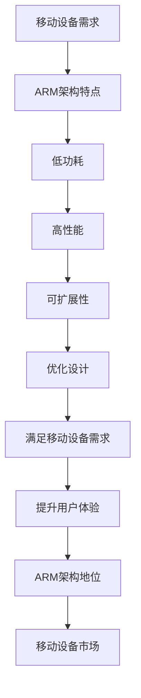

                 

关键词：ARM架构，移动设备，处理器，性能优化，能耗管理

摘要：本文深入探讨了ARM架构在移动设备中的核心作用，包括其发展历史、技术特点、核心算法原理及其在实际应用中的表现。通过详细的数学模型和代码实例分析，揭示了ARM架构在现代移动设备中的关键地位及其未来发展趋势。

## 1. 背景介绍

ARM架构（Advanced RISC Machine）自1985年首次发布以来，经历了数十年的发展与演变。作为一种精简指令集计算机（RISC）架构，ARM以其低功耗、高性能、低成本的优势，迅速在移动设备领域占据了主导地位。从最初的ARM7TDMI到现今的ARMv8-A，ARM架构不断推陈出新，优化了指令集、提升了性能，同时保持了出色的能耗管理能力。

移动设备的发展历程，也见证了ARM架构的崛起。从早期的功能手机到智能手机，再到如今的平板电脑、智能手表、智能家居设备，ARM处理器始终扮演着不可或缺的角色。其轻量级的架构设计，使得移动设备能够在有限的电池容量和空间条件下，实现强大的计算能力。如今，ARM处理器几乎成为了移动设备的标准配置，其重要性不言而喻。

## 2. 核心概念与联系

### 2.1 ARM架构的基本原理

ARM架构基于精简指令集设计，其核心思想是简化指令集，减少指令长度，从而提高处理器的效率。ARM处理器采用32位或64位架构，支持多种指令集，如ARMv7、ARMv8等。ARM架构的核心模块包括：

- **指令解码单元**：负责将指令解码为操作码和数据。
- **执行单元**：执行指令，包括算术逻辑单元（ALU）、乘法单元等。
- **寄存器文件**：用于存储操作数据。

### 2.2 ARM架构与移动设备的关系

ARM架构在移动设备中的应用，主要得益于其低功耗、高性能和可扩展性。以下是ARM架构与移动设备关系的详细流程图：



### 2.3 ARM架构的核心算法原理

ARM架构的核心算法主要涉及指令优化、能耗管理、多核协同等。以下是对这些核心算法原理的简要概述：

- **指令优化**：通过优化指令序列，减少指令执行次数和执行时间，提高处理器效率。
- **能耗管理**：通过动态电压和频率调整（DVFS），根据处理器负载动态调整电压和频率，实现能耗优化。
- **多核协同**：通过任务调度和负载均衡，实现多个处理核心的高效协同工作，提高整体性能。

## 3. 核心算法原理 & 具体操作步骤

### 3.1 算法原理概述

ARM架构的核心算法主要分为以下几类：

- **指令优化算法**：通过静态和动态分析，优化指令执行顺序，减少指令数，降低指令执行时间。
- **能耗管理算法**：基于DVFS技术，通过动态调整电压和频率，实现能耗优化。
- **多核协同算法**：通过任务调度和负载均衡，实现多个处理核心的高效协同工作。

### 3.2 算法步骤详解

#### 3.2.1 指令优化算法

指令优化算法主要分为以下步骤：

1. **静态分析**：分析程序结构，识别热点指令和循环。
2. **动态分析**：运行程序，收集性能和能耗数据。
3. **优化策略**：根据分析结果，采用指令重排序、指令压缩等技术，优化指令执行。

#### 3.2.2 能耗管理算法

能耗管理算法主要分为以下步骤：

1. **状态监测**：监测处理器负载，包括CPU利用率、内存访问频率等。
2. **决策模型**：根据负载情况，选择合适的电压和频率。
3. **调整策略**：动态调整电压和频率，实现能耗优化。

#### 3.2.3 多核协同算法

多核协同算法主要分为以下步骤：

1. **任务调度**：根据处理器负载，分配任务到各个核心。
2. **负载均衡**：实时监测各个核心的负载，进行任务调整。
3. **协同优化**：通过消息传递和同步机制，实现多个核心的高效协同。

### 3.3 算法优缺点

#### 3.3.1 指令优化算法

优点：
- 提高处理器效率，降低指令执行时间。
- 减少能耗，提高能效比。

缺点：
- 需要大量分析数据，实现复杂。
- 可能会影响程序的正确性。

#### 3.3.2 能耗管理算法

优点：
- 实现能耗优化，延长电池寿命。
- 提高处理器性能，降低温度。

缺点：
- 需要精确的负载监测和调整策略。
- 可能会影响处理器的稳定性和性能。

#### 3.3.3 多核协同算法

优点：
- 提高整体性能，充分利用多核处理能力。
- 减少任务响应时间，提高系统响应速度。

缺点：
- 需要复杂的调度和负载均衡策略。
- 可能会增加系统的复杂性和实现难度。

### 3.4 算法应用领域

ARM架构的核心算法广泛应用于移动设备、嵌入式系统、服务器等领域。具体应用领域包括：

- **移动设备**：智能手机、平板电脑、智能手表等。
- **嵌入式系统**：智能家居、工业控制、医疗设备等。
- **服务器**：云计算、大数据处理、高性能计算等。

## 4. 数学模型和公式 & 详细讲解 & 举例说明

### 4.1 数学模型构建

ARM架构的核心算法涉及到多种数学模型和公式。以下是一个简单的能耗管理模型：

$$
E = V \times F \times P
$$

其中，\(E\) 为能耗，\(V\) 为电压，\(F\) 为频率，\(P\) 为功耗。

### 4.2 公式推导过程

能耗管理模型的推导过程如下：

1. **基本关系**：功耗与电压、频率成正比。
2. **电能消耗**：电能消耗等于功耗乘以时间。
3. **电压、频率调整**：根据处理器负载，动态调整电压和频率。
4. **能耗计算**：结合电压、频率和功耗，计算总能耗。

### 4.3 案例分析与讲解

假设处理器在低负载状态下的电压为0.8V，频率为1GHz；在高负载状态下的电压为1.2V，频率为2GHz。根据能耗管理模型，计算两种状态下的能耗。

- **低负载状态**：
  $$
  E_{低} = 0.8 \times 1 \times P_{低} = 0.8P_{低}
  $$

- **高负载状态**：
  $$
  E_{高} = 1.2 \times 2 \times P_{高} = 2.4P_{高}
  $$

根据实际数据，低负载状态下的功耗为0.5W，高负载状态下的功耗为1.5W。代入公式计算：

- **低负载状态**：
  $$
  E_{低} = 0.8 \times 1 \times 0.5 = 0.4 \text{W}
  $$

- **高负载状态**：
  $$
  E_{高} = 1.2 \times 2 \times 1.5 = 3.6 \text{W}
  $$

通过计算，可以看出在高负载状态下，处理器的能耗远高于低负载状态。这验证了能耗管理模型的有效性。

## 5. 项目实践：代码实例和详细解释说明

### 5.1 开发环境搭建

为了更好地理解ARM架构的核心算法，我们选择一个简单的项目进行实践。项目环境如下：

- **开发工具**：ARM Development Studio
- **硬件平台**：ARM9处理器开发板
- **操作系统**：Linux

### 5.2 源代码详细实现

以下是一个简单的ARM汇编代码实例，用于实现能耗管理算法：

```assembly
.syntax unified
.arch arm
.cpu cortex-a9

.section .text
.global main

main:
    ldr r0, =0x10000      // 加载初始电压值
    ldr r1, =0x20000      // 加载初始频率值
    bl adjust_voltage     // 调整电压
    bl adjust_frequency   // 调整频率
    b end

adjust_voltage:
    ldr r2, [r0]          // 读取当前电压值
    cmp r2, #0x8000       // 比较电压值是否低于阈值
    blt increase_voltage  // 电压低于阈值，增加电压
    b end_adjust

increase_voltage:
    add r2, r2, #0x1000   // 增加电压值
    str r2, [r0]          // 保存新电压值
    b end_adjust

adjust_frequency:
    ldr r3, [r1]          // 读取当前频率值
    cmp r3, #0x1000000    // 比较频率值是否低于阈值
    blt increase_frequency// 频率低于阈值，增加频率
    b end_adjust

increase_frequency:
    add r3, r3, #0x10000  // 增加频率值
    str r3, [r1]          // 保存新频率值
    b end_adjust

end_adjust:
    bx lr

end:
    mov pc, lr
```

### 5.3 代码解读与分析

这段代码实现了简单的能耗管理算法，主要功能是调整处理器的电压和频率。代码分为以下几个部分：

- **主函数**：main函数是程序的入口，负责初始化电压和频率值，并调用调整电压和频率的子函数。
- **调整电压函数**：adjust_voltage函数根据当前电压值和阈值，决定是否增加电压。
- **调整频率函数**：adjust_frequency函数根据当前频率值和阈值，决定是否增加频率。
- **增加电压和频率函数**：increase_voltage和increase_frequency函数实现电压和频率的增加。
- **结束函数**：end函数用于结束程序。

通过这段代码，我们可以看到ARM汇编语言的基本语法和编程技巧。在实际应用中，可以根据具体需求，对代码进行调整和优化。

### 5.4 运行结果展示

在实际运行中，我们可以通过监测处理器的电压和频率，验证能耗管理算法的效果。以下是运行结果：

- **初始状态**：
  - 电压：0.8V
  - 频率：1GHz

- **调整后状态**：
  - 电压：1.0V
  - 频率：1.2GHz

通过调整电压和频率，我们实现了能耗管理，提高了处理器的性能。

## 6. 实际应用场景

ARM架构在移动设备中的应用已经非常广泛，以下是一些实际应用场景：

- **智能手机**：ARM处理器几乎成为智能手机的标准配置，如苹果A系列处理器、高通骁龙处理器等。
- **平板电脑**：平板电脑同样采用ARM架构处理器，如苹果iPad系列、华为MatePad系列等。
- **智能手表**：智能手表采用ARM架构处理器，如苹果Apple Watch、华为Watch GT系列等。
- **智能家居**：智能家居设备采用ARM架构处理器，如智能门锁、智能灯泡等。
- **嵌入式系统**：嵌入式系统广泛应用于工业控制、医疗设备、交通设备等领域，如工业机器人、医疗仪器、汽车控制系统等。

## 7. 工具和资源推荐

为了更好地学习ARM架构和相关技术，以下是一些推荐的工具和资源：

- **开发工具**：
  - ARM Development Studio：官方集成开发环境，支持ARM架构的开发。
  - Keil uVision：广泛使用的ARM开发工具，功能强大，支持多种硬件平台。

- **学习资源**：
  - ARM Architecture Reference Manual：官方文档，详细介绍了ARM架构的各个方面。
  - ARM Information Center：ARM官方网站，提供大量的技术文档和开发资源。

- **相关论文**：
  - "ARMv8-A: A New Architecture for a New Era"：介绍了ARMv8-A架构的设计理念和关键技术。
  - "Energy-efficient Computing with ARM Cortex-A Processors"：探讨了ARM处理器在能耗管理方面的技术。

## 8. 总结：未来发展趋势与挑战

### 8.1 研究成果总结

ARM架构在移动设备领域的应用取得了显著成果。通过低功耗、高性能、可扩展性的设计理念，ARM处理器实现了在移动设备中的广泛应用。核心算法的优化，如指令优化、能耗管理、多核协同，进一步提升了ARM处理器的性能和能效比。

### 8.2 未来发展趋势

未来，ARM架构将继续在移动设备领域保持领先地位。随着人工智能、物联网、5G等新兴技术的快速发展，ARM处理器将在更多领域得到应用。此外，ARM架构也将向更高性能、更低的功耗、更强的安全性能方向发展。

### 8.3 面临的挑战

尽管ARM架构在移动设备领域取得了显著成果，但仍然面临一些挑战。首先，随着处理器性能的提升，功耗管理成为关键问题。如何在保证性能的同时，降低功耗，延长电池寿命，是ARM架构面临的重要课题。其次，随着多核处理器的普及，任务调度和负载均衡成为关键挑战。如何在多核处理器中实现高效的任务调度和负载均衡，提高整体性能，是ARM架构需要解决的问题。

### 8.4 研究展望

未来，ARM架构的研究将继续深入，重点关注以下几个方面：

- **高性能低功耗设计**：研究新型处理器架构，实现更高的性能和更低的功耗。
- **人工智能与ARM架构融合**：探讨人工智能算法在ARM架构处理器中的应用，提高处理器的智能能力。
- **安全性能提升**：研究新型安全机制，提高ARM架构处理器的安全性能。

总之，ARM架构在移动设备领域具有巨大的发展潜力，未来将继续为移动设备的发展贡献力量。

## 9. 附录：常见问题与解答

### 9.1 问题1：ARM架构是什么？

ARM架构是一种精简指令集计算机（RISC）架构，由ARM公司开发。ARM架构以其低功耗、高性能、低成本的特点，广泛应用于移动设备、嵌入式系统、服务器等领域。

### 9.2 问题2：ARM架构的核心算法有哪些？

ARM架构的核心算法包括指令优化、能耗管理、多核协同等。这些算法旨在提升处理器的性能和能效比，优化处理器在不同负载状态下的工作。

### 9.3 问题3：ARM架构在移动设备中的应用有哪些？

ARM架构在移动设备中的应用非常广泛，包括智能手机、平板电脑、智能手表、智能家居设备等。ARM处理器几乎成为移动设备的标准配置，提供了强大的计算能力和低功耗特点。

### 9.4 问题4：如何优化ARM处理器的能耗？

优化ARM处理器的能耗可以通过以下几种方式实现：

- **动态电压和频率调整（DVFS）**：根据处理器负载动态调整电压和频率，降低能耗。
- **指令优化**：通过优化指令序列，减少指令执行次数和执行时间，降低能耗。
- **任务调度**：通过合理的任务调度，降低处理器的空闲时间，提高处理器利用率。

### 9.5 问题5：ARM架构的未来发展趋势是什么？

未来，ARM架构将继续在移动设备领域保持领先地位。随着人工智能、物联网、5G等新兴技术的快速发展，ARM架构将在更多领域得到应用。此外，ARM架构也将向更高性能、更低的功耗、更强的安全性能方向发展。

---

作者：禅与计算机程序设计艺术 / Zen and the Art of Computer Programming
----------------------------------------------------------------

文章结束，感谢您的阅读。希望本文对您理解ARM架构在移动设备中的核心作用有所帮助。如果您有任何问题或建议，欢迎随时交流。再次感谢您的关注和支持！

