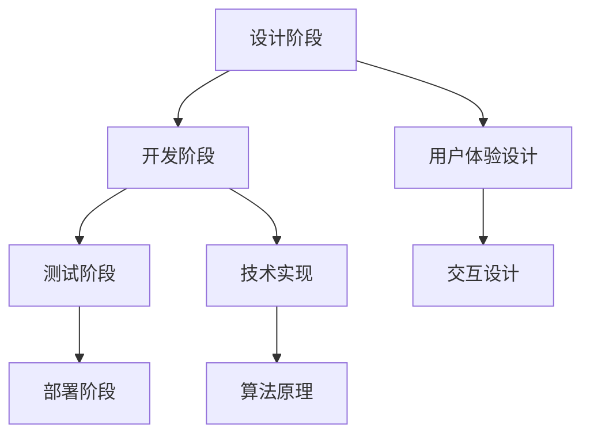

                 

关键词：增强现实、内容创作、应用设计、AR技术、用户体验、开发工具、算法原理、数学模型、项目实践、未来展望。

> 摘要：本文深入探讨了增强现实（AR）内容创作的设计原则和应用方法，结合核心算法原理和数学模型，提供了一套完整的AR应用设计指南。文章通过项目实践案例，展示了从开发环境搭建到代码实现及运行结果的全过程，最后展望了AR技术的未来发展趋势和面临的挑战。

## 1. 背景介绍

增强现实（Augmented Reality，简称AR）是一种将虚拟信息与现实世界相结合的技术。通过AR，用户可以看到叠加在现实世界中的虚拟元素，这些元素可以是文字、图像、3D模型等。近年来，随着硬件设备（如智能手机、平板电脑、智能眼镜等）和软件开发工具的不断发展，AR技术已经在多个领域得到了广泛应用，包括娱乐、医疗、教育、广告和市场营销等。

在AR内容创作方面，设计一个优秀的AR应用需要考虑用户体验、技术实现和实际应用等多个方面。本文将结合这些因素，详细探讨AR应用设计的原则和方法。

## 2. 核心概念与联系

为了更好地理解AR内容创作，我们首先需要了解以下几个核心概念：

### 2.1 AR技术基础

- **AR核心原理**：AR技术的基本原理是利用摄像头捕捉现实世界的图像，并通过计算机算法叠加虚拟信息。这个过程通常包括图像识别、跟踪和渲染。

- **AR硬件设备**：常见的AR硬件设备包括智能手机、平板电脑和智能眼镜。其中，智能手机和平板电脑是最常见的AR设备，而智能眼镜则提供了更沉浸式的用户体验。

### 2.2 内容创作工具

- **内容创作平台**：有许多内容创作平台可以帮助开发者创建AR应用，如Unity、ARKit、ARCore、Adobe Aero等。

- **内容创作流程**：AR内容创作通常包括设计、开发、测试和部署四个阶段。在设计阶段，开发者需要确定应用的目标用户、内容和交互方式；在开发阶段，开发者使用特定的工具和技术实现AR内容；在测试阶段，开发者需要确保应用在各种设备上都能正常运行；在部署阶段，开发者将应用发布到目标平台。

### 2.3 用户体验设计

- **交互设计**：AR应用的交互设计需要考虑用户的操作习惯和反馈机制，确保用户能够轻松地与虚拟元素进行交互。

- **界面设计**：AR应用的界面设计需要简洁直观，避免过多的干扰元素，以确保用户能够专注于应用的核心功能。

### 2.4 技术架构

- **算法原理**：AR应用的技术架构包括图像识别、跟踪和渲染等核心算法。其中，图像识别用于识别现实世界中的物体，跟踪用于跟踪物体的位置和姿态，渲染则用于将虚拟元素叠加到现实世界中。

- **开发工具**：AR开发工具如Unity、ARKit、ARCore等提供了丰富的开发资源和API，帮助开发者快速实现AR应用。

### 2.5 Mermaid流程图

以下是一个简化的AR应用设计流程的Mermaid流程图：



## 3. 核心算法原理 & 具体操作步骤

### 3.1 算法原理概述

AR应用的核心算法主要包括图像识别、跟踪和渲染。以下是对这些算法的简要概述：

- **图像识别**：图像识别算法用于识别现实世界中的物体。常用的图像识别算法包括基于特征匹配的算法、基于深度学习的算法等。

- **跟踪**：跟踪算法用于跟踪识别出的物体的位置和姿态。常见的跟踪算法有基于特征点的算法、基于模型匹配的算法等。

- **渲染**：渲染算法用于将虚拟元素叠加到现实世界中。渲染算法需要考虑光照、阴影、透明度等因素，以确保虚拟元素与现实世界融为一体。

### 3.2 算法步骤详解

以下是AR应用的核心算法步骤：

1. **图像识别**：通过摄像头捕获实时图像，使用图像识别算法识别图像中的物体。

2. **跟踪**：对识别出的物体进行跟踪，计算物体的位置和姿态。

3. **渲染**：根据物体的位置和姿态，将虚拟元素渲染到图像中。

4. **显示**：将渲染后的图像显示在屏幕上，用户可以看到叠加在现实世界中的虚拟元素。

### 3.3 算法优缺点

- **图像识别**：优点是能够识别出多种类型的物体，缺点是对光照、角度和遮挡敏感。

- **跟踪**：优点是能够准确跟踪物体的位置和姿态，缺点是可能受到物体运动速度和场景复杂度的影响。

- **渲染**：优点是实现简单，缺点是渲染效果可能不够真实。

### 3.4 算法应用领域

AR技术的核心算法在多个领域都有广泛应用：

- **娱乐**：AR游戏和娱乐应用，如《Pokémon GO》。

- **医疗**：医学图像的增强显示和辅助诊断。

- **教育**：增强现实教科书和虚拟实验室。

- **广告和市场营销**：产品展示和促销活动。

## 4. 数学模型和公式 & 详细讲解 & 举例说明

### 4.1 数学模型构建

在AR内容创作中，数学模型主要用于图像识别、跟踪和渲染等核心算法的实现。以下是一个简单的数学模型构建示例：

1. **图像识别**：使用卷积神经网络（CNN）进行图像识别。CNN的基本结构包括卷积层、池化层和全连接层。

2. **跟踪**：使用卡尔曼滤波器（Kalman Filter）进行物体跟踪。卡尔曼滤波器的基本公式为：

   $$ x_{k+1} = A_k x_k + B_k u_k + w_k $$
   $$ P_{k+1} = A_k P_k A_k^T + Q_k $$

   其中，$x_k$ 是物体位置，$A_k$ 是状态转移矩阵，$B_k$ 是控制矩阵，$u_k$ 是控制输入，$w_k$ 是过程噪声。

3. **渲染**：使用透视变换（Perspective Transformation）将虚拟元素渲染到图像中。透视变换的矩阵为：

   $$ T = \begin{bmatrix}
   a & b & c \\
   d & e & f \\
   0 & 0 & 1
   \end{bmatrix} $$

   其中，$a, b, c, d, e, f$ 是透视变换参数。

### 4.2 公式推导过程

1. **图像识别**：CNN的公式推导涉及到卷积操作、激活函数和反向传播等。具体推导过程可参考相关深度学习教材。

2. **跟踪**：卡尔曼滤波器的推导过程相对复杂，需要掌握线性系统理论和随机过程知识。推导过程可参考《Kalman Filter for Dummies》等资料。

3. **渲染**：透视变换的推导过程基于几何学原理，具体推导步骤如下：

   - 假设有一个3D点$(x, y, z)$，其在图像平面上的投影点为$(x', y')$。
   - 通过透视变换矩阵$T$，有：

     $$ x' = \frac{a x + b y + c z}{d} $$
     $$ y' = \frac{e x + f y + g z}{h} $$

### 4.3 案例分析与讲解

以一个简单的AR应用为例，我们使用Unity开发一个可以在屏幕上显示3D模型的AR应用。

1. **设计阶段**：确定应用的目标用户和功能需求，如显示一个3D模型并在用户触摸屏幕时改变其颜色。

2. **开发阶段**：

   - 使用Unity的ARKit插件实现图像识别和跟踪。
   - 使用Unity的3D模型导入器导入3D模型。
   - 编写C#脚本实现交互逻辑，如改变模型颜色。

3. **测试阶段**：在多种设备上测试应用的性能和稳定性，确保其在不同设备上都能正常运行。

4. **部署阶段**：将应用打包并发布到iOS和Android平台。

## 5. 项目实践：代码实例和详细解释说明

### 5.1 开发环境搭建

为了开发一个AR应用，我们需要以下开发环境和工具：

- Unity 2020.3或更高版本
- Xcode 12或更高版本（iOS开发）
- Android Studio 4.1或更高版本（Android开发）
- ARKit插件
- ARCore插件

### 5.2 源代码详细实现

以下是Unity项目中的一部分C#脚本，用于实现3D模型的显示和交互：

```csharp
using UnityEngine;
using UnityEngine.XR.ARFoundation;

public class ARModelController : MonoBehaviour
{
    public GameObject modelPrefab;
    public ARCameraManager cameraManager;

    private GameObject modelInstance;

    void Update()
    {
        if (Input.touchCount > 0 && Input.touches[0].phase == TouchPhase.Began)
        {
            Pose pose = cameraManager.gameObject.GetComponent<ARCamera>().GetTrackingResult().pose;
            modelInstance = Instantiate(modelPrefab, pose.position, pose.rotation);
        }

        if (modelInstance != null && Input.touchCount > 0 && Input.touches[0].phase == TouchPhase.Began)
        {
            Material material = modelInstance.GetComponent<MeshRenderer>().material;
            material.color = Color.HSVToRGB(Random.value, 1, 1);
        }
    }
}
```

### 5.3 代码解读与分析

1. **模型创建**：使用`Instantiate`方法在用户触摸屏幕时创建3D模型。

2. **模型定位**：通过`ARCameraManager`获取当前摄像头的跟踪结果，并将模型定位到摄像头的位置。

3. **模型交互**：在用户触摸屏幕时，改变模型的颜色。

### 5.4 运行结果展示

当用户在AR场景中触摸屏幕时，3D模型会被创建并定位在摄像头的前方。用户再次触摸屏幕时，模型颜色会随机改变。

## 6. 实际应用场景

AR技术在多个领域都有广泛应用，以下是一些典型的应用场景：

- **娱乐**：AR游戏和虚拟现实体验，如《Pokémon GO》和《Among Us》。

- **教育**：增强现实教科书和虚拟实验室，如《MagicSchool》和《Google Expeditions》。

- **医疗**：医学图像的增强显示和辅助诊断，如《VisualSurgical》和《OssoVR》。

- **广告和市场营销**：产品展示和促销活动，如《IKEA Place》和《Snapchat Lens Studio》。

## 7. 工具和资源推荐

### 7.1 学习资源推荐

- **Unity官方文档**：Unity官方文档提供了丰富的AR开发教程和API文档。
- **ARKit官方文档**：ARKit官方文档提供了详细的AR开发指南和示例代码。
- **ARCore官方文档**：ARCore官方文档提供了详细的AR开发指南和示例代码。
- **《Augmented Reality: Principles and Practice》**：这是一本关于AR技术的经典教材，涵盖了AR技术的各个方面。

### 7.2 开发工具推荐

- **Unity**：Unity是最流行的AR开发工具之一，提供了丰富的功能和API。
- **ARKit**：ARKit是Apple开发的AR开发框架，适用于iOS平台。
- **ARCore**：ARCore是Google开发的AR开发框架，适用于Android平台。
- **Adobe Aero**：Adobe Aero是一个易于使用的AR内容创作平台，适用于初学者。

### 7.3 相关论文推荐

- **《Real-Time Recognition and Tracking of Human Bodies in Image Sequences Using a Bayesian Network》**：这篇论文介绍了一种用于人体识别和跟踪的贝叶斯网络算法。
- **《Convolutional Neural Networks for Visual Recognition》**：这篇论文介绍了一种用于图像识别的卷积神经网络算法。
- **《A New Approach to Mobile Augmented Reality》**：这篇论文介绍了一种用于移动AR的新方法。

## 8. 总结：未来发展趋势与挑战

### 8.1 研究成果总结

AR技术在过去几年取得了显著进展，主要表现在以下几个方面：

- 硬件设备的性能提升，使得AR应用能够更流畅地运行。
- 软件开发工具的丰富，降低了AR开发的门槛。
- 应用场景的拓展，AR技术在娱乐、教育、医疗等领域得到了广泛应用。

### 8.2 未来发展趋势

AR技术未来的发展趋势主要包括：

- 硬件设备的发展，如更高性能的处理器、更小的传感器、更广的视角等。
- 软件开发工具的创新，如更加直观的内容创作工具、更高效的算法等。
- 应用领域的拓展，如工业、农业、物流等。

### 8.3 面临的挑战

AR技术在未来发展过程中将面临以下挑战：

- 硬件设备的性能提升需要与软件算法的优化相匹配。
- AR内容的创作和分发需要解决版权和知识产权问题。
- AR技术的普及需要解决用户体验和隐私保护等问题。

### 8.4 研究展望

未来的AR技术研究将集中在以下几个方面：

- 算法的优化和改进，如图像识别、跟踪和渲染等。
- 新型硬件设备的研究，如智能眼镜、头戴式显示器等。
- 新型应用场景的探索，如工业自动化、智能农业等。

## 9. 附录：常见问题与解答

### 9.1 AR应用设计中的常见问题

- **问题1：如何确保AR应用的性能？**
  - **解答**：优化算法和资源使用，如减少渲染复杂度、使用高效的图像识别算法等。

- **问题2：如何处理AR内容版权问题？**
  - **解答**：确保内容创作者的知识产权得到保护，如使用版权保护技术、签订版权协议等。

- **问题3：如何提升AR应用的沉浸感？**
  - **解答**：优化交互设计，如使用更加直观的交互方式、增加虚拟元素的互动性等。

### 9.2 AR技术在实际应用中的常见问题

- **问题1：如何确保AR内容在多种设备上都能正常运行？**
  - **解答**：进行跨平台测试，确保AR内容在不同设备和操作系统上都能正常运行。

- **问题2：如何处理AR内容的遮挡问题？**
  - **解答**：使用遮挡处理算法，如透明度插值、遮挡估计等。

- **问题3：如何提高AR内容的交互性？**
  - **解答**：增加AR内容的互动性，如手势识别、语音交互等。

---

作者：禅与计算机程序设计艺术 / Zen and the Art of Computer Programming

