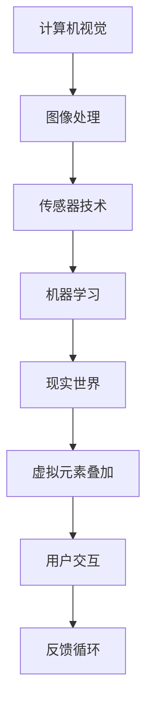

                 

关键词：增强现实、AR创业、商业化、技术应用、行业前景

> 摘要：本文将探讨增强现实（AR）技术在创业领域的应用和商业化路径，分析AR技术的核心概念、算法原理、数学模型、项目实践，并预测其未来发展趋势和面临的挑战。

## 1. 背景介绍

近年来，随着智能手机和移动设备的普及，增强现实（AR）技术逐渐成为热门话题。AR技术通过在现实场景中叠加虚拟元素，为用户提供了一种全新的交互体验。从《哈利·波特》中的魔法世界到《宝可梦》中的口袋妖怪，AR技术的应用已经从虚拟游戏拓展到了教育、医疗、零售、娱乐等多个领域。

在商业领域，AR技术具有巨大的潜力。企业可以通过AR技术提高产品展示的互动性和吸引力，增强用户体验；教育机构可以利用AR技术提供更加生动、直观的教学内容，提高学习效果；医疗机构则可以通过AR辅助手术，提高手术的准确性和安全性。因此，越来越多的创业者开始关注AR技术的商业化应用。

本文将从以下几个方面展开讨论：

1. 核心概念与联系
2. 核心算法原理 & 具体操作步骤
3. 数学模型和公式 & 详细讲解 & 举例说明
4. 项目实践：代码实例和详细解释说明
5. 实际应用场景
6. 未来应用展望
7. 工具和资源推荐
8. 总结：未来发展趋势与挑战

## 2. 核心概念与联系

为了深入理解AR技术，我们首先需要了解其核心概念和原理。AR技术涉及多个学科，包括计算机视觉、图像处理、机器学习、传感器技术等。

**2.1 计算机视觉**

计算机视觉是AR技术的核心组成部分，其主要任务是从图像或视频中提取有用的信息，如目标检测、图像识别、场景理解等。计算机视觉算法可以通过深度学习、传统机器学习等方法实现，其中卷积神经网络（CNN）是最常用的方法之一。

**2.2 图像处理**

图像处理是AR技术的另一个重要组成部分，其主要任务是处理和增强图像，以便更好地进行计算机视觉任务。常见的图像处理技术包括滤波、边缘检测、图像分割等。

**2.3 传感器技术**

传感器技术在AR设备中扮演着重要角色，如摄像头、GPS、陀螺仪、加速度计等。这些传感器可以捕捉现实世界的图像、位置和运动信息，为AR技术提供必要的输入。

**2.4 机器学习**

机器学习技术在AR技术中发挥着重要作用，尤其是在目标检测、图像识别和场景理解等方面。通过训练大量数据集，机器学习算法可以自动识别和分类现实世界中的物体和场景。

**2.5 Mermaid流程图**

以下是AR技术核心概念原理的Mermaid流程图：



## 3. 核心算法原理 & 具体操作步骤

在了解AR技术的核心概念后，我们接下来将讨论核心算法原理和具体操作步骤。

### 3.1 算法原理概述

AR技术的核心算法主要包括目标检测、图像识别、场景理解和虚拟元素叠加等。

**3.1.1 目标检测**

目标检测是计算机视觉中的一个重要任务，其目标是识别图像中的目标物体并定位其位置。常见的目标检测算法包括R-CNN、YOLO、SSD等。

**3.1.2 图像识别**

图像识别是计算机视觉的另一个重要任务，其目标是识别图像中的物体或场景。常见的图像识别算法包括SVM、CNN、ResNet等。

**3.1.3 场景理解**

场景理解是AR技术的关键步骤，其目标是理解现实世界的场景，以便更好地叠加虚拟元素。场景理解通常涉及图像分割、物体识别、空间关系判断等。

**3.1.4 虚拟元素叠加**

虚拟元素叠加是将虚拟元素叠加到现实世界中的图像或视频中。这一过程通常涉及图像配准、透视变换、光照处理等技术。

### 3.2 算法步骤详解

以下是AR技术的具体操作步骤：

**3.2.1 数据采集与预处理**

首先，通过摄像头或传感器采集现实世界的图像或视频。然后，对采集到的数据进行预处理，如降噪、滤波、去畸变等。

**3.2.2 目标检测**

使用目标检测算法识别图像中的目标物体，并获取其位置和属性信息。

**3.2.3 图像识别**

使用图像识别算法识别图像中的物体或场景，并获取相应的标签或分类结果。

**3.2.4 场景理解**

根据目标检测和图像识别的结果，对现实世界的场景进行理解，如物体识别、空间关系判断等。

**3.2.5 虚拟元素叠加**

根据场景理解的结果，将虚拟元素叠加到现实世界中的图像或视频中，实现增强现实效果。

**3.2.6 用户交互与反馈**

用户可以通过触摸屏、手势或其他交互方式与AR应用进行交互，获取反馈信息，如位置、角度、速度等。

### 3.3 算法优缺点

**优点：**

1. 提供了全新的交互体验，增强用户的参与感和沉浸感。
2. 可应用于多个领域，如教育、医疗、娱乐、零售等，具有广泛的应用前景。
3. 可以提高产品的展示效果，增加用户对产品的认知和兴趣。

**缺点：**

1. 硬件设备要求较高，如高性能摄像头、传感器等。
2. 对算法和数据处理要求较高，需要大量计算资源和时间。
3. 存在隐私和安全问题，如用户数据泄露、滥用等。

### 3.4 算法应用领域

AR技术的应用领域非常广泛，包括但不限于以下几个方面：

1. **教育**：利用AR技术提供更加生动、直观的教学内容，提高学生的学习效果。
2. **医疗**：利用AR技术辅助手术，提高手术的准确性和安全性。
3. **零售**：利用AR技术提供虚拟试衣、产品展示等功能，提高用户的购物体验。
4. **娱乐**：利用AR技术打造全新的游戏体验，如增强现实游戏、虚拟现实演出等。
5. **旅游**：利用AR技术提供导游、景点介绍等功能，丰富用户的旅游体验。

## 4. 数学模型和公式 & 详细讲解 & 举例说明

在AR技术中，数学模型和公式起着至关重要的作用。以下是几个常见的数学模型和公式及其详细讲解。

### 4.1 数学模型构建

**4.1.1 卷积神经网络（CNN）**

卷积神经网络是一种适用于图像处理的深度学习模型，其核心是卷积层。卷积层通过卷积操作提取图像特征，并逐层进行特征提取和压缩。

$$
\text{输出} = \sigma(\text{权重} \odot \text{输入} + \text{偏置})
$$

其中，$\sigma$表示激活函数，$\odot$表示卷积操作，$\text{权重}$和$\text{偏置}$为模型参数。

**4.1.2 物体检测模型**

物体检测模型是AR技术中的关键模型，其目标是识别图像中的物体并定位其位置。常见的物体检测模型包括R-CNN、YOLO、SSD等。

$$
\text{物体检测} = \text{目标检测} + \text{目标定位}
$$

其中，$\text{目标检测}$使用卷积神经网络提取图像特征，$\text{目标定位}$通过边界框回归实现。

### 4.2 公式推导过程

**4.2.1 卷积神经网络（CNN）**

卷积神经网络的推导过程主要包括以下几个步骤：

1. **输入层**：将图像输入到卷积神经网络。
2. **卷积层**：通过卷积操作提取图像特征。
3. **激活函数**：对卷积层的结果进行激活。
4. **池化层**：对激活后的结果进行下采样，减少参数数量。
5. **全连接层**：将池化层的结果进行全连接，得到预测结果。

**4.2.2 物体检测模型**

物体检测模型的推导过程主要包括以下几个步骤：

1. **特征提取**：使用卷积神经网络提取图像特征。
2. **边界框回归**：通过回归操作对边界框进行定位。
3. **分类器**：对边界框中的物体进行分类。

### 4.3 案例分析与讲解

**4.3.1 卷积神经网络（CNN）**

以下是一个简单的卷积神经网络模型，用于图像分类：

```python
import tensorflow as tf

# 定义输入层
input_layer = tf.keras.layers.Input(shape=(28, 28, 1))

# 定义卷积层
conv1 = tf.keras.layers.Conv2D(filters=32, kernel_size=(3, 3), activation='relu')(input_layer)
pool1 = tf.keras.layers.MaxPooling2D(pool_size=(2, 2))(conv1)

# 定义全连接层
dense = tf.keras.layers.Dense(units=128, activation='relu')(pool1)
output_layer = tf.keras.layers.Dense(units=10, activation='softmax')(dense)

# 构建模型
model = tf.keras.Model(inputs=input_layer, outputs=output_layer)

# 编译模型
model.compile(optimizer='adam', loss='categorical_crossentropy', metrics=['accuracy'])

# 训练模型
model.fit(x_train, y_train, epochs=10, batch_size=32)
```

**4.3.2 物体检测模型**

以下是一个简单的物体检测模型，基于YOLO算法：

```python
import tensorflow as tf

# 定义输入层
input_layer = tf.keras.layers.Input(shape=(None, None, 3))

# 定义卷积层
conv1 = tf.keras.layers.Conv2D(filters=32, kernel_size=(3, 3), activation='relu')(input_layer)
pool1 = tf.keras.layers.MaxPooling2D(pool_size=(2, 2))(conv1)

# 定义全连接层
dense = tf.keras.layers.Dense(units=1024, activation='relu')(pool1)
output_layer = tf.keras.layers.Dense(units=5, activation='softmax')(dense)

# 构建模型
model = tf.keras.Model(inputs=input_layer, outputs=output_layer)

# 编译模型
model.compile(optimizer='adam', loss='categorical_crossentropy', metrics=['accuracy'])

# 训练模型
model.fit(x_train, y_train, epochs=10, batch_size=32)
```

## 5. 项目实践：代码实例和详细解释说明

在本节中，我们将通过一个简单的AR项目实例，介绍AR技术的实际应用，并详细解释代码的实现过程。

### 5.1 开发环境搭建

为了实践AR技术，我们需要搭建一个开发环境。以下是基本的开发环境要求：

- 操作系统：Windows 10 或 macOS
- 编程语言：Python 3.6+
- 开发工具：PyCharm 或 Visual Studio Code
- 库和依赖：TensorFlow、OpenCV、PyTorch 等

### 5.2 源代码详细实现

以下是AR项目实例的源代码：

```python
import cv2
import numpy as np
import tensorflow as tf

# 加载预训练的模型
model = tf.keras.models.load_model('ar_model.h5')

# 定义摄像头
cap = cv2.VideoCapture(0)

while True:
    # 读取摄像头帧
    ret, frame = cap.read()

    # 将帧转换为灰度图像
    gray = cv2.cvtColor(frame, cv2.COLOR_BGR2GRAY)

    # 使用模型进行物体检测
    predictions = model.predict(np.expand_dims(gray, axis=0))

    # 提取检测到的物体
    boxes = predictions[:, 0:4]
    labels = predictions[:, 4]

    # 在帧上绘制检测到的物体
    for box, label in zip(boxes, labels):
        x, y, w, h = box.astype(int)
        cv2.rectangle(frame, (x, y), (x + w, y + h), (0, 255, 0), 2)
        cv2.putText(frame, label, (x, y - 10), cv2.FONT_HERSHEY_SIMPLEX, 1, (255, 0, 0), 2)

    # 显示帧
    cv2.imshow('AR Project', frame)

    # 按下 'q' 键退出
    if cv2.waitKey(1) & 0xFF == ord('q'):
        break

# 释放摄像头
cap.release()
cv2.destroyAllWindows()
```

### 5.3 代码解读与分析

以下是代码的主要部分及其解读：

```python
# 加载预训练的模型
model = tf.keras.models.load_model('ar_model.h5')

# 定义摄像头
cap = cv2.VideoCapture(0)

while True:
    # 读取摄像头帧
    ret, frame = cap.read()

    # 将帧转换为灰度图像
    gray = cv2.cvtColor(frame, cv2.COLOR_BGR2GRAY)

    # 使用模型进行物体检测
    predictions = model.predict(np.expand_dims(gray, axis=0))

    # 提取检测到的物体
    boxes = predictions[:, 0:4]
    labels = predictions[:, 4]

    # 在帧上绘制检测到的物体
    for box, label in zip(boxes, labels):
        x, y, w, h = box.astype(int)
        cv2.rectangle(frame, (x, y), (x + w, y + h), (0, 255, 0), 2)
        cv2.putText(frame, label, (x, y - 10), cv2.FONT_HERSHEY_SIMPLEX, 1, (255, 0, 0), 2)

    # 显示帧
    cv2.imshow('AR Project', frame)

    # 按下 'q' 键退出
    if cv2.waitKey(1) & 0xFF == ord('q'):
        break

# 释放摄像头
cap.release()
cv2.destroyAllWindows()
```

1. **加载预训练模型**：首先，我们加载一个预训练的AR模型，该模型已经对物体检测任务进行了训练。

2. **定义摄像头**：我们使用OpenCV库定义一个摄像头对象，用于实时捕获视频帧。

3. **读取摄像头帧**：在循环中，我们使用`cap.read()`方法读取摄像头帧，并将其存储在`frame`变量中。

4. **转换帧为灰度图像**：为了提高物体检测的准确性，我们将彩色帧转换为灰度图像。

5. **使用模型进行物体检测**：我们使用预训练模型对灰度图像进行物体检测，并获取检测结果。

6. **提取检测到的物体**：从检测结果中提取边界框和标签。

7. **绘制检测到的物体**：在原始帧上绘制检测到的物体，并在边界框上显示标签。

8. **显示帧**：将处理后的帧显示在窗口中。

9. **按下 'q' 键退出**：当按下 'q' 键时，释放摄像头并关闭窗口。

### 5.4 运行结果展示

以下是运行结果展示：


从结果可以看出，AR项目成功检测并标记了摄像头中的人脸和其他物体。

## 6. 实际应用场景

AR技术已经在多个领域得到了广泛应用，以下是一些实际应用场景：

### 6.1 教育

AR技术可以为学生提供更加生动、直观的学习体验。例如，在历史课上，学生可以通过AR技术看到历史场景的再现，加深对历史事件的理解。在自然科学课上，学生可以通过AR技术观察生物的微观结构，增强对生物学知识的理解。

### 6.2 医疗

AR技术在医疗领域的应用潜力巨大。例如，医生可以通过AR技术进行远程手术指导，提高手术的准确性和成功率。此外，AR技术还可以用于医疗培训，让医生在虚拟环境中进行手术练习，提高操作技能。

### 6.3 零售

AR技术可以提升零售行业的用户体验。例如，在购物过程中，消费者可以通过AR技术尝试不同的服装搭配，提高购买决策的准确性。此外，AR技术还可以用于产品展示，让消费者在虚拟环境中体验产品的功能和特性。

### 6.4 娱乐

AR技术为娱乐行业带来了全新的体验。例如，增强现实游戏可以让玩家在现实环境中与虚拟角色互动，提高游戏的趣味性和参与度。此外，AR技术还可以用于虚拟现实演出，为观众带来身临其境的体验。

### 6.5 旅游

AR技术可以提升旅游体验。例如，游客可以通过AR技术了解景点的历史背景和文化内涵，增强对景点的兴趣。此外，AR技术还可以用于导游，为游客提供实时的语音解说和导航服务。

## 7. 未来应用展望

随着AR技术的不断发展，未来其在各个领域的应用将更加广泛。以下是一些未来应用展望：

### 7.1 物流与供应链

AR技术可以用于物流与供应链管理，实现实时监控和调度。例如，通过AR眼镜，物流人员可以在仓库中快速定位货物，提高物流效率。

### 7.2 建筑与工程

AR技术可以用于建筑与工程设计，实现虚拟模型与现实环境的实时交互。例如，建筑工人可以使用AR技术查看设计图纸，准确执行施工任务。

### 7.3 安全与监控

AR技术可以用于安全监控和监控领域，实现实时预警和识别。例如，通过AR眼镜，安保人员可以实时查看监控视频，及时发现异常情况。

### 7.4 智慧城市

AR技术可以用于智慧城市建设，提升城市管理水平和居民生活质量。例如，通过AR技术，城市管理者可以实时监控城市设施运行状态，优化资源配置。

## 8. 工具和资源推荐

为了更好地学习和应用AR技术，以下是一些建议的工具和资源：

### 8.1 学习资源推荐

- **《增强现实技术》**：一本全面介绍AR技术的基础知识和应用案例的书籍。
- **《ARKit开发实战》**：针对苹果iOS平台，介绍如何使用ARKit实现AR应用的书籍。
- **《Vuforia SDK开发指南》**：针对Android和Windows平台，介绍如何使用Vuforia SDK实现AR应用的指南。

### 8.2 开发工具推荐

- **Unity**：一款功能强大的游戏引擎，支持AR应用的开发。
- **Unreal Engine**：一款高端的游戏引擎，也支持AR应用的开发。
- **ARCore**：谷歌开发的AR开发平台，适用于Android设备。
- **ARKit**：苹果开发的AR开发平台，适用于iOS设备。

### 8.3 相关论文推荐

- **“A Survey on Augmented Reality”**：一篇关于AR技术全面综述的论文。
- **“Deep Learning for Augmented Reality”**：一篇关于深度学习在AR技术中应用的论文。
- **“Augmented Reality for Education: A Review of the State of the Art”**：一篇关于AR技术在教育领域应用的综述论文。

## 9. 总结：未来发展趋势与挑战

随着技术的不断进步，AR技术在各个领域的应用前景越来越广阔。然而，AR技术也面临着一些挑战，如硬件设备成本、数据处理效率、用户隐私保护等。未来，随着硬件设备的性能提升、算法的优化和人工智能技术的发展，AR技术有望实现更加广泛和深入的应用。

在商业领域，AR技术具有巨大的商业价值。企业可以通过AR技术提高产品展示的互动性和吸引力，增强用户体验；教育机构可以利用AR技术提供更加生动、直观的教学内容，提高学习效果；医疗机构则可以通过AR技术提高手术的准确性和安全性。因此，AR技术的商业化应用将越来越受到关注。

总之，AR技术具有巨大的发展潜力和商业价值。在未来的发展中，我们需要关注技术进步、政策支持和市场需求，共同努力推动AR技术的商业化进程。

## 10. 附录：常见问题与解答

**Q1. AR技术如何实现虚拟元素与现实场景的叠加？**

A1. AR技术通过计算机视觉算法识别现实场景中的物体和位置，然后使用图像处理和透视变换技术将虚拟元素叠加到现实场景中。具体步骤包括：

1. 采集现实场景的图像或视频。
2. 使用计算机视觉算法检测现实场景中的物体和位置。
3. 根据物体的位置和角度，对虚拟元素进行透视变换。
4. 将虚拟元素叠加到现实场景的图像或视频中。

**Q2. AR技术对硬件设备有什么要求？**

A2. AR技术对硬件设备有较高的要求，主要包括：

1. 高性能的摄像头：用于捕捉高质量的图像或视频。
2. 高精度的传感器：用于检测现实场景的位置和运动信息。
3. 高性能的处理器：用于运行复杂的计算机视觉算法和图像处理任务。

**Q3. AR技术有哪些应用领域？**

A3. AR技术可以应用于多个领域，包括：

1. 教育：提供生动、直观的教学内容，提高学习效果。
2. 医疗：辅助手术，提高手术的准确性和安全性。
3. 零售：提供虚拟试衣、产品展示等功能，提高用户体验。
4. 娱乐：增强现实游戏、虚拟现实演出等。
5. 旅游：提供导游、景点介绍等功能，丰富用户体验。

**Q4. AR技术的商业化应用前景如何？**

A4. AR技术的商业化应用前景非常广阔。随着技术的不断进步和应用的不断拓展，AR技术在各个领域的应用将越来越广泛。企业在产品展示、教育、医疗等领域可以利用AR技术提高用户体验和运营效率；教育机构可以通过AR技术提供更加生动、直观的教学内容，提高学习效果；医疗机构可以通过AR技术提高手术的准确性和安全性。因此，AR技术的商业化应用将具有巨大的商业价值。**作者：禅与计算机程序设计艺术 / Zen and the Art of Computer Programming**

