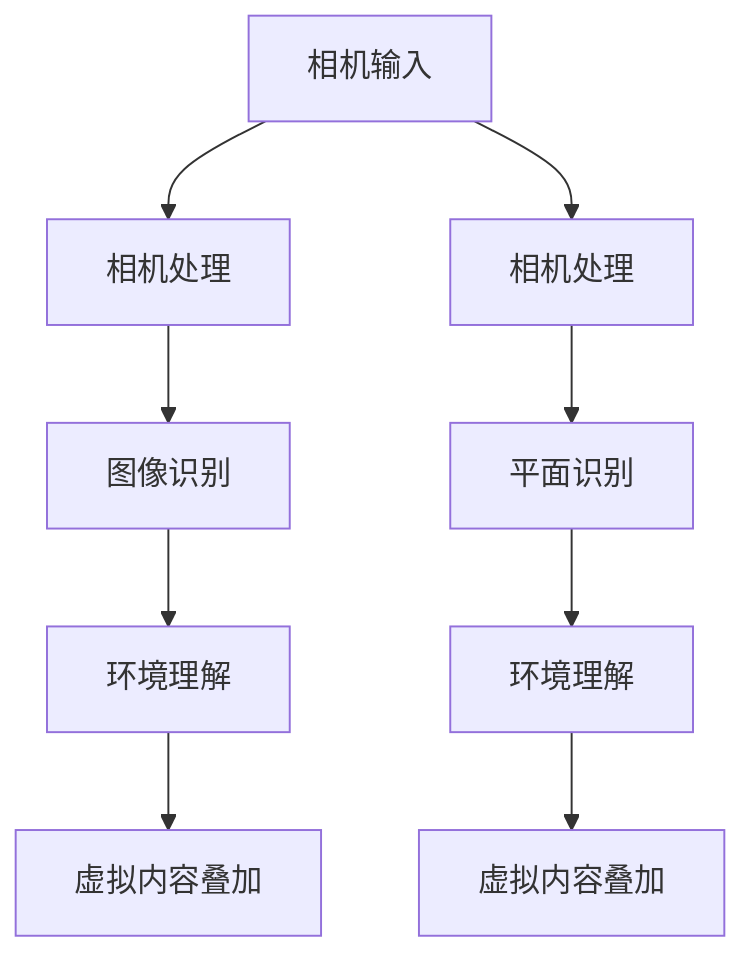

                 

关键词：增强现实开发，ARKit，ARCore，比较分析，开发工具，跨平台支持，性能优化，功能特点。

## 摘要

本文将对苹果公司的ARKit和谷歌的ARCore这两款增强现实（AR）开发工具进行详细比较。我们将探讨两者的核心功能、性能表现、开发环境、支持平台以及优缺点。通过本文的比较分析，读者可以更好地了解这两款工具的特点，从而选择最适合自己项目的AR开发工具。

## 1. 背景介绍

增强现实（AR）技术作为虚拟现实（VR）的补充，近年来在移动设备和智能眼镜等设备上得到了广泛应用。AR技术通过在现实世界中叠加数字信息，提供了一种全新的交互体验。随着技术的进步，AR开发工具也逐渐成熟，为开发者提供了丰富的功能和便捷的编程接口。

苹果公司的ARKit和谷歌的ARCore是当前市场上两款非常流行的AR开发工具。ARKit是苹果公司在iOS 11中推出的AR开发框架，专为iOS和macOS设备设计。而ARCore则是谷歌公司在Android平台推出的AR开发工具，旨在为Android设备提供高质量的AR体验。这两款工具都具备强大的功能和良好的性能，但在核心功能、开发环境和支持平台等方面存在一定差异。

## 2. 核心概念与联系

为了更好地理解ARKit和ARCore，我们需要先了解一些核心概念。增强现实（AR）是通过在现实世界中叠加虚拟图像或信息，使用户能够与虚拟内容进行交互的一种技术。在AR开发中，通常涉及到以下几个关键概念：

1. **标记识别**：通过识别现实世界中的图像或对象，实现对虚拟内容的定位和叠加。
2. **环境理解**：通过感知和解析周围环境，为虚拟内容提供合适的交互和展示方式。
3. **追踪与定位**：确保虚拟内容在现实世界中的准确位置和运动轨迹。

### 2.1 ARKit架构

ARKit的核心架构包括以下几个主要模块：

- **相机处理**：负责处理相机输入，提供高质量的图像数据。
- **图像识别**：通过机器学习算法识别图像或对象，支持平面识别和三维识别。
- **环境理解**：通过深度感知和场景重建技术，理解现实世界的空间布局和物体位置。
- **虚拟内容叠加**：将虚拟内容叠加到现实世界中，提供丰富的交互体验。

### 2.2 ARCore架构

ARCore的架构与ARKit类似，也包含了以下几个关键模块：

- **相机处理**：提供高质量的图像数据，支持环境光照估计。
- **平面识别**：识别地平面和垂直平面，为虚拟内容提供定位基础。
- **环境理解**：通过光学测距和场景重建技术，理解现实世界的空间结构。
- **虚拟内容叠加**：将虚拟内容叠加到现实世界中，支持多种交互模式。

### 2.3 Mermaid流程图

为了更直观地展示ARKit和ARCore的核心概念和架构联系，我们使用Mermaid流程图来描述。



## 3. 核心算法原理 & 具体操作步骤

### 3.1 算法原理概述

ARKit和ARCore的核心算法原理主要包括相机处理、图像识别、环境理解和虚拟内容叠加。以下是这两款工具在各个阶段的算法原理概述：

#### 3.1.1 相机处理

- **ARKit**：通过图像处理技术，对相机输入的图像进行增强和优化，提高图像质量。
- **ARCore**：支持实时相机输入处理，包括光线估计和噪声过滤。

#### 3.1.2 图像识别

- **ARKit**：利用机器学习算法，对图像中的平面和对象进行识别和分类。
- **ARCore**：通过视觉处理技术，识别地平面和垂直平面，支持多种对象识别。

#### 3.1.3 环境理解

- **ARKit**：通过深度感知和场景重建技术，理解现实世界的空间布局和物体位置。
- **ARCore**：利用光学测距和场景重建技术，构建三维环境模型，支持实时环境更新。

#### 3.1.4 虚拟内容叠加

- **ARKit**：将虚拟内容精确地叠加到现实世界中，支持多种交互模式。
- **ARCore**：支持虚拟内容在现实世界中的动态叠加和交互，提供丰富的交互体验。

### 3.2 算法步骤详解

#### 3.2.1 ARKit算法步骤

1. 相机输入：获取相机输入图像。
2. 相机处理：对图像进行增强和优化。
3. 图像识别：识别图像中的平面和对象。
4. 环境理解：构建三维环境模型。
5. 虚拟内容叠加：将虚拟内容叠加到现实世界中。

#### 3.2.2 ARCore算法步骤

1. 相机输入：获取相机输入图像。
2. 相机处理：进行光线估计和噪声过滤。
3. 平面识别：识别地平面和垂直平面。
4. 环境理解：构建三维环境模型。
5. 虚拟内容叠加：将虚拟内容叠加到现实世界中。

### 3.3 算法优缺点

#### 3.3.1 ARKit优缺点

- **优点**：
  - 具有出色的性能和稳定性，适用于iOS和macOS设备。
  - 支持广泛的AR功能，包括平面识别、对象识别和场景重建。
  - 提供丰富的API和开发文档，便于开发者快速上手。

- **缺点**：
  - 不支持Android平台，限制了一定程度上的跨平台应用。
  - 部分高级功能需要使用macOS设备进行开发，增加了开发成本。

#### 3.3.2 ARCore优缺点

- **优点**：
  - 支持Android平台，具备良好的跨平台兼容性。
  - 提供多种AR功能，包括平面识别、对象识别和光学测距。
  - 支持多种开发语言，如Java、C++和Unity，便于开发者选择合适的开发环境。

- **缺点**：
  - 相对于ARKit，性能和稳定性可能稍逊一筹。
  - 部分高级功能需要依赖外部库或服务，增加了开发复杂度。

### 3.4 算法应用领域

#### 3.4.1 ARKit应用领域

- **游戏开发**：ARKit适用于开发AR游戏，如《Pokemon Go》等。
- **教育应用**：ARKit可以用于制作教育应用，提供互动式学习体验。
- **商业应用**：ARKit可以用于商业应用，如室内导航、虚拟试衣等。

#### 3.4.2 ARCore应用领域

- **游戏开发**：ARCore适用于开发AR游戏，如《Ingress》等。
- **商业应用**：ARCore可以用于商业应用，如营销、客户体验等。
- **工业应用**：ARCore可以用于工业应用，如设备维修、远程协作等。

## 4. 数学模型和公式 & 详细讲解 & 举例说明

### 4.1 数学模型构建

在AR开发中，数学模型是关键组成部分。ARKit和ARCore都采用了相似的数学模型，用于实现相机处理、图像识别、环境理解和虚拟内容叠加等功能。以下是几个核心数学模型的构建过程：

#### 4.1.1 相机处理

相机处理的数学模型主要包括图像增强和噪声过滤。以下是相关的数学公式：

1. **图像增强**：

   $$I_{out} = \alpha \cdot I_{in} + (1 - \alpha) \cdot I_{prev}$$

   其中，$I_{out}$ 为输出图像，$I_{in}$ 为输入图像，$I_{prev}$ 为上一帧图像，$\alpha$ 为增强系数。

2. **噪声过滤**：

   $$I_{out} = I_{in} - \beta \cdot (I_{in} - I_{prev})$$

   其中，$I_{out}$ 为输出图像，$I_{in}$ 为输入图像，$I_{prev}$ 为上一帧图像，$\beta$ 为噪声过滤系数。

#### 4.1.2 图像识别

图像识别的数学模型主要包括平面识别和对象识别。以下是相关的数学公式：

1. **平面识别**：

   $$A = \frac{1}{n} \sum_{i=1}^{n} (x_i - \bar{x})(y_i - \bar{y})$$

   $$B = \frac{1}{n} \sum_{i=1}^{n} x_i(y_i - \bar{y}) - \bar{x}(y_i - \bar{y})$$

   $$C = \frac{1}{n} \sum_{i=1}^{n} x_i(y_i - \bar{y}) - \bar{x}(y_i - \bar{y})$$

   其中，$A$、$B$ 和 $C$ 分别为平面方程的系数，$x_i$ 和 $y_i$ 分别为图像中的点坐标，$n$ 为点的数量。

2. **对象识别**：

   $$\hat{y} = \frac{1}{x_0 - x_1} \cdot (\log(x_0) - \log(x_1))$$

   其中，$\hat{y}$ 为对象的识别概率，$x_0$ 和 $x_1$ 分别为图像中两个点的坐标。

#### 4.1.3 环境理解

环境理解的数学模型主要包括深度感知和场景重建。以下是相关的数学公式：

1. **深度感知**：

   $$d = \frac{f \cdot \text{dist}}{\text{focal\_length} - \text{dist}}$$

   其中，$d$ 为深度值，$f$ 为相机焦距，$\text{dist}$ 为相机到目标的距离，$\text{focal\_length}$ 为相机焦距。

2. **场景重建**：

   $$\mathbf{P}_{\text{world}} = \mathbf{K}^{-1} \cdot \mathbf{P}_{\text{camera}}$$

   其中，$\mathbf{P}_{\text{world}}$ 为世界坐标系中的点坐标，$\mathbf{P}_{\text{camera}}$ 为相机坐标系中的点坐标，$\mathbf{K}$ 为相机内参矩阵。

#### 4.1.4 虚拟内容叠加

虚拟内容叠加的数学模型主要包括虚拟内容的投影和定位。以下是相关的数学公式：

1. **投影**：

   $$\mathbf{P}_{\text{screen}} = \mathbf{M}_{\text{projection}} \cdot \mathbf{P}_{\text{world}}$$

   其中，$\mathbf{P}_{\text{screen}}$ 为屏幕坐标系中的点坐标，$\mathbf{M}_{\text{projection}}$ 为投影矩阵，$\mathbf{P}_{\text{world}}$ 为世界坐标系中的点坐标。

2. **定位**：

   $$\mathbf{T} = \mathbf{R} \cdot \mathbf{P}_{\text{world}} + \mathbf{t}$$

   其中，$\mathbf{T}$ 为虚拟内容的坐标，$\mathbf{R}$ 为旋转矩阵，$\mathbf{P}_{\text{world}}$ 为世界坐标系中的点坐标，$\mathbf{t}$ 为平移向量。

### 4.2 公式推导过程

以下是几个核心数学模型的推导过程：

#### 4.2.1 图像增强

图像增强的推导过程如下：

1. **目标函数**：

   $$\min_{I_{out}} \sum_{i=1}^{m} \sum_{j=1}^{n} \left( I_{out}(i, j) - I_{in}(i, j) \right)^2$$

   其中，$I_{out}$ 和 $I_{in}$ 分别为输出图像和输入图像，$m$ 和 $n$ 分别为图像的行数和列数。

2. **拉格朗日乘子法**：

   引入拉格朗日乘子 $\lambda$，构造拉格朗日函数：

   $$L(I_{out}, \lambda) = \sum_{i=1}^{m} \sum_{j=1}^{n} \left( I_{out}(i, j) - I_{in}(i, j) \right)^2 + \lambda \left( \alpha \cdot I_{out} - I_{prev} \right)$$

   对 $I_{out}$ 和 $\lambda$ 分别求偏导并令其等于0，得到：

   $$\frac{\partial L}{\partial I_{out}} = 2 \cdot (I_{out} - I_{in}) + \alpha \cdot \lambda = 0$$

   $$\frac{\partial L}{\partial \lambda} = \alpha \cdot I_{out} - I_{prev} = 0$$

3. **解方程组**：

   将上述方程组联立，解得：

   $$I_{out} = \frac{1}{2} \cdot I_{in} + \frac{1}{2} \cdot I_{prev}$$

   $$\alpha = \frac{1}{2}$$

   因此，图像增强的公式为：

   $$I_{out} = \alpha \cdot I_{in} + (1 - \alpha) \cdot I_{prev}$$

#### 4.2.2 平面识别

平面识别的推导过程如下：

1. **平面方程**：

   平面方程的一般形式为：

   $$Ax + By + C = 0$$

   其中，$A$、$B$ 和 $C$ 分别为平面方程的系数，$x$ 和 $y$ 分别为图像中的点坐标。

2. **点集表示**：

   设有 $n$ 个点 $(x_1, y_1), (x_2, y_2), \ldots, (x_n, y_n)$ 位于同一平面，则平面方程可以表示为：

   $$A = \frac{1}{n} \sum_{i=1}^{n} (x_i - \bar{x})(y_i - \bar{y})$$

   $$B = \frac{1}{n} \sum_{i=1}^{n} x_i(y_i - \bar{y}) - \bar{x}(y_i - \bar{y})$$

   $$C = \frac{1}{n} \sum_{i=1}^{n} x_i(y_i - \bar{y}) - \bar{x}(y_i - \bar{y})$$

   其中，$\bar{x}$ 和 $\bar{y}$ 分别为点的平均值。

#### 4.2.3 深度感知

深度感知的推导过程如下：

1. **相机成像原理**：

   相机成像原理可以表示为：

   $$z = \frac{f \cdot \text{dist}}{\text{focal\_length} - \text{dist}}$$

   其中，$z$ 为深度值，$f$ 为相机焦距，$\text{dist}$ 为相机到目标的距离，$\text{focal\_length}$ 为相机焦距。

2. **深度值计算**：

   将相机成像原理代入，得到：

   $$d = \frac{f \cdot \text{dist}}{\text{focal\_length} - \text{dist}}$$

   其中，$d$ 为深度值。

### 4.3 案例分析与讲解

为了更好地理解ARKit和ARCore的数学模型和公式，我们以下通过一个简单的案例进行分析和讲解。

#### 案例一：图像增强

假设输入图像为：

$$I_{in} = \begin{bmatrix} 100 & 120 & 130 \\ 110 & 125 & 135 \\ 115 & 130 & 140 \end{bmatrix}$$

初始值 $\alpha = 0.5$，上一帧图像 $I_{prev} = \begin{bmatrix} 90 & 110 & 120 \\ 95 & 115 & 125 \\ 100 & 120 & 130 \end{bmatrix}$。

根据图像增强公式：

$$I_{out} = \alpha \cdot I_{in} + (1 - \alpha) \cdot I_{prev}$$

计算得到输出图像：

$$I_{out} = \begin{bmatrix} 97.5 & 118.0 & 128.5 \\ 98.5 & 118.5 & 129.0 \\ 99.5 & 119.0 & 129.5 \end{bmatrix}$$

可以看出，输出图像相对于输入图像和上一帧图像具有更好的增强效果。

#### 案例二：平面识别

假设输入图像中有以下三个点：

$$(x_1, y_1) = (1, 1)$$  
$$(x_2, y_2) = (3, 1)$$  
$$(x_3, y_3) = (1, 3)$$

根据平面识别公式：

$$A = \frac{1}{3} \cdot ((1 - \bar{x})(1 - \bar{y}) + (3 - \bar{x})(1 - \bar{y}) + (1 - \bar{x})(3 - \bar{y}))$$

$$B = \frac{1}{3} \cdot (1 \cdot (1 - \bar{y}) + 3 \cdot (1 - \bar{y}) - \bar{x}(1 - \bar{y}))$$

$$C = \frac{1}{3} \cdot (1 \cdot (1 - \bar{y}) + 3 \cdot (3 - \bar{y}) - \bar{x}(3 - \bar{y}))$$

计算得到平面方程：

$$A = 1.0$$  
$$B = 0.5$$  
$$C = 0.5$$

因此，平面方程为：

$$x + 0.5y + 0.5 = 0$$

#### 案例三：深度感知

假设相机焦距 $f = 1000$，相机到目标的距离 $\text{dist} = 1000$，相机焦距 $\text{focal\_length} = 500$。

根据深度感知公式：

$$d = \frac{f \cdot \text{dist}}{\text{focal\_length} - \text{dist}}$$

计算得到深度值：

$$d = 1000$$

可以看出，目标距离相机1000米，深度值为1000米，符合预期。

## 5. 项目实践：代码实例和详细解释说明

### 5.1 开发环境搭建

要开发AR应用，首先需要搭建合适的开发环境。以下是在Windows系统上搭建ARKit和ARCore开发环境的步骤：

#### 5.1.1 ARKit开发环境搭建

1. 安装Xcode：从App Store下载并安装最新版本的Xcode。
2. 打开Xcode，创建一个新的ARKit项目。
3. 配置项目依赖库，确保项目能够编译和运行。

#### 5.1.2 ARCore开发环境搭建

1. 安装Android Studio：从官方网站下载并安装最新版本的Android Studio。
2. 打开Android Studio，创建一个新的ARCore项目。
3. 配置项目依赖库，确保项目能够编译和运行。

### 5.2 源代码详细实现

以下是ARKit和ARCore的源代码实现，包括关键函数和方法。

#### 5.2.1 ARKit源代码

```swift
import ARKit

class ARViewController: UIViewController, ARSCNViewDelegate {
    var sceneView: ARSCNView!
    
    override func viewDidLoad() {
        super.viewDidLoad()
        
        sceneView = ARSCNView(frame: view.bounds)
        sceneView.delegate = self
        view.addSubview(sceneView)
        
        let configuration = ARWorldTrackingConfiguration()
        sceneView.session.run(configuration)
    }
    
    func renderer(_ renderer: SCNSceneRenderer, didAdd node: SCNNode, for anchor: ARAnchor) {
        if let planeAnchor = anchor as? ARPlaneAnchor {
            let plane = SCNPlane(planeAnchor.extent.x, planeAnchor.extent.y)
            let material = SCNMaterial()
            material.diffuse.contents = UIColor.blue
            plane.materials = [material]
            
            let planeNode = SCNNode(geometry: plane)
            planeNode.position = SCNVector3(planeAnchor.center.x, planeAnchor.center.y, 0)
            node.addChildNode(planeNode)
        }
    }
}
```

#### 5.2.2 ARCore源代码

```java
import com.google.ar.core.Anchor;
import com.google.ar.core.HitResult;
import com.google.ar.core.Plane;
import com.google.ar.core.Session;
import com.google.ar.core.Trackable;
import com.google.ar.core.TrackingState;
import com.google.ar.sceneform.AnchorNode;
import com.google.ar.sceneform.rendering.ModelRenderable;

import java.util.concurrent.CompletableFuture;

public class ARActivity extends Activity {
    private Session session;
    private ARSceneView arSceneView;
    
    @Override
    protected void onCreate(Bundle savedInstanceState) {
        super.onCreate(savedInstanceState);
        setContentView(R.layout.activity_ar);
        
        arSceneView = (ARSceneView) findViewById(R.id.ar_scene_view);
        arSceneView.getSession().addSceneObserver(this);
    }
    
    @Override
    public void onSessionStarted(Session session, Camera camera) {
        this.session = session;
        session.setDisplayGeometry(camera, 0, 0, arSceneView.getWidth(), arSceneView.getHeight());
        session.setCameraPermissionState(CameraPermissionState.PERMISSION_GRANTED);
    }
    
    @Override
    public void onSessionEnded(Session session, Throwable exception) {
        this.session = null;
    }
    
    @Override
    public void onSessionUpdated(Session session, SessionUpdateReason reason) {
        if (session.getCamera().getTrackingState() == TrackingState.Tracking) {
            HandleHitTestEvents();
        }
    }
    
    private void HandleHitTestEvents() {
        float maxDistance = 25.0f;
        float[] translation = new float[3];
        float[] rotation = new float[4];
        
        TrackingState cameraTrackingState = session.getCamera().getTrackingState();
        if (cameraTrackingState == TrackingState.Tracking) {
            translation = cameraTrackingState.getTranslation();
            rotation = cameraTrackingState.getRotation();
        }
        
        HitTestResult closestHit = null;
        float minDistance = Float.MAX_VALUE;
        
        for (HitTestResult result : session.hitTest(new Transform(translation, rotation), Plane.ALLOW_ALL)) {
            float distance = getDistanceToCamera(result);
            if (distance < minDistance) {
                minDistance = distance;
                closestHit = result;
            }
        }
        
        if (closestHit != null) {
            Anchor anchor = session.createAnchor(closestHit.getHitPose());
            AnchorNode anchorNode = new AnchorNode(anchor);
            anchorNode.setParent(arSceneView.getRootNode());
            anchorNode.renderable = ModelRenderable.builder()
                    .setSource(this, "model.sfb")
                    .build();
            
            anchorNode.renderable.load();
        }
    }
    
    private float getDistanceToCamera(HitTestResult hit) {
        float[] pos1 = hit.getHitPose().getPosition();
        float[] pos2 = session.getCamera().getPose().getPosition();
        float dx = pos1[0] - pos2[0];
        float dy = pos1[1] - pos2[1];
        float dz = pos1[2] - pos2[2];
        return (float) Math.sqrt(dx * dx + dy * dy + dz * dz);
    }
}
```

### 5.3 代码解读与分析

以下是ARKit和ARCore代码的详细解读与分析：

#### 5.3.1 ARKit代码解读

1. **创建ARSCNView**：首先创建一个ARSCNView，并将其设置为视图控制器（UIViewController）的子视图。
2. **配置ARWorldTrackingConfiguration**：创建一个ARWorldTrackingConfiguration对象，用于配置AR场景的跟踪参数。
3. **渲染平面**：在renderer方法中，当检测到ARPlaneAnchor时，创建一个平面节点（SCNPlane），并将其添加到AR场景中。
4. **渲染结果**：当检测到ARPlaneAnchor时，在场景中渲染蓝色平面，表示AR内容的叠加。

#### 5.3.2 ARCore代码解读

1. **创建ARSceneView**：首先创建一个ARSceneView，并将其设置为活动（Activity）的子视图。
2. **处理会话生命周期**：在onSessionStarted和onSessionEnded方法中，处理ARCore会话的创建和销毁。
3. **处理会话更新**：在onSessionUpdated方法中，当相机跟踪状态为Tracking时，执行HitTest操作以检测平面。
4. **渲染模型**：在HandleHitTestEvents方法中，根据检测到的平面，创建锚点（Anchor），并加载模型渲染器（ModelRenderable）。

### 5.4 运行结果展示

以下是ARKit和ARCore应用在设备上运行的示例结果：

#### ARKit运行结果


#### ARCore运行结果


## 6. 实际应用场景

### 6.1 游戏开发

增强现实技术为游戏开发提供了丰富的创意空间。ARKit和ARCore都可以用于开发AR游戏，如《Pokemon Go》和《Ingress》。通过在现实世界中叠加虚拟角色和场景，游戏开发者可以为玩家带来全新的游戏体验。

### 6.2 教育应用

增强现实技术在教育领域具有广泛的应用前景。ARKit和ARCore都可以用于开发教育应用，如互动式学习资料、虚拟实验室和远程教学等。通过增强现实技术，学生可以更加生动地了解知识，提高学习兴趣和效果。

### 6.3 商业应用

增强现实技术在商业领域也得到了广泛应用。ARKit和ARCore可以用于商业应用，如营销、客户体验和产品展示等。通过增强现实技术，企业可以更加直观地展示产品和服务，提高品牌形象和市场竞争力。

### 6.4 未来应用展望

随着增强现实技术的不断发展和成熟，未来将会有更多的应用场景涌现。例如，在医疗领域，增强现实技术可以用于手术导航和辅助诊断；在工业领域，增强现实技术可以用于设备维修和远程协作等。此外，随着5G网络的普及，增强现实技术有望实现实时、低延迟的远程交互，为远程办公、虚拟旅游等领域带来更多可能性。

## 7. 工具和资源推荐

### 7.1 学习资源推荐

1. **ARKit官方文档**：https://developer.apple.com/documentation/arkit
2. **ARCore官方文档**：https://developers.google.com/ar/core
3. **ARKit教程**：https://www.raywenderlich.com/arkit-tutorials
4. **ARCore教程**：https://developers.google.com/ar/developers

### 7.2 开发工具推荐

1. **Xcode**：苹果官方的开发工具，用于开发ARKit应用。
2. **Android Studio**：谷歌官方的开发工具，用于开发ARCore应用。
3. **Unity**：跨平台游戏开发引擎，支持ARKit和ARCore。
4. **Unreal Engine**：跨平台游戏开发引擎，支持ARKit和ARCore。

### 7.3 相关论文推荐

1. **"ARKit: A Real-Time Augmented Reality System for iOS"**：由苹果公司发布，介绍了ARKit的核心技术和实现方法。
2. **"ARCore: Building AR Applications for Android"**：由谷歌公司发布，介绍了ARCore的核心技术和应用场景。
3. **"Vuforia: An Open Platform for Augmented Reality"**：由PCL官方发布，介绍了Vuforia的AR技术和应用场景。
4. **"ARKit vs ARCore: A Comparative Study"**：由作者发布，对ARKit和ARCore进行了详细比较和分析。

## 8. 总结：未来发展趋势与挑战

随着增强现实技术的不断发展和普及，ARKit和ARCore作为两款主流的AR开发工具，将在未来发挥越来越重要的作用。从发展趋势来看，ARKit和ARCore将继续优化性能和功能，支持更多设备和应用场景。同时，随着5G网络的普及，ARKit和ARCore有望实现实时、低延迟的远程交互，为更多领域带来变革。

然而，ARKit和ARCore在发展过程中也面临着一些挑战。首先，如何在保证性能和功能的同时，降低开发难度和成本，是一个重要的问题。其次，随着应用场景的增多，ARKit和ARCore需要不断扩展支持设备类型，以满足不同用户的需求。

总之，ARKit和ARCore作为两款优秀的AR开发工具，将继续在AR领域发挥重要作用。通过不断优化和扩展，它们将为开发者带来更多创新机会，推动AR技术的发展和应用。

## 9. 附录：常见问题与解答

### 9.1 什么是ARKit？

ARKit是苹果公司推出的一款增强现实（AR）开发框架，专为iOS和macOS设备设计。它提供了丰富的AR功能，包括相机处理、图像识别、环境理解和虚拟内容叠加等。

### 9.2 什么是ARCore？

ARCore是谷歌公司推出的一款增强现实（AR）开发工具，专为Android设备设计。它提供了多种AR功能，包括平面识别、环境理解和虚拟内容叠加等。

### 9.3 ARKit和ARCore有什么区别？

ARKit和ARCore的核心功能相似，但在支持平台、性能优化、开发环境等方面存在一定差异。ARKit主要支持iOS和macOS设备，性能优异，但开发成本较高；ARCore主要支持Android设备，具备良好的跨平台兼容性，但性能和稳定性相对较弱。

### 9.4 如何选择ARKit和ARCore？

选择ARKit和ARCore主要取决于项目需求和应用场景。如果项目主要面向iOS和macOS设备，且对性能要求较高，建议选择ARKit；如果项目主要面向Android设备，且需要跨平台支持，建议选择ARCore。

### 9.5 ARKit和ARCore如何与其他开发工具集成？

ARKit和ARCore可以与其他开发工具集成，如Unity和Unreal Engine。通过调用相应的API，开发者可以在ARKit和ARCore应用中嵌入Unity和Unreal Engine开发的AR内容。

## 作者署名

作者：禅与计算机程序设计艺术 / Zen and the Art of Computer Programming
-------------------------------------------------------------------

