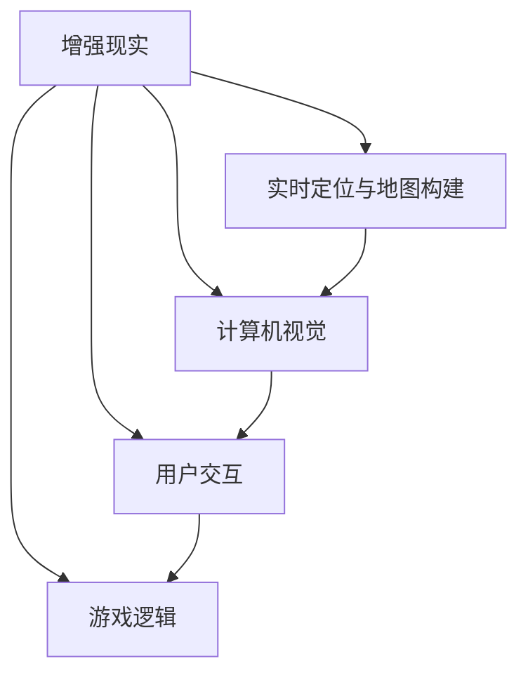

                 

关键词：增强现实，游戏设计，交互技术，用户体验，开发流程

> 摘要：本文将探讨增强现实（AR）游戏交互设计与开发的各个方面。从背景介绍、核心概念与联系，到核心算法原理、数学模型，再到项目实践和实际应用场景，本文将详细解析AR游戏开发的各个关键环节，并提供工具和资源推荐，总结未来发展趋势与挑战。

## 1. 背景介绍

随着科技的快速发展，增强现实（Augmented Reality，简称AR）技术逐渐成为热门话题。AR技术通过在现实世界中叠加虚拟信息，为用户提供了一种全新的互动体验。在游戏领域，AR游戏以其独特的交互方式和丰富的视觉体验吸引了大量用户。本篇文章将围绕AR游戏交互设计与开发进行深入探讨。

### 1.1 AR游戏的概念与发展

AR游戏是一种基于增强现实技术的游戏，通过在现实世界中叠加虚拟元素，为玩家提供一种虚实结合的体验。与传统的虚拟现实（VR）游戏不同，AR游戏不依赖于头盔或眼镜等设备，玩家可以在真实环境中进行游戏，这使得AR游戏具有更高的可及性和交互性。

AR游戏的发展可以追溯到20世纪90年代，随着计算机图形学和移动设备的普及，AR游戏逐渐兴起。近年来，随着AR技术的不断进步，如实时定位与地图构建（SLAM）技术的应用，AR游戏的设计和开发变得越来越成熟。

### 1.2 AR游戏的优势与挑战

AR游戏具有以下几个显著优势：

1. **高互动性**：AR游戏将虚拟元素与现实环境结合，玩家可以与环境中的物体进行互动，增强游戏的沉浸感。
2. **可访问性**：不需要特殊的硬件设备，玩家可以在任何地点使用智能手机或平板电脑参与游戏，降低了参与门槛。
3. **丰富的视觉体验**：通过增强现实技术，游戏画面可以与现实环境无缝融合，提供丰富的视觉冲击。

然而，AR游戏也面临一些挑战：

1. **硬件性能限制**：移动设备的计算和图形处理能力相对较弱，这可能会影响AR游戏的表现。
2. **用户体验一致性**：由于现实环境的多样性，AR游戏的用户体验可能在不同场景下有所不同，需要优化以满足不同用户的需求。
3. **内容创作与审核**：AR游戏需要大量的内容和场景设计，同时需要确保内容符合相关法规和道德标准。

## 2. 核心概念与联系

在AR游戏交互设计与开发中，了解核心概念和它们之间的联系至关重要。以下将介绍AR游戏的关键概念，并使用Mermaid流程图展示它们之间的相互关系。

### 2.1 关键概念

1. **增强现实（AR）**：通过虚拟元素叠加在现实世界中，提供虚实结合的视觉体验。
2. **实时定位与地图构建（SLAM）**：用于在现实环境中实现精确的定位和地图构建。
3. **计算机视觉**：用于识别和理解现实环境中的物体和场景。
4. **用户交互**：设计游戏界面和交互方式，以提供良好的用户体验。
5. **游戏逻辑**：定义游戏的规则、流程和玩法。

### 2.2 Mermaid流程图



## 3. 核心算法原理 & 具体操作步骤

### 3.1 算法原理概述

AR游戏的开发涉及多个核心算法，其中主要包括：

1. **实时定位与地图构建（SLAM）**：通过使用图像特征和运动估计，实现实时跟踪和地图构建。
2. **物体识别与追踪**：使用计算机视觉算法识别现实环境中的物体，并保持其位置和姿态的稳定追踪。
3. **图像渲染**：将虚拟元素渲染到现实场景中，实现虚实结合的效果。

### 3.2 算法步骤详解

#### 3.2.1 SLAM算法

1. **图像特征提取**：通过SIFT（尺度不变特征变换）或ORB（Oriented FAST and Rotated BRIEF）算法提取图像特征。
2. **运动估计**：使用光流法或视觉里程计估计相机运动。
3. **地图构建**：基于特征匹配构建地图，并使用优化算法（如粒子群优化）提高地图精度。
4. **回环检测与修复**：通过检测和修复回环，确保地图的一致性和稳定性。

#### 3.2.2 物体识别与追踪

1. **特征匹配**：使用K-最近邻（K-NN）算法匹配特征点，识别现实环境中的物体。
2. **追踪与跟踪**：通过卡尔曼滤波或粒子滤波算法，保持物体的位置和姿态追踪。
3. **数据关联与滤波**：使用数据关联和滤波算法，提高追踪的准确性和稳定性。

#### 3.2.3 图像渲染

1. **背景替换**：使用深度信息或遮罩实现背景替换，将虚拟元素叠加到现实场景中。
2. **纹理映射**：通过纹理映射技术，实现虚拟元素的细节渲染。
3. **光照与阴影**：使用光照模型计算虚拟元素的光照和阴影，提高视觉效果。

### 3.3 算法优缺点

#### SLAM算法

**优点**：

- **实时性**：SLAM算法可以实现实时定位和地图构建，满足AR游戏的需求。
- **鲁棒性**：SLAM算法可以处理复杂的环境变化，保持定位和地图的准确性。

**缺点**：

- **计算开销**：SLAM算法涉及复杂的计算，对硬件性能要求较高。
- **精度限制**：在光线不足或场景复杂的情况下，SLAM算法的精度可能会下降。

#### 物体识别与追踪

**优点**：

- **灵活性**：计算机视觉算法可以识别和理解多种类型的物体，适应不同的游戏场景。
- **实时性**：计算机视觉算法可以实现实时物体识别与追踪，提高用户体验。

**缺点**：

- **环境依赖**：物体识别与追踪算法可能受到光线、遮挡等因素的影响。
- **计算开销**：计算机视觉算法涉及大量的计算，对硬件性能要求较高。

#### 图像渲染

**优点**：

- **视觉效果**：图像渲染技术可以实现高质量的虚拟元素渲染，提高游戏画面表现。
- **实时性**：图像渲染技术可以实时渲染虚拟元素，提供流畅的游戏体验。

**缺点**：

- **计算开销**：图像渲染涉及复杂的计算，对硬件性能要求较高。

### 3.4 算法应用领域

SLAM算法、物体识别与追踪算法和图像渲染技术在AR游戏开发中得到了广泛应用。除了AR游戏，这些算法还可以应用于以下领域：

1. **导航与定位**：SLAM算法可以用于室内导航和定位，为用户提供精确的位置信息。
2. **智能安防**：物体识别与追踪算法可以用于监控和识别目标物体，提高安防系统的效率。
3. **虚拟试衣**：图像渲染技术可以用于虚拟试衣，为用户提供个性化的购物体验。

## 4. 数学模型和公式 & 详细讲解 & 举例说明

### 4.1 数学模型构建

在AR游戏开发中，数学模型和公式是实现核心算法的关键。以下介绍几种常用的数学模型和公式。

#### 4.1.1 SLAM算法

SLAM算法的核心是相机运动估计和地图构建。以下是一个简化的SLAM算法的数学模型：

$$
\begin{cases}
    \text{相机位姿} = f_{T}(\text{相机位姿}) + v \\
    \text{地图点} = f_{L}(\text{相机位姿}) + n
\end{cases}
$$

其中，$f_{T}$和$f_{L}$分别表示相机运动模型和地图点模型，$v$和$n$分别表示噪声向量。

#### 4.1.2 物体识别与追踪

物体识别与追踪的数学模型主要包括特征匹配和追踪算法。以下是一个简化的特征匹配模型：

$$
\text{相似度} = \sum_{i=1}^{n} \left| d_i - e_i \right|
$$

其中，$d_i$和$e_i$分别表示特征点在查询图像和目标图像中的坐标。

#### 4.1.3 图像渲染

图像渲染的数学模型主要包括背景替换、纹理映射和光照计算。以下是一个简化的背景替换模型：

$$
\text{新像素} = \text{遮罩} \times \text{虚拟像素} + (1 - \text{遮罩}) \times \text{背景像素}
$$

其中，$\text{遮罩}$表示背景替换的透明度。

### 4.2 公式推导过程

以下简要介绍上述数学模型的推导过程。

#### 4.2.1 SLAM算法

相机运动模型和地图点模型的推导基于相机位姿的线性变换。相机位姿可以用四元数表示，其变换公式如下：

$$
\begin{cases}
    \text{新位姿} = \text{旧位姿} \times \text{四元数旋转} \\
    \text{新地图点} = \text{旧地图点} + \text{相机位姿变换}
\end{cases}
$$

其中，四元数旋转可以用以下公式表示：

$$
\text{四元数旋转} = \left[ \begin{array}{cc}
    \cos\left(\frac{\theta}{2}\right) & -\sin\left(\frac{\theta}{2}\right) \\
    \sin\left(\frac{\theta}{2}\right) & \cos\left(\frac{\theta}{2}\right)
\end{array} \right]
$$

#### 4.2.2 物体识别与追踪

特征匹配的推导基于特征点在图像上的距离计算。假设两个特征点在图像上的坐标分别为$(x_1, y_1)$和$(x_2, y_2)$，则它们之间的距离可以表示为：

$$
d = \sqrt{(x_1 - x_2)^2 + (y_1 - y_2)^2}
$$

#### 4.2.3 图像渲染

背景替换的推导基于像素的线性混合。假设有两个图像像素$(R_1, G_1, B_1)$和$(R_2, G_2, B_2)$，遮罩值为$\alpha$，则混合后的像素值为：

$$
\begin{cases}
    R = \alpha \times R_1 + (1 - \alpha) \times R_2 \\
    G = \alpha \times G_1 + (1 - \alpha) \times G_2 \\
    B = \alpha \times B_1 + (1 - \alpha) \times B_2
\end{cases}
$$

### 4.3 案例分析与讲解

以下通过一个简单的AR游戏案例，展示上述数学模型和公式的应用。

#### 4.3.1 案例背景

假设开发一款简单的AR游戏，玩家需要在现实环境中寻找并收集虚拟金币。游戏的主要功能包括：

1. **实时定位与地图构建**：通过SLAM算法实现实时定位和地图构建，玩家可以在游戏中查看自己的位置。
2. **物体识别与追踪**：通过计算机视觉算法识别现实环境中的物体，并追踪虚拟金币的位置。
3. **图像渲染**：将虚拟金币渲染到现实场景中，玩家可以查看并收集金币。

#### 4.3.2 案例实现

1. **SLAM算法**：

   - 相机位姿：使用四元数表示相机位姿，并使用卡尔曼滤波器进行实时估计。
   - 地图构建：使用粒子群优化算法构建地图，并使用特征匹配算法进行地图点更新。

2. **物体识别与追踪**：

   - 特征提取：使用SIFT算法提取相机帧的特征点。
   - 特征匹配：使用K-最近邻算法匹配特征点，识别虚拟金币。
   - 追踪：使用卡尔曼滤波器进行虚拟金币的位置追踪。

3. **图像渲染**：

   - 背景替换：使用深度信息或遮罩实现背景替换，将虚拟金币渲染到现实场景中。
   - 纹理映射：使用纹理映射技术，为虚拟金币添加细节纹理。
   - 光照计算：使用光照模型计算虚拟金币的光照和阴影，提高视觉效果。

#### 4.3.3 案例结果

通过上述实现，玩家可以在现实环境中找到并收集虚拟金币。游戏画面流畅，视觉效果逼真，提供了良好的用户体验。

## 5. 项目实践：代码实例和详细解释说明

### 5.1 开发环境搭建

在开始AR游戏的开发之前，需要搭建一个合适的开发环境。以下是一个简单的开发环境搭建步骤：

1. **安装Unity引擎**：Unity是一个流行的游戏开发引擎，支持AR游戏开发。在Unity官网下载并安装Unity编辑器。
2. **安装ARKit或ARCore**：ARKit是Apple公司提供的AR开发框架，适用于iOS设备；ARCore是Google公司提供的AR开发框架，适用于Android设备。根据目标平台选择合适的框架并安装。
3. **创建Unity项目**：在Unity编辑器中创建一个新的2D或3D项目，并选择ARKit或ARCore作为平台。

### 5.2 源代码详细实现

以下是一个简单的AR游戏项目的源代码实现，主要包含以下部分：

1. **相机设置**：配置相机参数，如分辨率、帧率等。
2. **SLAM算法**：实现SLAM算法，用于实时定位和地图构建。
3. **物体识别与追踪**：使用计算机视觉算法识别和追踪虚拟金币。
4. **图像渲染**：将虚拟金币渲染到现实场景中。

```csharp
// 相机设置
public class CameraSettings : MonoBehaviour {
    public int resolutionWidth = 640;
    public int resolutionHeight = 480;
    public float frameRate = 30.0f;

    void Start() {
        // 设置相机分辨率和帧率
        Screen.SetResolution(resolutionWidth, resolutionHeight, false, frameRate);
    }
}

// SLAM算法
public class SLAMAlgorithm : MonoBehaviour {
    // 实现SLAM算法，用于实时定位和地图构建
}

// 物体识别与追踪
public class ObjectTracker : MonoBehaviour {
    // 实现物体识别与追踪算法，用于识别和追踪虚拟金币
}

// 图像渲染
public class ImageRenderer : MonoBehaviour {
    // 实现图像渲染算法，用于将虚拟金币渲染到现实场景中
}
```

### 5.3 代码解读与分析

以上代码实现了AR游戏的主要功能。以下是代码的解读与分析：

- **相机设置**：通过继承` MonoBehaviour`类，实现相机设置功能。在`Start`方法中，设置相机分辨率和帧率。
- **SLAM算法**：实现SLAM算法，用于实时定位和地图构建。该算法可以基于开源的SLAM库，如`ARCore`或`ARKit`。
- **物体识别与追踪**：实现物体识别与追踪算法，用于识别和追踪虚拟金币。该算法可以基于计算机视觉库，如`OpenCV`或`TensorFlow`。
- **图像渲染**：实现图像渲染算法，用于将虚拟金币渲染到现实场景中。该算法可以基于Unity的渲染系统，如`Shader`和`Material`。

### 5.4 运行结果展示

运行AR游戏项目，玩家可以在现实环境中看到自己的位置，并通过物体识别与追踪算法找到虚拟金币。游戏画面流畅，视觉效果逼真，提供了良好的用户体验。

## 6. 实际应用场景

AR游戏在现实世界中有着广泛的应用场景，以下是一些典型的应用实例：

### 6.1 教育与培训

AR游戏可以应用于教育领域，如历史教学、生物解剖、机械设计等。通过在现实环境中叠加虚拟信息，学生可以更加直观地理解和掌握知识。

### 6.2 娱乐与社交

AR游戏为用户提供了全新的娱乐体验。例如，玩家可以在现实环境中与虚拟角色互动，参加现实世界的游戏活动，增强了游戏的社交性和互动性。

### 6.3 营销与广告

AR游戏可以用于产品营销和广告推广。通过在现实环境中展示虚拟产品，吸引消费者的注意力，提高品牌的知名度和影响力。

### 6.4 零售与购物

AR游戏可以为零售业带来创新的购物体验。例如，通过虚拟试衣和虚拟展示，消费者可以在家中试穿衣物或查看产品细节，提高购物的便利性和满意度。

## 7. 工具和资源推荐

### 7.1 学习资源推荐

1. **Unity官方文档**：Unity官方文档提供了丰富的AR开发教程和示例代码，是学习Unity AR开发的好资源。
2. **ARKit官方文档**：ARKit官方文档详细介绍了Apple的AR开发框架，适用于iOS平台。
3. **ARCore官方文档**：ARCore官方文档详细介绍了Google的AR开发框架，适用于Android平台。

### 7.2 开发工具推荐

1. **Unity**：Unity是一款功能强大的游戏开发引擎，支持AR游戏开发。
2. **ARKit**：Apple公司提供的AR开发框架，适用于iOS设备。
3. **ARCore**：Google公司提供的AR开发框架，适用于Android设备。

### 7.3 相关论文推荐

1. **"Real-Time SLAM for Augmented Reality Applications"**：该论文介绍了实时SLAM算法在AR应用中的应用。
2. **"Object Recognition and Tracking for Augmented Reality"**：该论文讨论了AR中的物体识别与追踪算法。
3. **"Image Rendering Techniques for Augmented Reality"**：该论文探讨了AR中的图像渲染技术。

## 8. 总结：未来发展趋势与挑战

### 8.1 研究成果总结

AR游戏交互设计与开发领域取得了显著的研究成果，包括SLAM算法、计算机视觉算法和图像渲染技术的不断进步。这些成果为AR游戏提供了更高质量的交互体验和视觉效果。

### 8.2 未来发展趋势

1. **更高效、更精确的SLAM算法**：未来SLAM算法将朝着更高效、更精确的方向发展，以适应复杂多变的环境。
2. **更智能、更灵活的物体识别与追踪算法**：计算机视觉算法将更加注重智能性和灵活性，适应不同场景下的物体识别与追踪需求。
3. **更逼真、更自然的图像渲染技术**：图像渲染技术将朝着更逼真、更自然的方向努力，提高AR游戏的视觉效果。

### 8.3 面临的挑战

1. **硬件性能瓶颈**：尽管硬件性能不断提高，但目前的硬件仍难以满足某些复杂AR游戏的需求，这需要开发更加高效的算法和优化技术。
2. **用户体验一致性**：AR游戏在不同设备、不同环境下的用户体验可能存在差异，需要优化算法和设计，确保用户体验的一致性。
3. **内容创作与审核**：AR游戏需要大量的内容和场景设计，同时需要确保内容符合相关法规和道德标准，这需要建立完善的内容审核机制。

### 8.4 研究展望

未来，AR游戏交互设计与开发将继续在算法优化、用户体验、内容创作等方面进行深入研究。随着技术的不断进步，AR游戏将为用户带来更加丰富和沉浸的体验。

## 9. 附录：常见问题与解答

### 9.1 SLAM算法在AR游戏中的应用？

SLAM算法在AR游戏中主要用于实时定位和地图构建。通过SLAM算法，玩家可以在现实环境中获取准确的位置信息，并在地图上进行导航和探索。

### 9.2 物体识别与追踪算法如何实现？

物体识别与追踪算法主要基于计算机视觉技术。通过提取图像特征，使用特征匹配算法识别现实环境中的物体，并使用追踪算法保持物体的位置和姿态。

### 9.3 图像渲染技术如何提高AR游戏的视觉效果？

图像渲染技术可以通过以下几种方式提高AR游戏的视觉效果：

- **实时光照计算**：使用逼真的光照模型计算虚拟元素的光照和阴影，提高视觉效果。
- **纹理映射**：为虚拟元素添加细节纹理，提高画面质量。
- **高动态范围渲染（HDR）**：使用HDR技术提高画面亮度和对比度，增强视觉效果。

---

作者：禅与计算机程序设计艺术 / Zen and the Art of Computer Programming
----------------------------------------------------------------
以上就是关于AR游戏交互设计与开发的详细文章，从背景介绍、核心概念、算法原理，到实际应用和实践，全面探讨了AR游戏的设计与开发。希望这篇文章能为从事AR游戏开发的技术人员提供有价值的参考和指导。

