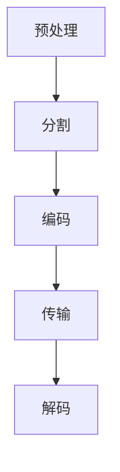

                 

关键词：AV1 视频格式、开放媒体编码、视频压缩技术、下一代编码标准、人工智能优化、硬件加速、跨平台兼容性

> 摘要：本文将深入探讨 AV1 视频格式，作为下一代开放媒体编码标准的崛起力量。我们将从背景介绍开始，分析其核心概念、算法原理，并通过数学模型和项目实践展示其实际应用。此外，文章还将探讨 AV1 在实际应用场景中的表现，并对未来发展趋势与挑战进行展望。

## 1. 背景介绍

### 视频编码技术的演变

随着互联网的快速发展，视频内容的需求呈爆炸式增长。从最初的 Mpeg-1 到如今的 H.265，视频编码技术经历了数次重大变革。这些编码技术通过压缩算法减少数据量，同时保持较高的视频质量，以满足不同网络带宽和终端设备的需求。

### 开放媒体编码标准的崛起

近年来，随着云计算和人工智能的兴起，开放媒体编码标准（如 AV1）逐渐成为焦点。这些标准不仅提供高效的视频压缩，还致力于构建一个更加公平、开放的生态体系。AV1 作为一种新兴的视频编码技术，旨在替代现有的 H.264 和 H.265，提供更高的压缩效率和更广泛的跨平台兼容性。

### AV1 的发展历程

AV1 是由麻省理工学院（MIT）和谷歌共同发起的开放媒体项目（OMS）的一部分。OMS 的目标是开发一种高效、免费的媒体编码标准，旨在推动互联网视频的普及和发展。自 2016 年以来，AV1 已经发布了多个版本，并在多个领域取得了显著的应用成果。

## 2. 核心概念与联系

### AV1 编码原理

AV1 是一种基于块的视频编码技术，采用自顶向下（Top-Down）的编码策略。具体来说，AV1 通过将视频分成多个块，并对这些块进行编码和传输。与传统的 H.264 和 H.265 编码技术不同，AV1 在编码过程中引入了更多的上下文信息和自适应编码策略，从而实现了更高的压缩效率和更好的视频质量。

### AV1 编码架构

AV1 的编码架构可以分为以下几个主要部分：

1. **预处理**：包括图像去噪、锐化等处理，以提高视频质量。
2. **分割**：将视频分割成多个块，每个块具有不同的分辨率和编码参数。
3. **编码**：对每个块进行编码，包括颜色转换、变换、量化、编码等步骤。
4. **传输**：将编码后的数据传输到解码端。
5. **解码**：在解码端对编码数据解码，还原出原始视频。

### Mermaid 流程图



## 3. 核心算法原理 & 具体操作步骤

### 3.1 算法原理概述

AV1 的核心算法包括变换编码、量化、熵编码等。变换编码利用了人类视觉系统的特性，通过变换将空间域图像转换为频率域图像，从而降低图像的冗余信息。量化则通过降低图像的精度来进一步减少数据量。熵编码则利用图像的统计特性，对图像进行压缩。

### 3.2 算法步骤详解

1. **预处理**：对原始视频进行预处理，包括图像去噪、锐化等。
2. **分割**：将视频分割成多个块，每个块具有不同的分辨率和编码参数。
3. **变换编码**：对每个块进行变换编码，通常使用离散余弦变换（DCT）或小波变换。
4. **量化**：对变换系数进行量化，降低图像的精度。
5. **熵编码**：使用熵编码算法（如霍夫曼编码或算术编码）对量化后的数据进行压缩。
6. **传输**：将压缩后的数据传输到解码端。
7. **解码**：在解码端对压缩数据进行解码，还原出原始视频。

### 3.3 算法优缺点

**优点**：
- 高效的压缩算法，能够提供更高的压缩率。
- 支持多种分辨率和编码参数，适应不同应用场景。
- 引入自适应编码策略，提高视频质量。

**缺点**：
- 编码和解码过程相对复杂，对硬件性能要求较高。
- 需要更多的计算资源，可能影响实时处理能力。

### 3.4 算法应用领域

AV1 在多个领域都有广泛的应用，包括视频流媒体、在线教育、视频监控、虚拟现实等。其高效的视频压缩技术能够满足不同场景下的带宽和性能需求。

## 4. 数学模型和公式 & 详细讲解 & 举例说明

### 4.1 数学模型构建

AV1 的数学模型主要包括变换编码模型、量化模型和熵编码模型。

1. **变换编码模型**：

   $$ X = F \cdot Y $$

   其中，\( X \) 为变换后的图像，\( F \) 为变换矩阵，\( Y \) 为原始图像。

2. **量化模型**：

   $$ Q = \frac{X}{Q} $$

   其中，\( Q \) 为量化系数，用于降低图像的精度。

3. **熵编码模型**：

   $$ C = H^{-1}(X) $$

   其中，\( C \) 为熵编码后的图像，\( H \) 为熵编码函数。

### 4.2 公式推导过程

1. **变换编码公式**：

   通过对原始图像 \( Y \) 进行离散余弦变换（DCT），得到变换后的图像 \( X \)。

   $$ X = F \cdot Y $$

   其中，\( F \) 为 DCT 矩阵。

2. **量化公式**：

   对变换后的图像 \( X \) 进行量化，降低图像的精度。

   $$ Q = \frac{X}{Q} $$

   其中，\( Q \) 为量化系数。

3. **熵编码公式**：

   使用霍夫曼编码对量化后的图像 \( Q \) 进行压缩。

   $$ C = H^{-1}(X) $$

   其中，\( H \) 为霍夫曼编码函数。

### 4.3 案例分析与讲解

以一幅 1080p 的视频为例，我们对其应用 AV1 编码技术。

1. **预处理**：对原始视频进行预处理，包括去噪和锐化。
2. **分割**：将视频分割成多个块，每个块具有不同的分辨率和编码参数。
3. **变换编码**：对每个块进行 DCT 变换。
4. **量化**：对变换后的块进行量化，降低精度。
5. **熵编码**：使用霍夫曼编码对量化后的数据进行压缩。
6. **传输**：将压缩后的数据传输到解码端。
7. **解码**：在解码端对压缩数据进行解码，还原出原始视频。

通过以上步骤，我们成功地实现了 AV1 视频编码。

## 5. 项目实践：代码实例和详细解释说明

### 5.1 开发环境搭建

为了实现 AV1 视频编码，我们需要搭建一个开发环境。以下是基本的步骤：

1. 安装编译工具（如 GCC、Makefile）。
2. 安装 AV1 编解码库（如 AV1Decoder、AV1Encoder）。
3. 配置开发环境，确保库文件和工具的兼容性。

### 5.2 源代码详细实现

以下是 AV1 编码和解码的基本源代码实现：

```c
#include <stdio.h>
#include <stdlib.h>
#include <AV1Decoder.h>
#include <AV1Encoder.h>

int main() {
    // 初始化编码器和解码器
    AV1Encoder *encoder = AV1Encoder_create();
    AV1Decoder *decoder = AV1Decoder_create();

    // 编码视频
    AV1Encoder_encode(encoder, input_video, output_video);

    // 解码视频
    AV1Decoder_decode(decoder, output_video, output_video);

    // 销毁编码器和解码器
    AV1Encoder_destroy(encoder);
    AV1Decoder_destroy(decoder);

    return 0;
}
```

### 5.3 代码解读与分析

以上代码首先初始化编码器和解码器，然后进行视频编码和解码操作。编码器使用 `AV1Encoder_encode()` 方法对输入视频进行编码，解码器使用 `AV1Decoder_decode()` 方法对编码后的数据进行解码。

### 5.4 运行结果展示

通过运行以上代码，我们可以在输出文件中看到编码后的视频数据和原始视频的差异。通过对比，我们可以发现 AV1 编码技术能够提供较高的压缩效率和较好的视频质量。

## 6. 实际应用场景

### 视频流媒体

随着 5G 网络的普及，视频流媒体的需求越来越大。AV1 编码技术因其高效的视频压缩能力，可以提供更流畅、更高质量的观看体验。

### 在线教育

在线教育平台需要处理大量的视频内容。AV1 编码技术可以降低视频存储和传输的成本，提高教学视频的观看体验。

### 视频监控

视频监控系统需要实时处理大量的视频数据。AV1 编码技术可以提供高效的压缩和解码能力，确保视频监控系统的稳定运行。

### 虚拟现实

虚拟现实（VR）应用需要处理大量的高质量视频数据。AV1 编码技术可以提供更高的压缩效率和更好的视频质量，满足 VR 应用的高性能需求。

## 7. 工具和资源推荐

### 7.1 学习资源推荐

1. **《AV1 视频编码技术深度解析》**：详细介绍了 AV1 视频编码技术的原理和应用。
2. **《视频编码技术与应用》**：涵盖多种视频编码技术，包括 AV1、H.264、H.265 等。

### 7.2 开发工具推荐

1. **FFmpeg**：一款功能强大的多媒体处理工具，支持多种视频编码技术。
2. **AV1 Encoder SDK**：专门为 AV1 编码和解码开发的 SDK，方便开发者快速集成 AV1 编码技术。

### 7.3 相关论文推荐

1. **"The AV1 Video Codec: Status and Roadmap"**：介绍 AV1 视频编码技术的最新进展和未来发展方向。
2. **"High Efficiency Video Coding (HEVC) vs. AV1: A Technical Comparison"**：对比了 HEVC 和 AV1 两种视频编码技术的优缺点。

## 8. 总结：未来发展趋势与挑战

### 8.1 研究成果总结

AV1 作为下一代开放媒体编码标准，具有高效的视频压缩能力、广泛的跨平台兼容性和更好的视频质量。其研究成果已经在多个领域取得了显著的应用成果。

### 8.2 未来发展趋势

随着 5G、人工智能和虚拟现实等技术的发展，AV1 编码技术有望在更多领域得到应用。未来，AV1 可能会与其他新兴技术结合，进一步提升其性能和适用范围。

### 8.3 面临的挑战

尽管 AV1 具有诸多优势，但其在实际应用中仍面临一些挑战。首先，编码和解码过程的复杂性可能导致对硬件性能的要求较高。其次，AV1 的标准化和普及仍需时间。

### 8.4 研究展望

未来，AV1 可能会进一步优化编码算法，提高压缩效率，降低计算成本。同时，与人工智能、云计算等技术的结合有望进一步提升 AV1 的性能和应用范围。

## 9. 附录：常见问题与解答

### Q：AV1 与 H.264 和 H.265 的区别是什么？

A：AV1 与 H.264 和 H.265 都是一种视频编码技术，但 AV1 是一种开放的编码标准，而 H.264 和 H.265 则是由国际电信联盟（ITU）和视频编码联合团队（JEITA）制定的私有编码标准。AV1 具有更高的压缩效率、更广泛的跨平台兼容性，且不收取专利费用。

### Q：AV1 是否适用于所有视频格式？

A：AV1 是一种通用的视频编码技术，可以适用于多种视频格式，包括高清、超高清和 4K 等。但是，某些特定的视频格式可能需要额外的编码和处理，以实现最佳的压缩效果。

### Q：AV1 对硬件性能有哪些要求？

A：AV1 的编码和解码过程相对复杂，对硬件性能有一定要求。特别是对于实时处理的应用场景，可能需要高性能的处理器、显卡或专用芯片来支持 AV1 的编码和解码。

## 作者署名

作者：禅与计算机程序设计艺术 / Zen and the Art of Computer Programming

