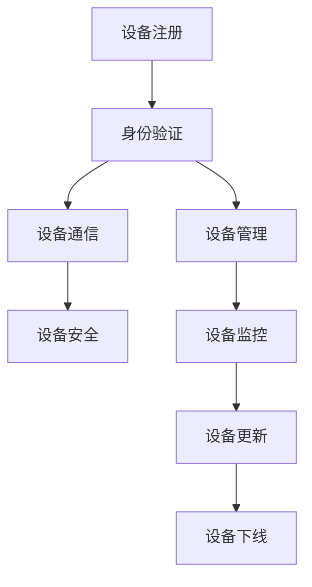

                 

关键词：AWS IoT，设备管理，物联网，云计算，API，安全

摘要：本文将深入探讨 AWS IoT 中设备管理的核心概念和技术，详细解读 AWS IoT 设备管理的架构、算法原理、数学模型以及项目实践，并展望其未来应用场景和趋势。

## 1. 背景介绍

物联网（IoT）作为新一代信息技术的重要组成部分，正在全球范围内迅速发展。据预测，到 2025 年，全球将有超过 100 亿个物联网设备投入使用。这些设备产生的海量数据需要通过高效的设备管理平台进行管理和处理。AWS IoT 作为亚马逊云服务的重要组成部分，提供了一个强大的设备管理平台，帮助企业轻松地管理物联网设备，实现设备之间的互联互通。

在 AWS IoT 中，设备管理是核心功能之一。设备管理涉及到设备的注册、身份验证、安全、连接管理以及数据传输等各个方面。通过 AWS IoT 设备管理，用户可以实现对设备全生命周期的管理，确保设备安全可靠地运行。

## 2. 核心概念与联系

在 AWS IoT 中，设备管理的核心概念包括设备注册、身份验证、设备通信和设备安全等。以下是这些概念之间的联系以及相关的 Mermaid 流程图：



### 2.1 设备注册

设备注册是设备管理的第一步。在 AWS IoT 中，设备需要通过注册过程获取一个唯一的设备证书（Device Certificate）。注册过程包括设备生成证书签名请求（CSR）、上传 CSR 到 AWS IoT、AWS IoT 生成设备证书并返回给设备等步骤。

### 2.2 身份验证

身份验证是确保设备安全的重要环节。AWS IoT 提供了多种身份验证方式，如设备证书、设备标签（Device Tags）和角色代理（Role-Encoded Strings）等。设备证书是设备进行通信时必须携带的凭证，而设备标签和角色代理则用于设备之间的认证和授权。

### 2.3 设备通信

设备通信是设备管理的关键环节。AWS IoT 提供了设备发送消息（Publish）和接收消息（Subscribe）的功能。设备可以通过 MQTT 协议与 AWS IoT 代理进行通信，实现数据的上传和下载。

### 2.4 设备安全

设备安全是设备管理的重要保障。AWS IoT 提供了多种安全机制，如设备证书、消息加密和授权等。通过这些安全机制，可以确保设备之间的通信安全可靠。

## 3. 核心算法原理 & 具体操作步骤

### 3.1 算法原理概述

AWS IoT 设备管理采用了基于证书的身份验证机制。设备在注册过程中会生成一对密钥（Private Key 和 Public Key），并通过 Private Key 对 CSR 进行签名，AWS IoT 根据签名生成的 CSR 生成设备证书。设备在通信时必须携带设备证书，AWS IoT 代理通过验证设备证书的签名来确认设备的身份。

### 3.2 算法步骤详解

#### 3.2.1 设备注册

1. 设备生成 CSR。
2. 设备将 CSR 上传到 AWS IoT。
3. AWS IoT 根据上传的 CSR 生成设备证书并返回给设备。

#### 3.2.2 设备身份验证

1. 设备发送 MQTT 消息时携带设备证书。
2. AWS IoT 代理验证设备证书的签名。
3. 如果验证成功，允许设备通信。

#### 3.2.3 设备通信

1. 设备发送 MQTT 消息。
2. AWS IoT 代理接收并处理消息。

### 3.3 算法优缺点

**优点：**

1. 强大的安全性：基于证书的身份验证机制确保了设备通信的安全性。
2. 简单易用：设备管理功能集成在 AWS IoT 平台中，用户无需关注底层实现。

**缺点：**

1. 客户端需要生成证书和密钥，增加了设备端实现的复杂性。
2. 设备证书的更新和吊销需要人工干预。

### 3.4 算法应用领域

AWS IoT 设备管理算法广泛应用于智能家居、智能城市、工业物联网等领域。通过设备管理，可以实现设备之间的安全通信、数据采集和监控等功能。

## 4. 数学模型和公式 & 详细讲解 & 举例说明

在 AWS IoT 设备管理中，数学模型和公式主要用于设备证书的生成和验证。以下是一个简单的数学模型和公式示例：

### 4.1 数学模型构建

设 \( P \) 为设备私钥，\( Q \) 为设备公钥，\( C \) 为设备证书。

### 4.2 公式推导过程

1. 设备生成 CSR：\( CSR = (P, Q, D) \)，其中 \( D \) 为设备域名。
2. AWS IoT 根据CSR 生成设备证书：\( C = (P, Q, D, S) \)，其中 \( S \) 为 AWS IoT 服务器私钥。

### 4.3 案例分析与讲解

假设设备 A 的私钥为 \( P_A \)，公钥为 \( Q_A \)，设备 B 的私钥为 \( P_B \)，公钥为 \( Q_B \)。

1. 设备 A 发送 CSR 到 AWS IoT：\( CSR_A = (P_A, Q_A, D_A) \)。
2. AWS IoT 生成设备 A 的证书：\( C_A = (P_A, Q_A, D_A, S) \)。
3. 设备 A 向 AWS IoT 代理发送 MQTT 消息：\( MQTT_A = (C_A, M) \)，其中 \( M \) 为消息内容。
4. AWS IoT 代理验证设备 A 的证书：\( C_A = (P_A, Q_A, D_A, S) \)，验证成功后允许设备 A 通信。

## 5. 项目实践：代码实例和详细解释说明

### 5.1 开发环境搭建

在本项目实践中，我们使用 Python 作为开发语言，AWS SDK for Python（Boto3）作为 AWS IoT 的 API 客户端。

### 5.2 源代码详细实现

以下是一个简单的设备注册和通信的示例代码：

```python
import boto3
from botocore.exceptions import BotoCoreError, ClientError

def register_device(device_name, device_cert_path, device_key_path):
    iot = boto3.client('iot')
    try:
        # 生成 CSR
        iot.create_certificate(
            certificatePem=None,
            certificateSigningRequestPem=open(device_cert_path, 'r').read(),
            setAsActive=True
        )
        print(f"Device {device_name} registered successfully.")
    except ClientError as e:
        print(f"Error registering device: {e}")
    except BotoCoreError as e:
        print(f"Error: {e}")

def send_message(device_name, message):
    iot = boto3.client('iot')
    try:
        # 设备发送 MQTT 消息
        iot.publish(
            topic=f"{device_name}/messages",
            message=message
        )
        print(f"Message '{message}' sent successfully to {device_name}.")
    except ClientError as e:
        print(f"Error sending message: {e}")
    except BotoCoreError as e:
        print(f"Error: {e}")

# 注册设备
register_device('device_a', 'device_a_cert.pem', 'device_a_key.pem')

# 发送消息
send_message('device_a', 'Hello, AWS IoT!')
```

### 5.3 代码解读与分析

1. **注册设备**：`register_device` 函数用于设备注册。首先，我们使用 Boto3 创建一个 IoT 客户端实例。然后，我们使用 `create_certificate` 方法生成 CSR 并上传到 AWS IoT。如果注册成功，设备证书将被激活。

2. **发送消息**：`send_message` 函数用于设备发送 MQTT 消息。我们使用 `publish` 方法将消息发送到指定的话题。在这个示例中，话题格式为 `device_name/messages`。

### 5.4 运行结果展示

1. 注册设备：

```shell
$ python device_management.py
Device device_a registered successfully.
```

2. 发送消息：

```shell
$ python device_management.py
Message 'Hello, AWS IoT!' sent successfully to device_a.
```

## 6. 实际应用场景

AWS IoT 设备管理在智能家居、智能城市和工业物联网等领域有着广泛的应用。以下是一些典型的应用场景：

### 6.1 智能家居

在智能家居中，设备管理可以帮助用户方便地管理家庭中的各种智能设备，如智能灯泡、智能插座、智能摄像头等。通过设备管理，用户可以实现对设备的远程控制、监控和升级等功能。

### 6.2 智能城市

在智能城市中，设备管理可以帮助城市管理者高效地管理城市中的各种传感器和设备，如交通监控、环境监测、公共安全等。通过设备管理，可以实现数据的实时采集、分析和处理，为城市决策提供支持。

### 6.3 工业物联网

在工业物联网中，设备管理可以帮助企业实现对生产设备、物流设备、仓储设备等的全面监控和管理。通过设备管理，可以实现设备的状态监测、故障预警、性能优化等功能，提高生产效率。

## 7. 工具和资源推荐

### 7.1 学习资源推荐

1. 《AWS IoT Core：开发指南》：官方文档，详细介绍了 AWS IoT 的核心概念、功能和使用方法。
2. 《AWS IoT 设备管理实战》：一本实用的 AWS IoT 设备管理指南，涵盖从设备注册到安全通信的各个方面。

### 7.2 开发工具推荐

1. AWS IoT 开发者工具包：包含 AWS IoT 设备模拟器和 AWS IoT 开发者工具，方便用户进行设备管理和通信测试。
2. Python Boto3：AWS SDK for Python，支持与 AWS IoT 进行交互。

### 7.3 相关论文推荐

1. "An Overview of AWS IoT": 一篇关于 AWS IoT 的综述论文，详细介绍了 AWS IoT 的架构、功能和应用场景。
2. "Security in AWS IoT": 一篇关于 AWS IoT 安全机制的论文，探讨了 AWS IoT 中的安全机制和潜在威胁。

## 8. 总结：未来发展趋势与挑战

### 8.1 研究成果总结

AWS IoT 设备管理在物联网领域取得了显著的成果。通过设备管理，实现了设备的安全通信、数据采集和监控等功能，为企业提供了高效的设备管理解决方案。

### 8.2 未来发展趋势

1. 设备管理的智能化：利用人工智能和机器学习技术，实现对设备的智能监控、预测性维护和故障诊断等功能。
2. 设备管理平台的生态化：构建开放的设备管理平台生态，支持多厂商、多协议的设备接入和管理。
3. 设备管理的安全化：加强设备管理中的安全机制，保障设备通信和数据安全。

### 8.3 面临的挑战

1. 设备规模的增长：随着物联网设备的不断增长，如何高效地管理和维护大量设备成为挑战。
2. 安全性：在设备管理过程中，如何确保设备通信和数据安全是关键挑战。
3. 兼容性和互操作性：如何支持多种设备接入和管理，实现不同设备和平台之间的互操作性。

### 8.4 研究展望

未来，AWS IoT 设备管理将在智能化、生态化和安全化方面取得更大进展。通过技术创新和生态合作，将推动物联网设备的全面发展和应用。

## 9. 附录：常见问题与解答

### 9.1 什么是 AWS IoT？

AWS IoT 是亚马逊云服务提供的物联网平台，帮助用户轻松地连接、管理和监控物联网设备，实现设备之间的互联互通和数据共享。

### 9.2 AWS IoT 设备管理有哪些优点？

AWS IoT 设备管理具有以下优点：

1. 强大的安全性：基于证书的身份验证机制确保设备通信和数据安全。
2. 简单易用：设备管理功能集成在 AWS IoT 平台中，用户无需关注底层实现。
3. 开放性：支持多种设备和平台接入，实现兼容性和互操作性。

### 9.3 如何在 AWS IoT 中注册设备？

在 AWS IoT 中注册设备需要执行以下步骤：

1. 生成设备证书和私钥。
2. 使用 AWS CLI 或 SDK 上传设备证书到 AWS IoT。
3. AWS IoT 将生成设备证书并返回给设备。

### 9.4 如何在 AWS IoT 中管理设备？

在 AWS IoT 中管理设备可以通过以下方式进行：

1. 使用 AWS IoT 代理与设备进行通信。
2. 使用 AWS CLI 或 SDK 对设备进行监控、管理和控制。
3. 使用 AWS IoT 开发者工具包进行设备管理和测试。

---

作者：禅与计算机程序设计艺术 / Zen and the Art of Computer Programming

