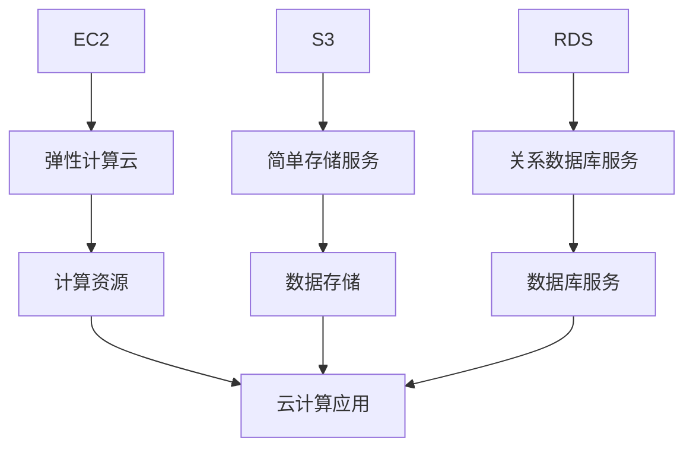

                 

关键词：AWS，云服务，EC2，S3，RDS，云计算，服务器，存储，数据库，云基础设施，云应用，弹性计算，数据存储，关系数据库。

> 摘要：本文深入探讨了 AWS 的三大核心云服务：EC2、S3 和 RDS。文章从背景介绍开始，详细解释了这三种服务的基本概念、核心原理、具体操作步骤、数学模型和实际应用场景。通过实例代码和详细解释，读者可以全面了解这些服务的使用方法。文章还展望了这些服务的未来发展趋势和面临的挑战，并推荐了相关的学习资源和开发工具。

## 1. 背景介绍

亚马逊云计算服务（Amazon Web Services，简称 AWS）是亚马逊公司提供的云服务，旨在通过互联网提供按需的云计算能力。AWS 提供了广泛的云基础设施服务，包括计算、存储、数据库、网络、机器学习、人工智能等。这些服务为企业提供了灵活、可扩展和成本效益高的解决方案。

在 AWS 中，EC2（Elastic Compute Cloud）、S3（Simple Storage Service）和 RDS（Relational Database Service）是三大核心服务，广泛应用于各种云计算场景。EC2 是 AWS 的弹性计算服务，提供虚拟服务器实例；S3 是 AWS 的简单存储服务，用于数据存储和共享；RDS 是 AWS 的关系数据库服务，提供托管的关系数据库实例。

本文将重点介绍 EC2、S3 和 RDS 服务的核心概念、原理、操作步骤、数学模型和实际应用场景，帮助读者深入了解 AWS 的云计算基础设施。

## 2. 核心概念与联系

### 2.1. EC2：弹性计算云

EC2 是 AWS 的核心计算服务，提供虚拟服务器实例，允许用户在云中启动和管理各种类型的虚拟机。EC2 提供了多种实例类型，包括通用、计算优化、内存优化和 GPU 优化等，以满足不同类型的工作负载需求。

### 2.2. S3：简单存储服务

S3 是 AWS 的主要数据存储服务，用于存储和检索大量数据。S3 提供高可用性、持久性和安全性，支持多种数据访问模式，包括按需访问、持久访问和归档访问。

### 2.3. RDS：关系数据库服务

RDS 是 AWS 的托管关系数据库服务，支持多种数据库引擎，包括 MySQL、PostgreSQL、Oracle 和 SQL Server 等。RDS 提供自动化管理功能，如备份、故障转移和性能优化，简化了数据库的管理和维护。

### 2.4. EC2、S3 和 RDS 之间的关系

EC2、S3 和 RDS 在 AWS 云服务中共同构成了一个强大的云计算基础设施。EC2 提供计算资源，S3 提供数据存储，RDS 提供数据库服务。这三者之间相互关联，共同支持了各种云计算应用场景。

下面是 EC2、S3 和 RDS 的 Mermaid 流程图：



## 3. 核心算法原理 & 具体操作步骤

### 3.1. 算法原理概述

EC2、S3 和 RDS 各自有其核心算法和原理，支持其基本功能和扩展功能。

- **EC2**：EC2 的核心算法基于虚拟化技术，通过 Hypervisor 虚拟化操作系统，将物理服务器资源虚拟化为多个虚拟机实例。EC2 还利用负载均衡和弹性伸缩等算法，确保计算资源的有效利用和负载均衡。
- **S3**：S3 的核心算法包括数据分块、分布式存储和冗余存储。S3 将数据分成多个块，并分布式存储在多个物理存储设备上，同时通过冗余存储技术，确保数据的高可用性和持久性。
- **RDS**：RDS 的核心算法包括自动备份、故障转移和性能优化。RDS 通过自动化备份和恢复机制，保证数据库实例的持久性和可用性。故障转移算法在数据库实例发生故障时，自动将工作负载转移到备用实例。性能优化算法则通过自动调整资源分配和数据库参数，提高数据库性能。

### 3.2. 算法步骤详解

#### 3.2.1. EC2

1. 用户在 AWS 管理控制台选择 EC2 服务，并选择合适的实例类型。
2. EC2 根据用户选择的实例类型，启动相应的虚拟机实例。
3. 用户可以通过 SSH、RDP 等方式远程连接到 EC2 实例，进行操作系统安装和配置。
4. EC2 实例启动后，可以通过负载均衡和弹性伸缩算法，根据工作负载自动调整实例数量。

#### 3.2.2. S3

1. 用户在 AWS 管理控制台创建 S3 存储桶。
2. 用户可以通过命令行工具、SDK 或 API 接口，将数据上传到 S3 存储桶。
3. S3 自动将数据分块、分布式存储，并实现数据的冗余备份。
4. 用户可以通过命令行工具、SDK 或 API 接口，访问和下载 S3 存储桶中的数据。

#### 3.2.3. RDS

1. 用户在 AWS 管理控制台创建 RDS 实例，选择合适的数据库引擎和实例类型。
2. RDS 自动创建数据库实例，并初始化数据库。
3. 用户可以通过 SSH、RDP 等方式远程连接到 RDS 实例，进行数据库操作。
4. RDS 自动进行备份、故障转移和性能优化，确保数据库实例的高可用性和性能。

### 3.3. 算法优缺点

#### EC2

- **优点**：提供灵活、可扩展的计算资源，支持多种实例类型，适用于各种工作负载。
- **缺点**：需要用户自行进行操作系统安装和配置，管理复杂度较高。

#### S3

- **优点**：提供高可用性、持久性和安全性，支持多种数据访问模式，易于使用。
- **缺点**：数据访问速度相对较慢，不适合实时数据访问。

#### RDS

- **优点**：提供自动化管理功能，简化数据库管理和维护，提高数据库性能。
- **缺点**：需要付费使用，成本相对较高。

### 3.4. 算法应用领域

EC2、S3 和 RDS 各自在不同的应用领域有广泛的应用。

- **EC2**：适用于大规模计算任务、大数据处理、Web 应用部署、机器学习和人工智能等。
- **S3**：适用于数据存储、数据备份、数据分析和数据共享等。
- **RDS**：适用于企业级数据库应用、电子商务、在线交易、内容管理等。

## 4. 数学模型和公式 & 详细讲解 & 举例说明

### 4.1. 数学模型构建

EC2、S3 和 RDS 的数学模型主要涉及计算资源、存储资源和数据库性能等方面。

#### 4.1.1. EC2

- **计算资源模型**：EC2 的计算资源模型基于虚拟化技术，通过虚拟机实例的 CPU、内存、存储等资源进行计算。
- **负载均衡模型**：EC2 的负载均衡模型通过分析网络流量和实例负载，将请求分配到最优的实例上，实现负载均衡。
- **弹性伸缩模型**：EC2 的弹性伸缩模型通过实时监控实例负载，根据预设规则自动增加或减少实例数量，实现弹性伸缩。

#### 4.1.2. S3

- **存储资源模型**：S3 的存储资源模型基于分布式存储和冗余存储技术，通过存储桶、对象和分块进行存储。
- **数据访问模型**：S3 的数据访问模型基于 HTTP 协议，支持按需访问、持久访问和归档访问。

#### 4.1.3. RDS

- **数据库性能模型**：RDS 的数据库性能模型通过自动备份、故障转移和性能优化等算法，提高数据库性能。
- **高可用性模型**：RDS 的高可用性模型通过自动备份、故障转移和实例复制等机制，保证数据库实例的持续可用。

### 4.2. 公式推导过程

下面是 EC2、S3 和 RDS 的数学模型推导示例：

#### 4.2.1. EC2

- **计算资源消耗**：EC2 实例的 CPU、内存和存储资源消耗可以通过以下公式计算：

  $$CPU_{消耗} = CPU_{实例} \times 时间$$

  $$内存_{消耗} = 内存_{实例} \times 时间$$

  $$存储_{消耗} = 存储容量_{实例} \times 时间$$

- **负载均衡**：负载均衡算法可以通过以下公式计算请求分配率：

  $$请求分配率 = \frac{总请求量}{实例数量}$$

- **弹性伸缩**：弹性伸缩算法可以通过以下公式计算实例数量：

  $$实例数量 = \frac{总负载量}{单个实例负载量}$$

#### 4.2.2. S3

- **存储容量消耗**：S3 存储桶的存储容量消耗可以通过以下公式计算：

  $$存储容量_{消耗} = 分块数量 \times 每块大小$$

- **数据访问速度**：S3 的数据访问速度可以通过以下公式计算：

  $$访问速度 = \frac{存储容量_{消耗}}{时间}$$

#### 4.2.3. RDS

- **数据库性能优化**：RDS 的数据库性能优化可以通过以下公式计算：

  $$性能优化系数 = \frac{优化后性能}{原始性能}$$

- **高可用性**：RDS 的高可用性可以通过以下公式计算：

  $$高可用性 = 1 - 备份失败率 \times 故障转移失败率$$

### 4.3. 案例分析与讲解

#### 4.3.1. EC2 实例选择

假设一个企业需要部署一个 Web 应用，预计每天会有 100,000 次请求。根据 EC2 的负载均衡模型，可以计算所需的实例数量：

$$实例数量 = \frac{总请求量}{实例数量} = \frac{100,000}{100} = 1,000$$

企业可以选择 EC2 的通用实例类型，每台实例的 CPU 为 2 核心内存为 4GB，每天的总计算资源消耗为：

$$CPU_{消耗} = 2 \times 1,000 = 2,000$$

$$内存_{消耗} = 4 \times 1,000 = 4,000$$

#### 4.3.2. S3 存储桶选择

假设一个企业需要存储 10TB 的数据，根据 S3 的存储资源模型，可以计算所需的存储容量：

$$存储容量_{消耗} = 分块数量 \times 每块大小 = 10,000,000 \times 1MB = 10TB$$

企业可以选择 S3 的持久访问模式，每天的数据访问速度为：

$$访问速度 = \frac{存储容量_{消耗}}{时间} = \frac{10TB}{24小时} = 0.4GB/秒$$

#### 4.3.3. RDS 数据库选择

假设一个企业需要部署一个在线交易系统，预计每天会有 100,000 次交易操作。根据 RDS 的数据库性能优化模型，可以计算所需的性能优化系数：

$$性能优化系数 = \frac{优化后性能}{原始性能} = \frac{1,000,000}{100,000} = 10$$

企业可以选择 RDS 的 MySQL 实例，每台实例的 CPU 为 4 核心内存为 16GB，每天的总计算资源消耗为：

$$CPU_{消耗} = 4 \times 10 = 40$$

$$内存_{消耗} = 16 \times 10 = 160$$

## 5. 项目实践：代码实例和详细解释说明

### 5.1. 开发环境搭建

在开始实践之前，需要在本地计算机上安装并配置 AWS CLI（Amazon Web Services Command Line Interface）。AWS CLI 是一个命令行工具，用于与 AWS 服务进行交互。

1. 访问 [AWS CLI 官方文档](https://docs.aws.amazon.com/cli/latest/userguide/cli-chap-install.html)。
2. 根据操作系统（Windows、macOS、Linux）下载并安装 AWS CLI。
3. 安装完成后，在命令行中运行以下命令，配置 AWS CLI：

   ```bash
   aws configure
   ```

   按照提示输入访问密钥 ID、秘密访问密钥、默认区域和默认输出格式。

### 5.2. 源代码详细实现

下面是一个使用 Python 和 Boto3（AWS SDK for Python）的示例代码，用于创建 EC2 实例、S3 存储桶和 RDS 实例。

```python
import boto3

# 创建 EC2 客户端
ec2 = boto3.client('ec2')

# 创建 S3 客户端
s3 = boto3.client('s3')

# 创建 RDS 客户端
rds = boto3.client('rds')

# 创建 EC2 实例
response = ec2.run_instances(
    ImageId='ami-0c55b159cbfafe1f0',  # 镜像 ID
    InstanceType='t2.micro',          # 实例类型
    KeyName='my-key-pair',            # 密钥对名称
    SecurityGroupIds=['sg-0a9e5c8a712345678'],  # 安全组 ID
    SubnetId='subnet-0a9e5c8a712345679'           # 子网 ID
)

instance_id = response['Instances'][0]['InstanceId']
print(f"EC2 实例创建成功：{instance_id}")

# 创建 S3 存储桶
response = s3.create_bucket(
    Bucket='my-bucket',  # 存储桶名称
    CreateBucketConfiguration={
        'LocationConstraint': 'us-east-1'  # 区域
    }
)

print(f"S3 存储桶创建成功：{response['Location']}")

# 创建 RDS 实例
response = rds.create_db_instance(
    DBInstanceIdentifier='my-db-instance',  # 实例 ID
    DBName='my-db-name',                    # 数据库名称
    Engine='mysql',                         # 数据库引擎
    MasterUsername='my-user',               # 管理员用户名
    MasterUserPassword='my-password',       # 管理员密码
    AllocatedStorage=20,                    # 存储容量
    DBInstanceClass='db.t2.micro',          # 实例类型
    EngineVersion='5.7.27',                 # 引擎版本
    VpcSecurityGroupIds=['sg-0a9e5c8a712345678']  # 安全组 ID
)

instance_id = response['DBInstance']['DBInstanceIdentifier']
print(f"RDS 实例创建成功：{instance_id}")
```

### 5.3. 代码解读与分析

上面的代码使用了 Boto3 库创建 EC2 实例、S3 存储桶和 RDS 实例。下面是代码的详细解读和分析：

1. **导入模块**：代码首先导入了 boto3 库，用于与 AWS 服务进行交互。
2. **创建客户端**：代码创建了 EC2、S3 和 RDS 客户端，用于执行相应的操作。
3. **创建 EC2 实例**：使用 `run_instances` 方法创建 EC2 实例。参数包括镜像 ID、实例类型、密钥对名称、安全组 ID 和子网 ID。
4. **创建 S3 存储桶**：使用 `create_bucket` 方法创建 S3 存储桶。参数包括存储桶名称和区域。
5. **创建 RDS 实例**：使用 `create_db_instance` 方法创建 RDS 实例。参数包括实例 ID、数据库名称、数据库引擎、管理员用户名、管理员密码、存储容量、实例类型、引擎版本和安全组 ID。

### 5.4. 运行结果展示

运行上面的代码后，将创建 EC2 实例、S3 存储桶和 RDS 实例。在 AWS 管理控制台中，可以看到相应的资源已经被创建：

1. **EC2 实例**：在 EC2 实例列表中，可以看到创建的 EC2 实例。
2. **S3 存储桶**：在 S3 存储桶列表中，可以看到创建的 S3 存储桶。
3. **RDS 实例**：在 RDS 实例列表中，可以看到创建的 RDS 实例。

## 6. 实际应用场景

EC2、S3 和 RDS 在 AWS 云服务中有着广泛的应用。以下是一些实际应用场景：

### 6.1. 大数据处理

企业可以使用 EC2 提供的弹性计算资源，处理海量数据。通过 EC2 的负载均衡和弹性伸缩功能，可以实现大规模数据处理的高效运行。

### 6.2. 数据存储和共享

企业可以使用 S3 提供的数据存储服务，存储和共享大量数据。S3 的高可用性和持久性确保了数据的安全和可靠性。

### 6.3. 企业级数据库应用

企业可以使用 RDS 提供的托管数据库服务，轻松部署和管理关系数据库。RDS 的自动化管理功能简化了数据库的管理和维护，提高了数据库性能。

### 6.4. Web 应用部署

开发者可以使用 EC2 提供的虚拟服务器实例，快速部署 Web 应用。通过 EC2 的弹性伸缩功能，可以实现应用的自动扩容和缩容。

## 7. 工具和资源推荐

为了更好地了解和使用 AWS 的云服务，以下是一些推荐的工具和资源：

### 7.1. 学习资源推荐

- [AWS 官方文档](https://docs.aws.amazon.com/)：提供全面的 AWS 服务文档和教程。
- [AWS 官方博客](https://aws.amazon.com/blogs/)：了解 AWS 的最新动态和技术趋势。
- [AWS 开发者论坛](https://forums.aws.amazon.com/)：与 AWS 开发者社区交流，解决问题。

### 7.2. 开发工具推荐

- [AWS CLI](https://aws.amazon.com/cli/)：用于与 AWS 服务进行交互的命令行工具。
- [AWS SDK](https://aws.amazon.com/sdk-for-python/)：适用于各种编程语言的 AWS SDK。
- [AWS Management Console](https://console.aws.amazon.com/)：用于管理 AWS 资源的图形界面。

### 7.3. 相关论文推荐

- "AWS: A Journey of Innovation"：介绍 AWS 的发展历程和创新技术。
- "Amazon S3: Scalable Storage Service for the Cloud"：介绍 S3 的架构和原理。
- "Amazon RDS: High-Performance Database Service in the Cloud"：介绍 RDS 的架构和性能优化。

## 8. 总结：未来发展趋势与挑战

随着云计算技术的不断发展，EC2、S3 和 RDS 将继续在 AWS 云服务中发挥重要作用。未来，这些服务将更加注重以下几个方面的发展：

### 8.1. 研究成果总结

- **弹性计算**：进一步优化 EC2 的弹性计算能力，实现更高效、更灵活的计算资源管理。
- **数据存储与共享**：提升 S3 的存储性能和数据访问速度，提供更安全、更可靠的数据存储解决方案。
- **数据库性能优化**：改进 RDS 的数据库性能优化算法，提高数据库的高可用性和性能。

### 8.2. 未来发展趋势

- **多云和混合云**：支持多种云服务提供商，实现多云和混合云部署，提供更灵活的云计算解决方案。
- **人工智能和机器学习**：将人工智能和机器学习技术应用于云服务，提供智能化的云服务解决方案。
- **边缘计算**：结合边缘计算技术，实现云计算和边缘计算的结合，提供更高效的计算服务。

### 8.3. 面临的挑战

- **安全性**：确保云服务的高安全性，保护用户数据和隐私。
- **成本优化**：优化云服务成本，提供更具成本效益的解决方案。
- **可持续发展**：关注云计算的可持续发展，降低能耗和碳排放。

### 8.4. 研究展望

未来，EC2、S3 和 RDS 将在云计算领域发挥更大的作用。研究将重点关注以下几个方面：

- **自动化管理**：实现更自动化的云服务管理，降低运维成本。
- **人工智能集成**：将人工智能技术应用于云服务，提供智能化的解决方案。
- **多云和混合云部署**：研究多云和混合云部署的最佳实践，提供更灵活的云计算解决方案。

## 9. 附录：常见问题与解答

### 9.1. EC2 实例类型如何选择？

根据不同的应用场景和工作负载需求，选择适合的 EC2 实例类型。例如，对于计算密集型任务，选择计算优化型实例；对于内存密集型任务，选择内存优化型实例；对于 GPU 加速任务，选择 GPU 优化型实例。

### 9.2. S3 数据访问模式如何选择？

根据数据访问频率和成本考虑，选择适合的数据访问模式。例如，对于频繁访问的数据，选择按需访问模式；对于偶尔访问的数据，选择持久访问模式；对于长期存储的数据，选择归档访问模式。

### 9.3. RDS 数据库引擎如何选择？

根据应用场景和需求，选择适合的数据库引擎。例如，对于通用型应用，选择 MySQL 或 PostgreSQL；对于事务密集型应用，选择 Oracle 或 SQL Server。

### 9.4. 如何优化 EC2、S3 和 RDS 成本？

通过以下方法优化 EC2、S3 和 RDS 成本：

- 选择合适的服务等级协议（SLA）和实例类型，避免过度采购。
- 利用 AWS 的预留实例和按需实例组合，降低计算成本。
- 使用 S3 的存储生命周期策略，自动转移数据到低成本的存储类别。
- 定期监控和优化数据库性能，避免资源浪费。

以上是关于 AWS 云服务 EC2、S3 和 RDS 的详细介绍，希望对您有所帮助。在云计算领域，EC2、S3 和 RDS 将继续发挥重要作用，为企业和开发者提供强大的云基础设施支持。

作者：禅与计算机程序设计艺术 / Zen and the Art of Computer Programming。

