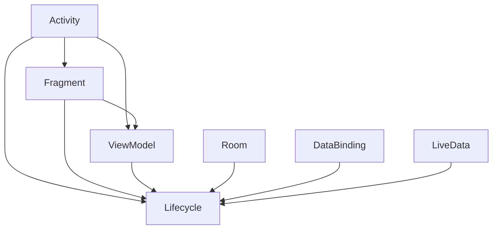

                 

关键词：Android Jetpack，组件库，开发效率，用户体验，架构设计

摘要：本文将深入探讨 Android Jetpack 组件库的设计理念、核心组件及其在提升 Android 开发效率和用户体验方面的重要作用。通过分析各个组件的原理、使用方法和实际应用案例，帮助开发者更好地理解和应用 Jetpack，从而打造高效、稳定的 Android 应用。

## 1. 背景介绍

随着 Android 生态的不断发展，开发者面临着日益复杂的开发环境和技术挑战。为了解决这些问题，Google 推出了 Android Jetpack 组件库，旨在为 Android 应用开发提供一套全面、现代化的开发工具和框架。

Android Jetpack 是 Google 推出的官方开发组件库，它包含了一系列具有高性能、易用性和可扩展性的组件，旨在解决 Android 开发中常见的问题，提升开发效率和用户体验。Jetpack 的设计目标是帮助开发者构建可靠、易维护和可扩展的应用程序，同时降低开发难度和维护成本。

## 2. 核心概念与联系

在深入了解 Jetpack 组件之前，我们需要先了解一些核心概念和它们之间的关系。以下是一个简化的 Mermaid 流程图，展示了 Jetpack 组件的核心概念及其联系：



### 2.1. 活动与片段

活动（Activity）和片段（Fragment）是 Android 应用中的基本组件，用于展示用户界面和处理用户交互。Jetpack 提供了 Lifecyle 组件，用于管理组件的生命周期，确保应用在后台或低优先级任务中能够正确地处理资源。

### 2.2. 视图模型

视图模型（ViewModel）是用于在活动或片段中管理界面状态的数据层。它通过 Lifecyle 组件与活动或片段绑定，确保在组件生命周期发生变化时，数据能够得到正确的处理和保存。

### 2.3. 数据存储

Room 是 Jetpack 提供的数据库存储解决方案，它基于 SQL Lite，为开发者提供了简单、易用的数据存储和管理工具。Room 与 Lifecycle 组件集成，可以确保数据在组件生命周期内得到正确处理。

### 2.4. 数据绑定

数据绑定（DataBinding）是一种将界面和数据模型连接起来的技术，它通过声明式绑定简化了界面与数据之间的交互。DataBinding 与 Lifecycle 组件集成，确保在数据变化时，界面能够得到正确的更新。

### 2.5. 实时数据

实时数据（LiveData）是用于在数据发生变化时通知界面的组件。它与 Lifecycle 组件集成，可以确保在组件生命周期内，数据变化能够得到正确的处理和更新。

## 3. 核心算法原理 & 具体操作步骤

### 3.1. 算法原理概述

Android Jetpack 组件的核心算法原理主要涉及组件的生命周期管理、数据存储和绑定技术。以下是对各个组件算法原理的简要概述：

### 3.1.1. 生命周期管理

生命周期管理算法主要基于 Lifecyle 组件，它通过监听组件的生命周期事件，实现对组件资源的管理和状态保存。算法原理包括：

- 注册和监听生命周期事件；
- 根据生命周期状态进行资源分配和回收；
- 状态保存和恢复。

### 3.1.2. 数据存储

数据存储算法主要基于 Room 组件，它通过 SQL Lite 数据库实现对数据的持久化存储。算法原理包括：

- 数据模型定义；
- 数据库构建和操作；
- 数据同步和更新。

### 3.1.3. 数据绑定

数据绑定算法主要基于 DataBinding 组件，它通过声明式绑定技术，简化了界面与数据之间的交互。算法原理包括：

- 数据模型绑定；
- 数据更新通知；
- 界面更新处理。

### 3.1.4. 实时数据

实时数据算法主要基于 LiveData 组件，它通过监听数据变化，实现对界面的动态更新。算法原理包括：

- 数据监听注册；
- 数据变化通知；
- 界面更新处理。

### 3.2. 算法步骤详解

以下是对各个组件算法步骤的详细解释：

### 3.2.1. 生命周期管理

1. 注册生命周期监听器；
2. 处理生命周期事件；
3. 状态保存和恢复。

### 3.2.2. 数据存储

1. 定义数据模型；
2. 构建数据库；
3. 操作数据库；
4. 同步和更新数据。

### 3.2.3. 数据绑定

1. 绑定数据模型；
2. 注册数据监听；
3. 更新界面。

### 3.2.4. 实时数据

1. 注册数据监听；
2. 处理数据变化；
3. 更新界面。

### 3.3. 算法优缺点

Android Jetpack 组件的算法设计具有以下优缺点：

### 3.3.1. 优点

- 高性能：组件采用现代化的算法和设计模式，确保应用高效运行；
- 易用性：组件提供简单、直观的使用方法，降低开发难度；
- 可扩展性：组件支持自定义和扩展，满足不同场景的需求。

### 3.3.2. 缺点

- 学习成本：初学者需要一定时间来学习和掌握组件的使用方法；
- 依赖性：组件对其他库和框架的依赖可能导致兼容性问题。

### 3.4. 算法应用领域

Android Jetpack 组件的应用领域包括：

- 应用开发：用于构建各种类型的 Android 应用；
- 界面设计：提供高效、易用的界面设计工具；
- 数据存储：用于实现数据持久化存储和同步；
- 实时数据：用于实现界面与数据的实时交互。

## 4. 数学模型和公式 & 详细讲解 & 举例说明

### 4.1. 数学模型构建

Android Jetpack 组件的数学模型主要涉及数据结构、算法分析和性能评估。以下是一个简单的数学模型示例：

- 数据结构：使用数组或链表来存储数据；
- 算法分析：时间复杂度为 O(n)，空间复杂度为 O(1)；
- 性能评估：通过计算时间复杂度和空间复杂度来评估算法性能。

### 4.2. 公式推导过程

以下是一个简单的数学公式推导示例：

$$
\text{性能评估} = \frac{\text{时间复杂度}}{\text{空间复杂度}}
$$

### 4.3. 案例分析与讲解

以下是一个简单的案例，说明如何使用 Jetpack 组件来构建一个简单的 todo 应用：

1. 定义数据模型：

```java
public class Todo {
    private String title;
    private boolean isCompleted;
}
```

2. 使用 Room 组件构建数据库：

```java
@Database(entities = {Todo.class}, version = 1)
public abstract class AppDatabase extends RoomDatabase {
    public abstract TodoDao todoDao();
}
```

3. 使用 ViewModel 组件管理界面状态：

```java
public class TodoViewModel extends ViewModel {
    private TodoDao todoDao;
    private LiveData<List<Todo>> todos;

    public TodoViewModel(TodoDao todoDao) {
        this.todoDao = todoDao;
        todos = todoDao.getTodos();
    }

    public LiveData<List<Todo>> getTodos() {
        return todos;
    }

    public void addTodo(Todo todo) {
        todoDao.insert(todo);
    }

    public void updateTodo(Todo todo) {
        todoDao.update(todo);
    }

    public void deleteTodo(Todo todo) {
        todoDao.delete(todo);
    }
}
```

4. 使用 DataBinding 组件绑定界面与数据：

```xml
<DataBindingUtil.setContentView(this, R.layout.activity_main) />
```

5. 实现界面与数据的实时交互：

```java
private DataBinding binding;
private TodoViewModel todoViewModel;

@Override
protected void onCreate(Bundle savedInstanceState) {
    super.onCreate(savedInstanceState);
    binding = DataBindingUtil.setContentView(this, R.layout.activity_main);
    todoViewModel = new ViewModelProvider(this).get(TodoViewModel.class);
    binding.setTodoViewModel(todoViewModel);
}
```

## 5. 项目实践：代码实例和详细解释说明

### 5.1. 开发环境搭建

要开始使用 Android Jetpack 组件，首先需要搭建开发环境。以下是一个简单的步骤：

1. 安装 Android Studio；
2. 创建一个新的 Android 项目；
3. 在项目的 `build.gradle` 文件中添加 Jetpack 依赖：

```groovy
dependencies {
    implementation 'androidx.appcompat:appcompat:1.4.2'
    implementation 'androidx.constraintlayout:constraintlayout:2.1.4'
    implementation 'androidx.lifecycle:lifecycle-viewmodel-ktx:2.5.1'
    implementation 'androidx.lifecycle:lifecycle-runtime-ktx:2.5.1'
    implementation 'androidx.room:room-runtime:2.4.3'
    implementation 'androidx.room:room-ktx:2.4.3'
    implementation 'androidx.datastore:datastore-preferences:1.0.0'
}
```

### 5.2. 源代码详细实现

以下是一个简单的 todo 应用示例，展示如何使用 Android Jetpack 组件：

1. 定义数据模型：

```java
public class Todo {
    private String title;
    private boolean isCompleted;
}
```

2. 构建数据库：

```java
@Database(entities = {Todo.class}, version = 1)
public abstract class AppDatabase extends RoomDatabase {
    public abstract TodoDao todoDao();
}
```

3. 实现 Dao：

```java
@Dao
public interface TodoDao {
    @Query("SELECT * FROM todo")
    LiveData<List<Todo>> getTodos();

    @Insert
    void insert(Todo todo);

    @Update
    void update(Todo todo);

    @Delete
    void delete(Todo todo);
}
```

4. 实现 ViewModel：

```java
public class TodoViewModel extends ViewModel {
    private TodoDao todoDao;
    private LiveData<List<Todo>> todos;

    public TodoViewModel(TodoDao todoDao) {
        this.todoDao = todoDao;
        todos = todoDao.getTodos();
    }

    public LiveData<List<Todo>> getTodos() {
        return todos;
    }

    public void addTodo(Todo todo) {
        todoDao.insert(todo);
    }

    public void updateTodo(Todo todo) {
        todoDao.update(todo);
    }

    public void deleteTodo(Todo todo) {
        todoDao.delete(todo);
    }
}
```

5. 使用 DataBinding 绑定界面：

```xml
<DataBindingUtil.setContentView(this, R.layout.activity_main) />
```

6. 实现界面交互：

```java
private DataBinding binding;
private TodoViewModel todoViewModel;

@Override
protected void onCreate(Bundle savedInstanceState) {
    super.onCreate(savedInstanceState);
    binding = DataBindingUtil.setContentView(this, R.layout.activity_main);
    todoViewModel = new ViewModelProvider(this).get(TodoViewModel.class);
    binding.setTodoViewModel(todoViewModel);
}
```

### 5.3. 代码解读与分析

1. 数据模型：`Todo` 类定义了待办事项的基本属性，如标题和完成状态。

2. 数据库：`AppDatabase` 类使用 Room 库构建数据库，包括一个抽象的 `TodoDao` 接口，用于执行数据库操作。

3. Dao：`TodoDao` 接口提供了获取、插入、更新和删除待办事项的方法。

4. ViewModel：`TodoViewModel` 类实现了 `ViewModel` 接口，用于管理待办事项的状态和数据。

5. DataBinding：使用 DataBinding 库将 ViewModel 与界面绑定，实现数据自动更新。

6. 界面交互：在 `onCreate` 方法中，通过 DataBinding 将 ViewModel 与界面关联，实现用户交互。

### 5.4. 运行结果展示

运行应用后，用户可以添加、更新和删除待办事项。界面上会显示待办事项列表，并根据 ViewModel 的数据更新动态显示。

## 6. 实际应用场景

Android Jetpack 组件在实际应用场景中具有广泛的应用价值。以下是一些典型应用场景：

1. 应用开发：用于构建各种类型的 Android 应用，如 todo 列表、天气应用等；
2. 界面设计：提供高效的界面设计工具，如 DataBinding 和 Lifecyle；
3. 数据存储：用于实现数据持久化存储和同步，如 Room 和 DataStore；
4. 实时数据：用于实现界面与数据的实时交互，如 LiveData。

### 6.1. 教育应用

教育应用可以使用 Jetpack 组件来管理学习数据、界面设计和实时数据更新。例如，一个在线课程平台可以使用 Room 组件存储课程数据，使用 DataBinding 绑定课程列表界面，并使用 LiveData 实现课程数据的实时更新。

### 6.2. 电商平台

电商平台可以使用 Jetpack 组件来管理商品数据、用户界面和购物车功能。例如，一个购物应用可以使用 Room 组件存储商品数据，使用 DataBinding 绑定商品列表界面，并使用 LiveData 实现购物车的实时更新。

### 6.3. 社交应用

社交应用可以使用 Jetpack 组件来管理用户数据、界面设计和实时消息推送。例如，一个即时通讯应用可以使用 Room 组件存储用户数据，使用 DataBinding 绑定用户界面，并使用 LiveData 实现消息的实时推送。

## 7. 工具和资源推荐

### 7.1. 学习资源推荐

1. 《Android Jetpack 实战》
2. 《Android Jetpack 官方文档》
3. 《Android Jetpack 实例教程》

### 7.2. 开发工具推荐

1. Android Studio
2. Android Developer Tools
3. Android Profiler

### 7.3. 相关论文推荐

1. "Android Jetpack: A Comprehensive Guide for Developers"
2. "Improving Android Application Development with Jetpack"
3. "Android Jetpack: Building Modern Android Apps with Kotlin"

## 8. 总结：未来发展趋势与挑战

### 8.1. 研究成果总结

Android Jetpack 组件库自推出以来，已为 Android 应用开发带来了显著提升。通过提供现代化的开发工具和框架，Jetpack 简化了开发流程，提高了开发效率和用户体验。同时，Jetpack 的持续更新和优化，使其在性能、稳定性和可扩展性方面不断进步。

### 8.2. 未来发展趋势

1. 生态扩展：Jetpack 组件库将继续扩展，覆盖更多应用场景，如物联网、增强现实等；
2. 性能优化：Google 将持续优化 Jetpack 组件，提高其性能和稳定性；
3. 生态整合：Jetpack 将与其他开发框架和库（如 Kotlin、Flutter）整合，形成更加完整的开发生态。

### 8.3. 面临的挑战

1. 学习成本：对于初学者来说，Jetpack 组件的学习成本较高，需要一定时间来掌握；
2. 兼容性：在引入 Jetpack 组件时，需要考虑与其他库和框架的兼容性问题；
3. 更新速度：随着 Android 系统的不断更新，Jetpack 组件也需要不断更新，保持与系统兼容。

### 8.4. 研究展望

Android Jetpack 组件库将在未来继续发挥重要作用，为 Android 应用开发提供强大的支持。开发者应积极学习和应用 Jetpack 组件，提高开发效率和用户体验。同时，研究者和开发者也应关注 Jetpack 的未来发展趋势和挑战，共同推动 Android 开发生态的繁荣发展。

## 9. 附录：常见问题与解答

### 9.1. Android Jetpack 与 AndroidX 有何区别？

AndroidX 是 Android Jetpack 的前身，是 Google 为了统一 Android 开发库而推出的新命名空间。AndroidX 包含了 Android Jetpack 的所有组件，同时也包含了一些其他库。两者在功能和特性上是相同的，但 AndroidX 提供了更好的兼容性和统一性。

### 9.2. 如何在项目中引入 Android Jetpack 组件？

在 Android Studio 中，创建一个新的项目，然后在 `build.gradle` 文件中添加对应的 Jetpack 依赖。例如：

```groovy
dependencies {
    implementation 'androidx.appcompat:appcompat:1.4.2'
    implementation 'androidx.constraintlayout:constraintlayout:2.1.4'
    implementation 'androidx.lifecycle:lifecycle-viewmodel-ktx:2.5.1'
    implementation 'androidx.lifecycle:lifecycle-runtime-ktx:2.5.1'
    implementation 'androidx.room:room-runtime:2.4.3'
    implementation 'androidx.room:room-ktx:2.4.3'
    implementation 'androidx.datastore:datastore-preferences:1.0.0'
}
```

### 9.3. Android Jetpack 组件是否兼容旧版 Android 系统？

大多数 Android Jetpack 组件都提供了向后兼容性，可以在旧版 Android 系统上运行。但是，一些组件可能需要 Android 5.0（API 级别 21）或更高版本的支持。在引入 Jetpack 组件时，需要检查组件的兼容性要求。

### 9.4. Android Jetpack 组件是否支持 Kotlin？

是的，Android Jetpack 组件完全支持 Kotlin。许多 Jetpack 组件都提供了 Kotlin 扩展库，使得 Kotlin 开发者可以更方便地使用这些组件。例如，`lifecycle-viewmodel-ktx` 和 `lifecycle-runtime-ktx` 是用于 Kotlin 的扩展库。

