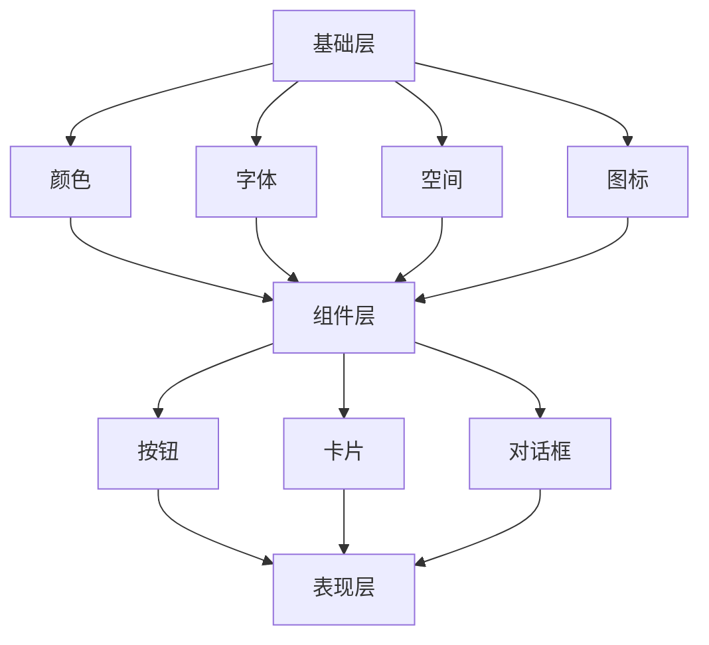

                 

关键词：Android、材料设计、高级功能、用户界面、开发框架

> 摘要：本文深入探讨了Android系统中的材料设计原则和高级功能，包括其历史背景、核心概念、实现方法以及应用场景。通过详细的讲解和实例分析，帮助开发者更好地理解和应用这些技术和工具，提升Android应用的性能和用户体验。

## 1. 背景介绍

Android作为全球最流行的移动操作系统，其发展历程与智能手机行业的演进紧密相连。自从2008年第一台Android手机发布以来，Android系统经历了多次重大的更新和迭代。每一次更新都带来了新的设计理念、功能增强和用户体验改进。

材料设计（Material Design）是由Google提出的一套设计语言，它旨在为移动和桌面平台提供一致且美观的用户界面。材料设计不仅继承了传统的Web和移动设计元素，还引入了全新的设计理念和交互方式。自2014年发布以来，材料设计已经成为Android开发中不可或缺的一部分。

随着技术的不断进步，Android系统在功能上也不断丰富。从基本的通信、媒体播放到复杂的AI、机器学习，Android平台提供了丰富的开发工具和API，使得开发者可以轻松地创建高度定制化和高性能的应用程序。

## 2. 核心概念与联系

### 2.1 材料设计的核心概念

材料设计基于五个核心原则：反馈、运动、深度、颜色和字体。这些原则共同构成了一个统一且富有表现力的视觉语言。

- **反馈**：用户进行操作时，界面应提供即时且清晰的反馈，以增强用户的信心和满意度。
- **运动**：动画和过渡是材料设计的重要组成部分，它们用于引导用户、强调操作和提供上下文。
- **深度**：通过阴影和层次感，材料设计使得界面元素具有立体感和层次感，从而提升可读性和易用性。
- **颜色**：颜色用于传达意义、情感和品牌特色。在材料设计中，颜色被用来区分不同的功能区域和状态。
- **字体**：Google Sans是材料设计的默认字体，它具有清晰易读、简洁美观的特点。

### 2.2 材料设计架构

材料设计的架构由多个层级组成，包括基础层、组件层和表现层。基础层包括颜色、字体、空间和图标等基本元素；组件层包括按钮、卡片、对话框等可重用的UI组件；表现层则是具体的应用界面。

### 2.3 Mermaid 流程图

下面是材料设计架构的Mermaid流程图：



## 3. 核心算法原理 & 具体操作步骤

### 3.1 算法原理概述

材料设计背后的核心算法主要包括布局算法、动画算法和交互算法。

- **布局算法**：用于确定UI元素在屏幕上的位置和大小。材料设计采用了弹性布局，使得UI元素能够自适应不同屏幕尺寸和分辨率。
- **动画算法**：通过动画过渡，提升用户的操作体验。动画分为显式动画和隐式动画，显式动画由开发者手动编写，隐式动画则由系统自动处理。
- **交互算法**：用于处理用户的操作行为，如点击、滑动等。交互算法通过反馈机制，增强用户的操作信心和满意度。

### 3.2 算法步骤详解

- **布局算法**：使用约束布局（ConstraintLayout）来定义UI元素的相对位置和大小。通过设置约束条件，实现元素之间的自动对齐和布局。
- **动画算法**：使用动画API（如Animation、Transition）来创建动画效果。通过设置动画属性（如持续时间、延迟、重复次数等），实现自定义动画。
- **交互算法**：通过监听器（如OnClickListener、OnTouchListener）来处理用户的交互行为。通过设置不同的交互行为，如按钮点击、滑动操作等，实现丰富的交互效果。

### 3.3 算法优缺点

- **优点**：
  - 提高用户体验：通过动画和反馈，增强用户操作信心和满意度。
  - 提高开发效率：通过组件化和布局的标准化，减少重复代码，提高开发速度。
  - 适应不同设备：通过弹性布局，实现UI元素在不同设备上的自适应。

- **缺点**：
  - 学习成本较高：材料设计需要开发者具备一定的设计素养和编程技巧。
  - 需要额外资源：动画和过渡效果需要额外的计算资源，可能会影响应用的性能。

### 3.4 算法应用领域

材料设计广泛应用于Android应用的开发，包括但不限于：
- 移动应用：如社交媒体、电子商务、金融应用等。
- 桌面应用：如Google Chrome、Android Studio等。
- 可穿戴设备：如Android Wear、Android TV等。

## 4. 数学模型和公式 & 详细讲解 & 举例说明

### 4.1 数学模型构建

材料设计中的数学模型主要包括以下几个方面：

- **线性代数**：用于计算UI元素的位置、大小和变换。
- **概率论**：用于计算用户的操作行为和交互效果。
- **统计学**：用于分析用户的操作数据，优化UI设计。

### 4.2 公式推导过程

- **线性代数公式**：如矩阵乘法、向量加法等，用于计算UI元素的位置和大小。
- **概率论公式**：如条件概率、贝叶斯公式等，用于计算用户的操作行为。
- **统计学公式**：如均值、方差等，用于分析用户的操作数据。

### 4.3 案例分析与讲解

以材料设计中的动画算法为例，其数学模型如下：

- **时间函数**：$$t(t) = \frac{1}{2}at^2 + vt + x$$
  - 其中，$a$ 为加速度，$v$ 为初速度，$t$ 为时间，$x$ 为位置。
- **位移函数**：$$s(t) = \frac{1}{3}at^3 + \frac{1}{2}vt^2 + xt$$
  - 其中，$s$ 为位移。

通过这两个公式，可以计算动画在任意时间点的位置和速度。

### 4.4 案例分析与讲解

假设一个简单的动画，从位置$(0, 0)$开始，以加速度$2m/s^2$匀加速直线运动，经过时间$2s$到达位置$(4, 0)$。

- **时间函数**：$$t(t) = \frac{1}{2} \cdot 2t^2 + 0t + 0 = t^2$$
  - 在$t=2s$时，$t(t)=4$，位置为$(4, 0)$。
- **位移函数**：$$s(t) = \frac{1}{3} \cdot 2t^3 + \frac{1}{2} \cdot 0t^2 + 0t = \frac{2}{3}t^3$$
  - 在$t=2s$时，$s(t)=\frac{2}{3} \cdot 8 = \frac{16}{3}$，位移为$(\frac{16}{3}, 0)$。

通过这两个公式，可以计算动画在任意时间点的位置和速度。

## 5. 项目实践：代码实例和详细解释说明

### 5.1 开发环境搭建

为了实践材料设计，我们需要搭建一个Android开发环境。以下是具体的步骤：

1. 安装Android Studio，这是一个官方的Android集成开发环境。
2. 配置Android SDK，包括各种API和工具。
3. 创建一个新的Android项目，选择合适的API级别和模板。

### 5.2 源代码详细实现

以下是实现一个简单的材料设计按钮的示例代码：

```java
import android.app.Activity;
import android.os.Bundle;
import android.view.View;
import android.widget.Button;

public class MainActivity extends Activity {

    @Override
    protected void onCreate(Bundle savedInstanceState) {
        super.onCreate(savedInstanceState);
        setContentView(R.layout.activity_main);

        Button button = findViewById(R.id.button);
        button.setOnClickListener(new View.OnClickListener() {
            @Override
            public void onClick(View v) {
                // 点击按钮后的操作
                System.out.println("按钮被点击！");
            }
        });
    }
}
```

### 5.3 代码解读与分析

- **布局文件**：`activity_main.xml`，定义了一个简单的按钮布局。
- **MainActivity.java**：主活动类，创建了按钮并设置了点击监听器。

通过这个简单的例子，我们可以看到材料设计的基本实现过程。接下来，我们将进一步深入，实现更复杂的UI组件和动画效果。

### 5.4 运行结果展示

在运行上述代码后，我们可以在模拟器或真实设备上看到一个按钮。点击按钮时，会打印出“按钮被点击！”的日志信息。

## 6. 实际应用场景

### 6.1 社交应用

社交应用通常需要丰富的交互和动态效果来提升用户体验。例如，用户发布动态时，可以使用材料设计的动画来展示动态的创建和更新过程。

### 6.2 电子商务应用

电子商务应用中，材料设计可以帮助用户更好地浏览和购买商品。例如，商品列表可以使用卡片布局，用户点击卡片可以查看商品详情，同时使用动画效果来增强用户的操作体验。

### 6.3 金融应用

金融应用需要提供稳定和安全的环境，同时要确保信息的易读性。材料设计可以帮助金融应用实现清晰的界面布局和流畅的交互效果，提升用户的操作效率和满意度。

## 7. 工具和资源推荐

### 7.1 学习资源推荐

- **《Android Material Design 开发实战》**：这本书详细介绍了材料设计的核心概念和实践方法。
- **Google Material Design 官网**：提供最新的设计指南和资源。

### 7.2 开发工具推荐

- **Android Studio**：官方集成开发环境，提供丰富的开发工具和调试功能。
- **Material UI 库**：提供了一系列的材料设计组件和样式，可以方便地集成到项目中。

### 7.3 相关论文推荐

- **"Material Design: A Brief History of Time"**：介绍了材料设计的历史和演变。
- **"Android Material Design 开发实践"**：探讨了材料设计在实际应用中的实现方法和技巧。

## 8. 总结：未来发展趋势与挑战

### 8.1 研究成果总结

材料设计在Android应用开发中取得了显著的成果，提升了用户体验和开发效率。随着技术的进步，材料设计将继续发展，引入更多丰富的交互和动态效果。

### 8.2 未来发展趋势

- **更智能的交互**：结合人工智能技术，实现更智能的交互体验。
- **更高效的开发**：引入自动化工具和框架，提高开发效率和代码质量。
- **更广泛的应用**：材料设计将扩展到更多平台和设备，如物联网、可穿戴设备等。

### 8.3 面临的挑战

- **兼容性问题**：不同设备和操作系统之间的兼容性需要解决。
- **性能优化**：动画和交互效果需要高效地实现，以避免性能问题。

### 8.4 研究展望

未来，材料设计将更注重用户体验的个性化和服务优化。通过不断的技术创新，材料设计将为开发者提供更强大的工具，为用户带来更加丰富和个性化的交互体验。

## 9. 附录：常见问题与解答

### 9.1 材料设计是什么？

材料设计是由Google提出的一套设计语言，旨在为移动和桌面平台提供一致且美观的用户界面。

### 9.2 材料设计的核心原则有哪些？

材料设计的核心原则包括反馈、运动、深度、颜色和字体。

### 9.3 如何在Android项目中应用材料设计？

在Android项目中应用材料设计，可以通过使用官方的Material UI库、自定义布局文件和实现动画效果来实现。

### 9.4 材料设计有什么优点和缺点？

材料设计的优点包括提升用户体验、提高开发效率和适应不同设备。缺点包括学习成本较高和需要额外资源。

---

作者：禅与计算机程序设计艺术 / Zen and the Art of Computer Programming

