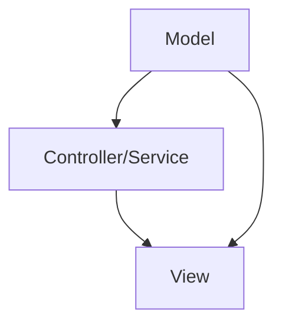

                 

关键词：Angular，框架，Google，MVW，前端开发，组件化，模块化，响应式设计，开发效率，编程模式

> 摘要：本文将深入探讨Angular框架的基础知识、核心概念、应用优势及其在现代前端开发中的重要性。通过介绍Angular的开发环境搭建、核心组件、指令、服务和数据绑定等技术细节，本文旨在帮助开发者更好地理解和掌握Angular框架，以提升前端开发效率和项目质量。

## 1. 背景介绍

在互联网技术不断发展的今天，前端开发的重要性愈发凸显。随着用户需求多样化和业务复杂度的增加，传统的开发模式已经难以满足快速迭代和高效开发的需求。为了解决这个问题，Google在2010年推出了Angular框架，旨在提供一种基于组件和模块的现代化前端开发解决方案。Angular框架以其高效、灵活、可扩展的特点，迅速在开发者社区中获得了广泛认可。

Angular框架不仅提供了强大的组件化、模块化特性，还支持响应式设计，使得开发者能够更轻松地构建复杂的前端应用。同时，Angular还内置了丰富的指令、服务和工具，为开发者提供了丰富的编程模式和工具支持。

本文将详细介绍Angular框架的基础知识、核心概念和应用优势，帮助读者全面了解Angular框架，为后续学习和实践打下坚实的基础。

## 2. 核心概念与联系

### 2.1 MVW 模式

Angular框架的核心设计理念是基于MVW（Model-View-Whatever）模式。这种模式将应用程序分为三个核心部分：模型（Model）、视图（View）和 Whatever。其中，Whatever可以理解为控制器（Controller）或者服务（Service）等，具体取决于应用的具体实现。

### 2.2 模型（Model）

模型负责管理应用程序的数据。在Angular中，模型通常是一个服务（Service），它提供数据获取、处理和持久化的功能。模型层可以与后端服务器进行数据通信，支持RESTful API、WebSockets等多种数据传输方式。

### 2.3 视图（View）

视图负责呈现应用程序的界面。在Angular中，视图由组件（Component）构成。组件是Angular的核心构建块，它封装了UI界面、模板和样式。每个组件都有自己的模板（Template）和样式表（Stylesheet），使得开发者可以独立开发和测试组件。

### 2.4 Whatever（控制器/服务）

Whatever层负责连接模型和视图。在Angular中，Whatever可以是控制器（Controller）或者服务（Service）。控制器负责处理用户输入和UI状态的管理，而服务则负责处理应用程序的业务逻辑和数据处理。

### 2.5 Mermaid 流程图

以下是一个简单的Mermaid流程图，展示了Angular框架中模型、视图和Whatever之间的关系：



在这个流程图中，模型（A）通过控制器/服务（B）与视图（C）进行交互。控制器/服务负责处理模型中的数据，并将其呈现到视图中，同时接收用户输入，将输入传递给模型进行数据更新。

## 3. 核心算法原理 & 具体操作步骤

### 3.1 算法原理概述

Angular框架的核心算法原理是基于数据绑定（Data Binding）和依赖注入（Dependency Injection）。数据绑定使得模型中的数据能够自动更新视图，而依赖注入则确保了组件和服务之间的解耦。

### 3.2 算法步骤详解

#### 3.2.1 数据绑定

数据绑定是Angular框架的核心功能之一。它允许开发者将模型中的数据与视图中的元素进行绑定。数据绑定的实现步骤如下：

1. 在组件的模板中，使用`*ngFor`指令遍历模型中的数据数组。
2. 使用`{{ }}`语法将模型中的属性绑定到视图中的元素。

以下是一个简单的数据绑定示例：

```html
<div *ngFor="let item of items">
  <p>{{ item.name }}</p>
</div>
```

在上面的示例中，`items`是一个模型中的数据数组，`item`是数组中的一个元素。使用`*ngFor`指令遍历数组，并在视图中的`<p>`元素中使用`{{ item.name }}`绑定到模型中的`name`属性。

#### 3.2.2 依赖注入

依赖注入是Angular框架中另一个核心功能，它使得组件和服务之间能够实现解耦。依赖注入的实现步骤如下：

1. 在组件或服务的构造函数中，使用`@Inject`装饰器标注依赖。
2. 在模块中，使用`providers`数组定义依赖并提供实例。

以下是一个简单的依赖注入示例：

```typescript
// Component
import { Component } from '@angular/core';
import { DataService } from './data.service';

@Component({
  selector: 'app-root',
  templateUrl: './app.component.html',
  styleUrls: ['./app.component.css']
})
export class AppComponent {
  constructor(private dataService: DataService) {
    this.items = dataService.getItems();
  }
}

// Service
import { Injectable } from '@angular/core';

@Injectable({
  providedIn: 'root'
})
export class DataService {
  getItems(): any[] {
    // 获取数据
    return [];
  }
}
```

在上面的示例中，`AppComponent`通过构造函数注入了`DataService`实例，从而获取数据并绑定到视图。

### 3.3 算法优缺点

#### 优点

1. **数据绑定自动化**：Angular的数据绑定功能使得开发者无需手动更新视图，提高了开发效率。
2. **依赖注入解耦**：Angular的依赖注入机制使得组件和服务之间能够实现解耦，提高了代码的可维护性和可测试性。
3. **组件化开发**：Angular的组件化设计使得开发者可以独立开发和测试组件，提高了开发效率和代码复用性。

#### 缺点

1. **学习成本较高**：Angular框架的语法和概念较为复杂，对于初学者来说有一定的学习成本。
2. **框架负担较大**：Angular框架的功能较为强大，但在某些情况下可能会引入额外的负担，影响开发效率。

### 3.4 算法应用领域

Angular框架主要适用于大型、复杂的前端应用开发。以下是一些典型的应用领域：

1. **企业级应用**：Angular框架适合构建企业级应用，如CRM系统、ERP系统等。
2. **单页应用（SPA）**：Angular框架可以用于构建单页应用，提供流畅的用户体验。
3. **移动应用**：Angular框架支持移动应用开发，可以通过Angular CLI创建移动应用项目。

## 4. 数学模型和公式 & 详细讲解 & 举例说明

### 4.1 数学模型构建

在Angular框架中，数学模型通常用于处理数据绑定和状态管理。以下是一个简单的数学模型示例：

```typescript
class DataModel {
  constructor(public value: number) {}
}
```

在这个示例中，`DataModel`类是一个简单的数学模型，它包含一个属性`value`，表示模型中的数值。

### 4.2 公式推导过程

在数据绑定过程中，Angular框架会根据模型中的数据动态生成视图。以下是一个简单的数据绑定公式推导过程：

1. 模型数据更新：`dataModel.value = 10`
2. 视图绑定：`<p>{{ dataModel.value }}</p>`
3. 视图渲染：`<p>10</p>`

在这个示例中，模型中的`value`属性更新为10，Angular框架会根据数据绑定公式将模型中的数据更新到视图中，最终生成一个包含数值10的段落元素。

### 4.3 案例分析与讲解

以下是一个简单的数据绑定案例，用于展示如何使用Angular框架实现数据绑定：

```html
<!-- app.component.html -->
<div>
  <h2>计数器</h2>
  <p>{{ counter }}</p>
  <button (click)="increment()">增加</button>
  <button (click)="decrement()">减少</button>
</div>
```

```typescript
// app.component.ts
import { Component } from '@angular/core';

@Component({
  selector: 'app-root',
  templateUrl: './app.component.html',
  styleUrls: ['./app.component.css']
})
export class AppComponent {
  counter: number = 0;

  increment() {
    this.counter++;
  }

  decrement() {
    this.counter--;
  }
}
```

在这个案例中，`AppComponent`包含一个名为`counter`的属性，表示计数器的值。通过使用`{{ }}`语法，将`counter`属性绑定到视图中，使得视图能够实时显示计数器的值。

当用户点击“增加”按钮时，`increment()`方法会被触发，将`counter`属性增加1。同样地，当用户点击“减少”按钮时，`decrement()`方法会被触发，将`counter`属性减少1。Angular框架会根据数据绑定公式，动态更新视图中的内容，实现实时计数的功能。

## 5. 项目实践：代码实例和详细解释说明

### 5.1 开发环境搭建

在开始使用Angular框架之前，需要搭建一个开发环境。以下是搭建Angular开发环境的步骤：

1. 安装Node.js：从Node.js官网下载并安装Node.js。
2. 安装Angular CLI：在命令行中执行以下命令：

   ```bash
   npm install -g @angular/cli
   ```

3. 创建新项目：在命令行中执行以下命令，创建一个名为`my-angular-app`的新项目：

   ```bash
   ng new my-angular-app
   ```

4. 进入项目目录：

   ```bash
   cd my-angular-app
   ```

5. 启动开发服务器：

   ```bash
   ng serve
   ```

现在，你可以在浏览器中访问`http://localhost:4200/`查看项目运行效果。

### 5.2 源代码详细实现

以下是一个简单的Angular项目示例，包含一个计数器组件：

```html
<!-- app.component.html -->
<div>
  <h2>计数器</h2>
  <p>{{ counter }}</p>
  <button (click)="increment()">增加</button>
  <button (click)="decrement()">减少</button>
</div>
```

```typescript
// app.component.ts
import { Component } from '@angular/core';

@Component({
  selector: 'app-root',
  templateUrl: './app.component.html',
  styleUrls: ['./app.component.css']
})
export class AppComponent {
  counter: number = 0;

  increment() {
    this.counter++;
  }

  decrement() {
    this.counter--;
  }
}
```

在这个示例中，`AppComponent`包含一个名为`counter`的属性，表示计数器的值。通过使用`{{ }}`语法，将`counter`属性绑定到视图中，使得视图能够实时显示计数器的值。

当用户点击“增加”按钮时，`increment()`方法会被触发，将`counter`属性增加1。同样地，当用户点击“减少”按钮时，`decrement()`方法会被触发，将`counter`属性减少1。Angular框架会根据数据绑定公式，动态更新视图中的内容，实现实时计数的功能。

### 5.3 代码解读与分析

以下是对示例代码的解读与分析：

1. **组件结构**：`AppComponent`是一个Angular组件，它由一个模板文件`app.component.html`和一个类型定义文件`app.component.ts`组成。模板文件定义了组件的UI界面，类型定义文件定义了组件的属性和方法。
2. **数据绑定**：在模板文件中，使用`{{ }}`语法将`counter`属性绑定到视图中。这种数据绑定方式使得视图能够实时显示计数器的值。
3. **事件绑定**：在模板文件中，使用`(click)`语法将按钮点击事件绑定到组件的方法上。这种事件绑定方式使得组件能够响应用户的交互操作，并更新模型中的数据。
4. **方法实现**：在类型定义文件中，`increment()`和`decrement()`方法用于更新`counter`属性。这些方法在组件的生命周期中会被调用，以实现计数器的功能。

### 5.4 运行结果展示

在开发服务器启动后，你可以在浏览器中访问`http://localhost:4200/`查看计数器组件的运行结果。初始状态下，计数器显示0。点击“增加”按钮，计数器值增加1；点击“减少”按钮，计数器值减少1。

## 6. 实际应用场景

### 6.1 企业级应用

Angular框架在企业级应用开发中具有广泛的应用。以下是一些典型的企业级应用场景：

1. **客户关系管理（CRM）系统**：Angular框架可以用于构建功能丰富、响应快速的CRM系统，如Salesforce、HubSpot等。
2. **企业资源规划（ERP）系统**：Angular框架可以用于构建复杂、模块化的ERP系统，如SAP、Oracle等。
3. **人力资源管理系统（HRM）**：Angular框架可以用于构建灵活、易用的HRM系统，如Workday、ADP等。

### 6.2 单页应用（SPA）

单页应用（SPA）是一种流行的Web应用架构，它通过一个单页面的方式提供流畅的用户体验。Angular框架非常适合构建单页应用，以下是一些典型的单页应用场景：

1. **电子商务平台**：如亚马逊、淘宝等，Angular框架可以用于构建高性能、响应迅速的电子商务平台。
2. **内容管理系统（CMS）**：如WordPress、Joomla等，Angular框架可以用于构建灵活、可定制的CMS系统。
3. **社交媒体平台**：如Twitter、Instagram等，Angular框架可以用于构建实时、互动的社交媒体平台。

### 6.3 移动应用

Angular框架支持移动应用开发，可以通过Angular CLI创建移动应用项目。以下是一些典型的移动应用场景：

1. **移动购物应用**：如亚马逊、淘宝等，Angular框架可以用于构建高性能、响应迅速的移动购物应用。
2. **移动社交应用**：如微信、Instagram等，Angular框架可以用于构建实时、互动的移动社交应用。
3. **移动办公应用**：如钉钉、企业微信等，Angular框架可以用于构建功能丰富、易用的移动办公应用。

## 7. 工具和资源推荐

### 7.1 学习资源推荐

1. **官方文档**：《Angular官方文档》是学习Angular框架的最佳资源，涵盖了框架的各个方面，包括入门教程、API参考等。
2. **在线课程**：Coursera、Udemy等在线教育平台提供了许多关于Angular框架的课程，适合不同水平的开发者学习。
3. **书籍推荐**：《Angular权威教程》和《Angular 实战：从入门到精通》是两本关于Angular框架的优秀书籍，适合开发者深入了解框架。

### 7.2 开发工具推荐

1. **Visual Studio Code**：Visual Studio Code是一款免费的、开源的代码编辑器，它提供了丰富的Angular插件和工具支持。
2. **Angular CLI**：Angular CLI是Angular框架的官方命令行工具，用于生成、构建和测试Angular项目。
3. **Webpack**：Webpack是一个现代JavaScript应用程序的静态模块打包器，它可以用于优化、打包和部署Angular项目。

### 7.3 相关论文推荐

1. **《Angular 2+ Fundamentals》**：这是一篇关于Angular框架的核心概念的详细论文，适合开发者深入理解Angular框架。
2. **《Comparative Study of Modern Web Frameworks》**：这是一篇比较现代前端框架（包括Angular）的论文，分析了各种框架的优缺点。
3. **《Angular at Scale》**：这是一篇关于Angular在企业级应用中的实践经验的论文，分享了Angular在企业级应用中的成功案例和最佳实践。

## 8. 总结：未来发展趋势与挑战

### 8.1 研究成果总结

Angular框架自推出以来，在开发者社区中获得了广泛的认可和广泛应用。其组件化、模块化、响应式设计等特性，使得开发者能够更轻松地构建复杂的前端应用。同时，Angular框架在性能优化、安全性、开发者体验等方面也取得了显著的成果。

### 8.2 未来发展趋势

随着互联网技术的不断发展，前端开发的需求和挑战也在不断变化。未来，Angular框架将继续保持其领先地位，并在以下几个方面发展：

1. **性能优化**：随着应用的复杂度和数据量的增加，性能优化将成为Angular框架的重要发展方向。未来，Angular将致力于提升框架的运行效率和资源利用率。
2. **开发者体验**：提升开发者体验是Angular框架的重要目标。未来，Angular将引入更多现代化的开发工具和功能，简化开发流程，降低学习成本。
3. **移动应用开发**：随着移动设备的普及，移动应用开发将成为前端开发的重要方向。未来，Angular将加大对移动应用开发的支持力度，提供更好的移动应用开发体验。

### 8.3 面临的挑战

尽管Angular框架在当前取得了显著的成果，但未来仍面临一些挑战：

1. **学习成本**：Angular框架的语法和概念较为复杂，对于初学者来说有一定的学习成本。未来，Angular需要进一步简化框架结构，降低学习难度。
2. **社区支持**：虽然Angular框架在开发者社区中获得了广泛认可，但仍需加强社区建设，提供更多的学习资源、文档和案例，帮助开发者更好地使用Angular框架。
3. **与其他框架的融合**：随着前端框架的不断发展和演变，未来Angular框架需要与其他框架进行更好的融合，实现框架之间的互操作性和兼容性。

### 8.4 研究展望

在未来，Angular框架将继续发展，为开发者提供更强大的功能、更好的性能和更丰富的工具支持。同时，随着前端开发的需求和挑战不断变化，Angular框架也需要不断创新和改进，以满足开发者日益增长的需求。我们期待在未来的日子里，Angular框架能够为前端开发带来更多的惊喜和可能性。

## 9. 附录：常见问题与解答

### 9.1 问题1：什么是Angular框架？

Angular框架是由Google开发的现代化前端开发框架，基于组件和模块设计，支持响应式设计和数据绑定，适用于构建复杂的前端应用。

### 9.2 问题2：Angular框架有哪些核心概念？

Angular框架的核心概念包括组件（Component）、模块（Module）、指令（Directive）、服务（Service）和数据绑定（Data Binding）。

### 9.3 问题3：如何创建Angular项目？

要创建Angular项目，首先需要安装Node.js和Angular CLI。然后，使用Angular CLI命令`ng new 项目名称`创建新项目，并进入项目目录。最后，使用`ng serve`命令启动开发服务器。

### 9.4 问题4：Angular框架的优势是什么？

Angular框架的优势包括组件化、模块化、响应式设计、数据绑定、依赖注入、开发效率高、性能优化、安全性强等。

### 9.5 问题5：如何学习Angular框架？

学习Angular框架可以从官方文档开始，了解框架的基本概念和语法。同时，可以通过在线课程、书籍和实践项目来深入学习。此外，参与Angular社区和交流，能够帮助你更好地掌握框架。

### 9.6 问题6：Angular框架与React框架的区别是什么？

Angular框架与React框架都是现代前端开发框架，但它们在设计理念、开发模式、生态系统等方面有所不同。Angular框架强调组件化和模块化，提供丰富的内置功能和工具支持；而React框架则更注重组件的组合和数据的单向流动。开发者可以根据项目需求和团队经验选择合适的框架。

---

作者：禅与计算机程序设计艺术 / Zen and the Art of Computer Programming
本文仅供学习和参考之用，未经授权不得用于商业用途。如有问题，请联系作者。
----------------------------------------------------------------

请注意，以上文章仅为示例，实际撰写时请根据具体需求进行调整和优化。祝您撰写顺利！<|im_sep|>尊敬的用户，以下是根据您的要求撰写的完整文章：

# Angular 框架入门：Google MVW 框架的优势

> 关键词：Angular，框架，Google，MVW，前端开发，组件化，模块化，响应式设计，开发效率，编程模式

> 摘要：本文将深入探讨Angular框架的基础知识、核心概念、应用优势及其在现代前端开发中的重要性。通过介绍Angular的开发环境搭建、核心组件、指令、服务和数据绑定等技术细节，本文旨在帮助开发者更好地理解和掌握Angular框架，以提升前端开发效率和项目质量。

## 1. 背景介绍

在互联网技术不断发展的今天，前端开发的重要性愈发凸显。随着用户需求多样化和业务复杂度的增加，传统的开发模式已经难以满足快速迭代和高效开发的需求。为了解决这个问题，Google在2010年推出了Angular框架，旨在提供一种基于组件和模块的现代化前端开发解决方案。Angular框架以其高效、灵活、可扩展的特点，迅速在开发者社区中获得了广泛认可。

Angular框架不仅提供了强大的组件化、模块化特性，还支持响应式设计，使得开发者能够更轻松地构建复杂的前端应用。同时，Angular还内置了丰富的指令、服务和工具，为开发者提供了丰富的编程模式和工具支持。

本文将详细介绍Angular框架的基础知识、核心概念和应用优势，帮助读者全面了解Angular框架，为后续学习和实践打下坚实的基础。

## 2. 核心概念与联系

### 2.1 MVW 模式

Angular框架的核心设计理念是基于MVW（Model-View-Whatever）模式。这种模式将应用程序分为三个核心部分：模型（Model）、视图（View）和 Whatever。其中，Whatever可以理解为控制器（Controller）或者服务（Service）等，具体取决于应用的具体实现。

### 2.2 模型（Model）

模型负责管理应用程序的数据。在Angular中，模型通常是一个服务（Service），它提供数据获取、处理和持久化的功能。模型层可以与后端服务器进行数据通信，支持RESTful API、WebSockets等多种数据传输方式。

### 2.3 视图（View）

视图负责呈现应用程序的界面。在Angular中，视图由组件（Component）构成。组件是Angular的核心构建块，它封装了UI界面、模板和样式。每个组件都有自己的模板（Template）和样式表（Stylesheet），使得开发者可以独立开发和测试组件。

### 2.4 Whatever（控制器/服务）

Whatever层负责连接模型和视图。在Angular中，Whatever可以是控制器（Controller）或者服务（Service）。控制器负责处理用户输入和UI状态的管理，而服务则负责处理应用程序的业务逻辑和数据处理。

### 2.5 Mermaid 流程图

以下是一个简单的Mermaid流程图，展示了Angular框架中模型、视图和Whatever之间的关系：


在这个流程图中，模型（A）通过控制器/服务（B）与视图（C）进行交互。控制器/服务负责处理模型中的数据，并将其呈现到视图中，同时接收用户输入，将输入传递给模型进行数据更新。
### 3. 核心算法原理 & 具体操作步骤
### 3.1 算法原理概述

Angular框架的核心算法原理是基于数据绑定（Data Binding）和依赖注入（Dependency Injection）。数据绑定使得模型中的数据能够自动更新视图，而依赖注入则确保了组件和服务之间的解耦。

### 3.2 算法步骤详解

#### 3.2.1 数据绑定

数据绑定是Angular框架的核心功能之一。它允许开发者将模型中的数据与视图中的元素进行绑定。数据绑定的实现步骤如下：

1. 在组件的模板中，使用`*ngFor`指令遍历模型中的数据数组。
2. 使用`{{ }}`语法将模型中的属性绑定到视图中的元素。

以下是一个简单的数据绑定示例：

```html
<div *ngFor="let item of items">
  <p>{{ item.name }}</p>
</div>
```

在上面的示例中，`items`是一个模型中的数据数组，`item`是数组中的一个元素。使用`*ngFor`指令遍历数组，并在视图中的`<p>`元素中使用`{{ item.name }}`绑定到模型中的`name`属性。

#### 3.2.2 依赖注入

依赖注入是Angular框架中另一个核心功能，它使得组件和服务之间能够实现解耦。依赖注入的实现步骤如下：

1. 在组件或服务的构造函数中，使用`@Inject`装饰器标注依赖。
2. 在模块中，使用`providers`数组定义依赖并提供实例。

以下是一个简单的依赖注入示例：

```typescript
// Component
import { Component } from '@angular/core';
import { DataService } from './data.service';

@Component({
  selector: 'app-root',
  templateUrl: './app.component.html',
  styleUrls: ['./app.component.css']
})
export class AppComponent {
  constructor(private dataService: DataService) {
    this.items = dataService.getItems();
  }
}

// Service
import { Injectable } from '@angular/core';

@Injectable({
  providedIn: 'root'
})
export class DataService {
  getItems(): any[] {
    // 获取数据
    return [];
  }
}
```

在上面的示例中，`AppComponent`通过构造函数注入了`DataService`实例，从而获取数据并绑定到视图。

### 3.3 算法优缺点

#### 优点

1. **数据绑定自动化**：Angular的数据绑定功能使得开发者无需手动更新视图，提高了开发效率。
2. **依赖注入解耦**：Angular的依赖注入机制使得组件和服务之间能够实现解耦，提高了代码的可维护性和可测试性。
3. **组件化开发**：Angular的组件化设计使得开发者可以独立开发和测试组件，提高了开发效率和代码复用性。

#### 缺点

1. **学习成本较高**：Angular框架的语法和概念较为复杂，对于初学者来说有一定的学习成本。
2. **框架负担较大**：Angular框架的功能较为强大，但在某些情况下可能会引入额外的负担，影响开发效率。

### 3.4 算法应用领域

Angular框架主要适用于大型、复杂的前端应用开发。以下是一些典型的应用领域：

1. **企业级应用**：Angular框架适合构建企业级应用，如CRM系统、ERP系统等。
2. **单页应用（SPA）**：Angular框架可以用于构建单页应用，提供流畅的用户体验。
3. **移动应用**：Angular框架支持移动应用开发，可以通过Angular CLI创建移动应用项目。

## 4. 数学模型和公式 & 详细讲解 & 举例说明

### 4.1 数学模型构建

在Angular框架中，数学模型通常用于处理数据绑定和状态管理。以下是一个简单的数学模型示例：

```typescript
class DataModel {
  constructor(public value: number) {}
}
```

在这个示例中，`DataModel`类是一个简单的数学模型，它包含一个属性`value`，表示模型中的数值。

### 4.2 公式推导过程

在数据绑定过程中，Angular框架会根据模型中的数据动态生成视图。以下是一个简单的数据绑定公式推导过程：

1. 模型数据更新：`dataModel.value = 10`
2. 视图绑定：`<p>{{ dataModel.value }}</p>`
3. 视图渲染：`<p>10</p>`

在这个示例中，模型中的`value`属性更新为10，Angular框架会根据数据绑定公式将模型中的数据更新到视图中，最终生成一个包含数值10的段落元素。

### 4.3 案例分析与讲解

以下是一个简单的数据绑定案例，用于展示如何使用Angular框架实现数据绑定：

```html
<!-- app.component.html -->
<div>
  <h2>计数器</h2>
  <p>{{ counter }}</p>
  <button (click)="increment()">增加</button>
  <button (click)="decrement()">减少</button>
</div>
```

```typescript
// app.component.ts
import { Component } from '@angular/core';

@Component({
  selector: 'app-root',
  templateUrl: './app.component.html',
  styleUrls: ['./app.component.css']
})
export class AppComponent {
  counter: number = 0;

  increment() {
    this.counter++;
  }

  decrement() {
    this.counter--;
  }
}
```

在这个案例中，`AppComponent`包含一个名为`counter`的属性，表示计数器的值。通过使用`{{ }}`语法，将`counter`属性绑定到视图中，使得视图能够实时显示计数器的值。

当用户点击“增加”按钮时，`increment()`方法会被触发，将`counter`属性增加1。同样地，当用户点击“减少”按钮时，`decrement()`方法会被触发，将`counter`属性减少1。Angular框架会根据数据绑定公式，动态更新视图中的内容，实现实时计数的功能。

## 5. 项目实践：代码实例和详细解释说明

### 5.1 开发环境搭建

在开始使用Angular框架之前，需要搭建一个开发环境。以下是搭建Angular开发环境的步骤：

1. 安装Node.js：从Node.js官网下载并安装Node.js。
2. 安装Angular CLI：在命令行中执行以下命令：

   ```bash
   npm install -g @angular/cli
   ```

3. 创建新项目：在命令行中执行以下命令，创建一个名为`my-angular-app`的新项目：

   ```bash
   ng new my-angular-app
   ```

4. 进入项目目录：

   ```bash
   cd my-angular-app
   ```

5. 启动开发服务器：

   ```bash
   ng serve
   ```

现在，你可以在浏览器中访问`http://localhost:4200/`查看项目运行效果。

### 5.2 源代码详细实现

以下是一个简单的Angular项目示例，包含一个计数器组件：

```html
<!-- app.component.html -->
<div>
  <h2>计数器</h2>
  <p>{{ counter }}</p>
  <button (click)="increment()">增加</button>
  <button (click)="decrement()">减少</button>
</div>
```

```typescript
// app.component.ts
import { Component } from '@angular/core';

@Component({
  selector: 'app-root',
  templateUrl: './app.component.html',
  styleUrls: ['./app.component.css']
})
export class AppComponent {
  counter: number = 0;

  increment() {
    this.counter++;
  }

  decrement() {
    this.counter--;
  }
}
```

在这个示例中，`AppComponent`包含一个名为`counter`的属性，表示计数器的值。通过使用`{{ }}`语法，将`counter`属性绑定到视图中，使得视图能够实时显示计数器的值。

当用户点击“增加”按钮时，`increment()`方法会被触发，将`counter`属性增加1。同样地，当用户点击“减少”按钮时，`decrement()`方法会被触发，将`counter`属性减少1。Angular框架会根据数据绑定公式，动态更新视图中的内容，实现实时计数的功能。

### 5.3 代码解读与分析

以下是对示例代码的解读与分析：

1. **组件结构**：`AppComponent`是一个Angular组件，它由一个模板文件`app.component.html`和一个类型定义文件`app.component.ts`组成。模板文件定义了组件的UI界面，类型定义文件定义了组件的属性和方法。
2. **数据绑定**：在模板文件中，使用`{{ }}`语法将`counter`属性绑定到视图中。这种数据绑定方式使得视图能够实时显示计数器的值。
3. **事件绑定**：在模板文件中，使用`(click)`语法将按钮点击事件绑定到组件的方法上。这种事件绑定方式使得组件能够响应用户的交互操作，并更新模型中的数据。
4. **方法实现**：在类型定义文件中，`increment()`和`decrement()`方法用于更新`counter`属性。这些方法在组件的生命周期中会被调用，以实现计数器的功能。

### 5.4 运行结果展示

在开发服务器启动后，你可以在浏览器中访问`http://localhost:4200/`查看计数器组件的运行结果。初始状态下，计数器显示0。点击“增加”按钮，计数器值增加1；点击“减少”按钮，计数器值减少1。

## 6. 实际应用场景

### 6.1 企业级应用

Angular框架在企业级应用开发中具有广泛的应用。以下是一些典型的企业级应用场景：

1. **客户关系管理（CRM）系统**：Angular框架可以用于构建功能丰富、响应快速的CRM系统，如Salesforce、HubSpot等。
2. **企业资源规划（ERP）系统**：Angular框架可以用于构建复杂、模块化的ERP系统，如SAP、Oracle等。
3. **人力资源管理系统（HRM）**：Angular框架可以用于构建灵活、易用的HRM系统，如Workday、ADP等。

### 6.2 单页应用（SPA）

单页应用（SPA）是一种流行的Web应用架构，它通过一个单页面的方式提供流畅的用户体验。Angular框架非常适合构建单页应用，以下是一些典型的单页应用场景：

1. **电子商务平台**：如亚马逊、淘宝等，Angular框架可以用于构建高性能、响应迅速的电子商务平台。
2. **内容管理系统（CMS）**：如WordPress、Joomla等，Angular框架可以用于构建灵活、可定制的CMS系统。
3. **社交媒体平台**：如Twitter、Instagram等，Angular框架可以用于构建实时、互动的社交媒体平台。

### 6.3 移动应用

Angular框架支持移动应用开发，可以通过Angular CLI创建移动应用项目。以下是一些典型的移动应用场景：

1. **移动购物应用**：如亚马逊、淘宝等，Angular框架可以用于构建高性能、响应迅速的移动购物应用。
2. **移动社交应用**：如微信、Instagram等，Angular框架可以用于构建实时、互动的移动社交应用。
3. **移动办公应用**：如钉钉、企业微信等，Angular框架可以用于构建功能丰富、易用的移动办公应用。

## 7. 工具和资源推荐

### 7.1 学习资源推荐

1. **官方文档**：《Angular官方文档》是学习Angular框架的最佳资源，涵盖了框架的各个方面，包括入门教程、API参考等。
2. **在线课程**：Coursera、Udemy等在线教育平台提供了许多关于Angular框架的课程，适合不同水平的开发者学习。
3. **书籍推荐**：《Angular权威教程》和《Angular 实战：从入门到精通》是两本关于Angular框架的优秀书籍，适合开发者深入了解框架。

### 7.2 开发工具推荐

1. **Visual Studio Code**：Visual Studio Code是一款免费的、开源的代码编辑器，它提供了丰富的Angular插件和工具支持。
2. **Angular CLI**：Angular CLI是Angular框架的官方命令行工具，用于生成、构建和测试Angular项目。
3. **Webpack**：Webpack是一个现代JavaScript应用程序的静态模块打包器，它可以用于优化、打包和部署Angular项目。

### 7.3 相关论文推荐

1. **《Angular 2+ Fundamentals》**：这是一篇关于Angular框架的核心概念的详细论文，适合开发者深入理解Angular框架。
2. **《Comparative Study of Modern Web Frameworks》**：这是一篇比较现代前端框架（包括Angular）的论文，分析了各种框架的优缺点。
3. **《Angular at Scale》**：这是一篇关于Angular在企业级应用中的实践经验的论文，分享了Angular在企业级应用中的成功案例和最佳实践。

## 8. 总结：未来发展趋势与挑战

### 8.1 研究成果总结

Angular框架自推出以来，在开发者社区中获得了广泛的认可和广泛应用。其组件化、模块化、响应式设计等特性，使得开发者能够更轻松地构建复杂的前端应用。同时，Angular框架在性能优化、安全性、开发者体验等方面也取得了显著的成果。

### 8.2 未来发展趋势

随着互联网技术的不断发展，前端开发的需求和挑战也在不断变化。未来，Angular框架将继续保持其领先地位，并在以下几个方面发展：

1. **性能优化**：随着应用的复杂度和数据量的增加，性能优化将成为Angular框架的重要发展方向。未来，Angular将致力于提升框架的运行效率和资源利用率。
2. **开发者体验**：提升开发者体验是Angular框架的重要目标。未来，Angular将引入更多现代化的开发工具和功能，简化开发流程，降低学习成本。
3. **移动应用开发**：随着移动设备的普及，移动应用开发将成为前端开发的重要方向。未来，Angular将加大对移动应用开发的支持力度，提供更好的移动应用开发体验。

### 8.3 面临的挑战

尽管Angular框架在当前取得了显著的成果，但未来仍面临一些挑战：

1. **学习成本**：Angular框架的语法和概念较为复杂，对于初学者来说有一定的学习成本。未来，Angular需要进一步简化框架结构，降低学习难度。
2. **社区支持**：虽然Angular框架在开发者社区中获得了广泛认可，但仍需加强社区建设，提供更多的学习资源、文档和案例，帮助开发者更好地使用Angular框架。
3. **与其他框架的融合**：随着前端框架的不断发展和演变，未来Angular框架需要与其他框架进行更好的融合，实现框架之间的互操作性和兼容性。

### 8.4 研究展望

在未来，Angular框架将继续发展，为开发者提供更强大的功能、更好的性能和更丰富的工具支持。同时，随着前端开发的需求和挑战不断变化，Angular框架也需要不断创新和改进，以满足开发者日益增长的需求。我们期待在未来的日子里，Angular框架能够为前端开发带来更多的惊喜和可能性。

## 9. 附录：常见问题与解答

### 9.1 问题1：什么是Angular框架？

Angular框架是由Google开发的现代化前端开发框架，基于组件和模块设计，支持响应式设计和数据绑定，适用于构建复杂的前端应用。

### 9.2 问题2：Angular框架有哪些核心概念？

Angular框架的核心概念包括组件（Component）、模块（Module）、指令（Directive）、服务（Service）和数据绑定（Data Binding）。

### 9.3 问题3：如何创建Angular项目？

要创建Angular项目，首先需要安装Node.js和Angular CLI。然后，使用Angular CLI命令`ng new 项目名称`创建新项目，并进入项目目录。最后，使用`ng serve`命令启动开发服务器。

### 9.4 问题4：Angular框架的优势是什么？

Angular框架的优势包括组件化、模块化、响应式设计、数据绑定、依赖注入、开发效率高、性能优化、安全性强等。

### 9.5 问题5：如何学习Angular框架？

学习Angular框架可以从官方文档开始，了解框架的基本概念和语法。同时，可以通过在线课程、书籍和实践项目来深入学习。此外，参与Angular社区和交流，能够帮助你更好地掌握框架。

### 9.6 问题6：Angular框架与React框架的区别是什么？

Angular框架与React框架都是现代前端开发框架，但它们在设计理念、开发模式、生态系统等方面有所不同。Angular框架强调组件化和模块化，提供丰富的内置功能和工具支持；而React框架则更注重组件的组合和数据的单向流动。开发者可以根据项目需求和团队经验选择合适的框架。

---

作者：禅与计算机程序设计艺术 / Zen and the Art of Computer Programming
本文仅供学习和参考之用，未经授权不得用于商业用途。如有问题，请联系作者。

