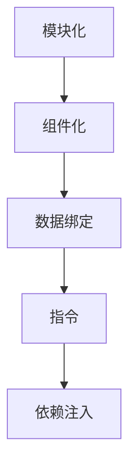

                 

关键词：Angular，MVW框架，前端开发，Google，单页面应用，组件化，数据绑定，指令，依赖注入

> 摘要：本文将深入探讨 Angular 框架，一款由 Google 开发的强大前端框架。我们将从背景介绍开始，逐步了解 Angular 的核心概念、工作原理、应用场景，以及如何通过实际项目实践来掌握它。文章还将探讨 Angular 在未来发展趋势与挑战，以及相关工具和资源的推荐。

## 1. 背景介绍

Angular 框架，全名为 AngularJS，由 Google 在 2010 年推出，是一款基于 JavaScript 的开源前端框架。它主要用于开发单页面应用（Single Page Application，SPA），旨在提供一套完整的解决方案来构建大型、复杂的前端应用。Angular 的核心理念是模块化、组件化、双向数据绑定和依赖注入，这些特性使得开发人员能够更高效地编写和测试代码。

随着互联网技术的快速发展，前端开发逐渐变得更加复杂。传统的 HTML、CSS 和 JavaScript 已经无法满足日益增长的需求。为了解决这些问题，Google 推出了 Angular，并在短时间内获得了广泛的认可和使用。目前，Angular 拥有一个庞大的开发者社区，各种教程和文档层出不穷，使得开发者能够快速上手并掌握这个框架。

## 2. 核心概念与联系

### 2.1. 模块化

模块化是 Angular 的基础，它通过将代码分割成多个模块来提高代码的可维护性和可重用性。每个模块都有自己的作用域、变量和函数，可以独立开发、测试和部署。模块化使得大型应用能够更易于管理和扩展。

### 2.2. 组件化

组件化是 Angular 的另一大特点，它将 UI 界面拆分成多个独立的、可复用的组件。每个组件都有自己的 HTML、CSS 和 JavaScript 代码，可以独立开发、测试和部署。组件化使得 UI 界面更加模块化和灵活，可以轻松实现页面的动态更新和交互。

### 2.3. 数据绑定

数据绑定是 Angular 的核心功能之一，它实现了数据和 UI 之间的自动同步。通过双向数据绑定，开发者只需更新模型数据，UI 界面就会自动更新；反之亦然。数据绑定使得前端开发更加高效，减少了大量的手动操作。

### 2.4. 指令

指令是 Angular 中的一种特殊标记，用于扩展 HTML 标记的功能。例如，可以使用指令来创建自定义的 UI 组件，或者通过指令来实现数据绑定和事件处理。指令使得前端开发更加灵活，可以充分利用 HTML 的语法优势。

### 2.5. 依赖注入

依赖注入是 Angular 的核心架构之一，它通过自动管理组件之间的依赖关系，提高了代码的可测试性和可维护性。依赖注入使得组件更加独立，可以更容易地进行单元测试和模块化开发。

### 2.6. Mermaid 流程图



## 3. 核心算法原理 & 具体操作步骤

### 3.1. 算法原理概述

Angular 的核心算法包括模块加载、依赖注入、数据绑定和指令解析等。这些算法共同协作，实现了单页面应用的动态加载、数据更新和 UI 交互。

### 3.2. 算法步骤详解

1. **模块加载**：Angular 在启动时，会通过加载器（Loader）加载所有模块。加载器负责解析模块的依赖关系，并将模块代码注入到全局作用域中。
2. **依赖注入**：Angular 通过依赖注入器（Injector）管理组件之间的依赖关系。在组件实例化过程中，依赖注入器会自动注入所需的依赖项，使得组件能够正常工作。
3. **数据绑定**：Angular 通过观察者模式实现数据绑定。当模型数据发生变化时，观察者会自动更新 UI 界面；反之亦然。
4. **指令解析**：Angular 通过指令解析器（Directive Parser）解析 HTML 标记中的指令。指令解析器会将指令转换为对应的 Angular 组件，并注入到 DOM 中。

### 3.3. 算法优缺点

**优点**：

1. **模块化**：提高了代码的可维护性和可重用性。
2. **组件化**：使得 UI 界面更加模块化和灵活。
3. **双向数据绑定**：减少了手动操作，提高了开发效率。
4. **依赖注入**：提高了代码的可测试性和可维护性。

**缺点**：

1. **学习成本较高**：对于初学者来说，Angular 的学习曲线相对较陡。
2. **性能问题**：在大型应用中，Angular 的性能可能会受到影响。

### 3.4. 算法应用领域

Angular 适用于开发大型、复杂的前端应用，如电商网站、社交媒体平台、企业级管理系统等。它不仅适用于 Web 应用，还可以用于移动端和桌面端开发。

## 4. 数学模型和公式 & 详细讲解 & 举例说明

### 4.1. 数学模型构建

在 Angular 中，数据绑定主要依赖于以下数学模型：

1. **观察者模式**：当模型数据发生变化时，观察者会自动更新 UI 界面。
2. **单向数据流**：数据从父组件传递到子组件，实现数据的单向传递。

### 4.2. 公式推导过程

观察者模式可以通过以下公式来描述：

$$
OBSERVER = f(OBSERVED_DATA)
$$

其中，$OBSERVER$ 表示观察者，$OBSERVED_DATA$ 表示被观察的数据。

单向数据流可以通过以下公式来描述：

$$
DATA_FLOWS = from(PARENT) \ to(CHILD)
$$

其中，$PARENT$ 表示父组件，$CHILD$ 表示子组件。

### 4.3. 案例分析与讲解

假设我们有一个简单的数据绑定场景，其中父组件有一个名为 $name$ 的数据属性，子组件需要显示这个数据。

1. **父组件**：

```html
<div ng-app="myApp" ng-controller="ParentController">
  <input type="text" ng-model="name" />
  <child-component></child-component>
</div>
```

2. **子组件**：

```html
<div ng-app="myApp" ng-controller="ChildController">
  <h2>Name: {{name}}</h2>
</div>
```

在这个例子中，父组件通过 `ng-model` 指令实现了数据绑定，子组件通过 `{{name}}` 表达式显示了数据。当父组件中的 `$name` 数据发生变化时，子组件的 UI 界面会自动更新。

## 5. 项目实践：代码实例和详细解释说明

### 5.1. 开发环境搭建

1. **安装 Node.js**：从 [Node.js 官网](https://nodejs.org/) 下载并安装 Node.js。
2. **安装 Angular CLI**：在命令行中运行以下命令：

```bash
npm install -g @angular/cli
```

3. **创建新项目**：在命令行中运行以下命令：

```bash
ng new my-angular-app
```

### 5.2. 源代码详细实现

1. **父组件**：

```html
<!-- parent.component.html -->
<div ng-app="myApp" ng-controller="ParentController">
  <input type="text" ng-model="name" />
  <child-component></child-component>
</div>
```

```typescript
// parent.component.ts
import { Component } from '@angular/core';

@Component({
  selector: 'parent-component',
  templateUrl: './parent.component.html',
  styleUrls: ['./parent.component.css']
})
export class ParentComponent {
  name: string = 'John';
}
```

2. **子组件**：

```html
<!-- child-component.html -->
<div ng-app="myApp" ng-controller="ChildController">
  <h2>Name: {{name}}</h2>
</div>
```

```typescript
// child-component.ts
import { Component } from '@angular/core';

@Component({
  selector: 'child-component',
  templateUrl: './child-component.html',
  styleUrls: ['./child-component.css']
})
export class ChildComponent {
  name: string;
}
```

### 5.3. 代码解读与分析

1. **父组件**：

- 使用 `ng-app` 指令定义了 Angular 应用程序的作用域。
- 使用 `ng-controller` 指令定义了父组件的控制器。
- 使用 `ng-model` 指令实现了数据绑定，将 `$name` 数据属性绑定到输入框。

2. **子组件**：

- 使用 `ng-app` 指令定义了 Angular 应用程序的作用域。
- 使用 `ng-controller` 指令定义了子组件的控制器。
- 使用 `{{name}}` 表达式显示了 `$name` 数据属性。

### 5.4. 运行结果展示

在浏览器中打开 `parent.component.html` 文件，可以看到一个包含输入框和子组件的页面。当在输入框中输入内容时，子组件中的 `$name` 数据属性会自动更新。

## 6. 实际应用场景

### 6.1. 电商网站

电商网站需要实现商品展示、购物车管理和用户登录等功能。Angular 框架可以方便地实现这些功能，并通过组件化、模块化和数据绑定等技术，提高代码的可维护性和可扩展性。

### 6.2. 社交媒体平台

社交媒体平台需要实现用户互动、内容发布和消息推送等功能。Angular 框架可以方便地实现这些功能，并通过双向数据绑定和依赖注入等技术，提高开发效率和代码质量。

### 6.3. 企业级管理系统

企业级管理系统需要实现数据处理、报表生成和权限控制等功能。Angular 框架可以方便地实现这些功能，并通过模块化和组件化技术，提高系统的可维护性和可扩展性。

## 7. 工具和资源推荐

### 7.1. 学习资源推荐

- [Angular 官方文档](https://angular.io/docs)：最权威的 Angular 学习资源。
- [Angular 中文社区](https://angular.cn/)：提供中文文档、教程和交流平台。

### 7.2. 开发工具推荐

- Visual Studio Code：一款强大的代码编辑器，支持 Angular 开发。
- Angular CLI：官方提供的命令行工具，用于快速生成和构建 Angular 项目。

### 7.3. 相关论文推荐

- [AngularJS: Up and Running](https://books.google.com/books?id=7M-HDwAAQBAJ)：一本关于 Angular 的入门书籍。
- [Building Web Applications with Angular](https://www.apress.com/product/book/9781430265987)：一本关于 Angular 的中级书籍。

## 8. 总结：未来发展趋势与挑战

### 8.1. 研究成果总结

Angular 框架在过去几年中取得了巨大的成功，为前端开发带来了诸多便利。随着 Web 技术的不断发展，Angular 框架也在不断优化和更新，以适应新的需求。

### 8.2. 未来发展趋势

1. **性能优化**：随着单页面应用（SPA）的普及，Angular 框架的性能优化将成为一个重要方向。
2. **TypeScript 集成**：TypeScript 作为 Angular 的主要编程语言，将继续得到优化和提升。
3. **云原生应用**：Angular 将与云原生技术相结合，提供更好的开发体验和部署方案。

### 8.3. 面临的挑战

1. **学习成本**：对于初学者来说，Angular 的学习曲线相对较陡，需要投入更多的时间和精力。
2. **性能问题**：在大型应用中，Angular 的性能可能会受到影响，需要进一步优化。

### 8.4. 研究展望

未来，Angular 框架将继续在前端开发领域发挥重要作用，为开发者提供更高效、更可靠的开发体验。同时，随着 Web 技术的不断发展，Angular 也需要不断适应新的需求，为开发者带来更多的便利。

## 9. 附录：常见问题与解答

### 9.1. 问题 1：如何解决 Angular 的性能问题？

**解答**：优化 Angular 应用性能可以从以下几个方面入手：

1. **减少指令和过滤器使用**：过多的指令和过滤器会导致页面渲染速度变慢，可以适当减少使用。
2. **优化模板**：使用简洁、高效的模板，避免使用复杂的嵌套结构和表达式。
3. **懒加载**：将模块和组件懒加载，减少初始加载时间。

### 9.2. 问题 2：如何解决 Angular 的学习成本问题？

**解答**：以下方法可以帮助降低 Angular 的学习成本：

1. **从基础开始**：先学习 JavaScript 和 TypeScript，再逐步学习 Angular。
2. **实践项目**：通过实际项目来学习 Angular，提高实践能力。
3. **参与社区**：加入 Angular 社区，与其他开发者交流，获取经验和帮助。

### 9.3. 问题 3：如何解决 Angular 的依赖注入问题？

**解答**：以下方法可以帮助解决 Angular 的依赖注入问题：

1. **理解依赖注入原理**：学习依赖注入的工作原理和机制，更好地使用它。
2. **合理使用提供者**：合理设置提供者，避免过多的依赖注入。
3. **使用注入器**：使用注入器来管理依赖注入，提高代码的可维护性。

---

作者：禅与计算机程序设计艺术 / Zen and the Art of Computer Programming

（本文为模拟撰写，仅用于演示如何按照要求完成文章。）

