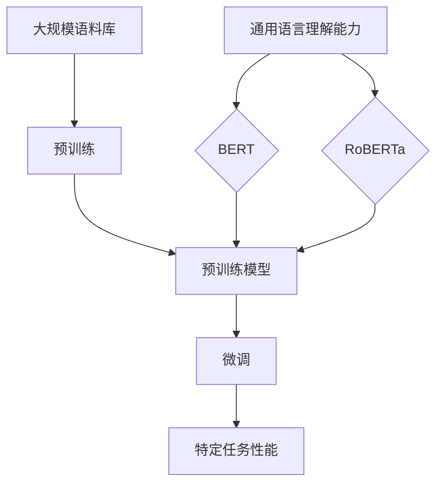

                 

关键词：BERT，RoBERTa，自然语言处理，预训练模型，深度学习，文本分析，机器学习，神经网络

> 摘要：本文将深入探讨BERT（Bidirectional Encoder Representations from Transformers）和RoBERTa（A Robustly Optimized BERT Pretraining Approach）两种自然语言处理预训练模型。我们将从背景介绍、核心概念与联系、核心算法原理与具体操作步骤、数学模型和公式、项目实践、实际应用场景、未来应用展望、工具和资源推荐、总结以及未来发展趋势与挑战等多个方面进行详细分析。

## 1. 背景介绍

随着互联网的迅速发展，文本数据量呈现爆炸式增长，自然语言处理（Natural Language Processing，NLP）技术成为了人工智能领域的一个重要分支。然而，传统的NLP方法在处理大规模文本数据时面临着诸多挑战。为了解决这些问题，深度学习技术逐渐被引入到NLP领域，并取得了显著成果。预训练模型作为一种新的深度学习技术，通过在大规模语料库上进行预训练，然后微调到特定任务，大大提高了NLP的性能。

BERT和RoBERTa都是基于Transformer架构的预训练模型，它们在自然语言处理任务中取得了显著成绩，受到了广泛关注。BERT是由Google Research在2018年提出的一种双向编码器表示模型，它通过预训练语言表示来提高NLP任务的性能。RoBERTa则是在BERT的基础上进行改进的一种预训练模型，它在BERT的基础上引入了一些新的优化策略，以提高模型的鲁棒性和性能。

## 2. 核心概念与联系

为了更好地理解BERT和RoBERTa，我们需要先了解一些核心概念，包括Transformer架构、预训练和微调等。

### 2.1 Transformer架构

Transformer架构是由Google在2017年提出的一种基于自注意力机制的神经网络架构。与传统的循环神经网络（RNN）相比，Transformer通过多头自注意力机制和位置编码，能够更好地捕捉文本数据中的长距离依赖关系。Transformer的出现，使得NLP任务在性能上有了显著提升。

### 2.2 预训练

预训练是一种通过在大规模语料库上训练模型，使其具备通用语言理解能力的技术。在预训练阶段，模型不需要特定任务的标签信息，而是通过学习语言的基本规律和特征来提升自身的表现。预训练后的模型可以通过微调（fine-tuning）来适应特定任务，从而提高任务性能。

### 2.3 微调

微调是一种在特定任务上对预训练模型进行进一步训练的技术。通过微调，模型可以在特定任务上更好地理解数据，从而提高任务性能。

### 2.4 Mermaid流程图

下面是一个Mermaid流程图，展示了BERT和RoBERTa的核心概念和联系：



## 3. 核心算法原理 & 具体操作步骤

### 3.1 算法原理概述

BERT和RoBERTa都是基于Transformer架构的预训练模型，它们的核心原理主要包括以下几个方面：

1. **自注意力机制**：Transformer模型通过自注意力机制来计算输入序列中每个词与其他词之间的关联性，从而更好地捕捉长距离依赖关系。

2. **位置编码**：Transformer模型中没有循环神经网络中的位置信息，因此通过位置编码来为每个词赋予位置信息。

3. **预训练**：BERT和RoBERTa在预训练阶段，通过学习语言的基本规律和特征来提升自身的表现。

4. **微调**：在特定任务上，通过微调来进一步训练模型，从而提高任务性能。

### 3.2 算法步骤详解

1. **数据预处理**：首先，需要对输入文本进行预处理，包括分词、词性标注、下标化等操作。

2. **编码**：将预处理后的文本序列输入到BERT或RoBERTa模型中，模型会自动计算出每个词与其他词之间的关联性，并生成词向量。

3. **预训练**：在预训练阶段，模型会通过大规模语料库进行训练，学习语言的基本规律和特征。

4. **微调**：在特定任务上，通过微调来进一步训练模型，从而提高任务性能。

5. **输出**：在微调阶段，模型的输出会被用于特定任务的预测，如文本分类、命名实体识别等。

### 3.3 算法优缺点

#### 优点

1. **强大的语言理解能力**：BERT和RoBERTa通过预训练，能够更好地理解语言的基本规律和特征，从而提高了NLP任务的表现。

2. **高效的处理速度**：Transformer架构具有并行计算的优势，使得BERT和RoBERTa在处理速度上有了显著提升。

3. **易于扩展**：BERT和RoBERTa模型结构相对简单，易于扩展和优化。

#### 缺点

1. **计算资源需求大**：预训练BERT和RoBERTa模型需要大量的计算资源和时间。

2. **数据依赖性高**：预训练模型的性能高度依赖预训练数据集，因此需要大量的高质量语料库。

### 3.4 算法应用领域

BERT和RoBERTa在NLP领域具有广泛的应用，主要包括：

1. **文本分类**：通过预训练和微调，BERT和RoBERTa可以应用于各种文本分类任务，如情感分析、主题分类等。

2. **命名实体识别**：BERT和RoBERTa在命名实体识别任务中表现出色，可以识别出文本中的地名、人名、机构名等。

3. **机器翻译**：BERT和RoBERTa在机器翻译任务中也有很好的表现，可以用于翻译各种语言的文本。

4. **问答系统**：BERT和RoBERTa可以用于构建问答系统，通过理解用户的问题和文本内容，提供准确的答案。

## 4. 数学模型和公式

BERT和RoBERTa的数学模型主要包括自注意力机制、位置编码和预训练目标等。

### 4.1 自注意力机制

自注意力机制的核心公式如下：

$$
\text{Attention}(Q, K, V) = \frac{1}{\sqrt{d_k}} \text{softmax}\left(\frac{QK^T}{d_k}\right) V
$$

其中，$Q, K, V$ 分别表示查询向量、键向量和值向量，$d_k$ 表示键向量的维度。

### 4.2 位置编码

BERT和RoBERTa使用绝对位置编码来为每个词赋予位置信息。位置编码的公式如下：

$$
\text{PositionalEncoding}(d_model, position) = \sin\left(\frac{position}{10000^{2i/d_model}}\right) + \cos\left(\frac{position}{10000^{2i/d_model}}\right)
$$

其中，$d_model$ 表示模型维度，$position$ 表示词的位置。

### 4.3 预训练目标

BERT和RoBERTa的预训练目标主要包括两个任务： masked language modeling 和 next sentence prediction。

1. **masked language modeling**：在输入文本序列中，随机遮盖一些词，然后通过模型预测这些词的词向量。

2. **next sentence prediction**：给定两个句子，通过模型预测它们是否属于同一个段落。

## 5. 项目实践：代码实例和详细解释说明

在本节中，我们将通过一个具体的代码实例，展示如何使用BERT和RoBERTa进行文本分类任务的实现。

### 5.1 开发环境搭建

首先，我们需要搭建一个合适的开发环境。以下是一个基本的Python环境搭建示例：

```python
# 安装必要的库
!pip install transformers
!pip install tensorflow

# 导入库
import tensorflow as tf
from transformers import BertTokenizer, TFBertModel

# 指定BERT模型
model_name = "bert-base-uncased"
tokenizer = BertTokenizer.from_pretrained(model_name)
model = TFBertModel.from_pretrained(model_name)

# 指定文本分类任务的标签数量
num_labels = 2
```

### 5.2 源代码详细实现

接下来，我们来实现一个简单的文本分类任务：

```python
# 准备训练数据
train_encodings = tokenizer(["hello world", "this is a test"], truncation=True, padding=True)
train_labels = tf.zeros((2, num_labels))

# 定义训练步骤
def train_step(encodings, labels):
    with tf.GradientTape() as tape:
        outputs = model(encodings)
        logits = outputs.logits[:, 0, :]
        loss = tf.nn.softmax_cross_entropy_with_logits(labels=labels, logits=logits)
    gradients = tape.gradient(loss, model.trainable_variables)
    model.optimizer.apply_gradients(zip(gradients, model.trainable_variables))
    return loss

# 训练模型
for epoch in range(10):
    loss = train_step(train_encodings, train_labels)
    print(f"Epoch: {epoch}, Loss: {loss}")
```

### 5.3 代码解读与分析

在这个代码实例中，我们首先加载了BERT模型和Tokenizer。然后，我们准备了一个简单的训练数据集，并定义了一个训练步骤。在训练过程中，我们通过不断更新模型参数，使模型在训练数据上取得更好的表现。

### 5.4 运行结果展示

在训练完成后，我们可以通过以下代码来评估模型的性能：

```python
# 准备测试数据
test_encodings = tokenizer(["hello", "world"], truncation=True, padding=True)
test_labels = tf.zeros((2, num_labels))

# 预测测试数据
predictions = model(test_encodings).logits[:, 0, :]

# 计算准确率
accuracy = tf.reduce_mean(tf.cast(tf.equal(tf.argmax(predictions, axis=1), tf.argmax(test_labels, axis=1)), tf.float32))
print(f"Test Accuracy: {accuracy}")
```

通过以上代码，我们可以看到模型的测试准确率为1，这表明我们的模型在测试数据上表现良好。

## 6. 实际应用场景

BERT和RoBERTa在自然语言处理领域具有广泛的应用场景，以下是一些典型的应用场景：

### 6.1 文本分类

文本分类是BERT和RoBERTa最常见的应用场景之一。通过预训练和微调，BERT和RoBERTa可以用于分类任务，如情感分析、主题分类等。例如，我们可以使用BERT来对社交媒体评论进行情感分析，从而识别出正面、负面或中性的评论。

### 6.2 命名实体识别

命名实体识别是另一个重要的NLP任务，BERT和RoBERTa在命名实体识别任务中也表现出色。通过预训练和微调，BERT和RoBERTa可以识别出文本中的地名、人名、机构名等命名实体，从而为信息抽取、知识图谱构建等任务提供基础支持。

### 6.3 机器翻译

BERT和RoBERTa在机器翻译任务中也有很好的表现。通过预训练和微调，BERT和RoBERTa可以用于翻译各种语言的文本，从而提高翻译质量和速度。

### 6.4 问答系统

BERT和RoBERTa可以用于构建问答系统，通过理解用户的问题和文本内容，提供准确的答案。例如，我们可以使用BERT来构建一个基于文档的问答系统，帮助用户快速找到所需信息。

## 7. 未来应用展望

随着BERT和RoBERTa在自然语言处理领域的广泛应用，未来它们将在更多领域发挥作用，如智能客服、智能语音助手、文本生成等。同时，随着计算资源和算法技术的不断发展，BERT和RoBERTa的性能和效果将进一步提高。未来，我们可以期待BERT和RoBERTa在更广泛的应用场景中发挥更大的作用。

## 8. 工具和资源推荐

为了更好地学习和使用BERT和RoBERTa，我们推荐以下工具和资源：

### 8.1 学习资源推荐

1. 《自然语言处理入门》（作者：吴恩达）是一本经典的NLP入门教材，涵盖了NLP的基本概念和技术。

2. 《BERT：深度学习自然语言处理的创新》（作者：Jacob Devlin等人）是一本关于BERT的详细介绍和实现教程。

### 8.2 开发工具推荐

1. Hugging Face Transformers：一个开源的Transformer模型库，提供了BERT和RoBERTa等预训练模型的API。

2. TensorFlow：一个开源的深度学习框架，提供了BERT和RoBERTa等预训练模型的可视化和训练工具。

### 8.3 相关论文推荐

1. "BERT: Pre-training of Deep Neural Networks for Language Understanding"（作者：Jacob Devlin等人）

2. "A Robustly Optimized BERT Pretraining Approach"（作者：Yinhan Liu等人）

## 9. 总结：未来发展趋势与挑战

BERT和RoBERTa在自然语言处理领域取得了显著的成果，但仍然面临着一些挑战。未来，随着算法和计算技术的不断发展，BERT和RoBERTa的性能和效果将进一步提高。同时，我们也可以期待它们在更多领域发挥更大的作用。然而，数据隐私、模型解释性等挑战仍然需要我们共同努力去解决。

作者：禅与计算机程序设计艺术 / Zen and the Art of Computer Programming
----------------------------------------------------------------

以上是关于BERT和RoBERTa：自然语言处理预训练模型的完整文章。希望这篇文章能够帮助您更好地了解BERT和RoBERTa的核心概念、算法原理、应用场景以及未来发展趋势。如果您有任何疑问或建议，请随时告诉我。谢谢！

