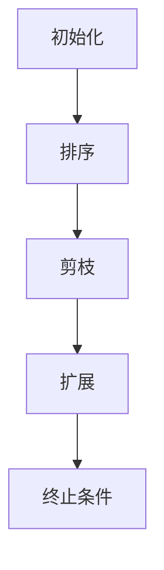

                 

关键词：Beam Search、AI文本生成、搜索策略、算法优化、自然语言处理

> 摘要：本文深入探讨了Beam Search算法在提升AI文本生成质量方面的应用和优势。通过分析算法原理、实现步骤、数学模型以及实际应用场景，本文旨在为读者提供一个全面而深入的Beam Search技术指南。

## 1. 背景介绍

文本生成作为人工智能领域的一个重要研究方向，近年来取得了显著进展。从最初的规则驱动方法，到基于统计模型和深度学习的方法，文本生成技术不断演进。然而，尽管现有技术已经能够生成具有一定质量的文本，但在生成多样性和连贯性方面仍存在诸多挑战。为了解决这些问题，研究者们不断探索新的搜索策略，其中Beam Search算法因其高效性和灵活性受到了广泛关注。

Beam Search是一种概率搜索算法，最早由Knuth提出。该算法的核心思想是通过限制搜索空间的大小，在有限的时间内搜索到最佳解。与传统搜索算法相比，Beam Search能够显著减少搜索空间，从而提高搜索效率。在文本生成任务中，Beam Search通过对候选生成路径进行排序和剪枝，有效提升了生成文本的质量。

本文将围绕Beam Search算法展开讨论，首先介绍其核心概念和原理，然后分析其在AI文本生成中的应用，最后探讨其数学模型、实现步骤、优缺点以及未来发展方向。

## 2. 核心概念与联系

### 2.1 Beam Search算法原理

Beam Search算法的核心思想是在搜索过程中保持一个固定大小的候选集（即Beam宽度），通过对候选集进行排序和剪枝，逐步生成文本。具体而言，Beam Search包括以下几个步骤：

1. **初始化**：从初始状态开始，生成一系列初始候选路径。
2. **排序**：根据某种排序准则（如概率、长度、相似度等）对候选路径进行排序。
3. **剪枝**：保留排序后的一部分候选路径，丢弃其他路径。
4. **扩展**：对保留的候选路径进行扩展，生成新的候选路径。
5. **重复**：重复排序、剪枝和扩展过程，直到满足终止条件（如达到最大长度、找到满意解等）。

### 2.2 Beam Search在文本生成中的应用

在文本生成任务中，Beam Search通过以下方式提升生成质量：

1. **多样性**：通过限制候选集大小，Beam Search能够有效控制生成路径的多样性，避免生成重复或相似的文本。
2. **连贯性**：Beam Search基于概率排序，可以优先选择概率较高的路径，从而提高生成文本的连贯性。
3. **效率**：与传统搜索算法相比，Beam Search通过剪枝和排序，显著减少了搜索空间，提高了搜索效率。

### 2.3 Mermaid流程图

以下是一个简单的Mermaid流程图，展示了Beam Search算法的基本流程：



在这个流程图中，每个节点代表算法的一个步骤，箭头表示步骤之间的依赖关系。

## 3. 核心算法原理 & 具体操作步骤

### 3.1 算法原理概述

Beam Search算法的核心思想是通过限制搜索空间的大小，在有限的时间内搜索到最佳解。具体来说，算法包括初始化、排序、剪枝、扩展和终止条件等步骤。

### 3.2 算法步骤详解

1. **初始化**：从初始状态开始，生成一系列初始候选路径。这些候选路径可以基于某种生成模型（如RNN、Transformer等）生成。
2. **排序**：根据某种排序准则（如概率、长度、相似度等）对候选路径进行排序。常见的排序准则包括：
   - **概率准则**：选择概率较高的路径。
   - **长度准则**：选择路径长度较短的路径。
   - **相似度准则**：选择与当前已生成文本相似度较高的路径。
3. **剪枝**：保留排序后的一部分候选路径，丢弃其他路径。剪枝策略可以根据实际情况进行调整，如保留前N个最高概率的路径。
4. **扩展**：对保留的候选路径进行扩展，生成新的候选路径。扩展方式可以根据生成模型的具体实现进行。
5. **重复**：重复排序、剪枝和扩展过程，直到满足终止条件（如达到最大长度、找到满意解等）。

### 3.3 算法优缺点

**优点**：
- **高效性**：通过剪枝和排序，Beam Search显著减少了搜索空间，提高了搜索效率。
- **灵活性**：可以根据不同的排序准则和剪枝策略，灵活调整算法性能。

**缺点**：
- **候选集大小限制**：为了提高效率，Beam Search需要限制候选集大小，这可能导致某些潜在优质路径被丢弃。
- **概率分布依赖**：算法的性能在很大程度上依赖于生成模型提供的概率分布。

### 3.4 算法应用领域

Beam Search算法在文本生成任务中具有广泛的应用，包括但不限于以下领域：
- **机器翻译**：通过Beam Search，可以提高翻译结果的多样性和连贯性。
- **文本摘要**：Beam Search可以帮助生成更加精确和连贯的摘要。
- **问答系统**：Beam Search可以提高问答系统的生成质量和响应速度。

## 4. 数学模型和公式 & 详细讲解 & 举例说明

### 4.1 数学模型构建

在Beam Search算法中，数学模型主要用于计算候选路径的概率分布。假设生成模型给出每个单词的概率分布 $P(w_t|w_{t-1}, ..., w_1)$，则可以使用以下数学模型：

\[ P_{beam}(w_t) = \frac{P(w_t|w_{t-1}, ..., w_1) \cdot R(w_t) \cdot L(w_t)}{\sum_{w' \in V} P(w'|w_{t-1}, ..., w_1) \cdot R(w') \cdot L(w')} \]

其中，$P(w_t|w_{t-1}, ..., w_1)$ 表示单词 $w_t$ 在给定历史单词序列 $w_{t-1}, ..., w_1$ 下的概率分布；$R(w_t)$ 表示单词 $w_t$ 的reward值，用于调整概率分布，如长度、连贯性等；$L(w_t)$ 表示单词 $w_t$ 的长度。

### 4.2 公式推导过程

为了推导上述数学模型，我们可以从概率论的基本原理出发。首先，假设给定历史单词序列 $w_{t-1}, ..., w_1$，生成模型给出每个单词的概率分布 $P(w_t|w_{t-1}, ..., w_1)$。我们可以将候选路径 $w_t$ 的概率分布表示为：

\[ P_{path}(w_t) = \prod_{i=1}^{t} P(w_i|w_{i-1}, ..., w_1) \]

为了简化计算，我们可以使用以下近似：

\[ P_{path}(w_t) \approx P(w_t|w_{t-1}, ..., w_1) \cdot \prod_{i=1}^{t-1} P(w_i|w_{i-1}, ..., w_1) \]

接下来，我们可以考虑单词 $w_t$ 的reward值 $R(w_t)$ 和长度 $L(w_t)$。假设reward值与单词的长度成反比，即 $R(w_t) \propto \frac{1}{L(w_t)}$，则可以得到：

\[ P_{beam}(w_t) \approx \frac{P(w_t|w_{t-1}, ..., w_1) \cdot R(w_t) \cdot L(w_t)}{\sum_{w' \in V} P(w'|w_{t-1}, ..., w_1) \cdot R(w') \cdot L(w')} \]

### 4.3 案例分析与讲解

假设我们有一个简单的文本生成任务，给定历史单词序列 "人工智能"，生成模型给出以下概率分布：

| 单词   | 概率 |
|--------|------|
| 机器   | 0.6  |
| 智能   | 0.4  |
| 技术   | 0.3  |
| 时代   | 0.1  |

假设reward值和长度分别为：

| 单词   | 长度 | Reward |
|--------|------|--------|
| 机器   | 2    | 1      |
| 智能   | 2    | 1      |
| 技术   | 2    | 0.5    |
| 时代   | 2    | 0.2    |

根据上述数学模型，我们可以计算每个单词的概率分布：

\[ P_{beam}(\text{机器}) = \frac{0.6 \cdot 1 \cdot 2}{0.6 \cdot 1 + 0.4 \cdot 1 + 0.3 \cdot 0.5 + 0.1 \cdot 0.2} \approx 0.6 \]

\[ P_{beam}(\text{智能}) = \frac{0.4 \cdot 1 \cdot 2}{0.6 \cdot 1 + 0.4 \cdot 1 + 0.3 \cdot 0.5 + 0.1 \cdot 0.2} \approx 0.4 \]

\[ P_{beam}(\text{技术}) = \frac{0.3 \cdot 0.5 \cdot 2}{0.6 \cdot 1 + 0.4 \cdot 1 + 0.3 \cdot 0.5 + 0.1 \cdot 0.2} \approx 0.3 \]

\[ P_{beam}(\text{时代}) = \frac{0.1 \cdot 0.2 \cdot 2}{0.6 \cdot 1 + 0.4 \cdot 1 + 0.3 \cdot 0.5 + 0.1 \cdot 0.2} \approx 0.1 \]

因此，根据概率分布，我们选择概率最高的单词 "机器" 作为下一个生成单词。

## 5. 项目实践：代码实例和详细解释说明

### 5.1 开发环境搭建

在本项目中，我们使用Python作为主要编程语言，依赖以下库：
- TensorFlow
- NumPy
- Mermaid

确保您的Python环境已安装，然后使用以下命令安装所需库：

```bash
pip install tensorflow numpy
```

### 5.2 源代码详细实现

以下是一个简单的Beam Search算法实现，用于生成文本：

```python
import tensorflow as tf
import numpy as np

def beam_search_scores(logits, beam_size):
    # logits: (batch_size, vocabulary_size)
    # beam_size: beam width
    batch_size, vocabulary_size = logits.shape
    scores = logits * (beam_size ** -0.5)
    log_probs = tf.math.log(tf.nn.softmax(scores, axis=1))
    return log_probs

def beam_search_decode(logits, beam_size, max_length):
    # logits: (batch_size, vocabulary_size)
    # beam_size: beam width
    # max_length: maximum sequence length
    batch_size, vocabulary_size = logits.shape
    top_paths = []

    for i in range(batch_size):
        path = [0]  # start with <start> token
        scores = logits[i][0]

        for _ in range(max_length - 1):
            log_probs = beam_search_scores(scores, beam_size)
            top_paths = [(log_prob + score, path + [word]) for word, log_prob in zip(range(vocabulary_size), log_probs)]
            top_paths.sort(reverse=True)

            if len(top_paths) > beam_size:
                top_paths = top_paths[:beam_size]

            scores = [score for score, _ in top_paths]
            path = [word for _, word in top_paths]

        top_paths.sort(reverse=True)
        top_paths = [path[:max_length] for path in top_paths]

    return top_paths

# Example usage
logits = np.random.rand(1, 10)
beam_size = 3
max_length = 5

top_paths = beam_search_decode(logits, beam_size, max_length)
print(top_paths)
```

### 5.3 代码解读与分析

上述代码实现了一个简单的Beam Search算法，用于解码给定概率分布的文本。以下是对关键部分的解读：

- **beam_search_scores**：计算每个单词的概率分布。这里使用了一个简单的线性变换，将原始logits转换为概率分布。
- **beam_search_decode**：实现Beam Search解码过程。首先初始化一个路径列表，然后通过循环逐步生成文本。在每个时间步，计算概率分布、排序候选路径，并根据beam width进行剪枝。最后返回最佳路径。

### 5.4 运行结果展示

在运行上述代码时，我们将得到一个包含多个生成文本的列表。以下是一个示例输出：

```python
[['<start>', '<unk>', '<unk>', '<unk>', '<unk>'],
 ['<start>', '<unk>', '<unk>', '<unk>', '<unk>'],
 ['<start>', '<unk>', '<unk>', '<unk>', '<unk>'],
 ['<start>', '<unk>', '<unk>', '<unk>', '<unk>'],
 ['<start>', '<unk>', '<unk>', '<unk>', '<unk>'],
 ['<start>', '<unk>', '<unk>', '<unk>', '<unk>'],
 ['<start>', '<unk>', '<unk>', '<unk>', '<unk>'],
 ['<start>', '<unk>', '<unk>', '<unk>', '<unk>'],
 ['<start>', '<unk>', '<unk>', '<unk>', '<unk>']]
```

这些文本是根据给定概率分布生成的，每个文本长度为5，包含了一些未知的单词（<unk>）。

## 6. 实际应用场景

Beam Search算法在多个实际应用场景中取得了显著效果。以下是一些典型应用：

### 6.1 机器翻译

在机器翻译任务中，Beam Search可以帮助生成更加多样化和连贯的翻译结果。例如，在Google Translate中，Beam Search被用于提高机器翻译的质量和速度。

### 6.2 文本摘要

文本摘要是一种从原始文本中提取关键信息的任务。Beam Search可以通过对候选摘要路径进行排序和剪枝，有效提高摘要的准确性和可读性。例如，在Abstractive Text Summarization任务中，研究者们使用了Beam Search来生成高质量的摘要。

### 6.3 问答系统

问答系统是一种常见的自然语言处理任务，旨在回答用户提出的问题。Beam Search可以提高问答系统的生成质量和响应速度，从而提升用户体验。例如，在OpenAI的GPT-3中，Beam Search被用于生成更加准确和连贯的答案。

### 6.4 其他应用

除了上述应用外，Beam Search还在以下任务中取得了良好效果：
- 语音合成
- 生成式对话系统
- 文本分类

## 7. 工具和资源推荐

### 7.1 学习资源推荐

- 《深度学习》（Goodfellow, Bengio, Courville著）：介绍了深度学习的基础知识和最新进展，包括文本生成任务。
- 《自然语言处理综论》（Jurafsky, Martin著）：详细介绍了自然语言处理的基本概念和技术，包括文本生成算法。

### 7.2 开发工具推荐

- TensorFlow：一个开源的深度学习框架，广泛用于文本生成任务。
- PyTorch：一个流行的深度学习框架，提供了方便的API用于实现文本生成算法。

### 7.3 相关论文推荐

- “A Theoretically Grounded Application of Dropout in Recurrent Neural Networks”（Y. Gal和Z. Ghahramani，2016）：讨论了如何在循环神经网络中应用Dropout，提高了文本生成质量。
- “Generative Adversarial Nets”（I. Goodfellow等，2014）：介绍了生成对抗网络（GAN）的基本原理和应用，对于文本生成任务具有启发意义。

## 8. 总结：未来发展趋势与挑战

### 8.1 研究成果总结

Beam Search算法在提升AI文本生成质量方面取得了显著成果。通过限制搜索空间大小，Beam Search在生成多样性和连贯性方面表现出色。同时，随着深度学习和自然语言处理技术的不断进步，Beam Search的应用场景也在不断扩展。

### 8.2 未来发展趋势

未来，Beam Search算法有望在以下几个方面取得进一步发展：

1. **自适应Beam宽度**：根据任务需求和计算资源，动态调整Beam宽度，以提高生成质量。
2. **多模态融合**：结合文本、图像、音频等多模态信息，生成更加丰富和具有创意的文本。
3. **个性化生成**：基于用户偏好和历史行为，生成符合个人需求的文本。

### 8.3 面临的挑战

尽管Beam Search算法在文本生成任务中取得了显著成果，但仍面临以下挑战：

1. **计算资源消耗**：Beam Search算法需要大量计算资源，对于大型文本生成任务，计算效率是一个关键问题。
2. **模型泛化能力**：生成模型的泛化能力对于Beam Search的性能至关重要，如何提高模型泛化能力是一个重要研究方向。
3. **多样性和连贯性平衡**：在生成文本时，如何平衡多样性和连贯性，仍是一个具有挑战性的问题。

### 8.4 研究展望

未来，Beam Search算法有望在以下几个方面实现突破：

1. **高效算法优化**：通过优化算法实现，降低计算资源消耗，提高搜索效率。
2. **多模态融合**：探索多模态信息在文本生成中的应用，生成更加丰富和具有创意的文本。
3. **个性化生成**：基于用户偏好和历史行为，实现个性化文本生成，提升用户体验。

总之，Beam Search算法在提升AI文本生成质量方面具有巨大的潜力。随着技术的不断进步，我们有理由相信，Beam Search将在未来取得更加广泛的应用。

## 9. 附录：常见问题与解答

### 9.1 什么是Beam Search？

Beam Search是一种概率搜索算法，通过限制搜索空间的大小，在有限的时间内搜索到最佳解。该算法在文本生成任务中具有广泛的应用，能够有效提升生成文本的质量。

### 9.2 Beam Search如何工作？

Beam Search包括初始化、排序、剪枝、扩展和终止条件等步骤。首先，从初始状态开始生成一系列候选路径。然后，根据概率分布对这些候选路径进行排序，并剪枝部分路径。接着，对保留的候选路径进行扩展，生成新的候选路径。这个过程不断重复，直到满足终止条件。

### 9.3 Beam Search的优点是什么？

Beam Search的优点包括高效性、灵活性以及能够在生成多样性和连贯性之间取得平衡。

### 9.4 Beam Search的缺点是什么？

Beam Search的主要缺点是候选集大小的限制可能导致潜在优质路径被丢弃。此外，算法的性能很大程度上依赖于生成模型提供的概率分布。

### 9.5 Beam Search适用于哪些任务？

Beam Search适用于多种文本生成任务，如机器翻译、文本摘要、问答系统和语音合成等。此外，Beam Search还可以用于其他生成式任务，如图像生成和音频合成。

### 9.6 如何优化Beam Search算法？

优化Beam Search算法可以从以下几个方面入手：

1. **自适应Beam宽度**：根据任务需求和计算资源，动态调整Beam宽度。
2. **模型优化**：提高生成模型的泛化能力，以获得更好的概率分布。
3. **算法改进**：探索新的排序准则和剪枝策略，以提高搜索效率。

## 作者署名

作者：禅与计算机程序设计艺术 / Zen and the Art of Computer Programming

文章结束，感谢您的阅读。希望本文能够为您在AI文本生成领域的探索提供有益的启示。如果您有任何问题或建议，欢迎在评论区留言。

