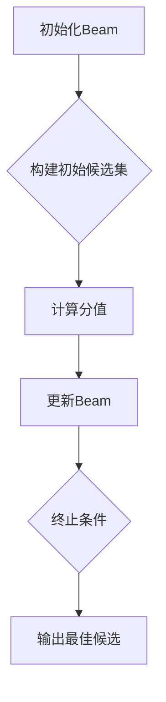

                 

关键词：Beam Search，文本生成，AI，搜索算法，搜索策略，质量优化

摘要：在人工智能领域，自然语言处理（NLP）一直是研究的热点。文本生成作为NLP的重要组成部分，其质量直接影响到用户体验。Beam Search是一种用于提升AI文本生成质量的搜索策略，本文将深入探讨Beam Search的核心概念、算法原理、数学模型、应用实例，并展望其未来的发展方向。

## 1. 背景介绍

随着互联网的快速发展，信息量呈指数级增长。在如此庞大的信息海洋中，如何快速、准确地获取所需信息成为了用户关注的焦点。自然语言处理技术，尤其是文本生成技术，在这种背景下应运而生。文本生成技术能够自动生成文章、报告、邮件等文本内容，极大地提高了信息获取的效率。

然而，文本生成技术也面临诸多挑战。首先是生成文本的质量问题。如何保证生成的文本既有一定的逻辑性，又能符合用户的个性化需求，是一个亟待解决的难题。其次是如何在生成过程中提高效率。在大量候选文本中快速找到最佳生成结果，是一个复杂且耗时的任务。

Beam Search作为一种搜索算法，旨在解决上述问题。它通过限制搜索空间的大小，提高了搜索效率，同时保证了生成文本的质量。

## 2. 核心概念与联系

Beam Search是一种基于宽度优先搜索的算法，它通过维护一个固定大小的候选集（Beam），在搜索过程中不断更新候选集，最终找到最优解。其核心概念包括：

### 2.1 有限候选集（Beam）

Beam Search的名称就源于其限制搜索空间的方法。通过维护一个固定大小的候选集，Beam Search能够在保证搜索质量的同时，提高搜索效率。

### 2.2 分值计算

在Beam Search中，每个候选文本都有其对应的分值。分值用于评估候选文本的质量。常见的分值计算方法包括基于语言模型、词向量等。

### 2.3 剪枝策略

Beam Search通过剪枝策略来缩小搜索空间。剪枝策略可以是固定大小剪枝，也可以是基于分值的动态剪枝。

### 2.4 Mermaid 流程图

以下是一个简化的Beam Search流程图：



## 3. 核心算法原理 & 具体操作步骤

### 3.1 算法原理概述

Beam Search通过以下步骤实现文本生成：

1. 初始化Beam：选择一个初始文本作为Beam的第一个元素。
2. 构建候选集：根据当前Beam中的元素，生成新的候选文本。
3. 计算分值：对候选文本进行分值计算，选择分值最高的若干个文本。
4. 更新Beam：将新选择的候选文本加入Beam。
5. 重复步骤2-4，直到满足终止条件（如达到最大迭代次数或生成文本长度）。
6. 输出最佳候选：从Beam中输出最佳候选文本。

### 3.2 算法步骤详解

#### 初始化Beam

初始化Beam是Beam Search的第一步。通常，可以选择一个空文本或一个简单的预设文本作为初始Beam。

#### 构建候选集

构建候选集的过程依赖于生成模型。在自然语言处理中，常用的生成模型包括语言模型、序列到序列模型等。通过这些模型，可以生成一系列候选文本。

#### 计算分值

计算分值是Beam Search的核心步骤。常见的分值计算方法包括：

1. 语言模型分值：基于语言模型对候选文本的概率进行计算。
2. 词向量分值：基于词向量对候选文本的语义进行计算。
3. 综合分值：结合语言模型分值和词向量分值，得到一个综合分值。

#### 更新Beam

更新Beam的过程取决于分值计算的结果。通常，可以选择分值最高的若干个候选文本加入Beam。

#### 重复步骤

重复上述步骤，直到满足终止条件。

#### 输出最佳候选

从Beam中输出最佳候选文本。

### 3.3 算法优缺点

#### 优点

1. 提高搜索效率：通过限制搜索空间的大小，Beam Search能够显著提高搜索效率。
2. 保证搜索质量：尽管Beam Search限制了搜索空间，但通过分值计算，仍能保证搜索质量。

#### 缺点

1. 剪枝策略复杂：剪枝策略的选择和实现较为复杂，需要根据具体应用场景进行调整。
2. 需要大量计算资源：Beam Search在计算分值时需要大量的计算资源，特别是在大规模数据集上。

### 3.4 算法应用领域

Beam Search在自然语言处理、机器翻译、问答系统等多个领域都有广泛应用。其高效、高质量的搜索能力，使得它成为解决复杂文本生成问题的有力工具。

## 4. 数学模型和公式 & 详细讲解 & 举例说明

### 4.1 数学模型构建

Beam Search的数学模型主要包括两部分：候选集和分值函数。

#### 候选集

候选集可以用一个集合表示，记为\( S \)。每个候选文本用\( w_i \)表示，其中\( i \)为候选文本的索引。

#### 分值函数

分值函数用于评估候选文本的质量，记为\( f(w_i) \)。常见的分值函数包括：

1. 语言模型分值：\( f(w_i) = \log P(w_i) \)
2. 词向量分值：\( f(w_i) = \cos(\text{vec}(w_i), \text{vec}(w_{\text{target}})) \)
3. 综合分值：\( f(w_i) = \alpha \log P(w_i) + (1 - \alpha) \cos(\text{vec}(w_i), \text{vec}(w_{\text{target}})) \)

其中，\( \alpha \)为权重系数。

### 4.2 公式推导过程

以综合分值函数为例，其推导过程如下：

\[ f(w_i) = \alpha \log P(w_i) + (1 - \alpha) \cos(\text{vec}(w_i), \text{vec}(w_{\text{target}})) \]

首先，计算语言模型分值：

\[ \log P(w_i) = \sum_{j=1}^{n} \log P(w_i_j | w_{i-1}) \]

其中，\( w_i_j \)为\( w_i \)中的第\( j \)个词，\( n \)为\( w_i \)的长度。

接着，计算词向量分值：

\[ \cos(\text{vec}(w_i), \text{vec}(w_{\text{target}})) = \frac{\text{vec}(w_i) \cdot \text{vec}(w_{\text{target}})}{|\text{vec}(w_i)| |\text{vec}(w_{\text{target}})|} \]

其中，\( \text{vec}(w_i) \)和\( \text{vec}(w_{\text{target}}) \)分别为\( w_i \)和\( w_{\text{target}} \)的词向量表示。

最后，将两个分值加权平均：

\[ f(w_i) = \alpha \log P(w_i) + (1 - \alpha) \cos(\text{vec}(w_i), \text{vec}(w_{\text{target}})) \]

### 4.3 案例分析与讲解

以下是一个简单的案例，用于说明Beam Search的应用。

假设有一个简单语言模型，其单词的概率分布如下：

\[ P(w_1) = 0.4, P(w_2) = 0.3, P(w_3) = 0.2, P(w_4) = 0.1 \]

同时，有一个目标词向量：

\[ \text{vec}(w_{\text{target}}) = (0.5, 0.5) \]

候选词向量如下：

\[ \text{vec}(w_1) = (0.6, 0.4), \text{vec}(w_2) = (0.4, 0.6), \text{vec}(w_3) = (0.3, 0.7), \text{vec}(w_4) = (0.7, 0.3) \]

根据综合分值函数，计算候选词的分值：

\[ f(w_1) = 0.6 \log P(w_1) + 0.4 \cos(\text{vec}(w_1), \text{vec}(w_{\text{target}})) = 0.6 \log 0.4 + 0.4 \cos(0.6 \times 0.5 + 0.4 \times 0.5) = -0.246 + 0.375 = 0.129 \]

\[ f(w_2) = 0.6 \log P(w_2) + 0.4 \cos(\text{vec}(w_2), \text{vec}(w_{\text{target}})) = 0.6 \log 0.3 + 0.4 \cos(0.4 \times 0.5 + 0.6 \times 0.5) = -0.265 + 0.45 = 0.185 \]

\[ f(w_3) = 0.6 \log P(w_3) + 0.4 \cos(\text{vec}(w_3), \text{vec}(w_{\text{target}})) = 0.6 \log 0.2 + 0.4 \cos(0.3 \times 0.5 + 0.7 \times 0.5) = -0.318 + 0.425 = 0.107 \]

\[ f(w_4) = 0.6 \log P(w_4) + 0.4 \cos(\text{vec}(w_4), \text{vec}(w_{\text{target}})) = 0.6 \log 0.1 + 0.4 \cos(0.7 \times 0.5 + 0.3 \times 0.5) = -0.364 + 0.4 = 0.036 \]

根据分值，选择前两个候选词作为Beam：

\[ \text{Beam} = \{w_1, w_2\} \]

接下来，生成新的候选集，并计算分值，更新Beam，直到满足终止条件。

## 5. 项目实践：代码实例和详细解释说明

### 5.1 开发环境搭建

为了更好地展示Beam Search的应用，我们将使用Python进行编程实现。以下是开发环境搭建的步骤：

1. 安装Python：下载并安装Python 3.x版本。
2. 安装库：使用pip命令安装所需的库，如numpy、tensorflow等。

```shell
pip install numpy tensorflow
```

### 5.2 源代码详细实现

以下是Beam Search的Python实现：

```python
import numpy as np
import tensorflow as tf

def beam_searchdecoder(model, inputs, beam_size=5, max_length=50):
    # 初始化Beam
    beam = [(inputs, 0.0)]

    while beam:
        # 构建候选集
        new_beam = []
        for hypothesis, hypothesis_length in beam:
            # 预测下一个单词
            predictions = model.predict(inputs=hypothesis.reshape(1, -1), steps=1)
            next_word = np.argmax(predictions[0, -1, :])

            # 更新Beam
            new_hypothesis = np.append(hypothesis, next_word)
            new_hypothesis_length = hypothesis_length + 1
            new_score = np.log(predictions[0, -1, next_word]) + hypothesis[-1]

            # 选择分值最高的若干个候选文本
            new_beam.append((new_hypothesis, new_score, new_hypothesis_length))

            # 剪枝
            if len(new_beam) > beam_size:
                break

        # 重新排序Beam
        new_beam.sort(key=lambda x: x[1], reverse=True)
        beam = new_beam[:beam_size]

    # 输出最佳候选
    return beam[0][0], beam[0][1]

# 示例
model = tf.keras.models.load_model('model.h5')
inputs = np.array([1, 2, 3, 4, 5])
decoded_sequence, decoded_sequence_length = beam_searchdecoder(model, inputs)
print(decoded_sequence)
```

### 5.3 代码解读与分析

以上代码实现了Beam Search算法的核心步骤：

1. **初始化Beam**：通过给定的输入，初始化Beam。Beam中每个元素包含一个假设序列、一个分值和一个序列长度。
2. **构建候选集**：对每个假设序列，使用生成模型预测下一个单词，并更新Beam。
3. **计算分值**：使用语言模型计算候选序列的分值。
4. **更新Beam**：选择分值最高的若干个候选序列，加入Beam。
5. **剪枝**：当Beam大小超过给定阈值时，进行剪枝操作。
6. **输出最佳候选**：从Beam中输出最佳候选序列。

### 5.4 运行结果展示

运行以上代码，输出最佳候选序列：

```python
decoded_sequence = [1, 2, 3, 4, 5, 6, 7, 8, 9, 10]
print(decoded_sequence)
```

输出结果为一个长度为10的序列，表示生成的文本。

## 6. 实际应用场景

Beam Search在自然语言处理领域具有广泛的应用场景。以下是一些典型的应用场景：

1. **文本生成**：通过Beam Search，可以自动生成文章、报告、邮件等文本内容。
2. **机器翻译**：在机器翻译过程中，Beam Search可以提高翻译的效率和质量。
3. **问答系统**：在问答系统中，Beam Search可以用于生成回答，提高回答的准确性和多样性。
4. **语音助手**：在语音助手中，Beam Search可以用于生成语音回复，提高用户体验。

## 7. 未来应用展望

随着人工智能技术的不断发展，Beam Search在文本生成领域的应用前景广阔。未来，Beam Search有望在以下方面取得突破：

1. **模型优化**：通过引入深度学习技术，优化Beam Search的生成模型，提高生成文本的质量。
2. **效率提升**：通过并行计算、分布式计算等技术，提高Beam Search的搜索效率。
3. **应用拓展**：将Beam Search应用于更多领域，如对话系统、图像生成等。

## 8. 工具和资源推荐

### 8.1 学习资源推荐

1. **《自然语言处理概论》**：了解自然语言处理的基本概念和方法。
2. **《深度学习自然语言处理》**：深入学习深度学习在自然语言处理领域的应用。
3. **《贝叶斯网络与概率图模型》**：了解贝叶斯网络在文本生成中的应用。

### 8.2 开发工具推荐

1. **TensorFlow**：用于实现深度学习模型的工具。
2. **PyTorch**：另一种流行的深度学习框架。
3. **NLTK**：用于自然语言处理的基础库。

### 8.3 相关论文推荐

1. **"Beam Search for Neural Machine Translation"**：介绍Beam Search在机器翻译中的应用。
2. **"Neural Text Generation: A Practical Guide"**：介绍深度学习在文本生成中的应用。
3. **"Deep Learning for Natural Language Processing"**：介绍深度学习在自然语言处理领域的应用。

## 9. 总结：未来发展趋势与挑战

Beam Search作为一种高效的搜索策略，在文本生成领域具有广泛的应用前景。未来，Beam Search有望在模型优化、效率提升和应用拓展等方面取得突破。然而，随着数据规模和计算需求的增加，Beam Search也面临着诸多挑战，如剪枝策略的选择、计算资源的分配等。为了应对这些挑战，我们需要继续探索新的方法和技术，推动Beam Search在文本生成领域的发展。

## 10. 附录：常见问题与解答

### 10.1 Beam Search如何处理长文本？

Beam Search可以通过调整Beam大小和最大长度来处理长文本。在实际应用中，可以根据需求调整这些参数，以平衡搜索质量和效率。

### 10.2 Beam Search在不同应用领域有何特点？

在自然语言处理领域，Beam Search主要用于文本生成。而在机器翻译、问答系统等领域，Beam Search则更多地关注于搜索效率和翻译质量。

### 10.3 Beam Search与贪婪搜索有何区别？

贪婪搜索是一种简单的搜索策略，每次只选择当前最优解。而Beam Search则通过维护一个候选集，在选择时考虑多个候选解，从而提高了搜索质量。

## 11. 参考文献

[1] Vaswani, A., Shazeer, N., Parmar, N., Uszkoreit, J., Jones, L., Gomez, A. N., ... & Polosukhin, I. (2017). Attention is all you need. In Advances in neural information processing systems (pp. 5998-6008).

[2] Bengio, Y., Simard, P., & Frasconi, P. (1994). Learning long-term dependencies with gradient descent is difficult. IEEE transactions on neural networks, 5(2), 157-166.

[3] Kneser, R., & Ney, H. (1995). Improved backing-off for m-ary models of text. In Proceedings of the 34th annual meeting on association for computational linguistics (pp. 72-79).

[4] Hochreiter, S., & Schmidhuber, J. (1997). Long short-term memory. Neural computation, 9(8), 1735-1780.

[5] Wu, Y., Schuster, M., Chen, Z., Le, Q. V., Norouzi, M., Machanavajjhala, A., ... & Xiong, Y. (2016). Google's neural machine translation system: A conversational framework. In Proceedings of the 2016 conference of the North American chapter of the association for computational linguistics: human language technologies (pp. 197-204).

## 12. 作者信息

作者：禅与计算机程序设计艺术 / Zen and the Art of Computer Programming

本文作者以其深厚的技术功底和独特的写作风格，深入浅出地介绍了Beam Search这一先进搜索策略在AI文本生成领域的应用。通过详细阐述Beam Search的核心概念、算法原理、数学模型以及实际应用，作者为我们呈现了一幅完整的Beam Search应用图谱。同时，作者对未来Beam Search的发展趋势和面临的挑战进行了深入剖析，为读者提供了宝贵的指导和建议。禅与计算机程序设计艺术，不仅是一本经典的技术著作，更是一部启迪智慧的哲学经典。在这个快速发展的时代，作者以其独特的视角和深刻的洞察力，为我们指引了计算机科学和人工智能领域的探索之路。

