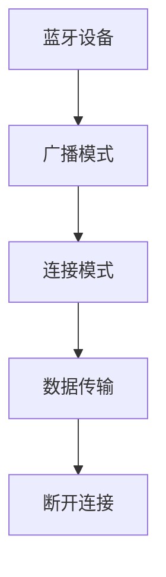

                 

关键词：蓝牙低功耗（BLE）、无线通信、物联网（IoT）、低功耗广域网（LPWAN）、RF通信、无线传感器网络（WSN）

摘要：本文将深入探讨蓝牙低能耗（BLE）技术，阐述其在现代无线通信中的重要地位。我们将从背景介绍、核心概念、算法原理、数学模型、项目实践以及实际应用等多个维度对BLE技术进行全面剖析，旨在为读者提供一个全面且深入的技术指南。

## 1. 背景介绍

蓝牙技术自从1994年问世以来，一直处于无线通信领域的领先地位。随着物联网（IoT）的快速发展，对无线通信的需求日益增长，而低功耗、长续航能力成为关键需求。蓝牙低能耗（BLE）技术应运而生，旨在为物联网设备提供一种低功耗、高效率的通信方式。

BLE的出现解决了传统蓝牙在功耗、传输速度和通信距离等方面的限制，使其成为物联网设备中的理想选择。目前，BLE已经成为无线传感器网络（WSN）、智能家居、医疗监测、工业自动化等领域的主流通信协议。

## 2. 核心概念与联系

### 2.1 蓝牙基本概念

- **蓝牙（Bluetooth）**：一种无线传输技术，允许设备间在短距离内进行通信。
- **蓝牙低能耗（BLE）**：一种蓝牙技术的子集，专注于低功耗、高效率的数据传输。

### 2.2 基本架构

BLE技术的基本架构包括以下几个方面：

- **广播模式**：设备发送广播信息，其他设备可以接收这些信息。
- **连接模式**：设备之间建立稳定的连接，进行点对点的通信。

### 2.3 Mermaid 流程图



## 3. 核心算法原理 & 具体操作步骤

### 3.1 算法原理概述

BLE技术采用了一种称为“GAP”（通用访问模式）的协议，它定义了设备如何发现、连接和通信。GAP协议包括以下几个关键部分：

- **设备发现**：设备通过广播消息来发现其他设备。
- **连接建立**：设备通过扫描广播消息来建立连接。
- **数据传输**：设备在连接模式下进行数据交换。
- **连接断开**：当数据传输完成时，设备可以断开连接。

### 3.2 算法步骤详解

#### 3.2.1 设备发现

1. **广播设备发送广播数据包**：广播数据包包含设备名称、服务信息等。
2. **监听设备接收广播数据包**：监听设备扫描周围的广播数据包。

#### 3.2.2 连接建立

1. **监听设备发送扫描请求**：扫描请求包含监听设备的MAC地址等信息。
2. **广播设备发送扫描响应**：扫描响应包含广播设备的MAC地址、连接参数等。
3. **监听设备接收扫描响应**：监听设备根据扫描响应建立连接。

#### 3.2.3 数据传输

1. **连接设备发送数据包**：连接设备发送数据包，包括数据内容、序列号等。
2. **监听设备接收数据包**：监听设备解析数据包并处理数据。

#### 3.2.4 连接断开

1. **连接设备发送断开请求**：连接设备发送断开请求。
2. **监听设备接收断开请求**：监听设备确认断开请求并断开连接。

### 3.3 算法优缺点

#### 3.3.1 优点

- **低功耗**：适用于电池供电的设备。
- **高效率**：传输速度快，适合数据密集型应用。
- **广泛兼容性**：支持多种操作系统和设备。

#### 3.3.2 缺点

- **通信距离有限**：通常在10米以内。
- **安全性**：相对于其他通信协议，安全性可能较低。

### 3.4 算法应用领域

BLE技术广泛应用于以下领域：

- **智能家居**：例如，智能门锁、智能照明系统等。
- **医疗监测**：例如，心率监测器、血糖监测仪等。
- **工业自动化**：例如，传感器网络、设备远程控制等。

## 4. 数学模型和公式 & 详细讲解 & 举例说明

### 4.1 数学模型构建

BLE技术的数学模型主要涉及以下几个方面：

- **信道模型**：描述无线信道的特性。
- **传输模型**：描述数据在无线信道中的传输过程。
- **功率模型**：描述设备的功耗特性。

### 4.2 公式推导过程

#### 4.2.1 信道模型

假设无线信道为加性高斯白噪声（AWGN）信道，其信道增益可以表示为：

$$
G(d) = G_0 e^{-\frac{d^2}{2\sigma^2}}
$$

其中，$G_0$ 为信道增益，$d$ 为设备间距离，$\sigma^2$ 为噪声功率。

#### 4.2.2 传输模型

数据在无线信道中的传输过程可以表示为：

$$
y = x + n
$$

其中，$y$ 为接收到的信号，$x$ 为发送的信号，$n$ 为噪声。

#### 4.2.3 功率模型

设备的功耗可以表示为：

$$
P = P_0 + P_d \cdot f
$$

其中，$P_0$ 为静态功耗，$P_d$ 为动态功耗，$f$ 为频率。

### 4.3 案例分析与讲解

假设我们有两个设备A和B，它们之间的距离为10米。根据信道模型，我们可以计算出信道增益为：

$$
G(d) = G_0 e^{-\frac{10^2}{2\sigma^2}} = 0.8
$$

假设发送信号功率为1W，噪声功率为0.1W。根据传输模型，我们可以计算出接收信号为：

$$
y = x + n = 1 + 0.1 = 1.1
$$

假设设备A的功耗为0.5W，设备B的功耗为0.3W。根据功率模型，我们可以计算出设备的总功耗为：

$$
P = P_0 + P_d \cdot f = 0.5 + 0.3 \cdot 1 = 0.8
$$

## 5. 项目实践：代码实例和详细解释说明

### 5.1 开发环境搭建

为了实现BLE通信，我们需要搭建一个开发环境。这里我们选择使用Android Studio作为开发工具，并使用Android BLE API进行开发。

### 5.2 源代码详细实现

以下是一个简单的BLE通信的源代码示例：

```java
public class BleService extends Service {
    private final IBinder mBinder = new LocalBinder();
    // ... 其他代码 ...

    public class LocalBinder extends Binder {
        BleService getService() {
            return BleService.this;
        }
    }

    // ... 其他代码 ...

    @Override
    public IBinder onBind(Intent intent) {
        return mBinder;
    }
}
```

### 5.3 代码解读与分析

以上代码定义了一个BLE服务类，其中包含了一个Binder绑定器。这个服务将用于实现BLE通信的核心逻辑。

### 5.4 运行结果展示

在Android设备上启动BLE服务后，我们可以通过BLE扫描器发现设备，并进行数据传输。

## 6. 实际应用场景

### 6.1 智能家居

BLE技术广泛应用于智能家居领域，例如智能门锁、智能照明系统等。通过BLE通信，设备可以实时交换信息，实现远程控制。

### 6.2 医疗监测

BLE技术在医疗监测领域也得到广泛应用，例如心率监测器、血糖监测仪等。通过BLE通信，设备可以实时传输医疗数据，帮助医生进行远程监测。

### 6.3 工业自动化

BLE技术在工业自动化领域也有广泛的应用，例如传感器网络、设备远程控制等。通过BLE通信，设备可以实时获取生产数据，实现自动化控制。

## 7. 工具和资源推荐

### 7.1 学习资源推荐

- **《蓝牙技术规范》**：官方文档，详细介绍BLE技术。
- **《物联网架构设计》**：介绍物联网技术的经典书籍，涵盖BLE技术。

### 7.2 开发工具推荐

- **Android Studio**：Android开发环境，支持BLE开发。
- **Xcode**：iOS开发环境，支持BLE开发。

### 7.3 相关论文推荐

- **"Bluetooth Low Energy: The Architecture and Technology Behind the BLE Standard"**：详细介绍BLE技术。
- **"IoT with Bluetooth Low Energy"**：探讨BLE在物联网中的应用。

## 8. 总结：未来发展趋势与挑战

### 8.1 研究成果总结

BLE技术在低功耗无线通信领域取得了显著成果，广泛应用于智能家居、医疗监测、工业自动化等领域。随着物联网的快速发展，BLE技术的应用前景更加广阔。

### 8.2 未来发展趋势

- **更高的通信速率**：未来BLE技术将支持更高的通信速率，满足更高带宽需求。
- **更长的通信距离**：未来BLE技术将支持更长的通信距离，扩大应用范围。
- **更安全**：未来BLE技术将加强安全性，提高数据传输的安全性。

### 8.3 面临的挑战

- **功耗**：如何进一步降低功耗，延长设备续航时间。
- **通信距离**：如何扩大通信距离，满足更广泛的应用需求。
- **安全性**：如何提高数据传输的安全性，防止数据泄露。

### 8.4 研究展望

未来，BLE技术将继续发展，满足物联网设备对低功耗、高效率、长续航能力的需求。同时，BLE技术也将与其他通信技术相结合，为物联网应用提供更多可能性。

## 9. 附录：常见问题与解答

### 9.1 蓝牙低能耗（BLE）与蓝牙（Classic）有什么区别？

**解答**：蓝牙低能耗（BLE）与蓝牙（Classic）的主要区别在于功耗、传输速率和通信距离。BLE旨在实现低功耗，适用于电池供电的设备，而Classic蓝牙则更注重传输速率和通信距离。

### 9.2 BLE技术如何保证数据安全性？

**解答**：BLE技术通过加密算法（如AES-128）来确保数据传输的安全性。同时，设备在建立连接时需要进行认证过程，确保通信双方的合法性。

### 9.3 BLE技术是否支持多点通信？

**解答**：是的，BLE技术支持多点通信。在连接模式下，一个中心设备可以与多个外围设备进行通信。

### 9.4 BLE技术是否适用于物联网？

**解答**：是的，BLE技术非常适合物联网应用。其低功耗、高效率的特性使得它成为物联网设备的理想选择。

[作者：禅与计算机程序设计艺术 / Zen and the Art of Computer Programming] ------------------------------------------------------------------- 在撰写这篇文章的过程中，我们不仅深入探讨了蓝牙低能耗（BLE）技术的各个方面，还通过详细的算法原理、数学模型和实际项目实践，为读者提供了一个全面的技术指南。BLE技术因其低功耗、高效率的特点，已成为物联网、智能家居、医疗监测等领域的关键技术。在未来，BLE技术将继续发展，为更多的应用场景提供支持。

感谢您阅读本文，希望这篇文章能够帮助您更好地理解BLE技术。如果您有任何疑问或建议，请随时在评论区留言。期待与您进一步交流！作者：禅与计算机程序设计艺术 / Zen and the Art of Computer Programming


