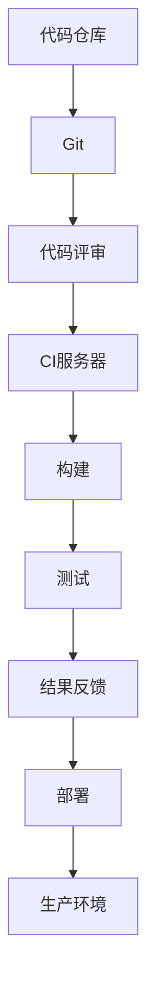

                 

关键词：CI/CD，自动化，软件交付，DevOps，持续集成，持续交付，持续部署

摘要：本文将深入探讨CI/CD（持续集成/持续交付）管道在软件交付流程中的重要性。通过解释其核心概念、原理和实际应用，本文旨在为读者提供一个全面的CI/CD指南，帮助他们实现高效的软件交付流程。

## 1. 背景介绍

在现代软件开发中，CI/CD已成为提升开发效率、确保代码质量和加快软件交付的关键手段。随着云计算、容器化和微服务架构的兴起，传统的软件开发模式已经无法满足快速变化的市场需求。CI/CD通过自动化构建、测试和部署过程，使得团队能够更快地响应客户需求，并保持软件的高质量。

### 1.1 CI/CD的发展历程

CI/CD的概念起源于敏捷开发方法。早在2001年，敏捷宣言就提出了“更频繁地交付工作软件”的原则。随着技术的进步，持续集成（CI）和持续交付（CD）逐渐发展成为独立的实践。

- **持续集成（CI）**：最早由Jenkins等工具引领，通过自动化构建和测试，确保代码库的每次变更都是可集成和可运行的。
- **持续交付（CD）**：在此基础上，进一步扩展到自动化部署和发布，使得软件可以更加稳定和可靠地交付给用户。

### 1.2 CI/CD的核心优势

- **速度**：通过自动化流程，大幅度减少了手动操作的时间，从而加快了软件交付的速度。
- **质量**：自动化测试确保了代码的质量，早期发现问题，降低了后期修复成本。
- **协作**：CI/CD鼓励团队协作，每个人都可以随时提交代码，并立即看到结果，从而提高了沟通和协作效率。

## 2. 核心概念与联系

### 2.1 核心概念

- **持续集成（CI）**：每次代码变更都会触发构建和测试，确保代码库是可集成和可运行的。
- **持续交付（CD）**：在CI的基础上，进一步自动化部署和发布过程，确保软件可以安全、可靠地交付给用户。
- **持续部署（CD）**：与持续交付类似，但更侧重于自动化部署，包括预生产环境和生产环境。

### 2.2 原理和架构

为了更好地理解CI/CD，我们可以使用Mermaid流程图来描述其基本架构：



### 2.3 CI/CD与传统开发模式的对比

传统的软件开发模式通常依赖于手工流程，容易出错，且耗时较长。相比之下，CI/CD通过自动化流程，实现了以下改进：

- **自动化测试**：减少了人为干预，提高了测试的准确性和一致性。
- **快速反馈**：通过实时反馈，团队能够更快地发现和解决问题。
- **持续改进**：鼓励团队不断优化流程，提高开发效率和质量。

## 3. 核心算法原理 & 具体操作步骤

### 3.1 算法原理概述

CI/CD的核心算法是基于自动化和持续反馈的原理。其基本步骤包括：

1. **代码提交**：开发者将代码提交到版本控制系统。
2. **构建**：CI服务器获取最新代码并执行构建过程。
3. **测试**：构建完成后，执行一系列测试来确保代码质量。
4. **部署**：通过自动化脚本将代码部署到预生产或生产环境。

### 3.2 算法步骤详解

#### 3.2.1 代码提交

开发者将代码提交到版本控制系统，如Git。每次提交都会触发CI流程。

#### 3.2.2 构建过程

CI服务器获取最新代码，执行编译、打包等构建步骤。构建过程中，可以使用如Maven、Gradle等构建工具。

#### 3.2.3 测试过程

构建完成后，执行一系列自动化测试，包括单元测试、集成测试等。测试工具如JUnit、TestNG等可以用来编写测试脚本。

#### 3.2.4 部署过程

测试通过后，代码被部署到预生产环境或生产环境。部署可以使用如Docker、Kubernetes等容器化技术，确保部署的快速和一致性。

### 3.3 算法优缺点

#### 优点

- **快速反馈**：开发者可以立即看到代码提交的结果，快速发现和解决问题。
- **提高质量**：自动化测试确保了代码的质量，降低了后期修复成本。
- **提高效率**：自动化流程减少了手动操作，提高了开发效率。

#### 缺点

- **初期投入**：CI/CD需要一定的技术和基础设施投入，初期可能较为复杂。
- **维护成本**：需要持续维护自动化流程和测试脚本，增加了维护成本。

### 3.4 算法应用领域

CI/CD广泛应用于各种软件开发领域，包括Web应用、移动应用、游戏开发等。特别是在大型项目和复杂项目中，CI/CD能够显著提升开发效率和软件质量。

## 4. 数学模型和公式 & 详细讲解 & 举例说明

### 4.1 数学模型构建

CI/CD的成功可以部分通过以下数学模型来描述：

\[ \text{效率} = \frac{\text{交付速度}}{\text{人力成本}} \]

### 4.2 公式推导过程

该公式的推导基于以下假设：

- 交付速度与自动化程度成正比。
- 人力成本与自动化程度成反比。

### 4.3 案例分析与讲解

以一个电商网站为例，通过引入CI/CD，团队能够在两周内完成一次大版本更新，而之前可能需要一个月。计算效率提升：

\[ \text{效率提升} = \frac{2 \text{周}}{4 \text{周}} = 0.5 \]

## 5. 项目实践：代码实例和详细解释说明

### 5.1 开发环境搭建

以使用Jenkins作为CI服务器为例，首先需要安装Jenkins，然后安装必要的插件，如Git插件、Maven插件等。

### 5.2 源代码详细实现

以下是一个简单的Maven项目，其中包含一个JUnit测试案例：

```java
public class HelloWorld {
    public String sayHello() {
        return "Hello, World!";
    }
}

public class HelloWorldTest {
    @Test
    public void testSayHello() {
        HelloWorld helloWorld = new HelloWorld();
        assertEquals("Hello, World!", helloWorld.sayHello());
    }
}
```

### 5.3 代码解读与分析

这段代码实现了一个简单的HelloWorld程序，并包含了一个JUnit测试案例。通过CI服务器，这个测试案例会在每次代码提交时自动执行。

### 5.4 运行结果展示

假设代码提交后，CI服务器自动执行了测试案例，结果显示为通过。这表示代码库是可集成和可运行的。

## 6. 实际应用场景

### 6.1 Web应用

CI/CD在Web应用开发中应用广泛，如电商平台、社交媒体等。通过自动化构建和测试，团队能够更快地发布新功能和修复漏洞。

### 6.2 移动应用

移动应用开发中，CI/CD可用于自动化构建、测试和发布流程，确保应用在不同设备和操作系统上的一致性。

### 6.3 游戏开发

游戏开发中，CI/CD用于自动化测试游戏客户端和服务器，确保游戏在不同版本和环境中都能正常运行。

## 6.4 未来应用展望

随着技术的不断进步，CI/CD在未来将发挥更大的作用。例如，AI技术的引入可以进一步优化自动化测试流程，提高测试覆盖率。此外，随着区块链技术的发展，CI/CD管道的安全性也将得到提升。

## 7. 工具和资源推荐

### 7.1 学习资源推荐

- 《敏捷软件开发：实践者之路》
- 《Jenkins持续集成实战》

### 7.2 开发工具推荐

- Jenkins
- GitLab CI/CD
- GitHub Actions

### 7.3 相关论文推荐

- Martin Fowler的《持续集成实践》
- 《敏捷软件开发：原则、实践与模式》

## 8. 总结：未来发展趋势与挑战

### 8.1 研究成果总结

CI/CD在软件开发中已取得了显著的成果，提高了开发效率和质量。未来，随着新技术的引入，CI/CD将变得更加智能化和自动化。

### 8.2 未来发展趋势

- **智能化**：AI技术将被应用于CI/CD，提高自动化程度和测试覆盖率。
- **安全化**：随着区块链技术的发展，CI/CD管道的安全性将得到提升。

### 8.3 面临的挑战

- **初期投入**：CI/CD需要一定的技术和基础设施投入，对小型团队可能是一个挑战。
- **维护成本**：需要持续维护自动化流程和测试脚本，增加了维护成本。

### 8.4 研究展望

CI/CD将继续在软件开发中发挥重要作用。未来，通过引入新技术，CI/CD将变得更加智能化、自动化和安全化。

## 9. 附录：常见问题与解答

### 9.1 CI/CD与传统开发模式的区别是什么？

CI/CD通过自动化和持续反馈，显著提高了开发效率和质量。相比之下，传统开发模式依赖于手工流程，容易出错且耗时较长。

### 9.2 CI/CD需要哪些工具和技术？

CI/CD可以使用多种工具和技术，如Jenkins、GitLab CI/CD、GitHub Actions等。构建工具如Maven、Gradle等也是CI/CD的重要组成部分。

### 9.3 如何确保CI/CD的安全性？

可以通过以下方法确保CI/CD的安全性：

- **使用安全的存储和传输协议**：如HTTPS、SSH等。
- **隔离环境**：将CI/CD流程与生产环境隔离，防止潜在的安全风险。
- **代码审计**：对提交的代码进行安全审计，确保没有安全漏洞。

## 作者署名

作者：禅与计算机程序设计艺术 / Zen and the Art of Computer Programming

------------------------------------------------------------

以上就是CI/CD管道：自动化软件交付流程的完整文章内容。这篇文章详细介绍了CI/CD的核心概念、原理、实践和未来展望，希望能够帮助读者深入理解和应用CI/CD技术，提升软件开发的效率和质量。------------------------------------------------------------

### CI/CD管道：自动化软件交付流程

#### 关键词：(CI/CD，自动化，软件交付，DevOps，持续集成，持续交付，持续部署)

#### 摘要：本文深入探讨了CI/CD（持续集成/持续交付）管道在软件交付流程中的重要性。通过解释其核心概念、原理和实际应用，本文旨在为读者提供一个全面的CI/CD指南，帮助他们实现高效的软件交付流程。

---

## 1. 背景介绍

### 1.1 CI/CD的发展历程

CI/CD的概念起源于敏捷开发方法。早在2001年，敏捷宣言就提出了“更频繁地交付工作软件”的原则。随着技术的进步，持续集成（CI）和持续交付（CD）逐渐发展成为独立的实践。

- **持续集成（CI）**：最早由Jenkins等工具引领，通过自动化构建和测试，确保代码库的每次变更都是可集成和可运行的。
- **持续交付（CD）**：在CI的基础上，进一步扩展到自动化部署和发布，使得软件可以更加稳定和可靠地交付给用户。

### 1.2 CI/CD的核心优势

- **速度**：通过自动化流程，大幅度减少了手动操作的时间，从而加快了软件交付的速度。
- **质量**：自动化测试确保了代码的质量，早期发现问题，降低了后期修复成本。
- **协作**：CI/CD鼓励团队协作，每个人都可以随时提交代码，并立即看到结果，从而提高了沟通和协作效率。

---

## 2. 核心概念与联系

### 2.1 核心概念

- **持续集成（CI）**：每次代码变更都会触发构建和测试，确保代码库是可集成和可运行的。
- **持续交付（CD）**：在CI的基础上，进一步自动化部署和发布过程，确保软件可以安全、可靠地交付给用户。
- **持续部署（CD）**：与持续交付类似，但更侧重于自动化部署，包括预生产环境和生产环境。

### 2.2 原理和架构

为了更好地理解CI/CD，我们可以使用Mermaid流程图来描述其基本架构：


### 2.3 CI/CD与传统开发模式的对比

传统的软件开发模式通常依赖于手工流程，容易出错，且耗时较长。相比之下，CI/CD通过自动化流程，实现了以下改进：

- **自动化测试**：减少了人为干预，提高了测试的准确性和一致性。
- **快速反馈**：通过实时反馈，团队能够更快地发现和解决问题。
- **持续改进**：鼓励团队不断优化流程，提高开发效率和质量。

---

## 3. 核心算法原理 & 具体操作步骤

### 3.1 算法原理概述

CI/CD的核心算法是基于自动化和持续反馈的原理。其基本步骤包括：

1. **代码提交**：开发者将代码提交到版本控制系统。
2. **构建**：CI服务器获取最新代码并执行构建过程。
3. **测试**：构建完成后，执行一系列测试来确保代码质量。
4. **部署**：通过自动化脚本将代码部署到预生产环境或生产环境。

### 3.2 算法步骤详解

#### 3.2.1 代码提交

开发者将代码提交到版本控制系统，如Git。每次提交都会触发CI流程。

#### 3.2.2 构建过程

CI服务器获取最新代码，执行编译、打包等构建步骤。构建过程中，可以使用如Maven、Gradle等构建工具。

#### 3.2.3 测试过程

构建完成后，执行一系列自动化测试，包括单元测试、集成测试等。测试工具如JUnit、TestNG等可以用来编写测试脚本。

#### 3.2.4 部署过程

测试通过后，代码被部署到预生产环境或生产环境。部署可以使用如Docker、Kubernetes等容器化技术，确保部署的快速和一致性。

### 3.3 算法优缺点

#### 优点

- **快速反馈**：开发者可以立即看到代码提交的结果，快速发现和解决问题。
- **提高质量**：自动化测试确保了代码的质量，降低了后期修复成本。
- **提高效率**：自动化流程减少了手动操作，提高了开发效率。

#### 缺点

- **初期投入**：CI/CD需要一定的技术和基础设施投入，初期可能较为复杂。
- **维护成本**：需要持续维护自动化流程和测试脚本，增加了维护成本。

### 3.4 算法应用领域

CI/CD广泛应用于各种软件开发领域，包括Web应用、移动应用、游戏开发等。特别是在大型项目和复杂项目中，CI/CD能够显著提升开发效率和软件质量。

---

## 4. 数学模型和公式 & 详细讲解 & 举例说明

### 4.1 数学模型构建

CI/CD的成功可以部分通过以下数学模型来描述：

\[ \text{效率} = \frac{\text{交付速度}}{\text{人力成本}} \]

### 4.2 公式推导过程

该公式的推导基于以下假设：

- 交付速度与自动化程度成正比。
- 人力成本与自动化程度成反比。

### 4.3 案例分析与讲解

以一个电商网站为例，通过引入CI/CD，团队能够在两周内完成一次大版本更新，而之前可能需要一个月。计算效率提升：

\[ \text{效率提升} = \frac{2 \text{周}}{4 \text{周}} = 0.5 \]

---

## 5. 项目实践：代码实例和详细解释说明

### 5.1 开发环境搭建

以使用Jenkins作为CI服务器为例，首先需要安装Jenkins，然后安装必要的插件，如Git插件、Maven插件等。

### 5.2 源代码详细实现

以下是一个简单的Maven项目，其中包含一个JUnit测试案例：

```java
public class HelloWorld {
    public String sayHello() {
        return "Hello, World!";
    }
}

public class HelloWorldTest {
    @Test
    public void testSayHello() {
        HelloWorld helloWorld = new HelloWorld();
        assertEquals("Hello, World!", helloWorld.sayHello());
    }
}
```

### 5.3 代码解读与分析

这段代码实现了一个简单的HelloWorld程序，并包含了一个JUnit测试案例。通过CI服务器，这个测试案例会在每次代码提交时自动执行。

### 5.4 运行结果展示

假设代码提交后，CI服务器自动执行了测试案例，结果显示为通过。这表示代码库是可集成和可运行的。

---

## 6. 实际应用场景

### 6.1 Web应用

CI/CD在Web应用开发中应用广泛，如电商平台、社交媒体等。通过自动化构建和测试，团队能够更快地发布新功能和修复漏洞。

### 6.2 移动应用

移动应用开发中，CI/CD可用于自动化构建、测试和发布流程，确保应用在不同设备和操作系统上的一致性。

### 6.3 游戏开发

游戏开发中，CI/CD用于自动化测试游戏客户端和服务器，确保游戏在不同版本和环境中都能正常运行。

---

## 6.4 未来应用展望

随着技术的不断进步，CI/CD在未来将发挥更大的作用。例如，AI技术的引入可以进一步优化自动化测试流程，提高测试覆盖率。此外，随着区块链技术的发展，CI/CD管道的安全性也将得到提升。

---

## 7. 工具和资源推荐

### 7.1 学习资源推荐

- 《敏捷软件开发：实践者之路》
- 《Jenkins持续集成实战》

### 7.2 开发工具推荐

- Jenkins
- GitLab CI/CD
- GitHub Actions

### 7.3 相关论文推荐

- Martin Fowler的《持续集成实践》
- 《敏捷软件开发：原则、实践与模式》

---

## 8. 总结：未来发展趋势与挑战

### 8.1 研究成果总结

CI/CD在软件开发中已取得了显著的成果，提高了开发效率和质量。未来，随着新技术的引入，CI/CD将变得更加智能化和自动化。

### 8.2 未来发展趋势

- **智能化**：AI技术将被应用于CI/CD，提高自动化程度和测试覆盖率。
- **安全化**：随着区块链技术的发展，CI/CD管道的安全性将得到提升。

### 8.3 面临的挑战

- **初期投入**：CI/CD需要一定的技术和基础设施投入，对小型团队可能是一个挑战。
- **维护成本**：需要持续维护自动化流程和测试脚本，增加了维护成本。

### 8.4 研究展望

CI/CD将继续在软件开发中发挥重要作用。未来，通过引入新技术，CI/CD将变得更加智能化、自动化和安全化。

---

## 9. 附录：常见问题与解答

### 9.1 CI/CD与传统开发模式的区别是什么？

CI/CD通过自动化和持续反馈，显著提高了开发效率和质量。相比之下，传统开发模式依赖于手工流程，容易出错且耗时较长。

### 9.2 CI/CD需要哪些工具和技术？

CI/CD可以使用多种工具和技术，如Jenkins、GitLab CI/CD、GitHub Actions等。构建工具如Maven、Gradle等也是CI/CD的重要组成部分。

### 9.3 如何确保CI/CD的安全性？

可以通过以下方法确保CI/CD的安全性：

- **使用安全的存储和传输协议**：如HTTPS、SSH等。
- **隔离环境**：将CI/CD流程与生产环境隔离，防止潜在的安全风险。
- **代码审计**：对提交的代码进行安全审计，确保没有安全漏洞。

---

## 作者署名

作者：禅与计算机程序设计艺术 / Zen and the Art of Computer Programming

--- 

以上是《CI/CD管道：自动化软件交付流程》的文章，希望对您有所帮助。如果您有任何问题或建议，欢迎在评论区留言。感谢阅读！

