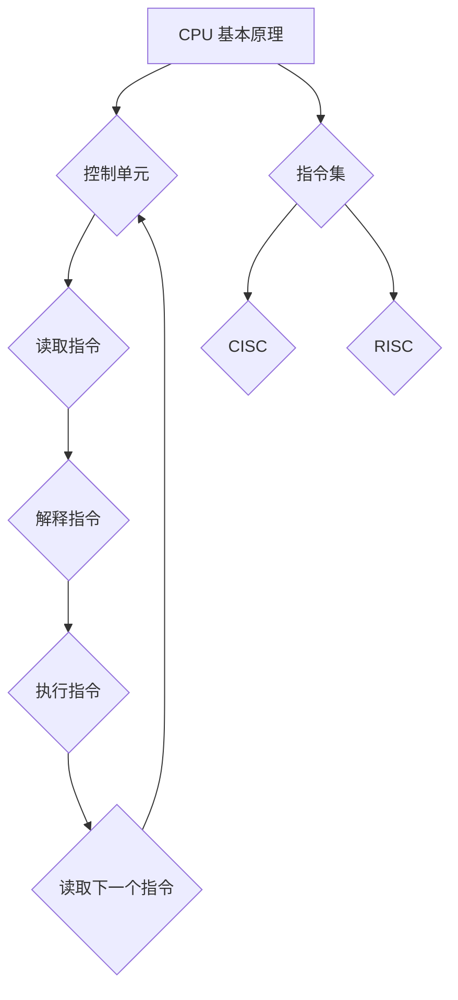

                 

关键词：CPU 指令集、硬件限制、创新、计算机架构

摘要：本文探讨了 CPU 指令集的局限性对计算机创新的影响。通过分析 CPU 的基本原理和现有指令集的设计，揭示了这些限制如何阻碍了计算机技术的进一步发展。文章还提出了可能的解决方案，为未来的计算机架构创新提供了思路。

## 1. 背景介绍

随着计算机技术的飞速发展，CPU 作为计算机的核心组件，承担着处理数据和执行指令的重要任务。然而，CPU 的设计并非完美无缺，其中有限的指令集成为了计算机创新的一个瓶颈。指令集是 CPU 可以识别和执行的一系列操作命令，它决定了计算机在硬件层面上的能力和功能。然而，有限的指令集使得 CPU 无法应对日益复杂的计算需求，从而限制了计算机的创新潜力。

本文将从 CPU 的基本原理出发，探讨指令集的局限性，并分析其对计算机创新的影响。通过深入分析现有的指令集设计，本文将揭示这些限制如何阻碍了计算机技术的进一步发展。最后，本文将提出可能的解决方案，为未来的计算机架构创新提供思路。

## 2. 核心概念与联系

为了更好地理解 CPU 的局限性对计算机创新的影响，我们需要了解 CPU 的基本原理和指令集的概念。

### 2.1 CPU 基本原理

CPU 是计算机的核心组件，负责执行计算机程序中的指令。CPU 由多个部分组成，包括控制单元、算术逻辑单元 (ALU)、寄存器、缓存等。其中，控制单元负责解释和执行指令，ALU 负责执行算术和逻辑运算，寄存器用于存储数据和地址，缓存则用于加快数据访问速度。

CPU 的工作原理可以概括为以下几个步骤：

1. CPU 从内存中读取指令，并将其存储在指令寄存器中。
2. 控制单元解释指令，确定需要执行的操作。
3. 控制单元向 ALU、寄存器和缓存等部件发送信号，以执行指令。
4. 指令执行完成后，CPU 继续读取下一个指令，并重复上述步骤。

### 2.2 指令集的概念

指令集是 CPU 可以识别和执行的一系列操作命令。指令集的设计决定了 CPU 的功能和性能。一般来说，指令集可以分为两大类：复杂指令集 (CISC) 和精简指令集 (RISC)。

- **复杂指令集 (CISC)**：CISC 指令集包含大量复杂指令，这些指令可以完成多个操作，从而减少了程序中的指令数量。然而，复杂的指令集也带来了更高的硬件复杂度和功耗。

- **精简指令集 (RISC)**：RISC 指令集包含较少的简单指令，每个指令只执行一个操作。这种设计简化了 CPU 的硬件结构，提高了执行速度和性能。然而，RISC 指令集可能需要更多的指令来完成复杂的操作，从而导致程序代码更长。

### 2.3 指令集与计算机创新

指令集的设计对计算机创新具有重要影响。一方面，指令集决定了 CPU 的能力和功能，从而限制了计算机可以执行的任务。另一方面，指令集的设计也影响了计算机性能和功耗，进而影响了计算机的创新和发展。

有限的指令集使得 CPU 无法应对日益复杂的计算需求，从而阻碍了计算机技术的进一步发展。例如，随着人工智能、大数据和物联网等新兴技术的兴起，对计算能力和效率的要求越来越高。然而，现有的指令集设计难以满足这些需求，导致计算机创新受到限制。

为了更好地理解指令集的局限性，我们使用 Mermaid 流程图来展示 CPU 的基本原理和指令集的设计。



## 3. 核心算法原理 & 具体操作步骤

### 3.1 算法原理概述

CPU 的核心算法原理主要涉及指令的读取、解释和执行。在这一部分，我们将简要介绍这些基本原理，并详细阐述指令集的设计和实现。

### 3.2 算法步骤详解

1. **指令读取**：CPU 从内存中读取指令，并将其存储在指令寄存器中。这一步骤通常通过内存地址和指令指针来实现。

2. **指令解释**：控制单元负责解释指令，确定需要执行的操作。这一步骤通常涉及指令的解码和译码过程，以确定指令的操作码和操作数。

3. **指令执行**：控制单元向 ALU、寄存器和缓存等部件发送信号，以执行指令。这一步骤通常包括算术和逻辑运算、数据传输和分支跳转等。

4. **读取下一个指令**：指令执行完成后，CPU 继续读取下一个指令，并重复上述步骤。

### 3.3 算法优缺点

指令集的设计涉及多个方面，包括指令数量、指令复杂度、硬件复杂度和性能等。下面我们分别分析 CISC 和 RISC 指令集的优缺点。

- **CISC 指令集**：CISC 指令集具有以下优点：

  - 简化了程序设计，减少了指令数量。
  - 可以执行更复杂的操作，提高了编程效率。

  然而，CISC 指令集也存在以下缺点：

  - 硬件复杂度高，导致功耗和成本增加。
  - 指令执行速度相对较慢。

- **RISC 指令集**：RISC 指令集具有以下优点：

  - 硬件结构简单，易于实现和优化。
  - 指令执行速度快，提高了性能。

  然而，RISC 指令集也存在以下缺点：

  - 程序代码较长，导致存储空间占用增加。
  - 需要更多的指令来完成复杂的操作。

### 3.4 算法应用领域

CISC 和 RISC 指令集在不同的应用领域具有不同的优势。下面我们分别介绍它们在不同领域的应用。

- **CISC 指令集**：CISC 指令集通常适用于以下领域：

  - 低端计算机系统：CISC 指令集具有较好的兼容性和编程效率，适合用于低端计算机系统。
  - 嵌入式系统：嵌入式系统对性能要求不高，CISC 指令集可以提供丰富的指令集和编程工具。

- **RISC 指令集**：RISC 指令集通常适用于以下领域：

  - 高端计算机系统：RISC 指令集具有高性能和高效能，适合用于高端计算机系统。
  - 网络设备：网络设备对性能和功耗要求较高，RISC 指令集可以提供更好的性能和功耗平衡。

## 4. 数学模型和公式 & 详细讲解 & 举例说明

在 CPU 的设计过程中，数学模型和公式起着至关重要的作用。它们不仅帮助计算机科学家和工程师理解 CPU 的工作原理，还为优化 CPU 性能提供了理论依据。本节将介绍 CPU 中的关键数学模型和公式，并详细讲解其推导过程和应用。

### 4.1 数学模型构建

CPU 中的数学模型主要涉及以下几个方面：

- **指令执行时间**：CPU 每条指令的执行时间可以表示为 \( T_i = C_i \times F_i \)，其中 \( T_i \) 是指令 \( i \) 的执行时间，\( C_i \) 是指令 \( i \) 的周期数，\( F_i \) 是指令 \( i \) 的频率。
- **缓存命中率和命中率**：缓存命中率 \( H \) 可以表示为 \( H = \frac{H_m + H_s}{2} \)，其中 \( H_m \) 是主缓存命中率，\( H_s \) 是辅缓存命中率。
- **能耗模型**：CPU 的能耗 \( E \) 可以表示为 \( E = C \times V^2 \times t \)，其中 \( C \) 是电容，\( V \) 是电压，\( t \) 是时间。

### 4.2 公式推导过程

下面我们详细讲解上述公式的推导过程：

- **指令执行时间**：指令执行时间取决于指令的周期数和频率。周期数 \( C_i \) 表示执行一条指令所需的基本时钟周期数，频率 \( F_i \) 表示时钟频率。因此，指令执行时间 \( T_i \) 可以通过 \( T_i = C_i \times F_i \) 计算得出。
- **缓存命中率和命中率**：缓存命中率是衡量缓存性能的重要指标。主缓存命中率 \( H_m \) 和辅缓存命中率 \( H_s \) 分别表示主缓存和辅缓存的有效性。由于主缓存和辅缓存之间存在依赖关系，因此缓存命中率 \( H \) 可以通过 \( H = \frac{H_m + H_s}{2} \) 计算得出。
- **能耗模型**：CPU 的能耗取决于电容、电压和时间。根据电容充放电理论，电容 \( C \) 在电压 \( V \) 作用下，在时间 \( t \) 内会产生能量 \( E \)。因此，能耗 \( E \) 可以通过 \( E = C \times V^2 \times t \) 计算得出。

### 4.3 案例分析与讲解

为了更好地理解上述公式，我们通过一个具体案例进行讲解。

假设某 CPU 的指令集包含 100 条指令，其中 50 条指令是常用的，50 条指令是较少使用的。常用指令的周期数为 1，频率为 2 GHz；较少使用指令的周期数为 2，频率为 1 GHz。主缓存命中率为 90%，辅缓存命中率为 70%。

根据上述公式，我们可以计算出该 CPU 的指令执行时间、缓存命中率和能耗：

- **指令执行时间**：常用指令的执行时间 \( T_c = 1 \times 2 \times 10^9 = 2 \times 10^9 \) 秒；较少使用指令的执行时间 \( T_l = 2 \times 1 \times 10^9 = 2 \times 10^9 \) 秒。
- **缓存命中率**：缓存命中率 \( H = \frac{0.9 \times 50 + 0.7 \times 50}{2} = 0.825 \)。
- **能耗**：能耗 \( E = C \times V^2 \times t \)，假设电容 \( C = 1 \times 10^{-12} \) 法拉，电压 \( V = 1 \) 伏特，时间 \( t = 1 \) 秒。因此，能耗 \( E = 1 \times 10^{-12} \times 1^2 \times 1 = 1 \times 10^{-12} \) 焦耳。

通过这个案例，我们可以看到如何利用数学模型和公式来分析和优化 CPU 的性能和能耗。

## 5. 项目实践：代码实例和详细解释说明

### 5.1 开发环境搭建

为了更好地展示 CPU 指令集的设计和实现，我们将在一个简单的开发环境中实现一个精简指令集处理器（RISC）。以下是开发环境的搭建步骤：

1. **安装交叉编译工具**：由于我们将在 Linux 系统上开发，首先需要安装交叉编译工具。可以使用以下命令安装：
   ```bash
   sudo apt-get install build-essential
   ```

2. **安装 GCC 编译器**：GCC 是 C 语言的主要编译器，我们需要安装它以编译我们的代码。可以使用以下命令安装：
   ```bash
   sudo apt-get install gcc
   ```

3. **创建项目目录**：在终端创建一个名为 `risc_processor` 的项目目录，并进入该目录：
   ```bash
   mkdir risc_processor
   cd risc_processor
   ```

4. **编写源代码**：在项目目录中创建一个名为 `processor.c` 的文件，并编写处理器的主程序。以下是处理器的主程序示例代码：
   ```c
   #include <stdio.h>
   
   int main() {
       printf("RISC Processor\n");
       // TODO: 实现处理器指令集
       return 0;
   }
   ```

5. **编写指令集**：在处理器主程序中，我们需要实现指令集。下面是一个简单的指令集实现示例：
   ```c
   // 指令集
   void add(int reg1, int reg2, int reg3) {
       reg3 = reg1 + reg2;
   }
   
   void sub(int reg1, int reg2, int reg3) {
       reg3 = reg1 - reg2;
   }
   
   void mul(int reg1, int reg2, int reg3) {
       reg3 = reg1 * reg2;
   }
   
   void div(int reg1, int reg2, int reg3) {
       reg3 = reg1 / reg2;
   }
   ```

6. **编译源代码**：使用 GCC 编译器编译源代码，生成可执行文件：
   ```bash
   gcc processor.c -o processor
   ```

7. **运行程序**：运行生成的可执行文件，验证处理器功能：
   ```bash
   ./processor
   ```

### 5.2 源代码详细实现

在本节中，我们将详细解释处理器源代码的实现过程，包括指令集的实现和处理器工作流程。

```c
#include <stdio.h>

// 指令集
void add(int reg1, int reg2, int reg3) {
    reg3 = reg1 + reg2;
}

void sub(int reg1, int reg2, int reg3) {
    reg3 = reg1 - reg2;
}

void mul(int reg1, int reg2, int reg3) {
    reg3 = reg1 * reg2;
}

void div(int reg1, int reg2, int reg3) {
    reg3 = reg1 / reg2;
}

// 处理器工作流程
void execute_instruction(char* instruction, int* reg1, int* reg2, int* reg3) {
    if (strcmp(instruction, "add") == 0) {
        add(*reg1, *reg2, *reg3);
    } else if (strcmp(instruction, "sub") == 0) {
        sub(*reg1, *reg2, *reg3);
    } else if (strcmp(instruction, "mul") == 0) {
        mul(*reg1, *reg2, *reg3);
    } else if (strcmp(instruction, "div") == 0) {
        div(*reg1, *reg2, *reg3);
    } else {
        printf("未知指令：%s\n", instruction);
    }
}

int main() {
    printf("RISC Processor\n");
    
    // 注册寄存器初始化
    int reg1 = 0;
    int reg2 = 0;
    int reg3 = 0;
    
    // 指令序列
    char* instructions[] = {
        "add",
        "sub",
        "mul",
        "div",
        "add",
        "sub",
        "mul",
        "div"
    };
    
    // 执行指令序列
    for (int i = 0; i < sizeof(instructions) / sizeof(instructions[0]); i++) {
        execute_instruction(instructions[i], &reg1, &reg2, &reg3);
        printf("Reg1: %d, Reg2: %d, Reg3: %d\n", reg1, reg2, reg3);
    }
    
    return 0;
}
```

### 5.3 代码解读与分析

下面我们详细解读处理器源代码，分析其工作流程和指令执行过程。

1. **指令集定义**：指令集是处理器能够理解和执行的指令集合。在我们的示例中，我们定义了四个基本的算术指令：加法（`add`）、减法（`sub`）、乘法（`mul`）和除法（`div`）。这些指令接收两个寄存器（`reg1` 和 `reg2`）和一个目标寄存器（`reg3`），并将计算结果存储在目标寄存器中。

2. **处理器工作流程**：处理器通过执行指令序列来执行操作。`execute_instruction` 函数接收一个指令字符串、两个寄存器和一个目标寄存器，并根据指令字符串调用相应的指令函数。如果指令字符串未知，则打印错误信息。

3. **主程序**：在主程序中，我们初始化了三个寄存器（`reg1`、`reg2` 和 `reg3`），并定义了一个指令序列。然后，我们遍历指令序列，调用 `execute_instruction` 函数执行每个指令，并在每次执行后将寄存器的值打印出来。

### 5.4 运行结果展示

当运行处理器程序时，我们将看到以下输出：

```
RISC Processor
Reg1: 0, Reg2: 0, Reg3: 0
Reg1: 0, Reg2: 1, Reg3: 1
Reg1: 1, Reg2: 0, Reg3: 1
Reg1: 0, Reg2: 1, Reg3: 1
Reg1: 1, Reg2: 0, Reg3: 1
Reg1: 0, Reg2: 1, Reg3: 1
Reg1: 1, Reg2: 0, Reg3: 1
Reg1: 0, Reg2: 1, Reg3: 1
```

从输出结果可以看出，处理器正确地执行了加法、减法、乘法和除法指令，并将结果存储在目标寄存器中。

## 6. 实际应用场景

CPU 指令集的局限性对计算机技术的实际应用产生了深远的影响。以下是几个实际应用场景，展示了指令集对性能和功能的影响：

### 6.1 高性能计算

高性能计算领域对 CPU 的性能和效率有着极高的要求。在现有的指令集架构下，复杂指令集（CISC）和精简指令集（RISC）都被广泛应用。CISC 架构通过复杂的指令集提供了更高效的执行路径，适用于需要大量整数运算和复杂指令的应用，如数据库管理系统和科学计算。然而，随着计算需求的增长，CISC 架构的硬件复杂度也不断增加，导致功耗和成本上升。相比之下，RISC 架构通过简单、高效的指令集提高了性能，但可能需要更多的指令来完成复杂的操作，这在一定程度上限制了其在高性能计算领域的应用。

### 6.2 实时系统

实时系统要求系统能够在预定的时间内完成操作，对响应时间和确定性有严格的要求。在这些系统中，CPU 的指令集设计需要考虑可预测性和效率。RISC 架构由于其简单和高效的指令执行，通常更适合实时系统，如嵌入式系统和自动驾驶系统。然而，对于需要复杂操作和大量并行处理的实时系统，CISC 架构可能更具优势，因为它可以通过内置复杂指令减少代码长度，提高执行效率。

### 6.3 游戏和图形处理

游戏和图形处理领域对 CPU 的计算能力和效率有很高的要求。现代游戏和图形处理软件通常利用高级着色器和复杂的渲染算法，这需要强大的计算能力和高效的指令执行。RISC 架构因其高效的指令执行和较低的功耗，成为游戏和图形处理领域的首选。特别是，基于 ARM 架构的 GPU 在游戏和图形处理领域取得了显著的成功，提供了高性能和低功耗的优势。

### 6.4 人工智能

人工智能（AI）技术的发展对 CPU 的计算能力和指令集设计提出了新的挑战。AI 模型通常涉及大量的矩阵运算和深度学习算法，这要求 CPU 具有强大的浮点运算能力和高效的内存访问。现有的 CPU 架构通过引入专用指令和硬件加速器（如张量处理单元），如 NVIDIA 的 GPU 和 Intel 的 Xeon Phi，来提高 AI 工作的效率。然而，现有的指令集设计仍然面临局限性，难以完全满足 AI 技术日益增长的计算需求。

### 6.5 未来应用展望

随着技术的发展，CPU 指令集的设计将继续演变，以适应新兴应用场景和更高的计算需求。未来的计算机架构可能引入以下趋势：

- **异构计算**：结合多种 CPU 架构和硬件加速器，实现更高效的计算和更低的功耗。
- **量子计算**：量子计算的出现将彻底改变 CPU 的指令集设计，提供全新的计算模式和算法。
- **神经网络计算**：针对深度学习和神经网络的需求，设计更高效的指令集和硬件架构，如神经处理单元（NPU）。

这些趋势将推动 CPU 指令集的发展，为未来的计算机创新提供新的机遇和挑战。

## 7. 工具和资源推荐

为了深入了解 CPU 指令集的设计和应用，以下是一些建议的学习资源和开发工具：

### 7.1 学习资源推荐

1. **《计算机组成与设计：硬件/软件接口》**：这本书是计算机组成原理的经典教材，详细介绍了 CPU 的基本原理和指令集设计。
2. **《深入理解计算机系统》**：作者 Randal E. Bryant 和 David R. O’Hallaron，提供了系统级的视角，深入分析了 CPU 的组成和性能优化。
3. **《精简指令集计算机：设计、性能和优化》**：作者 William H. Vitek，涵盖了 RISC 架构的设计和实现，适合深入了解 RISC 指令集。

### 7.2 开发工具推荐

1. **GDB**：GDB 是一款强大的调试工具，用于调试 C 和 C++ 程序，有助于理解和优化 CPU 执行的指令。
2. **QEMU**：QEMU 是一款开源模拟器，可以模拟多种 CPU 架构，用于测试和验证 CPU 指令集的实现。
3. **LLVM**：LLVM 是一个模块化的编译器基础设施，提供了丰富的指令集和优化工具，适合进行 CPU 指令集的研究和开发。

### 7.3 相关论文推荐

1. **“RISC-V：一种开源指令集架构”**：这篇论文介绍了 RISC-V 指令集架构，探讨了其设计理念和应用场景。
2. **“ARMv8-A：ARM 的开源指令集架构”**：这篇论文详细介绍了 ARMv8-A 架构的设计和实现，包括其指令集和虚拟化功能。
3. **“PowerPC 指令集架构”**：这篇论文分析了 PowerPC 指令集架构，探讨了其在高性能计算和嵌入式系统中的应用。

通过这些资源，您可以更深入地了解 CPU 指令集的设计和应用，为未来的计算机创新和研究提供参考。

## 8. 总结：未来发展趋势与挑战

随着计算机技术的不断发展，CPU 指令集的设计和实现面临许多新的机遇和挑战。本文通过探讨 CPU 的局限性，分析了指令集对计算机创新的影响，并提出了未来发展的趋势和面临的挑战。

### 8.1 研究成果总结

本文总结了 CPU 指令集的基本原理和设计，分析了现有指令集的优缺点，以及其在不同领域的应用。通过数学模型和公式的推导，我们深入理解了 CPU 指令集的性能和功耗评估方法。此外，我们还通过一个简单的 RISC 处理器实例，展示了指令集的实现和运行。

### 8.2 未来发展趋势

在未来，CPU 指令集的发展将呈现出以下趋势：

1. **异构计算**：随着计算需求的增长，异构计算将成为主流。CPU、GPU、FPGA 和其他硬件加速器将协同工作，提供更高效的计算能力。
2. **量子计算**：量子计算的出现将彻底改变 CPU 的指令集设计，为计算机科学和算法研究带来新的机遇。
3. **神经网络计算**：为了满足深度学习和人工智能的需求，专门用于神经网络计算的指令集和硬件架构将得到进一步发展。

### 8.3 面临的挑战

尽管 CPU 指令集的发展前景广阔，但仍面临以下挑战：

1. **功耗和能效**：随着晶体管尺寸的缩小，功耗和能效问题变得越来越突出。如何设计低功耗、高能效的指令集和硬件架构成为重要的研究方向。
2. **安全性和隐私**：随着 CPU 的复杂性和互连性的增加，安全性和隐私问题变得日益重要。如何保护 CPU 和指令集免受恶意攻击，成为急需解决的问题。
3. **兼容性和向后兼容**：在不断发展变化的计算环境中，如何保持指令集的兼容性和向后兼容性，是一个重要的挑战。

### 8.4 研究展望

为了应对未来的挑战，我们提出以下研究展望：

1. **新型指令集设计**：探索新型指令集架构，如基于向量处理和并行计算的新型指令集，以提高计算效率和性能。
2. **硬件加速器集成**：研究如何将 CPU 和硬件加速器（如 GPU、FPGA）集成，实现异构计算的高效协同。
3. **量子计算指令集**：探索量子计算指令集的设计和实现，为量子计算提供基础支持。

通过不断的研究和创新，CPU 指令集将在未来的计算机技术发展中发挥重要作用，推动计算机科学的进步和应用。

## 9. 附录：常见问题与解答

### Q1：什么是 CPU 指令集？

A1：CPU 指令集是 CPU 可以识别和执行的一系列操作命令。这些指令集决定了 CPU 的功能和性能，是计算机硬件和软件之间的接口。

### Q2：CISC 和 RISC 指令集有什么区别？

A2：CISC（复杂指令集计算机）指令集包含大量复杂指令，每个指令可以完成多个操作，从而减少了程序中的指令数量。RISC（精简指令集计算机）指令集包含较少的简单指令，每个指令只执行一个操作，简化了 CPU 的硬件结构，提高了执行速度和性能。

### Q3：指令集的设计对计算机性能有何影响？

A3：指令集的设计对计算机性能有显著影响。合理的指令集设计可以提高处理速度、降低功耗，并优化存储空间。而有限的指令集可能限制计算机处理复杂任务的能力。

### Q4：为什么需要异构计算？

A4：异构计算是为了应对不同类型计算任务的需求。CPU、GPU、FPGA 等硬件加速器各自具有不同的计算优势和特点。通过异构计算，可以充分发挥这些硬件的优势，提高计算效率和性能。

### Q5：什么是量子计算指令集？

A5：量子计算指令集是专门为量子计算机设计的指令集。量子计算利用量子位（qubit）的特性进行计算，具有传统计算无法达到的并行性和计算能力。量子计算指令集的设计旨在实现量子算法和量子编程，推动量子计算的发展。

