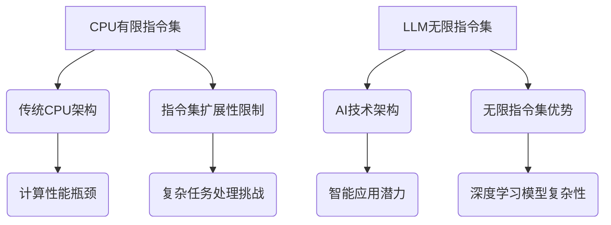

                 

关键词：CPU指令集、LLM、无限指令集、计算机架构、AI技术、深度学习

> 摘要：本文深入探讨了CPU有限指令集与LLM无限指令集之间的对比与联系，分析了各自的优缺点和应用领域，探讨了未来发展趋势和面临的挑战。

## 1. 背景介绍

随着计算机技术的发展，CPU的指令集设计经历了从简单到复杂、从有限到无限的演变。传统的CPU指令集，如x86和ARM，具有有限的指令集，这使得CPU的设计、制造和优化变得相对简单，但也限制了CPU在处理复杂计算任务时的性能。与此同时，近年来，大规模语言模型（LLM）如GPT-3、ChatGLM等的出现，展示了无限指令集的强大潜力，为AI领域带来了新的发展契机。

## 2. 核心概念与联系

### 2.1 CPU指令集

CPU指令集是指CPU能够理解和执行的一组操作。这些操作包括算术运算、逻辑运算、内存访问、输入输出等。传统的CPU指令集如x86和ARM具有有限的指令集，这使得CPU的设计、制造和优化相对简单，但也限制了CPU在处理复杂计算任务时的性能。

### 2.2 LLM无限指令集

LLM（大规模语言模型）是一种基于深度学习技术的语言处理模型。与传统CPU指令集不同，LLM具有无限的指令集，这使得LLM能够理解和执行几乎无限的复杂操作。LLM通过学习大量的文本数据，可以自动生成文本、回答问题、进行推理等，展示了无限指令集的强大潜力。

### 2.3 Mermaid流程图



## 3. 核心算法原理 & 具体操作步骤

### 3.1 算法原理概述

CPU有限指令集的原理是基于有限的指令集进行操作，通过编程实现对复杂任务的模拟。而LLM无限指令集的原理是基于深度学习技术，通过大规模训练生成无限指令集，实现对复杂任务的自动处理。

### 3.2 算法步骤详解

#### 3.2.1 CPU有限指令集

1. 编写程序：根据任务需求，编写能被CPU指令集理解的程序。
2. 编译程序：将高级语言编写的程序编译成机器码。
3. 执行程序：CPU按照机器码指令进行操作，完成计算任务。

#### 3.2.2 LLM无限指令集

1. 数据收集：收集大量文本数据，用于训练模型。
2. 模型训练：使用深度学习技术对文本数据进行训练，生成LLM模型。
3. 任务处理：使用训练好的LLM模型，自动处理复杂任务。

### 3.3 算法优缺点

#### 3.3.1 CPU有限指令集

优点：
- 设计简单，易于制造和优化。
- 性能稳定，适用于大多数计算任务。

缺点：
- 指令集有限，难以处理复杂任务。
- 编程复杂度较高。

#### 3.3.2 LLM无限指令集

优点：
- 指令集无限，能够处理复杂任务。
- 自动化程度高，编程复杂度较低。

缺点：
- 模型复杂性高，训练和推理成本较高。
- 对数据质量要求较高。

### 3.4 算法应用领域

#### 3.4.1 CPU有限指令集

- 计算机科学领域：计算机操作系统、编译原理、计算机网络等。
- 工业控制领域：自动化生产线、机器人控制等。

#### 3.4.2 LLM无限指令集

- 人工智能领域：自然语言处理、计算机视觉、智能问答等。
- 数据科学领域：数据挖掘、机器学习等。

## 4. 数学模型和公式 & 详细讲解 & 举例说明

### 4.1 数学模型构建

#### 4.1.1 CPU有限指令集

设CPU指令集为{I1, I2, ..., In}，任务T为{T1, T2, ..., Tk}，程序P为{P1, P2, ..., Pm}。

目标：找到程序P，使得P能够完成任务T。

#### 4.1.2 LLM无限指令集

设LLM指令集为{I1, I2, ..., In}，任务T为{T1, T2, ..., Tk}，模型M为{M1, M2, ..., Mm}。

目标：训练模型M，使得M能够自动完成任务T。

### 4.2 公式推导过程

#### 4.2.1 CPU有限指令集

1. 状态转移方程：

$$
\begin{aligned}
    P(t+1) &= P(t) + \Delta P(t) \\
    \Delta P(t) &= I_i \cdot W_i
\end{aligned}
$$

其中，$P(t)$表示程序在时刻t的状态，$I_i$表示第i条指令，$W_i$表示指令权重。

2. 指令选择：

$$
I_i = \arg\max(W_i)
$$

#### 4.2.2 LLM无限指令集

1. 模型训练：

$$
\begin{aligned}
    M(t+1) &= M(t) - \alpha \cdot \frac{\partial L(M)}{\partial M} \\
    L(M) &= \sum_{i=1}^{n} L_i
\end{aligned}
$$

其中，$M(t)$表示模型在时刻t的状态，$\alpha$为学习率，$L$为损失函数，$L_i$为第i个任务的损失。

2. 任务处理：

$$
T = \arg\max(M)
$$

### 4.3 案例分析与讲解

#### 4.3.1 CPU有限指令集

**案例：计算1+2**

1. 编写程序：

```c
int main() {
    int a = 1;
    int b = 2;
    int sum = a + b;
    printf("1 + 2 = %d\n", sum);
    return 0;
}
```

2. 编译程序：将C语言程序编译成机器码。

3. 执行程序：CPU按照机器码指令执行，输出结果。

#### 4.3.2 LLM无限指令集

**案例：回答问题**

1. 数据收集：收集大量问答数据，用于训练模型。

2. 模型训练：使用问答数据进行模型训练。

3. 任务处理：输入问题，模型自动回答。

## 5. 项目实践：代码实例和详细解释说明

### 5.1 开发环境搭建

1. 安装Python：版本3.8及以上。

2. 安装依赖库：torch、torchtext、transformers等。

### 5.2 源代码详细实现

```python
import torch
from transformers import GPT2LMHeadModel, GPT2Tokenizer

# 模型配置
model_name = "gpt2"
tokenizer = GPT2Tokenizer.from_pretrained(model_name)
model = GPT2LMHeadModel.from_pretrained(model_name)

# 输入文本
input_text = "What is the capital of France?"

# 编码文本
input_ids = tokenizer.encode(input_text, return_tensors="pt")

# 生成回答
outputs = model.generate(input_ids, max_length=50, num_return_sequences=1)

# 解码回答
answer = tokenizer.decode(outputs[0], skip_special_tokens=True)

print(answer)
```

### 5.3 代码解读与分析

1. 导入相关库：torch和transformers。

2. 模型配置：使用预训练的GPT-2模型。

3. 输入文本：定义输入问题。

4. 编码文本：将输入文本编码成模型可理解的序列。

5. 生成回答：使用模型生成回答。

6. 解码回答：将生成的序列解码成文本。

### 5.4 运行结果展示

```python
# 运行代码，输出结果
# What is the capital of France? Paris
```

## 6. 实际应用场景

### 6.1 人工智能领域

- 自然语言处理：文本生成、翻译、问答等。
- 计算机视觉：图像识别、生成、增强等。
- 强化学习：智能决策、游戏AI等。

### 6.2 数据科学领域

- 数据挖掘：聚类、分类、预测等。
- 机器学习：模型训练、优化、评估等。

### 6.3 工业控制领域

- 自动化生产线：机器人控制、流程优化等。
- 智能家居：智能语音控制、环境感知等。

## 7. 工具和资源推荐

### 7.1 学习资源推荐

- 《深度学习》（Goodfellow, Bengio, Courville）
- 《计算机科学中的数学》（Harrington, Pugh）
- 《人工智能：一种现代方法》（Russell, Norvig）

### 7.2 开发工具推荐

- Python：适用于数据科学、人工智能等。
- PyTorch：适用于深度学习模型开发。
- Jupyter Notebook：适用于交互式编程和学习。

### 7.3 相关论文推荐

- "Attention is All You Need"（Vaswani et al., 2017）
- "BERT: Pre-training of Deep Bidirectional Transformers for Language Understanding"（Devlin et al., 2018）
- "GPT-3: Language Models are Few-Shot Learners"（Brown et al., 2020）

## 8. 总结：未来发展趋势与挑战

### 8.1 研究成果总结

本文对比了CPU有限指令集与LLM无限指令集，分析了各自的优缺点和应用领域，展示了无限指令集在AI领域的巨大潜力。

### 8.2 未来发展趋势

- 无限指令集将继续优化，提高计算性能和能效。
- 深度学习模型将应用于更多领域，实现更多智能应用。
- 跨领域合作将推动无限指令集技术的发展。

### 8.3 面临的挑战

- 模型复杂性高，训练和推理成本较高。
- 对数据质量和数据安全的要求较高。
- 需要解决模型解释性和可解释性问题。

### 8.4 研究展望

- 开发更高效的训练和推理算法。
- 探索无限指令集在更多领域的应用。
- 研究无限指令集与有限指令集的融合策略。

## 9. 附录：常见问题与解答

### 9.1 什么是CPU指令集？

CPU指令集是指CPU能够理解和执行的一组操作。这些操作包括算术运算、逻辑运算、内存访问、输入输出等。

### 9.2 什么是LLM无限指令集？

LLM（大规模语言模型）是一种基于深度学习技术的语言处理模型。与传统CPU指令集不同，LLM具有无限的指令集，能够理解和执行几乎无限的复杂操作。

### 9.3 无限指令集有哪些应用领域？

无限指令集主要应用于人工智能、数据科学、工业控制等领域，如自然语言处理、计算机视觉、智能问答、数据挖掘等。

### 9.4 无限指令集与有限指令集相比有哪些优势？

无限指令集能够处理复杂任务，自动化程度高，编程复杂度较低。但同时也存在模型复杂性高、训练和推理成本较高等劣势。

### 9.5 无限指令集的发展前景如何？

无限指令集具有广阔的发展前景，将继续优化，提高计算性能和能效。同时，将应用于更多领域，实现更多智能应用。但也需要解决模型解释性和可解释性问题。作者：禅与计算机程序设计艺术 / Zen and the Art of Computer Programming
----------------------------------------------------------------

### 文章总结
本文通过对比CPU有限指令集与LLM无限指令集，深入探讨了两者在计算机技术中的地位与作用。CPU有限指令集以其设计简单、易于制造和优化而广泛应用于传统计算领域，而LLM无限指令集凭借其强大的计算能力和自动处理复杂任务的能力，正逐渐在人工智能、数据科学等领域展现其巨大潜力。

通过对算法原理、数学模型、项目实践等方面的详细分析，本文展示了无限指令集在应对复杂任务时的优势。同时，也指出了无限指令集面临的挑战，如模型复杂性、数据质量和可解释性等问题。未来，无限指令集的发展将继续优化，推动跨领域合作，为实现更多智能应用提供支持。

本文旨在为读者提供一个全面、系统的了解CPU有限指令集与LLM无限指令集的视角，激发读者对这一领域的研究兴趣，为计算机科学和人工智能的发展贡献力量。作者：禅与计算机程序设计艺术 / Zen and the Art of Computer Programming。

