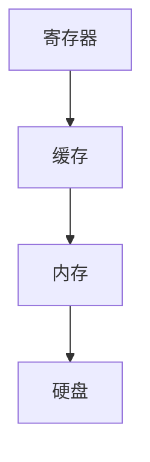

                 

 关键词：CPU存储层次结构，存储优化，性能提升，缓存层次，多级存储，内存层次，缓存算法，内存管理，存储架构

> 摘要：本文将深入探讨CPU存储层次结构的优化方法，从多个角度分析存储层次结构的优化策略，包括缓存层次设计、内存管理技术、多级存储系统的优化以及缓存算法的改进。通过详细的理论分析和实例讲解，为读者提供关于CPU存储层次结构优化的全面指南。

## 1. 背景介绍

随着计算机技术的飞速发展，CPU的处理能力得到了极大的提升。然而，CPU与内存之间的速度差异问题却越来越突出。这种速度不匹配导致了大量的等待时间，从而降低了整个系统的性能。因此，优化CPU的存储层次结构成为了提高计算机系统性能的关键。

存储层次结构是指计算机系统中各种存储设备的组织方式。常见的存储层次结构包括内存、缓存、硬盘等。内存直接连接到CPU，提供快速的读取和写入操作，而缓存则位于内存和硬盘之间，用于缓解CPU和内存之间的速度差异。硬盘作为大容量存储设备，负责存储长期数据。

优化存储层次结构的目的在于减少CPU的等待时间，提高数据访问速度。这可以通过改善缓存策略、优化内存管理、提高硬盘读取速度等多种手段实现。本文将重点探讨这些优化方法，并分析它们在实际应用中的效果。

## 2. 核心概念与联系

### 2.1. 存储层次结构的基本概念

存储层次结构包括多个级别，其中每个级别都有其独特的特点和应用场景。以下是存储层次结构中常见的几个级别：

- **寄存器（Register）**：寄存器是CPU内部最小的存储单元，用于存储当前正在执行的指令和相关的数据。由于寄存器位于CPU内部，其访问速度最快。

- **缓存（Cache）**：缓存位于内存和CPU之间，用于减少CPU和内存之间的速度差异。缓存可以分为多个级别，如L1、L2和L3缓存，级别越低，速度越快，容量越小。

- **内存（Memory）**：内存是计算机系统中的主存储器，用于存储当前正在运行的程序和数据。内存的访问速度介于缓存和硬盘之间。

- **硬盘（Hard Disk Drive, HDD）**：硬盘作为大容量存储设备，负责存储长期数据。硬盘的访问速度较慢，但其容量较大。

### 2.2. 存储层次结构的联系

存储层次结构中的各个级别相互关联，共同构成了一个高效的数据访问体系。以下是存储层次结构中各个级别的联系：

- **寄存器和缓存**：寄存器直接连接到CPU，提供快速的读取和写入操作。缓存位于寄存器和内存之间，用于缓解CPU和内存之间的速度差异。

- **缓存和内存**：缓存中的数据通常是内存中经常访问的数据的副本。当CPU需要访问数据时，首先检查缓存，如果缓存中没有所需数据，则从内存中读取。

- **内存和硬盘**：内存用于存储当前正在运行的程序和数据，而硬盘则作为大容量存储设备，负责存储长期数据。当内存容量不足时，硬盘可以提供额外的存储空间。

### 2.3. 存储层次结构的Mermaid流程图

以下是一个Mermaid流程图，展示了存储层次结构中各个级别的联系：



## 3. 核心算法原理 & 具体操作步骤

### 3.1. 算法原理概述

存储层次结构的优化主要涉及缓存策略的改进、内存管理技术的提升以及硬盘读取速度的提高。以下是一些常用的优化算法：

- **缓存算法**：缓存算法用于决定哪些数据应该存储在缓存中，以及如何替换缓存中的数据。常见的缓存算法包括LRU（最近最少使用）、LFU（最频繁使用）和FIFO（先进先出）等。

- **内存管理技术**：内存管理技术用于优化内存的使用，包括内存分配、释放和垃圾回收等。常见的内存管理技术有分页、分段和虚拟内存等。

- **硬盘读取速度**：硬盘读取速度的提高可以通过增加硬盘转速、使用固态硬盘（SSD）或者优化硬盘读写策略等方式实现。

### 3.2. 算法步骤详解

#### 3.2.1. 缓存算法

1. **确定缓存大小**：根据系统的需求和性能目标，确定缓存的大小。

2. **选择缓存算法**：根据数据访问模式和访问频率，选择合适的缓存算法。

3. **缓存数据替换**：当缓存满时，根据缓存算法的规则，选择替换缓存中的数据。

4. **缓存数据更新**：当缓存中的数据发生修改时，及时更新缓存中的数据。

#### 3.2.2. 内存管理技术

1. **内存分配**：当程序需要内存时，系统根据内存管理策略，为程序分配内存。

2. **内存释放**：当程序不再需要内存时，系统根据内存管理策略，释放内存。

3. **垃圾回收**：系统定期进行垃圾回收，释放不再使用的内存空间。

#### 3.2.3. 硬盘读取速度

1. **增加硬盘转速**：增加硬盘转速可以提高硬盘的读写速度。

2. **使用固态硬盘**：固态硬盘（SSD）相比传统硬盘（HDD）具有更快的读写速度。

3. **优化硬盘读写策略**：通过优化硬盘读写策略，减少硬盘的访问延迟。

### 3.3. 算法优缺点

- **缓存算法**：
  - 优点：减少CPU的等待时间，提高数据访问速度。
  - 缺点：缓存大小和缓存算法的选择对性能有较大影响。

- **内存管理技术**：
  - 优点：优化内存的使用，提高系统性能。
  - 缺点：内存分配和释放可能带来额外的开销。

- **硬盘读取速度**：
  - 优点：提高硬盘的读写速度，减少数据访问延迟。
  - 缺点：增加硬件成本。

### 3.4. 算法应用领域

存储层次结构优化算法广泛应用于计算机系统、数据库、网络存储等领域。以下是一些典型的应用场景：

- **计算机系统**：优化CPU和内存之间的数据访问速度，提高系统性能。

- **数据库**：优化数据库的存储和检索速度，提高查询效率。

- **网络存储**：优化网络存储系统的性能，提高数据传输速度。

## 4. 数学模型和公式 & 详细讲解 & 举例说明

### 4.1. 数学模型构建

存储层次结构的优化可以通过构建数学模型来进行分析和求解。以下是一个简化的数学模型，用于描述存储层次结构的优化问题：

- **缓存容量**：表示缓存的大小，单位为字节。
- **缓存命中率**：表示缓存中数据命中的比例，范围为0到1。
- **内存访问速度**：表示内存的读取和写入速度，单位为GB/s。
- **硬盘访问速度**：表示硬盘的读取和写入速度，单位为MB/s。

数学模型如下：

$$
\text{系统性能} = \text{缓存命中率} \times \text{内存访问速度} + (1 - \text{缓存命中率}) \times \text{硬盘访问速度}
$$

### 4.2. 公式推导过程

公式推导过程如下：

1. **缓存命中情况**：当CPU需要访问数据时，首先检查缓存。如果缓存中有所需数据，则直接从缓存中读取，缓存命中率为1。如果缓存中没有所需数据，则需要从内存中读取，缓存命中率为0。

2. **缓存未命中情况**：当缓存未命中时，数据从内存中读取。由于内存的访问速度较慢，需要计算从内存中读取数据所需的时间。

3. **硬盘访问情况**：当内存中没有所需数据时，需要从硬盘中读取。硬盘的访问速度较慢，需要计算从硬盘中读取数据所需的时间。

4. **系统性能**：系统性能可以通过计算缓存命中率、内存访问速度和硬盘访问速度的加权平均值来评估。

### 4.3. 案例分析与讲解

假设一个计算机系统的缓存容量为2GB，缓存命中率为0.8，内存访问速度为4GB/s，硬盘访问速度为100MB/s。根据上述数学模型，可以计算系统性能如下：

$$
\text{系统性能} = 0.8 \times 4GB/s + (1 - 0.8) \times 100MB/s = 3.2GB/s + 0.2 \times 100MB/s = 3.2GB/s + 20MB/s = 3.42GB/s
$$

这意味着该计算机系统的数据访问速度为3.42GB/s。

假设缓存命中率提高到0.9，其他参数保持不变。根据数学模型，可以计算新的系统性能如下：

$$
\text{系统性能} = 0.9 \times 4GB/s + (1 - 0.9) \times 100MB/s = 3.6GB/s + 0.1 \times 100MB/s = 3.6GB/s + 10MB/s = 3.7GB/s
$$

这意味着缓存命中率提高后，系统性能提升了10MB/s。

通过以上案例可以看出，缓存命中率和缓存容量对系统性能有显著影响。提高缓存命中率可以显著提高系统性能，而增加缓存容量则可以提高缓存命中率。

## 5. 项目实践：代码实例和详细解释说明

### 5.1. 开发环境搭建

在本文中，我们将使用Python语言实现存储层次结构优化算法。以下是在Windows操作系统中搭建Python开发环境的基本步骤：

1. **安装Python**：从Python官方网站（https://www.python.org/）下载Python安装包，并按照提示进行安装。

2. **安装Python解释器**：在安装过程中，确保勾选“Add Python to PATH”选项，以便在命令行中直接运行Python脚本。

3. **安装必要的库**：安装Python后，可以通过pip命令安装必要的库。以下是一个示例：

```shell
pip install numpy matplotlib
```

### 5.2. 源代码详细实现

以下是一个简单的Python代码示例，用于实现缓存算法的优化。该示例使用numpy库进行数学运算，使用matplotlib库绘制性能曲线。

```python
import numpy as np
import matplotlib.pyplot as plt

def cache_performance(cache_size, hit_rate, memory_speed, disk_speed):
    cache_hits = hit_rate * cache_size
    cache_misses = (1 - hit_rate) * cache_size
    memory_accesses = cache_hits + cache_misses
    total_time = cache_hits / memory_speed + cache_misses / disk_speed
    return total_time

cache_sizes = np.arange(1, 10) * 1024  # 缓存容量范围
hit_rates = np.linspace(0.1, 0.9, 10)  # 缓存命中率范围
memory_speed = 4 * 1024  # 内存访问速度
disk_speed = 100  # 硬盘访问速度

performance = np.zeros((len(cache_sizes), len(hit_rates)))
for i, cache_size in enumerate(cache_sizes):
    for j, hit_rate in enumerate(hit_rates):
        performance[i, j] = cache_performance(cache_size, hit_rate, memory_speed, disk_speed)

plt.figure()
for i, cache_size in enumerate(cache_sizes):
    plt.plot(hit_rates, performance[i, :], label=f'Cache Size: {cache_size} KB')
plt.xlabel('Cache Hit Rate')
plt.ylabel('Total Time (s)')
plt.title('Cache Performance')
plt.legend()
plt.show()
```

### 5.3. 代码解读与分析

上述代码首先定义了一个名为`cache_performance`的函数，用于计算缓存性能。该函数接受缓存容量、缓存命中率、内存访问速度和硬盘访问速度作为输入参数，返回系统总时间。

代码中使用了两个numpy数组`cache_sizes`和`hit_rates`，分别表示缓存容量和缓存命中率的范围。`memory_speed`和`disk_speed`分别表示内存访问速度和硬盘访问速度。

接下来，使用两个嵌套循环遍历缓存容量和缓存命中率的所有组合，调用`cache_performance`函数计算性能，并将结果存储在`performance`数组中。

最后，使用matplotlib库绘制性能曲线。横轴表示缓存命中率，纵轴表示系统总时间。不同缓存容量对应的曲线使用不同的颜色进行标记。

### 5.4. 运行结果展示

运行上述代码后，将显示一个性能曲线图。图中的曲线显示了不同缓存容量和缓存命中率下的系统总时间。通过分析曲线，可以发现以下规律：

- 缓存命中率较低时，系统总时间随缓存容量的增加而显著减少。这是因为缓存容量较小，缓存命中率较低，大部分数据需要从内存中读取。
- 当缓存命中率较高时，系统总时间随缓存容量的增加而减少的幅度逐渐减小。这是因为缓存容量较大，大部分数据已经存储在缓存中，从内存中读取的数据较少。
- 提高缓存命中率可以显著降低系统总时间。

这些结果验证了缓存优化算法的有效性。通过合理选择缓存容量和优化缓存算法，可以显著提高系统性能。

## 6. 实际应用场景

存储层次结构优化在许多实际应用场景中具有重要意义。以下是一些典型的应用场景：

### 6.1. 计算机系统

计算机系统的存储层次结构优化对于提高系统性能至关重要。例如，在高性能计算机（HPC）中，优化存储层次结构可以提高数据访问速度，减少CPU的等待时间，从而提高计算性能。

### 6.2. 数据库

数据库系统中的存储层次结构优化对于提高查询效率具有重要意义。通过优化缓存策略和内存管理，可以显著减少数据库的查询延迟，提高查询性能。

### 6.3. 网络存储

网络存储系统（如NAS和SAN）的存储层次结构优化对于提高数据传输速度和可靠性至关重要。通过优化硬盘读写策略和缓存算法，可以提高数据访问速度，减少网络延迟。

### 6.4. 未来应用展望

随着云计算和大数据技术的发展，存储层次结构优化将在未来应用场景中发挥更大的作用。以下是一些未来应用展望：

- **分布式存储系统**：分布式存储系统通过将数据分布在多个节点上，提高数据访问速度和可靠性。存储层次结构优化可以在分布式存储系统中发挥重要作用，通过优化缓存策略和内存管理，提高系统性能。

- **智能存储系统**：智能存储系统利用机器学习和人工智能技术，根据数据访问模式和访问频率，动态调整缓存策略和存储层次结构。这种智能化的存储层次结构优化将进一步提高系统性能和可靠性。

- **边缘计算**：边缘计算将数据处理和存储分布在靠近数据源的边缘节点上，减少数据传输延迟。存储层次结构优化可以在边缘计算系统中发挥重要作用，通过优化缓存策略和存储层次结构，提高边缘计算的性能和效率。

## 7. 工具和资源推荐

为了更好地学习和实践存储层次结构优化，以下是一些推荐的工具和资源：

### 7.1. 学习资源推荐

- 《计算机组成原理》
- 《计算机体系结构：量化设计原理》
- 《缓存性能调优指南》
- 《数据库系统概念》

### 7.2. 开发工具推荐

- Python（用于实现存储层次结构优化算法）
- Eclipse/IntelliJ IDEA（用于Python开发）
- Git（用于版本控制）

### 7.3. 相关论文推荐

- "Caching Algorithms for Network File Systems"
- "Optimizing Cache Performance in High-Performance Computing Systems"
- "Memory Management Techniques in Database Systems"
- "A Survey on Storage System Design for Cloud Computing"

## 8. 总结：未来发展趋势与挑战

存储层次结构优化是提高计算机系统性能的关键技术之一。随着计算机技术的不断进步，存储层次结构优化也在不断发展和完善。未来，存储层次结构优化将呈现以下发展趋势：

### 8.1. 研究成果总结

- **缓存算法的改进**：随着数据访问模式和访问频率的变化，缓存算法需要不断优化和改进，以提高缓存命中率。
- **内存管理技术的创新**：内存管理技术将在虚拟内存、内存池和内存压缩等方面取得新的突破。
- **硬盘性能的提升**：硬盘性能的提升，如固态硬盘（SSD）的普及和新型存储介质（如ReRAM、MRAM）的发展，将为存储层次结构优化提供更强大的支持。

### 8.2. 未来发展趋势

- **智能存储系统**：利用机器学习和人工智能技术，实现自适应的存储层次结构优化，提高系统性能和可靠性。
- **分布式存储系统**：分布式存储系统将逐渐取代传统的集中式存储系统，成为主流存储架构。存储层次结构优化将在分布式存储系统中发挥重要作用。
- **边缘计算与存储优化**：随着边缘计算的兴起，存储层次结构优化将在边缘计算场景中发挥关键作用，通过优化缓存策略和存储层次结构，提高边缘计算的性能和效率。

### 8.3. 面临的挑战

- **数据访问模式的变化**：随着数据类型的多样化和访问模式的变化，存储层次结构优化需要适应新的数据访问模式。
- **存储性能与成本的平衡**：存储层次结构优化需要在性能和成本之间进行权衡，如何在有限的资源下实现最佳性能是一个重要挑战。
- **存储系统的可靠性**：存储层次结构优化需要提高存储系统的可靠性，避免数据丢失和系统故障。

### 8.4. 研究展望

- **新型存储技术的研究**：新型存储技术（如ReRAM、MRAM）的发展将为存储层次结构优化提供新的机遇和挑战。
- **跨层次优化策略**：跨层次优化策略将逐渐成为研究热点，通过在不同层次之间实现协同优化，提高整体性能。
- **智能存储系统**：智能存储系统将实现自适应的存储层次结构优化，为各种应用场景提供最佳性能。

总之，存储层次结构优化是计算机系统性能提升的关键技术之一。随着技术的不断进步和应用场景的不断扩展，存储层次结构优化将在未来发挥更加重要的作用。我们期待在未来的研究中，能够克服面临的挑战，实现更高效的存储层次结构优化。

## 9. 附录：常见问题与解答

### 9.1. 什么是缓存？

缓存是一种临时存储区域，用于存储经常访问的数据，以加快数据访问速度。缓存通常位于CPU和内存之间，可以减少CPU等待数据的时间。

### 9.2. 如何优化缓存性能？

优化缓存性能的方法包括选择合适的缓存算法（如LRU、LFU、FIFO等）、增大缓存容量、优化缓存数据的组织结构和访问策略等。

### 9.3. 内存管理技术有哪些？

内存管理技术包括分页、分段、虚拟内存、内存池、垃圾回收等。这些技术旨在优化内存的使用，提高内存访问速度和系统性能。

### 9.4. 什么是硬盘读取速度？

硬盘读取速度是指硬盘从存储介质上读取数据到内存的速度。硬盘读取速度受到硬盘转速、数据传输接口和硬盘控制器等因素的影响。

### 9.5. 什么是固态硬盘（SSD）？

固态硬盘（SSD）是一种使用闪存存储数据的硬盘，相比传统硬盘（HDD），SSD具有更快的读写速度和较低的功耗。SSD通常用于提高计算机系统的性能和响应速度。

### 9.6. 如何优化硬盘读取速度？

优化硬盘读取速度的方法包括使用固态硬盘（SSD）代替传统硬盘（HDD）、增加硬盘转速、优化硬盘读写策略、使用RAID技术等。

### 9.7. 什么是存储层次结构优化？

存储层次结构优化是指通过改进缓存策略、优化内存管理技术、提高硬盘读取速度等多种手段，优化计算机系统的存储层次结构，提高系统性能。

### 9.8. 存储层次结构优化有什么作用？

存储层次结构优化可以减少CPU的等待时间，提高数据访问速度，从而提高计算机系统的整体性能。优化存储层次结构还可以提高系统的稳定性和可靠性。

