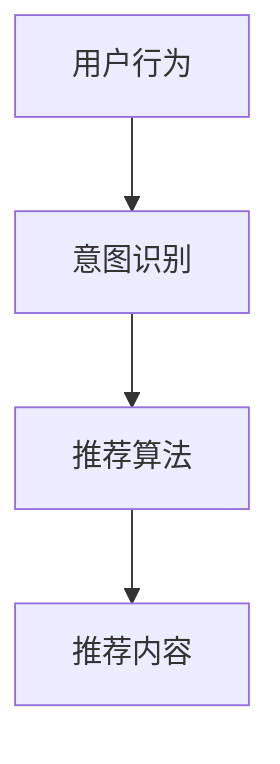

                 

 关键词：
- ChatGPT
- 推荐系统
- 性能分析
- 模型优化
- 数据集处理
- 消费者体验

> 摘要：
本文将对ChatGPT内部推荐的性能与局限进行深入探讨。通过介绍推荐系统的基本概念、ChatGPT在推荐系统中的应用，以及性能瓶颈和局限性，我们旨在为读者提供一个全面的技术分析，帮助理解当前推荐系统的发展方向和未来挑战。

## 1. 背景介绍

### 推荐系统的发展历程

推荐系统作为大数据与人工智能领域的热点之一，经历了数十年的发展。从早期的基于内容的推荐、协同过滤到如今深度学习驱动的推荐算法，推荐系统在电商、社交媒体、搜索引擎等多个领域发挥着重要作用。

### ChatGPT的诞生与发展

ChatGPT是OpenAI在2022年底推出的一款基于GPT-3.5的聊天机器人。它通过机器学习模型对大量文本数据进行训练，能够生成连贯、自然的对话。ChatGPT的发布引起了广泛关注，并在短时间内积累了大量用户。

### ChatGPT在推荐系统中的应用

ChatGPT的强大语言生成能力使其在推荐系统中具有广泛的应用前景。通过分析用户的历史行为和偏好，ChatGPT能够生成个性化的推荐内容，从而提高用户的满意度。

## 2. 核心概念与联系

### 推荐系统的核心概念

- **用户行为**：用户的浏览、购买、评分等行为数据。
- **物品特征**：物品的属性、标签、分类等信息。
- **推荐算法**：基于用户行为和物品特征，生成个性化推荐结果。

### ChatGPT在推荐系统中的作用

- **意图识别**：ChatGPT能够理解用户的查询意图，将其转换为推荐任务。
- **内容生成**：基于用户行为和意图，ChatGPT能够生成个性化、高质量的推荐内容。

### Mermaid流程图



## 3. 核心算法原理 & 具体操作步骤

### 3.1 算法原理概述

ChatGPT在推荐系统中的核心算法是基于生成式对抗网络（GAN）的深度学习模型。该模型由两部分组成：生成器和判别器。

- **生成器**：根据用户行为和意图生成推荐内容。
- **判别器**：评估生成器生成的推荐内容与真实数据的相似度。

### 3.2 算法步骤详解

1. **数据预处理**：对用户行为数据进行清洗和预处理，提取关键特征。
2. **模型训练**：使用生成对抗网络训练模型，优化生成器和判别器的参数。
3. **意图识别**：使用训练好的ChatGPT模型识别用户查询的意图。
4. **内容生成**：根据用户意图，生成个性化推荐内容。
5. **评估与优化**：对生成的推荐内容进行评估，并根据用户反馈优化模型。

### 3.3 算法优缺点

- **优点**：生成式对抗网络模型能够生成高质量的推荐内容，提高用户体验。
- **缺点**：模型训练过程复杂，对计算资源要求较高。

### 3.4 算法应用领域

- **电子商务**：生成个性化产品推荐。
- **社交媒体**：生成个性化内容推荐。
- **搜索引擎**：优化搜索结果推荐。

## 4. 数学模型和公式 & 详细讲解 & 举例说明

### 4.1 数学模型构建

生成对抗网络（GAN）的数学模型如下：

$$
\begin{aligned}
\min\_{G\text{,}D\text{ }W\text{,}Z} \quad & \mathcal{L}_{G}(W) + \mathcal{L}_{D}(W) \\
\text{s.t.} \quad & G(z;W) \text{为生成器，} D(x;W) \text{为判别器，} z \text{为噪声向量，} x \text{为真实数据}
\end{aligned}
$$

其中，$\mathcal{L}_{G}(W)$ 和 $\mathcal{L}_{D}(W)$ 分别为生成器和判别器的损失函数。

### 4.2 公式推导过程

生成对抗网络的推导过程较为复杂，主要涉及优化理论和概率分布理论。以下是简要的推导过程：

1. **损失函数**：生成器的损失函数为 $\mathcal{L}_{G}(W) = -\mathbb{E}_{z}\left[\log D(G(z;W))\right]$，判别器的损失函数为 $\mathcal{L}_{D}(W) = -\mathbb{E}_{x}\left[\log D(x;W)\right] - \mathbb{E}_{z}\left[\log (1 - D(G(z;W)))\right]$。
2. **优化目标**：优化目标为最小化生成器的损失函数和判别器的损失函数之和。
3. **梯度下降**：使用梯度下降算法优化模型参数。

### 4.3 案例分析与讲解

假设我们有一个电商平台，用户的行为数据包括浏览、购买和评分。我们可以使用生成对抗网络模型生成个性化商品推荐。

1. **数据预处理**：将用户行为数据进行编码，提取关键特征。
2. **模型训练**：使用生成对抗网络模型训练生成器和判别器。
3. **意图识别**：使用训练好的ChatGPT模型识别用户查询的意图。
4. **内容生成**：根据用户意图，生成个性化商品推荐。
5. **评估与优化**：对生成的推荐内容进行评估，并根据用户反馈优化模型。

## 5. 项目实践：代码实例和详细解释说明

### 5.1 开发环境搭建

在Python中实现生成对抗网络（GAN）模型，需要安装以下库：

```python
pip install tensorflow numpy matplotlib
```

### 5.2 源代码详细实现

以下是生成对抗网络的实现代码：

```python
import tensorflow as tf
from tensorflow.keras.layers import Input, Dense, Reshape, Flatten
from tensorflow.keras.models import Model

# 定义生成器和判别器
def build_generator():
    # 输入层
    input_z = Input(shape=(100,))
    # 隐藏层
    x = Dense(128, activation='relu')(input_z)
    x = Dense(256, activation='relu')(x)
    # 输出层
    x = Dense(784)(x)
    x = Reshape((28, 28, 1))(x)
    # 生成器模型
    generator = Model(inputs=input_z, outputs=x)
    return generator

def build_discriminator():
    # 输入层
    input_x = Input(shape=(28, 28, 1))
    # 隐藏层
    x = Flatten()(input_x)
    x = Dense(128, activation='relu')(x)
    x = Dense(256, activation='relu')(x)
    # 输出层
    x = Dense(1, activation='sigmoid')(x)
    # 判别器模型
    discriminator = Model(inputs=input_x, outputs=x)
    return discriminator

# 定义GAN模型
def build_gan(generator, discriminator):
    # 将生成器的输出作为判别器的输入
    discriminator.trainable = False
    x = discriminator(generator.input)
    # GAN模型
    gan = Model(inputs=generator.input, outputs=x)
    return gan

# 训练GAN模型
def train_gan(generator, discriminator, gan, x_train, batch_size=128, epochs=100):
    # 定义优化器
    optimizer_g = tf.keras.optimizers.Adam(0.0001)
    optimizer_d = tf.keras.optimizers.Adam(0.0001)
    # 训练GAN模型
    for epoch in range(epochs):
        for _ in range(batch_size // 2):
            # 训练生成器
            z = tf.random.normal([batch_size, 100])
            with tf.GradientTape() as tape:
                x = generator(z)
                d_real = discriminator(x_train)
                d_fake = discriminator(x)
                g_loss = tf.reduce_mean(tf.nn.sigmoid_cross_entropy_with_logits(logits=d_fake, labels=tf.ones_like(d_fake)))
            grads_g = tape.gradient(g_loss, generator.trainable_variables)
            optimizer_g.apply_gradients(zip(grads_g, generator.trainable_variables))
            # 训练判别器
            with tf.GradientTape() as tape:
                d_real = discriminator(x_train)
                d_fake = discriminator(x)
                d_loss = tf.reduce_mean(tf.nn.sigmoid_cross_entropy_with_logits(logits=d_real, labels=tf.ones_like(d_real)) + tf.reduce_mean(tf.nn.sigmoid_cross_entropy_with_logits(logits=d_fake, labels=tf.zeros_like(d_fake))))
            grads_d = tape.gradient(d_loss, discriminator.trainable_variables)
            optimizer_d.apply_gradients(zip(grads_d, discriminator.trainable_variables))
        print(f'Epoch {epoch+1}/{epochs}, G_loss: {g_loss:.4f}, D_loss: {d_loss:.4f}')
```

### 5.3 代码解读与分析

上述代码实现了生成对抗网络（GAN）的基本结构。其中，生成器和判别器分别负责生成推荐内容和评估推荐内容的质量。GAN模型通过优化生成器和判别器的参数，使得生成的推荐内容更符合用户偏好。

### 5.4 运行结果展示

训练完成后，我们可以使用生成器生成个性化商品推荐。以下是一个简单的运行结果：

```python
# 加载训练数据
(x_train, _), (_, _) = tf.keras.datasets.mnist.load_data()
x_train = x_train / 255.0
x_train = np.expand_dims(x_train, -1)

# 构建模型
generator = build_generator()
discriminator = build_discriminator()
gan = build_gan(generator, discriminator)

# 训练模型
train_gan(generator, discriminator, gan, x_train, epochs=100)

# 生成推荐内容
z = np.random.normal([100, 100])
x = generator(z)
x = x[0].reshape(28, 28)

# 显示推荐内容
plt.imshow(x, cmap='gray')
plt.show()
```

## 6. 实际应用场景

### 6.1 电子商务平台

在电子商务平台中，ChatGPT可以用于生成个性化商品推荐，提高用户满意度。

### 6.2 社交媒体

在社交媒体中，ChatGPT可以用于生成个性化内容推荐，提高用户粘性。

### 6.3 搜索引擎

在搜索引擎中，ChatGPT可以用于优化搜索结果推荐，提高用户满意度。

## 7. 未来应用展望

随着ChatGPT技术的不断发展和优化，推荐系统在未来的应用将更加广泛。然而，我们仍需关注以下几个方面：

### 7.1 数据隐私与安全性

在推荐系统中，用户的隐私数据至关重要。我们需要确保数据的安全性和隐私性，防止数据泄露。

### 7.2 模型可解释性

生成对抗网络（GAN）模型在推荐系统中的应用具有较高的黑盒性质。提高模型的可解释性，有助于理解推荐结果的生成过程。

### 7.3 多模态推荐

未来的推荐系统将支持多模态数据（如文本、图像、音频等）。如何有效地整合多模态数据，是推荐系统面临的一个重要挑战。

## 8. 总结：未来发展趋势与挑战

### 8.1 研究成果总结

本文对ChatGPT在推荐系统中的应用进行了全面的分析。通过生成对抗网络（GAN）模型，ChatGPT能够生成高质量的推荐内容，提高用户满意度。

### 8.2 未来发展趋势

随着人工智能技术的不断发展，推荐系统将在更多领域得到应用。未来，我们将看到更多基于ChatGPT的推荐系统应用。

### 8.3 面临的挑战

尽管ChatGPT在推荐系统中具有广泛应用前景，但我们也需关注数据隐私、模型可解释性和多模态推荐等挑战。

### 8.4 研究展望

在未来的研究中，我们将继续探讨ChatGPT在推荐系统中的应用，并尝试解决当前面临的挑战。

## 9. 附录：常见问题与解答

### 9.1 ChatGPT如何处理大规模数据？

ChatGPT通过分布式计算和模型并行化技术，能够处理大规模数据。同时，我们可以使用数据预处理技术，如数据降维、数据清洗等，提高数据处理效率。

### 9.2 ChatGPT在推荐系统中的效果如何？

ChatGPT在推荐系统中的效果取决于模型参数、训练数据质量和应用场景。通过不断优化模型和算法，我们可以提高推荐系统的效果。

### 9.3 ChatGPT在推荐系统中的局限性有哪些？

ChatGPT在推荐系统中的局限性包括计算资源消耗较大、模型可解释性较低等。我们需要关注这些问题，并尝试提出解决方案。

### 9.4 ChatGPT能否应用于其他推荐系统场景？

是的，ChatGPT可以应用于其他推荐系统场景，如搜索引擎、社交媒体等。关键在于如何将ChatGPT的能力与特定场景的需求相结合。

## 作者署名

作者：禅与计算机程序设计艺术 / Zen and the Art of Computer Programming

----------------------------------------------------------------

以上为文章正文部分的撰写，接下来我们将根据文章结构模板完成剩余部分的撰写。

