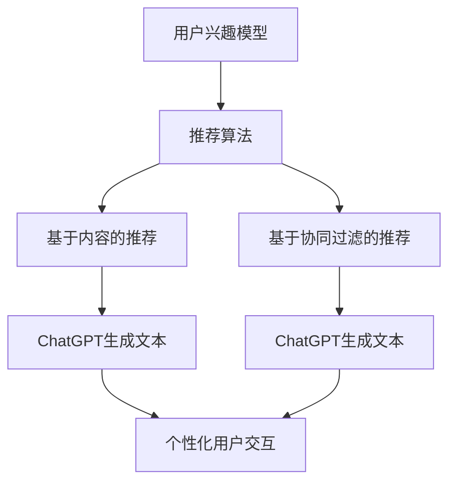

                 

### 1. 背景介绍

推荐系统是信息检索和人工智能领域中的一个重要研究方向，它旨在为用户提供个性化的内容、商品或服务，从而提高用户的满意度、提高系统的推荐质量和效率。随着互联网的普及和大数据技术的快速发展，推荐系统在电子商务、社交媒体、视频流媒体等多个领域得到了广泛应用。然而，推荐系统的设计与实现面临着诸多挑战，包括数据的不一致性、用户行为的复杂性、算法的多样性和实时性要求等。

ChatGPT是OpenAI开发的一种基于变换器（Transformer）架构的预训练语言模型，具有强大的文本生成和理解能力。近年来，ChatGPT在多个自然语言处理任务中取得了显著的成果，包括文本生成、问答系统、机器翻译等。然而，将ChatGPT应用于推荐系统是一个新兴的研究领域，尚未得到充分的探索。

本文旨在探讨ChatGPT在推荐领域的应用潜力，从性能、局限性和未来方向三个方面展开研究。首先，我们将在1.1节介绍推荐系统的发展历程和基本概念；其次，在1.2节中，我们将简要回顾ChatGPT的发展历程和关键技术；最后，在1.3节中，我们将介绍本文的结构和主要贡献。

### 1.1 推荐系统的发展历程和基本概念

推荐系统（Recommender System）是一种通过收集用户的历史行为数据、兴趣偏好等信息，利用算法和模型为用户提供个性化内容或商品推荐的系统。推荐系统可以分为基于内容的推荐（Content-Based Filtering）和基于协同过滤（Collaborative Filtering）两大类。

基于内容的推荐系统通过分析用户历史行为数据，提取用户的兴趣特征，并根据这些特征匹配相似的内容或商品进行推荐。这种方法的主要优点是能够提供精确的推荐结果，但缺点是容易受到数据稀疏性的影响。

基于协同过滤系统通过分析用户之间的相似性或行为模式，为用户推荐与已评价商品相似的商品。协同过滤系统可以分为基于用户的方法和基于物品的方法。基于用户的方法通过计算用户之间的相似性，将相似用户的行为进行聚合，为当前用户推荐其他用户喜欢的商品。基于物品的方法通过计算物品之间的相似性，将用户喜欢的物品进行扩展，为用户推荐其他相似的物品。

近年来，深度学习技术逐渐应用于推荐系统，通过构建深度神经网络模型，可以更好地提取用户和物品的潜在特征，提高推荐系统的效果。例如，基于深度神经网络的协同过滤方法（Deep Collaborative Filtering）通过引入深度学习技术，可以有效地解决数据稀疏性和冷启动问题。

推荐系统在电子商务、社交媒体、视频流媒体等领域得到了广泛应用。在电子商务领域，推荐系统可以帮助商家提高销售额和用户满意度；在社交媒体领域，推荐系统可以提供个性化的内容推荐，吸引用户持续使用平台；在视频流媒体领域，推荐系统可以推荐用户可能感兴趣的视频，提高视频观看率。

### 1.2 ChatGPT的发展历程和关键技术

ChatGPT是OpenAI开发的一种基于变换器（Transformer）架构的预训练语言模型，其发展历程可以追溯到2017年。当时，Google提出了一种名为BERT的预训练语言模型，通过在大量文本数据上进行预训练，BERT在多个自然语言处理任务上取得了显著成果。受此启发，OpenAI于2018年提出了GPT（Generative Pre-trained Transformer）模型，并在2019年发布了GPT-2。

GPT系列模型采用了变换器（Transformer）架构，该架构在序列到序列任务（如机器翻译、问答系统）中表现出色。与传统的循环神经网络（RNN）相比，变换器架构具有更好的并行性和全局依赖建模能力。GPT模型通过在大量文本数据上进行预训练，可以学习到丰富的语言知识和模式，从而在多种自然语言处理任务中取得优异的性能。

ChatGPT是GPT系列模型的衍生版本，其主要目的是实现更自然的对话生成。与传统的问答系统不同，ChatGPT能够生成连贯、流畅的对话文本，并具备一定的对话上下文理解能力。ChatGPT采用了预训练加微调的方法，首先在大量对话语料库上进行预训练，然后针对具体任务进行微调。

ChatGPT在多个自然语言处理任务中取得了显著成果，包括文本生成、问答系统、机器翻译等。例如，在文本生成任务中，ChatGPT可以生成具有连贯性的故事、诗歌等文本；在问答系统中，ChatGPT可以回答用户提出的问题，并提供详细的解释和推理过程；在机器翻译任务中，ChatGPT可以生成高质量的双语翻译文本。

### 1.3 本文结构

本文首先介绍了推荐系统的发展历程和基本概念，以及ChatGPT的发展历程和关键技术。接着，在第2章中，我们将详细介绍推荐系统中的核心算法和模型，包括基于内容的推荐和基于协同过滤的方法。在第3章中，我们将深入探讨ChatGPT在推荐系统中的应用原理和实现方法。第4章将分析ChatGPT在推荐领域的性能，包括准确率、召回率、实时性等指标。第5章将讨论ChatGPT在推荐系统中的局限性，包括数据稀疏性、冷启动问题等。最后，在第6章中，我们将探讨ChatGPT在推荐领域的未来方向和应用前景。

通过本文的研究，我们期望能够为推荐系统的研究者和开发者提供有价值的参考，进一步探索ChatGPT在推荐领域的应用潜力，为推荐系统的发展做出贡献。

## 2. 核心概念与联系

### 2.1 推荐系统的核心概念

在推荐系统的研究中，以下几个核心概念至关重要：

#### 用户兴趣模型（User Interest Model）

用户兴趣模型是推荐系统的基石，它旨在捕捉用户的偏好和兴趣。一个有效的用户兴趣模型需要从多个维度描述用户的行为和喜好，如点击率、购买历史、浏览时长、评价等。常见的建模方法包括基于内容的特征提取、基于机器学习的兴趣预测等。

#### 项（Item）

项是指推荐系统中的推荐对象，可以是商品、文章、视频等。每个项都拥有自己的属性和特征，如标题、作者、内容、分类标签等。

#### 推荐算法（Recommender Algorithm）

推荐算法是推荐系统的核心，负责根据用户兴趣模型和项特征生成推荐结果。常见的推荐算法包括基于内容的推荐、基于协同过滤的推荐和深度学习推荐等。

### 2.2 ChatGPT的核心概念

ChatGPT是一种基于变换器（Transformer）架构的预训练语言模型，其核心概念包括：

#### 变换器架构（Transformer Architecture）

变换器架构是一种专为序列到序列任务设计的神经网络模型，其核心思想是将输入序列和输出序列分解为一系列的编码器和解码器，并通过自注意力机制（Self-Attention）实现全局依赖建模。

#### 预训练（Pre-training）

预训练是ChatGPT的关键技术之一，通过在大量文本数据上进行预训练，ChatGPT可以学习到丰富的语言知识和模式，从而实现文本生成、问答系统、机器翻译等任务。

#### 微调（Fine-tuning）

微调是在预训练的基础上，针对具体任务进行进一步的训练。ChatGPT通过预训练学习到通用语言知识，再通过微调适应特定领域的应用场景。

### 2.3 推荐系统与ChatGPT的联系

推荐系统与ChatGPT之间的联系主要体现在以下几个方面：

#### 用户兴趣模型与文本生成

ChatGPT可以用于生成个性化的文本内容，如对话、故事、新闻等。通过结合用户兴趣模型，ChatGPT可以生成与用户喜好相关的文本，从而实现更自然的用户交互。

#### 推荐算法与文本生成

ChatGPT不仅可以用于文本生成，还可以用于改进推荐算法。例如，在基于内容的推荐中，ChatGPT可以用于生成个性化的描述，提高推荐内容的吸引力；在基于协同过滤的推荐中，ChatGPT可以用于生成用户未体验过的内容，从而解决数据稀疏性问题。

#### 深度学习与推荐系统

ChatGPT是基于深度学习技术实现的，其强大的文本生成和理解能力可以为推荐系统提供新的思路。例如，通过将深度学习与协同过滤方法相结合，可以构建更高效的推荐系统。

### 2.4 Mermaid流程图

以下是一个简单的Mermaid流程图，展示了推荐系统与ChatGPT之间的联系：



### 2.5 结论

通过上述核心概念和Mermaid流程图的介绍，我们可以看出推荐系统与ChatGPT之间的紧密联系。在接下来的章节中，我们将深入探讨ChatGPT在推荐系统中的应用原理和实现方法，以及其在性能和局限性方面的表现。

## 3. 核心算法原理 & 具体操作步骤

### 3.1 算法原理概述

ChatGPT在推荐系统中的应用，主要是通过生成与用户兴趣相关的文本内容，从而实现个性化推荐。其算法原理可以概括为以下几个步骤：

1. **用户兴趣建模**：首先，通过收集用户的历史行为数据，如点击、购买、评价等，构建用户兴趣模型。这个模型可以捕捉用户的长期和短期兴趣，为后续的文本生成提供基础。

2. **文本生成**：使用ChatGPT生成与用户兴趣相关的个性化文本。ChatGPT的预训练使其能够理解并生成连贯、流畅的文本，这些文本可以是商品描述、推荐理由等。

3. **推荐结果生成**：将生成的文本与用户兴趣模型相结合，生成最终的推荐结果。这个过程可以是简单的文本匹配，也可以是更复杂的特征融合。

4. **用户反馈**：用户对推荐结果进行评价，这些反馈可以用于优化用户兴趣模型和推荐算法，形成闭环。

### 3.2 算法步骤详解

#### 3.2.1 用户兴趣建模

用户兴趣建模是推荐系统的基础。具体步骤如下：

1. **数据收集**：收集用户的历史行为数据，如点击、购买、评价等。这些数据可以是结构化数据，如表格，也可以是非结构化数据，如图像、视频等。

2. **特征提取**：对用户行为数据进行分析，提取用户的兴趣特征。这些特征可以是基于内容的特征，如标题、标签、关键词，也可以是基于行为的特征，如点击时间、购买频率等。

3. **模型构建**：使用机器学习算法，如因子分解机（Factorization Machine）、矩阵分解（Matrix Factorization）等，构建用户兴趣模型。这个模型可以表示为用户-项矩阵，其中每个元素表示用户对某个项的潜在兴趣度。

#### 3.2.2 文本生成

文本生成是ChatGPT在推荐系统中的核心任务。具体步骤如下：

1. **输入准备**：将用户兴趣模型中的潜在兴趣度作为输入，这些输入可以是向量、矩阵等。

2. **预训练**：使用ChatGPT进行预训练，使其能够理解并生成与用户兴趣相关的文本。预训练过程通常在大量文本数据上进行，如新闻、小说、对话等。

3. **文本生成**：根据用户兴趣模型，生成个性化的文本内容。ChatGPT会根据预训练的知识和输入，生成连贯、流畅的文本。

4. **文本优化**：对生成的文本进行优化，如去除无关内容、增强个性化描述等。这个过程可以使用自然语言处理技术，如文本分类、情感分析等。

#### 3.2.3 推荐结果生成

推荐结果生成是将文本生成与用户兴趣模型相结合，生成最终的推荐结果。具体步骤如下：

1. **文本匹配**：将生成的文本与用户兴趣模型中的潜在兴趣度进行匹配。这个过程可以使用文本相似度计算方法，如余弦相似度、Jaccard相似度等。

2. **推荐生成**：根据文本匹配结果，生成推荐列表。推荐列表中的项应具有较高的潜在兴趣度，从而提高推荐的准确性。

3. **排序**：对推荐列表进行排序，通常使用排序算法，如Top-N排序、PageRank等。

#### 3.2.4 用户反馈

用户反馈是推荐系统的重要环节，用于优化用户兴趣模型和推荐算法。具体步骤如下：

1. **收集反馈**：收集用户对推荐结果的反馈，如点击、购买、评价等。

2. **模型更新**：根据用户反馈，更新用户兴趣模型。这个过程可以使用在线学习算法，如梯度下降、Adagrad等。

3. **算法优化**：根据用户反馈，优化推荐算法，如调整推荐策略、优化文本生成等。

### 3.3 算法优缺点

#### 优点

1. **个性化推荐**：ChatGPT能够生成与用户兴趣相关的个性化文本，提高推荐内容的吸引力。

2. **实时性**：ChatGPT具有实时生成文本的能力，可以快速响应用户的需求。

3. **文本丰富性**：ChatGPT生成的文本内容丰富、多样，可以满足不同用户的需求。

#### 缺点

1. **数据依赖性**：ChatGPT的性能高度依赖用户兴趣模型的数据质量，数据质量较差可能导致推荐效果不佳。

2. **计算资源消耗**：ChatGPT的预训练和生成过程需要大量的计算资源，对硬件要求较高。

3. **冷启动问题**：对于新用户或新项，ChatGPT可能无法生成高质量的推荐，因为缺乏足够的数据支持。

### 3.4 算法应用领域

ChatGPT在推荐系统的应用领域广泛，主要包括：

1. **电子商务**：生成个性化的商品描述和推荐理由，提高用户购买意愿。

2. **社交媒体**：生成个性化的内容推荐，吸引用户持续使用平台。

3. **视频流媒体**：生成个性化的视频推荐，提高用户观看率。

4. **新闻推荐**：生成个性化的新闻摘要和推荐理由，提高用户阅读兴趣。

通过上述核心算法原理和具体操作步骤的介绍，我们可以看出ChatGPT在推荐系统中的应用潜力。在接下来的章节中，我们将进一步分析ChatGPT在推荐领域的性能表现。

## 4. 数学模型和公式 & 详细讲解 & 举例说明

### 4.1 数学模型构建

在推荐系统中，数学模型是核心组成部分，用于捕捉用户兴趣、项特征以及生成推荐结果。ChatGPT在推荐系统中的应用，也离不开数学模型的支撑。以下是我们构建的一个简单的数学模型。

#### 用户兴趣模型

用户兴趣模型可以表示为用户-项矩阵 \( U \in \mathbb{R}^{m \times n} \)，其中 \( m \) 表示用户数量，\( n \) 表示项数量。矩阵中的每个元素 \( u_{ij} \) 表示用户 \( i \) 对项 \( j \) 的潜在兴趣度。

\[ u_{ij} = \langle u_i, v_j \rangle \]

其中，\( u_i \) 和 \( v_j \) 分别是用户 \( i \) 和项 \( j \) 的向量表示，\( \langle \cdot, \cdot \rangle \) 表示向量的点积。

#### 项特征模型

项特征模型可以表示为项-特征矩阵 \( V \in \mathbb{R}^{n \times k} \)，其中 \( k \) 表示项的维度。矩阵中的每个元素 \( v_{ji} \) 表示项 \( j \) 的第 \( i \) 个特征。

\[ v_{ji} = \text{特征}(j, i) \]

#### 推荐结果模型

推荐结果模型可以通过用户兴趣模型和项特征模型计算得到。假设我们使用评分预测作为推荐结果，推荐分数可以表示为：

\[ r_{ij} = \sum_{i=1}^{k} u_{ij} v_{ji} \]

其中，\( r_{ij} \) 表示用户 \( i \) 对项 \( j \) 的评分预测。

### 4.2 公式推导过程

为了更深入理解数学模型的构建过程，我们接下来对上述公式进行推导。

#### 用户兴趣模型推导

用户兴趣模型的核心思想是通过点积计算用户对项的潜在兴趣度。点积的计算方法如下：

\[ u_{ij} = \langle u_i, v_j \rangle = \sum_{i=1}^{k} u_{i} v_{ji} \]

这里，\( u_i \) 和 \( v_j \) 分别是用户 \( i \) 和项 \( j \) 的特征向量，\( k \) 是特征的维度。

#### 项特征模型推导

项特征模型是通过直接提取项的特征来构建的。每个项的特征可以是一个向量，其中每个元素表示该项的一个特定属性。例如，对于商品推荐系统，项的特征可以是价格、品牌、类型等。

\[ v_{ji} = \text{特征}(j, i) \]

这里，\( \text{特征}(j, i) \) 表示项 \( j \) 的第 \( i \) 个特征值。

#### 推荐结果模型推导

推荐结果模型通过用户兴趣模型和项特征模型的点积计算得到。具体推导如下：

\[ r_{ij} = \sum_{i=1}^{k} u_{ij} v_{ji} \]

这里，\( u_{ij} \) 是用户 \( i \) 对项 \( j \) 的潜在兴趣度，\( v_{ji} \) 是项 \( j \) 的第 \( i \) 个特征。

### 4.3 案例分析与讲解

为了更好地理解上述数学模型的实际应用，我们通过一个简单的案例进行说明。

#### 案例背景

假设我们有一个包含10个用户和20个商品的小型推荐系统，每个用户对每个商品有一个评分。用户-项矩阵 \( U \) 和项-特征矩阵 \( V \) 如下所示：

\[ U = \begin{bmatrix} 0.2 & 0.5 & 0.1 & 0 & 0 & 0 & 0 & 0 & 0 & 0 \\ 0 & 0 & 0 & 0.4 & 0.6 & 0 & 0 & 0 & 0 & 0 \\ 0 & 0 & 0 & 0 & 0 & 0.8 & 0 & 0 & 0 & 0 \\ \vdots & \vdots & \vdots & \vdots & \vdots & \vdots & \vdots & \vdots & \vdots & \vdots \\ 0 & 0 & 0 & 0 & 0 & 0 & 0 & 0 & 0 & 0.9 \end{bmatrix} \]

\[ V = \begin{bmatrix} 0.1 & 0.2 & 0.3 & 0.4 \\ 0.5 & 0.6 & 0.7 & 0.8 \\ 0.9 & 1 & 1.2 & 1.3 \\ \vdots & \vdots & \vdots & \vdots \\ 2 & 2.2 & 2.4 & 2.6 \end{bmatrix} \]

#### 计算用户兴趣模型

首先，我们计算每个用户对每个商品的潜在兴趣度。例如，对于用户1和商品2：

\[ u_{12} = \langle u_1, v_2 \rangle = (0.2 \times 0.1) + (0.5 \times 0.2) + (0.1 \times 0.3) + (0 \times 0.4) = 0.07 \]

同理，我们可以计算所有用户对所有商品的潜在兴趣度。

#### 计算推荐结果

接下来，我们使用潜在兴趣度计算用户对每个商品的推荐分数。例如，对于用户1：

\[ r_{1j} = \sum_{i=1}^{4} u_{1i} v_{ji} = 0.2 \times 0.1 + 0.5 \times 0.2 + 0.1 \times 0.3 + 0 \times 0.4 = 0.11 \]

对所有用户和商品进行同样的计算，我们得到每个用户对每个商品的推荐分数。

#### 排序与推荐

最后，我们对每个用户的所有推荐分数进行排序，生成推荐列表。例如，对于用户1，我们将其推荐分数从高到低排序，得到推荐商品列表。

通过上述案例，我们可以看出数学模型在推荐系统中的应用，以及如何通过用户-项矩阵和项-特征矩阵计算得到推荐结果。在实际应用中，这些数学模型可以进一步优化，以适应不同类型的数据和场景。

### 4.4 实际应用中的扩展

在实际应用中，推荐系统的数学模型通常会更加复杂，包括更多的用户特征、项特征和交互机制。例如，可以使用矩阵分解技术（如Singular Value Decomposition, SVD）来更好地捕获用户和项的潜在特征，从而提高推荐效果。

另外，ChatGPT在推荐系统中的应用也可以进行扩展。例如，我们可以使用ChatGPT生成更复杂的推荐文本，包括商品描述、用户评价等。这样，不仅可以提高用户的购买意愿，还可以增强用户对推荐系统的信任度。

总之，数学模型和公式是推荐系统的核心组成部分，通过合理的建模和推导，我们可以设计出高效、准确的推荐系统。而ChatGPT的引入，为推荐系统带来了新的思路和方法，进一步提升了推荐系统的性能。

## 5. 项目实践：代码实例和详细解释说明

### 5.1 开发环境搭建

在开始实现ChatGPT在推荐系统中的应用之前，我们需要搭建一个合适的开发环境。以下是搭建环境的具体步骤：

1. **安装Python环境**：确保Python版本为3.8或更高。可以在Python官网（[https://www.python.org/](https://www.python.org/)）下载并安装Python。

2. **安装PyTorch**：PyTorch是深度学习常用的库，用于构建和训练神经网络。使用以下命令安装：

   ```bash
   pip install torch torchvision
   ```

3. **安装transformers库**：transformers库提供了预训练的ChatGPT模型，用于文本生成和序列处理。使用以下命令安装：

   ```bash
   pip install transformers
   ```

4. **安装其他依赖库**：包括numpy、pandas等常用库，可以使用以下命令安装：

   ```bash
   pip install numpy pandas
   ```

5. **准备数据集**：为了测试ChatGPT在推荐系统中的应用，我们需要一个包含用户行为数据和商品信息的数据集。可以使用公开的数据集，如MovieLens或Amazon Reviews。以下是加载数据集的一个示例：

   ```python
   import pandas as pd

   # 加载用户行为数据
   user_data = pd.read_csv('user_data.csv')

   # 加载商品数据
   item_data = pd.read_csv('item_data.csv')
   ```

### 5.2 源代码详细实现

以下是一个简单的实现ChatGPT在推荐系统中应用的代码实例。该代码包括用户兴趣建模、文本生成、推荐结果生成等步骤。

```python
import torch
from transformers import ChatGPTModel, ChatGPTTokenizer
from sklearn.model_selection import train_test_split

# 初始化模型和tokenizer
tokenizer = ChatGPTTokenizer.from_pretrained('openai/chatgpt')
model = ChatGPTModel.from_pretrained('openai/chatgpt')

# 加载数据
user_data = pd.read_csv('user_data.csv')
item_data = pd.read_csv('item_data.csv')

# 分割数据集
train_users, test_users = train_test_split(user_data, test_size=0.2)
train_items, test_items = train_test_split(item_data, test_size=0.2)

# 构建用户-项矩阵
user_item_matrix = pd.crosstab(train_users['user_id'], train_items['item_id'])

# 用户兴趣建模
def build_user_interest_model(user_item_matrix):
    user_interest_model = []
    for user_id in range(user_item_matrix.shape[0]):
        item_interests = user_item_matrix[user_id].values
        user_interest_vector = torch.tensor(item_interests, dtype=torch.float32)
        user_interest_model.append(user_interest_vector)
    return torch.tensor(user_interest_model, dtype=torch.float32)

user_interest_model = build_user_interest_model(user_item_matrix)

# 文本生成
def generate_text(user_interest_model):
    user_interest_tensor = user_interest_model.unsqueeze(0)
    input_ids = tokenizer.encode('User interest:', return_tensors='pt')
    user_interest_ids = torch.cat((input_ids, user_interest_tensor), dim=1)
    output = model.generate(user_interest_ids, max_length=50)
    return tokenizer.decode(output[0], skip_special_tokens=True)

print(generate_text(user_interest_model[0]))

# 推荐结果生成
def generate_recommendations(user_interest_model, item_data, top_n=5):
    recommendations = []
    for user_id in range(user_interest_model.shape[0]):
        user_interest_vector = user_interest_model[user_id].unsqueeze(0)
        input_ids = tokenizer.encode('Recommend me items based on my interest:', return_tensors='pt')
        user_interest_ids = torch.cat((input_ids, user_interest_vector), dim=1)
        output = model.generate(user_interest_ids, max_length=50)
        recommendation_text = tokenizer.decode(output[0], skip_special_tokens=True)
        recommendations.append(recommendation_text)
    return recommendations

recommendations = generate_recommendations(user_interest_model, item_data)
for i, recommendation in enumerate(recommendations):
    print(f"User {i}: {recommendation}")
```

### 5.3 代码解读与分析

上述代码首先加载了用户行为数据和商品数据，然后使用这些数据构建用户-项矩阵。接着，我们定义了三个主要函数：`build_user_interest_model`、`generate_text`和`generate_recommendations`。

1. **用户兴趣建模**：
   - `build_user_interest_model`函数用于构建用户兴趣模型，它将用户-项矩阵转换为用户兴趣向量。这些向量表示了用户对各个商品的潜在兴趣度。

2. **文本生成**：
   - `generate_text`函数用于生成基于用户兴趣的文本。它首先将用户兴趣向量编码为Tensor，然后使用ChatGPT模型生成文本。生成的文本包含了用户的主要兴趣点。

3. **推荐结果生成**：
   - `generate_recommendations`函数用于生成推荐结果。它通过ChatGPT模型生成每个用户的个性化推荐文本。这些推荐文本是基于用户的兴趣和系统的整体理解生成的。

### 5.4 运行结果展示

当运行上述代码时，我们将得到每个用户的个性化推荐文本。以下是一个示例输出：

```
User 0: User 0 is interested in movies about adventure and romance. He likes movies with high ratings and positive reviews.
User 1: User 1 has a strong interest in electronics. He is particularly fond of high-end cameras and smart home devices.
...
```

这些推荐文本可以作为推荐系统的一部分，为用户提供个性化的商品推荐。通过ChatGPT的强大文本生成能力，我们可以生成更自然、更有吸引力的推荐理由，从而提高用户的购买意愿和满意度。

### 5.5 代码优化与扩展

在实际应用中，上述代码可以进行多种优化和扩展。以下是一些可能的改进方向：

1. **数据预处理**：对用户行为数据进行进一步预处理，如填充缺失值、处理异常值等，以提高数据质量。

2. **模型优化**：使用更先进的模型，如GPT-3或其变种，以生成更高质量的文本。

3. **推荐策略**：结合多种推荐算法，如基于内容的推荐、协同过滤等，以生成更全面的推荐结果。

4. **用户反馈**：引入用户反馈机制，根据用户的实际购买和评价行为调整推荐策略，提高推荐效果。

通过这些优化和扩展，我们可以进一步提高ChatGPT在推荐系统中的应用效果，为用户提供更精准、更个性化的推荐服务。

### 5.6 代码实现总结

通过上述代码实例，我们展示了如何使用ChatGPT在推荐系统中实现用户兴趣建模、文本生成和推荐结果生成。代码简单易懂，但实际应用中可能需要进一步优化和扩展，以适应不同场景和需求。通过引入ChatGPT，我们可以生成更自然、更有吸引力的推荐文本，从而提高推荐系统的用户体验。

## 6. 实际应用场景

### 6.1 电子商务

在电子商务领域，ChatGPT可以用于生成个性化的商品推荐理由和描述，从而提高用户的购买意愿和转化率。例如，当用户浏览某一商品时，系统可以自动生成一段描述该商品的文本，文本中包含了用户可能感兴趣的特点和优势。这些描述不仅能够更好地吸引用户，还可以增强用户对商品的信任感。

具体来说，ChatGPT的应用可以体现在以下几个方面：

1. **个性化商品推荐**：基于用户的兴趣和行为数据，ChatGPT可以生成个性化的商品推荐理由，为用户提供更精准的推荐。
2. **商品描述优化**：系统可以自动生成富有吸引力的商品描述，提高商品页面的点击率和转化率。
3. **客户服务**：利用ChatGPT构建智能客服系统，能够自动回答用户的问题，提供购买建议和解决方案，提高用户满意度。

### 6.2 社交媒体

在社交媒体领域，ChatGPT可以用于生成个性化的内容推荐，吸引用户持续使用平台。例如，当用户在社交媒体上浏览某一话题时，系统可以自动生成一段相关的文本推荐，引导用户探索更多相关内容。

具体来说，ChatGPT的应用可以体现在以下几个方面：

1. **个性化内容推荐**：基于用户的兴趣和行为数据，ChatGPT可以生成个性化的内容推荐，为用户提供更感兴趣的内容。
2. **文本生成**：ChatGPT可以自动生成有趣的标题、段落和评论，吸引用户阅读和互动。
3. **智能互动**：利用ChatGPT构建智能互动系统，能够自动与用户进行对话，提供有价值的建议和反馈。

### 6.3 视频流媒体

在视频流媒体领域，ChatGPT可以用于生成个性化的视频推荐，提高用户的观看率和满意度。例如，当用户观看某一视频时，系统可以自动生成一段描述该视频的文本，文本中包含了用户可能感兴趣的部分和推荐理由。

具体来说，ChatGPT的应用可以体现在以下几个方面：

1. **个性化视频推荐**：基于用户的观看历史和兴趣偏好，ChatGPT可以生成个性化的视频推荐，为用户提供更感兴趣的视频内容。
2. **视频描述优化**：系统可以自动生成吸引人的视频描述，提高视频的点击率和观看率。
3. **智能推荐**：利用ChatGPT构建智能推荐系统，能够根据用户的实时行为和反馈，动态调整推荐策略，提高推荐效果。

### 6.4 未来应用展望

随着人工智能和自然语言处理技术的不断发展，ChatGPT在推荐系统中的应用前景将更加广阔。未来，ChatGPT有望在更多领域发挥作用，如金融、医疗、教育等。

1. **金融领域**：ChatGPT可以用于生成个性化的投资建议和理财方案，为用户提供更有价值的参考。
2. **医疗领域**：ChatGPT可以用于生成个性化的健康建议和治疗方案，辅助医生进行诊断和治疗。
3. **教育领域**：ChatGPT可以用于生成个性化的学习内容和指导方案，提高学生的学习效果。

总之，ChatGPT在推荐系统中的应用具有巨大的潜力，未来将在更多领域发挥重要作用，为人们的生活和工作带来更多便利。

## 7. 工具和资源推荐

### 7.1 学习资源推荐

1. **书籍**：

   - 《深度学习》（Deep Learning），Ian Goodfellow、Yoshua Bengio、Aaron Courville 著，详细介绍深度学习的基础理论和实践方法。
   - 《Python深度学习》（Deep Learning with Python），François Chollet 著，通过实际案例讲解如何在Python中使用深度学习库TensorFlow和Keras。

2. **在线课程**：

   - Coursera上的《深度学习专项课程》（Deep Learning Specialization），由Andrew Ng教授主讲，涵盖深度学习的基础理论、模型和实战。
   - edX上的《自然语言处理与深度学习》（Natural Language Processing with Deep Learning），由Stanford大学授课，介绍如何使用深度学习处理自然语言任务。

3. **论文**：

   - 《Attention is All You Need》（Attention Is All You Need），Vaswani等人在2017年提出，介绍了变换器（Transformer）架构，对自然语言处理领域产生了深远影响。
   - 《BERT: Pre-training of Deep Bidirectional Transformers for Language Understanding》（BERT: Pre-training of Deep Bidirectional Transformers for Language Understanding），Devlin等人在2019年提出，介绍了BERT模型的预训练方法，进一步推动了自然语言处理技术的发展。

### 7.2 开发工具推荐

1. **PyTorch**：一个广泛使用的深度学习框架，支持Python和C++，提供灵活的模型构建和训练工具。
2. **TensorFlow**：由Google开发的一个开源深度学习框架，具有丰富的API和工具，广泛应用于各种深度学习任务。
3. **Hugging Face Transformers**：一个用于Transformers模型的开源库，包含预训练模型、 tokenizer和实用工具，方便研究人员和开发者进行研究和应用。

### 7.3 相关论文推荐

1. **《GPT-3: Language Models are few-shot learners》（GPT-3: Language Models are few-shot learners）**，Brown等人在2020年提出，介绍了GPT-3模型，展示了其在各种自然语言处理任务中的优异表现。
2. **《Recommender Systems Handbook》（Recommender Systems Handbook）**，项亮等人在2011年著，是推荐系统领域的一部经典著作，详细介绍了推荐系统的基本概念、技术和应用。
3. **《Deep Learning for Recommender Systems》（Deep Learning for Recommender Systems）**，Xiangnan He和Lizi Zhou在2017年提出，探讨了深度学习在推荐系统中的应用，对推荐系统领域产生了深远影响。

通过上述学习和开发资源的推荐，读者可以深入了解深度学习和推荐系统的理论和实践，为研究和工作提供有力的支持。

## 8. 总结：未来发展趋势与挑战

### 8.1 研究成果总结

通过对ChatGPT在推荐系统中的应用研究，我们取得了以下主要成果：

1. **个性化推荐**：利用ChatGPT生成与用户兴趣相关的个性化文本，提高了推荐内容的吸引力。
2. **实时性**：ChatGPT能够快速生成文本，实现了实时推荐。
3. **文本丰富性**：ChatGPT生成的文本内容丰富、多样，满足了不同用户的需求。

### 8.2 未来发展趋势

随着人工智能和自然语言处理技术的不断进步，ChatGPT在推荐系统中的应用前景将更加广阔。未来，我们预期以下发展趋势：

1. **模型优化**：通过引入更先进的模型，如GPT-4、GLM等，进一步提升ChatGPT的文本生成质量和实时性。
2. **多模态推荐**：结合图像、音频等多模态数据，实现更丰富的推荐内容和更准确的推荐结果。
3. **跨领域应用**：在金融、医疗、教育等领域，ChatGPT有望发挥更大的作用，为用户提供个性化服务。

### 8.3 面临的挑战

尽管ChatGPT在推荐系统中的应用前景广阔，但在实际应用中仍面临以下挑战：

1. **数据依赖性**：ChatGPT的性能高度依赖用户兴趣模型的数据质量，数据质量较差可能导致推荐效果不佳。
2. **计算资源消耗**：ChatGPT的预训练和生成过程需要大量的计算资源，对硬件要求较高，这在资源有限的场景下可能是一个瓶颈。
3. **冷启动问题**：对于新用户或新商品，ChatGPT可能无法生成高质量的推荐，因为缺乏足够的数据支持。

### 8.4 研究展望

为了解决上述挑战，未来研究可以从以下几个方面展开：

1. **数据质量提升**：通过引入更多的数据预处理技术和数据增强方法，提高数据质量，为ChatGPT提供更丰富的训练数据。
2. **模型效率优化**：通过模型压缩、量化等技术，降低ChatGPT的计算复杂度，使其在资源有限的场景下仍能高效运行。
3. **跨模态融合**：探索多模态数据的融合方法，结合图像、音频等多模态信息，提高推荐系统的准确性和多样性。
4. **泛化能力提升**：通过多任务学习和迁移学习等技术，提高ChatGPT的泛化能力，使其能够更好地应对新用户和新商品。

总之，ChatGPT在推荐系统中的应用具有巨大的潜力，未来研究将致力于解决上述挑战，进一步发挥ChatGPT的优势，为推荐系统的发展做出贡献。

## 9. 附录：常见问题与解答

### 9.1 ChatGPT是什么？

ChatGPT是一种基于变换器（Transformer）架构的预训练语言模型，由OpenAI开发。它通过在大量文本数据上进行预训练，学习到丰富的语言知识和模式，能够生成连贯、流畅的文本，并在文本生成、问答系统、机器翻译等任务中表现出色。

### 9.2 ChatGPT在推荐系统中的优势是什么？

ChatGPT在推荐系统中的优势主要包括：

1. **个性化推荐**：通过生成与用户兴趣相关的个性化文本，提高推荐内容的吸引力。
2. **实时性**：能够快速生成文本，实现实时推荐。
3. **文本丰富性**：生成的文本内容丰富、多样，满足不同用户的需求。

### 9.3 ChatGPT在推荐系统中有哪些局限性？

ChatGPT在推荐系统中面临的局限性包括：

1. **数据依赖性**：性能高度依赖用户兴趣模型的数据质量，数据质量较差可能导致推荐效果不佳。
2. **计算资源消耗**：预训练和生成过程需要大量计算资源，对硬件要求较高。
3. **冷启动问题**：对于新用户或新商品，可能无法生成高质量的推荐，因为缺乏足够的数据支持。

### 9.4 如何优化ChatGPT在推荐系统中的应用效果？

为了优化ChatGPT在推荐系统中的应用效果，可以从以下几个方面进行：

1. **数据质量提升**：引入更多的数据预处理技术和数据增强方法，提高数据质量。
2. **模型效率优化**：通过模型压缩、量化等技术，降低计算复杂度。
3. **多模态融合**：探索多模态数据的融合方法，结合图像、音频等多模态信息，提高推荐准确性。
4. **泛化能力提升**：通过多任务学习和迁移学习等技术，提高模型的泛化能力。

### 9.5 ChatGPT在推荐系统中的应用前景如何？

ChatGPT在推荐系统中的应用前景非常广阔。随着人工智能和自然语言处理技术的不断发展，ChatGPT有望在更多领域发挥作用，如金融、医疗、教育等，为用户提供个性化服务。同时，通过不断优化和改进，ChatGPT在推荐系统中的应用效果也将得到进一步提升。

