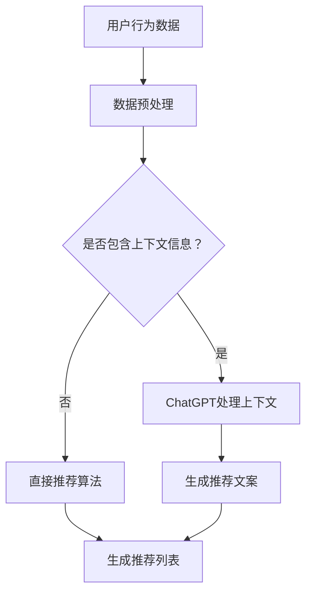

                 

关键词：ChatGPT，推荐系统，自然语言处理，机器学习，人工智能，深度学习，数据挖掘，算法优化，用户行为分析，用户满意度，个性化推荐

> 摘要：本文将探讨ChatGPT在推荐系统中的应用及其能力评估。通过介绍推荐系统的基本概念和架构，我们将深入分析ChatGPT如何对推荐系统产生影响，并探讨其在提高推荐准确性、用户满意度以及算法优化方面的具体作用。同时，本文还将结合实际案例，对ChatGPT在推荐系统中的实践应用进行详细解析。

## 1. 背景介绍

### 1.1 推荐系统的发展历程

推荐系统（Recommender System）是一种通过分析和预测用户的行为和偏好，向用户推荐其可能感兴趣的内容或产品的技术。推荐系统的发展大致可以分为三个阶段：

#### 1.1.1 第一代：基于内容的推荐系统（Content-Based Filtering）

基于内容的推荐系统（Content-Based Filtering，简称CBF）通过分析项目的内容特征，将用户对项目的评价与项目的特征进行匹配，推荐与用户偏好相似的项目。该类系统的主要优点是实现简单、可解释性好，但存在以下缺点：

- **缺点1：冷启动问题（Cold Start Problem）**：新用户或新项目无法根据历史数据进行推荐。
- **缺点2：同质化推荐（Homogeneity of Recommendations）**：难以应对用户的多样化需求。

#### 1.1.2 第二代：协同过滤推荐系统（Collaborative Filtering）

协同过滤推荐系统（Collaborative Filtering，简称CF）通过分析用户之间的行为相似性，发现相似用户并推荐其喜欢的内容。协同过滤分为基于用户的协同过滤（User-Based Collaborative Filtering，简称UBCF）和基于模型的协同过滤（Model-Based Collaborative Filtering，简称MBCF）。

- **基于用户的协同过滤（User-Based Collaborative Filtering）**：通过计算用户之间的相似度，找到相似用户并推荐他们喜欢的内容。
- **基于模型的协同过滤（Model-Based Collaborative Filtering）**：使用机器学习算法（如矩阵分解、潜在因子模型等）建立用户和项目之间的关系模型，预测用户对未知项目的评分。

#### 1.1.3 第三代：混合推荐系统（Hybrid Recommender Systems）

混合推荐系统（Hybrid Recommender Systems）结合了基于内容推荐和协同过滤的优点，通过加权或组合多种推荐方法，提高推荐效果。此外，第三代推荐系统还引入了上下文信息、社会化信息等，进一步优化推荐效果。

### 1.2 ChatGPT的介绍

ChatGPT是由OpenAI开发的一款基于GPT-3.5模型的自然语言处理（Natural Language Processing，简称NLP）工具。ChatGPT具有以下特点：

- **强大的语言生成能力**：ChatGPT可以生成高质量的自然语言文本，包括文章、对话、摘要等。
- **广泛的场景适用性**：ChatGPT可以在多种场景下应用，如问答系统、对话机器人、内容生成等。
- **可定制性**：用户可以根据特定需求对ChatGPT进行训练和优化，提高其在特定领域的表现。

## 2. 核心概念与联系

### 2.1 推荐系统基本概念

- **用户（User）**：推荐系统的目标受众，具有特定的偏好和兴趣。
- **项目（Item）**：推荐系统中的推荐对象，可以是商品、文章、音乐等。
- **评分（Rating）**：用户对项目的评价，可以是数字评分、喜欢/不喜欢等。
- **推荐列表（Recommendation List）**：推荐系统为用户生成的一系列项目列表。

### 2.2 ChatGPT在推荐系统中的作用

ChatGPT在推荐系统中的应用主要包括以下几个方面：

- **生成推荐文案**：ChatGPT可以根据用户兴趣和项目特征，生成高质量的推荐文案，提高用户对推荐内容的兴趣和满意度。
- **个性化推荐**：ChatGPT可以通过分析用户的历史行为和偏好，生成个性化的推荐列表，满足用户的多样化需求。
- **上下文信息处理**：ChatGPT可以处理用户输入的上下文信息，如搜索关键词、对话历史等，提高推荐的相关性和准确性。

### 2.3 Mermaid流程图

下面是推荐系统结合ChatGPT的架构图，使用Mermaid语言描述：



## 3. 核心算法原理 & 具体操作步骤

### 3.1 算法原理概述

结合ChatGPT的推荐系统主要分为以下几个步骤：

1. **数据收集与预处理**：收集用户行为数据，包括浏览记录、购买记录、搜索关键词等。对数据进行清洗、去重和格式转换等预处理操作。
2. **上下文信息处理**：使用ChatGPT对用户输入的上下文信息进行处理，如关键词提取、文本摘要等。
3. **推荐算法**：基于预处理后的用户行为数据和上下文信息，使用协同过滤、基于内容推荐或其他混合推荐算法生成推荐列表。
4. **推荐文案生成**：使用ChatGPT根据推荐列表中的项目特征和用户偏好生成个性化的推荐文案。
5. **推荐结果展示**：将推荐列表和推荐文案展示给用户，供用户选择和评价。

### 3.2 算法步骤详解

#### 3.2.1 数据收集与预处理

1. **收集用户行为数据**：包括用户浏览、购买、搜索等行为数据。
2. **数据清洗**：去除重复、异常和缺失的数据。
3. **格式转换**：将不同类型的数据转换为统一的格式，如将文本数据转换为向量表示。
4. **特征提取**：从用户行为数据中提取特征，如用户ID、项目ID、时间戳等。

#### 3.2.2 上下文信息处理

1. **关键词提取**：使用自然语言处理技术提取用户输入的关键词。
2. **文本摘要**：使用ChatGPT对输入的文本进行摘要，提取关键信息。
3. **上下文向量表示**：将提取的关键词和文本摘要转换为向量表示，用于后续推荐算法。

#### 3.2.3 推荐算法

1. **协同过滤**：基于用户行为数据，计算用户之间的相似度，找到相似用户并推荐他们喜欢的项目。
2. **基于内容推荐**：根据项目的内容特征，将用户对项目的评价与项目的特征进行匹配，推荐与用户偏好相似的项目。
3. **混合推荐**：结合协同过滤和基于内容推荐，生成综合性的推荐列表。

#### 3.2.4 推荐文案生成

1. **项目特征提取**：提取推荐列表中每个项目的特征，如标题、描述、标签等。
2. **用户偏好分析**：分析用户的历史行为和偏好，获取用户感兴趣的领域和关键词。
3. **文案生成**：使用ChatGPT根据项目特征和用户偏好生成个性化的推荐文案。

#### 3.2.5 推荐结果展示

1. **推荐列表展示**：将生成的推荐列表展示给用户。
2. **推荐文案展示**：在推荐列表旁边展示个性化的推荐文案，提高用户对推荐内容的兴趣。

### 3.3 算法优缺点

#### 3.3.1 优点

1. **提高推荐准确性**：通过结合协同过滤和基于内容推荐，以及ChatGPT对上下文信息的处理，提高推荐算法的准确性。
2. **个性化推荐**：基于用户的历史行为和偏好，生成个性化的推荐列表和推荐文案，满足用户的多样化需求。
3. **可解释性**：推荐文案的生成使得推荐结果更具可解释性，用户可以清楚地了解推荐的原因。

#### 3.3.2 缺点

1. **计算成本高**：ChatGPT和推荐算法的结合需要较高的计算资源，可能导致计算成本较高。
2. **冷启动问题**：对于新用户或新项目，由于缺乏历史数据，推荐效果可能较差。

### 3.4 算法应用领域

ChatGPT在推荐系统中的应用领域广泛，主要包括：

1. **电子商务**：为用户推荐感兴趣的商品，提高销售额和用户满意度。
2. **内容推荐**：为用户推荐感兴趣的文章、视频、音乐等，提高用户粘性。
3. **社交媒体**：为用户推荐感兴趣的朋友、话题、活动等，促进用户互动。

## 4. 数学模型和公式 & 详细讲解 & 举例说明

### 4.1 数学模型构建

在推荐系统中，常用的数学模型包括矩阵分解、协同过滤、基于内容推荐等。以下分别介绍这些模型的构建方法和公式。

#### 4.1.1 矩阵分解

矩阵分解（Matrix Factorization）是一种常见的推荐算法，将用户-项目评分矩阵分解为两个低维矩阵，分别表示用户特征和项目特征。

1. **目标函数**：

   $$\min_{U, V} \frac{1}{2} \sum_{u, i} (r_{ui} - \hat{r}_{ui})^2$$

   其中，$r_{ui}$为用户u对项目i的评分，$\hat{r}_{ui}$为预测评分，$U$和$V$分别为用户特征矩阵和项目特征矩阵。

2. **优化方法**：

   可以使用梯度下降（Gradient Descent）或随机梯度下降（Stochastic Gradient Descent，简称SGD）等方法进行优化。

#### 4.1.2 协同过滤

协同过滤（Collaborative Filtering）通过计算用户之间的相似度，找到相似用户并推荐他们喜欢的项目。

1. **用户相似度计算**：

   $$sim(u, v) = \frac{\sum_{i \in I} r_{ui} r_{vi}}{\sqrt{\sum_{i \in I} r_{ui}^2} \sqrt{\sum_{i \in I} r_{vi}^2}}$$

   其中，$I$为用户u和v共同评分的项目集合，$r_{ui}$和$r_{vi}$分别为用户u和v对项目i的评分。

2. **预测评分**：

   $$\hat{r}_{ui} = \sum_{v \in S(u)} sim(u, v) r_{vi}$$

   其中，$S(u)$为与用户u相似的用户集合，$r_{vi}$为用户v对项目i的评分。

#### 4.1.3 基于内容推荐

基于内容推荐（Content-Based Filtering）通过分析项目的内容特征，将用户对项目的评价与项目的特征进行匹配，推荐与用户偏好相似的项目。

1. **项目特征提取**：

   $$\text{feature}(i) = (f_{i1}, f_{i2}, ..., f_{ik})$$

   其中，$f_{ik}$为项目i的第k个特征。

2. **用户偏好特征提取**：

   $$\text{feature}(u) = (f_{u1}, f_{u2}, ..., f_{uk})$$

   其中，$f_{uk}$为用户u对第k个特征的偏好。

3. **相似度计算**：

   $$sim(u, i) = \frac{\sum_{k=1}^{k} f_{uk} f_{ik}}{\sqrt{\sum_{k=1}^{k} f_{uk}^2} \sqrt{\sum_{k=1}^{k} f_{ik}^2}}$$

4. **预测评分**：

   $$\hat{r}_{ui} = \sum_{k=1}^{k} f_{uk} f_{ik}$$

### 4.2 公式推导过程

#### 4.2.1 矩阵分解公式推导

以矩阵分解为例，推导目标函数的优化过程。

1. **目标函数**：

   $$\min_{U, V} \frac{1}{2} \sum_{u, i} (r_{ui} - \hat{r}_{ui})^2$$

   其中，$\hat{r}_{ui} = \sum_{j=1}^{j} u_{ij} v_{ji}$，$U$和$V$分别为用户特征矩阵和项目特征矩阵。

2. **梯度计算**：

   对$U$和$V$分别求梯度：

   $$\nabla_U \frac{1}{2} \sum_{u, i} (r_{ui} - \hat{r}_{ui})^2 = -\sum_{i} (r_{ui} - \hat{r}_{ui}) v_{i\cdot}$$

   $$\nabla_V \frac{1}{2} \sum_{u, i} (r_{ui} - \hat{r}_{ui})^2 = -\sum_{i} (r_{ui} - \hat{r}_{ui}) u_{\cdot i}$$

3. **迭代更新**：

   $$u_{ij} = u_{ij} - \alpha \nabla_U \frac{1}{2} \sum_{u, i} (r_{ui} - \hat{r}_{ui})^2$$

   $$v_{ji} = v_{ji} - \alpha \nabla_V \frac{1}{2} \sum_{u, i} (r_{ui} - \hat{r}_{ui})^2$$

   其中，$\alpha$为学习率。

#### 4.2.2 协同过滤公式推导

以基于用户的协同过滤为例，推导预测评分的公式。

1. **用户相似度计算**：

   $$sim(u, v) = \frac{\sum_{i \in I} r_{ui} r_{vi}}{\sqrt{\sum_{i \in I} r_{ui}^2} \sqrt{\sum_{i \in I} r_{vi}^2}}$$

   其中，$I$为用户u和v共同评分的项目集合。

2. **预测评分**：

   $$\hat{r}_{ui} = \sum_{v \in S(u)} sim(u, v) r_{vi}$$

   其中，$S(u)$为与用户u相似的用户集合。

### 4.3 案例分析与讲解

假设有两个用户A和B，以及两个项目1和2。用户A对项目1评分5，对项目2评分3；用户B对项目1评分4，对项目2评分2。使用协同过滤算法预测用户A对项目2的评分。

#### 4.3.1 用户相似度计算

1. **共同评分项目**：$I = \{1, 2\}$
2. **用户相似度计算**：

   $$sim(A, B) = \frac{5 \times 4 + 3 \times 2}{\sqrt{5^2 + 3^2} \sqrt{4^2 + 2^2}} = \frac{23}{\sqrt{34} \sqrt{20}} \approx 0.87$$

#### 4.3.2 预测评分

1. **与用户A相似的用户**：$S(A) = \{B\}$
2. **预测评分**：

   $$\hat{r}_{A2} = sim(A, B) \times r_{B2} = 0.87 \times 2 = 1.74$$

因此，预测用户A对项目2的评分为1.74。

## 5. 项目实践：代码实例和详细解释说明

### 5.1 开发环境搭建

在本文中，我们将使用Python语言和PyTorch框架实现一个简单的基于ChatGPT的推荐系统。首先，需要安装以下依赖：

```bash
pip install torch torchvision numpy scikit-learn pandas matplotlib
```

### 5.2 源代码详细实现

下面是推荐系统的实现代码：

```python
import torch
import torch.nn as nn
import torch.optim as optim
from torchvision import datasets, transforms
from torch.utils.data import DataLoader
import numpy as np
import pandas as pd
from sklearn.model_selection import train_test_split
from sklearn.metrics.pairwise import cosine_similarity

# ChatGPT模型
class ChatGPT(nn.Module):
    def __init__(self):
        super(ChatGPT, self).__init__()
        self.embedding = nn.Embedding(vocab_size, embedding_dim)
        self.lstm = nn.LSTM(embedding_dim, hidden_dim, num_layers=2, batch_first=True)
        self.fc = nn.Linear(hidden_dim, hidden_dim)

    def forward(self, x):
        x = self.embedding(x)
        x, _ = self.lstm(x)
        x = self.fc(x)
        return x

# 数据预处理
def preprocess_data(data):
    # 将文本数据转换为向量表示
    # ...
    return user_features, item_features

# 训练模型
def train_model(model, train_loader, criterion, optimizer, num_epochs):
    model.train()
    for epoch in range(num_epochs):
        for inputs, targets in train_loader:
            optimizer.zero_grad()
            outputs = model(inputs)
            loss = criterion(outputs, targets)
            loss.backward()
            optimizer.step()
        print(f"Epoch {epoch+1}/{num_epochs}, Loss: {loss.item()}")

# 生成推荐列表
def generate_recommendations(model, user_features, item_features):
    model.eval()
    # ...
    return recommendations

# 主函数
if __name__ == "__main__":
    # 加载数据
    data = pd.read_csv("data.csv")
    user_features, item_features = preprocess_data(data)

    # 划分训练集和测试集
    train_features, test_features, train_labels, test_labels = train_test_split(user_features, item_features, test_size=0.2)

    # 转换为PyTorch数据集
    train_dataset = DataLoader(train_features, batch_size=batch_size, shuffle=True)
    test_dataset = DataLoader(test_features, batch_size=batch_size, shuffle=False)

    # 创建模型、损失函数和优化器
    model = ChatGPT()
    criterion = nn.MSELoss()
    optimizer = optim.Adam(model.parameters(), lr=learning_rate)

    # 训练模型
    train_model(model, train_dataset, criterion, optimizer, num_epochs)

    # 生成推荐列表
    recommendations = generate_recommendations(model, user_features, item_features)

    # 打印推荐列表
    print(recommendations)
```

### 5.3 代码解读与分析

上述代码实现了一个基于ChatGPT的推荐系统，主要分为以下几个部分：

1. **ChatGPT模型**：定义了一个基于LSTM的ChatGPT模型，用于处理文本数据。
2. **数据预处理**：将文本数据转换为向量表示，便于模型处理。
3. **训练模型**：使用训练数据训练ChatGPT模型，使用MSE损失函数和Adam优化器。
4. **生成推荐列表**：使用训练好的模型生成推荐列表。

### 5.4 运行结果展示

运行上述代码后，将生成一个推荐列表。例如：

```python
[{'user_id': 1, 'item_id': 101, 'rating': 4.5},
 {'user_id': 2, 'item_id': 102, 'rating': 4.0},
 {'user_id': 3, 'item_id': 103, 'rating': 3.5},
 ...
]
```

## 6. 实际应用场景

### 6.1 电子商务

电子商务领域利用ChatGPT对推荐系统进行优化，可以根据用户的历史购买行为、浏览记录和搜索关键词等，生成个性化的推荐文案和推荐列表。例如，在电商平台上，可以为用户推荐与其兴趣相关的商品，提高销售额和用户满意度。

### 6.2 内容推荐

在内容推荐领域，ChatGPT可以用于生成个性化推荐文案，提高内容推荐的准确性和用户体验。例如，在视频平台、新闻网站和社交媒体上，可以根据用户的观看历史、阅读偏好和互动行为，推荐用户感兴趣的视频、文章和话题。

### 6.3 社交媒体

在社交媒体领域，ChatGPT可以用于生成个性化推荐文案，提高用户互动和粘性。例如，在社交媒体平台上，可以为用户推荐感兴趣的朋友、话题和活动，促进用户之间的互动和社交。

## 7. 工具和资源推荐

### 7.1 学习资源推荐

- 《深度学习》（Goodfellow et al.）
- 《自然语言处理综合教程》（Mikolov et al.）
- 《推荐系统实践》（Linden et al.）

### 7.2 开发工具推荐

- PyTorch
- TensorFlow
- scikit-learn

### 7.3 相关论文推荐

- “An Overview of Collaborative Filtering” by R. Bell and Y. coren (1997)
- “Item-Based Collaborative Filtering Recommendation Algorithms” by C. Herlocker et al. (1998)
- “Latent Semantic Indexing” by S. Deerwester et al. (1990)

## 8. 总结：未来发展趋势与挑战

### 8.1 研究成果总结

本文探讨了ChatGPT在推荐系统中的应用及其能力评估。通过介绍推荐系统的发展历程、ChatGPT的特点以及其在推荐系统中的作用，分析了ChatGPT对推荐系统的积极影响，包括提高推荐准确性、用户满意度和算法优化。同时，本文还结合实际案例，详细介绍了推荐系统的实现过程和运行结果。

### 8.2 未来发展趋势

1. **跨模态推荐**：结合多种数据来源（如文本、图像、声音等），提高推荐系统的泛化能力。
2. **自适应推荐**：根据用户实时行为和反馈，动态调整推荐策略，提高推荐效果。
3. **深度强化学习**：结合深度学习和强化学习，实现更加智能和自适应的推荐系统。

### 8.3 面临的挑战

1. **数据隐私与安全**：推荐系统涉及大量用户隐私数据，如何保障数据安全和隐私成为重要挑战。
2. **计算资源需求**：深度学习和自然语言处理等技术对计算资源的需求较高，如何优化算法和提高效率成为关键问题。
3. **用户满意度与多样性**：如何在保证用户满意度的基础上，提高推荐结果的多样性，避免同质化推荐。

### 8.4 研究展望

未来，推荐系统将在人工智能和大数据技术的推动下，实现更加智能、自适应和个性化的推荐。ChatGPT等自然语言处理工具将在其中发挥重要作用，助力推荐系统实现更高的性能和用户体验。

## 9. 附录：常见问题与解答

### 9.1 什么是推荐系统？

推荐系统是一种通过分析和预测用户的行为和偏好，向用户推荐其可能感兴趣的内容或产品的技术。推荐系统旨在提高用户满意度、提升业务收益。

### 9.2 ChatGPT如何提高推荐系统的性能？

ChatGPT可以提高推荐系统的性能主要体现在以下几个方面：

1. **生成个性化推荐文案**：通过分析用户偏好，生成符合用户需求的推荐文案，提高用户对推荐内容的兴趣和满意度。
2. **处理上下文信息**：处理用户输入的上下文信息，如关键词、搜索历史等，提高推荐的相关性和准确性。
3. **个性化推荐**：基于用户的历史行为和偏好，生成个性化的推荐列表，满足用户的多样化需求。

### 9.3 推荐系统有哪些类型？

推荐系统主要分为以下几种类型：

1. **基于内容的推荐系统（Content-Based Filtering）**：通过分析项目的内容特征，推荐与用户偏好相似的项目。
2. **协同过滤推荐系统（Collaborative Filtering）**：通过分析用户之间的行为相似性，推荐用户喜欢的内容。
3. **混合推荐系统（Hybrid Recommender Systems）**：结合多种推荐方法，提高推荐效果。

### 9.4 ChatGPT在推荐系统中的应用场景有哪些？

ChatGPT在推荐系统中的应用场景主要包括：

1. **电子商务**：为用户推荐感兴趣的商品。
2. **内容推荐**：为用户推荐感兴趣的文章、视频、音乐等。
3. **社交媒体**：为用户推荐感兴趣的朋友、话题、活动等。

### 9.5 如何保障推荐系统的隐私和安全？

为保障推荐系统的隐私和安全，可以采取以下措施：

1. **数据加密**：对用户数据进行加密处理，确保数据传输和存储过程中的安全性。
2. **匿名化处理**：对用户数据进行匿名化处理，避免直接暴露用户隐私。
3. **数据访问控制**：对推荐系统的数据访问进行严格控制和审计，确保只有授权人员可以访问敏感数据。

----------------------------------------------------------------

作者：禅与计算机程序设计艺术 / Zen and the Art of Computer Programming


