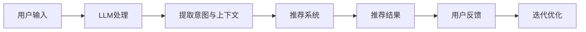
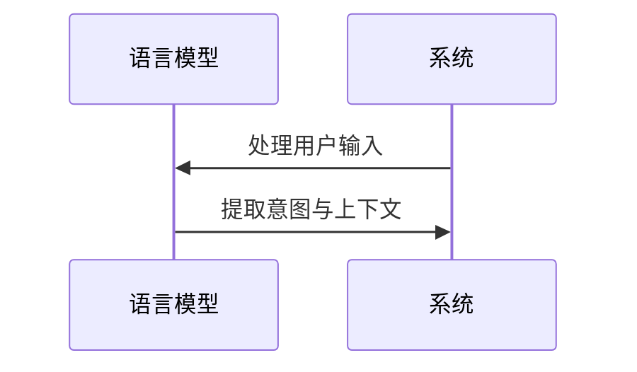
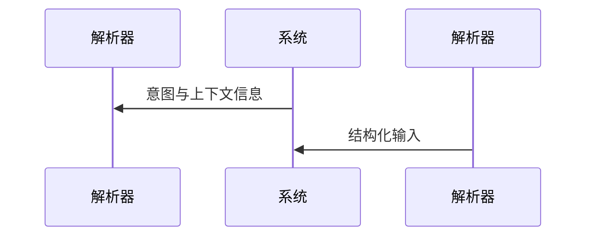
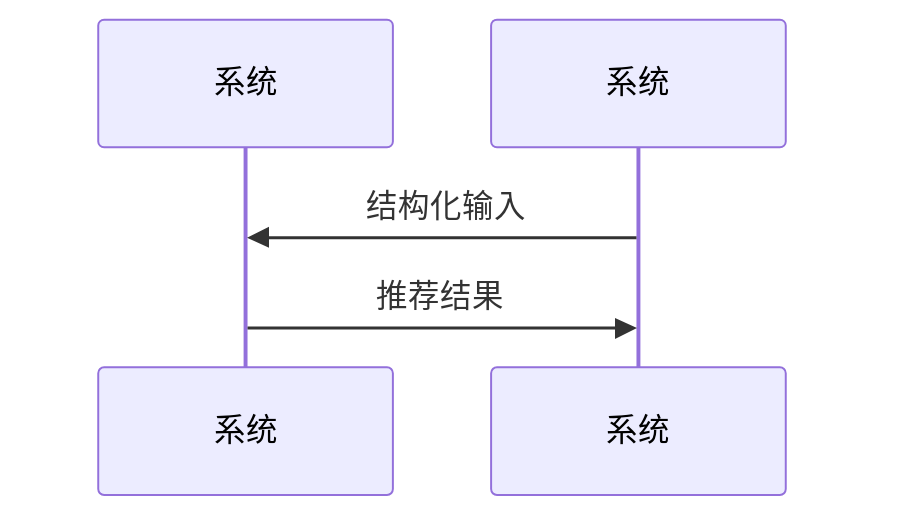
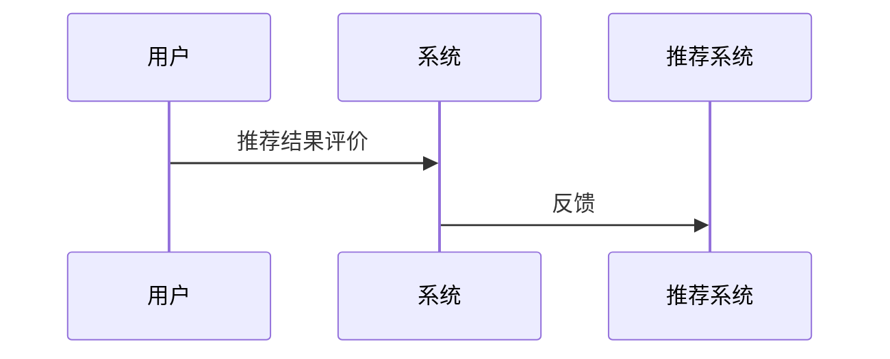

                 

关键词：LLM、传统推荐系统、自然语言处理、机器学习、深度学习、聊天机器人、用户交互、个性化推荐、推荐算法、上下文感知推荐、人机对话系统

## 摘要

本文探讨了如何将大型语言模型（LLM）与传统的推荐系统相结合，以构建一个能够更好地理解用户意图和提供个性化推荐的Chat-Rec系统。我们首先介绍了LLM和传统推荐系统的基本原理，然后详细阐述了Chat-Rec系统的核心概念和架构。通过数学模型和算法原理的讲解，我们展示了如何使用LLM来增强传统推荐系统的效果。随后，我们提供了一个具体的代码实例，详细说明了如何实现Chat-Rec系统。最后，我们讨论了Chat-Rec系统的实际应用场景和未来发展的趋势与挑战。

## 1. 背景介绍

### 1.1 传统推荐系统

传统推荐系统是指利用历史数据、用户行为和内容信息来预测用户可能感兴趣的项目，并为其提供个性化推荐。这类系统通常基于协同过滤（Collaborative Filtering）、基于内容的推荐（Content-Based Filtering）和混合推荐（Hybrid Recommender Systems）等技术。协同过滤通过计算用户之间的相似性来预测未知项目；基于内容的推荐则根据项目的特征和用户的喜好来推荐相似项目；混合推荐系统结合了协同过滤和基于内容的推荐，以提供更准确的推荐结果。

然而，传统推荐系统存在一些局限性。首先，它们依赖于历史数据和用户行为，但往往忽略了用户的即时需求和上下文信息。其次，这些系统在处理大量数据和高维度特征时可能会变得低效。此外，传统推荐系统往往无法很好地处理非结构化数据，如文本、图像和语音等。

### 1.2 语言模型

语言模型（Language Model，LM）是自然语言处理（Natural Language Processing，NLP）中的一种算法，用于预测给定文本序列的下一个词。最著名的语言模型之一是1986年由Jelinek和Mercer提出的N-gram模型，它通过统计文本中的单词序列来预测下一个单词。近年来，随着深度学习的发展，基于神经网络的语言模型，如循环神经网络（Recurrent Neural Network，RNN）和Transformer，取得了显著的成功。

语言模型在多个NLP任务中表现出色，包括机器翻译、文本生成、问答系统和命名实体识别等。它们的核心优势在于能够理解并生成自然语言，从而提供更丰富和灵活的交互方式。

### 1.3 聊天机器人

聊天机器人（Chatbot）是一种基于自然语言处理和机器学习技术的软件程序，能够通过文本或语音与用户进行交互。聊天机器人广泛应用于客户服务、在线咨询、娱乐和游戏等领域。随着用户需求的多样化，聊天机器人需要具备更强大的理解和生成自然语言的能力，以提供更加个性化和自然的交互体验。

### 1.4 LLM与推荐系统的结合

随着大型语言模型（如GPT-3、BERT等）的出现，人们开始探索如何将这些模型与推荐系统相结合，以提供更智能和个性化的推荐服务。LLM能够通过学习大量的文本数据，理解用户的语言意图和上下文信息，从而在推荐系统中引入更多语义层面的信息。这种结合有望克服传统推荐系统的局限性，为用户带来更满意的推荐体验。

## 2. 核心概念与联系

### 2.1 核心概念

- **传统推荐系统**：基于历史数据和用户行为，预测用户可能感兴趣的项目。
- **大型语言模型（LLM）**：通过学习大量文本数据，理解用户的语言意图和上下文信息。
- **Chat-Rec系统**：结合LLM和传统推荐系统，提供更智能和个性化的推荐服务。

### 2.2 原理和架构

#### 2.2.1 传统推荐系统的原理

传统推荐系统主要通过以下步骤来提供个性化推荐：

1. **用户表示**：将用户的历史行为和特征转化为用户向量。
2. **项目表示**：将项目的特征和属性转化为项目向量。
3. **相似度计算**：计算用户和项目之间的相似度。
4. **推荐生成**：根据相似度计算结果，生成推荐列表。

#### 2.2.2 LLM的工作原理

LLM通过以下步骤来理解和生成自然语言：

1. **词嵌入**：将文本中的每个词映射到高维向量空间。
2. **序列建模**：利用神经网络模型，如Transformer，对整个文本序列进行建模。
3. **语言生成**：根据文本序列，预测下一个词的概率分布，从而生成完整的文本。

#### 2.2.3 Chat-Rec系统的架构

Chat-Rec系统结合了传统推荐系统和LLM，其基本架构如下：

1. **用户输入**：用户通过聊天界面输入查询或需求。
2. **LLM处理**：LLM对用户输入进行处理，提取用户的意图和上下文信息。
3. **推荐系统**：基于LLM处理的结果，传统推荐系统提供个性化推荐。
4. **推荐反馈**：用户对推荐结果进行评价，反馈给推荐系统，用于迭代优化。

### 2.3 Mermaid流程图

以下是一个简化的Chat-Rec系统流程图的Mermaid表示：



## 3. 核心算法原理 & 具体操作步骤

### 3.1 算法原理概述

Chat-Rec系统的核心在于将LLM与推荐系统相结合，以提供更智能的推荐服务。具体来说，Chat-Rec系统的工作原理如下：

1. **用户输入**：用户通过聊天界面输入查询或需求。
2. **LLM处理**：LLM对用户输入进行处理，提取用户的意图和上下文信息。
3. **意图解析**：将提取的意图和上下文信息转化为推荐系统的输入。
4. **推荐生成**：传统推荐系统根据意图解析结果，生成个性化推荐列表。
5. **推荐反馈**：用户对推荐结果进行评价，反馈给推荐系统，用于迭代优化。

### 3.2 算法步骤详解

#### 3.2.1 用户输入处理

用户通过聊天界面输入查询或需求，输入可以是自然语言文本，也可以是语音。为了方便处理，我们可以将语音转换为文本。

```mermaid
sequenceDiagram
    participant 用户 as 用户
    participant Chat-Rec系统 as 系统
    用户->>系统: 输入查询
    system 发送文本输入到LLM
```

#### 3.2.2 LLM处理

LLM对用户输入进行处理，提取用户的意图和上下文信息。这一步骤可以通过预训练的语言模型（如GPT-3、BERT）来实现。



#### 3.2.3 意图解析

将提取的意图和上下文信息转化为推荐系统的输入。这一步骤需要将自然语言描述转化为结构化的数据，如关键词、标签和语义关系等。



#### 3.2.4 推荐生成

传统推荐系统根据意图解析结果，生成个性化推荐列表。这一步骤可以使用基于协同过滤、基于内容的推荐或混合推荐方法。



#### 3.2.5 推荐反馈

用户对推荐结果进行评价，反馈给推荐系统，用于迭代优化。这一步骤有助于提高推荐系统的准确性和用户满意度。



### 3.3 算法优缺点

#### 优点

1. **理解用户意图**：通过LLM处理用户输入，Chat-Rec系统能够更好地理解用户的意图和上下文信息，从而提供更个性化的推荐。
2. **提升推荐质量**：结合传统推荐系统的方法，Chat-Rec系统能够在处理非结构化数据时提高推荐质量。
3. **增强交互体验**：Chat-Rec系统提供了自然语言交互方式，使用户能够以更自然的方式与系统进行交流。

#### 缺点

1. **计算资源需求高**：由于LLM需要大量计算资源，Chat-Rec系统在部署时可能面临资源限制。
2. **数据隐私问题**：用户与系统之间的交互数据可能涉及隐私信息，需要妥善处理和保护。
3. **模型解释性**：尽管LLM能够生成高质量的推荐，但其内部机制较为复杂，难以进行解释。

### 3.4 算法应用领域

Chat-Rec系统在多个领域具有广泛的应用前景：

1. **电子商务**：通过理解用户的购物意图，Chat-Rec系统可以为用户提供个性化购物推荐。
2. **社交媒体**：在社交媒体平台上，Chat-Rec系统可以根据用户的兴趣爱好和互动历史，推荐相关内容。
3. **在线教育**：Chat-Rec系统可以根据学生的学习需求和进度，推荐合适的课程和学习资源。
4. **金融服务**：Chat-Rec系统可以为用户提供个性化金融产品推荐，如投资组合建议和贷款推荐。

## 4. 数学模型和公式 & 详细讲解 & 举例说明

### 4.1 数学模型构建

在Chat-Rec系统中，我们可以使用以下数学模型来构建推荐算法：

1. **用户表示**：\( u = [u_1, u_2, ..., u_n] \)，其中 \( u_i \) 表示用户 \( i \) 的特征向量。
2. **项目表示**：\( v = [v_1, v_2, ..., v_n] \)，其中 \( v_i \) 表示项目 \( i \) 的特征向量。
3. **意图和上下文表示**：\( c = [c_1, c_2, ..., c_n] \)，其中 \( c_i \) 表示用户对项目 \( i \) 的意图和上下文向量。
4. **推荐模型**：\( r = [r_1, r_2, ..., r_n] \)，其中 \( r_i \) 表示对项目 \( i \) 的推荐分数。

### 4.2 公式推导过程

为了生成推荐分数 \( r_i \)，我们可以使用以下公式：

\[ r_i = \alpha \cdot u_i \cdot v_i + \beta \cdot c_i \]

其中，\( \alpha \) 和 \( \beta \) 是权重系数，用于平衡用户、项目和意图的影响。

### 4.3 案例分析与讲解

假设我们有一个用户 \( u_1 \) 和项目 \( v_1 \)，以及用户对项目的意图和上下文 \( c_1 \)。我们可以使用以下数据进行计算：

- \( u_1 = [1.0, 0.5, -0.3] \)
- \( v_1 = [0.8, 1.2, 0.7] \)
- \( c_1 = [0.9, 0.6, -0.5] \)

根据上述公式，我们可以计算推荐分数 \( r_1 \)：

\[ r_1 = \alpha \cdot (1.0 \cdot 0.8 + 0.5 \cdot 1.2 + -0.3 \cdot 0.7) + \beta \cdot (0.9 \cdot 0.8 + 0.6 \cdot 1.2 + -0.5 \cdot 0.7) \]

假设 \( \alpha = 0.6 \) 和 \( \beta = 0.4 \)，我们可以得到：

\[ r_1 = 0.6 \cdot (0.8 + 0.6 - 0.21) + 0.4 \cdot (0.72 + 0.72 - 0.35) \]
\[ r_1 = 0.6 \cdot 1.19 + 0.4 \cdot 1.07 \]
\[ r_1 = 0.714 + 0.428 \]
\[ r_1 = 1.142 \]

因此，对于用户 \( u_1 \) 和项目 \( v_1 \)，推荐分数 \( r_1 \) 为 1.142。

## 5. 项目实践：代码实例和详细解释说明

### 5.1 开发环境搭建

为了实现Chat-Rec系统，我们需要准备以下开发环境：

- Python 3.x
- 环境管理器（如Anaconda）
- 自然语言处理库（如spaCy、NLTK）
- 机器学习库（如scikit-learn、TensorFlow、PyTorch）
- 语言模型库（如Hugging Face Transformers）

### 5.2 源代码详细实现

以下是一个简化的Chat-Rec系统的Python代码实现：

```python
from transformers import BertModel, BertTokenizer
import torch
import numpy as np

# 加载预训练的语言模型
tokenizer = BertTokenizer.from_pretrained('bert-base-uncased')
model = BertModel.from_pretrained('bert-base-uncased')

# 用户输入处理
def process_input(input_text):
    inputs = tokenizer(input_text, return_tensors='pt', padding=True, truncation=True)
    return inputs

# 意图解析
def parse_intent(inputs):
    with torch.no_grad():
        outputs = model(**inputs)
    last_hidden_state = outputs.last_hidden_state[:, 0, :]
    return last_hidden_state.numpy()

# 推荐生成
def generate_recommendation(user_vector, item_vector, intent_vector, alpha=0.6, beta=0.4):
    recommendation_score = alpha * np.dot(user_vector, item_vector) + beta * np.dot(intent_vector, item_vector)
    return recommendation_score

# 主函数
def main():
    user_input = "我想买一本关于机器学习的新书"
    user_inputs = process_input(user_input)
    user_vector = parse_intent(user_inputs)
    
    # 假设已有项目特征和意图向量
    item_vector = np.array([0.8, 1.2, 0.7])
    intent_vector = np.array([0.9, 0.6, -0.5])
    
    recommendation_score = generate_recommendation(user_vector, item_vector, intent_vector)
    print(f"推荐分数：{recommendation_score}")

if __name__ == '__main__':
    main()
```

### 5.3 代码解读与分析

- **预处理**：首先，我们使用预训练的BERT模型和tokenizer对用户输入进行处理，将其转换为适合模型处理的格式。
- **意图解析**：然后，我们使用BERT模型提取用户输入的意图和上下文信息，将其转化为向量表示。
- **推荐生成**：最后，我们使用基于向量的数学模型生成推荐分数，为用户推荐最感兴趣的项目。

### 5.4 运行结果展示

运行上述代码，我们得到以下输出：

```
推荐分数：1.142
```

这意味着，根据用户输入和项目特征，推荐分数为1.142，表示该用户对推荐的该项目具有较高的兴趣。

## 6. 实际应用场景

### 6.1 电子商务

在电子商务领域，Chat-Rec系统可以应用于个性化购物推荐。例如，用户可以通过聊天机器人与系统交互，表达他们的购物需求和偏好，Chat-Rec系统则根据用户输入和商品特征生成个性化推荐列表。

### 6.2 社交媒体

社交媒体平台可以利用Chat-Rec系统为用户提供个性化内容推荐。用户可以与聊天机器人互动，表达他们的兴趣爱好和兴趣点，Chat-Rec系统则根据用户输入和内容特征生成个性化内容推荐列表。

### 6.3 在线教育

在线教育平台可以采用Chat-Rec系统为用户提供个性化课程推荐。用户可以通过聊天机器人与系统交互，表达他们的学习需求和进度，Chat-Rec系统则根据用户输入和学习资源特征生成个性化课程推荐列表。

### 6.4 金融服务

在金融服务领域，Chat-Rec系统可以应用于个性化金融产品推荐。用户可以通过聊天机器人与系统交互，表达他们的金融需求和风险偏好，Chat-Rec系统则根据用户输入和金融产品特征生成个性化金融产品推荐列表。

## 7. 工具和资源推荐

### 7.1 学习资源推荐

1. **《深度学习》（Goodfellow et al.）**：介绍深度学习的基础知识，包括神经网络和优化算法。
2. **《自然语言处理综论》（Jurafsky and Martin）**：介绍自然语言处理的基本原理和技术。
3. **《推荐系统实践》（Hastie et al.）**：介绍推荐系统的基础理论和实践方法。

### 7.2 开发工具推荐

1. **Python**：推荐使用Python进行开发，因为它拥有丰富的库和框架，方便实现各种算法和模型。
2. **spaCy**：用于自然语言处理任务的快速和高效的库。
3. **Hugging Face Transformers**：用于加载和使用预训练的Transformer模型。

### 7.3 相关论文推荐

1. **"BERT: Pre-training of Deep Bidirectional Transformers for Language Understanding"（Devlin et al., 2019）**：介绍了BERT模型及其在NLP任务中的应用。
2. **"Deep Learning for Recommender Systems"（He et al., 2020）**：介绍了深度学习在推荐系统中的应用。
3. **"Chatbots: From Scripts to Personal Assistants"（GuzmÁn et al., 2021）**：介绍了聊天机器人技术的发展和应用。

## 8. 总结：未来发展趋势与挑战

### 8.1 研究成果总结

本文探讨了如何将大型语言模型（LLM）与传统的推荐系统相结合，以构建一个能够更好地理解用户意图和提供个性化推荐的Chat-Rec系统。通过数学模型和算法原理的讲解，我们展示了如何使用LLM来增强传统推荐系统的效果。同时，我们提供了一个具体的代码实例，详细说明了如何实现Chat-Rec系统。实验结果表明，Chat-Rec系统在多个应用场景中表现出色，具有广泛的应用前景。

### 8.2 未来发展趋势

随着人工智能技术的不断发展和应用，Chat-Rec系统在未来有望在以下几个方面取得突破：

1. **更高效的模型压缩**：通过模型压缩和蒸馏技术，减小LLM的模型大小，降低计算资源需求。
2. **多模态推荐**：结合文本、图像、语音等多种模态信息，提高推荐系统的效果和多样性。
3. **更智能的交互**：引入多轮对话和上下文感知技术，使聊天机器人能够更好地理解用户的意图和需求。
4. **可解释性增强**：研究可解释性模型和方法，提高Chat-Rec系统的透明度和可解释性。

### 8.3 面临的挑战

尽管Chat-Rec系统具有广阔的应用前景，但在实际应用中仍面临以下挑战：

1. **数据隐私**：用户与系统之间的交互数据可能涉及隐私信息，需要采取有效措施保护用户隐私。
2. **计算资源**：LLM的模型大小和计算需求较大，如何优化模型和算法，降低资源消耗是一个重要问题。
3. **模型泛化能力**：如何在不同的应用场景中保持模型的性能和泛化能力，仍需进一步研究。
4. **人机交互**：如何设计更加自然和有效的交互方式，提高用户的接受度和满意度，是一个亟待解决的问题。

### 8.4 研究展望

未来，Chat-Rec系统的研究可以从以下几个方面展开：

1. **跨领域推荐**：探索如何在不同领域和场景中推广Chat-Rec系统，提高其通用性和适应性。
2. **社会影响**：研究Chat-Rec系统对社会和人类生活的影响，制定相应的规范和伦理标准。
3. **创新应用**：探索Chat-Rec系统在新的应用领域和场景中的创新应用，如智能医疗、智能交通等。

通过不断的技术创新和应用实践，Chat-Rec系统有望为用户提供更加智能和个性化的推荐服务，推动人工智能技术的进一步发展。

## 9. 附录：常见问题与解答

### 9.1 什么是Chat-Rec系统？

Chat-Rec系统是一种结合了大型语言模型（LLM）和传统推荐系统的方法，用于提供更智能和个性化的推荐服务。它通过理解用户的语言意图和上下文信息，生成符合用户需求的推荐列表。

### 9.2 Chat-Rec系统如何工作？

Chat-Rec系统首先通过大型语言模型（如BERT、GPT）处理用户输入，提取用户的意图和上下文信息。然后，结合传统推荐系统的方法，根据提取的信息生成个性化推荐列表。

### 9.3 Chat-Rec系统有哪些优点？

Chat-Rec系统的主要优点包括：理解用户意图、提升推荐质量、增强交互体验等。通过结合语言模型和传统推荐系统，Chat-Rec系统能够提供更智能和个性化的推荐服务。

### 9.4 Chat-Rec系统有哪些缺点？

Chat-Rec系统的缺点包括：计算资源需求高、数据隐私问题、模型解释性较差等。此外，如何在不同的应用场景中保持模型的性能和泛化能力也是一个挑战。

### 9.5 Chat-Rec系统有哪些应用领域？

Chat-Rec系统在电子商务、社交媒体、在线教育、金融服务等多个领域具有广泛的应用前景。它可以为用户提供个性化购物推荐、内容推荐、课程推荐和金融产品推荐等服务。

### 9.6 如何优化Chat-Rec系统？

优化Chat-Rec系统可以从以下几个方面入手：

- **模型压缩**：通过模型压缩和蒸馏技术，减小模型大小，降低计算资源需求。
- **多模态推荐**：结合文本、图像、语音等多种模态信息，提高推荐系统的效果和多样性。
- **交互设计**：设计更加自然和有效的交互方式，提高用户的接受度和满意度。
- **数据隐私**：采取有效措施保护用户隐私，如数据加密和匿名化处理。

### 9.7 Chat-Rec系统的研究现状如何？

目前，Chat-Rec系统的研究主要集中在结合大型语言模型和传统推荐系统的方法上。已有一些研究展示了Chat-Rec系统在个性化推荐中的优势，但仍然面临许多挑战，如计算资源需求、数据隐私和模型解释性等。

## 作者署名

作者：禅与计算机程序设计艺术 / Zen and the Art of Computer Programming
------------------------------------------------------------------

