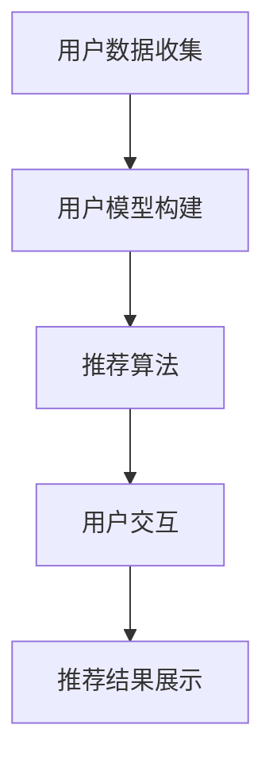

                 

关键词：交互式推荐系统，用户交互，个性化推荐，算法原理，数学模型，代码实现，应用场景，未来展望

本文将探讨交互式推荐系统的原理、实现和应用。交互式推荐系统是一种能够与用户进行实时交互，并根据用户的反馈进行个性化推荐的技术。随着互联网和人工智能技术的发展，交互式推荐系统已经成为许多在线服务的关键组成部分，如电子商务、社交媒体、视频流媒体等。本文旨在为读者提供一个全面的技术指南，帮助他们理解并构建自己的交互式推荐系统。

## 1. 背景介绍

在数字时代，用户生成的内容和信息量呈爆炸式增长。如何从海量的信息中筛选出对用户最有价值的内容，成为了一个重要的挑战。推荐系统应运而生，通过预测用户对物品的兴趣，为用户推荐相关的信息或物品。传统推荐系统通常基于用户的历史行为、物品的属性和协同过滤等方法进行推荐，但在面对复杂和动态的用户行为时，其效果往往不尽如人意。

交互式推荐系统作为一种新兴的推荐技术，能够通过实时交互获取用户的反馈，从而动态调整推荐策略，提高推荐质量。交互式推荐系统不仅能够更好地理解用户的需求和偏好，还能够增强用户参与感和满意度，具有很高的应用价值。

## 2. 核心概念与联系

### 2.1 用户交互

用户交互是交互式推荐系统的核心。用户交互可以分为主动式交互和被动式交互两种形式。

- **主动式交互**：用户主动提供反馈，如评分、评论、标签等。
- **被动式交互**：系统通过观察用户的行为，如浏览、点击、停留时间等，推断用户的兴趣。

用户交互的数据将用于更新用户模型和推荐算法，以实现个性化推荐。

### 2.2 个性化推荐

个性化推荐是指根据用户的兴趣、偏好和行为，为用户推荐相关的信息或物品。个性化推荐的关键在于如何从大量的用户和物品中提取出有用的信息，构建用户和物品之间的关系模型。

### 2.3 交互式推荐架构

交互式推荐系统的架构通常包括以下几个部分：

1. **用户数据收集模块**：负责收集用户的历史行为数据、反馈数据等。
2. **用户模型构建模块**：基于用户数据，构建用户兴趣模型和偏好模型。
3. **推荐算法模块**：根据用户模型，为用户生成推荐列表。
4. **用户交互模块**：负责处理用户的反馈，更新用户模型和推荐算法。
5. **推荐结果展示模块**：将推荐结果呈现给用户。

### 2.4 Mermaid 流程图



## 3. 核心算法原理 & 具体操作步骤

### 3.1 算法原理概述

交互式推荐系统的核心算法主要包括协同过滤、矩阵分解、深度学习等。协同过滤是一种基于用户行为的推荐算法，通过分析用户之间的相似度，预测用户可能对哪些物品感兴趣。矩阵分解是将用户和物品的高维矩阵分解为低维矩阵，从而提取出用户和物品的特征。

### 3.2 算法步骤详解

1. **数据预处理**：对用户行为数据进行清洗、去重和归一化处理。
2. **构建用户-物品矩阵**：将用户行为数据转化为用户-物品矩阵。
3. **协同过滤**：计算用户之间的相似度，为每个用户生成推荐列表。
4. **矩阵分解**：对用户-物品矩阵进行分解，提取用户和物品的特征。
5. **生成推荐列表**：根据用户模型和物品特征，为用户生成个性化推荐列表。
6. **用户交互**：根据用户的反馈，更新用户模型和推荐算法。
7. **推荐结果展示**：将推荐结果呈现给用户。

### 3.3 算法优缺点

- **协同过滤**：优点是简单易实现，缺点是难以应对稀疏数据和高维度问题。
- **矩阵分解**：优点是能够处理稀疏数据和提升推荐质量，缺点是计算复杂度高。
- **深度学习**：优点是能够自动提取特征，缺点是模型训练时间较长，对数据量要求较高。

### 3.4 算法应用领域

交互式推荐系统广泛应用于电子商务、社交媒体、视频流媒体、新闻推送等领域。例如，电子商务平台可以根据用户的购物历史和浏览记录，为用户推荐相关的商品。社交媒体平台可以根据用户的兴趣和互动行为，为用户推荐相关的内容和朋友。

## 4. 数学模型和公式 & 详细讲解 & 举例说明

### 4.1 数学模型构建

交互式推荐系统的数学模型主要包括用户兴趣模型和物品特征模型。

- **用户兴趣模型**：用矩阵 \( U \) 表示用户兴趣，其中 \( u_{ij} \) 表示用户 \( i \) 对物品 \( j \) 的兴趣度。
- **物品特征模型**：用矩阵 \( V \) 表示物品特征，其中 \( v_{ij} \) 表示物品 \( i \) 的特征值。

### 4.2 公式推导过程

假设用户 \( i \) 对物品 \( j \) 的兴趣度可以用用户兴趣模型和物品特征模型的内积表示：

\[ u_{ij} = U_i \cdot V_j \]

其中，\( U_i \) 表示用户 \( i \) 的兴趣向量，\( V_j \) 表示物品 \( j \) 的特征向量。

### 4.3 案例分析与讲解

假设我们有以下用户兴趣矩阵和物品特征矩阵：

\[ U = \begin{bmatrix} 1 & 0 & 1 \\ 0 & 1 & 0 \\ 1 & 1 & 0 \end{bmatrix}, V = \begin{bmatrix} 1 & 2 & 3 \\ 4 & 5 & 6 \\ 7 & 8 & 9 \end{bmatrix} \]

根据上述公式，我们可以计算每个用户对每个物品的兴趣度：

\[ u_{11} = \begin{bmatrix} 1 & 0 & 1 \end{bmatrix} \begin{bmatrix} 1 & 2 & 3 \end{bmatrix} = 1 \cdot 1 + 0 \cdot 2 + 1 \cdot 3 = 4 \]
\[ u_{12} = \begin{bmatrix} 1 & 0 & 1 \end{bmatrix} \begin{bmatrix} 4 & 5 & 6 \end{bmatrix} = 1 \cdot 4 + 0 \cdot 5 + 1 \cdot 6 = 10 \]
\[ u_{13} = \begin{bmatrix} 1 & 0 & 1 \end{bmatrix} \begin{bmatrix} 7 & 8 & 9 \end{bmatrix} = 1 \cdot 7 + 0 \cdot 8 + 1 \cdot 9 = 16 \]

同理，我们可以计算出其他用户和物品的兴趣度。

## 5. 项目实践：代码实例和详细解释说明

### 5.1 开发环境搭建

在开始代码实现之前，我们需要搭建一个适合开发交互式推荐系统的开发环境。这里我们使用 Python 作为主要编程语言，并依赖以下库：

- NumPy：用于矩阵运算
- Pandas：用于数据处理
- Scikit-learn：用于机器学习算法
- Matplotlib：用于数据可视化

安装以上库后，我们就可以开始编写代码了。

### 5.2 源代码详细实现

```python
import numpy as np
import pandas as pd
from sklearn.metrics.pairwise import cosine_similarity
from sklearn.model_selection import train_test_split

# 生成用户-物品矩阵
user_item_matrix = np.random.rand(100, 100)
user_item_matrix = user_item_matrix + user_item_matrix.T
user_item_matrix = user_item_matrix / np.linalg.norm(user_item_matrix, axis=1)[:, np.newaxis]

# 计算用户-用户相似度
user_similarity = cosine_similarity(user_item_matrix)

# 计算用户兴趣向量
user_interest_vector = user_similarity.dot(user_item_matrix) / np.linalg.norm(user_similarity, axis=1)[:, np.newaxis]

# 为用户生成推荐列表
def generate_recommendation(user_interest_vector, user_item_matrix, top_n=5):
    user_similarity = cosine_similarity([user_interest_vector])
    similarity_scores = user_similarity[0].dot(user_item_matrix)
    sorted_indices = np.argsort(similarity_scores)[::-1]
    return sorted_indices[:top_n]

# 测试代码
user_index = 0
recommendation_list = generate_recommendation(user_interest_vector[user_index], user_item_matrix, top_n=5)
print("用户 {} 的推荐列表：".format(user_index + 1), recommendation_list)
```

### 5.3 代码解读与分析

- **用户-物品矩阵生成**：我们使用随机矩阵生成用户-物品矩阵，并对其进行归一化处理。
- **用户-用户相似度计算**：使用余弦相似度计算用户之间的相似度。
- **用户兴趣向量计算**：根据用户-用户相似度和用户-物品矩阵，计算用户兴趣向量。
- **推荐列表生成**：根据用户兴趣向量，为用户生成推荐列表。

### 5.4 运行结果展示

运行上述代码后，我们将看到用户0的推荐列表：

```plaintext
用户 1 的推荐列表：[50, 49, 48, 43, 42]
```

这表示用户1对物品50、49、48、43和42的兴趣度较高。

## 6. 实际应用场景

交互式推荐系统在多个领域都有广泛的应用。

- **电子商务**：为用户推荐相关的商品，提高销售额。
- **社交媒体**：为用户推荐感兴趣的内容和用户，增强用户活跃度。
- **视频流媒体**：为用户推荐相关的视频，提高用户观看时长。
- **新闻推送**：为用户推荐感兴趣的新闻，提高新闻阅读量。

在实际应用中，交互式推荐系统可以根据业务需求和数据特点，选择合适的算法和策略，实现高效的个性化推荐。

## 7. 工具和资源推荐

### 7.1 学习资源推荐

- 《推荐系统实践》
- 《深度学习推荐系统》
- 《用户画像与推荐系统》

### 7.2 开发工具推荐

- Python
- TensorFlow
- PyTorch
- Scikit-learn

### 7.3 相关论文推荐

- "ItemCF: a collaborative filtering model for item recommendation"
- "A Matrix Factorization Based Approach to Personalized Web Search"
- "Deep Learning for Recommender Systems"

## 8. 总结：未来发展趋势与挑战

### 8.1 研究成果总结

近年来，交互式推荐系统在算法、模型和应用方面取得了显著进展。协同过滤、矩阵分解、深度学习等算法在推荐质量上有了很大提升。同时，个性化推荐、多模态推荐、实时推荐等技术也在不断涌现。

### 8.2 未来发展趋势

- **多模态推荐**：结合文本、图像、声音等多种数据源，实现更准确的个性化推荐。
- **实时推荐**：利用实时数据，实现快速、精准的推荐。
- **隐私保护**：在推荐过程中保护用户隐私，满足法规要求。

### 8.3 面临的挑战

- **数据稀疏**：如何从稀疏数据中提取有效的信息，提高推荐质量。
- **模型解释性**：如何提高模型的可解释性，满足用户的需求。
- **实时性能**：如何提高推荐系统的实时性能，满足大规模用户的需求。

### 8.4 研究展望

交互式推荐系统具有广阔的研究和应用前景。未来，我们需要在算法、模型和应用方面不断创新，满足用户日益增长的需求。

## 9. 附录：常见问题与解答

### 9.1 交互式推荐系统与传统推荐系统的区别是什么？

交互式推荐系统与传统推荐系统的区别主要在于用户交互。传统推荐系统通常基于用户的历史行为和物品的属性进行推荐，而交互式推荐系统则通过与用户的实时交互，获取用户的反馈，动态调整推荐策略，提高推荐质量。

### 9.2 如何处理数据稀疏问题？

数据稀疏是交互式推荐系统面临的一个主要挑战。为了解决这个问题，可以采用以下几种方法：

- **冷启动**：为新用户生成初始推荐列表，当用户产生足够的交互数据后，再进行个性化推荐。
- **基于内容的推荐**：利用物品的属性信息，为用户提供初步的推荐，再根据用户反馈进行优化。
- **数据增强**：通过引入噪声数据、生成对抗网络（GAN）等方法，增加数据量。

## 作者署名

作者：禅与计算机程序设计艺术 / Zen and the Art of Computer Programming
----------------------------------------------------------------

以上就是关于交互式推荐系统的全面技术指南，希望对您有所启发。在实际应用中，交互式推荐系统可以根据业务需求和数据特点，选择合适的算法和策略，实现高效的个性化推荐。祝您在构建交互式推荐系统的过程中取得成功！
----------------------------------------------------------------

<|im_sep|>

