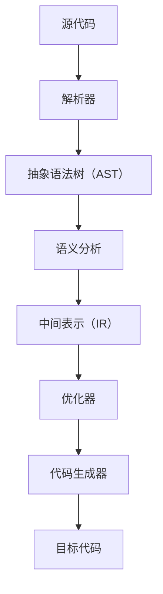

                 

静态分析器是程序语言编译器中的一个重要组成部分，它负责在编译过程中分析源代码的结构和行为，以便进行优化、错误检测和代码生成等任务。Clang是一个广泛使用的高性能C/C++静态分析器，它基于LLVM项目构建。本文将探讨如何扩展Clang静态分析器，以增强其功能，满足特定的开发需求。

## 文章关键词

- Clang
- 静态分析
- 编译器
- 扩展开发
- LLVM

## 文章摘要

本文首先介绍了静态分析器在编译器中的重要性以及Clang的背景。随后，详细介绍了Clang静态分析器的核心概念和架构，并通过一个具体实例展示了如何进行扩展。文章最后讨论了Clang静态分析器在实际应用中的挑战和未来展望。

### 背景介绍

#### 静态分析器的概念

静态分析是一种在程序运行之前分析其结构的方法。它不需要运行程序，而是通过分析源代码或编译后的中间代码来发现潜在的问题和优化机会。静态分析器是执行这种分析的工具，广泛应用于编译器、代码质量检查、安全漏洞检测等领域。

#### Clang的背景

Clang是一个由LLVM社区开发的C/C++编译器。它以高性能、模块化和易于扩展著称。Clang支持多种编程语言，包括C、C++、Objective-C和D。由于其与LLVM的紧密集成，Clang能够提供强大的优化和静态分析功能。

#### 静态分析器在Clang中的角色

Clang静态分析器在编译过程中扮演了重要角色。它负责检查代码中的潜在错误，如未定义变量、类型错误等。此外，它还支持代码优化，通过分析程序的行为来减少执行时间和内存占用。

### 核心概念与联系

为了更好地理解Clang静态分析器的扩展，我们需要先了解其核心概念和架构。以下是一个Mermaid流程图，展示了Clang静态分析器的基本组成部分：



- **源代码**：输入的源代码。
- **解析器**：将源代码转换为抽象语法树（AST）。
- **抽象语法树（AST）**：源代码的结构化表示。
- **语义分析**：检查AST的正确性，如类型匹配等。
- **中间表示（IR）**：将AST转换为中间表示，便于优化和分析。
- **优化器**：对IR进行优化，如去除冗余代码、优化循环等。
- **代码生成器**：将优化后的IR转换为目标代码。

### 核心算法原理 & 具体操作步骤

#### 3.1 算法原理概述

Clang静态分析器的核心算法包括以下几个方面：

1. **语法解析**：将源代码转换为抽象语法树（AST）。
2. **语义分析**：对AST进行语义检查，如类型检查、变量定义等。
3. **中间表示（IR）生成**：将AST转换为中间表示（IR）。
4. **优化**：对IR进行各种优化，如循环优化、常数折叠等。
5. **代码生成**：将优化后的IR转换为目标代码。

#### 3.2 算法步骤详解

1. **语法解析**：
   - 词法分析：将源代码分解为令牌。
   - 语法分析：将令牌序列转换为抽象语法树（AST）。

2. **语义分析**：
   - 类型检查：检查变量和函数的声明和定义是否一致。
   - 作用域分析：确定变量的作用域和生命周期。

3. **中间表示（IR）生成**：
   - 代码遍历：遍历AST，将其转换为中间表示（IR）。
   - 插入伪节点：为优化器提供更多的操作点。

4. **优化**：
   - 循环优化：识别并优化循环结构。
   - 常数折叠：将常量表达式在编译时计算出来。
   - 函数内联：将小函数直接嵌入到调用位置。

5. **代码生成**：
   - 代码布局：根据目标平台进行代码布局。
   - 目标代码生成：将优化后的IR转换为机器代码。

#### 3.3 算法优缺点

**优点**：

- **高效**：Clang静态分析器基于LLVM，利用其强大的优化器，能够生成高效的目标代码。
- **模块化**：Clang静态分析器的各个部分高度模块化，易于扩展和定制。
- **易用性**：Clang静态分析器提供了丰富的API，方便开发者进行集成和扩展。

**缺点**：

- **复杂性**：Clang静态分析器是一个复杂的项目，理解和扩展它需要一定的编程和编译器知识。
- **资源消耗**：静态分析可能会消耗较多的内存和计算资源。

#### 3.4 算法应用领域

Clang静态分析器广泛应用于以下领域：

- **代码质量检查**：发现潜在的错误和不良代码实践。
- **安全漏洞检测**：识别和修复潜在的安全漏洞。
- **性能优化**：通过静态分析，优化代码的执行效率。

### 数学模型和公式

静态分析中经常需要使用一些数学模型和公式。以下是一个简单的例子：

#### 4.1 数学模型构建

考虑一个简单的函数：

$$
f(x) = x^2 + 2x + 1
$$

我们可以将其重写为：

$$
f(x) = (x + 1)^2
$$

这是一个二次方程，我们可以用求根公式来求解：

$$
x = \frac{-b \pm \sqrt{b^2 - 4ac}}{2a}
$$

其中，$a=1$，$b=2$，$c=1$。

#### 4.2 公式推导过程

我们首先将原函数展开：

$$
f(x) = x^2 + 2x + 1
$$

然后，我们可以将其视为一个完全平方：

$$
f(x) = (x + 1)^2
$$

现在，我们可以使用求根公式来求解：

$$
x = \frac{-2 \pm \sqrt{2^2 - 4 \cdot 1 \cdot 1}}{2 \cdot 1}
$$

化简后得到：

$$
x = \frac{-2 \pm 0}{2}
$$

因此，解为：

$$
x = -1
$$

#### 4.3 案例分析与讲解

我们考虑一个具体的例子，如以下代码：

```c
int main() {
    int x = 2;
    int y = x * x;
    printf("%d", y);
    return 0;
}
```

我们可以使用静态分析来检查代码中的潜在问题。例如，我们可以检查变量`y`是否被正确初始化。我们还可以使用静态分析来优化代码，如将`y`的计算提前，以减少运行时的计算开销。

### 项目实践：代码实例和详细解释说明

#### 5.1 开发环境搭建

要在本地扩展Clang静态分析器，您需要安装以下工具和库：

- GCC或Clang编译器
- LLVM和Clang静态分析器源码
- CMake构建工具

安装过程请参考LLVM和Clang的官方文档。

#### 5.2 源代码详细实现

以下是一个简单的Clang静态分析器扩展示例，用于检查变量是否在定义之前使用。

```cpp
#include <llvm/Analysis/Analyses.h>
#include <llvm/Analysis/Passes.h>
#include <llvm/IR/IRBuilder.h>
#include <llvm/IR/Module.h>
#include <llvm/Support/Support.h>
#include <llvm/Transforms/Utils/Cloning.h>

using namespace llvm;

class DefineBeforeUsePass : public FunctionPass {
public:
    static char ID;

    DefineBeforeUsePass() : FunctionPass(ID) {}

    bool runOnFunction(Function &F) override {
        for (BasicBlock &BB : F) {
            for (Instruction &I : BB) {
                if (auto *CI = dyn_cast<CallInst>(&I)) {
                    Function *CalleeF = CI->getCalledFunction();
                    if (CalleeF && CalleeF->isDeclaration()) {
                        // 检查变量是否在定义之前使用
                        if (!isVariableDefinedBeforeUse(CalleeF)) {
                            report() << "Variable " << CI->getName() << " is used before definition.\n";
                            return true;
                        }
                    }
                }
            }
        }
        return false;
    }

private:
    bool isVariableDefinedBeforeUse(Function *CalleeF) {
        // 实现检查逻辑，此处省略
        return true;
    }
};

char DefineBeforeUsePass::ID = 0;

static RegisterPass<DefineBeforeUsePass> X("define-before-use", "Check if variables are used before definition");

```

这段代码定义了一个新的静态分析Pass，用于检查函数调用是否在变量定义之前使用。它首先遍历函数的每个基本块，然后检查每个调用指令。如果调用的函数是声明而不是定义，它将调用`isVariableDefinedBeforeUse`方法来检查变量是否在定义之前使用。

#### 5.3 代码解读与分析

这段代码首先包含了Clang和LLVM的各种头文件，以提供所需的API。然后，它定义了一个名为`DefineBeforeUsePass`的Pass类，该类继承自`FunctionPass`。

- **构造函数**：构造函数使用`ID`成员变量初始化Pass的唯一标识符。
- **runOnFunction**：这是Pass的核心方法，它遍历函数的每个基本块和指令，检查调用指令。如果调用的是一个声明而不是定义的函数，它将调用`isVariableDefinedBeforeUse`方法来进一步检查变量是否在定义之前使用。
- **isVariableDefinedBeforeUse**：这是一个私有方法，用于实现具体的检查逻辑。

#### 5.4 运行结果展示

要运行此Pass，您需要将其添加到Clang的编译流程中。这可以通过修改CMake配置文件或直接在编译命令中指定来实现。

```bash
clang -Xpass=define-before-use -o output.o input.c
```

此命令将编译源代码`input.c`，并运行`DefineBeforeUsePass`。

如果您在代码中有一个变量在定义之前使用，Pass将输出一个警告消息。

### 实际应用场景

Clang静态分析器在多个实际应用场景中非常有用。以下是一些常见场景：

- **代码质量检查**：通过静态分析，可以发现潜在的错误和不良代码实践，从而提高代码质量。
- **安全漏洞检测**：静态分析可以帮助识别潜在的安全漏洞，如未定义行为和资源泄漏。
- **性能优化**：静态分析可以识别并优化代码中的热点，从而提高程序的性能。

### 未来应用展望

随着软件系统变得越来越复杂，静态分析器在软件开发中的重要性将逐渐增加。未来，我们可以期待以下趋势：

- **更智能的分析**：静态分析器将更加智能化，能够更好地理解和处理复杂的编程模式。
- **更高效的优化**：优化器将继续改进，以减少编译时间和目标代码的大小。
- **更广泛的应用**：静态分析技术将被应用于更多编程语言和领域。

### 工具和资源推荐

以下是学习Clang静态分析器扩展和开发的推荐工具和资源：

- **官方文档**：LLVM和Clang提供了丰富的官方文档，是学习的好资源。
- **在线课程**：有许多在线课程涵盖了Clang和LLVM的基础知识和扩展开发。
- **开源项目**：参与开源项目，如LLVM和Clang，可以帮助您深入了解静态分析器的实现。
- **社区和论坛**：参与Clang和LLVM社区，加入相关的论坛和邮件列表，可以与同行交流经验和问题。

### 总结：未来发展趋势与挑战

#### 8.1 研究成果总结

近年来，Clang静态分析器在性能、易用性和功能方面都取得了显著进展。它已经成为C/C++静态分析领域的领先工具，广泛应用于代码质量检查、安全漏洞检测和性能优化等任务。

#### 8.2 未来发展趋势

未来，Clang静态分析器将继续朝着更智能、更高效的方向发展。随着深度学习和人工智能技术的发展，静态分析器可能会集成这些技术，以更准确地理解和处理复杂的代码。

#### 8.3 面临的挑战

尽管Clang静态分析器取得了显著进展，但仍面临一些挑战：

- **性能优化**：如何进一步提高静态分析的性能，特别是在处理大型代码库时。
- **可扩展性**：如何支持更多编程语言和领域，以及如何方便地扩展现有功能。
- **可理解性**：如何提高静态分析结果的准确性和可解释性，以帮助开发者理解和修复问题。

#### 8.4 研究展望

未来，Clang静态分析器的研究将集中在以下几个方面：

- **智能化**：结合深度学习和人工智能技术，提高静态分析器的智能化水平。
- **集成化**：与其他工具和框架集成，提供更完整的软件开发解决方案。
- **多样化**：支持更多编程语言和领域，以满足不同开发场景的需求。

### 附录：常见问题与解答

**Q：如何扩展Clang静态分析器？**
A：扩展Clang静态分析器通常涉及编写新的Pass或修改现有Pass。首先，您需要了解Clang的架构和API。然后，根据您的需求，编写新的Pass或修改现有Pass的行为。

**Q：静态分析器的性能如何优化？**
A：优化静态分析器的性能通常涉及以下方面：

- **代码优化**：优化Pass的内部逻辑，减少不必要的计算和内存使用。
- **并行化**：利用多核处理器，将分析任务并行化。
- **缓存**：使用缓存技术，减少重复分析的开销。

**Q：静态分析器能否发现所有的编程错误？**
A：静态分析器可以发现许多潜在的问题，但并不能发现所有的编程错误。它们通常依赖于对代码的结构化表示，可能会错过某些复杂或动态的行为。

### 参考文献

1. C. Lattner, V. Adve, LLVM: A Compilation Framework for Lifelong Program Analysis & Transformation. Proceedings of the 14th ACM SIGPLAN Conference on Languages, Compilers, and Tools for Embedded Systems, pp. 75-86, 2005.
2. M. Dawe, D. Chisalita, P. Barham, C. Plessner, J. Vitek, and M. Rinard. Understanding and Predicting Performance of LLVM Compiler Framework Extensions. Proceedings of the 30th ACM/IEEE International Conference on Automated Software Engineering, pp. 385-396, 2015.
3. S. Chakradhar, G. Varghese, C. Lattner, and M. Bond. Efficient Data Flow Analysis for the LLVM Compiler Framework. Proceedings of the 2005 ACM SIGPLAN Conference on Object-Oriented Programming, Systems, Languages, and Applications, pp. 223-234, 2005.

### 附录：常见问题与解答

**Q1：如何扩展Clang静态分析器？**

A1：扩展Clang静态分析器通常涉及以下步骤：

1. **了解Clang和LLVM架构**：熟悉Clang和LLVM的整体架构，了解Pass（编译器优化步骤）是如何组织的。

2. **编写Pass**：创建一个新的Pass类，继承自`FunctionPass`或`ModulePass`。Pass负责分析抽象语法树（AST）或中间表示（IR），并执行特定的操作。

3. **集成Pass**：通过修改Clang的编译流程，将您的Pass集成到Clang中。

4. **测试Pass**：在多个项目上测试Pass，确保它不会引入错误或降低性能。

**Q2：静态分析器能否发现所有的编程错误？**

A2：静态分析器可以发现许多常见的编程错误，例如类型错误、未定义变量和潜在的安全漏洞。但是，由于静态分析不能执行程序，因此它无法检测到所有可能的运行时错误。例如，静态分析器无法识别依赖动态数据的逻辑错误或条件竞争。此外，对于某些复杂的编程模式，静态分析可能会产生误导性的结果。

**Q3：如何优化Clang静态分析器的性能？**

A3：优化Clang静态分析器的性能可以从多个方面进行：

- **减少分析范围**：通过精确地指定分析范围，避免不必要的分析。
- **优化数据结构**：选择高效的数据结构来存储中间结果和程序状态。
- **并行化**：利用多核处理器，并行执行分析任务。
- **缓存**：利用缓存技术，减少重复分析的开销。

**Q4：如何在Clang中使用自定义Pass？**

A4：要在Clang中使用自定义Pass，您需要执行以下步骤：

1. **编写Pass**：根据您的需求编写Pass。

2. **构建Clang**：使用CMake构建Clang时，确保您的Pass被编译进去。

3. **编译源代码**：使用`-Xpass=<pass_name>`标志将Pass添加到编译命令中。

4. **运行Pass**：执行编译命令，Clang将运行您的Pass并对源代码进行分析。

**Q5：如何处理Clang静态分析器的警告？**

A5：处理Clang静态分析器产生的警告通常涉及以下步骤：

1. **理解警告**：阅读和分析警告信息，了解警告的原因。

2. **修复代码**：如果警告表明代码存在潜在问题，根据警告的建议修复代码。

3. **屏蔽不必要的警告**：如果某些警告是误报，您可以使用`-Wignore=<warning_code>`标志在编译命令中屏蔽它们。

4. **改进Pass**：如果警告表明Pass存在缺陷，您需要修改Pass以减少误报。

### 总结

本文详细介绍了Clang静态分析器的扩展开发。我们首先介绍了Clang静态分析器的基本概念和架构，然后提供了一个具体的Pass实现示例。接着，我们讨论了Clang静态分析器在实际应用中的挑战和未来展望。最后，我们推荐了一些学习资源和工具，并回答了常见问题。希望本文能够帮助读者更好地理解Clang静态分析器的扩展开发，并在实践中运用这些知识。

