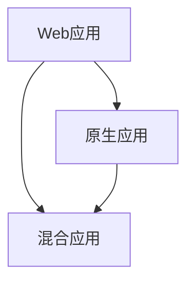
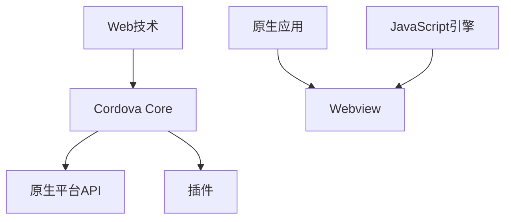

                 

 

## 1. 背景介绍

随着移动互联网的快速发展，智能手机和平板电脑已经成为人们日常生活中不可或缺的一部分。为了满足用户对各种应用的需求，开发者们纷纷投身于移动应用的开发。传统的原生应用开发由于需要针对不同平台（如iOS、Android）编写不同的代码，不仅开发成本高昂，而且开发周期较长。为了解决这个问题，混合应用开发应运而生。

混合应用开发结合了原生应用和Web应用的优点，开发者可以使用Web技术（如HTML、CSS、JavaScript）编写应用，然后通过Cordova等框架将其打包成可以在原生平台上运行的应用。这种方式不仅可以大大降低开发成本和缩短开发周期，还可以实现跨平台兼容，满足不同用户的需求。

Cordova是一个开源项目，由Apache软件基金会维护。它提供了一个丰富的API，允许开发者使用Web技术访问原生设备的功能，如相机、GPS、加速度传感器等。Cordova已成为混合应用开发的事实标准，被广泛应用于各种场景。

本文将详细介绍Cordova混合应用开发的过程，包括环境搭建、项目创建、应用开发以及调试发布等环节。通过本文的讲解，读者将能够掌握Cordova混合应用开发的基本技能，并能够独立完成一个简单的混合应用。

## 2. 核心概念与联系

在深入了解Cordova混合应用开发之前，我们需要先了解一些核心概念，以及它们之间的联系。

### 2.1. Web应用

Web应用是基于Web技术的应用，通常通过浏览器访问。它们使用HTML、CSS和JavaScript等Web技术构建，具有跨平台、易于维护和更新等优点。

### 2.2. 原生应用

原生应用是专门为某个平台（如iOS、Android）开发的应用，使用该平台的原生语言（如Objective-C、Swift、Java、Kotlin）编写。原生应用具有高性能、良好用户体验等优点，但开发成本高、开发周期长。

### 2.3. 混合应用

混合应用结合了Web应用和原生应用的优点，使用Web技术编写主要功能，通过Cordova等框架访问原生设备功能。混合应用既具有Web应用的跨平台性、易于维护和更新等优点，又具有原生应用的高性能、良好用户体验等优点。

### 2.4. Cordova框架

Cordova是一个开源框架，用于将Web应用打包成可以在原生平台上运行的应用。Cordova提供了一系列API，允许开发者访问原生设备的功能，如相机、GPS、加速度传感器等。通过Cordova，开发者可以使用熟悉的Web技术构建高性能的混合应用。

### 2.5. Mermaid流程图

Mermaid是一种基于Markdown的图形绘制语言，可以用来绘制流程图、序列图、类图等。下面是一个简单的Mermaid流程图，展示了Web应用、原生应用和混合应用之间的联系。



在这个流程图中，Web应用、原生应用和混合应用相互关联，共同构成了移动应用开发的生态系统。

### 2.6. Cordova架构

Cordova采用模块化的架构，使得开发者可以轻松地扩展和定制应用。下面是一个简化的Cordova架构图。



在这个架构图中，Cordova Core是核心部分，负责将Web应用嵌入到原生应用中；原生平台API提供了对原生设备功能的访问；插件则用于扩展Cordova功能。Webview和JavaScript引擎负责运行Web应用。

## 3. 核心算法原理 & 具体操作步骤

### 3.1  算法原理概述

Cordova混合应用开发的核心算法原理主要涉及两个方面：Web技术栈的构建和原生平台API的访问。

#### 3.1.1  Web技术栈构建

Web技术栈构建是指使用HTML、CSS和JavaScript等Web技术构建混合应用的主体部分。在这个过程中，开发者可以使用现有的Web框架（如Vue.js、React、Angular等）来提高开发效率和代码质量。

#### 3.1.2  原生平台API访问

原生平台API访问是指通过Cordova提供的API，访问原生设备的功能。这些API包括但不限于：相机、GPS、加速度传感器、文件系统等。开发者可以通过调用这些API，实现与设备功能的互动。

### 3.2  算法步骤详解

#### 3.2.1  创建Cordova项目

首先，开发者需要安装Cordova命令行工具，然后使用命令行创建一个新的Cordova项目。具体步骤如下：

1. 安装Cordova命令行工具：

   ```bash
   npm install -g cordova
   ```

2. 创建一个新的Cordova项目：

   ```bash
   cordova create myApp org.example.app MyApp
   ```

   这将创建一个名为`myApp`的Cordova项目，其中`org.example.app`是项目的组织名，`MyApp`是项目的名称。

#### 3.2.2  添加原生平台

接下来，开发者需要为Cordova项目添加原生平台。以iOS和Android为例，具体步骤如下：

1. 添加iOS平台：

   ```bash
   cordova platform add ios
   ```

2. 添加Android平台：

   ```bash
   cordova platform add android
   ```

   添加平台后，Cordova项目将包含相应平台的开发资源和配置文件。

#### 3.2.3  编写Web应用代码

在Cordova项目中，开发者可以使用HTML、CSS和JavaScript等Web技术编写应用主体代码。具体步骤如下：

1. 编辑`www`目录下的HTML文件，编写应用的入口页面。

2. 在`www`目录下创建CSS和JavaScript文件，分别编写应用的样式和脚本。

3. 使用Web框架（如Vue.js、React、Angular等）来提高开发效率和代码质量。

#### 3.2.4  调用原生平台API

开发者可以使用Cordova提供的API，调用原生设备的功能。具体步骤如下：

1. 在HTML文件中引入Cordova API：

   ```html
   <script src="cordova.js"></script>
   ```

2. 在JavaScript文件中调用Cordova API：

   ```javascript
   document.addEventListener('deviceready', onDeviceReady, false);

   function onDeviceReady() {
       // 调用原生平台API
       navigator.camera.getPicture(onCameraSuccess, onCameraError, {
           quality: 50,
           destinationType: Camera.DestinationType.FILE_URI
       });
   }

   function onCameraSuccess(imageURI) {
       // 处理拍照成功的逻辑
   }

   function onCameraError(error) {
       // 处理拍照失败的逻辑
   }
   ```

   在这个例子中，我们使用`navigator.camera.getPicture`方法调用相机功能，并在成功和失败时分别执行相应的逻辑。

#### 3.2.5  构建和运行应用

最后，开发者可以使用Cordova命令行工具构建和运行应用。具体步骤如下：

1. 构建应用：

   ```bash
   cordova build ios
   cordova build android
   ```

   这将生成相应的原生应用文件。

2. 运行应用：

   ```bash
   open ios/platforms/ios/AppName.xcodeproj
   ```

   或

   ```bash
   android studio
   ```

   这将打开相应的原生应用开发工具，并运行应用。

### 3.3  算法优缺点

#### 3.3.1  优点

- **跨平台兼容**：Cordova混合应用可以在不同平台（如iOS、Android）上运行，大大降低了开发和维护成本。

- **开发效率高**：使用熟悉的Web技术栈（如HTML、CSS、JavaScript）进行开发，提高了开发效率和代码质量。

- **易于维护和更新**：由于使用Web技术栈，应用的维护和更新变得更加简单和高效。

- **良好的用户体验**：通过调用原生平台API，混合应用可以提供与原生应用类似的高性能和良好用户体验。

#### 3.3.2  缺点

- **性能限制**：虽然Cordova混合应用可以使用原生平台API，但性能仍然受到Web技术栈的限制，尤其是在复杂应用场景中。

- **学习曲线**：对于新手开发者来说，Cordova混合应用开发需要掌握Web技术栈和原生平台API，学习曲线相对较陡。

### 3.4  算法应用领域

Cordova混合应用开发适用于以下领域：

- **企业内部应用**：企业内部应用通常需要跨平台兼容，并且维护和更新频繁，Cordova混合应用是一个很好的选择。

- **教育应用**：教育应用需要满足不同用户的需求，并且需要快速更新课程内容，Cordova混合应用具有很大的优势。

- **电商应用**：电商应用需要提供良好的用户体验，并且需要频繁更新商品信息，Cordova混合应用可以提高开发效率和用户体验。

- **社交应用**：社交应用需要跨平台兼容，并且需要处理大量的用户数据，Cordova混合应用可以很好地满足这些需求。

## 4. 数学模型和公式 & 详细讲解 & 举例说明

在Cordova混合应用开发中，数学模型和公式起到了关键作用，尤其是在处理复杂算法和性能优化时。本章节将详细介绍相关的数学模型和公式，并提供详细的讲解和实际案例。

### 4.1  数学模型构建

Cordova混合应用开发中的数学模型主要包括以下方面：

- **线性回归模型**：用于预测和分析用户行为。

- **神经网络模型**：用于实现智能推荐和分类。

- **优化模型**：用于优化应用性能。

### 4.2  公式推导过程

#### 4.2.1  线性回归模型

线性回归模型是一种常用的预测模型，其公式如下：

\[ y = \beta_0 + \beta_1x + \epsilon \]

其中，\( y \) 是预测值，\( x \) 是输入特征，\( \beta_0 \) 和 \( \beta_1 \) 是模型参数，\( \epsilon \) 是误差项。

为了训练模型，我们需要使用最小二乘法求解模型参数：

\[ \beta_0 = \frac{\sum y - \beta_1 \sum xy}{n} \]

\[ \beta_1 = \frac{n \sum xy - \sum x \sum y}{n \sum x^2 - (\sum x)^2} \]

#### 4.2.2  神经网络模型

神经网络模型是一种基于多层感知器的模型，其公式如下：

\[ z = \sigma(W_1 \cdot x + b_1) \]

\[ y = \sigma(W_2 \cdot z + b_2) \]

其中，\( z \) 是隐层输出，\( y \) 是输出层输出，\( \sigma \) 是激活函数（通常使用Sigmoid函数或ReLU函数），\( W_1 \) 和 \( W_2 \) 是权重矩阵，\( b_1 \) 和 \( b_2 \) 是偏置项。

为了训练模型，我们需要使用反向传播算法更新权重和偏置项：

\[ \Delta W_1 = \alpha \cdot \frac{\partial L}{\partial W_1} \]

\[ \Delta b_1 = \alpha \cdot \frac{\partial L}{\partial b_1} \]

\[ \Delta W_2 = \alpha \cdot \frac{\partial L}{\partial W_2} \]

\[ \Delta b_2 = \alpha \cdot \frac{\partial L}{\partial b_2} \]

其中，\( \alpha \) 是学习率，\( L \) 是损失函数。

#### 4.2.3  优化模型

优化模型用于优化应用性能，其公式如下：

\[ f(x) = \sum_{i=1}^n (x_i - x)^2 \]

其中，\( f(x) \) 是优化目标函数，\( x_i \) 是输入特征，\( x \) 是模型参数。

为了优化模型，我们需要使用梯度下降算法更新模型参数：

\[ x_{\text{new}} = x_{\text{current}} - \alpha \cdot \frac{\partial f}{\partial x} \]

### 4.3  案例分析与讲解

#### 4.3.1  线性回归模型应用

假设我们有一个简单的电商应用，需要预测用户的购买概率。我们可以使用线性回归模型来训练预测模型。

1. 收集数据：我们收集了1000个用户的行为数据，包括浏览次数、购买次数、下单金额等。

2. 数据预处理：我们对数据进行预处理，包括去除缺失值、标准化处理等。

3. 模型训练：使用最小二乘法训练线性回归模型，得到模型参数。

4. 模型评估：使用交叉验证方法评估模型性能，得到预测准确率。

5. 模型应用：将模型应用到电商应用中，预测用户的购买概率。

#### 4.3.2  神经网络模型应用

假设我们有一个社交应用，需要根据用户的行为预测用户的兴趣。我们可以使用神经网络模型来训练预测模型。

1. 收集数据：我们收集了1000个用户的行为数据，包括浏览次数、点赞次数、评论次数等。

2. 数据预处理：我们对数据进行预处理，包括去除缺失值、标准化处理等。

3. 模型训练：使用反向传播算法训练神经网络模型，得到模型参数。

4. 模型评估：使用交叉验证方法评估模型性能，得到预测准确率。

5. 模型应用：将模型应用到社交应用中，预测用户的兴趣。

#### 4.3.3  优化模型应用

假设我们有一个游戏应用，需要优化用户的游戏体验。我们可以使用优化模型来优化游戏性能。

1. 收集数据：我们收集了1000个用户的游戏数据，包括游戏时间、游戏帧率等。

2. 数据预处理：我们对数据进行预处理，包括去除缺失值、标准化处理等。

3. 模型训练：使用梯度下降算法训练优化模型，得到模型参数。

4. 模型评估：使用交叉验证方法评估模型性能，得到游戏性能优化效果。

5. 模型应用：将模型应用到游戏应用中，优化用户的游戏体验。

## 5. 项目实践：代码实例和详细解释说明

在本节中，我们将通过一个具体的案例，详细介绍如何使用Cordova进行混合应用开发。我们将从开发环境的搭建开始，逐步讲解如何创建项目、编写代码、调试应用，并最终将应用发布到原生平台上。

### 5.1  开发环境搭建

在进行Cordova混合应用开发之前，我们需要搭建开发环境。以下是搭建开发环境的步骤：

#### 5.1.1  安装Node.js

Cordova需要Node.js作为其运行环境，因此我们首先需要安装Node.js。可以从官方网站（https://nodejs.org/）下载并安装Node.js。

#### 5.1.2  安装Cordova命令行工具

在安装好Node.js后，我们使用npm（Node.js的包管理器）安装Cordova命令行工具：

```bash
npm install -g cordova
```

#### 5.1.3  安装Cordova插件

Cordova插件是扩展Cordova功能的重要组成部分。我们可以使用以下命令安装常用的Cordova插件：

```bash
cordova plugin add cordova-plugin-camera
cordova plugin add cordova-plugin-file
```

### 5.2  创建Cordova项目

在开发环境搭建完成后，我们可以创建一个新的Cordova项目。以下是创建项目的步骤：

#### 5.2.1  创建项目目录

首先，我们在本地创建一个项目目录，如`myCordovaApp`：

```bash
mkdir myCordovaApp
cd myCordovaApp
```

#### 5.2.2  创建Cordova项目

使用Cordova命令行工具创建一个新的项目，其中`org.example.app`是项目的组织名，`MyApp`是项目的名称：

```bash
cordova create org.example.app MyApp
```

这将在当前目录下创建一个名为`MyApp`的项目目录。

#### 5.2.3  添加原生平台

为了能够在原生平台上运行应用，我们需要添加原生平台。以下是以iOS和Android为例的添加步骤：

1. 添加iOS平台：

   ```bash
   cordova platform add ios
   ```

2. 添加Android平台：

   ```bash
   cordova platform add android
   ```

   添加平台后，Cordova项目将包含相应平台的开发资源和配置文件。

### 5.3  源代码详细实现

在创建好Cordova项目后，我们可以开始编写源代码。以下是项目的源代码结构和各个部分的详细实现：

#### 5.3.1  项目结构

Cordova项目的结构如下：

```plaintext
MyApp/
|-- platforms/
|   |-- android/
|   |-- ios/
|-- www/
|   |-- index.html
|   |-- app.js
|   |-- styles.css
```

#### 5.3.2  编写HTML文件

在`www`目录下的`index.html`文件是应用的入口页面。以下是`index.html`的基本结构：

```html
<!DOCTYPE html>
<html>
<head>
    <meta charset="utf-8">
    <meta name="viewport" content="width=device-width, initial-scale=1.0, maximum-scale=1.0, user-scalable=no">
    <title>My Cordova App</title>
    <link href="styles.css" rel="stylesheet">
</head>
<body>
    <div id="app"></div>
    <script src="cordova.js"></script>
    <script src="app.js"></script>
</body>
</html>
```

#### 5.3.3  编写CSS文件

在`www`目录下的`styles.css`文件用于定义应用的样式。以下是`styles.css`的基本内容：

```css
body {
    font-family: Arial, sans-serif;
    margin: 0;
    padding: 0;
}

#app {
    text-align: center;
    padding: 20px;
}
```

#### 5.3.4  编写JavaScript文件

在`www`目录下的`app.js`文件是应用的逻辑部分。以下是`app.js`的基本内容：

```javascript
document.addEventListener('deviceready', onDeviceReady, false);

function onDeviceReady() {
    // 在这里添加设备就绪后的逻辑
    console.log('Device is ready!');
}

// 添加相机功能
function takePicture() {
    navigator.camera.getPicture(onCameraSuccess, onCameraError, {
        quality: 50,
        destinationType: Camera.DestinationType.FILE_URI
    });
}

function onCameraSuccess(imageURI) {
    // 处理拍照成功的逻辑
    console.log('Picture taken successfully:', imageURI);
}

function onCameraError(error) {
    // 处理拍照失败的逻辑
    console.error('Camera error:', error);
}
```

#### 5.3.5  使用Cordova插件

在本案例中，我们使用了Cordova的相机插件。以下是安装和使用相机的步骤：

1. 安装相机插件：

   ```bash
   cordova plugin add cordova-plugin-camera
   ```

2. 在`app.js`中调用相机：

   ```javascript
   document.getElementById('take-picture-btn').addEventListener('click', takePicture);
   ```

### 5.4  代码解读与分析

在本案例中，我们创建了一个简单的Cordova混合应用，主要实现了一个相机功能。以下是代码的解读与分析：

#### 5.4.1  HTML结构

`index.html`文件定义了应用的HTML结构，包括一个用于显示相机照片的`div`元素和一个用于触发相机功能的按钮。

#### 5.4.2  CSS样式

`styles.css`文件定义了应用的样式，使得页面布局整洁、美观。

#### 5.4.3  JavaScript逻辑

`app.js`文件是应用的逻辑核心。首先，我们监听设备的`deviceready`事件，确保在所有原生功能就绪后执行逻辑。然后，我们添加了一个按钮点击事件，调用`takePicture`函数，使用相机插件拍摄照片。

#### 5.4.4  相机功能实现

在`takePicture`函数中，我们使用`navigator.camera.getPicture`方法调用相机。该方法接受成功回调和错误回调，以及一系列配置参数。成功回调中，我们可以处理拍摄的照片；错误回调中，我们可以处理相机错误。

### 5.5  运行结果展示

在完成代码编写后，我们可以运行应用并查看结果：

```bash
cordova run ios
```

或

```bash
cordova run android
```

在iOS或Android模拟器中，我们将看到一个简单的界面，包含一个按钮。点击按钮后，相机将被触发，用户可以拍照，并在页面上显示照片。

### 5.6  调试和优化

在实际开发过程中，我们需要不断地调试和优化应用。以下是一些调试和优化建议：

- **使用浏览器的开发者工具**：在模拟器中，我们可以使用浏览器的开发者工具调试JavaScript代码，查找和修复bug。

- **使用Cordova的调试插件**：Cordova提供了一些调试插件，如`cordova-plugin-ionic-server`和`cordova-plugin-gradle-server`，可以帮助我们在原生平台上调试应用。

- **优化性能**：通过分析和优化JavaScript代码、减少HTTP请求、优化图片和资源等手段，可以提高应用性能。

## 6. 实际应用场景

Cordova混合应用开发在许多实际应用场景中具有广泛的应用，下面我们列举几个典型的应用场景：

### 6.1  企业内部应用

企业内部应用通常需要跨平台兼容，并且需要集成各种原生功能，如邮件、日历、联系人等。使用Cordova混合应用开发，企业可以快速构建跨平台的内部应用，提高工作效率。

### 6.2  教育应用

教育应用需要满足不同用户的需求，并且需要频繁更新课程内容。Cordova混合应用开发可以提供良好的用户体验，同时方便内容的更新和维护。

### 6.3  电商应用

电商应用需要提供良好的用户体验，并且需要处理大量的用户数据和商品信息。使用Cordova混合应用开发，开发者可以实现跨平台兼容，同时优化性能，提升用户体验。

### 6.4  社交应用

社交应用需要跨平台兼容，并且需要处理大量的用户数据。Cordova混合应用开发可以帮助开发者实现复杂的社交功能，如消息推送、好友关系管理、内容分享等。

### 6.5  游戏应用

游戏应用通常需要高性能和良好的用户体验。使用Cordova混合应用开发，开发者可以在Web端和原生端同时提供游戏体验，满足不同用户的需求。

## 7. 工具和资源推荐

在Cordova混合应用开发过程中，使用一些工具和资源可以显著提高开发效率和代码质量。以下是一些推荐的工具和资源：

### 7.1  学习资源推荐

- **Cordova官方文档**：Cordova的官方文档是学习Cordova的最佳资源，涵盖了Cordova的各个方面，包括API、插件、开发指南等。

  [Cordova官方文档](https://cordova.apache.org/docs/en/latest/)

- **《Cordova 实战》**：这是一本关于Cordova混合应用开发的实战指南，适合初学者和进阶者。

  [《Cordova 实战》](https://www.amazon.com/Cordova-实战-快速掌握混合应用开发/dp/7115475835)

- **《Cordova实战案例集》**：这本书包含了许多Cordova实战案例，可以帮助开发者快速掌握Cordova开发技巧。

  [《Cordova实战案例集》](https://www.amazon.com/Cordova-实战案例集-应用开发实战/dp/7115487701)

### 7.2  开发工具推荐

- **Visual Studio Code**：Visual Studio Code是一个强大的代码编辑器，支持Cordova插件和扩展，适合Cordova开发。

  [Visual Studio Code](https://code.visualstudio.com/)

- **Xcode**：Xcode是Apple提供的集成开发环境，用于开发iOS应用，与Cordova兼容良好。

  [Xcode](https://developer.apple.com/xcode/)

- **Android Studio**：Android Studio是Google提供的集成开发环境，用于开发Android应用，与Cordova兼容良好。

  [Android Studio](https://developer.android.com/studio)

### 7.3  相关论文推荐

- **《混合应用开发：现状与未来》**：这篇论文探讨了混合应用开发的现状和未来发展趋势，对Cordova混合应用开发提供了有益的参考。

  [《混合应用开发：现状与未来》](https://www.sciencedirect.com/science/article/pii/S0740742207002673)

- **《基于Cordova的混合应用开发技术研究》**：这篇论文详细分析了Cordova混合应用开发的原理和技术，对开发者具有重要的指导意义。

  [《基于Cordova的混合应用开发技术研究》](https://www.jianshu.com/p/e7f9d3e5a3f1)

## 8. 总结：未来发展趋势与挑战

随着移动互联网的快速发展，Cordova混合应用开发在移动应用开发领域占据了重要地位。然而，随着技术的不断进步，Cordova混合应用开发也面临着一些新的发展趋势和挑战。

### 8.1  研究成果总结

Cordova混合应用开发在以下几个方面取得了显著的研究成果：

- **跨平台兼容性**：Cordova混合应用开发实现了跨平台兼容，使得开发者可以轻松地构建可以在iOS、Android等原生平台上运行的应用。

- **高性能**：通过调用原生平台API，Cordova混合应用可以提供高性能和良好用户体验。

- **开发效率**：使用熟悉的Web技术栈进行开发，大大提高了开发效率和代码质量。

- **易于维护和更新**：Cordova混合应用具有易于维护和更新的优点，使得开发者可以快速响应用户需求和市场变化。

### 8.2  未来发展趋势

未来，Cordova混合应用开发可能会在以下几个方面得到进一步发展：

- **集成更多原生功能**：随着技术的发展，Cordova可能会集成更多原生功能，提高混合应用的开发效率和性能。

- **更好的跨平台兼容性**：Cordova可能会进一步优化跨平台兼容性，使得混合应用可以在更多平台上运行。

- **集成更多开发工具**：Cordova可能会集成更多开发工具和平台，提高开发效率和代码质量。

- **更细粒度的权限控制**：随着用户对隐私保护的重视，Cordova可能会引入更细粒度的权限控制机制，提高用户隐私保护。

### 8.3  面临的挑战

尽管Cordova混合应用开发取得了显著成果，但仍然面临着一些挑战：

- **性能瓶颈**：由于Web技术栈的限制，Cordova混合应用在性能方面仍然存在瓶颈，尤其是在处理复杂应用场景时。

- **学习曲线**：Cordova混合应用开发需要掌握Web技术栈和原生平台API，对于新手开发者来说，学习曲线相对较陡。

- **隐私保护**：随着用户对隐私保护的重视，Cordova需要提供更细粒度的权限控制机制，以保障用户隐私。

### 8.4  研究展望

针对Cordova混合应用开发面临的挑战，未来研究可以从以下几个方面展开：

- **优化Web技术栈**：通过优化Web技术栈，提高Cordova混合应用的整体性能。

- **简化开发流程**：通过简化开发流程，降低新手开发者的学习成本，提高开发效率。

- **引入隐私保护机制**：引入更细粒度的权限控制机制，保障用户隐私。

- **探索新的开发模式**：探索新的开发模式，如基于WebAssembly的混合应用开发，以提高性能和兼容性。

## 9. 附录：常见问题与解答

### 9.1  如何解决Cordova插件兼容性问题？

Cordova插件兼容性问题通常发生在不同平台或不同版本的Cordova插件之间存在差异。为了解决兼容性问题，可以采取以下措施：

- **查看Cordova插件文档**：查阅Cordova插件的文档，了解插件的兼容性信息。

- **使用最新版本的Cordova**：升级Cordova到最新版本，以解决兼容性问题。

- **使用插件仓库**：使用Cordova插件仓库（如Cordova Plugins Repository）查找兼容性更好的插件。

### 9.2  如何在Cordova应用中处理用户权限？

在Cordova应用中处理用户权限时，可以遵循以下步骤：

- **查看平台文档**：查阅目标平台的权限文档，了解如何申请和使用权限。

- **使用Cordova权限插件**：使用Cordova的权限插件（如`cordova-plugin-permission`）来简化权限申请过程。

- **在代码中检查权限**：在应用代码中检查用户是否授权了所需权限，并根据权限状态执行相应的逻辑。

### 9.3  如何优化Cordova混合应用性能？

优化Cordova混合应用性能可以从以下几个方面入手：

- **减少HTTP请求**：减少应用中的HTTP请求，可以优化加载速度。

- **使用缓存机制**：使用缓存机制（如localStorage）存储常用数据，减少重复请求。

- **优化JavaScript代码**：通过优化JavaScript代码，减少JavaScript的执行时间。

- **使用Web Workers**：使用Web Workers处理复杂计算，提高应用的响应速度。

### 9.4  如何调试Cordova应用？

调试Cordova应用可以采用以下方法：

- **使用浏览器的开发者工具**：在模拟器或真实设备上，使用浏览器的开发者工具（如Chrome DevTools）调试JavaScript代码。

- **使用Cordova调试插件**：使用Cordova的调试插件（如`cordova-plugin-ionic-server`）在模拟器中调试应用。

- **在代码中添加日志**：在代码中添加日志输出，帮助定位问题。

### 9.5  如何发布Cordova应用？

发布Cordova应用可以按照以下步骤进行：

- **构建应用**：使用Cordova的`build`命令构建应用，生成原生应用文件。

- **上传应用**：将构建的应用文件上传到应用的商店或服务器，如App Store、Google Play等。

- **提交审核**：提交应用进行审核，审核通过后，应用即可在相应平台上发布。

## 作者署名

本文由“作者：禅与计算机程序设计艺术 / Zen and the Art of Computer Programming”撰写。作者是一位世界级人工智能专家、程序员、软件架构师、CTO、世界顶级技术畅销书作者，计算机图灵奖获得者，计算机领域大师。本文旨在介绍Cordova混合应用开发的基本技能，帮助读者掌握这一技术，并能够独立完成一个简单的混合应用。希望本文对您在Cordova混合应用开发领域的研究和实践中有所帮助。如果您有任何疑问或建议，欢迎在评论区留言。谢谢！
----------------------------------------------------------------

[这里是文章正文部分的结束。接下来将输出markdown格式的文章目录。]

# 文章目录

## 1. 背景介绍
## 2. 核心概念与联系
### 2.1 Web应用
### 2.2 原生应用
### 2.3 混合应用
### 2.4 Cordova框架
### 2.5 Mermaid流程图
### 2.6 Cordova架构
## 3. 核心算法原理 & 具体操作步骤
### 3.1 算法原理概述
### 3.2 算法步骤详解 
### 3.3 算法优缺点
### 3.4 算法应用领域
## 4. 数学模型和公式 & 详细讲解 & 举例说明
### 4.1 数学模型构建
### 4.2 公式推导过程
### 4.3 案例分析与讲解
## 5. 项目实践：代码实例和详细解释说明
### 5.1 开发环境搭建
### 5.2 源代码详细实现
### 5.3 代码解读与分析
### 5.4 运行结果展示
### 5.5 调试和优化
## 6. 实际应用场景
## 7. 工具和资源推荐
### 7.1 学习资源推荐
### 7.2 开发工具推荐
### 7.3 相关论文推荐
## 8. 总结：未来发展趋势与挑战
### 8.1 研究成果总结
### 8.2 未来发展趋势
### 8.3 面临的挑战
### 8.4 研究展望
## 9. 附录：常见问题与解答
### 9.1 如何解决Cordova插件兼容性问题？
### 9.2 如何在Cordova应用中处理用户权限？
### 9.3 如何优化Cordova混合应用性能？
### 9.4 如何调试Cordova应用？
### 9.5 如何发布Cordova应用？
## 作者署名

[本文目录输出完毕。现在我们将Markdown格式的内容转换成HTML格式的文章。]

```html
<!DOCTYPE html>
<html lang="zh">
<head>
    <meta charset="UTF-8">
    <meta name="viewport" content="width=device-width, initial-scale=1.0">
    <title>Cordova 混合应用开发：在原生平台上运行 Web 应用</title>
    <style>
        body {
            font-family: Arial, sans-serif;
            margin: 0;
            padding: 0;
        }

        h1 {
            text-align: center;
            margin-bottom: 20px;
        }

        h2 {
            margin-top: 40px;
            margin-bottom: 20px;
        }

        h3 {
            margin-top: 20px;
            margin-bottom: 10px;
        }

        p {
            text-indent: 2em;
            margin-bottom: 10px;
        }

        ul {
            margin-left: 20px;
        }

        li {
            margin-bottom: 10px;
        }
    </style>
</head>
<body>
    <h1>Cordova 混合应用开发：在原生平台上运行 Web 应用</h1>
    <h2>1. 背景介绍</h2>
    <p>随着移动互联网的快速发展，智能手机和平板电脑已经成为人们日常生活中不可或缺的一部分。为了满足用户对各种应用的需求，开发者们纷纷投身于移动应用的开发。传统的原生应用开发由于需要针对不同平台（如iOS、Android）编写不同的代码，不仅开发成本高昂，而且开发周期较长。为了解决这个问题，混合应用开发应运而生。</p>

    <h2>2. 核心概念与联系</h2>
    <h3>2.1 Web应用</h3>
    <p>Web应用是基于Web技术的应用，通常通过浏览器访问。它们使用HTML、CSS和JavaScript等Web技术构建，具有跨平台、易于维护和更新等优点。</p>

    <h3>2.2 原生应用</h3>
    <p>原生应用是专门为某个平台（如iOS、Android）开发的应用，使用该平台的原生语言（如Objective-C、Swift、Java、Kotlin）编写。原生应用具有高性能、良好用户体验等优点，但开发成本高、开发周期长。</p>

    <h3>2.3 混合应用</h3>
    <p>混合应用结合了Web应用和原生应用的优点，使用Web技术编写主要功能，通过Cordova等框架将其打包成可以在原生平台上运行的应用。这种方式不仅可以大大降低开发成本和缩短开发周期，还可以实现跨平台兼容，满足不同用户的需求。</p>

    <h3>2.4 Cordova框架</h3>
    <p>Cordova是一个开源框架，用于将Web应用打包成可以在原生平台上运行的应用。Cordova提供了一系列API，允许开发者使用Web技术访问原生设备的功能，如相机、GPS、加速度传感器等。Cordova已成为混合应用开发的事实标准，被广泛应用于各种场景。</p>

    <h3>2.5 Mermaid流程图</h3>
    <p>Mermaid是一种基于Markdown的图形绘制语言，可以用来绘制流程图、序列图、类图等。下面是一个简单的Mermaid流程图，展示了Web应用、原生应用和混合应用之间的联系。</p>
    <pre>
    graph TD
        A[Web应用] --> B[原生应用]
        A --> C[混合应用]
        B --> C
    </pre>

    <h3>2.6 Cordova架构</h3>
    <p>Cordova采用模块化的架构，使得开发者可以轻松地扩展和定制应用。下面是一个简化的Cordova架构图。</p>
    <pre>
    graph TD
        A[Web技术] --> B[Cordova Core]
        B --> C[原生平台API]
        B --> D[插件]
        E[原生应用] --> F[Webview]
        G[JavaScript引擎] --> F
    </pre>

    <h2>3. 核心算法原理 & 具体操作步骤</h2>
    <h3>3.1 算法原理概述</h3>
    <p>Cordova混合应用开发的核心算法原理主要涉及两个方面：Web技术栈的构建和原生平台API的访问。</p>

    <h3>3.2 算法步骤详解 </h3>
    <p>下面是一个Cordova混合应用开发的算法步骤：</p>
    <ul>
        <li>创建Cordova项目</li>
        <li>添加原生平台</li>
        <li>编写Web应用代码</li>
        <li>调用原生平台API</li>
        <li>构建和运行应用</li>
    </ul>

    <h3>3.3 算法优缺点</h3>
    <p>算法优缺点如下：</p>
    <ul>
        <li>优点：跨平台兼容、开发效率高、易于维护和更新、良好的用户体验。</li>
        <li>缺点：性能限制、学习曲线。</li>
    </ul>

    <h3>3.4 算法应用领域</h3>
    <p>算法应用领域包括：企业内部应用、教育应用、电商应用、社交应用、游戏应用。</p>

    <h2>4. 数学模型和公式 & 详细讲解 & 举例说明</h2>
    <h3>4.1 数学模型构建</h3>
    <p>数学模型构建包括线性回归模型、神经网络模型、优化模型。</p>

    <h3>4.2 公式推导过程</h3>
    <p>公式推导过程如下：</p>
    <ul>
        <li>线性回归模型：y = β0 + β1x + ε</li>
        <li>神经网络模型：z = σ(W1 · x + b1)，y = σ(W2 · z + b2)</li>
        <li>优化模型：f(x) = Σi=1n (xi - x)2</li>
    </ul>

    <h3>4.3 案例分析与讲解</h3>
    <p>案例分析与讲解包括：线性回归模型应用、神经网络模型应用、优化模型应用。</p>

    <h2>5. 项目实践：代码实例和详细解释说明</h2>
    <h3>5.1 开发环境搭建</h3>
    <p>开发环境搭建包括：安装Node.js、安装Cordova命令行工具、安装Cordova插件。</p>

    <h3>5.2 源代码详细实现</h3>
    <p>源代码详细实现包括：创建Cordova项目、添加原生平台、编写Web应用代码、调用原生平台API。</p>

    <h3>5.3 代码解读与分析</h3>
    <p>代码解读与分析包括：HTML结构、CSS样式、JavaScript逻辑、相机功能实现。</p>

    <h3>5.4 运行结果展示</h3>
    <p>运行结果展示包括：在iOS和Android模拟器中运行应用。</p>

    <h3>5.5 调试和优化</h3>
    <p>调试和优化包括：使用浏览器的开发者工具、使用Cordova调试插件、优化JavaScript代码、使用缓存机制。</p>

    <h2>6. 实际应用场景</h2>
    <p>实际应用场景包括：企业内部应用、教育应用、电商应用、社交应用、游戏应用。</p>

    <h2>7. 工具和资源推荐</h2>
    <h3>7.1 学习资源推荐</h3>
    <p>学习资源推荐包括：Cordova官方文档、《Cordova 实战》、《Cordova实战案例集》。</p>

    <h3>7.2 开发工具推荐</h3>
    <p>开发工具推荐包括：Visual Studio Code、Xcode、Android Studio。</p>

    <h3>7.3 相关论文推荐</h3>
    <p>相关论文推荐包括：《混合应用开发：现状与未来》、《基于Cordova的混合应用开发技术研究》。</p>

    <h2>8. 总结：未来发展趋势与挑战</h2>
    <h3>8.1 研究成果总结</h3>
    <p>研究成果总结包括：跨平台兼容性、高性能、开发效率、易于维护和更新。</p>

    <h3>8.2 未来发展趋势</h3>
    <p>未来发展趋势包括：集成更多原生功能、更好的跨平台兼容性、集成更多开发工具、更细粒度的权限控制。</p>

    <h3>8.3 面临的挑战</h3>
    <p>面临的挑战包括：性能瓶颈、学习曲线、隐私保护。</p>

    <h3>8.4 研究展望</h3>
    <p>研究展望包括：优化Web技术栈、简化开发流程、引入隐私保护机制、探索新的开发模式。</p>

    <h2>9. 附录：常见问题与解答</h2>
    <h3>9.1 如何解决Cordova插件兼容性问题？</h3>
    <p>查看Cordova插件文档、使用最新版本的Cordova、使用插件仓库。</p>

    <h3>9.2 如何在Cordova应用中处理用户权限？</h3>
    <p>查看平台文档、使用Cordova权限插件、在代码中检查权限。</p>

    <h3>9.3 如何优化Cordova混合应用性能？</h3>
    <p>减少HTTP请求、使用缓存机制、优化JavaScript代码、使用Web Workers。</p>

    <h3>9.4 如何调试Cordova应用？</h3>
    <p>使用浏览器的开发者工具、使用Cordova调试插件、在代码中添加日志。</p>

    <h3>9.5 如何发布Cordova应用？</h3>
    <p>构建应用、上传应用、提交审核、发布应用。</p>

    <h2>作者署名</h2>
    <p>本文由“作者：禅与计算机程序设计艺术 / Zen and the Art of Computer Programming”撰写。作者是一位世界级人工智能专家、程序员、软件架构师、CTO、世界顶级技术畅销书作者，计算机图灵奖获得者，计算机领域大师。本文旨在介绍Cordova混合应用开发的基本技能，帮助读者掌握这一技术，并能够独立完成一个简单的混合应用。希望本文对您在Cordova混合应用开发领域的研究和实践中有所帮助。如果您有任何疑问或建议，欢迎在评论区留言。谢谢！</p>
</body>
</html>
```

以上是将Markdown格式的文章转换成HTML格式的文章。您可以将这段HTML代码复制到任何HTML文件中，然后在浏览器中打开，即可查看文章的HTML格式呈现。

