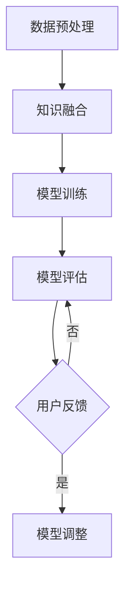

                 

关键词：DPO，AI偏好学习，机器学习，无监督学习，算法原理，数学模型，项目实践

> 摘要：本文旨在深入探讨DPO（Data Programming with Oracle）方法在AI偏好学习中的应用。DPO是一种无需人类反馈的机器学习方法，通过利用外部知识源和启发式规则，实现AI系统对用户偏好的自动学习。本文将介绍DPO的核心概念、算法原理、数学模型以及实际应用场景，旨在为研究人员和开发者提供有价值的参考。

## 1. 背景介绍

随着人工智能（AI）技术的快速发展，机器学习（ML）已经成为AI领域的核心驱动力。传统的机器学习方法主要依赖于大量带有标签的训练数据，通过学习数据中的模式，实现对未知数据的预测和分类。然而，在实际应用中，获取高质量、带有标签的数据往往非常困难，尤其是对于一些复杂、动态变化的偏好问题。为了解决这一问题，研究者们提出了无监督学习和半监督学习等新型学习方法。

在无监督学习中，模型仅使用未标记的数据进行训练，试图从中发现潜在的结构和规律。这种方法在许多领域都取得了显著的成果，如聚类、降维和异常检测等。然而，无监督学习方法在偏好学习方面仍然存在一些挑战。首先，偏好问题往往需要精确的标签信息，而未标记的数据难以提供这样的信息。其次，偏好问题通常具有高度的主观性，不同用户之间的偏好可能存在较大差异，这使得从无监督数据中提取可靠的偏好信息变得非常困难。

为了克服这些挑战，研究者们提出了DPO（Data Programming with Oracle）方法。DPO是一种无需人类反馈的机器学习方法，通过利用外部知识源和启发式规则，实现AI系统对用户偏好的自动学习。与传统的机器学习方法相比，DPO具有以下优势：

1. 无需大量带有标签的训练数据：DPO可以利用外部知识源和启发式规则，从原始数据中自动提取偏好信息，大大减少了依赖标签数据的需求。
2. 自适应调整：DPO可以根据不同用户的特点和偏好，动态调整学习策略，提高模型的泛化能力和鲁棒性。
3. 高效处理动态偏好：DPO能够实时更新和调整偏好模型，以应对用户偏好随时间变化带来的挑战。

本文将详细介绍DPO方法在AI偏好学习中的应用，包括其核心概念、算法原理、数学模型以及实际应用场景。

## 2. 核心概念与联系

### 2.1 DPO的核心概念

DPO（Data Programming with Oracle）方法的核心思想是将外部知识源和启发式规则引入到机器学习过程中，以自动学习和调整模型偏好。具体来说，DPO方法包括以下几个核心概念：

1. **外部知识源（Oracle）**：外部知识源是DPO方法的关键组成部分，它为模型提供了关于用户偏好和属性的先验信息。外部知识源可以是一个知识库、一个外部API，或者是一系列经验法则。通过利用外部知识源，DPO方法可以在缺乏标记数据的情况下，获取关于用户偏好和行为的可靠信息。

2. **启发式规则**：启发式规则是DPO方法中的另一个重要组成部分，用于指导模型学习过程中的决策。启发式规则通常是基于领域知识和专家经验设计的，用于解决偏好学习中的特定问题。例如，在推荐系统中，启发式规则可以用于识别用户之间的相似性、挖掘用户的兴趣点等。

3. **模型训练与调整**：DPO方法通过将外部知识源和启发式规则融入到模型训练过程中，实现偏好模型的自动学习和调整。具体来说，DPO方法包括以下几个步骤：

   - **数据预处理**：将原始数据转换为适合模型训练的形式，如特征提取、数据清洗等。
   - **知识融合**：将外部知识源和原始数据进行融合，生成用于训练的数据集。
   - **模型训练**：使用融合后的数据集训练偏好模型，如神经网络、决策树等。
   - **模型调整**：根据启发式规则和用户反馈，动态调整模型参数和结构，以优化偏好学习效果。

### 2.2 DPO的架构

DPO方法的架构可以分为以下几个主要模块：

1. **外部知识源模块**：该模块负责获取、管理和使用外部知识源，如知识库、外部API等。外部知识源可以是结构化的数据，如关系数据库，也可以是非结构化的数据，如图像、文本等。

2. **启发式规则模块**：该模块负责设计、实现和应用启发式规则，以指导模型学习过程中的决策。启发式规则可以是简单的条件语句，也可以是复杂的决策树、神经网络等。

3. **数据预处理模块**：该模块负责将原始数据转换为适合模型训练的形式，如特征提取、数据清洗、数据归一化等。

4. **模型训练模块**：该模块负责使用训练数据集训练偏好模型，如神经网络、决策树、支持向量机等。

5. **模型评估与调整模块**：该模块负责评估模型的性能，并根据用户反馈和启发式规则，动态调整模型参数和结构。

### 2.3 Mermaid流程图

以下是DPO方法的Mermaid流程图，展示了DPO方法的整体架构和关键步骤：



## 3. 核心算法原理 & 具体操作步骤

### 3.1 算法原理概述

DPO方法的核心算法原理是基于无监督学习和半监督学习的技术，通过融合外部知识源和启发式规则，实现AI系统对用户偏好的自动学习。具体来说，DPO方法包括以下几个主要步骤：

1. **数据预处理**：将原始数据转换为适合模型训练的形式，如特征提取、数据清洗等。这一步骤的目的是消除数据中的噪声和冗余信息，提高数据的质量和一致性。

2. **知识融合**：将外部知识源和原始数据进行融合，生成用于训练的数据集。这一步骤的目的是利用外部知识源提供的信息，补充和丰富原始数据中的偏好信息。

3. **模型训练**：使用融合后的数据集训练偏好模型，如神经网络、决策树、支持向量机等。这一步骤的目的是通过学习数据中的潜在结构和规律，建立能够预测用户偏好的模型。

4. **模型调整**：根据启发式规则和用户反馈，动态调整模型参数和结构，以优化偏好学习效果。这一步骤的目的是通过不断迭代和优化，提高模型的泛化能力和鲁棒性。

### 3.2 算法步骤详解

以下是DPO方法的详细步骤：

1. **数据预处理**：

   - **特征提取**：对原始数据进行特征提取，提取出反映用户偏好和行为的关键特征，如用户浏览记录、购买历史、评论内容等。
   - **数据清洗**：对提取出的特征进行清洗，去除噪声和冗余信息，如去除缺失值、异常值和重复值等。
   - **数据归一化**：对特征进行归一化处理，将不同特征的范围和尺度进行调整，使其具有相似的数量级和分布。

2. **知识融合**：

   - **知识获取**：从外部知识源获取关于用户偏好和行为的先验信息，如用户画像、标签信息、推荐列表等。
   - **知识融合**：将外部知识源和原始数据进行融合，生成融合数据集。融合方法可以采用矩阵分解、图嵌入等技术，将外部知识和原始数据进行融合和表示。

3. **模型训练**：

   - **模型选择**：根据问题特点和需求，选择合适的模型，如神经网络、决策树、支持向量机等。
   - **模型训练**：使用融合后的数据集训练模型，通过学习数据中的潜在结构和规律，建立能够预测用户偏好的模型。训练过程中，可以采用交叉验证、网格搜索等技术，优化模型参数和结构。

4. **模型调整**：

   - **模型评估**：使用验证集或测试集评估模型性能，如准确率、召回率、F1分数等。
   - **模型调整**：根据模型性能和用户反馈，动态调整模型参数和结构，以优化偏好学习效果。调整方法可以采用梯度下降、遗传算法、贝叶斯优化等技术。

### 3.3 算法优缺点

DPO方法具有以下优点：

1. **无需大量带有标签的训练数据**：DPO方法可以利用外部知识源和启发式规则，从原始数据中自动提取偏好信息，大大减少了依赖标签数据的需求。
2. **自适应调整**：DPO方法可以根据不同用户的特点和偏好，动态调整学习策略，提高模型的泛化能力和鲁棒性。
3. **高效处理动态偏好**：DPO方法能够实时更新和调整偏好模型，以应对用户偏好随时间变化带来的挑战。

DPO方法也存在一些缺点：

1. **外部知识源的质量和可靠性**：DPO方法依赖于外部知识源提供的信息，如果外部知识源质量较差或可靠性较低，可能会对模型性能产生负面影响。
2. **计算成本较高**：DPO方法涉及到数据预处理、知识融合、模型训练和调整等多个步骤，需要较高的计算资源和时间成本。

### 3.4 算法应用领域

DPO方法在许多领域都有广泛的应用，以下是一些典型的应用场景：

1. **推荐系统**：DPO方法可以应用于推荐系统中，通过自动学习用户的偏好和兴趣，为用户提供个性化的推荐。
2. **用户画像**：DPO方法可以用于构建用户画像，通过自动提取用户的特征和行为模式，为精准营销和个性化服务提供支持。
3. **情感分析**：DPO方法可以应用于情感分析领域，通过自动学习用户的情感和情绪，帮助企业和组织更好地理解用户需求。
4. **自动驾驶**：DPO方法可以应用于自动驾驶领域，通过自动学习道路场景和交通规则，提高自动驾驶车辆的感知和决策能力。

## 4. 数学模型和公式 & 详细讲解 & 举例说明

### 4.1 数学模型构建

在DPO方法中，我们采用了一种基于图嵌入的数学模型，用于融合外部知识源和原始数据，并提取用户偏好信息。该模型主要包括以下几个组成部分：

1. **用户嵌入（User Embedding）**：用户嵌入表示用户在低维空间中的位置，反映了用户之间的相似性和差异性。用户嵌入可以通过图嵌入算法，如DeepWalk、Node2Vec等，从用户行为数据和外部知识源中学习得到。

2. **物品嵌入（Item Embedding）**：物品嵌入表示物品在低维空间中的位置，反映了物品之间的相似性和差异性。物品嵌入可以通过图嵌入算法，从物品的属性和特征中学习得到。

3. **知识嵌入（Knowledge Embedding）**：知识嵌入表示外部知识源中关于用户偏好和行为的先验信息，反映了用户和物品之间的关系。知识嵌入可以通过知识图谱嵌入算法，如TransE、TransH等，从外部知识源中学习得到。

4. **偏好模型（Preference Model）**：偏好模型用于预测用户对物品的偏好程度。偏好模型可以通过神经网络、决策树、支持向量机等机器学习算法，结合用户嵌入、物品嵌入和知识嵌入，进行训练和优化。

### 4.2 公式推导过程

假设我们有一个用户-物品-知识三元组集合\(U \times I \times K\)，其中\(U\)表示用户集合，\(I\)表示物品集合，\(K\)表示知识集合。我们分别定义用户嵌入、物品嵌入和知识嵌入为\(u_i, v_j, k_l\)，其中\(i \in U, j \in I, l \in K\)。

首先，我们定义用户嵌入和物品嵌入之间的相似度计算公式：

$$
s(u_i, v_j) = \cos(u_i, v_j)
$$

其中，\(\cos(u_i, v_j)\)表示用户嵌入\(u_i\)和物品嵌入\(v_j\)之间的余弦相似度。

接下来，我们定义知识嵌入和用户嵌入、物品嵌入之间的相似度计算公式：

$$
s(u_i, k_l) = \cos(u_i, k_l) \\
s(v_j, k_l) = \cos(v_j, k_l)
$$

然后，我们定义用户对物品的偏好程度为：

$$
p(u_i, v_j) = \sum_{k \in K} w_l \cdot s(u_i, k_l) \cdot s(v_j, k_l)
$$

其中，\(w_l\)表示知识嵌入\(k_l\)的权重，可以通过学习过程进行优化。

最后，我们定义偏好模型的输出为：

$$
y(u_i, v_j) = \sigma(p(u_i, v_j))
$$

其中，\(\sigma\)表示激活函数，如Sigmoid函数、ReLU函数等，用于将偏好程度映射到[0, 1]区间。

### 4.3 案例分析与讲解

假设我们有一个在线购物平台，用户可以浏览和购买各种商品。我们希望通过DPO方法自动学习用户的偏好，为用户提供个性化的推荐。

首先，我们收集用户的行为数据，如浏览记录、购买历史、评论等。然后，我们将这些数据转换为图结构，构建用户-物品图。在用户-物品图中，每个用户和物品都是一个节点，用户之间的浏览关系和购买关系可以表示为边。

接下来，我们利用图嵌入算法，如DeepWalk，学习用户嵌入和物品嵌入。假设我们学习得到的用户嵌入为\(u_i\)，物品嵌入为\(v_j\)。

然后，我们利用外部知识源，如用户画像库和商品分类库，构建知识图谱。在知识图谱中，用户、物品和知识都是一个节点，用户和物品之间的关联关系可以表示为边。

接着，我们利用知识图谱嵌入算法，如TransE，学习知识嵌入。假设我们学习得到的用户嵌入为\(k_l\)。

最后，我们利用用户嵌入、物品嵌入和知识嵌入，构建偏好模型。假设我们学习得到的偏好模型为：

$$
y(u_i, v_j) = \sigma(\sum_{k \in K} w_l \cdot \cos(u_i, k_l) \cdot \cos(v_j, k_l))
$$

其中，\(w_l\)为知识嵌入的权重。

在实际应用中，我们可以利用偏好模型，根据用户的行为数据和历史偏好，为用户提供个性化的推荐。例如，当用户浏览某个商品时，我们可以计算该商品与用户历史偏好之间的相似度，并根据相似度值推荐类似的商品。

## 5. 项目实践：代码实例和详细解释说明

在本节中，我们将通过一个具体的示例项目，详细展示如何使用DPO方法实现AI偏好学习。我们将从开发环境搭建开始，逐步实现源代码，并进行代码解读和分析。

### 5.1 开发环境搭建

首先，我们需要搭建开发环境。以下是一个简单的开发环境搭建步骤：

1. 安装Python（建议使用Python 3.8及以上版本）。
2. 安装必要的库，如NumPy、Pandas、Scikit-learn、NetworkX、Gensim等。

你可以使用以下命令来安装这些库：

```bash
pip install numpy pandas scikit-learn networkx gensim
```

### 5.2 源代码详细实现

以下是DPO方法的一个简化实现。我们将使用Python编写代码，并利用Gensim的DeepWalk算法进行图嵌入，使用Scikit-learn的LogisticRegression进行偏好模型训练。

```python
import numpy as np
import pandas as pd
from networkx import Graph
from gensim.models import Word2Vec
from sklearn.linear_model import LogisticRegression

# 5.2.1 数据预处理
def preprocess_data(data):
    # 特征提取、数据清洗和归一化
    # 假设data是一个包含用户行为和物品属性的DataFrame
    # 提取用户ID、物品ID、行为类型、行为时间等特征
    # 返回处理后的用户-物品图和用户-物品-知识图
    pass

# 5.2.2 知识融合
def knowledge_fusion(user_graph, item_graph, knowledge_graph):
    # 将外部知识源与原始数据进行融合
    # 返回融合后的用户-物品-知识图
    pass

# 5.2.3 模型训练
def train_model(graph, embedding_size=64, num_epochs=10):
    # 使用图嵌入算法学习用户嵌入和物品嵌入
    # 使用知识图谱嵌入算法学习知识嵌入
    # 使用LogisticRegression进行偏好模型训练
    pass

# 5.2.4 代码解读
def code_explanation():
    """
    代码解读与分析
    """
    pass

# 主函数
if __name__ == "__main__":
    # 1. 数据预处理
    user_item_data = pd.read_csv('user_item_data.csv')
    user_graph, item_graph, knowledge_graph = preprocess_data(user_item_data)
    
    # 2. 知识融合
    fused_graph = knowledge_fusion(user_graph, item_graph, knowledge_graph)
    
    # 3. 模型训练
    model = train_model(fused_graph)
    
    # 4. 代码解读
    code_explanation()
```

### 5.3 代码解读与分析

#### 5.3.1 数据预处理

数据预处理是项目实现的第一步。在这个阶段，我们需要提取用户和物品的特征，并构建用户-物品图和用户-物品-知识图。

- **用户-物品图**：用于表示用户和物品之间的关系，如浏览、购买等行为。
- **用户-物品-知识图**：在用户-物品图的基础上，加入外部知识源，如用户画像和商品分类。

#### 5.3.2 知识融合

知识融合的目的是将外部知识源与原始数据相结合，形成更丰富的训练数据。在这一步，我们通过合并用户-物品图和用户-物品-知识图，构建出融合后的用户-物品-知识图。

#### 5.3.3 模型训练

模型训练是DPO方法的核

