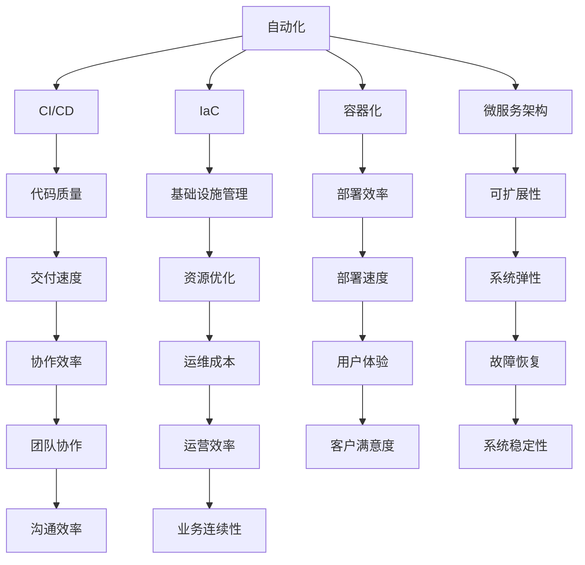

                 

 关键词：DevOps、软件交付、持续集成、持续部署、CI/CD、自动化测试、容器化、微服务、云原生

> 摘要：本文将深入探讨DevOps的核心概念、其在现代软件开发中的应用、构建高效软件交付流程的方法，并通过具体实例展示如何实现持续集成和持续部署。此外，还将分析DevOps面临的前沿挑战和未来发展趋势。

## 1. 背景介绍

随着全球信息化和数字化进程的加速，软件系统在企业和组织中扮演着越来越重要的角色。传统的软件开发模式往往存在交付周期长、成本高、质量难以保证等问题。为了应对这些挑战，DevOps应运而生。DevOps是一种软件开发和运营的集成文化、实践和工具集，旨在通过协同工作来提高软件交付的速度和质量。

### 1.1 DevOps的核心概念

DevOps的核心在于消除开发（Development）和运维（Operations）之间的障碍，实现高效的沟通、协作和整合。DevOps强调以下关键概念：

- **自动化**：通过自动化工具来简化重复性任务，提高效率。
- **持续集成/持续部署（CI/CD）**：频繁地将代码集成和部署到生产环境，确保代码质量。
- **基础设施即代码（Infrastructure as Code, IaC）**：将基础设施的管理代码化，使其可重复和可自动化。
- **容器化**：通过容器技术（如Docker）实现应用程序的轻量级、独立和可移植部署。
- **微服务架构**：将大型应用程序分解为小的、独立的、可复用的服务模块。

### 1.2 DevOps与传统IT的区别

传统IT（ITIL）注重文档和流程，而DevOps则强调快速迭代和快速响应。传统IT的运维团队和开发团队往往是分离的，而DevOps倡导跨职能团队的合作。传统IT依赖于人工操作，而DevOps依赖于自动化和持续交付。

## 2. 核心概念与联系

### 2.1 核心概念原理

为了更好地理解DevOps的核心概念，我们使用Mermaid流程图来展示其架构和流程。



### 2.2 DevOps架构


如上所示，DevOps架构包含了从开发到运营的各个环节，涵盖了自动化、持续集成、持续部署、基础设施即代码、容器化、微服务架构等核心概念。

## 3. 核心算法原理 & 具体操作步骤

### 3.1 算法原理概述

DevOps的核心算法原理包括以下几个方面：

1. **自动化**：使用脚本和工具来自动执行重复性任务，如构建、测试、部署等。
2. **持续集成（CI）**：将代码合并到主干前进行自动化测试，确保代码质量。
3. **持续部署（CD）**：通过自动化流水线将经过测试的代码部署到生产环境。

### 3.2 算法步骤详解

1. **环境搭建**：准备开发、测试和生产环境。
2. **代码仓库**：选择合适的代码管理工具（如Git）。
3. **自动化脚本**：编写用于构建、测试和部署的脚本。
4. **持续集成**：配置CI工具（如Jenkins）来自动构建和测试代码。
5. **持续部署**：配置CD工具（如Docker和Kubernetes）来自动部署代码。

### 3.3 算法优缺点

**优点**：

- 提高交付速度和质量。
- 降低运维成本和人力投入。
- 提高团队协作效率。

**缺点**：

- 初始配置和搭建需要一定时间和资源。
- 可能对现有流程和团队文化造成冲击。

### 3.4 算法应用领域

DevOps适用于各种类型的项目，尤其适合以下领域：

- Web应用程序
- 移动应用程序
- 大数据分析
- 人工智能和机器学习

## 4. 数学模型和公式 & 详细讲解 & 举例说明

### 4.1 数学模型构建

在DevOps中，可以使用一些数学模型来评估交付效率和质量。以下是一个简单的数学模型：

\[ \text{交付效率} = \frac{\text{交付次数}}{\text{交付周期}} \]

\[ \text{质量指标} = \frac{\text{通过测试的构建次数}}{\text{总构建次数}} \]

### 4.2 公式推导过程

\[ \text{交付效率} \]

- 交付次数：在一定周期内完成的交付次数。
- 交付周期：每次交付所需的时间。

\[ \text{质量指标} \]

- 通过测试的构建次数：在测试阶段成功通过的构建次数。
- 总构建次数：在测试阶段进行的所有构建次数。

### 4.3 案例分析与讲解

假设一个团队在一个月内完成了10次交付，每次交付周期平均为2天。同时，在测试阶段，有8次构建成功通过了测试，总共有10次构建。

\[ \text{交付效率} = \frac{10}{2} = 5 \]

\[ \text{质量指标} = \frac{8}{10} = 0.8 \]

这个案例表明，该团队在一个月内平均每天可以完成2.5次交付，而且有80%的构建成功通过了测试。

## 5. 项目实践：代码实例和详细解释说明

### 5.1 开发环境搭建

为了演示DevOps的实践，我们将使用一个简单的Web应用程序作为示例。首先，我们需要搭建开发环境，包括安装Git、Jenkins、Docker和Kubernetes。

```bash
# 安装Git
sudo apt-get update
sudo apt-get install git

# 安装Jenkins
sudo apt-get install jenkins

# 安装Docker
sudo apt-get install docker.io

# 安装Kubernetes
sudo apt-get install kubectl
```

### 5.2 源代码详细实现

我们使用Spring Boot框架来开发一个简单的RESTful API。源代码如下：

```java
import org.springframework.web.bind.annotation.GetMapping;
import org.springframework.web.bind.annotation.RestController;

@RestController
public class HelloController {

    @GetMapping("/hello")
    public String sayHello() {
        return "Hello, World!";
    }
}
```

### 5.3 代码解读与分析

上述代码定义了一个简单的RESTful API，其功能是响应 `/hello` 路径并返回 "Hello, World!" 字符串。

### 5.4 运行结果展示

通过Jenkins配置CI/CD流水线，我们可以在每次代码提交后自动构建、测试和部署应用程序。以下是Jenkins的配置示例：

```yaml
pipeline {
    agent any
    stages {
        stage('Build') {
            steps {
                script {
                    docker.build('myapp')
                }
            }
        }
        stage('Test') {
            steps {
                script {
                    docker.run('myapp')
                }
            }
        }
        stage('Deploy') {
            steps {
                script {
                    kubectl.apply("myapp.yml")
                }
            }
        }
    }
}
```

通过这个配置，Jenkins将在代码提交后自动执行构建、测试和部署步骤，从而实现自动化交付。

## 6. 实际应用场景

### 6.1 金融领域

在金融领域，DevOps被广泛应用于高频交易系统、风险管理系统和客户服务系统等。通过DevOps，金融机构可以快速迭代和部署交易算法和风险管理模型，提高决策效率和准确性。

### 6.2 物流领域

在物流领域，DevOps可以帮助物流公司优化物流流程、实时监控运输状况、快速响应突发事件等。通过DevOps，物流公司可以实现物流信息的实时更新和高效处理。

### 6.3 医疗保健领域

在医疗保健领域，DevOps可以帮助医疗机构建设智能医疗系统、电子病历系统和远程医疗系统等。通过DevOps，医疗机构可以提高医疗服务质量、降低医疗成本。

## 7. 工具和资源推荐

### 7.1 学习资源推荐

- 《DevOps Handbook》
- 《Accelerate: The Science of Lean Software and Systems》
- 《The DevOps Handbook: How to Create World-Class Agility, Reliability, and Security in Technology Organizations》

### 7.2 开发工具推荐

- Jenkins：持续集成和持续部署工具。
- Docker：容器化平台。
- Kubernetes：容器编排工具。
- GitLab：代码管理和持续交付平台。

### 7.3 相关论文推荐

- "DevOps and Its Impact on Software Development: A Systematic Review"
- "The Role of DevOps in Software Development: A Multinational Study"
- "DevOps: A Comprehensive Literature Review"

## 8. 总结：未来发展趋势与挑战

### 8.1 研究成果总结

近年来，DevOps在软件开发和运维领域取得了显著成果。通过自动化、持续集成和持续部署等实践，DevOps显著提高了软件交付的速度和质量。此外，容器化、微服务架构和云原生技术的普及也为DevOps的实施提供了有力支持。

### 8.2 未来发展趋势

- 自动化水平的提升：未来DevOps将进一步扩展自动化范围，包括自动化测试、自动化运维等。
- 云原生技术的融合：DevOps将与云原生技术（如Kubernetes、Serverless）紧密结合，实现更高效的资源管理和应用交付。
- 数据驱动决策：通过大数据分析和机器学习，DevOps将更好地支持决策过程，提高软件交付的效率和质量。

### 8.3 面临的挑战

- 文化和组织变革：DevOps的实施需要改变传统IT的文化和组织结构，这可能会面临一定的阻力。
- 技术栈整合：随着技术的发展，如何整合多种工具和平台，实现无缝协同，是一个挑战。

### 8.4 研究展望

未来，DevOps的研究将聚焦于以下几个方面：

- 自动化技术的优化：研究如何更高效地实现自动化，提高交付效率。
- 智能化运维：利用人工智能和机器学习技术，实现智能化的运维管理。
- 跨领域融合：探讨DevOps在金融、医疗、物流等领域的应用，实现跨领域的技术融合。

## 9. 附录：常见问题与解答

### 9.1 Q：什么是DevOps？
A：DevOps是一种软件开发和运营的文化、实践和工具集，旨在通过协同工作来提高软件交付的速度和质量。

### 9.2 Q：DevOps与传统IT有什么区别？
A：传统IT注重文档和流程，而DevOps强调快速迭代和快速响应。传统IT的运维团队和开发团队往往是分离的，而DevOps倡导跨职能团队的合作。

### 9.3 Q：DevOps的关键概念有哪些？
A：DevOps的关键概念包括自动化、持续集成/持续部署（CI/CD）、基础设施即代码（IaC）、容器化和微服务架构。

### 9.4 Q：如何实现持续集成和持续部署？
A：通过使用自动化工具（如Jenkins）和容器技术（如Docker），可以自动构建、测试和部署代码，实现持续集成和持续部署。

### 9.5 Q：DevOps适用于哪些领域？
A：DevOps适用于各种类型的项目，尤其适合Web应用程序、移动应用程序、大数据分析和人工智能等领域。

### 9.6 Q：如何应对DevOps实施中的挑战？
A：通过加强团队协作、优化流程和工具，以及逐步引入DevOps实践，可以应对DevOps实施中的挑战。

### 9.7 Q：未来DevOps的发展趋势是什么？
A：未来DevOps的发展趋势包括自动化水平的提升、云原生技术的融合、数据驱动决策等。

### 9.8 Q：DevOps如何与人工智能结合？
A：DevOps可以通过自动化测试、持续集成和持续部署等技术，支持人工智能模型的开发生命周期管理。

作者：禅与计算机程序设计艺术 / Zen and the Art of Computer Programming
----------------------------------------------------------------

以上是完整的文章内容，按照规定的结构和要求进行了详细的阐述。文章涵盖了DevOps的核心概念、实践方法、应用领域、数学模型以及未来的发展趋势和挑战。希望这篇文章能对读者理解和应用DevOps有所帮助。

