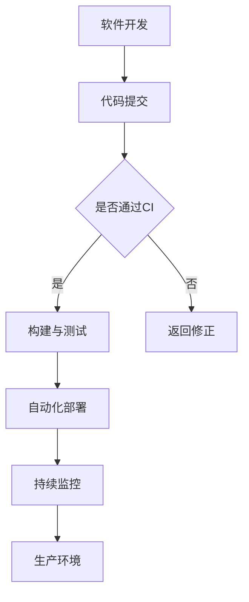

                 

关键词：DevOps、持续交付、持续部署、敏捷开发、CI/CD、自动化测试、容器化、基础设施即代码、微服务、容器编排、Kubernetes、云原生、DevOps 工具、监控和日志管理、安全性和合规性。

## 摘要

本文将深入探讨 DevOps 实践中的持续交付（Continuous Delivery，简称 CD）和持续部署（Continuous Deployment，简称 CD）的概念、原理和实践方法。我们将从 DevOps 的背景介绍开始，逐步解析 CD 和 CD 的核心概念与联系，详细阐述其算法原理和操作步骤，介绍相关的数学模型和公式，并通过实际项目实践来展示其应用效果。最后，我们将展望 DevOps 在未来应用场景中的发展，并推荐相关工具和资源。

## 1. 背景介绍

### DevOps 的起源

DevOps 是一种软件开发和运维的文化、实践和工具的组合，旨在通过加强开发（Development，简称 Dev）和运维（Operations，简称 Ops）之间的沟通、协作和整合，提高软件交付的效率和可靠性。DevOps 的概念起源于 2009 年，由 Patrick Debois 在比利时举办的一次会议上首次提出。他的目的是解决开发与运维之间的隔阂和协作问题。

### DevOps 的核心价值

DevOps 的核心价值在于提高软件交付的速度和可靠性，减少软件发布过程中的风险和错误。通过 DevOps，开发人员可以更快速地响应市场需求，实现敏捷开发；运维人员可以更有效地管理和维护生产环境中的软件系统。

### DevOps 与敏捷开发的关系

DevOps 与敏捷开发（Agile Development）密切相关。敏捷开发强调快速迭代、持续交付和客户反馈，而 DevOps 则通过持续集成（Continuous Integration，简称 CI）、持续交付和持续部署（Continuous Deployment）等实践方法，实现敏捷开发的理念。

## 2. 核心概念与联系

### 核心概念

- **持续集成（CI）**：持续集成是一种软件开发实践，通过自动化构建和测试，确保代码库中的每个提交都是可集成的。CI 可以快速发现代码错误和冲突，提高代码质量。
- **持续交付（CD）**：持续交付是一种确保软件能够在生产环境中成功部署的实践。它包括自动化测试、部署脚本和持续监控，确保每次交付的软件都是可靠和高质量的。
- **持续部署（CD）**：持续部署是持续交付的延伸，它自动化了软件的部署过程，使得每个合格的版本都可以自动部署到生产环境中。

### Mermaid 流程图



### CI/CD 的联系

持续集成和持续交付是 DevOps 实践的核心，它们共同构成了 CI/CD 流程。CI 确保代码库的每个提交都是可集成的，而 CD 则确保这些提交可以成功部署到生产环境中。通过 CI/CD，开发人员可以快速反馈，运维人员可以自动化部署，从而实现快速、可靠和高效的软件交付。

## 3. 核心算法原理 & 具体操作步骤

### 3.1 算法原理概述

持续交付和持续部署的核心在于自动化。通过自动化工具和流程，可以显著提高软件交付的效率和可靠性。核心算法原理包括：

- **自动化构建**：使用构建工具（如 Jenkins、Travis CI）自动化编译、打包和测试代码。
- **自动化部署**：使用部署工具（如 Kubernetes、Docker）自动化部署和更新应用程序。
- **自动化测试**：使用测试工具（如 Selenium、JUnit）自动化执行测试用例。

### 3.2 算法步骤详解

1. **代码提交**：开发人员将代码提交到版本控制系统（如 Git）。
2. **自动化构建**：构建工具检测到代码提交后，自动执行构建过程，包括编译、打包和测试。
3. **自动化测试**：构建过程中，自动化测试工具执行一系列测试用例，确保代码质量。
4. **自动化部署**：测试通过后，部署工具将应用程序部署到测试或生产环境。
5. **持续监控**：部署后，监控系统实时监控应用程序的性能和健康状况。

### 3.3 算法优缺点

**优点**：

- **提高效率**：自动化流程显著减少了手动操作，提高了开发人员和运维人员的效率。
- **降低风险**：自动化测试和部署可以及时发现并修复问题，降低了软件发布过程中的风险。
- **增强可靠性**：通过持续集成和交付，确保每次交付的软件都是高质量的。

**缺点**：

- **初始成本**：引入自动化流程需要时间和资源，可能需要购买和配置相关工具。
- **维护成本**：自动化流程需要定期维护和更新，以适应新的开发环境和需求。

### 3.4 算法应用领域

持续交付和持续部署适用于各种类型的软件项目，尤其是那些需要快速迭代和频繁发布的应用程序。常见应用领域包括：

- **Web 应用程序**：如电商平台、社交媒体、在线教育平台。
- **移动应用程序**：如 iOS 和 Android 应用。
- **云计算服务**：如基础设施即服务（IaaS）、平台即服务（PaaS）和软件即服务（SaaS）。

## 4. 数学模型和公式 & 详细讲解 & 举例说明

### 4.1 数学模型构建

在 DevOps 中，常见的数学模型包括构建失败率、部署成功率和响应时间等。以下是一个简单的构建失败率模型：

$$
\text{构建失败率} = \frac{\text{构建失败次数}}{\text{构建总次数}}
$$

### 4.2 公式推导过程

构建失败率可以通过以下步骤推导：

1. **定义构建失败次数**：构建失败次数是指在一段时间内，由于代码错误、环境问题等原因导致构建失败的事件数量。
2. **定义构建总次数**：构建总次数是指在相同时间内，所有构建尝试的总数。
3. **计算构建失败率**：构建失败率等于构建失败次数除以构建总次数。

### 4.3 案例分析与讲解

假设某个项目在一个月内进行了 100 次构建，其中 5 次构建失败。那么，构建失败率可以计算为：

$$
\text{构建失败率} = \frac{5}{100} = 0.05
$$

这意味着在这个项目中，构建失败的概率是 5%。

## 5. 项目实践：代码实例和详细解释说明

### 5.1 开发环境搭建

在开始项目实践之前，我们需要搭建一个开发环境。这里我们使用 Docker 和 Kubernetes 来构建一个简单的 Web 应用程序。

1. **安装 Docker**：在开发机器上安装 Docker，下载并运行以下命令：

   ```shell
   sudo apt-get update
   sudo apt-get install docker.io
   ```

2. **安装 Kubernetes**：安装 Kubernetes 集群，可以使用 Minikube 或 Docker Swarm。这里我们使用 Minikube：

   ```shell
   curl -LO https://storage.googleapis.com/minikube/releases/latest/minikube-linux-amd64
   sudo chmod +x minikube-linux-amd64
   sudo mv minikube-linux-amd64 /usr/local/bin/minikube
   minikube start
   ```

### 5.2 源代码详细实现

我们使用 Node.js 创建一个简单的 Web 应用程序。以下是应用程序的源代码：

```javascript
const express = require('express');
const app = express();

app.get('/', (req, res) => {
  res.send('Hello, DevOps!');
});

const port = process.env.PORT || 3000;
app.listen(port, () => {
  console.log(`Server is running on port ${port}`);
});
```

### 5.3 代码解读与分析

这段代码使用了 Express 框架创建一个简单的 Web 服务器。当访问根路径（/）时，服务器返回 "Hello, DevOps!"。我们使用 Docker 将这个应用程序容器化，并使用 Kubernetes 进行部署。

### 5.4 运行结果展示

1. **创建 Docker 镜像**：

   ```shell
   docker build -t hello-devops .
   ```

2. **部署到 Kubernetes**：

   ```shell
   kubectl create deployment hello-devops --image=hello-devops
   kubectl expose deployment hello-devops --type=LoadBalancer
   ```

3. **访问应用程序**：

   ```shell
   kubectl get svc
   ```

   输出中获取负载均衡器的 IP 地址或域名，并在浏览器中访问。

## 6. 实际应用场景

### 6.1 银行业务系统

在银行业务系统中，DevOps 可以用于快速迭代和发布新的功能，提高客户体验。例如，银行可以使用 CI/CD 流程自动化测试和部署移动应用程序，确保新功能和修复快速上线。

### 6.2 医疗信息系统

医疗信息系统需要处理大量的敏感数据，因此安全性至关重要。DevOps 可以通过自动化测试和部署，确保医疗信息系统的高可用性和安全性。

### 6.3 教育科技平台

教育科技平台需要快速响应学生和教师的需求，DevOps 可以实现敏捷开发和持续交付，提高教学质量和学习体验。

## 7. 工具和资源推荐

### 7.1 学习资源推荐

- 《DevOps Handbook》：由 Jez Humble 和 David Farley 著，是 DevOps 领域的经典著作。
- 《Continuous Delivery》：由 Jez Humble 和 David Farley 著，详细介绍了持续交付的原理和实践。

### 7.2 开发工具推荐

- Jenkins：强大的持续集成和持续交付工具。
- Kubernetes：用于容器编排和管理的开源平台。
- Docker：用于容器化应用程序的开源工具。

### 7.3 相关论文推荐

- "DevOps and the New Norm for IT": 由 Andrew Clay Shaw 和 James W. Lewis 著，探讨了 DevOps 对 IT 的影响。
- "The Phoenix Project": 由 Gene Kim、Kevin Behr 和 George Spafford 著，通过小说形式介绍了 DevOps 的实践。

## 8. 总结：未来发展趋势与挑战

### 8.1 研究成果总结

DevOps 已经成为软件开发和运维领域的标准实践，显著提高了软件交付的效率和可靠性。持续交付和持续部署作为 DevOps 的核心组成部分，也在不断发展和完善。

### 8.2 未来发展趋势

- **自动化**：未来 DevOps 将更加注重自动化，包括自动化测试、部署和监控。
- **云原生**：随着云计算的普及，云原生技术（如 Kubernetes、容器化）将成为 DevOps 的重要组成部分。
- **安全性**：随着软件交付频率的增加，安全性将成为 DevOps 的关键挑战。

### 8.3 面临的挑战

- **工具整合**：DevOps 工具繁多，如何实现有效整合是一个挑战。
- **人员培训**：DevOps 需要开发人员和运维人员具备跨学科的技能，培训是一个挑战。

### 8.4 研究展望

未来 DevOps 将继续向自动化、云原生和安全性方向发展。研究者应关注如何提高 DevOps 的可扩展性和可维护性，以及如何更好地整合新兴技术和工具。

## 9. 附录：常见问题与解答

### 9.1 什么是 DevOps？

DevOps 是一种软件开发和运维的文化、实践和工具的组合，旨在通过加强开发（Development，简称 Dev）和运维（Operations，简称 Ops）之间的沟通、协作和整合，提高软件交付的效率和可靠性。

### 9.2 CI/CD 有什么区别？

CI（持续集成）是一种软件开发实践，通过自动化构建和测试，确保代码库中的每个提交都是可集成的。CD（持续交付/持续部署）是 CI 的延伸，它确保这些提交可以成功部署到生产环境中。

### 9.3 DevOps 是否适用于所有项目？

DevOps 适用于大多数软件项目，尤其是那些需要快速迭代和频繁发布的应用程序。然而，对于一些大型、复杂的项目，可能需要更多的资源和时间来引入 DevOps 实践。

### 9.4 如何选择 DevOps 工具？

选择 DevOps 工具应考虑项目的需求、团队的技能和预算。常见的 DevOps 工具有 Jenkins、Kubernetes、Docker 等。建议通过实际项目和团队需求来选择合适的工具。

作者：禅与计算机程序设计艺术 / Zen and the Art of Computer Programming
-------------------------------------------------------------------

