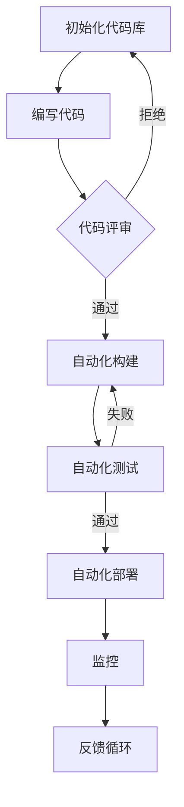

                 

关键词：DevOps、自动化、监控、持续集成、持续部署、基础设施即代码、容器化、自动化测试、日志分析、性能监控、安全性

> 摘要：本文旨在探讨DevOps工程中的自动化和监控技术，分析其在现代软件开发和运维中的重要性，介绍关键概念、算法原理、数学模型、项目实践以及实际应用场景，同时展望未来的发展趋势和面临的挑战。

## 1. 背景介绍

在软件工程的发展历程中，开发（Development）和运维（Operations）长期被视为两个独立的职能。传统上，开发团队负责编写代码、构建软件产品，而运维团队则负责软件的部署、运行和维护。这种分工模式导致了“开发-运维”之间的壁垒，常见问题包括部署延迟、环境不一致、故障响应不及时等，严重影响了软件交付的质量和效率。

DevOps是一种文化、实践和工具集，旨在通过自动化和协作，打破开发与运维之间的障碍，实现快速、可靠、高质量的软件交付。DevOps的核心原则包括持续集成（CI）、持续部署（CD）、基础设施即代码（Infrastructure as Code，IaC）、自动化测试、监控和反馈循环等。通过这些技术，开发团队和运维团队能够实现更紧密的协作，提高开发效率，降低故障风险，提升客户满意度。

本文将围绕自动化和监控这两个核心方面，详细探讨DevOps工程的实际应用和实施方法。

## 2. 核心概念与联系

### 2.1 DevOps核心概念

- **持续集成（CI）**：持续集成是指通过自动化构建和测试，频繁地将代码集成到一个共享的代码库中。CI确保每次代码变更都能快速检测出潜在的问题，从而提高代码质量和项目的稳定性。

- **持续部署（CD）**：持续部署是指通过自动化流程，快速地将代码变更部署到生产环境中。CD使团队能够快速响应市场变化，缩短产品交付周期。

- **基础设施即代码（IaC）**：基础设施即代码将基础设施的配置和管理转化为代码，通过版本控制和自动化工具进行管理。IaC提高了基础设施的可重复性和可移植性。

- **自动化测试**：自动化测试通过编写脚本和工具，自动执行测试用例，以验证软件的功能、性能和安全性。

- **监控**：监控是对系统运行状态、性能和行为的实时观察和记录。通过监控，团队能够及时发现和响应异常情况，确保系统的稳定运行。

### 2.2 DevOps架构与流程

以下是一个典型的DevOps架构和流程图，使用Mermaid绘制：



### 2.3 自动化和监控在DevOps中的作用

- **提高开发效率**：通过自动化，开发团队能够减少重复性任务，专注于高价值的代码编写和优化。

- **确保代码质量**：自动化测试和持续集成确保每次代码变更都能通过严格的测试，减少缺陷和故障。

- **缩短交付周期**：自动化流程和持续集成、部署使团队能够更快地交付功能，提高市场响应速度。

- **提高系统稳定性**：监控和反馈循环帮助团队快速检测和响应异常，确保系统的稳定运行。

- **降低运营成本**：自动化和监控减少了运维人员的工作量，降低了人工干预的需求，降低了运营成本。

## 3. 核心算法原理 & 具体操作步骤

### 3.1 算法原理概述

在DevOps中，核心算法主要涉及自动化构建、自动化测试、持续集成和持续部署。以下是这些算法的基本原理：

- **自动化构建**：通过构建脚本和工具，将源代码转换成可运行的软件包。主要算法包括编译、打包、依赖管理等。

- **自动化测试**：通过编写测试脚本和工具，自动执行测试用例，验证软件的功能、性能和安全性。主要算法包括单元测试、集成测试、性能测试等。

- **持续集成**：通过集成构建和测试，将代码变更快速集成到一个共享代码库中。主要算法包括版本控制、构建脚本、自动化执行等。

- **持续部署**：通过自动化脚本和工具，将经过测试的代码部署到生产环境中。主要算法包括部署脚本、环境配置、自动化执行等。

### 3.2 算法步骤详解

#### 3.2.1 自动化构建

1. **编写构建脚本**：使用脚本语言（如Shell、Python）编写构建脚本，定义编译、打包、依赖管理等任务。
2. **集成构建工具**：使用构建工具（如Maven、Gradle）集成构建脚本，实现自动化构建。
3. **触发构建**：通过CI工具（如Jenkins、GitLab CI）触发构建，自动执行构建脚本。

#### 3.2.2 自动化测试

1. **编写测试脚本**：使用测试框架（如JUnit、Selenium）编写测试脚本，定义测试用例。
2. **集成测试工具**：使用测试工具（如Selenium、JUnit）集成测试脚本，实现自动化测试。
3. **触发测试**：通过CI工具触发测试，自动执行测试脚本。

#### 3.2.3 持续集成

1. **配置CI工具**：配置CI工具（如Jenkins、GitLab CI），定义构建和测试流程。
2. **代码仓库集成**：将代码仓库（如Git）与CI工具集成，触发构建和测试。
3. **构建和测试结果反馈**：将构建和测试结果反馈到代码仓库，实现持续集成。

#### 3.2.4 持续部署

1. **配置CD工具**：配置CD工具（如Docker、Kubernetes），定义部署流程。
2. **部署脚本**：编写部署脚本，定义部署任务。
3. **触发部署**：通过CI/CD工具触发部署，自动执行部署脚本。

### 3.3 算法优缺点

#### 自动化构建

- **优点**：提高构建效率，减少人为错误，确保代码质量。
- **缺点**：构建脚本编写和调试复杂，初期实施成本较高。

#### 自动化测试

- **优点**：提高测试覆盖率，减少手动测试工作量，快速反馈缺陷。
- **缺点**：测试脚本编写和维护成本较高，测试覆盖率难以100%。

#### 持续集成

- **优点**：快速发现代码问题，提高代码质量，缩短交付周期。
- **缺点**：配置和管理CI工具复杂，初期实施成本较高。

#### 持续部署

- **优点**：提高部署效率，确保部署一致性，降低人工干预。
- **缺点**：部署脚本编写和调试复杂，初期实施成本较高。

### 3.4 算法应用领域

- **Web应用开发**：通过自动化构建、测试和部署，提高Web应用的交付质量和效率。
- **移动应用开发**：通过自动化构建、测试和部署，提高移动应用的交付质量和效率。
- **基础设施管理**：通过基础设施即代码，实现自动化部署和管理。
- **大数据处理**：通过自动化构建、测试和部署，提高大数据处理系统的交付质量和效率。

## 4. 数学模型和公式 & 详细讲解 & 举例说明

### 4.1 数学模型构建

在DevOps工程中，数学模型主要用于性能监控和优化。以下是一个简单的性能监控模型：

#### 4.1.1 性能指标

- **响应时间（Response Time）**：系统处理请求的平均时间。
- **吞吐量（Throughput）**：单位时间内系统处理的请求数量。
- **错误率（Error Rate）**：系统处理请求时发生错误的频率。

#### 4.1.2 性能模型

响应时间、吞吐量和错误率之间的关系可以用以下公式表示：

\[ Response\ Time = \frac{1}{Throughput \times (1 - Error\ Rate)} \]

### 4.2 公式推导过程

假设系统在单位时间内处理的请求量为 \( Throughput \)，其中发生错误的请求量为 \( Error\ Rate \times Throughput \)。那么，正确响应的请求量为 \( Throughput - Error\ Rate \times Throughput \)。响应时间可以表示为：

\[ Response\ Time = \frac{Total\ Response\ Time}{Throughput} \]

其中，\( Total\ Response\ Time \) 可以分解为正确响应时间和错误响应时间：

\[ Total\ Response\ Time = (Throughput - Error\ Rate \times Throughput) \times Correct\ Response\ Time + Error\ Rate \times Throughput \times Error\ Response\ Time \]

假设正确响应时间和错误响应时间分别为 \( Correct\ Response\ Time \) 和 \( Error\ Response\ Time \)，且 \( Correct\ Response\ Time = Error\ Response\ Time \)，则有：

\[ Response\ Time = \frac{(Throughput - Error\ Rate \times Throughput) \times Correct\ Response\ Time + Error\ Rate \times Throughput \times Error\ Response\ Time}{Throughput} \]

简化后得到：

\[ Response\ Time = \frac{Throughput \times Correct\ Response\ Time}{Throughput \times (1 - Error\ Rate)} \]

因为 \( Correct\ Response\ Time = Error\ Response\ Time \)，所以 \( Response\ Time = \frac{1}{Throughput \times (1 - Error\ Rate)} \)。

### 4.3 案例分析与讲解

假设一个系统在单位时间内处理的请求量为100个，其中发生错误的频率为5%，即 \( Throughput = 100 \)，\( Error\ Rate = 0.05 \)。根据上述公式，系统的平均响应时间为：

\[ Response\ Time = \frac{1}{Throughput \times (1 - Error\ Rate)} = \frac{1}{100 \times (1 - 0.05)} = 0.01 \text{秒} \]

这意味着系统的平均响应时间为0.01秒。如果系统的错误率增加到10%，即 \( Error\ Rate = 0.1 \)，则系统的平均响应时间为：

\[ Response\ Time = \frac{1}{Throughput \times (1 - Error\ Rate)} = \frac{1}{100 \times (1 - 0.1)} = 0.011 \text{秒} \]

可以看到，随着错误率的增加，系统的平均响应时间显著增加。这表明，通过监控和优化系统的性能指标，可以显著提高系统的响应速度。

## 5. 项目实践：代码实例和详细解释说明

### 5.1 开发环境搭建

在本文中，我们将使用Jenkins作为CI/CD工具，Docker作为容器化技术，Kubernetes作为集群管理工具。以下是开发环境搭建的步骤：

1. **安装Jenkins**：在服务器上安装Jenkins，配置Jenkins的插件和集成工具。
2. **安装Docker**：在服务器上安装Docker，配置Docker Engine和Docker Compose。
3. **安装Kubernetes**：在服务器上安装Kubernetes集群，配置Kubernetes Engine和Kubernetes API。

### 5.2 源代码详细实现

以下是一个简单的Web应用项目，使用Spring Boot和Docker进行开发。项目的结构如下：

```
my-app/
|-- src/
|   |-- main/
|   |   |-- java/
|   |   |   |-- com/
|   |   |   |   |-- example/
|   |   |   |   |   |-- MyApplication.java
|   |   |-- resources/
|   |   |   |-- application.properties
|-- Dockerfile
|-- pom.xml
```

**Dockerfile**：

```Dockerfile
FROM openjdk:8-jdk-alpine
ARG JAR_FILE=target/*.jar
COPY ${JAR_FILE} app.jar
ENTRYPOINT ["java","-Djava.security.egd=file:/dev/./urandom","-jar","/app.jar"]
```

**pom.xml**：

```xml
<project xmlns="http://maven.apache.org/POM/4.0.0" ...
<dependencies>
    <dependency>
        <groupId>org.springframework.boot</groupId>
        <artifactId>spring-boot-starter-web</artifactId>
    </dependency>
</dependencies>
<build>
    <plugins>
        <plugin>
            <groupId>org.springframework.boot</groupId>
            <artifactId>spring-boot-maven-plugin</artifactId>
        </plugin>
    </plugins>
</build>
```

**MyApplication.java**：

```java
package com.example;

import org.springframework.boot.SpringApplication;
import org.springframework.boot.autoconfigure.SpringBootApplication;

@SpringBootApplication
public class MyApplication {
    public static void main(String[] args) {
        SpringApplication.run(MyApplication.class, args);
    }
}
```

### 5.3 代码解读与分析

**Dockerfile**：Dockerfile用于构建Docker镜像。在这里，我们使用OpenJDK 8 Alpine作为基础镜像，将生成的Spring Boot应用打包成jar文件，并设置ENTRYPOINT启动应用。

**pom.xml**：pom.xml是Maven的配置文件，用于管理项目的依赖和构建插件。在这里，我们添加了Spring Boot Web Starter依赖，并配置了Spring Boot Maven插件，用于打包应用。

**MyApplication.java**：MyApplication是Spring Boot应用的入口类。通过 SpringApplication.run() 方法启动应用。

### 5.4 运行结果展示

通过以下命令，我们可以构建Docker镜像和容器：

```shell
docker build -t my-app .
docker run -d --name my-app-container my-app
```

运行结果如下：

```shell
$ docker ps
CONTAINER ID   IMAGE          NAMES
4e465a28d5c0   my-app         my-app-container
```

可以看到，我们的Spring Boot应用已经成功运行在Docker容器中。

## 6. 实际应用场景

### 6.1 Web应用部署

在一个Web应用项目中，自动化和监控技术的应用场景包括：

- **持续集成**：通过Jenkins等CI工具，将开发者的代码集成到一个共享代码库中，实现快速迭代和测试。
- **持续部署**：通过Docker和Kubernetes，将经过测试的代码部署到生产环境中，实现自动化部署和一致性保障。
- **监控**：通过Prometheus和Grafana，实时监控Web应用的健康状态、性能指标和日志，实现故障快速发现和响应。

### 6.2 基础设施管理

在基础设施管理中，自动化和监控技术的应用场景包括：

- **基础设施即代码**：使用Terraform或Ansible等工具，将基础设施的配置和管理转化为代码，实现自动化部署和管理。
- **自动化测试**：通过编写脚本和工具，自动化测试基础设施的配置和性能，确保基础设施的稳定性和可靠性。
- **监控**：通过Zabbix或Nagios等工具，实时监控基础设施的运行状态、性能指标和资源利用率，实现故障快速发现和响应。

### 6.3 大数据处理

在大数据处理项目中，自动化和监控技术的应用场景包括：

- **自动化构建**：通过Maven或Gradle等工具，自动化构建大数据处理应用的依赖和代码。
- **自动化测试**：通过JUnit或TestNG等框架，自动化测试大数据处理应用的功能和性能。
- **持续集成**：通过Jenkins或GitLab CI等工具，实现大数据处理应用的持续集成和持续部署。
- **监控**：通过Kibana或Grafana等工具，实时监控大数据处理应用的性能指标、日志和资源利用率，实现故障快速发现和响应。

## 7. 工具和资源推荐

### 7.1 学习资源推荐

- **书籍**：
  - 《DevOps：从理论到实践》
  - 《持续交付：释放软件交付的潜力》
  - 《Jenkins实战》
- **在线课程**：
  - Coursera：DevOps Engineering with Jenkins
  - Udemy：DevOps: Docker, Kubernetes, Jenkins & Terraform Bootcamp
- **社区和论坛**：
  - DevOps.com
  - Jenkins社区
  - Docker社区

### 7.2 开发工具推荐

- **CI/CD工具**：Jenkins、GitLab CI、CircleCI
- **容器化技术**：Docker、Kubernetes
- **基础设施即代码**：Terraform、Ansible
- **监控工具**：Prometheus、Grafana、Zabbix、Nagios

### 7.3 相关论文推荐

- **"The Phoenix Project: A Novel About IT, DevOps, and Helping Your Business Win" by Gene Kim, Kevin Behr, and George Spafford**
- **"Accelerate: The Science of Lean Software and Systems" by Nicole Forsgren, Jez Humble, and Gene Kim**
- **"The Practice of Cloud System Administration: Designing and Implementing Cloud Infrastructure" by Thomas A. Limoncelli, Christopher A. Negus, and William R. Deegan**

## 8. 总结：未来发展趋势与挑战

### 8.1 研究成果总结

本文探讨了DevOps工程中的自动化和监控技术，分析了其在现代软件开发和运维中的重要性。通过核心概念和算法原理的介绍，以及实际应用场景的案例解析，展示了自动化和监控技术在提高开发效率、确保代码质量、缩短交付周期、提高系统稳定性和降低运营成本方面的作用。

### 8.2 未来发展趋势

1. **人工智能与DevOps的融合**：随着人工智能技术的发展，未来自动化和监控将更加智能化，利用机器学习和数据挖掘技术，实现更精准的性能预测和故障检测。
2. **分布式和边缘计算**：随着云计算和物联网的普及，分布式系统和边缘计算将在DevOps中发挥重要作用，实现更高效的资源利用和更灵活的架构设计。
3. **安全性与合规性**：随着安全威胁的增加和法规合规的要求，DevOps中的安全性和合规性将得到更多关注，自动化和监控技术将在安全防护和合规审计中发挥关键作用。

### 8.3 面临的挑战

1. **复杂性和可维护性**：随着自动化和监控工具的多样化和复杂化，如何确保系统的可维护性和可扩展性成为一大挑战。
2. **跨领域协作**：DevOps涉及多个领域，包括开发、运维、安全等，如何实现跨领域的有效协作和沟通，提高团队的协同效率是关键问题。
3. **技能和人才培养**：DevOps要求团队具备多方面的技能，包括编程、自动化、监控、安全等，如何培养和保留高素质的DevOps人才是当前面临的一大挑战。

### 8.4 研究展望

未来研究应重点关注以下几个方面：

1. **智能化自动化**：探索如何利用人工智能技术，提高自动化工具的智能化水平，实现更高效、更精准的自动化操作。
2. **跨领域协同**：研究如何通过新的协作模式和技术手段，实现不同领域团队之间的有效沟通和协作，提高团队的整体效率。
3. **安全与合规**：探索如何在自动化和监控过程中，确保系统的安全性和合规性，为企业的持续发展提供可靠保障。

## 9. 附录：常见问题与解答

### 9.1 什么是DevOps？

DevOps是一种文化和实践，旨在通过自动化、协作和紧密协作，打破开发和运维之间的障碍，实现更快速、更可靠、更高质量的软件交付。

### 9.2 什么是持续集成和持续部署？

持续集成（CI）是指通过自动化构建和测试，频繁地将代码集成到一个共享的代码库中。持续部署（CD）是指通过自动化流程，快速地将代码变更部署到生产环境中。

### 9.3 什么是基础设施即代码？

基础设施即代码（IaC）是指将基础设施的配置和管理转化为代码，通过版本控制和自动化工具进行管理，提高基础设施的可重复性和可移植性。

### 9.4 自动化测试有哪些类型？

自动化测试包括单元测试、集成测试、性能测试、安全性测试等，旨在验证软件的功能、性能和安全性。

### 9.5 如何选择合适的CI/CD工具？

选择CI/CD工具时，应考虑团队规模、项目需求、工具生态、社区支持和培训资源等因素。常见的CI/CD工具包括Jenkins、GitLab CI、CircleCI等。

### 9.6 如何确保自动化测试的覆盖率？

通过编写全面的测试用例，使用测试框架和工具自动化执行测试，以及定期审查和更新测试用例，可以确保自动化测试的覆盖率。

### 9.7 如何监控系统的性能指标？

通过使用监控工具（如Prometheus、Grafana、Zabbix、Nagios）和日志分析工具（如ELK Stack、Grok），可以实时监控系统的性能指标和日志。

### 9.8 如何实现基础设施的自动化部署？

使用基础设施即代码工具（如Terraform、Ansible）编写基础设施配置代码，通过自动化脚本和CI/CD工具实现基础设施的自动化部署和管理。

## 参考文献

- Kim, G., Behr, K., & Spafford, G. (2013). The Phoenix Project: A Novel About IT, DevOps, and Helping Your Business Win.
- Forsgren, N., Humble, J., & Kim, G. (2018). Accelerate: The Science of Lean Software and Systems.
- Limoncelli, T. A., Negus, C. A., & Deegan, W. R. (2017). The Practice of Cloud System Administration: Designing and Implementing Cloud Infrastructure.
- Jenkins CI documentation. (n.d.). Retrieved from https://www.jenkins.io/doc/
- Docker documentation. (n.d.). Retrieved from https://docs.docker.com/
- Kubernetes documentation. (n.d.). Retrieved from https://kubernetes.io/docs/
- Terraform documentation. (n.d.). Retrieved from https://www.terraform.io/docs/
- Ansible documentation. (n.d.). Retrieved from https://docs.ansible.com/
- Prometheus documentation. (n.d.). Retrieved from https://prometheus.io/docs/
- Grafana documentation. (n.d.). Retrieved from https://grafana.com/docs/
- Zabbix documentation. (n.d.). Retrieved from https://www.zabbix.com/documentation/
- Nagios documentation. (n.d.). Retrieved from https://www.nagios.org/docs/

