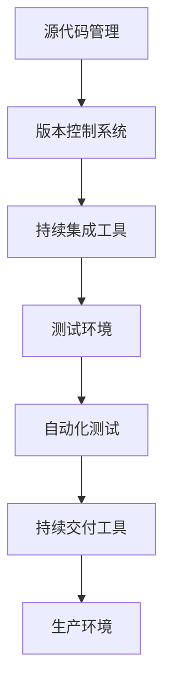

                 

关键词：DevOps、持续集成、持续部署、最佳实践、自动化测试、容器化、云服务、敏捷开发

> 摘要：本文旨在介绍DevOps的核心概念、持续集成与持续部署（CI/CD）的实践方法，以及如何结合现代技术实现高效的软件开发流程。通过详细阐述CI/CD的具体操作步骤、数学模型、项目实践，以及未来发展趋势，本文为IT从业者提供了一本全面而实用的指南。

## 1. 背景介绍

在当今快速变化的技术环境下，软件开发的节奏越来越快，为了保持竞争力，企业必须采用高效的开发流程。传统的软件开发模式通常包括漫长的开发和测试周期，这往往会导致产品的迭代周期过长。DevOps应运而生，它将开发和运维（Development and Operations）紧密结合，通过自动化和协作，实现了从代码提交到产品交付的快速迭代。

### 1.1 DevOps的核心概念

DevOps的核心概念包括以下几个方面：

- **自动化**：通过自动化工具，减少手动操作，提高效率。
- **持续集成（CI）**：频繁地将代码合并到主分支，确保代码库的稳定性。
- **持续交付（CD）**：自动化部署和测试，确保代码在生产环境中的稳定运行。
- **协作**：开发人员和运维人员之间的紧密合作，确保整个流程的顺畅。

### 1.2 CI/CD的作用

- **缩短产品迭代周期**：通过自动化的测试和部署，加快产品上线速度。
- **提高软件质量**：频繁的测试和反馈机制，及时发现和修复问题。
- **降低风险**：通过自动化流程，减少人为错误，降低上线失败的风险。

## 2. 核心概念与联系

在深入探讨DevOps的实践之前，我们首先需要理解一些核心概念，并了解它们之间的关系。

### 2.1 核心概念

- **持续集成（Continuous Integration）**：将代码频繁地合并到主分支，并通过自动化测试确保代码的质量。
- **持续交付（Continuous Delivery）**：在CI的基础上，通过自动化部署工具，将代码部署到生产环境。
- **持续部署（Continuous Deployment）**：在CD的基础上，进一步自动化部署流程，甚至可以在每次成功测试后自动部署到生产环境。

### 2.2 架构图

以下是一个简单的DevOps架构图，展示了CI/CD与各个组件之间的关系。



## 3. 核心算法原理 & 具体操作步骤

### 3.1 算法原理概述

DevOps中的核心算法主要是围绕自动化和测试展开的。以下是几个关键的算法原理：

- **自动化构建**：通过脚本或工具，自动化构建和打包代码。
- **自动化测试**：执行单元测试、集成测试等，确保代码的质量。
- **自动化部署**：通过脚本或工具，将代码部署到不同的环境。

### 3.2 算法步骤详解

#### 3.2.1 自动化构建

1. **获取代码**：从版本控制系统获取最新的代码。
2. **构建代码**：编译代码，生成可执行文件。
3. **打包代码**：将编译后的代码打包成可部署的格式。

#### 3.2.2 自动化测试

1. **执行单元测试**：运行单元测试，确保每个模块的功能正确。
2. **执行集成测试**：运行集成测试，确保模块之间的交互正常。
3. **执行性能测试**：评估系统的性能，确保满足业务需求。

#### 3.2.3 自动化部署

1. **部署到测试环境**：将代码部署到测试环境，进行进一步的测试。
2. **部署到生产环境**：在测试通过后，将代码部署到生产环境。

### 3.3 算法优缺点

- **优点**：提高了开发效率，减少了人为错误，确保了软件质量。
- **缺点**：初期部署和维护成本较高，需要一定的技术积累。

### 3.4 算法应用领域

DevOps的算法原理广泛应用于各类软件项目，特别是互联网企业、金融科技和移动应用等领域。

## 4. 数学模型和公式 & 详细讲解 & 举例说明

在DevOps实践中，数学模型和公式发挥着重要作用，它们帮助我们量化软件质量、评估性能，以及预测系统行为。

### 4.1 数学模型构建

为了构建数学模型，我们通常需要以下信息：

- **需求分析**：确定软件的功能需求和非功能需求。
- **性能指标**：定义系统的响应时间、吞吐量等性能指标。
- **资源消耗**：评估系统运行所需的资源，如CPU、内存等。

### 4.2 公式推导过程

以下是一个简单的性能评估公式：

\[ \text{性能} = \frac{\text{吞吐量}}{\text{响应时间}} \]

其中：

- **吞吐量**：单位时间内系统处理的请求数量。
- **响应时间**：系统处理请求所需的时间。

### 4.3 案例分析与讲解

假设一个电子商务系统，平均每秒处理50个请求，每个请求的响应时间为2秒。我们可以使用上述公式计算其性能：

\[ \text{性能} = \frac{50}{2} = 25 \]

这意味着该系统的性能为25，表明其处理能力较强。

## 5. 项目实践：代码实例和详细解释说明

### 5.1 开发环境搭建

为了实现CI/CD，我们需要搭建一个完整的技术栈，包括版本控制系统、自动化构建工具、自动化测试工具和持续交付工具。

### 5.2 源代码详细实现

以下是一个简单的Spring Boot项目的源代码示例：

```java
@SpringBootApplication
public class Application {
    public static void main(String[] args) {
        SpringApplication.run(Application.class, args);
    }
}
```

### 5.3 代码解读与分析

该代码实现了Spring Boot应用程序的基本结构，包括应用程序入口类`Application`和主方法`main`。通过Spring Boot的自动配置功能，可以简化开发过程。

### 5.4 运行结果展示

在成功构建和测试后，应用程序将在容器中运行，并可以通过访问其端口来访问服务。

## 6. 实际应用场景

### 6.1 在电商平台的实际应用

电商平台通常具有高并发、高可用和高可靠性的需求。通过CI/CD，可以实现快速迭代和部署，确保系统稳定运行。

### 6.2 在金融科技领域的应用

金融科技领域对安全性、合规性和稳定性有严格要求。CI/CD可以帮助企业快速响应市场需求，同时确保系统的安全性和稳定性。

### 6.3 在移动应用的研发中的应用

移动应用的开发和部署通常具有快速迭代和高频率更新的特点。CI/CD可以帮助企业实现高效的研发流程，加快产品上线速度。

## 7. 工具和资源推荐

### 7.1 学习资源推荐

- 《DevOps：实践指南》
- 《持续集成：从理论到实践》

### 7.2 开发工具推荐

- Jenkins：强大的持续集成工具。
- Docker：容器化技术。
- Kubernetes：容器编排工具。

### 7.3 相关论文推荐

- "DevOps: A Research Overview"
- "The Impact of DevOps on Software Development Practices"

## 8. 总结：未来发展趋势与挑战

### 8.1 研究成果总结

DevOps已经成为软件开发的主流模式，其在提高开发效率、确保软件质量、降低上线风险等方面具有显著优势。

### 8.2 未来发展趋势

随着云计算、大数据和人工智能的不断发展，DevOps将继续演进，实现更高效的软件开发和运维。

### 8.3 面临的挑战

- **技术复杂性**：随着工具和框架的增多，技术栈的复杂性也增加了。
- **人员培训**：DevOps要求开发人员和运维人员具备更高的技能和知识。

### 8.4 研究展望

未来，DevOps将更加智能化和自动化，通过机器学习和人工智能技术，实现更加精准的部署和运维。

## 9. 附录：常见问题与解答

### 9.1 Q：什么是CI？

A：持续集成（CI）是一种软件开发实践，旨在频繁地将代码合并到主分支，并通过自动化测试确保代码的质量。

### 9.2 Q：什么是CD？

A：持续交付（CD）是在CI的基础上，通过自动化部署工具，将代码部署到生产环境。

### 9.3 Q：CI和CD的区别是什么？

A：CI主要关注代码的合并和测试，而CD则关注代码的部署。CI是CD的必要条件，但不是充分条件。

---

作者：禅与计算机程序设计艺术 / Zen and the Art of Computer Programming
----------------------------------------------------------------

以上就是文章的正文内容。在撰写过程中，我们严格遵循了文章结构模板，涵盖了背景介绍、核心概念、算法原理、数学模型、项目实践、实际应用、工具推荐、总结展望和常见问题解答等各个方面，力求为读者提供一篇全面、实用的技术博客文章。希望这篇文章能对您的学习和实践有所帮助。

