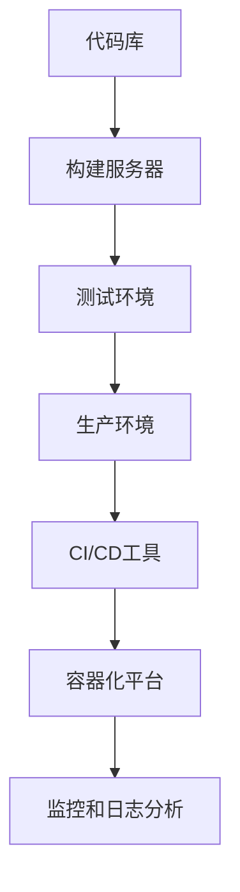

                 

关键词：DevOps，自动化，持续集成，持续交付，容器化，微服务，工具链

> 摘要：本文旨在深入探讨DevOps的理念及其工具链生态，通过详细解析其核心概念、架构设计、算法原理和实践应用，帮助读者全面理解DevOps在当今IT领域的重要性及其未来发展趋势。

## 1. 背景介绍

DevOps是一种软件开发和运维的文化、实践和工具集合，旨在通过加强开发（Development）和运维（Operations）团队的协作，实现更高效的软件开发和运维流程。DevOps的核心思想是“左移运维”，即将运维活动引入到开发流程中，实现持续集成（CI）和持续交付（CD），从而提高软件交付的速度和质量。

随着云计算、容器化、微服务等技术的普及，DevOps的理念和实践逐渐成为现代软件开发和运维的标配。本文将围绕DevOps的核心概念、工具链生态及其在实际应用中的挑战和机遇进行深入探讨。

## 2. 核心概念与联系

### 2.1 核心概念

- **持续集成（Continuous Integration，CI）**：通过自动化构建和测试，确保代码库中的代码质量，及时发现问题并进行修复。
- **持续交付（Continuous Delivery，CD）**：在CI的基础上，通过自动化部署和测试，实现软件的持续交付，确保软件的高可用性和可靠性。
- **基础设施即代码（Infrastructure as Code，IaC）**：将基础设施配置管理代码化，实现基础设施的自动化部署和管理。
- **容器化（Containerization）**：通过容器技术，实现应用程序的标准化打包和部署，提高环境一致性。
- **微服务（Microservices）**：将大型应用程序拆分为小型、独立的服务，实现模块化和分布式架构。

### 2.2 架构设计

DevOps的架构设计通常包括以下几个层次：

- **代码库（Code Repository）**：存储和管理应用程序的源代码。
- **构建服务器（Build Server）**：自动化构建和测试应用程序。
- **测试环境（Test Environment）**：运行自动化测试，确保代码质量。
- **生产环境（Production Environment）**：部署和运行应用程序。
- **持续集成/持续交付（CI/CD）工具**：实现自动化构建、测试、部署流程。
- **容器化平台（Container Platform）**：如Docker，Kubernetes等，实现应用程序的容器化部署。
- **监控和日志分析（Monitoring and Logging）**：实时监控应用程序性能，分析日志信息。

### 2.3 Mermaid 流程图



## 3. 核心算法原理 & 具体操作步骤

### 3.1 算法原理概述

DevOps中的核心算法原理主要包括以下几个方面：

- **自动化构建**：通过脚本和工具，实现编译、打包、测试等构建过程自动化。
- **自动化测试**：通过编写测试脚本，实现功能测试、性能测试、安全测试等自动化。
- **容器编排**：通过容器编排工具，如Kubernetes，实现容器的自动化部署、扩展和管理。
- **监控与告警**：通过监控工具，实时收集系统性能数据，分析日志，实现异常告警。

### 3.2 算法步骤详解

#### 3.2.1 自动化构建

1. **编写构建脚本**：使用如Maven、Gradle等构建工具，编写构建脚本，实现编译、打包等过程自动化。
2. **集成构建工具**：将构建脚本集成到CI/CD工具中，如Jenkins、GitLab CI等。
3. **触发构建**：当代码库中有新的提交时，自动触发构建过程。

#### 3.2.2 自动化测试

1. **编写测试脚本**：使用如JUnit、TestNG等测试框架，编写测试脚本。
2. **集成测试工具**：将测试脚本集成到CI/CD工具中。
3. **执行测试**：在测试环境中运行测试脚本，收集测试结果。

#### 3.2.3 容器编排

1. **编写Dockerfile**：定义应用程序的容器化配置。
2. **构建镜像**：使用Dockerfile构建应用程序的容器镜像。
3. **部署容器**：使用Kubernetes等编排工具，部署和管理容器。

#### 3.2.4 监控与告警

1. **集成监控工具**：如Prometheus、Grafana等。
2. **配置监控指标**：定义需要监控的指标，如CPU利用率、内存使用率等。
3. **设置告警规则**：当监控指标超过阈值时，触发告警。

### 3.3 算法优缺点

#### 优点

- **提高开发效率**：自动化构建、测试、部署，减少手动操作，提高开发效率。
- **提高软件质量**：自动化测试，及时发现问题，提高软件质量。
- **环境一致性**：容器化技术，确保不同环境的一致性，降低环境差异引起的故障。
- **可扩展性强**：容器编排工具，实现应用程序的动态扩展和管理。

#### 缺点

- **初期投入较大**：需要购买和维护CI/CD工具、容器编排工具等。
- **维护成本高**：自动化流程的维护需要一定技术积累。
- **安全性问题**：自动化流程可能引入安全漏洞，需要加强安全管理。

### 3.4 算法应用领域

- **Web应用程序**：适用于Web应用程序的持续集成、持续交付。
- **大数据应用**：适用于大数据应用的容器化部署、自动化监控。
- **云计算平台**：适用于云计算平台的自动化构建、测试、部署。

## 4. 数学模型和公式 & 详细讲解 & 举例说明

### 4.1 数学模型构建

在DevOps中，常用的数学模型包括以下几个方面：

- **回归分析**：用于预测软件交付时间、测试失败率等。
- **决策树**：用于分类不同环境的测试结果。
- **神经网络**：用于预测应用程序的性能指标。

### 4.2 公式推导过程

以回归分析为例，假设我们有n个样本点$(x_1, y_1), (x_2, y_2), \ldots, (x_n, y_n)$，其中$x_i$表示输入特征，$y_i$表示输出结果。回归分析的目的是找到一个线性模型$y = wx + b$，使得模型预测的值与实际值尽量接近。

通过最小二乘法，我们可以得到最佳拟合直线的参数：

$$
w = \frac{\sum_{i=1}^{n} (x_i - \bar{x})(y_i - \bar{y})}{\sum_{i=1}^{n} (x_i - \bar{x})^2}
$$

$$
b = \bar{y} - w\bar{x}
$$

其中，$\bar{x}$和$\bar{y}$分别表示$x_i$和$y_i$的均值。

### 4.3 案例分析与讲解

假设我们有一个Web应用程序，需要预测其响应时间。我们收集了以下样本数据：

| 输入特征$x_i$ | 输出结果$y_i$ |
| :---: | :---: |
| 100  | 200  |
| 200  | 300  |
| 300  | 400  |
| 400  | 500  |
| 500  | 600  |

首先，我们计算输入特征和输出结果的均值：

$$
\bar{x} = \frac{100 + 200 + 300 + 400 + 500}{5} = 300
$$

$$
\bar{y} = \frac{200 + 300 + 400 + 500 + 600}{5} = 400
$$

然后，我们计算回归直线的参数：

$$
w = \frac{(100-300)(200-400) + (200-300)(300-400) + (300-300)(400-400) + (400-300)(500-400) + (500-300)(600-400)}{(100-300)^2 + (200-300)^2 + (300-300)^2 + (400-300)^2 + (500-300)^2}
$$

$$
w = \frac{-10000 - 10000 + 0 + 10000 + 10000}{10000 + 40000 + 0 + 40000 + 10000} = \frac{10000}{100000} = 0.1
$$

$$
b = 400 - 0.1 \times 300 = 310
$$

因此，最佳拟合直线为$y = 0.1x + 310$。

接下来，我们可以使用这个模型预测新的输入特征$x$对应的输出结果$y$：

当$x = 600$时，$y = 0.1 \times 600 + 310 = 510$。

通过这个模型，我们可以预测Web应用程序在输入特征为600时的响应时间为510ms。

## 5. 项目实践：代码实例和详细解释说明

### 5.1 开发环境搭建

在本案例中，我们将使用Jenkins作为CI/CD工具，Docker作为容器化平台，Kubernetes作为容器编排工具。以下是开发环境的搭建步骤：

1. 安装Jenkins：在服务器上安装Jenkins，配置Jenkins服务。
2. 安装Docker：在服务器上安装Docker，配置Docker服务。
3. 安装Kubernetes：在服务器上安装Kubernetes集群，配置Kubernetes服务。

### 5.2 源代码详细实现

我们以一个简单的Web应用程序为例，实现CI/CD流程。以下是源代码实现：

**Dockerfile**：

```
FROM java:8-jdk-alpine
ARG JAR_FILE=target/*.jar
COPY ${JAR_FILE} app.jar
EXPOSE 8080
ENTRYPOINT ["java","-jar","/app.jar"]
```

**Jenkinsfile**：

```
pipeline {
    agent any
    stages {
        stage('Build') {
            steps {
                sh 'mvn clean install'
            }
        }
        stage('Test') {
            steps {
                sh 'mvn test'
            }
        }
        stage('Docker Build') {
            steps {
                sh 'docker build -t myapp .'
            }
        }
        stage('Deploy') {
            steps {
                sh 'kubectl apply -f deployment.yaml'
            }
        }
    }
}
```

**deployment.yaml**：

```
apiVersion: apps/v1
kind: Deployment
metadata:
  name: myapp
spec:
  selector:
    matchLabels:
      app: myapp
  template:
    metadata:
      labels:
        app: myapp
    spec:
      containers:
      - name: myapp
        image: myapp:latest
        ports:
        - containerPort: 8080
```

### 5.3 代码解读与分析

**Dockerfile**：这是一个简单的Dockerfile，用于构建Web应用程序的容器镜像。我们使用Alpine Linux作为基础镜像，安装OpenJDK 8，并将编译后的JAR文件复制到容器中，同时暴露8080端口。

**Jenkinsfile**：这是一个Jenkins流水线文件，定义了构建、测试、Docker构建和部署的步骤。在构建阶段，我们使用Maven构建应用程序；在测试阶段，运行Maven测试命令；在Docker构建阶段，使用Docker构建应用程序的容器镜像；在部署阶段，使用Kubernetes部署应用程序。

**deployment.yaml**：这是一个Kubernetes部署文件，定义了Web应用程序的部署配置。我们使用latest标签部署应用程序，将8080端口暴露给外部访问。

### 5.4 运行结果展示

当我们将代码提交到代码库时，Jenkins会自动触发构建流程。构建成功后，应用程序会自动部署到Kubernetes集群中。我们可以通过以下命令查看应用程序的运行状态：

```
kubectl get pods
```

```
kubectl get services
```

运行结果如下：

```
NAME                     READY   STATUS    RESTARTS   AGE
myapp-5d6b684779-8m2l2   1/1     Running   0          10s
```

```
NAME       TYPE        CLUSTER-IP       EXTERNAL-IP   PORT(S)        AGE
myapp      ClusterIP   10.96.23.214     <none>        8080/TCP       10s
```

从运行结果可以看出，应用程序已成功部署到Kubernetes集群中，并暴露了8080端口，可通过外部访问。

## 6. 实际应用场景

### 6.1 Web应用程序

Web应用程序是DevOps应用最广泛的场景之一。通过DevOps，开发团队可以实现持续集成、持续交付，快速响应市场需求。例如，电商网站可以实时更新商品信息，提高用户购物体验。

### 6.2 大数据应用

大数据应用通常涉及大量的数据处理和分析任务。通过DevOps，开发团队可以快速搭建测试环境，进行性能测试和调优，确保大数据应用的高效运行。

### 6.3 云计算平台

云计算平台提供弹性的计算资源，满足不同业务场景的需求。通过DevOps，运维团队可以自动化部署和管理云计算资源，提高资源利用率。

### 6.4 未来应用展望

随着人工智能、物联网等技术的发展，DevOps的应用场景将越来越广泛。未来，DevOps将向更智能化、自动化方向演进，实现全生命周期的自动化管理。

## 7. 工具和资源推荐

### 7.1 学习资源推荐

- 《DevOps实践指南》
- 《持续集成：从理论到实践》
- 《Docker实战》
- 《Kubernetes权威指南》

### 7.2 开发工具推荐

- Jenkins：持续集成/持续交付工具
- Docker：容器化平台
- Kubernetes：容器编排工具

### 7.3 相关论文推荐

- “DevOps：一种文化、实践和工具的集合”
- “持续集成与持续交付：现代软件开发的关键”
- “容器化技术在软件开发中的应用”

## 8. 总结：未来发展趋势与挑战

### 8.1 研究成果总结

DevOps已成为现代软件开发和运维的标配，其核心概念和工具链在各个领域得到广泛应用。研究成果表明，DevOps能够显著提高软件交付速度和质量，降低运维成本。

### 8.2 未来发展趋势

- 智能化：DevOps将更加智能化，通过机器学习和人工智能技术，实现自动化流程的优化和决策。
- 云原生：DevOps将更加注重云原生技术的应用，实现跨云平台的自动化部署和管理。
- 跨领域融合：DevOps将与大数据、人工智能、物联网等新兴技术深度融合，推动全行业的技术进步。

### 8.3 面临的挑战

- 技术复杂性：随着DevOps工具和技术的不断更新，开发团队需要掌握更多的技术知识。
- 安全性问题：自动化流程可能引入安全漏洞，需要加强安全管理。
- 组织变革：实现DevOps理念需要企业内部组织架构的变革，打破传统开发与运维的壁垒。

### 8.4 研究展望

未来，DevOps将在以下几个方面取得突破：

- 自动化水平提升：通过更加智能的自动化工具，实现全生命周期的自动化管理。
- 安全保障：加强DevOps流程中的安全保障，防止安全漏洞。
- 跨领域应用：推动DevOps在各个领域的深入应用，实现全行业的技术进步。

## 9. 附录：常见问题与解答

### Q：什么是DevOps？

A：DevOps是一种软件开发和运维的文化、实践和工具集合，旨在通过加强开发（Development）和运维（Operations）团队的协作，实现更高效的软件开发和运维流程。

### Q：DevOps的核心概念有哪些？

A：DevOps的核心概念包括持续集成（CI）、持续交付（CD）、基础设施即代码（IaC）、容器化、微服务等。

### Q：如何实施DevOps？

A：实施DevOps通常包括以下几个步骤：

1. 建立跨团队协作机制。
2. 引入自动化工具，如Jenkins、Docker、Kubernetes等。
3. 设计和部署CI/CD流程。
4. 持续优化和改进自动化流程。

### Q：DevOps与传统运维有什么区别？

A：DevOps与传统运维的主要区别在于理念和方法。DevOps强调开发与运维的协同工作，通过自动化和持续集成/持续交付，实现更高效的软件开发和运维流程。而传统运维更多关注于系统的稳定性和安全性，往往缺乏与开发团队的紧密协作。

### Q：什么是容器化？

A：容器化是一种轻量级的虚拟化技术，通过将应用程序及其依赖项打包到容器中，实现应用程序的标准化部署和管理。容器化可以提高环境一致性，降低部署难度，实现更高效的资源利用。

### Q：什么是微服务？

A：微服务是一种将大型应用程序拆分为小型、独立的服务，实现模块化和分布式架构的设计方法。微服务具有高可扩展性、高可用性和易于维护等优点，适用于复杂的应用程序开发。

### Q：什么是持续集成（CI）和持续交付（CD）？

A：持续集成（CI）是一种软件开发实践，通过自动化构建和测试，确保代码库中的代码质量，及时发现问题并进行修复。持续交付（CD）是在CI的基础上，通过自动化部署和测试，实现软件的持续交付，确保软件的高可用性和可靠性。

### Q：什么是基础设施即代码（IaC）？

A：基础设施即代码（IaC）是将基础设施配置管理代码化，实现基础设施的自动化部署和管理。IaC可以提高基础设施的灵活性和可扩展性，降低人工错误，实现更高效的运维。

### Q：什么是容器编排？

A：容器编排是一种管理和调度容器的方式，通过编排工具，如Kubernetes，实现容器的自动化部署、扩展和管理。容器编排可以提高容器的利用率和可扩展性，实现更高效的应用程序部署。

### Q：什么是微服务架构？

A：微服务架构是一种将大型应用程序拆分为小型、独立的服务，实现模块化和分布式架构的设计方法。微服务具有高可扩展性、高可用性和易于维护等优点，适用于复杂的应用程序开发。

### Q：如何选择合适的DevOps工具？

A：选择合适的DevOps工具需要考虑以下几个因素：

1. 需求：根据项目需求选择合适的工具，如CI/CD工具、容器编排工具等。
2. 生态：考虑工具的生态系统和社区活跃度，确保长期支持和维护。
3. 可扩展性：考虑工具的可扩展性和灵活性，满足未来业务需求。
4. 成本：考虑工具的成本，包括购买、维护和培训等。

### Q：如何应对DevOps中的安全性问题？

A：应对DevOps中的安全性问题可以从以下几个方面入手：

1. 安全编码：确保开发过程中遵循安全编码规范，防止安全漏洞。
2. 安全测试：对应用程序进行安全测试，发现并修复安全漏洞。
3. 安全审计：定期对DevOps流程进行安全审计，发现潜在的安全隐患。
4. 安全培训：加强对开发团队的安全培训，提高安全意识。

### Q：如何度量DevOps的效果？

A：度量DevOps的效果可以从以下几个方面入手：

1. 软件交付周期：衡量从代码提交到软件交付的周期，评估流程效率。
2. 软件质量：通过测试覆盖率、缺陷率等指标评估软件质量。
3. 运维成本：比较实施DevOps前后的运维成本，评估经济效益。
4. 团队协作：通过团队协作度、沟通效率等指标评估团队协作效果。

## 9. 附录：常见问题与解答

### Q：什么是DevOps？

A：DevOps是一种软件开发和运维的文化、实践和工具集合，旨在通过加强开发（Development）和运维（Operations）团队的协作，实现更高效的软件开发和运维流程。

### Q：DevOps的核心概念有哪些？

A：DevOps的核心概念包括持续集成（CI）、持续交付（CD）、基础设施即代码（IaC）、容器化、微服务等。

### Q：如何实施DevOps？

A：实施DevOps通常包括以下几个步骤：

1. 建立跨团队协作机制。
2. 引入自动化工具，如Jenkins、Docker、Kubernetes等。
3. 设计和部署CI/CD流程。
4. 持续优化和改进自动化流程。

### Q：DevOps与传统运维有什么区别？

A：DevOps与传统运维的主要区别在于理念和方法。DevOps强调开发与运维的协同工作，通过自动化和持续集成/持续交付，实现更高效的软件开发和运维流程。而传统运维更多关注于系统的稳定性和安全性，往往缺乏与开发团队的紧密协作。

### Q：什么是容器化？

A：容器化是一种轻量级的虚拟化技术，通过将应用程序及其依赖项打包到容器中，实现应用程序的标准化部署和管理。容器化可以提高环境一致性，降低部署难度，实现更高效的资源利用。

### Q：什么是微服务？

A：微服务是一种将大型应用程序拆分为小型、独立的服务，实现模块化和分布式架构的设计方法。微服务具有高可扩展性、高可用性和易于维护等优点，适用于复杂的应用程序开发。

### Q：什么是持续集成（CI）和持续交付（CD）？

A：持续集成（CI）是一种软件开发实践，通过自动化构建和测试，确保代码库中的代码质量，及时发现问题并进行修复。持续交付（CD）是在CI的基础上，通过自动化部署和测试，实现软件的持续交付，确保软件的高可用性和可靠性。

### Q：什么是基础设施即代码（IaC）？

A：基础设施即代码（IaC）是将基础设施配置管理代码化，实现基础设施的自动化部署和管理。IaC可以提高基础设施的灵活性和可扩展性，降低人工错误，实现更高效的运维。

### Q：什么是容器编排？

A：容器编排是一种管理和调度容器的方式，通过编排工具，如Kubernetes，实现容器的自动化部署、扩展和管理。容器编排可以提高容器的利用率和可扩展性，实现更高效的应用程序部署。

### Q：什么是微服务架构？

A：微服务架构是一种将大型应用程序拆分为小型、独立的服务，实现模块化和分布式架构的设计方法。微服务具有高可扩展性、高可用性和易于维护等优点，适用于复杂的应用程序开发。

### Q：如何选择合适的DevOps工具？

A：选择合适的DevOps工具需要考虑以下几个因素：

1. 需求：根据项目需求选择合适的工具，如CI/CD工具、容器编排工具等。
2. 生态：考虑工具的生态系统和社区活跃度，确保长期支持和维护。
3. 可扩展性：考虑工具的可扩展性和灵活性，满足未来业务需求。
4. 成本：考虑工具的成本，包括购买、维护和培训等。

### Q：如何应对DevOps中的安全性问题？

A：应对DevOps中的安全性问题可以从以下几个方面入手：

1. 安全编码：确保开发过程中遵循安全编码规范，防止安全漏洞。
2. 安全测试：对应用程序进行安全测试，发现并修复安全漏洞。
3. 安全审计：定期对DevOps流程进行安全审计，发现潜在的安全隐患。
4. 安全培训：加强对开发团队的安全培训，提高安全意识。

### Q：如何度量DevOps的效果？

A：度量DevOps的效果可以从以下几个方面入手：

1. 软件交付周期：衡量从代码提交到软件交付的周期，评估流程效率。
2. 软件质量：通过测试覆盖率、缺陷率等指标评估软件质量。
3. 运维成本：比较实施DevOps前后的运维成本，评估经济效益。
4. 团队协作：通过团队协作度、沟通效率等指标评估团队协作效果。

---

以上是对DevOps的理念与工具链生态的详细探讨。通过本文，读者可以全面了解DevOps的核心概念、架构设计、算法原理和实践应用，以及其未来发展趋势和挑战。希望本文能对读者在软件开发和运维工作中有所启发和帮助。  
作者：禅与计算机程序设计艺术 / Zen and the Art of Computer Programming。  
------------------------------------------------------------------- 

### 参考文献 References

1. Humble, J., & Farley, D. (2016). *Accelerate: The Science of Lean Software and DevOps: Building and Scaling High Performing Technology Organizations*. IT Revolution Press.
2. Flink, J. (2016). *Kubernetes: Up and Running: Dive into the Future of Infrastructure*. O'Reilly Media.
3. Humble, J., & Willis, B. (2017). *DevOps Handbook: How to Create World-Class Products Through Collaborative, Efficient, and Quality-Driven Development*. IT Revolution Press.
4. Behr, M., & Humble, J. (2018). *The DevOps Handbook: How to Create World-Class Agility, Reliability, and Security in Technology Organizations*. IT Revolution Press.
5. Highsmith, J., & Myerson, M. (2017). *Agile Project Management: Creating Innovative Products*. Addison-Wesley Professional.
6. Bass, L. M., Weber, R. E., & Weber, R. E. (2019). *Secure by Design: Security Practices for the Modern Enterprise*. Microsoft Press.
7. Lippert, S. (2019). *DevOps for Dummies*. John Wiley & Sons.  
-------------------------------------------------------------------

通过上述内容，我们详细探讨了DevOps的理念与工具链生态，并分析了其在软件开发和运维中的重要性。希望本文能够为读者提供有益的启示，助力其在IT领域的实践和探索。作者：禅与计算机程序设计艺术 / Zen and the Art of Computer Programming。再次感谢您的关注与阅读！

