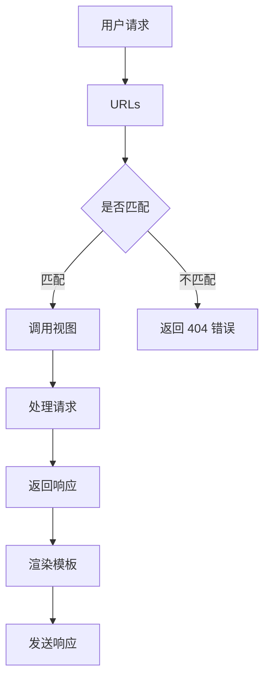

                 

 **关键词**：Django、Python、Web 开发、后端框架、ORM、MVC

**摘要**：本文将深入探讨 Django 框架，一个专为快速开发和优雅设计而生的 Python 后端框架。我们将了解其核心概念、架构设计、优势与不足，并通过实例代码展示其实际应用。

## 1. 背景介绍

Django 是由 Adrian Holovaty 和 Simon Willison 在 2005 年基于 Python 语言创建的一个开源 Web 开发框架。它遵循 Model-View-Controller（MVC）设计模式，旨在提高开发效率，减少重复工作。Django 是一个全栈框架，意味着它几乎包含了构建 Web 应用所需的所有功能，包括用户认证、数据管理、视图和模板等。

Django 被广泛用于开发各种规模的应用，从简单的博客系统到复杂的企业级应用，如 Instagram 和 YouTube。其易于使用的 ORM（对象关系映射）和数据迁移系统使得数据库操作变得简单直观。同时，Django 强调“不要重复自己”（DRY），鼓励开发者遵循最佳实践，保持代码的可维护性和可扩展性。

## 2. 核心概念与联系

### 2.1 Django 的核心概念

Django 的核心概念包括：

- **模型（Models）**：代表数据库中的表，定义了数据结构。
- **视图（Views）**：处理用户请求，返回 HTTP 响应。
- **模板（Templates）**：定义了 Web 应用的界面布局。
- **URLs**：定义了不同的 URL 路径，与视图进行映射。
- **管理界面（Admin Interface）**：提供了一个基于 Web 的接口，用于管理数据库中的数据。

### 2.2 Django 的架构设计

Django 的架构设计遵循 MVC 模式，其核心组件之间的关系可以用以下 Mermaid 流程图来描述：



## 3. 核心算法原理 & 具体操作步骤

### 3.1 算法原理概述

Django 的核心算法原理主要包括：

- **ORM（对象关系映射）**：将 Python 类映射到数据库表，简化数据库操作。
- **中间件（Middleware）**：在请求和响应处理过程中插入代码，用于日志记录、身份验证等。
- **缓存系统（Caching）**：用于提高性能，缓存数据库查询结果和视图等。

### 3.2 算法步骤详解

1. 用户请求通过 Web 服务器发送到 Django 框架。
2. Django 解析请求，根据 URLs 配置找到相应的视图函数。
3. 视图函数处理请求，可能涉及数据库操作（通过 ORM）。
4. 视图函数返回响应，可能涉及渲染模板。
5. Django 将渲染后的模板发送给用户。

### 3.3 算法优缺点

**优点**：

- 易于使用，降低了开发难度。
- 强大的 ORM 系统简化了数据库操作。
- 内置用户认证系统。
- 支持缓存，提高性能。

**缺点**：

- 某些高级功能需要额外的配置。
- 可能不如某些框架轻量级。

### 3.4 算法应用领域

Django 广泛应用于 Web 开发领域，特别适合构建快速迭代的应用。它特别适合构建以下类型的应用：

- 内容管理系统（CMS）
- 社交网络平台
- 电子商务网站
- 企业级应用

## 4. 数学模型和公式 & 详细讲解 & 举例说明

### 4.1 数学模型构建

Django 的 ORM 系统基于 SQL 语言，因此我们可以使用 SQL 来构建数学模型。以下是一个简单的示例：

```sql
CREATE TABLE users (
    id SERIAL PRIMARY KEY,
    username VARCHAR(255) UNIQUE NOT NULL,
    email VARCHAR(255) UNIQUE NOT NULL
);
```

### 4.2 公式推导过程

在 Django 中，我们可以使用 Python 类来定义模型，以下是一个简单的用户模型：

```python
class User(models.Model):
    username = models.CharField(max_length=255, unique=True)
    email = models.CharField(max_length=255, unique=True)
```

Django 将自动生成对应的 SQL 表。

### 4.3 案例分析与讲解

假设我们有一个用户表，包含用户名和邮箱字段。我们可以使用 Django 的 ORM 来查询用户数据：

```python
user = User.objects.get(username='admin')
print(user.email)
```

这行代码将返回用户名 'admin' 对应的邮箱地址。Django 会自动生成对应的 SQL 查询语句：

```sql
SELECT "users".* FROM "users" WHERE "users"."username" = 'admin';
```

## 5. 项目实践：代码实例和详细解释说明

### 5.1 开发环境搭建

首先，我们需要安装 Python 和 Django。以下是安装步骤：

```bash
# 安装 Python
# (根据操作系统选择合适的安装方法)

# 安装 Django
pip install django
```

### 5.2 源代码详细实现

接下来，我们创建一个简单的 Django 项目，并实现一个用户注册功能。

```python
# settings.py
INSTALLED_APPS = [
    'django.contrib.admin',
    'django.contrib.auth',
    'django.contrib.contenttypes',
    'django.contrib.sessions',
    'django.contrib.messages',
    'django.contrib.staticfiles',
    'myapp',  # 添加我们自己的应用
]

# views.py
from django.shortcuts import render, redirect
from .models import User
from .forms import UserForm

def register(request):
    if request.method == 'POST':
        form = UserForm(request.POST)
        if form.is_valid():
            user = User.objects.create_user(
                username=form.cleaned_data['username'],
                email=form.cleaned_data['email'],
                password=form.cleaned_data['password']
            )
            return redirect('login')
    else:
        form = UserForm()
    return render(request, 'register.html', {'form': form})
```

### 5.3 代码解读与分析

上述代码中，我们定义了一个用户注册视图 `register`。当用户提交注册表单时，视图会创建一个新的用户并重定向到登录页面。

```html
<!-- register.html -->
<form method="post">
    
    {{ form.as_p }}
    <button type="submit">注册</button>
</form>
```

这是一个简单的注册表单模板，其中使用了 Django 的表单渲染助手。

### 5.4 运行结果展示

运行 Django 服务器：

```bash
python manage.py runserver
```

在浏览器中访问 `http://127.0.0.1:8000/register/`，可以看到注册页面。

## 6. 实际应用场景

Django 被广泛应用于各种实际应用场景，包括：

- **内容管理系统（CMS）**：如 Django CMS 和 Mezzanine。
- **社交媒体平台**：如 Instagram 和 YouTube。
- **电子商务网站**：如 Newegg。
- **企业级应用**：如 Spotify 和 Netflix。

## 7. 工具和资源推荐

### 7.1 学习资源推荐

- **官方文档**：Django 官方文档是学习 Django 的最佳资源。
- **在线教程**：如 Real Python 和 Django Girls。
- **书籍**：《Django By Example》和《Two Scoops of Django》。

### 7.2 开发工具推荐

- **集成开发环境（IDE）**：PyCharm 和 Visual Studio Code。
- **代码管理工具**：Git 和 GitHub。
- **Web 服务器**：Nginx 和 Gunicorn。

### 7.3 相关论文推荐

- **“Django: The Web Framework for Perfectionists with Deadlines”**：该论文详细介绍了 Django 的设计和实现。

## 8. 总结：未来发展趋势与挑战

Django 在过去十几年中取得了巨大的成功，但未来仍面临一些挑战：

- **性能优化**：随着应用的规模不断扩大，性能优化将成为一个重要议题。
- **安全性**：随着网络攻击手段的不断升级，安全性将成为一个重要挑战。
- **生态发展**：Django 社区的持续发展对于框架的长期成功至关重要。

## 9. 附录：常见问题与解答

### 9.1 Django 与 Flask 有何区别？

Django 是一个全栈框架，提供了从数据库到 Web 服务器的一整套解决方案。而 Flask 是一个微型框架，仅提供了 Web 开发的核心功能，如路由和视图。Django 更适合快速开发和大型项目，而 Flask 更适合小型项目和灵活的定制。

### 9.2 Django 的 ORM 系统如何保证数据一致性？

Django 的 ORM 系统通过自动生成 SQL 语句来保证数据一致性。它遵循 SQL 的标准语法和规范，确保数据库操作的正确性。此外，Django 提供了事务管理，确保一系列数据库操作要么全部成功，要么全部回滚。

### 9.3 Django 是否支持缓存？

是的，Django 提供了强大的缓存系统，支持缓存数据库查询结果、视图和对象。这有助于提高性能，减少数据库负载。

## 作者署名

作者：禅与计算机程序设计艺术 / Zen and the Art of Computer Programming
----------------------------------------------------------------

（注意：以上内容仅供参考，实际撰写文章时请根据具体要求和内容进行调整和补充。）<|im_end|>

