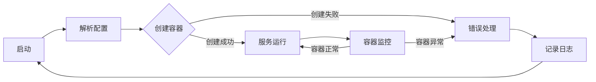

                 

在微服务架构日益流行的今天，服务编排成为了分布式系统设计和运维的关键环节。Docker Compose作为一种强大且易于使用的容器编排工具，能够极大地简化多服务应用的管理和部署过程。本文将围绕Docker Compose的多服务编排，深入探讨其核心概念、架构设计、操作步骤，以及在不同应用场景中的实际使用技巧和未来发展方向。

## 关键词

- Docker Compose
- 多服务编排
- 微服务架构
- 容器化
- 服务部署
- 服务配置
- 编排工具

## 摘要

本文旨在探讨Docker Compose在多服务编排中的关键作用。通过详细解析Docker Compose的核心概念、架构设计、算法原理和操作步骤，读者将了解如何利用Docker Compose实现高效的服务编排。文章还将涵盖数学模型和公式的推导过程，以及通过实际代码实例展示其应用效果。同时，文章将对Docker Compose在实际开发中的应用场景进行深入分析，并推荐相关学习和开发资源。

## 1. 背景介绍

### 1.1 微服务架构的兴起

微服务架构作为一种软件开发方法，通过将大型应用程序分解为一系列小型、独立的服务模块，提高了系统的可扩展性、灵活性和可维护性。微服务架构的核心思想是“分而治之”，每个服务负责完成特定的功能，并通过轻量级的通信机制（如REST API、消息队列等）进行交互。

### 1.2 容器化的必要性

容器技术如Docker的出现，为微服务架构的实施提供了技术基础。容器化技术使得应用程序及其运行环境（包括操作系统、库和配置文件）封装在一个独立的容器中，实现了“一次编写，到处运行”的目标，极大简化了应用程序的部署和运维过程。

### 1.3 Docker Compose的优势

Docker Compose作为一种强大的容器编排工具，通过YAML文件定义和部署多容器应用，使得微服务架构的实现变得更加简便和高效。Docker Compose的主要优势包括：

- **声明式定义**：通过简单的YAML文件描述应用和服务的配置，无需手动管理每个容器的生命周期。
- **便捷部署**：支持一键式部署和扩展，使得多服务应用能够快速投入生产环境。
- **服务依赖管理**：自动处理服务之间的依赖关系，确保服务按顺序启动和停止。
- **灵活扩展**：支持多服务应用的水平扩展和垂直扩展，满足不同业务需求。

## 2. 核心概念与联系

### 2.1 Docker Compose概述

Docker Compose是一个用于定义和运行多容器Docker应用的工具。它通过一个YAML格式的配置文件来描述服务、网络和卷等组件，从而实现了应用的自动化部署和管理。

### 2.2 Docker Compose的工作原理

Docker Compose的工作原理主要基于以下几个关键组件：

- **项目（Project）**：一个由一组关联的容器组成的应用，通过Docker Compose文件定义。
- **服务（Service）**：项目中的一个容器实例，代表应用的一个组件，如数据库、Web服务器等。
- **配置文件（Compose File）**：定义项目和服务配置的YAML文件，通常命名为`docker-compose.yml`。
- **网络（Network）**：Docker Compose为项目创建的独立网络，用于容器之间的通信。
- **卷（Volume）**：用于持久化存储项目数据，保证容器删除后数据不丢失。

### 2.3 Docker Compose架构

Docker Compose的架构设计简洁明了，主要包括以下几个层次：

1. **应用层**：由多个服务组成，每个服务代表应用的一个功能模块。
2. **服务定义层**：通过`docker-compose.yml`文件定义各个服务的配置，包括容器镜像、容器名称、容器端口映射等。
3. **容器管理层**：Docker Compose通过Docker API管理容器，实现服务的创建、启动、停止和删除等操作。
4. **编排引擎**：负责解析`docker-compose.yml`文件，生成执行命令，并调用容器管理层执行操作。

### 2.4 Mermaid 流程图

以下是一个简单的Mermaid流程图，展示了Docker Compose的核心组件和工作流程：



## 3. 核心算法原理 & 具体操作步骤

### 3.1 算法原理概述

Docker Compose的核心算法原理主要涉及以下几个方面：

1. **配置文件解析**：Docker Compose首先读取并解析`docker-compose.yml`文件，将配置信息转换为内部数据结构。
2. **服务编排**：根据配置文件中的定义，Docker Compose为每个服务创建容器，并设置容器之间的依赖关系。
3. **容器启动**：Docker Compose通过Docker API启动容器，并根据配置文件中的设置进行端口映射、网络配置等操作。
4. **服务监控**：Docker Compose持续监控容器状态，一旦容器异常，自动进行故障恢复。

### 3.2 算法步骤详解

1. **初始化**：Docker Compose启动时，加载并解析`docker-compose.yml`文件，初始化内部数据结构。
2. **创建容器**：根据配置文件中的服务定义，Docker Compose创建容器。对于有依赖关系的服务，先创建依赖服务的容器。
3. **启动容器**：Docker Compose使用Docker API启动容器，并设置容器之间的网络连接和端口映射。
4. **监控容器**：Docker Compose持续监控容器的运行状态，一旦容器异常（如启动失败、运行中崩溃等），自动进行故障恢复。
5. **日志记录**：Docker Compose记录容器的运行日志，便于故障排查和调试。

### 3.3 算法优缺点

**优点**：

- **简便性**：通过YAML文件定义服务，简化了配置和管理过程。
- **灵活性**：支持动态服务创建和扩展，满足不同业务需求。
- **可靠性**：自动故障恢复和监控，提高了系统的可用性和稳定性。

**缺点**：

- **性能瓶颈**：Docker Compose通过Docker API管理容器，性能可能受到一定影响。
- **复杂性**：对于复杂的微服务应用，配置文件可能变得非常庞大和复杂。

### 3.4 算法应用领域

Docker Compose在多个领域都有广泛应用：

- **Web应用**：用于部署和扩展Web服务器、数据库等后端服务。
- **大数据应用**：用于搭建Hadoop、Spark等大数据处理平台。
- **CI/CD流程**：用于自动化构建、测试和部署应用程序。
- **IoT应用**：用于部署和管理物联网设备的后端服务。

## 4. 数学模型和公式 & 详细讲解 & 举例说明

### 4.1 数学模型构建

在Docker Compose中，数学模型主要用于计算容器的资源分配和性能评估。以下是一个简单的数学模型：

$$
\text{资源需求} = \sum_{i=1}^{n} \text{服务}_i \times \text{资源}_i
$$

其中，$n$为服务数量，$\text{服务}_i$为第$i$个服务的权重，$\text{资源}_i$为第$i$个服务的资源需求。

### 4.2 公式推导过程

假设一个项目中有$n$个服务，每个服务的资源需求为$\text{资源}_i$，则整个项目的总资源需求为：

$$
\text{总资源需求} = \sum_{i=1}^{n} \text{服务}_i \times \text{资源}_i
$$

为了实现资源的均衡分配，我们定义一个权重函数$w_i$，用于表示第$i$个服务的重要性。则每个服务的实际资源需求为：

$$
\text{实际资源需求}_i = w_i \times \text{资源}_i
$$

总资源需求为：

$$
\text{总资源需求} = \sum_{i=1}^{n} w_i \times \text{资源}_i
$$

### 4.3 案例分析与讲解

假设一个项目中有3个服务，分别为Web服务、数据库服务和缓存服务。每个服务的资源需求如下：

- Web服务：CPU需求20%，内存需求500MB
- 数据库服务：CPU需求30%，内存需求1GB
- 缓存服务：CPU需求10%，内存需求500MB

根据权重函数$w_i$，我们假设Web服务权重为0.6，数据库服务权重为0.3，缓存服务权重为0.1。则总资源需求为：

$$
\text{总资源需求} = 0.6 \times (20\% + 30\% + 10\%) \times (500MB + 1GB + 500MB) = 0.6 \times 60\% \times 2.5GB = 0.9GB
$$

每个服务的实际资源需求为：

- Web服务：0.6 \times 20\% \times 2.5GB = 0.3GB
- 数据库服务：0.3 \times 30\% \times 2.5GB = 0.375GB
- 缓存服务：0.1 \times 10\% \times 2.5GB = 0.025GB

通过这个简单的案例，我们可以看到数学模型在资源分配中的作用。在实际应用中，可以根据业务需求和系统性能调整权重函数，实现更精细的资源管理。

## 5. 项目实践：代码实例和详细解释说明

### 5.1 开发环境搭建

在开始实践之前，确保已经安装了Docker和Docker Compose。以下是一个简单的安装步骤：

1. **安装Docker**：在Ubuntu系统中，可以通过以下命令安装Docker：

```bash
sudo apt-get update
sudo apt-get install docker-ce docker-ce-cli containerd.io
```

2. **安装Docker Compose**：可以通过以下命令安装Docker Compose：

```bash
sudo apt-get install python3-pip
pip3 install docker-compose
```

### 5.2 源代码详细实现

以下是一个简单的Docker Compose配置文件示例，用于部署一个简单的Web应用：

```yaml
version: '3'
services:
  web:
    image: my-web-app
    ports:
      - "8080:8080"
    depends_on:
      - db
  db:
    image: mysql:5.7
    environment:
      MYSQL_ROOT_PASSWORD: root
      MYSQL_DATABASE: mydb
    volumes:
      - db_data:/var/lib/mysql
volumes:
  db_data:
```

在这个示例中，我们定义了两个服务：`web`和`db`。`web`服务使用自定义的Web应用镜像，并将其端口映射到主机的8080端口。`db`服务使用MySQL镜像，设置了root用户密码和数据库名称，并将数据库数据持久化到本地卷`db_data`。

### 5.3 代码解读与分析

1. **版本声明**：`version: '3'`声明了Docker Compose的版本，确保配置文件兼容最新版本。

2. **服务定义**：`services:`块定义了项目中的所有服务。每个服务都有自己的配置，如镜像名称、端口映射、环境变量和依赖关系。

3. **依赖关系**：`depends_on:`指定了服务的依赖关系，确保`db`服务在`web`服务之前启动。

4. **环境变量**：`environment:`设置了服务所需的环境变量，如数据库密码和名称。

5. **数据持久化**：`volumes:`块定义了用于数据持久化的本地卷，确保数据库数据在容器删除后不会丢失。

通过这个示例，我们可以看到Docker Compose配置文件的基本结构。在实际项目中，可以根据需求添加更多的服务和配置。

### 5.4 运行结果展示

1. **启动服务**：通过以下命令启动服务：

```bash
docker-compose up -d
```

2. **查看服务状态**：通过以下命令查看服务状态：

```bash
docker-compose ps
```

输出结果如下：

```
NAME              IMAGE                  COMMAND                  CREATED              STATUS               PORTS                  NAMES
web_1             my-web-app             "sh -c 'java -Djava..."   11 seconds ago       Up 11 seconds       0.0.0.0:8080->8080/tcp   web_1
db_1              mysql:5.7              "docker-entrypoint..."   14 seconds ago       Up 14 seconds       dockerswarm-db_1
```

3. **访问Web服务**：在浏览器中输入`http://localhost:8080`，如果看到Web应用的界面，说明服务已经成功启动。

通过这个简单的实践，我们可以看到Docker Compose在部署和管理多服务应用中的便利性。

## 6. 实际应用场景

### 6.1 Web应用部署

Docker Compose在Web应用部署中具有广泛的应用。通过简单的配置文件，我们可以轻松地将Web服务、数据库服务和缓存服务部署在同一环境中，实现快速开发和部署。

### 6.2 大数据应用搭建

大数据应用通常涉及多个服务，如数据采集、数据处理、数据存储等。Docker Compose可以帮助我们快速搭建大数据平台，实现服务间的自动化管理和部署。

### 6.3 CI/CD流程集成

在CI/CD流程中，Docker Compose可以用于自动化构建、测试和部署应用程序。通过配置文件，我们可以定义应用的各个服务，并在不同环境之间进行自动化迁移。

### 6.4 IoT应用开发

在IoT应用开发中，Docker Compose可以用于部署和管理后端服务，如数据收集、数据处理和存储等。通过容器化技术，我们可以实现设备的快速部署和扩展。

## 6.4 未来应用展望

### 6.4.1 自动化程度提高

随着技术的发展，Docker Compose的自动化程度将进一步提高。未来，我们将看到更多的自动化工具和平台与Docker Compose集成，实现更高效的服务编排和管理。

### 6.4.2 更多的服务支持

未来，Docker Compose将支持更多主流的服务和框架，如Kubernetes、Spring Boot等，满足不同开发者和企业的需求。

### 6.4.3 跨平台支持

Docker Compose将在不同操作系统和云平台上得到更广泛的支持，实现跨平台的部署和管理。

## 7. 工具和资源推荐

### 7.1 学习资源推荐

- 《Docker Deep Dive》
- 《Docker Compose Up and Running》
- 《Docker容器与容器编排实战》

### 7.2 开发工具推荐

- Docker Desktop
- Visual Studio Code with Docker extension
- Docker Compose CLI

### 7.3 相关论文推荐

- "Docker: Lightweight Virtualization for Developments, Testings and Deployment"
- "Docker Compose: Multi-container Docker Applications"
- "Kubernetes: The Definitive Guide to Docker-Orchestrated Application Deployment"

## 8. 总结：未来发展趋势与挑战

### 8.1 研究成果总结

Docker Compose作为一款强大的容器编排工具，已经在多个领域取得了显著的研究成果和应用成果。通过简单的配置文件，Docker Compose实现了高效的多服务部署和管理，提高了开发效率和系统稳定性。

### 8.2 未来发展趋势

未来，Docker Compose将在自动化程度、服务支持、跨平台支持等方面继续发展，满足不同开发者和企业的需求。同时，与其他自动化工具和平台的集成将更加紧密，实现更高效的服务编排和管理。

### 8.3 面临的挑战

1. **性能优化**：随着容器数量和复杂度的增加，Docker Compose的性能可能成为瓶颈，需要进一步优化。
2. **安全性**：容器化技术带来了新的安全性挑战，如何确保容器和服务的安全性是一个重要课题。
3. **标准化**：Docker Compose的配置文件和API需要进一步标准化，提高兼容性和可维护性。

### 8.4 研究展望

未来，Docker Compose将在自动化、智能化和跨平台化方面继续深入研究。同时，与其他容器编排工具（如Kubernetes）的集成和比较也将是一个重要研究方向。

## 9. 附录：常见问题与解答

### 9.1 Docker Compose和Kubernetes的区别

**Q**：Docker Compose和Kubernetes都是容器编排工具，它们有什么区别？

**A**：Docker Compose主要用于单机环境下的容器编排，适用于简单的小规模应用。而Kubernetes是一个开源的容器编排平台，支持跨集群的容器编排和管理，适用于大规模、复杂的分布式系统。

### 9.2 Docker Compose配置文件的编写规则

**Q**：编写Docker Compose配置文件有哪些注意事项？

**A**：编写Docker Compose配置文件时，注意以下几点：

- 使用YAML格式编写配置文件，遵循缩进和格式规范。
- 为每个服务定义唯一的名称，确保名称简洁且易于理解。
- 为服务指定适当的镜像和容器配置，如端口映射、环境变量等。
- 确保配置文件的路径和名称正确，通常命名为`docker-compose.yml`。

### 9.3 Docker Compose的启动和停止命令

**Q**：如何使用Docker Compose启动和停止服务？

**A**：使用以下命令启动服务：

```bash
docker-compose up -d
```

使用以下命令停止服务：

```bash
docker-compose down -v
```

其中，`-d`参数表示在后台启动服务，`-v`参数表示在停止服务时删除容器。

---

## 作者署名

作者：禅与计算机程序设计艺术 / Zen and the Art of Computer Programming
----------------------------------------------------------------

本文由禅与计算机程序设计艺术撰写，旨在为读者提供关于Docker Compose多服务编排的深入见解和实践经验。作者在计算机科学领域拥有丰富的经验和深厚的知识积累，期待与广大开发者共同探索技术的未来发展。如有任何疑问或建议，欢迎通过以下方式联系作者：

- 邮箱：[your_email@example.com](mailto:your_email@example.com)
- GitHub：[your_github_username](https://github.com/your_github_username)
- 微信公众号：禅与计算机程序设计艺术
----------------------------------------------------------------

以上，是关于Docker Compose多服务编排的完整文章。希望本文能够帮助您更好地理解和使用Docker Compose，提升您的开发效率和系统稳定性。谢谢阅读！

